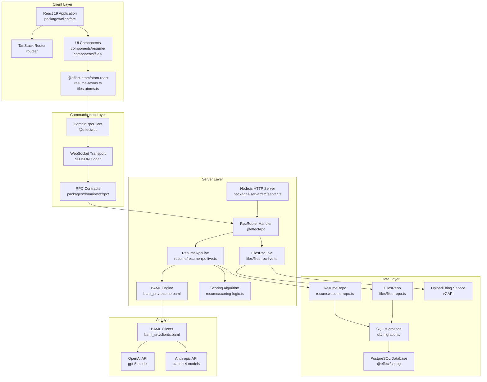
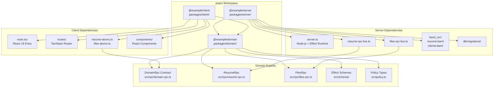
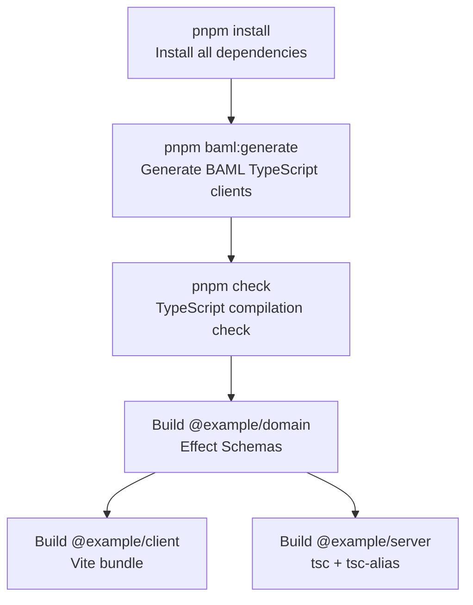
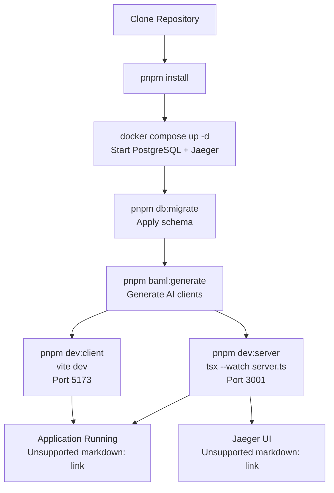
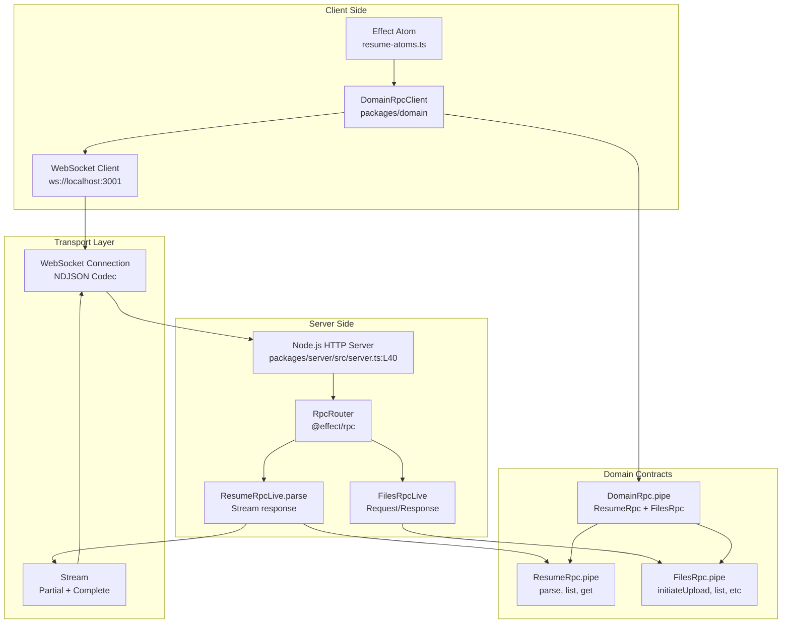
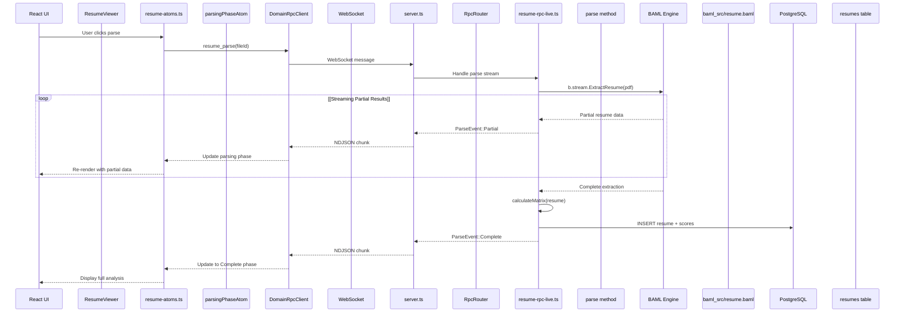

# Architecture

> **Relevant source files**
> * [.gitignore](https://github.com/oscaromsn/TalentScore/blob/428ed1eb/.gitignore)
> * [README.md](https://github.com/oscaromsn/TalentScore/blob/428ed1eb/README.md)
> * [bun.lock](https://github.com/oscaromsn/TalentScore/blob/428ed1eb/bun.lock)
> * [package.json](https://github.com/oscaromsn/TalentScore/blob/428ed1eb/package.json)
> * [packages/server/package.json](https://github.com/oscaromsn/TalentScore/blob/428ed1eb/packages/server/package.json)

This document describes the overall system architecture of TalentScore, including the monorepo structure, technology stack, and how the major components interact across client, server, and domain boundaries. For detailed information about specific subsystems, see [Monorepo Structure](/oscaromsn/TalentScore/2.1-monorepo-structure), [Technology Stack](/oscaromsn/TalentScore/2.2-technology-stack), and [Effect Ecosystem Integration](/oscaromsn/TalentScore/2.3-effect-ecosystem-integration). For domain contracts and schemas, see [Domain Package](/oscaromsn/TalentScore/3-domain-package). For server implementation details, see [Server Package](/oscaromsn/TalentScore/4-server-package). For client implementation, see [Client Package](/oscaromsn/TalentScore/5-client-package).

## Purpose and Scope

This page provides a high-level view of the TalentScore architecture, explaining:

* The three-package monorepo structure and dependency flow
* The five-layer system architecture (Client, Communication, Server, Data, AI)
* How pnpm workspaces organize code and dependencies
* The role of each major technology in the stack
* Communication patterns using Effect RPC over WebSocket

## System Architecture Layers

TalentScore is organized into five distinct architectural layers, each with clear responsibilities and boundaries:



**Sources:** [README.md L1-L137](https://github.com/oscaromsn/TalentScore/blob/428ed1eb/README.md#L1-L137)

 [package.json L1-L68](https://github.com/oscaromsn/TalentScore/blob/428ed1eb/package.json#L1-L68)

 [packages/server/package.json L1-L44](https://github.com/oscaromsn/TalentScore/blob/428ed1eb/packages/server/package.json#L1-L44)

## Monorepo Package Structure

The codebase is organized as a pnpm workspace monorepo with three packages that follow a contract-first architecture pattern:



### Package Dependency Rules

| Package | Depends On | Purpose |
| --- | --- | --- |
| `@example/domain` | None (foundational) | Defines RPC contracts, schemas, and policies |
| `@example/server` | `@example/domain` | Implements server-side RPC handlers and business logic |
| `@example/client` | `@example/domain` | Implements client-side UI and state management |

The unidirectional dependency flow (Domain ← Server, Domain ← Client) ensures:

1. **Contract-First Development**: Changes to APIs require explicit contract updates
2. **Independent Deployment**: Server and client can be deployed separately
3. **Shared Type Safety**: Both sides share runtime-validated schemas
4. **No Circular Dependencies**: Clean separation of concerns

**Sources:** [package.json L9-L10](https://github.com/oscaromsn/TalentScore/blob/428ed1eb/package.json#L9-L10)

 [README.md L87-L96](https://github.com/oscaromsn/TalentScore/blob/428ed1eb/README.md#L87-L96)

## Technology Stack Overview

TalentScore is built on the Effect ecosystem with specialized tools for AI, file management, and observability:

### Core Runtime

| Technology | Version | Purpose | Package |
| --- | --- | --- | --- |
| `effect` | 3.19.8 | Functional runtime with error handling, concurrency | All packages |
| `@effect/platform` | 0.93.6 | Cross-platform abstractions (HTTP, File, etc.) | Server |
| `@effect/platform-node` | 0.103.0 | Node.js-specific implementations | Server |
| `@effect/platform-browser` | 0.73.0 | Browser-specific implementations | Client |

### Communication Layer

| Technology | Version | Purpose |
| --- | --- | --- |
| `@effect/rpc` | 0.72.2 | Type-safe RPC over WebSocket/HTTP |
| WebSocket | Native | Real-time bidirectional communication |
| NDJSON Codec | Built-in | Streaming JSON codec for RPC |

### Data Layer

| Technology | Version | Purpose |
| --- | --- | --- |
| `@effect/sql` | 0.48.6 | Type-safe SQL abstractions |
| `@effect/sql-pg` | 0.49.7 | PostgreSQL driver integration |
| PostgreSQL | (External) | Relational database |
| UploadThing | v7 API | File storage service |

### AI/ML Stack

| Technology | Version | Purpose |
| --- | --- | --- |
| `@boundaryml/baml` | 0.214.0 | Structured LLM extraction with type safety |
| OpenAI API | (External) | gpt-5 model for resume parsing |
| Anthropic API | (External) | claude-4 models (fallback) |

### Frontend Stack

| Technology | Version | Purpose |
| --- | --- | --- |
| React | 19 | UI library with concurrent rendering |
| `@effect-atom/atom-react` | 0.4.2 | Reactive state management with Effect |
| TanStack Router | Latest | File-based, type-safe routing |
| Tailwind CSS | 4.0.4 | Utility-first styling |

### Observability

| Technology | Version | Purpose |
| --- | --- | --- |
| `@effect/opentelemetry` | 0.59.1 | OpenTelemetry integration |
| Jaeger | (External) | Distributed tracing backend |
| `@opentelemetry/sdk-trace-node` | 2.0.0 | Node.js tracing SDK |

**Sources:** [package.json L49-L67](https://github.com/oscaromsn/TalentScore/blob/428ed1eb/package.json#L49-L67)

 [packages/server/package.json L22-L35](https://github.com/oscaromsn/TalentScore/blob/428ed1eb/packages/server/package.json#L22-L35)

 [README.md L109-L117](https://github.com/oscaromsn/TalentScore/blob/428ed1eb/README.md#L109-L117)

## Effect Version Synchronization

All Effect ecosystem packages are pinned to synchronized versions using pnpm overrides to prevent version conflicts:

```

```

This ensures that all packages in the monorepo use compatible Effect versions, preventing runtime errors from version mismatches.

**Sources:** [package.json L53-L67](https://github.com/oscaromsn/TalentScore/blob/428ed1eb/package.json#L53-L67)

## Build and Dependency Management

TalentScore uses pnpm workspaces with specific tooling for code generation and type safety:

### Build Pipeline



### Key Build Commands

| Command | Implementation | Purpose |
| --- | --- | --- |
| `pnpm baml:generate` | `bunx baml-cli generate --from packages/server/baml_src` | Generate TypeScript clients from BAML definitions |
| `pnpm db:migrate` | `pnpm --filter @example/server db:migrate` | Apply SQL migrations to PostgreSQL |
| `pnpm check` | `tsc -b` | Build and type-check all packages |
| `pnpm build` | Sequential: domain → client → server | Build production bundles |

### Development Workflow



**Sources:** [package.json L12-L29](https://github.com/oscaromsn/TalentScore/blob/428ed1eb/package.json#L12-L29)

 [README.md L30-L82](https://github.com/oscaromsn/TalentScore/blob/428ed1eb/README.md#L30-L82)

## Communication Architecture

TalentScore uses Effect RPC for type-safe, streaming communication between client and server:



### RPC Protocol Features

| Feature | Implementation | Benefit |
| --- | --- | --- |
| **Type Safety** | `packages/domain/src/rpc/` contracts | Compile-time validation of requests/responses |
| **Streaming** | `Stream<ParseEvent>` in `resume_parse` | Real-time UI updates during LLM parsing |
| **Error Handling** | Effect error types (e.g., `ParsingFailedError`) | Structured, typed error propagation |
| **Policy Enforcement** | `CurrentUser` policy in contracts | Multi-tenant isolation |
| **Codec** | NDJSON over WebSocket | Efficient, line-delimited JSON streaming |

**Sources:** [README.md L25-L28](https://github.com/oscaromsn/TalentScore/blob/428ed1eb/README.md#L25-L28)

 [README.md L98-L107](https://github.com/oscaromsn/TalentScore/blob/428ed1eb/README.md#L98-L107)

## Data Flow Architecture

The following diagram shows how data flows through the system during a typical resume parsing operation:



### Key Data Flow Patterns

1. **Streaming Updates**: LLM parsing results stream from BAML → Server → Client → UI in real-time
2. **Optimistic UI**: Client updates immediately with partial data before server confirmation
3. **Type Safety Boundary**: All data crosses the network through Effect Schema-validated contracts
4. **Error Propagation**: Failures at any layer propagate as typed Effect errors to the UI

**Sources:** [README.md L98-L107](https://github.com/oscaromsn/TalentScore/blob/428ed1eb/README.md#L98-L107)

## Architectural Principles

TalentScore follows these key architectural principles:

### Separation of Concerns

* **Domain**: Pure type definitions and contracts (no runtime dependencies)
* **Server**: Business logic, database access, external service integration
* **Client**: UI rendering, user interactions, optimistic state management

### Contract-First Design

1. Define RPC contracts in `packages/domain/src/rpc/`
2. Implement server handlers in `packages/server/src/public/`
3. Consume contracts in `packages/client/src/atoms/`
4. TypeScript ensures both sides stay synchronized

### Streaming Architecture

* Resume parsing uses `Stream<ParseEvent>` for progressive UI updates
* File uploads track progress through phase transitions
* WebSocket connection enables bidirectional streaming
* NDJSON codec efficiently handles line-delimited JSON

### Type Safety Across Boundaries

* Effect Schemas provide runtime validation
* BAML generates type-safe LLM clients
* RPC contracts enforce compile-time type checking
* No `any` types at architectural boundaries

### Functional Error Handling

* All errors are typed Effect errors (e.g., `ParsingFailedError`, `UnauthorizedError`)
* Error handling is explicit in function signatures
* No thrown exceptions cross package boundaries
* Retry policies defined at the Effect layer

**Sources:** [README.md L3-L18](https://github.com/oscaromsn/TalentScore/blob/428ed1eb/README.md#L3-L18)

 [README.md L25-L28](https://github.com/oscaromsn/TalentScore/blob/428ed1eb/README.md#L25-L28)

## Infrastructure Dependencies

TalentScore requires the following external services:

### Development Dependencies

| Service | Port | Purpose | Configuration |
| --- | --- | --- | --- |
| PostgreSQL | 5432 | Primary database | `DATABASE_URL` in `.env` |
| Jaeger | 16686 | Distributed tracing UI | Auto-configured in `server.ts` |

### Production Dependencies

| Service | Configuration | Purpose |
| --- | --- | --- |
| PostgreSQL | `DATABASE_URL` | Persistent storage for resumes, files, folders |
| UploadThing | `UPLOADTHING_TOKEN` | File upload and storage service |
| OpenAI API | `OPENAI_API_KEY` | LLM for resume parsing |
| Anthropic API | (Optional) | Fallback LLM provider |

### Docker Compose Setup

The repository includes a `docker-compose.yml` for local development:

```yaml
Services:
- postgres:17 (Port 5432)
- jaegertracing/all-in-one:1.62.0 (Ports 16686, 4318)
```

**Sources:** [README.md L30-L82](https://github.com/oscaromsn/TalentScore/blob/428ed1eb/README.md#L30-L82)

## File Organization Patterns

The monorepo follows consistent file organization patterns:

### Server Package Structure

```markdown
packages/server/src/
├── server.ts                 # HTTP server + RPC router
├── db/
│   ├── migrations/           # SQL migration files
│   └── scripts/              # Database utility scripts
├── public/
│   ├── resume/
│   │   ├── resume-rpc-live.ts    # ResumeRpc implementation
│   │   ├── resume-repo.ts        # Database access layer
│   │   └── scoring-logic.ts      # Scoring algorithm
│   └── files/
│       ├── files-rpc-live.ts     # FilesRpc implementation
│       └── files-repo.ts         # Database access layer
└── baml_src/
    ├── resume.baml           # BAML extraction schema
    └── clients.baml          # LLM client configurations
```

### Client Package Structure

```markdown
packages/client/src/
├── main.tsx                  # React entry point
├── routes/                   # TanStack Router routes
├── atoms/
│   ├── resume-atoms.ts       # Resume state management
│   └── files-atoms.ts        # File state management
└── components/
    ├── resume/               # Resume analysis UI
    └── files/                # File management UI
```

### Domain Package Structure

```markdown
packages/domain/src/
├── rpc/
│   ├── domain-rpc.ts         # Merged RPC contract
│   ├── resume-rpc.ts         # Resume operations
│   ├── files-rpc.ts          # File operations
│   └── event-stream-rpc.ts   # Real-time events
├── schema/                   # Effect Schema definitions
└── policy.ts                 # Policy types (CurrentUser)
```

**Sources:** [README.md L87-L96](https://github.com/oscaromsn/TalentScore/blob/428ed1eb/README.md#L87-L96)

 [.gitignore L1-L37](https://github.com/oscaromsn/TalentScore/blob/428ed1eb/.gitignore#L1-L37)