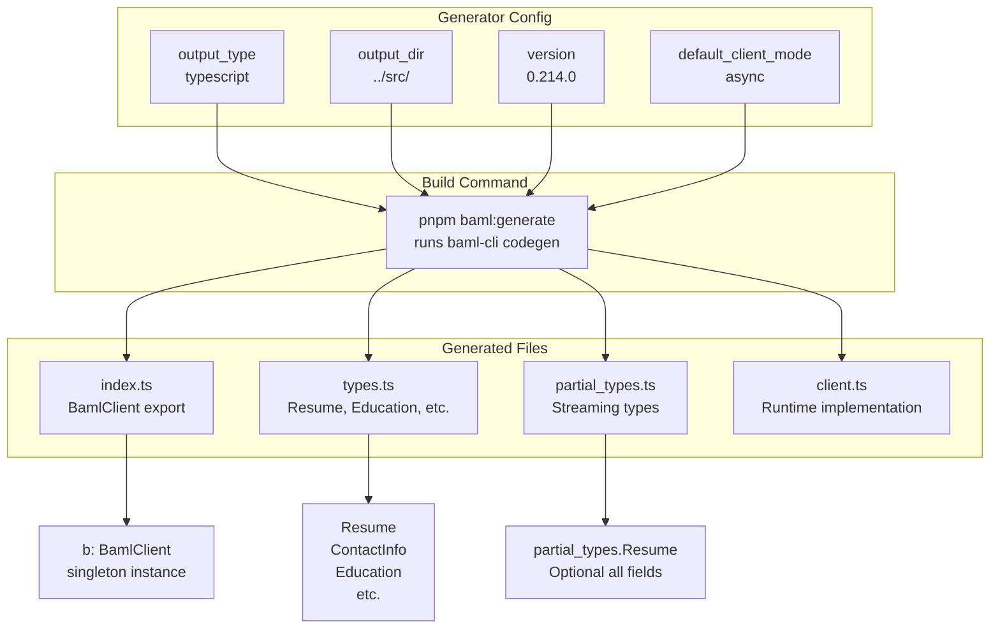
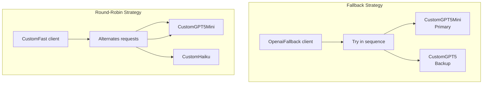
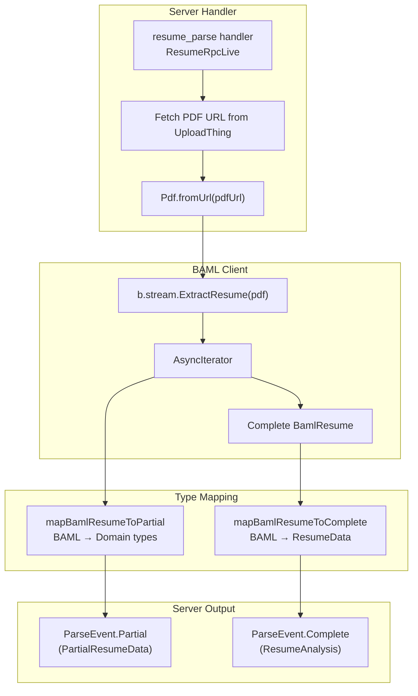

# BAML Integration

> **Relevant source files**
> * [packages/server/baml_src/clients.baml](https://github.com/oscaromsn/TalentScore/blob/428ed1eb/packages/server/baml_src/clients.baml)
> * [packages/server/baml_src/generators.baml](https://github.com/oscaromsn/TalentScore/blob/428ed1eb/packages/server/baml_src/generators.baml)
> * [packages/server/baml_src/resume.baml](https://github.com/oscaromsn/TalentScore/blob/428ed1eb/packages/server/baml_src/resume.baml)

This document explains how TalentScore uses **BAML** (BoundaryML) version 0.214.0 to achieve type-safe, structured extraction from unstructured resume PDFs using Large Language Models (LLMs). BAML acts as a declarative configuration layer between the application and LLM providers, transforming prompt engineering into a type-checked, versioned contract.

**Scope**: This page covers the BAML configuration files in `packages/server/baml_src/`, the code generation pipeline, and how BAML-generated TypeScript clients integrate with the server's resume processing logic. For the server-side implementation that orchestrates BAML extraction, see [Resume RPC Implementation](/oscaromsn/TalentScore/4.4.1-resume-rpc-implementation). For the scoring algorithm that consumes BAML output, see [Scoring Algorithm](/oscaromsn/TalentScore/4.4.2-scoring-algorithm).

---

## BAML Architecture Overview

BAML operates as a **compile-time type system** for LLM interactions, translating declarative schema definitions (`.baml` files) into runtime-safe TypeScript clients. The system provides three key guarantees:

1. **Schema-Driven Extraction**: LLM prompts are automatically constructed from BAML type definitions
2. **Streaming Type Safety**: Partial results during streaming are validated against the schema
3. **Provider Abstraction**: LLM provider selection, retry policies, and fallback strategies are configuration, not code

```

```

**Diagram**: BAML architecture showing the compile-time code generation pipeline and runtime execution flow. The `b` client object is the generated interface to all BAML functions.

**Sources**: [packages/server/baml_src/resume.baml](https://github.com/oscaromsn/TalentScore/blob/428ed1eb/packages/server/baml_src/resume.baml)

 [packages/server/baml_src/clients.baml](https://github.com/oscaromsn/TalentScore/blob/428ed1eb/packages/server/baml_src/clients.baml)

 [packages/server/baml_src/generators.baml](https://github.com/oscaromsn/TalentScore/blob/428ed1eb/packages/server/baml_src/generators.baml)

---

## BAML Source File Structure

TalentScore's BAML configuration is split into three files in `packages/server/baml_src/`:

| File | Purpose | Key Contents |
| --- | --- | --- |
| [`resume.baml`](https://github.com/oscaromsn/TalentScore/blob/428ed1eb/`resume.baml`) | Resume extraction schema and function | 5 enums, 7 classes, 1 extraction function, 1 test |
| [`clients.baml`](https://github.com/oscaromsn/TalentScore/blob/428ed1eb/`clients.baml`) | LLM client configurations | 6 client definitions, 2 retry policies |
| [`generators.baml`](https://github.com/oscaromsn/TalentScore/blob/428ed1eb/`generators.baml`) | Code generation settings | TypeScript generator targeting `../src/` |

### File: resume.baml

This file defines the complete data model for structured resume extraction. It contains:

**Enums** (Lines 5-48):

* `EducationLevel`: 6 levels from `ENSINO_MEDIO` to `DOUTORADO`
* `EducationStatus`: 4 states including `EM_ANDAMENTO` and `INCOMPLETO`
* `EmploymentType`: 5 types including `CLT`, `PJ`, `ESTAGIO`
* `LanguageProficiency`: 5 levels from `BASICO` to `NATIVO`
* `SkillCategory`: 10 categories including `PROGRAMMING_LANGUAGE`, `FRAMEWORK`, `CLOUD`

**Data Model Classes** (Lines 54-110):

```yaml
ContactInfo: name, email, phone, linkedin_url, github_url, portfolio_url, location
Education: institution, degree, field_of_study, level, status, start_year, end_year
Experience: company, title, employment_type, start_month, start_year, end_month, 
            end_year, is_current, description, technologies[]
Skill: name, category, years_experience
Language: name, proficiency
Certification: name, issuer, year, expiration_year
Project: name, description, technologies[], url
```

**Main Resume Class** (Lines 116-125):

* Aggregates all data models: `contact`, `summary`, arrays of `education`, `experiences`, `skills`, `languages`, `certifications`, `projects`

**ExtractResume Function** (Lines 131-147):

* Input: `document: pdf` (BAML's built-in PDF type)
* Output: `Resume` (fully typed)
* Client: `CustomGPT5` (defined in `clients.baml`)
* Prompt: OCR-style extraction with explicit instructions to avoid inference

**Sources**: [packages/server/baml_src/resume.baml L1-L195](https://github.com/oscaromsn/TalentScore/blob/428ed1eb/packages/server/baml_src/resume.baml#L1-L195)

---

## Code Generation Pipeline

BAML uses a **generator** to transform `.baml` definitions into TypeScript code. The generator configuration is minimal but critical:



**Diagram**: Code generation flow from `generators.baml` configuration through `baml:generate` command to TypeScript artifacts.

### Generator Configuration Details

[packages/server/baml_src/generators.baml L4-L18](https://github.com/oscaromsn/TalentScore/blob/428ed1eb/packages/server/baml_src/generators.baml#L4-L18)

 defines:

* **output_type**: `"typescript"` — Generates TypeScript/Node.js compatible code
* **output_dir**: `"../src/"` — Relative to `baml_src/`, outputs to `packages/server/src/`
* **version**: `"0.214.0"` — Must match installed `@boundaryml/baml` package version
* **default_client_mode**: `async` — All generated functions return `Promise<T>`

### Generated Type System

BAML generates three categories of types:

1. **Full Types** (`types.ts`): Exact mappings of BAML classes to TypeScript interfaces * Example: `Resume` interface with all required fields * Enums are generated as TypeScript string union types
2. **Partial Types** (`partial_types.ts`): Streaming-compatible versions with all fields optional * Example: `partial_types.Resume` where every field is `T | undefined` * Enables progressive UI updates during LLM streaming
3. **Client Types** (`client.ts`): Runtime validation and serialization logic * Handles PDF encoding (base64 for OpenAI, URL for Anthropic) * Validates LLM responses against schemas * Manages retry policies and fallback strategies

**Sources**: [packages/server/baml_src/generators.baml L1-L19](https://github.com/oscaromsn/TalentScore/blob/428ed1eb/packages/server/baml_src/generators.baml#L1-L19)

---

## LLM Client Configuration Strategy

BAML abstracts LLM providers through **client definitions** in `clients.baml`. TalentScore configures six clients with different characteristics:

### Primary Clients

| Client | Provider | Model | Retry Policy | Use Case |
| --- | --- | --- | --- | --- |
| `CustomGPT5` | `openai-responses` | `gpt-5` | Default (none) | Production resume extraction |
| `CustomOpus4` | `anthropic` | `claude-opus-4-1-20250805` | Default | High-quality alternative |
| `CustomSonnet4` | `anthropic` | `claude-sonnet-4-20250514` | Default | Balanced performance |
| `CustomGPT5Mini` | `openai-responses` | `gpt-5-mini` | `Exponential` | Cost-optimized extraction |
| `CustomHaiku` | `anthropic` | `claude-3-5-haiku-20241022` | `Constant` | Fast, lightweight tasks |

**Sources**: [packages/server/baml_src/clients.baml L4-L58](https://github.com/oscaromsn/TalentScore/blob/428ed1eb/packages/server/baml_src/clients.baml#L4-L58)

### PDF Handling Configuration

The `CustomGPT5` client includes special PDF configuration:

```
client<llm> CustomGPT5 {
  provider openai-responses
  options {
    model "gpt-5"
    api_key env.OPENAI_API_KEY
    media_url_handler {
      pdf "send_base64"
    }
  }
}
```

[packages/server/baml_src/clients.baml L4-L14](https://github.com/oscaromsn/TalentScore/blob/428ed1eb/packages/server/baml_src/clients.baml#L4-L14)

* **media_url_handler**: Instructs BAML to encode PDFs as base64 for OpenAI's media API
* Without this, OpenAI would receive raw URLs (which it doesn't support)
* Anthropic clients use default URL passing

### Composite Clients

BAML supports **strategy-based client composition**:



**Diagram**: Composite client strategies for load balancing (`CustomFast`) and resilience (`OpenaiFallback`).

**Round-Robin** ([packages/server/baml_src/clients.baml L112-L118](https://github.com/oscaromsn/TalentScore/blob/428ed1eb/packages/server/baml_src/clients.baml#L112-L118)

):

* Distributes load across `CustomGPT5Mini` and `CustomHaiku`
* Useful for rate limit management across providers

**Fallback** ([packages/server/baml_src/clients.baml L121-L127](https://github.com/oscaromsn/TalentScore/blob/428ed1eb/packages/server/baml_src/clients.baml#L121-L127)

):

* Tries `CustomGPT5Mini` first (cost-optimized)
* Falls back to `CustomGPT5` if the mini model fails
* Ensures reliability without sacrificing cost efficiency

**Sources**: [packages/server/baml_src/clients.baml L112-L127](https://github.com/oscaromsn/TalentScore/blob/428ed1eb/packages/server/baml_src/clients.baml#L112-L127)

---

## Retry Policy Configuration

BAML defines two retry policies with different backoff strategies:

### Constant Retry Policy

```
retry_policy Constant {
  max_retries 3
  strategy {
    type constant_delay
    delay_ms 200
  }
}
```

[packages/server/baml_src/clients.baml L130-L136](https://github.com/oscaromsn/TalentScore/blob/428ed1eb/packages/server/baml_src/clients.baml#L130-L136)

* **max_retries**: 3 attempts total (1 initial + 2 retries)
* **delay_ms**: Fixed 200ms wait between attempts
* **Use case**: Fast, predictable retry behavior for transient errors
* **Applied to**: `CustomHaiku` client

### Exponential Retry Policy

```
retry_policy Exponential {
  max_retries 2
  strategy {
    type exponential_backoff
    delay_ms 300
    multiplier 1.5
    max_delay_ms 10000
  }
}
```

[packages/server/baml_src/clients.baml L138-L146](https://github.com/oscaromsn/TalentScore/blob/428ed1eb/packages/server/baml_src/clients.baml#L138-L146)

* **max_retries**: 2 attempts total (1 initial + 1 retry)
* **Initial delay**: 300ms
* **Backoff multiplier**: 1.5x per retry (300ms → 450ms)
* **Max delay cap**: 10 seconds
* **Use case**: Graceful backoff for rate-limited or overloaded APIs
* **Applied to**: `CustomGPT5Mini` client

**Retry Timing Comparison**:

| Policy | Attempt 1 | Attempt 2 | Attempt 3 | Total Time (worst case) |
| --- | --- | --- | --- | --- |
| Constant | 0ms | +200ms | +200ms | 400ms + request time |
| Exponential | 0ms | +300ms | +450ms | 750ms + request time |

**Sources**: [packages/server/baml_src/clients.baml L130-L146](https://github.com/oscaromsn/TalentScore/blob/428ed1eb/packages/server/baml_src/clients.baml#L130-L146)

---

## Type Safety Guarantees

BAML enforces type safety at three distinct stages:

```mermaid
sequenceDiagram
  participant Developer
  participant (writes .baml)
  participant BAML Compiler
  participant (validates schema)
  participant Generated Client
  participant (validates LLM output)
  participant LLM Provider
  participant (generates JSON)
  participant Server Code
  participant (consumes types)

  Developer->>BAML Compiler: Define Resume class in resume.baml
  BAML Compiler->>BAML Compiler: Validate schema syntax
  BAML Compiler->>Generated Client: Generate TypeScript types
  note over Generated Client,(validates LLM output): Resume interface
  Server Code->>Generated Client: b.ExtractResume(pdf)
  Generated Client->>LLM Provider: Structured prompt + schema
  LLM Provider-->>Generated Client: Partial JSON chunk
  Generated Client->>Generated Client: Validate against partial_types.Resume
  Generated Client-->>Server Code: partial_types.Resume | null
  LLM Provider-->>Generated Client: Complete JSON
  Generated Client->>Generated Client: Validate against Resume schema
  Generated Client-->>Server Code: Resume | ValidationError
  Server Code->>Server Code: Type-safe access to resume.contact.email
```

**Diagram**: Three-stage type safety enforcement from compile-time schema validation through runtime LLM output validation.

### Compile-Time Safety

When `pnpm baml:generate` runs:

1. **Schema validation**: BAML parses all `.baml` files and checks for: * Valid enum values * Correct class field types * Function signature consistency * Client references exist
2. **TypeScript generation**: Produces interfaces matching BAML schemas exactly: ``` ```
3. **IDE integration**: TypeScript LSP provides autocomplete, type checking, and refactoring support

### Runtime Safety

During LLM extraction:

1. **Streaming validation**: Each partial result is validated against `partial_types.Resume` * Invalid JSON is caught and reported * Missing required fields are allowed (all fields optional during streaming) * Type mismatches (e.g., string instead of int) trigger validation errors
2. **Final validation**: Complete result must satisfy the full `Resume` schema * All required fields must be present * Enum values must match defined options * Array types must contain valid elements
3. **Error propagation**: Validation failures return typed errors, not runtime exceptions

**Sources**: [packages/server/baml_src/resume.baml L1-L195](https://github.com/oscaromsn/TalentScore/blob/428ed1eb/packages/server/baml_src/resume.baml#L1-L195)

 [packages/server/baml_src/generators.baml L1-L19](https://github.com/oscaromsn/TalentScore/blob/428ed1eb/packages/server/baml_src/generators.baml#L1-L19)

---

## Integration with Server Code

The server imports BAML-generated code through the `b` client singleton:

```

```

The `ResumeRpcLive` service uses BAML for streaming extraction:



**Diagram**: Data flow from server handler through BAML streaming extraction to domain-typed events. Note the type mapping layer that adapts BAML types to domain schemas.

### Key Integration Points

1. **PDF Input**: BAML's `Pdf` type handles both URLs and base64 * Server fetches PDF URL from UploadThing * `Pdf.fromUrl(url)` creates BAML-compatible PDF object
2. **Streaming API**: `b.stream.ExtractResume(pdf)` returns `AsyncIterator` * Each iteration yields `partial_types.Resume | null` * `null` indicates parsing in progress (no valid partial result yet) * Server maps each valid partial to `PartialResumeData` for domain layer
3. **Final Result**: Iterator completes with fully typed `Resume` * Server maps to domain `ResumeData` type * Passes to scoring logic for matrix calculation * Constructs `ResumeAnalysis` with scores
4. **Error Handling**: BAML exceptions are caught and mapped to domain errors * Validation failures become `ParsingFailedError` * LLM API errors surface through Effect error channel * Retry policies handle transient failures automatically

**Sources**: High-level diagrams (Diagram 3: Resume Processing AI Pipeline)

---

## Summary

BAML provides TalentScore with:

* **Declarative LLM Configuration**: All prompt engineering, client selection, and retry logic lives in `.baml` files
* **Compile-Time Type Safety**: TypeScript generation ensures schema changes propagate through the codebase
* **Streaming Support**: Progressive extraction with runtime-validated partial results
* **Provider Flexibility**: Swap LLM providers (OpenAI, Anthropic, AWS Bedrock, etc.) via configuration
* **Production Resilience**: Built-in retry policies, fallback strategies, and error handling

The generated `b` client is the single interface for all LLM operations, abstracting away provider-specific details and ensuring type-safe communication between unstructured data (PDFs) and structured domain models.

**Sources**: [packages/server/baml_src/resume.baml](https://github.com/oscaromsn/TalentScore/blob/428ed1eb/packages/server/baml_src/resume.baml)

 [packages/server/baml_src/clients.baml](https://github.com/oscaromsn/TalentScore/blob/428ed1eb/packages/server/baml_src/clients.baml)

 [packages/server/baml_src/generators.baml](https://github.com/oscaromsn/TalentScore/blob/428ed1eb/packages/server/baml_src/generators.baml)