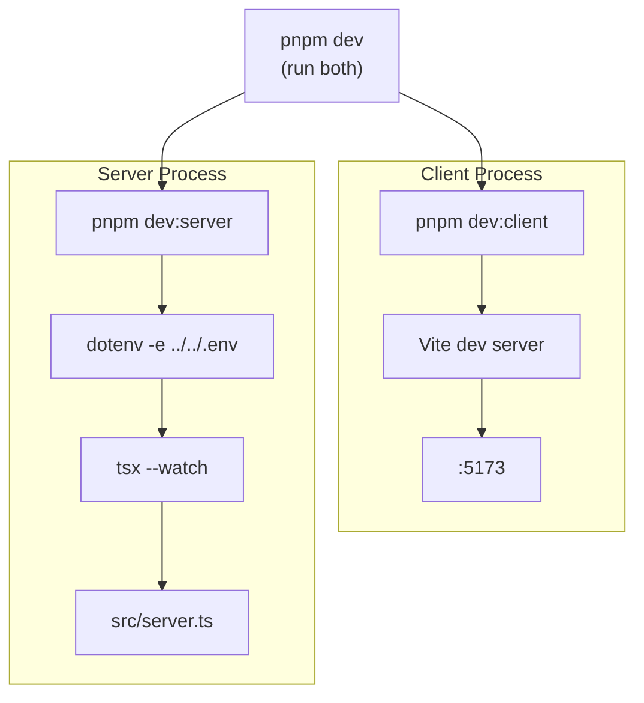
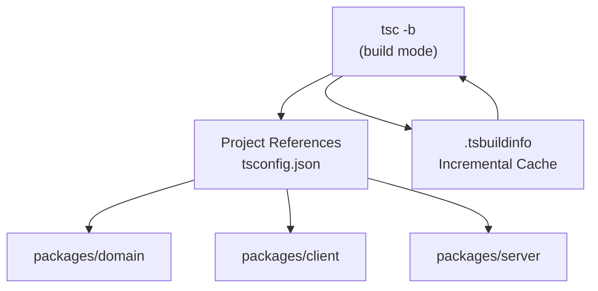
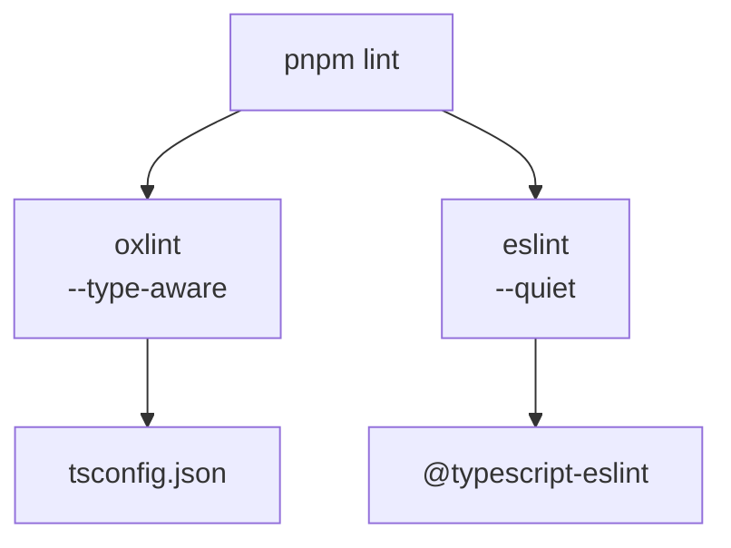
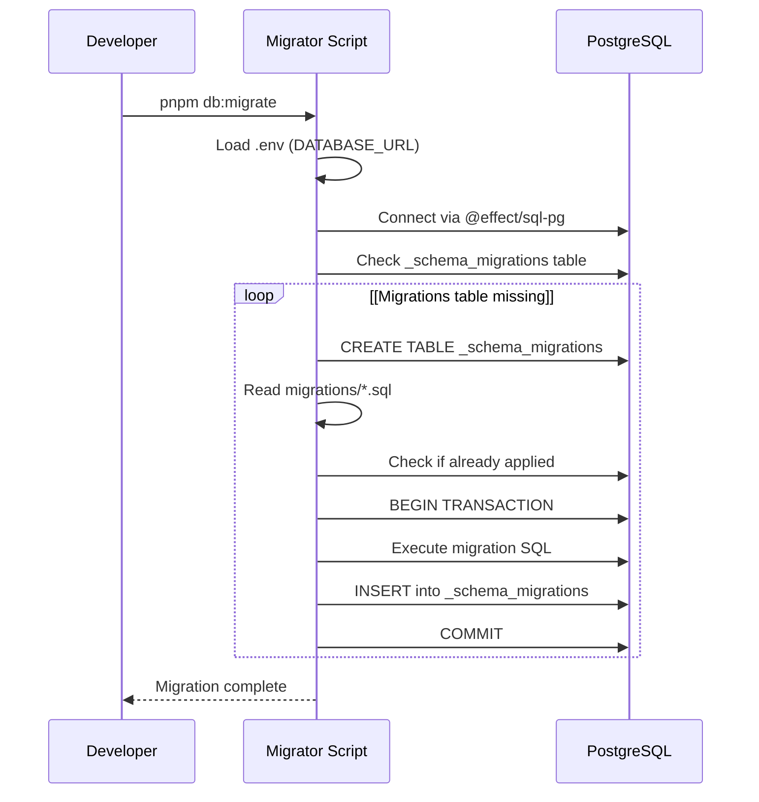
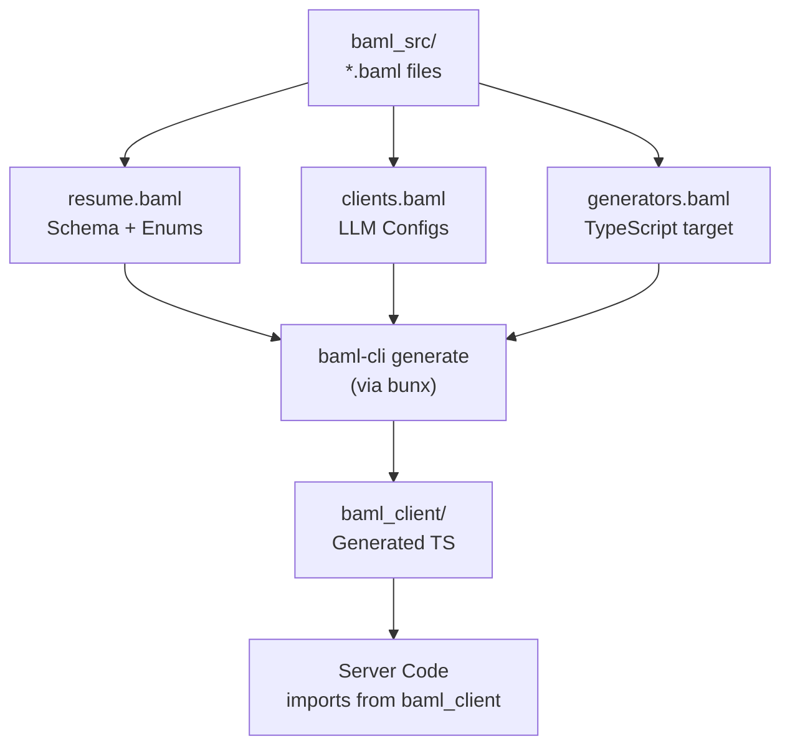
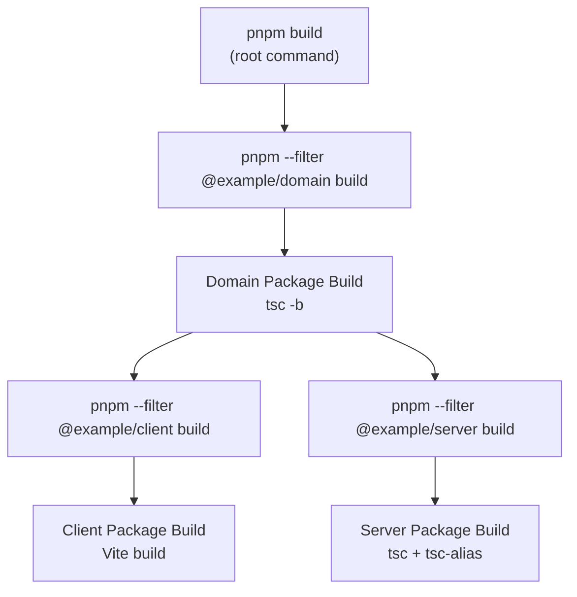

# Build and Development Commands

> **Relevant source files**
> * [.gitignore](https://github.com/oscaromsn/TalentScore/blob/428ed1eb/.gitignore)
> * [bun.lock](https://github.com/oscaromsn/TalentScore/blob/428ed1eb/bun.lock)
> * [package.json](https://github.com/oscaromsn/TalentScore/blob/428ed1eb/package.json)
> * [packages/server/package.json](https://github.com/oscaromsn/TalentScore/blob/428ed1eb/packages/server/package.json)

## Purpose and Scope

This document provides a comprehensive reference for all build, development, and maintenance commands available in the TalentScore monorepo. It covers pnpm workspace scripts at both the root level and package-specific commands for server and client development workflows.

For information about initial environment setup and prerequisites, see [Environment Setup](/oscaromsn/TalentScore/6.1-environment-setup). For production deployment and observability tools, see [Observability and Debugging](/oscaromsn/TalentScore/6.3-observability-and-debugging).

---

## Command Categories Overview

The monorepo provides commands through pnpm workspaces, organized into the following categories:

| Category | Purpose | Execution Context |
| --- | --- | --- |
| **Build** | Compile TypeScript and prepare distribution artifacts | Root, individual packages |
| **Development** | Run local dev servers with hot reload | Root (orchestration), packages |
| **Testing** | Execute unit and integration tests | Root, individual packages |
| **Linting** | Static code analysis with oxlint and ESLint | Root |
| **Formatting** | Code style enforcement with Prettier | Root |
| **Database** | Schema migrations and reset operations | Server package |
| **BAML** | Generate TypeScript clients from BAML definitions | Root |

**Sources:** [package.json L1-L68](https://github.com/oscaromsn/TalentScore/blob/428ed1eb/package.json#L1-L68)

 [packages/server/package.json L1-L44](https://github.com/oscaromsn/TalentScore/blob/428ed1eb/packages/server/package.json#L1-L44)

---

## Build Commands

### Root-Level Build

```

```

Builds all packages in dependency order: `domain` → `client` → `server`. Uses workspace filters to ensure each package is built only after its dependencies complete.

**Implementation:** [package.json L13](https://github.com/oscaromsn/TalentScore/blob/428ed1eb/package.json#L13-L13)

**Build Order:**

```

```

### Package-Specific Build (Server)

```

```

Executes the server build pipeline:

1. **Clean:** Removes `dist/` and `.tsbuildinfo` via `clean` script
2. **Compile:** Runs TypeScript compiler with [packages/server/tsconfig.build.json](https://github.com/oscaromsn/TalentScore/blob/428ed1eb/packages/server/tsconfig.build.json)
3. **Alias Resolution:** Runs `tsc-alias` to resolve path aliases in output

**Implementation:** [packages/server/package.json L14-L15](https://github.com/oscaromsn/TalentScore/blob/428ed1eb/packages/server/package.json#L14-L15)

**Build Artifacts:**

* `build/esm/` - ES module JavaScript output
* `build/dts/` - TypeScript declaration files
* `.tsbuildinfo` - Incremental build cache

---

## Development Commands

### Concurrent Development Mode



### Start Server Development Mode

```

```

Starts the Node.js server with hot reload enabled. Uses `tsx --watch` to automatically restart on file changes.

**Features:**

* Watches all TypeScript files in `packages/server/src/`
* Loads environment variables from root `.env` file via `dotenv-cli`
* Enables OpenTelemetry tracing to Jaeger (if configured)
* WebSocket RPC server on port from `PORT` environment variable

**Implementation:** [package.json L25](https://github.com/oscaromsn/TalentScore/blob/428ed1eb/package.json#L25-L25)

 [packages/server/package.json L17](https://github.com/oscaromsn/TalentScore/blob/428ed1eb/packages/server/package.json#L17-L17)

**Process Flow:**

1. `dotenv-cli` loads [.env](https://github.com/oscaromsn/TalentScore/blob/428ed1eb/.env)  variables
2. `tsx` compiles TypeScript on-the-fly
3. Executes [packages/server/src/server.ts](https://github.com/oscaromsn/TalentScore/blob/428ed1eb/packages/server/src/server.ts)
4. Watches for file changes and restarts

### Start Client Development Mode

```

```

Starts Vite development server for the React client with hot module replacement (HMR).

**Features:**

* Fast HMR via Vite's native ESM support
* Proxy configuration for RPC WebSocket connections
* TanStack Router file-based route generation
* Tailwind CSS v4 with JIT compilation

**Implementation:** [package.json L26](https://github.com/oscaromsn/TalentScore/blob/428ed1eb/package.json#L26-L26)

**Default Port:** `http://localhost:5173`

---

## Type Checking Commands

| Command | Description | Scope | Speed |
| --- | --- | --- | --- |
| `pnpm typecheck` | Full TypeScript build check | All workspaces | Slow (full compile) |
| `pnpm check` | Alias for `typecheck` | All workspaces | Slow |
| `pnpm check:fast` | Linting + type checking | All workspaces | Fast (cached) |

### Type Checking Architecture



The `tsc -b` (build mode) respects project references defined in each package's `tsconfig.json`, enabling incremental compilation.

**Sources:** [package.json L14-L16](https://github.com/oscaromsn/TalentScore/blob/428ed1eb/package.json#L14-L16)

---

## Testing Commands

### Run All Tests

```

```

Executes all Vitest test suites across the monorepo in a single pass.

**Configuration:**

* Uses Vitest 3.1.1 with `@effect/vitest` integration
* Runs tests in parallel by default
* Fails fast on first error

**Implementation:** [package.json L21](https://github.com/oscaromsn/TalentScore/blob/428ed1eb/package.json#L21-L21)

### Watch Mode

```

```

Runs Vitest in watch mode, re-executing tests on file changes. Useful for TDD workflows.

**Implementation:** [package.json L22](https://github.com/oscaromsn/TalentScore/blob/428ed1eb/package.json#L22-L22)

### Package-Specific Tests

```

```

Runs tests only for the server package, useful for isolated testing during development.

**Implementation:** [packages/server/package.json L16](https://github.com/oscaromsn/TalentScore/blob/428ed1eb/packages/server/package.json#L16-L16)

**Sources:** [package.json L21-L22](https://github.com/oscaromsn/TalentScore/blob/428ed1eb/package.json#L21-L22)

 [packages/server/package.json L16](https://github.com/oscaromsn/TalentScore/blob/428ed1eb/packages/server/package.json#L16-L16)

---

## Linting and Formatting Commands

### Linting Pipeline



### Lint Codebase

```

```

Runs two linters in sequence:

1. **oxlint:** Fast Rust-based linter with type-aware rules
2. **ESLint:** JavaScript linter with TypeScript parser

Both run in `--quiet` mode, only showing errors (not warnings).

**Implementation:** [package.json L17-L19](https://github.com/oscaromsn/TalentScore/blob/428ed1eb/package.json#L17-L19)

### Auto-Fix Lint Issues

```

```

Attempts to automatically fix linting violations. Runs oxlint with `--fix` flag, then ESLint with `--fix`.

**Implementation:** [package.json L20](https://github.com/oscaromsn/TalentScore/blob/428ed1eb/package.json#L20-L20)

### Format Code

```

```

Formats all code files using Prettier with the following plugins:

* `prettier-plugin-organize-imports` - Sorts imports
* `prettier-plugin-sql` - Formats SQL migrations
* `prettier-plugin-tailwindcss` - Orders Tailwind classes

**Supported Extensions:** `.js`, `.ts`, `.mjs`, `.jsx`, `.tsx`, `.json`, `.md`, `.css`, `.html`, `.yaml`, `.yml`

**Implementation:** [package.json L23](https://github.com/oscaromsn/TalentScore/blob/428ed1eb/package.json#L23-L23)

### Check Formatting

```

```

Verifies code formatting without modifying files. Useful in CI pipelines to enforce style consistency.

**Implementation:** [package.json L24](https://github.com/oscaromsn/TalentScore/blob/428ed1eb/package.json#L24-L24)

**Sources:** [package.json L17-L24](https://github.com/oscaromsn/TalentScore/blob/428ed1eb/package.json#L17-L24)

---

## Database Commands

### Apply Migrations

```

```

Applies all pending SQL migrations from [packages/server/src/db/migrations/](https://github.com/oscaromsn/TalentScore/blob/428ed1eb/packages/server/src/db/migrations/)

 to the PostgreSQL database.

**Migration Process:**

1. Connects to database using `DATABASE_URL` environment variable
2. Reads SQL files from migrations directory
3. Executes migrations in alphanumeric order
4. Records applied migrations in `_schema_migrations` table

**Implementation:** [package.json L27](https://github.com/oscaromsn/TalentScore/blob/428ed1eb/package.json#L27-L27)

 [packages/server/package.json L19](https://github.com/oscaromsn/TalentScore/blob/428ed1eb/packages/server/package.json#L19-L19)

**Migration Script:** [packages/server/src/db/scripts/migrator.ts](https://github.com/oscaromsn/TalentScore/blob/428ed1eb/packages/server/src/db/scripts/migrator.ts)

### Reset Database

```

```

**⚠️ WARNING:** Drops all tables and recreates the schema from scratch. All data will be lost.

**Use Cases:**

* Resetting local development database
* Starting fresh after schema changes
* Running integration tests with clean state

**Implementation:** [package.json L28](https://github.com/oscaromsn/TalentScore/blob/428ed1eb/package.json#L28-L28)

 [packages/server/package.json L20](https://github.com/oscaromsn/TalentScore/blob/428ed1eb/packages/server/package.json#L20-L20)

**Reset Script:** [packages/server/src/db/scripts/reset-database.ts](https://github.com/oscaromsn/TalentScore/blob/428ed1eb/packages/server/src/db/scripts/reset-database.ts)

### Database Command Workflow



**Sources:** [package.json L27-L28](https://github.com/oscaromsn/TalentScore/blob/428ed1eb/package.json#L27-L28)

 [packages/server/package.json L19-L20](https://github.com/oscaromsn/TalentScore/blob/428ed1eb/packages/server/package.json#L19-L20)

---

## BAML Code Generation

### Generate BAML Clients

```

```

Generates TypeScript client code from BAML definitions in [packages/server/baml_src/](https://github.com/oscaromsn/TalentScore/blob/428ed1eb/packages/server/baml_src/)

**Generated Artifacts:**

* `packages/server/baml_client/` - TypeScript client library
* Type-safe functions for LLM interactions (e.g., `b.stream.ExtractResume`)
* Retry policies and client configurations

**Implementation:** [package.json L29](https://github.com/oscaromsn/TalentScore/blob/428ed1eb/package.json#L29-L29)

**BAML Source Files:**

* [packages/server/baml_src/resume.baml](https://github.com/oscaromsn/TalentScore/blob/428ed1eb/packages/server/baml_src/resume.baml)  - Resume extraction schema
* [packages/server/baml_src/clients.baml](https://github.com/oscaromsn/TalentScore/blob/428ed1eb/packages/server/baml_src/clients.baml)  - LLM client configurations
* [packages/server/baml_src/generators.baml](https://github.com/oscaromsn/TalentScore/blob/428ed1eb/packages/server/baml_src/generators.baml)  - Code generation settings

**Generation Pipeline:**



**Typical Workflow:**

1. Modify BAML schema in [packages/server/baml_src/resume.baml](https://github.com/oscaromsn/TalentScore/blob/428ed1eb/packages/server/baml_src/resume.baml)
2. Run `pnpm baml:generate`
3. Verify generated types in [packages/server/baml_client/](https://github.com/oscaromsn/TalentScore/blob/428ed1eb/packages/server/baml_client/)
4. Update server code to use new types
5. Commit both `.baml` files and generated client code

**Sources:** [package.json L29](https://github.com/oscaromsn/TalentScore/blob/428ed1eb/package.json#L29-L29)

 [.gitignore L31](https://github.com/oscaromsn/TalentScore/blob/428ed1eb/.gitignore#L31-L31)

---

## Common Development Workflows

### Full Stack Development Session

```

```

### Clean Build from Scratch

```

```

### Pre-Commit Quality Checks

```

```

### Update Schema After BAML Changes

```

```

---

## Environment-Specific Commands

### Production Build

```

```

The `start` script uses `node` directly (not `tsx`) and loads the compiled output from [packages/server/build/esm/server.js](https://github.com/oscaromsn/TalentScore/blob/428ed1eb/packages/server/build/esm/server.js)

**Implementation:** [packages/server/package.json L18](https://github.com/oscaromsn/TalentScore/blob/428ed1eb/packages/server/package.json#L18-L18)

### CI/CD Pipeline Commands

Typical CI pipeline command sequence:

```

```

---

## Workspace Filter Syntax

The monorepo uses pnpm workspace filters to target specific packages:

| Filter | Description | Example |
| --- | --- | --- |
| `--filter @example/server` | Run command in server package | `pnpm --filter @example/server build` |
| `--filter @example/client` | Run command in client package | `pnpm --filter @example/client dev` |
| `--filter @example/domain` | Run command in domain package | `pnpm --filter @example/domain build` |
| `--filter "./packages/*"` | Run in all packages | `pnpm --filter "./packages/*" test` |

### Filter Usage in Build Command



The root `build` command explicitly sequences builds using filters to ensure dependency order, since both client and server depend on domain.

**Sources:** [package.json L13](https://github.com/oscaromsn/TalentScore/blob/428ed1eb/package.json#L13-L13)

---

## Command Execution Context

### Environment Variable Loading

Most server commands use `dotenv-cli` to load environment variables from [.env](https://github.com/oscaromsn/TalentScore/blob/428ed1eb/.env)

:

```

```

**Required Environment Variables:**

* `DATABASE_URL` - PostgreSQL connection string
* `PORT` - HTTP/WebSocket server port
* `UPLOADTHING_TOKEN` - UploadThing API key
* `OPENAI_API_KEY` - OpenAI API credentials (optional)
* `ANTHROPIC_API_KEY` - Anthropic API credentials (optional)

### Package Manager Requirements

The project requires specific versions:

| Tool | Version | Enforced By |
| --- | --- | --- |
| **Node.js** | 22.14.0 | [package.json L6](https://github.com/oscaromsn/TalentScore/blob/428ed1eb/package.json#L6-L6) |
| **pnpm** | 10.3.0 | [package.json L4](https://github.com/oscaromsn/TalentScore/blob/428ed1eb/package.json#L4-L4) <br>  [package.json L7](https://github.com/oscaromsn/TalentScore/blob/428ed1eb/package.json#L7-L7) |

The `packageManager` field in [package.json L4](https://github.com/oscaromsn/TalentScore/blob/428ed1eb/package.json#L4-L4)

 enables automatic version enforcement when using Corepack.

**Sources:** [package.json L4-L7](https://github.com/oscaromsn/TalentScore/blob/428ed1eb/package.json#L4-L7)

 [packages/server/package.json L17](https://github.com/oscaromsn/TalentScore/blob/428ed1eb/packages/server/package.json#L17-L17)

---

## Dependency Overrides

The root [package.json L53-L67](https://github.com/oscaromsn/TalentScore/blob/428ed1eb/package.json#L53-L67)

 defines `overrides` to pin Effect ecosystem packages to synchronized versions, preventing version conflicts across the monorepo:

```

```

These overrides ensure all packages use compatible Effect versions, even if dependencies specify different ranges.

**Sources:** [package.json L53-L67](https://github.com/oscaromsn/TalentScore/blob/428ed1eb/package.json#L53-L67)