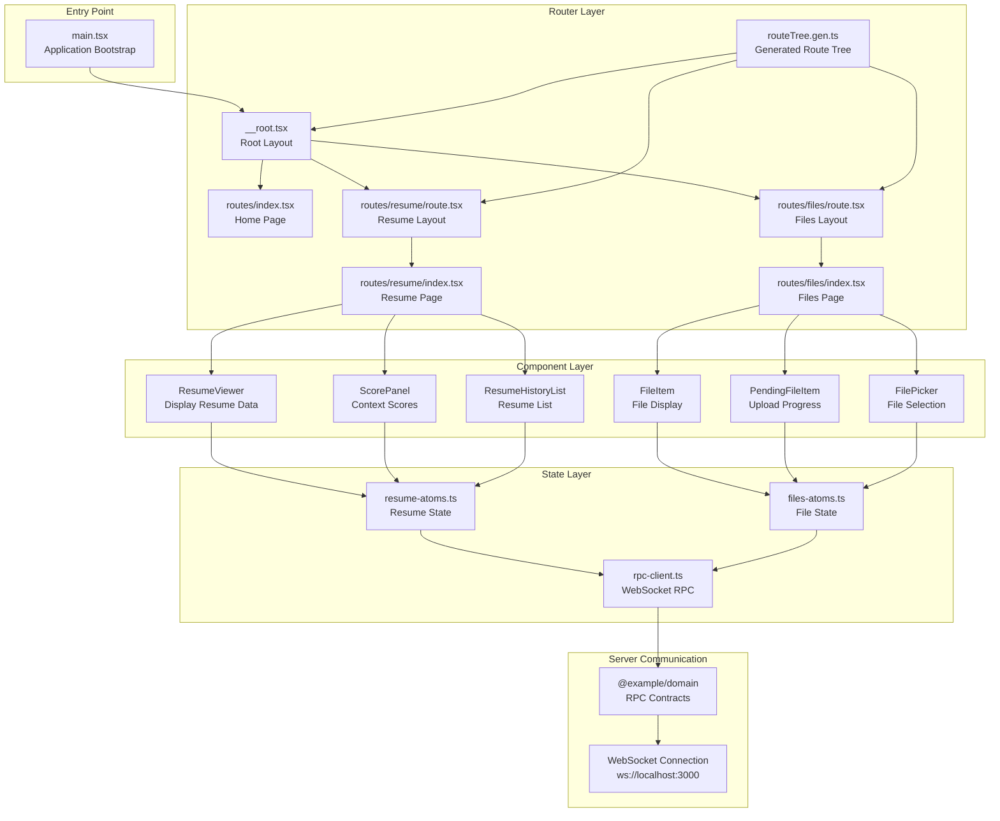
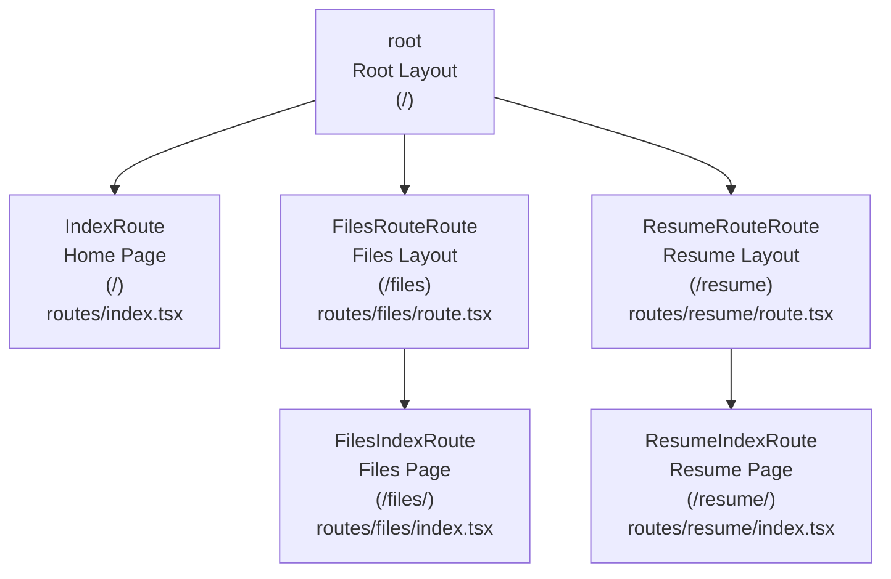
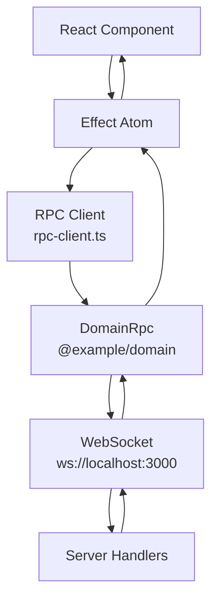

# Client Package

> **Relevant source files**
> * [.gitignore](https://github.com/oscaromsn/TalentScore/blob/428ed1eb/.gitignore)
> * [bun.lock](https://github.com/oscaromsn/TalentScore/blob/428ed1eb/bun.lock)
> * [package.json](https://github.com/oscaromsn/TalentScore/blob/428ed1eb/package.json)
> * [packages/client/src/routeTree.gen.ts](https://github.com/oscaromsn/TalentScore/blob/428ed1eb/packages/client/src/routeTree.gen.ts)
> * [packages/client/src/routes/index.tsx](https://github.com/oscaromsn/TalentScore/blob/428ed1eb/packages/client/src/routes/index.tsx)
> * [packages/server/package.json](https://github.com/oscaromsn/TalentScore/blob/428ed1eb/packages/server/package.json)

The Client Package is a React 19 single-page application that provides the user interface for TalentScore's resume analysis and file management features. It uses TanStack Router for file-based routing, Effect Atoms for reactive state management, and communicates with the server via Effect RPC over WebSocket connections.

This document covers the client application's architecture, routing structure, state management patterns, and UI components. For information about the RPC contracts that define client-server communication, see [Domain Package](/oscaromsn/TalentScore/3-domain-package). For server-side implementation details, see [Server Package](/oscaromsn/TalentScore/4-server-package).

---

## Package Configuration

The client package is configured as a modern React application with the following key characteristics:

| Configuration | Value |
| --- | --- |
| Package Name | `@example/client` |
| Build Tool | Vite 6.1.0 |
| React Version | 19.0.0 |
| Router | TanStack Router 1.139.0 |
| State Management | `@effect-atom/atom-react` 0.4.2 |
| Styling | Tailwind CSS 4.1.17 |

**Key Dependencies:**

* **Effect Ecosystem**: `@effect/platform-browser`, `@effect/rpc` for WebSocket communication
* **UI Framework**: React 19.0.0 with React DOM 19.0.0
* **Routing**: `@tanstack/react-router` with file-based routing via `@tanstack/router-plugin`
* **UI Components**: Radix UI primitives (`@radix-ui/react-*`) for accessible component patterns
* **Styling**: Tailwind CSS v4 with `@tailwindcss/typography` plugin
* **Icons**: Lucide React 0.475.0
* **Utilities**: `clsx`, `tailwind-merge`, `class-variance-authority` for style composition

**Build Configuration:**

The client uses Vite with SWC for fast compilation and hot module replacement during development. The build output targets modern browsers with ES module support.

**Sources:** [packages/client/package.json L1-L71](https://github.com/oscaromsn/TalentScore/blob/428ed1eb/packages/client/package.json#L1-L71)

 [bun.lock L29-L73](https://github.com/oscaromsn/TalentScore/blob/428ed1eb/bun.lock#L29-L73)

---

## Directory Structure

```markdown
packages/client/
├── src/
│   ├── routes/              # TanStack Router file-based routes
│   │   ├── __root.tsx       # Root layout component
│   │   ├── index.tsx        # Home page route
│   │   ├── files/           # File management routes
│   │   │   ├── route.tsx    # Files layout
│   │   │   └── index.tsx    # Files page
│   │   └── resume/          # Resume analysis routes
│   │       ├── route.tsx    # Resume layout
│   │       └── index.tsx    # Resume page
│   ├── components/          # React components
│   │   ├── ui/              # Reusable UI primitives
│   │   ├── files/           # File management components
│   │   └── resume/          # Resume analysis components
│   ├── state/               # Effect Atoms state definitions
│   │   ├── resume-atoms.ts  # Resume state management
│   │   ├── files-atoms.ts   # File state management
│   │   └── rpc-client.ts    # RPC client initialization
│   ├── lib/                 # Utility functions
│   └── routeTree.gen.ts     # Generated route tree
└── package.json
```

The application follows a feature-based organization where routes define the page structure, components implement the UI, and atoms manage state independently of the component tree.

**Sources:** [packages/client/src/routes/index.tsx L1-L32](https://github.com/oscaromsn/TalentScore/blob/428ed1eb/packages/client/src/routes/index.tsx#L1-L32)

 [packages/client/src/routeTree.gen.ts L1-L150](https://github.com/oscaromsn/TalentScore/blob/428ed1eb/packages/client/src/routeTree.gen.ts#L1-L150)

---

## Application Architecture Diagram



This diagram shows how the client application is organized into layers:

1. **Entry Point**: `main.tsx` bootstraps the React application and router
2. **Router Layer**: TanStack Router manages navigation and layout hierarchy
3. **State Layer**: Effect Atoms manage reactive state and coordinate RPC calls
4. **Component Layer**: React components render UI and subscribe to atoms
5. **Server Communication**: RPC client establishes WebSocket connection using domain contracts

**Sources:** [packages/client/src/routes/index.tsx L1-L32](https://github.com/oscaromsn/TalentScore/blob/428ed1eb/packages/client/src/routes/index.tsx#L1-L32)

 [packages/client/src/routeTree.gen.ts L1-L150](https://github.com/oscaromsn/TalentScore/blob/428ed1eb/packages/client/src/routeTree.gen.ts#L1-L150)

---

## Route Tree Structure

The client uses TanStack Router's file-based routing system, where the file structure in `src/routes/` directly maps to URL paths. The router plugin automatically generates `routeTree.gen.ts` from the route files.



**Route Definitions:**

| Route ID | Path | Component File | Purpose |
| --- | --- | --- | --- |
| `__root__` | `/` | `routes/__root.tsx` | Root layout with global providers |
| `/` | `/` | `routes/index.tsx` | Home page with navigation links |
| `/files` | `/files` | `routes/files/route.tsx` | Files section layout |
| `/files/` | `/files/` | `routes/files/index.tsx` | File management interface |
| `/resume` | `/resume` | `routes/resume/route.tsx` | Resume section layout |
| `/resume/` | `/resume/` | `routes/resume/index.tsx` | Resume analysis interface |

**Type-Safe Navigation:**

TanStack Router generates TypeScript types that enforce route paths at compile time:

```

```

This ensures that navigation links using `<Link to="/files" />` are validated against the actual route structure.

**Sources:** [packages/client/src/routeTree.gen.ts L1-L150](https://github.com/oscaromsn/TalentScore/blob/428ed1eb/packages/client/src/routeTree.gen.ts#L1-L150)

 [packages/client/src/routes/index.tsx L1-L32](https://github.com/oscaromsn/TalentScore/blob/428ed1eb/packages/client/src/routes/index.tsx#L1-L32)

---

## Home Route Component

The home page serves as the application entry point, providing navigation to the two main features: file management and resume analysis.

**Component Structure:**

```

```

The component uses TanStack Router's `Link` component for client-side navigation, avoiding full page reloads. Styling is applied using Tailwind CSS utility classes.

**Sources:** [packages/client/src/routes/index.tsx L1-L32](https://github.com/oscaromsn/TalentScore/blob/428ed1eb/packages/client/src/routes/index.tsx#L1-L32)

---

## State Management Architecture

The client package uses `@effect-atom/atom-react` for state management, which provides reactive atoms that integrate seamlessly with Effect-TS. This architecture offers several advantages:

1. **Reactive Updates**: Atoms automatically notify subscribed components when state changes
2. **Effect Integration**: Atoms can execute Effect programs with full error handling
3. **Composability**: Atoms can be composed and derived from other atoms
4. **Type Safety**: Full TypeScript type inference for atom values and updates

**Core Pattern:**

```

```

For detailed information about the two main state management modules, see:

* Resume state management: [Resume State Management](/oscaromsn/TalentScore/5.2.1-resume-state-management)
* File state management: [File State Management](/oscaromsn/TalentScore/5.2.2-file-state-management)

**Sources:** [package.json L49-L67](https://github.com/oscaromsn/TalentScore/blob/428ed1eb/package.json#L49-L67)

 [bun.lock L201-L203](https://github.com/oscaromsn/TalentScore/blob/428ed1eb/bun.lock#L201-L203)

---

## RPC Client Integration

The client establishes a WebSocket connection to the server using Effect RPC, which provides type-safe, streaming communication with full contract validation.

**RPC Client Initialization Pattern:**



**Client Configuration:**

The RPC client is typically configured with:

* WebSocket URL (e.g., `ws://localhost:3000`)
* Retry policies for connection failures
* Request/response serialization (NDJSON over WebSocket)
* Type-safe method proxies from `@example/domain` package

**Streaming Support:**

Effect RPC supports streaming responses, enabling real-time updates for long-running operations like resume parsing:

1. Client calls streaming RPC method (e.g., `resume.parse`)
2. Server sends `Stream<ParseEvent>` with partial results
3. Client atom receives each event and updates state
4. Components re-render progressively as data arrives

**Sources:** Based on high-level diagrams showing Effect RPC integration, [packages/client/package.json L32-L56](https://github.com/oscaromsn/TalentScore/blob/428ed1eb/packages/client/package.json#L32-L56)

---

## Component Patterns

The client package follows several React patterns for building UI components:

### Compound Components

Complex UI features use compound component patterns where a parent component provides context to children:

```

```

This pattern is used extensively with Radix UI primitives for accessible, composable components.

### Controlled vs Uncontrolled Components

* **Controlled**: State managed by atoms (e.g., file selection, resume selection)
* **Uncontrolled**: Local component state for ephemeral UI (e.g., dropdown open state)

### Effect Integration in Components

Components use custom hooks to integrate with Effect atoms:

```

```

For specific component implementations, see:

* Resume components: [Resume Features](/oscaromsn/TalentScore/5.3-resume-features)
* File components: [File Management UI](/oscaromsn/TalentScore/5.4-file-management-ui)

**Sources:** [packages/client/package.json L38-L56](https://github.com/oscaromsn/TalentScore/blob/428ed1eb/packages/client/package.json#L38-L56)

 (Radix UI dependencies)

---

## Styling System

The client uses Tailwind CSS v4 with custom utilities and the typography plugin for consistent styling.

**Configuration:**

* **Base**: Tailwind CSS 4.1.17 with `@tailwindcss/vite` plugin
* **Animations**: `tailwindcss-animate` for transition/animation utilities
* **Typography**: `@tailwindcss/typography` for rich text styling
* **Utilities**: `tailwind-merge` for conditional class merging, `class-variance-authority` for component variants

**Custom Utilities:**

The application defines CSS custom properties for theming:

```

```

Components reference these via Tailwind classes like `bg-primary`, `text-muted-foreground`, etc.

**Responsive Design:**

Tailwind's responsive modifiers enable mobile-first design:

* `container mx-auto`: Centered container with responsive max-width
* `flex flex-col md:flex-row`: Stack vertically on mobile, row on desktop
* `p-4 md:p-8`: Responsive padding

**Sources:** [packages/client/package.json L45-L56](https://github.com/oscaromsn/TalentScore/blob/428ed1eb/packages/client/package.json#L45-L56)

 [bun.lock L29-L73](https://github.com/oscaromsn/TalentScore/blob/428ed1eb/bun.lock#L29-L73)

---

## Build and Development Scripts

The client package provides several npm scripts for development and production builds:

| Script | Command | Purpose |
| --- | --- | --- |
| `dev` | `vite` | Start development server with HMR |
| `build` | `vite build` | Production build with minification |
| `preview` | `vite preview` | Preview production build locally |
| `check` | `tsc -b tsconfig.json` | Type checking without emitting files |

**Development Server:**

The Vite dev server runs on port 5173 by default with:

* Hot Module Replacement (HMR) for instant updates
* Fast refresh for React components
* TypeScript compilation via `@vitejs/plugin-react-swc`
* Route generation via `@tanstack/router-plugin`

**Production Build:**

The production build:

1. Type checks all TypeScript files
2. Generates optimized bundles with code splitting
3. Minifies JavaScript and CSS
4. Generates source maps for debugging
5. Outputs to `dist/` directory

**Sources:** [packages/client/package.json L11-L17](https://github.com/oscaromsn/TalentScore/blob/428ed1eb/packages/client/package.json#L11-L17)

---

## Error Handling Strategy

The client implements error handling at multiple levels:

### Effect-Level Error Handling

Effect atoms catch and handle errors from RPC calls:

```

```

### Component-Level Error Boundaries

Components can display error states using conditional rendering:

```

```

### Toast Notifications

The application uses the `sonner` library for user-facing error notifications:

* Success: "Resume parsed successfully"
* Error: "Failed to parse resume: [reason]"
* Info: "Processing..."

**Sources:** [packages/client/package.json L54](https://github.com/oscaromsn/TalentScore/blob/428ed1eb/packages/client/package.json#L54-L54)

 (sonner dependency)

---

## Testing Approach

The client package is configured for testing with Vitest:

**Test Configuration:**

* **Runner**: Vitest 2.0.5 (via package overrides)
* **Effect Integration**: `@effect/vitest` 0.27.0 for testing Effect programs
* **Browser Environment**: jsdom for component testing

**Testing Patterns:**

1. **Atom Tests**: Test atom computations in isolation
2. **Component Tests**: Test component rendering and interactions
3. **Integration Tests**: Test RPC flows with mock server

**Sources:** [package.json L47](https://github.com/oscaromsn/TalentScore/blob/428ed1eb/package.json#L47-L47)

 (vitest dependency), [package.json L62](https://github.com/oscaromsn/TalentScore/blob/428ed1eb/package.json#L62-L62)

 (vitest override), [packages/client/package.json L69](https://github.com/oscaromsn/TalentScore/blob/428ed1eb/packages/client/package.json#L69-L69)

 (vitest peer dependency)

---

## Browser Compatibility

The client application targets modern browsers with ES module support:

**Minimum Browser Versions:**

* Chrome 90+
* Firefox 88+
* Safari 14+
* Edge 90+

**Polyfills:**

The application does not include legacy browser polyfills. Users on older browsers will see an unsupported browser message.

**Platform-Specific Features:**

The client uses `@effect/platform-browser` for browser-specific APIs:

* WebSocket client
* Local storage
* File uploads via File API

**Sources:** [packages/client/package.json L34](https://github.com/oscaromsn/TalentScore/blob/428ed1eb/packages/client/package.json#L34-L34)

 (@effect/platform-browser dependency)

---

## Performance Optimization

The client implements several performance optimizations:

### Code Splitting

Vite automatically splits code by route, loading only the JavaScript needed for the current page:

* `/files` route code loads on-demand
* `/resume` route code loads on-demand
* Shared code (atoms, utilities) bundled separately

### React 19 Optimizations

The application benefits from React 19 features:

* Automatic batching of state updates
* Improved concurrent rendering
* Server component readiness (future enhancement)

### Memoization

Components use React.memo and useMemo for expensive computations:

* Large lists virtualized to render only visible items
* Derived atom values computed once and cached

### Asset Optimization

Vite handles asset optimization:

* Image compression
* CSS minification
* JavaScript tree-shaking to remove unused code

**Sources:** [packages/client/package.json L52](https://github.com/oscaromsn/TalentScore/blob/428ed1eb/packages/client/package.json#L52-L52)

 (React 19 dependency)

---

## Development Workflow

A typical development workflow for the client package:

1. **Start Development Server:** ``` ```
2. **Make Changes:** * Edit component files in `src/components/` * Edit routes in `src/routes/` * Edit atoms in `src/state/`
3. **Hot Module Replacement:** * Browser automatically updates on save * React Fast Refresh preserves component state
4. **Type Checking:** ``` ```
5. **Production Build:** ``` ```

**Sources:** [packages/client/package.json L11-L17](https://github.com/oscaromsn/TalentScore/blob/428ed1eb/packages/client/package.json#L11-L17)

---

For detailed information about specific subsystems, see:

* Routing details: [Routing and Navigation](/oscaromsn/TalentScore/5.1-routing-and-navigation)
* State management: [State Management with Effect Atoms](/oscaromsn/TalentScore/5.2-state-management-with-effect-atoms)
* Resume UI: [Resume Features](/oscaromsn/TalentScore/5.3-resume-features)
* File UI: [File Management UI](/oscaromsn/TalentScore/5.4-file-management-ui)