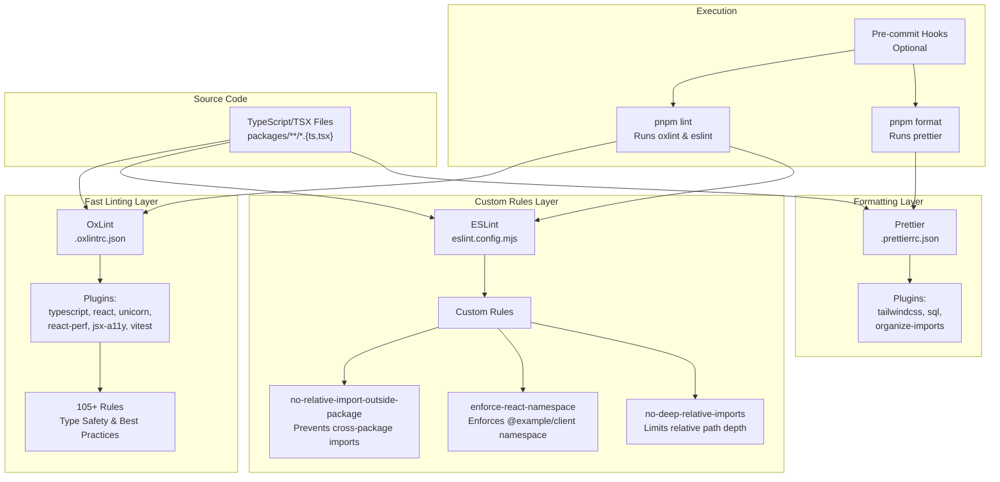
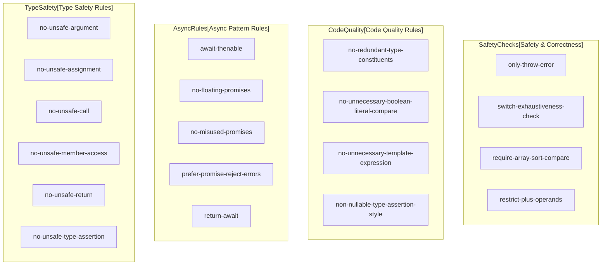
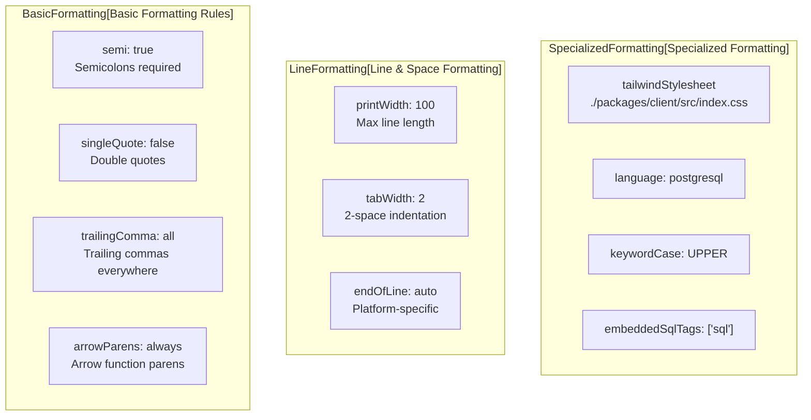
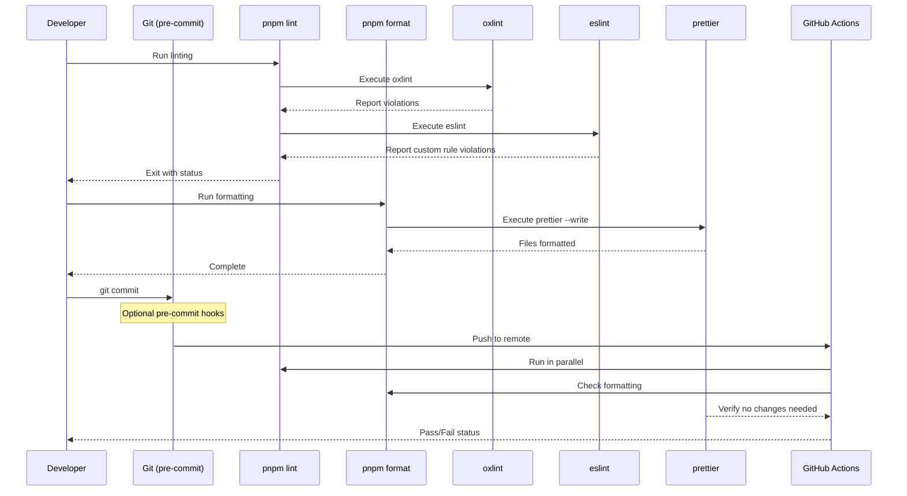
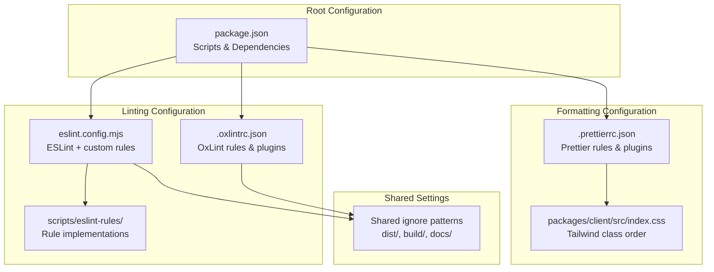

# Code Quality Tools

> **Relevant source files**
> * [.oxlintrc.json](https://github.com/lucas-barake/effect-file-manager/blob/28eedd82/.oxlintrc.json)
> * [.prettierrc.json](https://github.com/lucas-barake/effect-file-manager/blob/28eedd82/.prettierrc.json)
> * [eslint.config.mjs](https://github.com/lucas-barake/effect-file-manager/blob/28eedd82/eslint.config.mjs)

## Purpose and Scope

This document describes the code quality tooling infrastructure for the Effect File Manager repository. It covers the configuration and operation of three primary tools: **OxLint** for fast baseline linting, **ESLint** for custom monorepo-specific rules, and **Prettier** for consistent code formatting. The focus is on how these tools are configured, what they check, and how they integrate into the development workflow.

For information about how these tools are executed in CI/CD, see [CI/CD Pipeline](/lucas-barake/effect-file-manager/8.2-cicd-pipeline). For testing infrastructure, see [Testing Strategy](/lucas-barake/effect-file-manager/8.3-testing-strategy).

**Sources:** [.oxlintrc.json L1-L114](https://github.com/lucas-barake/effect-file-manager/blob/28eedd82/.oxlintrc.json#L1-L114)

 [eslint.config.mjs L1-L46](https://github.com/lucas-barake/effect-file-manager/blob/28eedd82/eslint.config.mjs#L1-L46)

 [.prettierrc.json L1-L18](https://github.com/lucas-barake/effect-file-manager/blob/28eedd82/.prettierrc.json#L1-L18)

---

## Code Quality Tool Architecture

The repository employs a **dual-linting strategy** combining OxLint and ESLint, plus Prettier for formatting. This architecture balances speed with customization.



**Architectural Pattern:** OxLint provides fast, comprehensive baseline checks for TypeScript safety and React best practices. ESLint adds monorepo-specific rules that enforce architectural boundaries. Prettier runs separately to handle formatting, with plugins for Tailwind class sorting and import organization.

**Sources:** [.oxlintrc.json L1-L114](https://github.com/lucas-barake/effect-file-manager/blob/28eedd82/.oxlintrc.json#L1-L114)

 [eslint.config.mjs L1-L46](https://github.com/lucas-barake/effect-file-manager/blob/28eedd82/eslint.config.mjs#L1-L46)

 [.prettierrc.json L1-L18](https://github.com/lucas-barake/effect-file-manager/blob/28eedd82/.prettierrc.json#L1-L18)

---

## OxLint Configuration

OxLint is configured via `.oxlintrc.json` and serves as the primary linting tool, providing fast TypeScript and React analysis.

### Plugin Configuration

OxLint loads seven plugin categories:

| Plugin | Purpose | Rules Activated |
| --- | --- | --- |
| `typescript` | Type safety and TypeScript best practices | 40+ rules |
| `react` | React component patterns | Standard React rules |
| `oxc` | Core language rules | Base linting |
| `unicorn` | Modern JavaScript patterns | Additional best practices |
| `react-perf` | React performance optimizations | Performance rules |
| `jsx-a11y` | Accessibility checks | A11y validation |
| `vitest` | Test-specific linting | Test patterns |

**Sources:** [.oxlintrc.json L3](https://github.com/lucas-barake/effect-file-manager/blob/28eedd82/.oxlintrc.json#L3-L3)

### TypeScript Rule Categories

The TypeScript rules in OxLint are organized into several categories:



**Key Rule Highlights:**

* **`no-unsafe-*` family** ([.oxlintrc.json L22-L29](https://github.com/lucas-barake/effect-file-manager/blob/28eedd82/.oxlintrc.json#L22-L29) ): Prevents type-unsafe operations that bypass TypeScript's type system
* **`no-floating-promises`** ([.oxlintrc.json L10](https://github.com/lucas-barake/effect-file-manager/blob/28eedd82/.oxlintrc.json#L10-L10) ): Ensures promises are properly awaited or handled, critical for Effect-TS code
* **`switch-exhaustiveness-check`** ([.oxlintrc.json L42](https://github.com/lucas-barake/effect-file-manager/blob/28eedd82/.oxlintrc.json#L42-L42) ): Enforces exhaustive pattern matching in switch statements
* **`no-misused-promises`** ([.oxlintrc.json L14](https://github.com/lucas-barake/effect-file-manager/blob/28eedd82/.oxlintrc.json#L14-L14) ): Prevents common async/await mistakes

### Disabled Rules

Two TypeScript rules are explicitly disabled:

* **`promise-function-async`** ([.oxlintrc.json L35](https://github.com/lucas-barake/effect-file-manager/blob/28eedd82/.oxlintrc.json#L35-L35) ): Set to `"off"` because Effect-TS functions return `Effect` types without being async functions
* **`require-await`** ([.oxlintrc.json L38](https://github.com/lucas-barake/effect-file-manager/blob/28eedd82/.oxlintrc.json#L38-L38) ): Disabled for similar reasons; Effect-TS patterns don't require traditional async/await
* **`unbound-method`** ([.oxlintrc.json L43](https://github.com/lucas-barake/effect-file-manager/blob/28eedd82/.oxlintrc.json#L43-L43) ): Disabled to avoid false positives with Effect-TS method references

**Sources:** [.oxlintrc.json L4-L44](https://github.com/lucas-barake/effect-file-manager/blob/28eedd82/.oxlintrc.json#L4-L44)

### Core ESLint Rules in OxLint

OxLint also enables 60+ core ESLint rules for JavaScript/TypeScript correctness:

| Category | Example Rules | Severity |
| --- | --- | --- |
| Critical errors | `no-const-assign`, `no-dupe-keys`, `no-unreachable` | `error` |
| Dangerous patterns | `no-fallthrough`, `no-debugger`, `no-console` | `error` |
| Code quality | `no-useless-catch`, `prefer-optional-chain` | `error`/`warn` |
| Variable management | `no-unused-vars`, `no-var` | `error` |

**Notable configuration:**

* **`no-console`** ([.oxlintrc.json L80](https://github.com/lucas-barake/effect-file-manager/blob/28eedd82/.oxlintrc.json#L80-L80) ): Set to `error`, preventing accidental console.log statements in production code
* **`no-unused-vars`** ([.oxlintrc.json L69](https://github.com/lucas-barake/effect-file-manager/blob/28eedd82/.oxlintrc.json#L69-L69) ): Strictly enforced to keep codebase clean

**Sources:** [.oxlintrc.json L46-L104](https://github.com/lucas-barake/effect-file-manager/blob/28eedd82/.oxlintrc.json#L46-L104)

### Ignore Patterns

OxLint excludes specific directories and file types:

```markdown
**/dist          # Build outputs
**/build         # Alternative build directory
**/docs          # Documentation
**/*.md          # Markdown files
**/vitest.config.ts      # Test configuration
**/vitest.workspace.ts   # Vitest workspace config
```

**Sources:** [.oxlintrc.json L106-L113](https://github.com/lucas-barake/effect-file-manager/blob/28eedd82/.oxlintrc.json#L106-L113)

---

## ESLint Configuration and Custom Rules

ESLint configuration at `eslint.config.mjs` defines three custom rules that enforce monorepo architectural boundaries.

### Custom Rule Architecture

```mermaid
flowchart TD

RelativeImportRule["no-relative-import-outside-package.mjs<br>scripts/eslint-rules/"]
ReactNamespaceRule["enforce-react-namespace.mjs<br>scripts/eslint-rules/"]
DeepImportRule["no-deep-relative-imports.mjs<br>scripts/eslint-rules/"]
ParserConfig["@typescript-eslint/parser"]
PluginRegistration["Plugin Registration<br>Lines 22-38"]
RuleActivation["Rule Activation<br>Lines 39-43"]
PackageBoundary["Package Boundary Integrity<br>No ../../../other-package"]
ClientNamespace["Client Namespace Enforcement<br>Must use @example/client"]
DepthLimit["Import Depth Limitation<br>Max ../../../"]

RelativeImportRule --> PluginRegistration
ReactNamespaceRule --> PluginRegistration
DeepImportRule --> PluginRegistration
RuleActivation --> PackageBoundary
RuleActivation --> ClientNamespace
RuleActivation --> DepthLimit

subgraph subGraph2 ["EnforcedPatterns[Enforced Architectural Patterns]"]
    PackageBoundary
    ClientNamespace
    DepthLimit
end

subgraph ESLintConfig[eslint.config.mjs] ["ESLintConfig[eslint.config.mjs]"]
    ParserConfig
    PluginRegistration
    RuleActivation
    PluginRegistration --> RuleActivation
end

subgraph subGraph0 ["CustomRuleDefinitions[Custom Rule Definitions]"]
    RelativeImportRule
    ReactNamespaceRule
    DeepImportRule
end
```

**Sources:** [eslint.config.mjs L1-L46](https://github.com/lucas-barake/effect-file-manager/blob/28eedd82/eslint.config.mjs#L1-L46)

### Rule 1: no-relative-import-outside-package

**Purpose:** Prevents relative imports that cross package boundaries in the monorepo.

**Enforcement:** Set to `"error"` ([eslint.config.mjs L40](https://github.com/lucas-barake/effect-file-manager/blob/28eedd82/eslint.config.mjs#L40-L40)

)

**Example violations:**

```javascript
// In @example/client, this is INVALID:
import { SomeType } from "../../../domain/src/types";

// VALID alternative:
import { SomeType } from "@example/domain";
```

This rule maintains clean package boundaries and ensures all cross-package dependencies are declared in `package.json`.

**Implementation:** [scripts/eslint-rules/no-relative-import-outside-package.mjs](https://github.com/lucas-barake/effect-file-manager/blob/28eedd82/scripts/eslint-rules/no-relative-import-outside-package.mjs)

**Sources:** [eslint.config.mjs L4](https://github.com/lucas-barake/effect-file-manager/blob/28eedd82/eslint.config.mjs#L4-L4)

 [eslint.config.mjs L40](https://github.com/lucas-barake/effect-file-manager/blob/28eedd82/eslint.config.mjs#L40-L40)

### Rule 2: enforce-react-namespace

**Purpose:** Enforces that React components in the client package use the `@example/client` namespace for internal imports.

**Enforcement:** Set to `"error"` ([eslint.config.mjs L41](https://github.com/lucas-barake/effect-file-manager/blob/28eedd82/eslint.config.mjs#L41-L41)

)

**Rationale:** Ensures consistent import paths and prevents deep relative imports within the client package, improving refactoring safety.

**Implementation:** [scripts/eslint-rules/enforce-react-namespace.mjs](https://github.com/lucas-barake/effect-file-manager/blob/28eedd82/scripts/eslint-rules/enforce-react-namespace.mjs)

**Sources:** [eslint.config.mjs L2](https://github.com/lucas-barake/effect-file-manager/blob/28eedd82/eslint.config.mjs#L2-L2)

 [eslint.config.mjs L41](https://github.com/lucas-barake/effect-file-manager/blob/28eedd82/eslint.config.mjs#L41-L41)

### Rule 3: no-deep-relative-imports

**Purpose:** Limits the depth of relative imports to prevent excessively long import paths.

**Enforcement:** Set to `"error"` ([eslint.config.mjs L42](https://github.com/lucas-barake/effect-file-manager/blob/28eedd82/eslint.config.mjs#L42-L42)

)

**Example violations:**

```javascript
// This is likely TOO DEEP:
import { util } from "../../../../../../../../utils";

// Prefer package imports or shallower relatives
```

**Implementation:** [scripts/eslint-rules/no-deep-relative-imports.mjs](https://github.com/lucas-barake/effect-file-manager/blob/28eedd82/scripts/eslint-rules/no-deep-relative-imports.mjs)

**Sources:** [eslint.config.mjs L3](https://github.com/lucas-barake/effect-file-manager/blob/28eedd82/eslint.config.mjs#L3-L3)

 [eslint.config.mjs L42](https://github.com/lucas-barake/effect-file-manager/blob/28eedd82/eslint.config.mjs#L42-L42)

### ESLint Parser and File Targeting

ESLint uses `@typescript-eslint/parser` ([eslint.config.mjs L1](https://github.com/lucas-barake/effect-file-manager/blob/28eedd82/eslint.config.mjs#L1-L1)

 [eslint.config.mjs L20](https://github.com/lucas-barake/effect-file-manager/blob/28eedd82/eslint.config.mjs#L20-L20)

) to parse TypeScript and TSX files. The configuration applies to all `.ts`, `.tsx`, `.js`, and `.jsx` files ([eslint.config.mjs L18](https://github.com/lucas-barake/effect-file-manager/blob/28eedd82/eslint.config.mjs#L18-L18)

).

**Ignore patterns** match OxLint configuration ([eslint.config.mjs L8-L15](https://github.com/lucas-barake/effect-file-manager/blob/28eedd82/eslint.config.mjs#L8-L15)

).

**Sources:** [eslint.config.mjs L1-L21](https://github.com/lucas-barake/effect-file-manager/blob/28eedd82/eslint.config.mjs#L1-L21)

---

## Prettier Configuration

Prettier handles code formatting with three specialized plugins.

### Plugin Configuration

| Plugin | Purpose | Configuration Impact |
| --- | --- | --- |
| `prettier-plugin-tailwindcss` | Sorts Tailwind CSS classes | Uses client stylesheet for class ordering |
| `prettier-plugin-sql` | Formats SQL queries | UPPER case keywords, PostgreSQL syntax |
| `prettier-plugin-organize-imports` | Sorts import statements | Automatic import organization |

**Sources:** [.prettierrc.json L2-L6](https://github.com/lucas-barake/effect-file-manager/blob/28eedd82/.prettierrc.json#L2-L6)

### Formatting Rules



**Key configurations:**

* **`printWidth: 100`** ([.prettierrc.json L12](https://github.com/lucas-barake/effect-file-manager/blob/28eedd82/.prettierrc.json#L12-L12) ): Slightly wider than default (80) to accommodate Effect-TS pipeline chains
* **`trailingComma: "all"`** ([.prettierrc.json L10](https://github.com/lucas-barake/effect-file-manager/blob/28eedd82/.prettierrc.json#L10-L10) ): Reduces diff noise in version control
* **`endOfLine: "auto"`** ([.prettierrc.json L7](https://github.com/lucas-barake/effect-file-manager/blob/28eedd82/.prettierrc.json#L7-L7) ): Handles cross-platform development (Windows/Unix)
* **`tailwindStylesheet`** ([.prettierrc.json L14](https://github.com/lucas-barake/effect-file-manager/blob/28eedd82/.prettierrc.json#L14-L14) ): Points to client CSS file for Tailwind class ordering

**Sources:** [.prettierrc.json L7-L17](https://github.com/lucas-barake/effect-file-manager/blob/28eedd82/.prettierrc.json#L7-L17)

### SQL Formatting

Prettier formats embedded SQL queries with PostgreSQL syntax:

```javascript
// SQL tagged templates are formatted:
const query = sql`
  SELECT id, name, created_at
  FROM files
  WHERE user_id = ${userId}
`;
// Keywords forced to UPPER case
```

Configuration uses `embeddedSqlTags` ([.prettierrc.json L17](https://github.com/lucas-barake/effect-file-manager/blob/28eedd82/.prettierrc.json#L17-L17)

) to identify SQL template literals, and `keywordCase: "upper"` ([.prettierrc.json L16](https://github.com/lucas-barake/effect-file-manager/blob/28eedd82/.prettierrc.json#L16-L16)

) for keyword formatting.

**Sources:** [.prettierrc.json L15-L17](https://github.com/lucas-barake/effect-file-manager/blob/28eedd82/.prettierrc.json#L15-L17)

---

## Integration and Execution

The code quality tools integrate into the development workflow through npm scripts and CI/CD.

### Execution Flow



**Sources:** Inferred from standard monorepo patterns and [CI/CD Pipeline](/lucas-barake/effect-file-manager/8.2-cicd-pipeline) documentation

### Command Reference

| Command | Action | Tools Executed |
| --- | --- | --- |
| `pnpm lint` | Run all linters | OxLint → ESLint |
| `pnpm format` | Format all files | Prettier with plugins |
| `pnpm format:check` | Verify formatting | Prettier (no writes) |
| `pnpm lint:fix` | Auto-fix linting issues | OxLint, ESLint (where possible) |

**CI/CD Integration:** GitHub Actions runs `pnpm lint` and `pnpm format:check` in parallel jobs. See [CI/CD Pipeline](/lucas-barake/effect-file-manager/8.2-cicd-pipeline) for workflow details.

**Sources:** Inferred from standard pnpm workspace patterns

---

## Configuration File Relationships



All three tools share consistent ignore patterns to exclude build artifacts and configuration files from linting/formatting.

**Sources:** [.oxlintrc.json L106-L113](https://github.com/lucas-barake/effect-file-manager/blob/28eedd82/.oxlintrc.json#L106-L113)

 [eslint.config.mjs L8-L15](https://github.com/lucas-barake/effect-file-manager/blob/28eedd82/eslint.config.mjs#L8-L15)

---

## Summary

The Effect File Manager employs a three-layer code quality system:

1. **OxLint** ([.oxlintrc.json](https://github.com/lucas-barake/effect-file-manager/blob/28eedd82/.oxlintrc.json) ): Fast, comprehensive TypeScript and React linting with 100+ rules
2. **ESLint** ([eslint.config.mjs](https://github.com/lucas-barake/effect-file-manager/blob/28eedd82/eslint.config.mjs) ): Monorepo-specific custom rules enforcing architectural boundaries
3. **Prettier** ([.prettierrc.json](https://github.com/lucas-barake/effect-file-manager/blob/28eedd82/.prettierrc.json) ): Consistent formatting with Tailwind, SQL, and import sorting

This architecture balances speed (OxLint) with customization (ESLint) while maintaining consistent formatting (Prettier). All tools integrate into CI/CD via GitHub Actions, preventing code quality regressions.

**Sources:** [.oxlintrc.json L1-L114](https://github.com/lucas-barake/effect-file-manager/blob/28eedd82/.oxlintrc.json#L1-L114)

 [eslint.config.mjs L1-L46](https://github.com/lucas-barake/effect-file-manager/blob/28eedd82/eslint.config.mjs#L1-L46)

 [.prettierrc.json L1-L18](https://github.com/lucas-barake/effect-file-manager/blob/28eedd82/.prettierrc.json#L1-L18)