# Core Atoms

> **Relevant source files**
> * [packages/client/src/routes/files/-files/files-atoms/files-atoms.tsx](https://github.com/lucas-barake/effect-file-manager/blob/28eedd82/packages/client/src/routes/files/-files/files-atoms/files-atoms.tsx)

This page documents the primary state atoms that form the foundation of the client-side state management system in the Effect File Manager. These atoms, built on `@effect-atom/atom-react`, manage file listings, upload progress, user selections, and per-upload state machines.

For information about runtime functions that operate on these atoms (such as `startUploadAtom`, `deleteFilesAtom`), see [Runtime Functions](/lucas-barake/effect-file-manager/5.2-runtime-functions). For details on testing these atoms with Effect mock layers, see [Testing State Management](/lucas-barake/effect-file-manager/5.3-testing-state-management).

**Sources:** [packages/client/src/routes/files/-files/files-atoms/files-atoms.tsx L1-L781](https://github.com/lucas-barake/effect-file-manager/blob/28eedd82/packages/client/src/routes/files/-files/files-atoms/files-atoms.tsx#L1-L781)

---

## State Atom Architecture

The state management system consists of four primary atoms that work together to provide a complete file management interface:

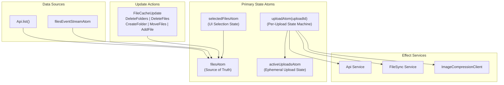

**Description:** This diagram illustrates the four core atoms and their relationships. `filesAtom` serves as the single source of truth for file/folder data, populated by both initial API load and real-time event streams. `uploadAtomFamily` creates isolated state machines for concurrent uploads, while `activeUploadsAtom` maintains ephemeral progress indicators. `selectedFilesAtom` tracks UI selection state independently.

**Sources:** [packages/client/src/routes/files/-files/files-atoms/files-atoms.tsx L258-L694](https://github.com/lucas-barake/effect-file-manager/blob/28eedd82/packages/client/src/routes/files/-files/files-atoms/files-atoms.tsx#L258-L694)

---

## filesAtom

The `filesAtom` is the master state atom containing all files and folders. It implements a writable atom pattern with three operations: read (get), write (update), and refresh.

### Data Structure

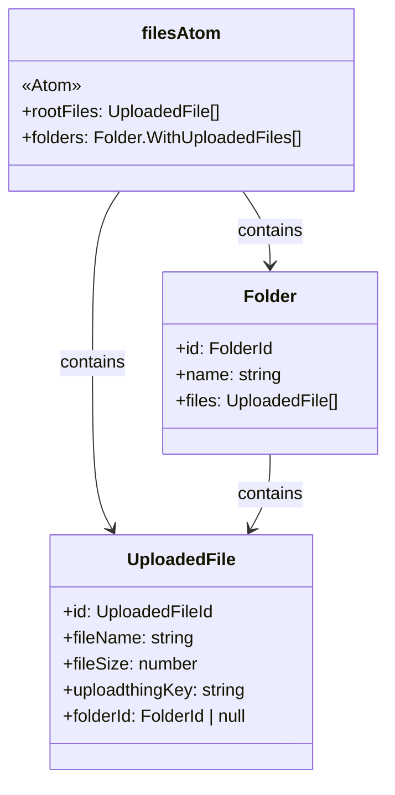

**Sources:** [packages/client/src/routes/files/-files/files-atoms/files-atoms.tsx L556-L694](https://github.com/lucas-barake/effect-file-manager/blob/28eedd82/packages/client/src/routes/files/-files/files-atoms/files-atoms.tsx#L556-L694)

### Initialization

The atom is initialized with a remote stream from the `Api.list()` service:

| Initialization Phase | Mechanism | Code Reference |
| --- | --- | --- |
| Remote Data Load | `Stream.unwrap` wrapping `Api.list()` | [packages/client/src/routes/files/-files/files-atoms/files-atoms.tsx L557-L563](https://github.com/lucas-barake/effect-file-manager/blob/28eedd82/packages/client/src/routes/files/-files/files-atoms/files-atoms.tsx#L557-L563) |
| Stream Accumulation | `Stream.scan` to aggregate files and folders | [packages/client/src/routes/files/-files/files-atoms/files-atoms.tsx L564-L570](https://github.com/lucas-barake/effect-file-manager/blob/28eedd82/packages/client/src/routes/files/-files/files-atoms/files-atoms.tsx#L564-L570) |
| Event Stream Mount | `get.mount(filesEventStreamAtom)` in read function | [packages/client/src/routes/files/-files/files-atoms/files-atoms.tsx L576](https://github.com/lucas-barake/effect-file-manager/blob/28eedd82/packages/client/src/routes/files/-files/files-atoms/files-atoms.tsx#L576-L576) |

**Sources:** [packages/client/src/routes/files/-files/files-atoms/files-atoms.tsx L556-L572](https://github.com/lucas-barake/effect-file-manager/blob/28eedd82/packages/client/src/routes/files/-files/files-atoms/files-atoms.tsx#L556-L572)

### Update Pattern

Updates to `filesAtom` are performed through tagged union types (`FileCacheUpdate`), enabling type-safe optimistic updates:

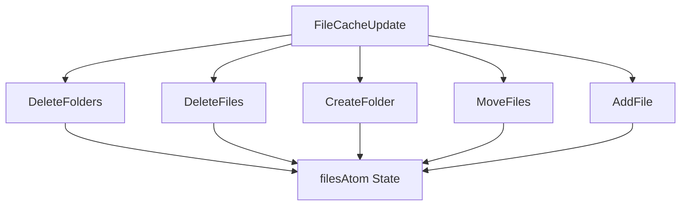

**Description:** The `FileCacheUpdate` tagged enum provides five distinct update operations. Each operation is processed by the atom's write function, which performs immutable transformations on the current state.

**Sources:** [packages/client/src/routes/files/-files/files-atoms/files-atoms.tsx L539-L554](https://github.com/lucas-barake/effect-file-manager/blob/28eedd82/packages/client/src/routes/files/-files/files-atoms/files-atoms.tsx#L539-L554)

 [packages/client/src/routes/files/-files/files-atoms/files-atoms.tsx L579-L689](https://github.com/lucas-barake/effect-file-manager/blob/28eedd82/packages/client/src/routes/files/-files/files-atoms/files-atoms.tsx#L579-L689)

### Update Operation Details

| Operation | Purpose | State Transformation |
| --- | --- | --- |
| `DeleteFolders` | Remove folders from list | Filters `folders` array by excluding specified `folderIds` |
| `DeleteFiles` | Remove files from root or folders | Filters both `rootFiles` and files within all folders |
| `CreateFolder` | Add new folder | Appends new folder to `folders` array with empty files list |
| `MoveFiles` | Relocate files between folders/root | Extracts files from source, removes from original location, adds to destination |
| `AddFile` | Add newly uploaded file | Prepends file to `rootFiles` or target folder's files array |

**Sources:** [packages/client/src/routes/files/-files/files-atoms/files-atoms.tsx L584-L686](https://github.com/lucas-barake/effect-file-manager/blob/28eedd82/packages/client/src/routes/files/-files/files-atoms/files-atoms.tsx#L584-L686)

---

## activeUploadsAtom

A simple state atom tracking uploads currently in progress for UI rendering purposes. This atom is ephemeral and does not persist across page reloads.

### Data Structure

The atom stores an array of `ActiveUpload` objects:

```

```

**Sources:** [packages/client/src/routes/files/-files/files-atoms/files-atoms.tsx L108-L114](https://github.com/lucas-barake/effect-file-manager/blob/28eedd82/packages/client/src/routes/files/-files/files-atoms/files-atoms.tsx#L108-L114)

 [packages/client/src/routes/files/-files/files-atoms/files-atoms.tsx L267](https://github.com/lucas-barake/effect-file-manager/blob/28eedd82/packages/client/src/routes/files/-files/files-atoms/files-atoms.tsx#L267-L267)

### Lifecycle

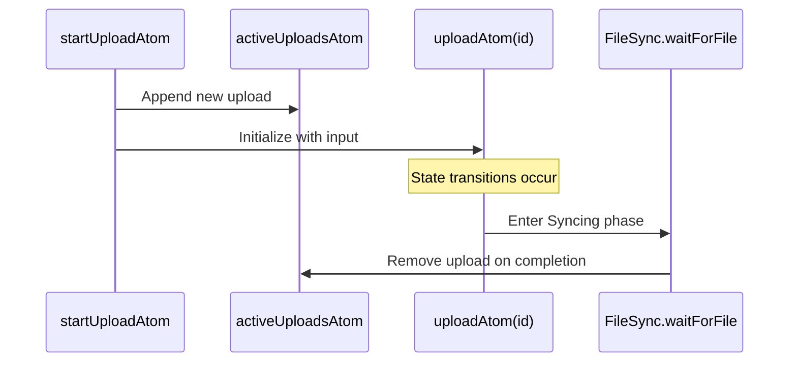

**Description:** Uploads are added to `activeUploadsAtom` when `startUploadAtom` is invoked. The entry persists until `FileSync.waitForFile` confirms the file has arrived on the server, at which point it is removed from the array.

**Sources:** [packages/client/src/routes/files/-files/files-atoms/files-atoms.tsx L420-L428](https://github.com/lucas-barake/effect-file-manager/blob/28eedd82/packages/client/src/routes/files/-files/files-atoms/files-atoms.tsx#L420-L428)

 [packages/client/src/routes/files/-files/files-atoms/files-atoms.tsx L165-L169](https://github.com/lucas-barake/effect-file-manager/blob/28eedd82/packages/client/src/routes/files/-files/files-atoms/files-atoms.tsx#L165-L169)

### Usage Context

The `activeUploadsAtom` is read by UI components (specifically `PendingFileItem`, documented in [Upload UI Component](/lucas-barake/effect-file-manager/4.4-upload-ui-component)) to display:

* File names being uploaded
* Upload progress indicators
* Current phase (Compressing, Uploading, Syncing)
* Cancellation controls

**Sources:** [packages/client/src/routes/files/-files/files-atoms/files-atoms.tsx L267](https://github.com/lucas-barake/effect-file-manager/blob/28eedd82/packages/client/src/routes/files/-files/files-atoms/files-atoms.tsx#L267-L267)

---

## selectedFilesAtom

Manages the user's current selection of files and folders in the file manager interface.

### Data Structure

```

```

The atom maintains two separate arrays: one for selected folder IDs and one for selected file IDs. When a folder is selected, all files within that folder are also included in `fileIds`.

**Sources:** [packages/client/src/routes/files/-files/files-atoms/files-atoms.tsx L258-L261](https://github.com/lucas-barake/effect-file-manager/blob/28eedd82/packages/client/src/routes/files/-files/files-atoms/files-atoms.tsx#L258-L261)

### Selection Operations

| Operation | Function | Behavior |
| --- | --- | --- |
| Toggle File | `toggleFileSelectionAtom` | Adds file ID if not present, removes if present |
| Toggle Folder | `toggleFolderSelectionAtom` | Toggles folder and all its file IDs atomically |
| Clear Selection | `clearSelectionAtom` | Resets both arrays to empty |

**Sources:** [packages/client/src/routes/files/-files/files-atoms/files-atoms.tsx L458-L505](https://github.com/lucas-barake/effect-file-manager/blob/28eedd82/packages/client/src/routes/files/-files/files-atoms/files-atoms.tsx#L458-L505)

### Selection State Diagram

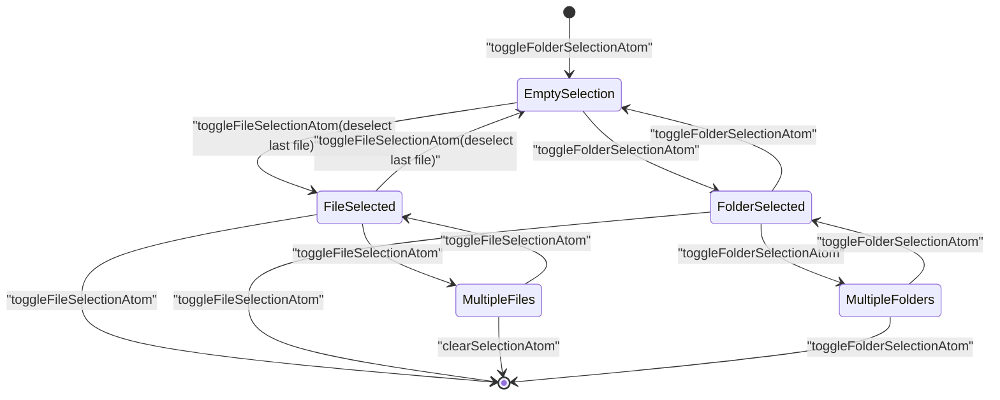

**Description:** The selection state transitions through multiple configurations as users interact with the file list. All selection operations are performed via runtime functions that access the `Registry.AtomRegistry` service.

**Sources:** [packages/client/src/routes/files/-files/files-atoms/files-atoms.tsx L458-L505](https://github.com/lucas-barake/effect-file-manager/blob/28eedd82/packages/client/src/routes/files/-files/files-atoms/files-atoms.tsx#L458-L505)

### Integration with Other Systems

The `selectedFilesAtom` is read by:

* `deleteFilesAtom` to determine which files/folders to delete
* `moveFilesAtom` to identify files for relocation
* UI components to highlight selected items

After operations that modify the file list, `selectedFilesAtom` is typically refreshed to remove invalid selections.

**Sources:** [packages/client/src/routes/files/-files/files-atoms/files-atoms.tsx L512-L533](https://github.com/lucas-barake/effect-file-manager/blob/28eedd82/packages/client/src/routes/files/-files/files-atoms/files-atoms.tsx#L512-L533)

 [packages/client/src/routes/files/-files/files-atoms/files-atoms.tsx L778](https://github.com/lucas-barake/effect-file-manager/blob/28eedd82/packages/client/src/routes/files/-files/files-atoms/files-atoms.tsx#L778-L778)

---

## uploadAtom Family

The `uploadAtom` is an atom family, meaning it dynamically creates individual atoms keyed by upload ID. Each atom instance manages the state machine for a single file upload operation.

### Atom Family Pattern

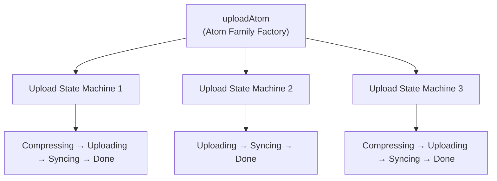

**Description:** The atom family creates isolated, concurrent upload state machines. Each upload has a unique UUID and maintains its own independent state stream. This enables multiple uploads to proceed simultaneously without interference.

**Sources:** [packages/client/src/routes/files/-files/files-atoms/files-atoms.tsx L399-L401](https://github.com/lucas-barake/effect-file-manager/blob/28eedd82/packages/client/src/routes/files/-files/files-atoms/files-atoms.tsx#L399-L401)

### State Machine Definition

Each upload atom produces a stream of `[UploadPhase, UploadState]` tuples:

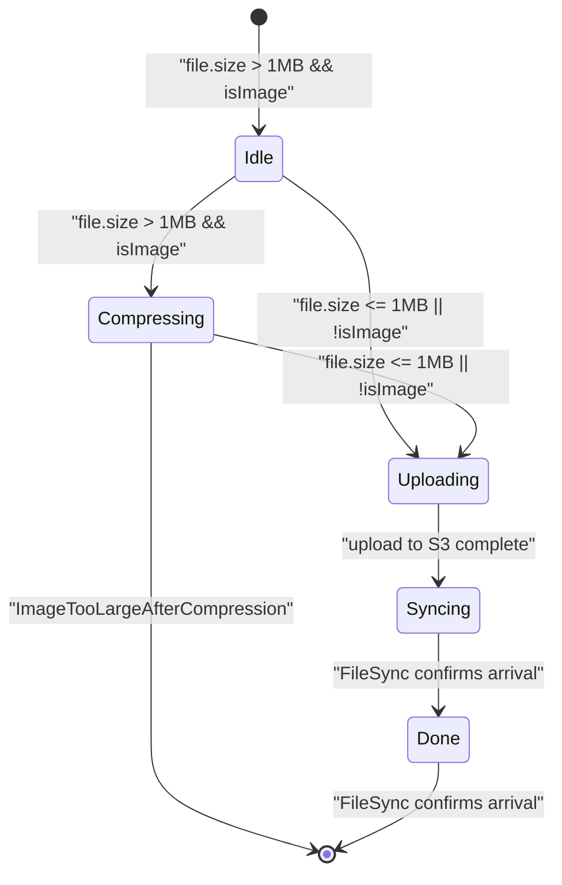

**Description:** The upload state machine transitions through up to four phases. Images larger than 1MB are compressed first. After direct upload to S3, the system waits for server confirmation before marking the upload complete.

**Sources:** [packages/client/src/routes/files/-files/files-atoms/files-atoms.tsx L121-L128](https://github.com/lucas-barake/effect-file-manager/blob/28eedd82/packages/client/src/routes/files/-files/files-atoms/files-atoms.tsx#L121-L128)

 [packages/client/src/routes/files/-files/files-atoms/files-atoms.tsx L286-L396](https://github.com/lucas-barake/effect-file-manager/blob/28eedd82/packages/client/src/routes/files/-files/files-atoms/files-atoms.tsx#L286-L396)

### State Types

| State Tag | Fields | Description |
| --- | --- | --- |
| `Idle` | `input: UploadInput` | Initial state before processing begins |
| `Compressing` | `input: UploadInput` | Image compression in progress (Web Worker) |
| `Uploading` | `input: UploadInput``fileToUpload: File` | HTTP POST to presigned S3 URL |
| `Syncing` | `input: UploadInput``fileKey: string` | Waiting for server-side confirmation |
| `Done` | None | Upload complete and confirmed |

**Sources:** [packages/client/src/routes/files/-files/files-atoms/files-atoms.tsx L121-L128](https://github.com/lucas-barake/effect-file-manager/blob/28eedd82/packages/client/src/routes/files/-files/files-atoms/files-atoms.tsx#L121-L128)

### Phase Types

Parallel to the internal `UploadState`, the atom emits `UploadPhase` for UI consumption:

```

```

These phases provide a simplified view of the upload process suitable for progress indicators and status displays.

**Sources:** [packages/client/src/routes/files/-files/files-atoms/files-atoms.tsx L100-L106](https://github.com/lucas-barake/effect-file-manager/blob/28eedd82/packages/client/src/routes/files/-files/files-atoms/files-atoms.tsx#L100-L106)

### Stream Construction

The upload stream is constructed using `Stream.unfoldEffect`:

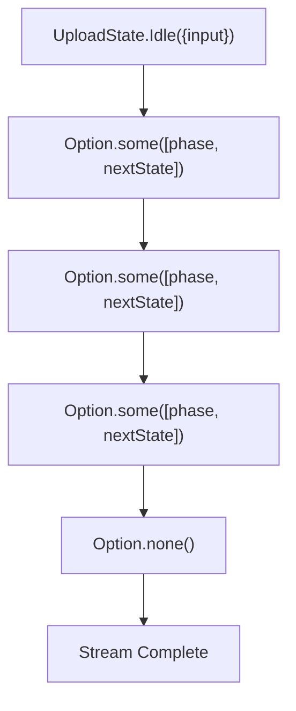

**Description:** The `transition` function is called repeatedly on each state, returning `Option.some([phase, nextState])` to continue or `Option.none()` to terminate. This pattern creates a self-contained state machine that automatically progresses through upload phases.

**Sources:** [packages/client/src/routes/files/-files/files-atoms/files-atoms.tsx L286-L397](https://github.com/lucas-barake/effect-file-manager/blob/28eedd82/packages/client/src/routes/files/-files/files-atoms/files-atoms.tsx#L286-L397)

### Service Dependencies

The upload stream depends on three Effect services:

| Service | Usage | Code Location |
| --- | --- | --- |
| `Api` | Obtain presigned URL via `initiateUpload` | [packages/client/src/routes/files/-files/files-atoms/files-atoms.tsx L354-L359](https://github.com/lucas-barake/effect-file-manager/blob/28eedd82/packages/client/src/routes/files/-files/files-atoms/files-atoms.tsx#L354-L359) |
| `FileSync` | Wait for backend confirmation | [packages/client/src/routes/files/-files/files-atoms/files-atoms.tsx L376](https://github.com/lucas-barake/effect-file-manager/blob/28eedd82/packages/client/src/routes/files/-files/files-atoms/files-atoms.tsx#L376-L376) |
| `ImageCompressionClient` | Compress large images in Web Worker | [packages/client/src/routes/files/-files/files-atoms/files-atoms.tsx L320-L325](https://github.com/lucas-barake/effect-file-manager/blob/28eedd82/packages/client/src/routes/files/-files/files-atoms/files-atoms.tsx#L320-L325) |

**Sources:** [packages/client/src/routes/files/-files/files-atoms/files-atoms.tsx L275-L284](https://github.com/lucas-barake/effect-file-manager/blob/28eedd82/packages/client/src/routes/files/-files/files-atoms/files-atoms.tsx#L275-L284)

### Compression Logic

Images exceeding `MAX_FILE_SIZE_BYTES` (1 MB) trigger iterative compression:

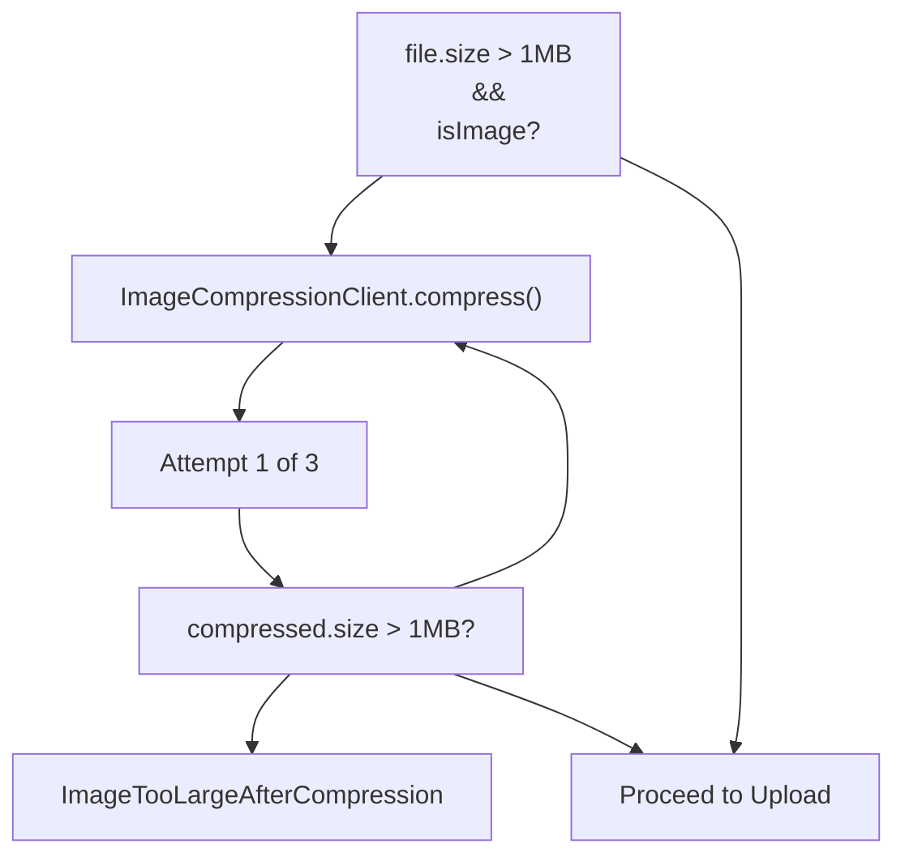

**Description:** Compression uses an iterative strategy with up to 3 attempts. Each attempt reduces quality further. If the file remains above 1 MB after all attempts, the upload fails with `ImageTooLargeAfterCompression` error.

**Sources:** [packages/client/src/routes/files/-files/files-atoms/files-atoms.tsx L289-L341](https://github.com/lucas-barake/effect-file-manager/blob/28eedd82/packages/client/src/routes/files/-files/files-atoms/files-atoms.tsx#L289-L341)

### Direct S3 Upload

The `Uploading` state performs a direct HTTP POST to the S3-compatible storage using a presigned URL:

1. Request presigned URL and fields from server via `Api.initiateUpload`
2. Construct `FormData` with the provided fields
3. Append file to form data
4. POST to presigned URL using `HttpClient` with retry logic

The server never proxies file data, reducing bandwidth and enabling horizontal scaling.

**Sources:** [packages/client/src/routes/files/-files/files-atoms/files-atoms.tsx L353-L372](https://github.com/lucas-barake/effect-file-manager/blob/28eedd82/packages/client/src/routes/files/-files/files-atoms/files-atoms.tsx#L353-L372)

### Synchronization Phase

After successful upload, the atom enters the `Syncing` state:

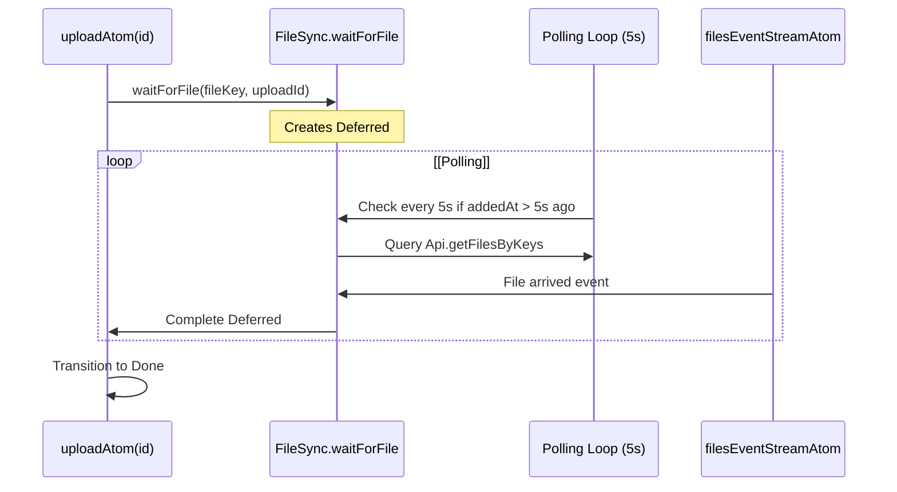

**Description:** The synchronization uses a dual mechanism: 5-second polling for reliability and event-based notification for low latency. Once confirmed, the upload is removed from `activeUploadsAtom`.

**Sources:** [packages/client/src/routes/files/-files/files-atoms/files-atoms.tsx L156-L169](https://github.com/lucas-barake/effect-file-manager/blob/28eedd82/packages/client/src/routes/files/-files/files-atoms/files-atoms.tsx#L156-L169)

 [packages/client/src/routes/files/-files/files-atoms/files-atoms.tsx L171-L191](https://github.com/lucas-barake/effect-file-manager/blob/28eedd82/packages/client/src/routes/files/-files/files-atoms/files-atoms.tsx#L171-L191)

 [packages/client/src/routes/files/-files/files-atoms/files-atoms.tsx L375-L380](https://github.com/lucas-barake/effect-file-manager/blob/28eedd82/packages/client/src/routes/files/-files/files-atoms/files-atoms.tsx#L375-L380)

---

## Supporting Services

The atoms depend on several Effect services that must be provided in the runtime:

### Service Dependency Graph

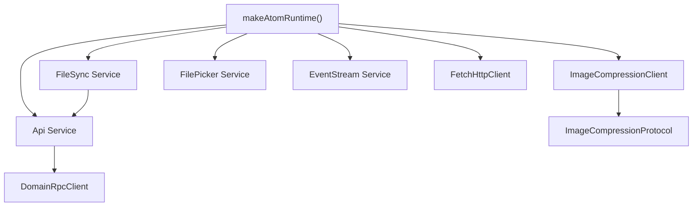

**Description:** The runtime is constructed with `makeAtomRuntime`, which accepts a merged layer containing all necessary services. This enables dependency injection and facilitates testing with mock implementations.

**Sources:** [packages/client/src/routes/files/-files/files-atoms/files-atoms.tsx L247-L256](https://github.com/lucas-barake/effect-file-manager/blob/28eedd82/packages/client/src/routes/files/-files/files-atoms/files-atoms.tsx#L247-L256)

### Service Purposes

| Service | Purpose | Creation Pattern |
| --- | --- | --- |
| `Api` | RPC client for file operations | `Effect.Service` with `DomainRpcClient` dependency |
| `FileSync` | Upload completion coordination | Scoped service with internal deferred map |
| `ImageCompressionClient` | Web Worker compression interface | Scoped service with RPC client to worker |
| `FilePicker` | Browser file selection dialog | Scoped service managing hidden input element |
| `EventStream` | WebSocket event subscription | External service from `@/lib/event-stream-atoms` |

**Sources:** [packages/client/src/routes/files/-files/files-atoms/files-atoms.tsx L41-L245](https://github.com/lucas-barake/effect-file-manager/blob/28eedd82/packages/client/src/routes/files/-files/files-atoms/files-atoms.tsx#L41-L245)

---

## FileCacheUpdate Type

The `FileCacheUpdate` tagged enum defines all possible local modifications to `filesAtom`:

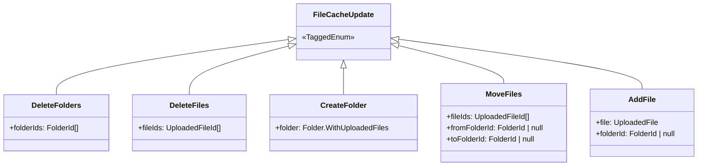

**Description:** This tagged enum provides type-safe updates to the file cache. Each variant carries the minimal data needed to perform its specific operation. The pattern enables optimistic UI updates before server confirmation.

**Sources:** [packages/client/src/routes/files/-files/files-atoms/files-atoms.tsx L539-L554](https://github.com/lucas-barake/effect-file-manager/blob/28eedd82/packages/client/src/routes/files/-files/files-atoms/files-atoms.tsx#L539-L554)

### Update Constructor Functions

The enum is instantiated using auto-generated constructor functions:

```

```

These constructors are used throughout runtime functions to create update actions:

* `DeleteFolders({ folderIds })` - Used in `deleteFilesAtom`
* `DeleteFiles({ fileIds })` - Used in `deleteFilesAtom`
* `CreateFolder({ folder })` - Used in `createFolderAtom`
* `MoveFiles({ fileIds, fromFolderId, toFolderId })` - Used in `moveFilesAtom`
* `AddFile({ file, folderId })` - Used in `filesEventStreamAtom` and `FileSync`

**Sources:** [packages/client/src/routes/files/-files/files-atoms/files-atoms.tsx L553-L554](https://github.com/lucas-barake/effect-file-manager/blob/28eedd82/packages/client/src/routes/files/-files/files-atoms/files-atoms.tsx#L553-L554)

---

## Atom Initialization and Runtime

All atoms are accessed through the `runtime` object created by `makeAtomRuntime`:

```

```

The runtime provides:

* `runtime.atom()` - Create atoms with Effect-based initialization
* `runtime.fn()` - Create runtime functions that access atoms and services
* Service resolution for all dependencies

**Sources:** [packages/client/src/routes/files/-files/files-atoms/files-atoms.tsx L247-L256](https://github.com/lucas-barake/effect-file-manager/blob/28eedd82/packages/client/src/routes/files/-files/files-atoms/files-atoms.tsx#L247-L256)

### Atom Access Pattern

Atoms are exported as constants and accessed directly in React components:

```

```

React components use hooks from `@effect-atom/atom-react` to read and observe these atoms. For details on runtime functions that modify atoms, see [Runtime Functions](/lucas-barake/effect-file-manager/5.2-runtime-functions).

**Sources:** [packages/client/src/routes/files/-files/files-atoms/files-atoms.tsx L258-L401](https://github.com/lucas-barake/effect-file-manager/blob/28eedd82/packages/client/src/routes/files/-files/files-atoms/files-atoms.tsx#L258-L401)