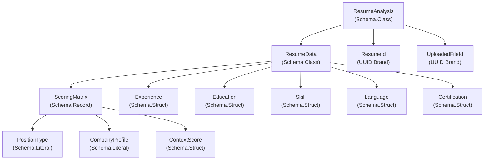
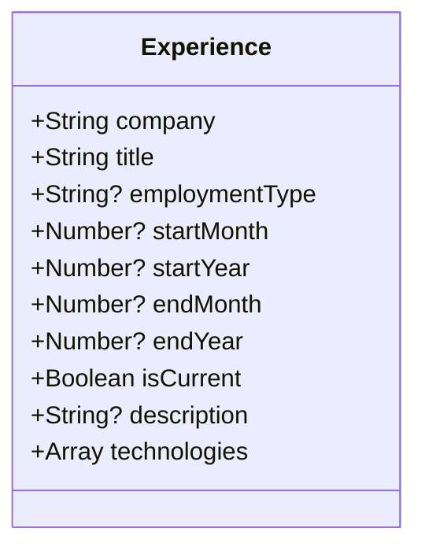
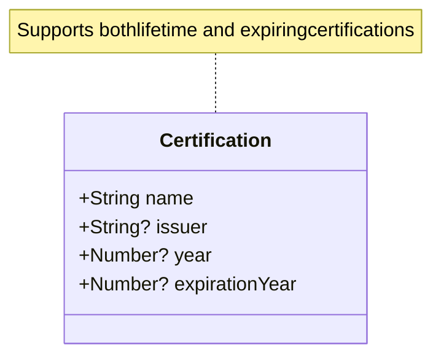
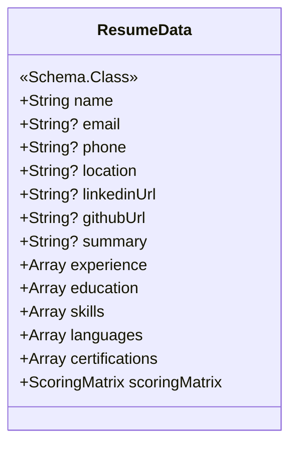
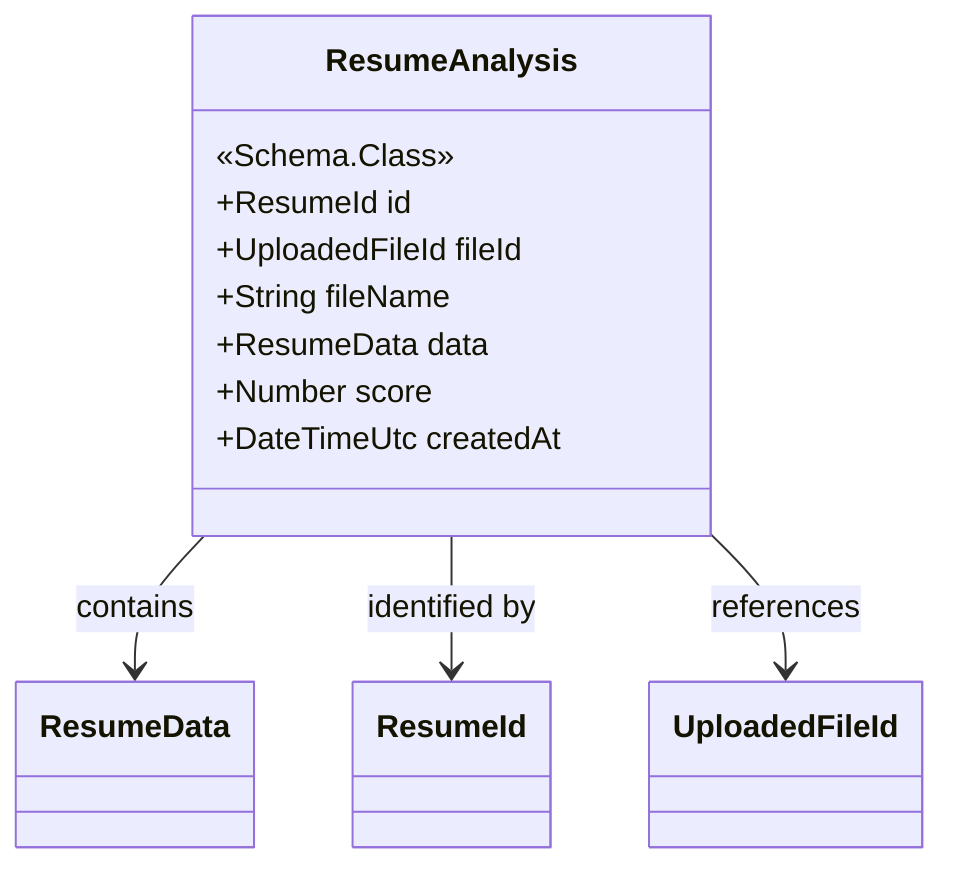
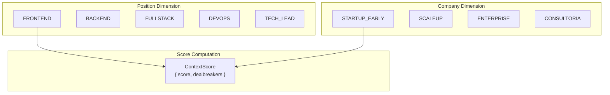
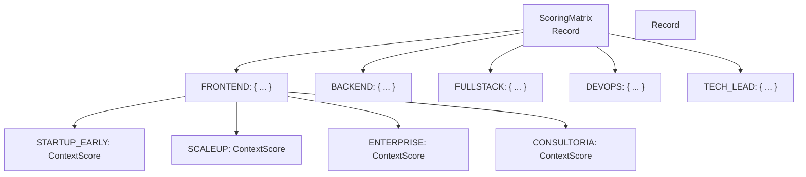
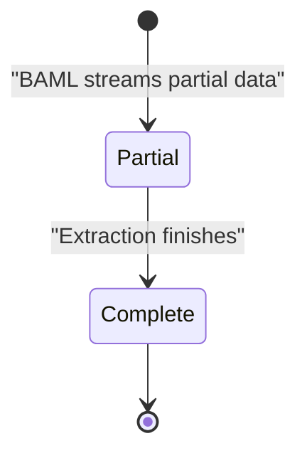
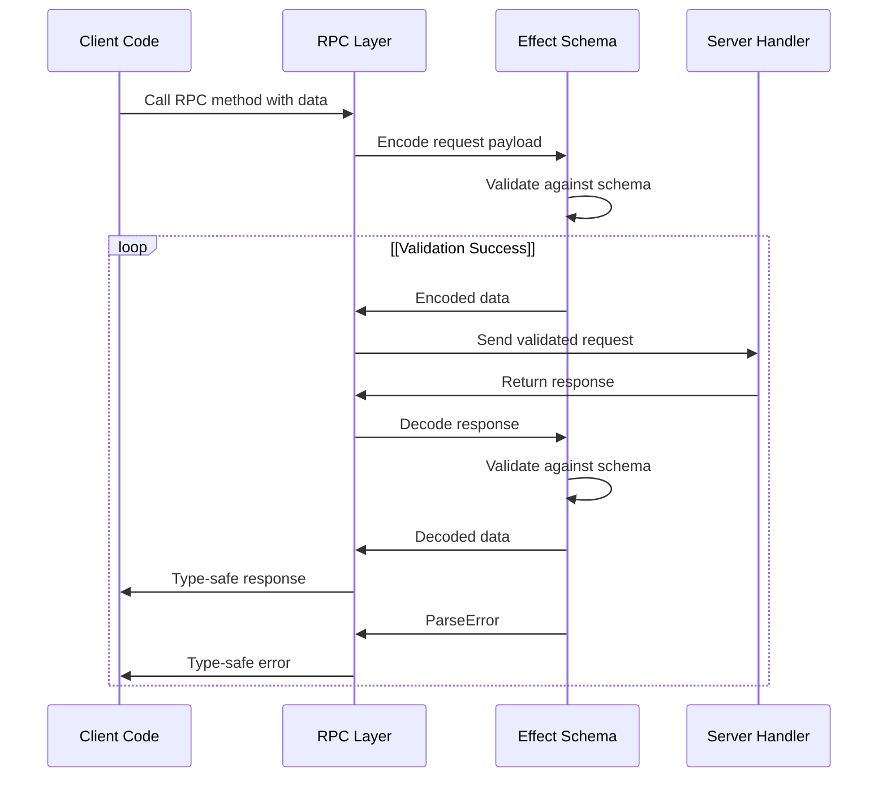
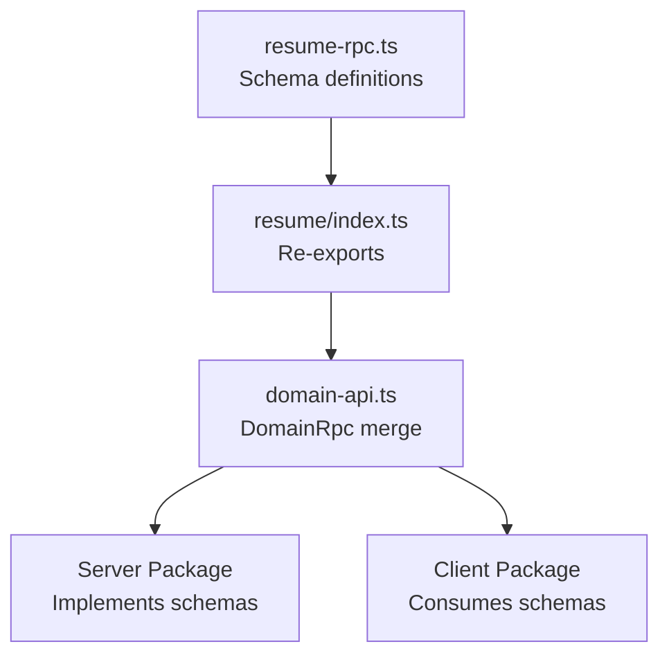

# Data Models and Schemas

> **Relevant source files**
> * [packages/domain/src/api/resume/index.ts](https://github.com/oscaromsn/TalentScore/blob/428ed1eb/packages/domain/src/api/resume/index.ts)
> * [packages/domain/src/api/resume/resume-rpc.ts](https://github.com/oscaromsn/TalentScore/blob/428ed1eb/packages/domain/src/api/resume/resume-rpc.ts)
> * [packages/domain/src/domain-api.ts](https://github.com/oscaromsn/TalentScore/blob/428ed1eb/packages/domain/src/domain-api.ts)

## Purpose and Scope

This document catalogs all data models and validation schemas defined in the `packages/domain` package. These schemas serve as the single source of truth for data structures shared between client and server, providing runtime type safety via Effect Schema.

The focus is on the structure and validation rules of domain entities. For information about how these schemas are used in RPC contracts, see [RPC Contracts](/oscaromsn/TalentScore/3.1-rpc-contracts). For the scoring algorithm that populates the `ScoringMatrix`, see [Scoring Algorithm](/oscaromsn/TalentScore/4.4.2-scoring-algorithm).

**Sources:** [packages/domain/src/api/resume/resume-rpc.ts L1-L215](https://github.com/oscaromsn/TalentScore/blob/428ed1eb/packages/domain/src/api/resume/resume-rpc.ts#L1-L215)

---

## Schema System Architecture

The domain package uses **Effect Schema** for declarative data modeling with runtime validation. All schemas provide both compile-time TypeScript types and runtime validation/parsing capabilities.

### Schema Definition Pattern

```
Schema → Type Extraction → Runtime Validation
```

Effect Schema enables:

* **Type inference**: TypeScript types automatically derived from schema definitions
* **Runtime validation**: Automatic validation of incoming data against schema rules
* **Serialization**: Safe encoding/decoding across RPC boundaries
* **Composition**: Schemas can be composed and transformed

### Entity Diagram: Core Domain Models



**Sources:** [packages/domain/src/api/resume/resume-rpc.ts L59-L149](https://github.com/oscaromsn/TalentScore/blob/428ed1eb/packages/domain/src/api/resume/resume-rpc.ts#L59-L149)

---

## Identifier Types

Branded UUID types ensure type safety across domain boundaries, preventing ID confusion at compile time.

| Schema | Brand | Description | Line Reference |
| --- | --- | --- | --- |
| `ResumeId` | `"ResumeId"` | Unique identifier for resume analyses | [resume-rpc.ts L59-L60](https://github.com/oscaromsn/TalentScore/blob/428ed1eb/resume-rpc.ts#L59-L60) |
| `UploadedFileId` | `"UploadedFileId"` | Unique identifier for uploaded files (defined in files-rpc) | [resume-rpc.ts L4](https://github.com/oscaromsn/TalentScore/blob/428ed1eb/resume-rpc.ts#L4-L4) |

Both use `Schema.UUID.pipe(Schema.brand(...))` to create distinct types that prevent mixing different ID types in function signatures.

**Sources:** [packages/domain/src/api/resume/resume-rpc.ts L59-L60](https://github.com/oscaromsn/TalentScore/blob/428ed1eb/packages/domain/src/api/resume/resume-rpc.ts#L59-L60)

 [packages/domain/src/api/resume/resume-rpc.ts L4](https://github.com/oscaromsn/TalentScore/blob/428ed1eb/packages/domain/src/api/resume/resume-rpc.ts#L4-L4)

---

## Resume Sub-Entity Schemas

### Experience Schema

Represents a single work experience entry with temporal and technical metadata.



**Field Semantics:**

* **Temporal fields**: `startMonth`/`startYear` and `endMonth`/`endYear` support flexible date representations
* **`isCurrent`**: Distinguishes current positions (no `endMonth`/`endYear` expected)
* **`technologies`**: Extracted technology stack used in this role
* **`employmentType`**: Nullable string allowing values like "Full-time", "Contract", "Freelance"

**Sources:** [packages/domain/src/api/resume/resume-rpc.ts L63-L74](https://github.com/oscaromsn/TalentScore/blob/428ed1eb/packages/domain/src/api/resume/resume-rpc.ts#L63-L74)

---

### Education Schema

Represents an educational credential with institution, degree, and completion status.

| Field | Type | Nullability | Description |
| --- | --- | --- | --- |
| `institution` | `String` | Required | University or educational institution name |
| `degree` | `String` | Required | Degree name (e.g., "Bachelor of Science") |
| `fieldOfStudy` | `String` | Nullable | Major or specialization |
| `level` | `String` | Required | Education level (e.g., "BACHELORS", "MASTERS") |
| `status` | `String` | Required | Completion status (e.g., "COMPLETED", "IN_PROGRESS") |
| `startYear` | `Number` | Nullable | Year education began |
| `endYear` | `Number` | Nullable | Year education completed/expected |

**Sources:** [packages/domain/src/api/resume/resume-rpc.ts L77-L86](https://github.com/oscaromsn/TalentScore/blob/428ed1eb/packages/domain/src/api/resume/resume-rpc.ts#L77-L86)

---

### Skill Schema

Represents a technical or professional skill with categorization and experience tracking.

```yaml
// Example instance
{
  name: "React",
  category: "FRONTEND_FRAMEWORK",
  yearsExperience: 5
}
```

**Field Definitions:**

* **`name`** (`String`): Skill name as extracted from resume
* **`category`** (`String`): Skill classification (e.g., "FRONTEND_FRAMEWORK", "BACKEND", "DATABASE")
* **`yearsExperience`** (`Number?`): Calculated or stated years of experience

**Sources:** [packages/domain/src/api/resume/resume-rpc.ts L88-L93](https://github.com/oscaromsn/TalentScore/blob/428ed1eb/packages/domain/src/api/resume/resume-rpc.ts#L88-L93)

---

### Language Schema

Represents language proficiency information.

| Field | Type | Description |
| --- | --- | --- |
| `name` | `String` | Language name (e.g., "English", "Spanish") |
| `proficiency` | `String` | Proficiency level (e.g., "NATIVE", "FLUENT", "INTERMEDIATE") |

**Sources:** [packages/domain/src/api/resume/resume-rpc.ts L95-L99](https://github.com/oscaromsn/TalentScore/blob/428ed1eb/packages/domain/src/api/resume/resume-rpc.ts#L95-L99)

---

### Certification Schema

Represents professional certifications with issuer and validity tracking.



**Field Semantics:**

* **`issuer`**: Certifying organization (e.g., "AWS", "Microsoft")
* **`year`**: Year certification was obtained
* **`expirationYear`**: If present, indicates certification has expiration date

**Sources:** [packages/domain/src/api/resume/resume-rpc.ts L101-L107](https://github.com/oscaromsn/TalentScore/blob/428ed1eb/packages/domain/src/api/resume/resume-rpc.ts#L101-L107)

---

## Main Aggregate Schemas

### ResumeData Class

The primary domain model aggregating all extracted resume information.



**Class Inheritance:**

* Uses `Schema.Class` pattern for nominal typing and automatic validation
* Extends `Schema.Class<ResumeData>("ResumeData")` to create a class-based schema

**Contact Information:**

* All contact fields (`email`, `phone`, `location`, URLs) are nullable since not all resumes contain complete contact info

**Collections:**

* All collection fields (`experience`, `education`, etc.) are non-nullable arrays (may be empty)
* BAML extraction guarantees array types, even if empty

**Scoring Integration:**

* `scoringMatrix` field contains the 5×4 context score matrix (see [Scoring Matrix Design](/oscaromsn/TalentScore/3.3-scoring-matrix-design))
* Calculated server-side after extraction completes

**Sources:** [packages/domain/src/api/resume/resume-rpc.ts L109-L123](https://github.com/oscaromsn/TalentScore/blob/428ed1eb/packages/domain/src/api/resume/resume-rpc.ts#L109-L123)

---

### PartialResumeData Schema

Streaming variant of `ResumeData` used for progressive UI updates during BAML extraction.

**Key Differences from ResumeData:**

| Aspect | ResumeData | PartialResumeData |
| --- | --- | --- |
| Scalar fields | Required (if not nullable) | All optional via `Schema.optionalWith` |
| Array fields | Required (empty arrays allowed) | Required (always present) |
| Scoring matrix | Required | Not included |
| Use case | Complete analysis | Streaming partial results |

**Schema Definition Pattern:**

```
Schema.optionalWith(Schema.NullOr(Schema.String), { exact: true })
```

The `{ exact: true }` option ensures strict optional handling during serialization/deserialization.

**Streaming Semantics:**

* Arrays arrive progressively: first empty `[]`, then populated as extraction proceeds
* Scalar fields (`name`, `email`, etc.) may be undefined initially, then populated
* Client can render partial data immediately without waiting for complete extraction

**Sources:** [packages/domain/src/api/resume/resume-rpc.ts L125-L140](https://github.com/oscaromsn/TalentScore/blob/428ed1eb/packages/domain/src/api/resume/resume-rpc.ts#L125-L140)

---

### ResumeAnalysis Class

Top-level entity representing a complete resume analysis with metadata.



**Field Purposes:**

* **`id`**: Primary key for the analysis (generated server-side)
* **`fileId`**: Foreign key to the uploaded file in `files` table
* **`fileName`**: Denormalized filename for display purposes
* **`data`**: Complete structured resume data
* **`score`**: Overall weighted score (0-100 scale)
* **`createdAt`**: Timestamp using Effect's `Schema.DateTimeUtc` for timezone-safe serialization

**Sources:** [packages/domain/src/api/resume/resume-rpc.ts L142-L149](https://github.com/oscaromsn/TalentScore/blob/428ed1eb/packages/domain/src/api/resume/resume-rpc.ts#L142-L149)

---

## Context Scoring Type System

The scoring system uses a two-dimensional context matrix to evaluate resumes against specific hiring scenarios.

### Context Dimension Schemas



#### PositionType Literal

```
Schema.Literal("FRONTEND", "BACKEND", "FULLSTACK", "DEVOPS", "TECH_LEAD")
```

**Enumerated Values:**

* `FRONTEND`: Front-end engineer roles
* `BACKEND`: Back-end engineer roles
* `FULLSTACK`: Full-stack engineer roles
* `DEVOPS`: DevOps/Infrastructure roles
* `TECH_LEAD`: Technical leadership roles

**Iteration Support:**

```javascript
export const POSITION_TYPES: readonly PositionType[] = [...]
```

Exported constant enables server-side iteration for matrix generation.

**Sources:** [packages/domain/src/api/resume/resume-rpc.ts L9-L48](https://github.com/oscaromsn/TalentScore/blob/428ed1eb/packages/domain/src/api/resume/resume-rpc.ts#L9-L48)

---

#### CompanyProfile Literal

```
Schema.Literal("STARTUP_EARLY", "SCALEUP", "ENTERPRISE", "CONSULTORIA")
```

**Enumerated Values:**

* `STARTUP_EARLY`: Early-stage startups (small teams, rapid iteration)
* `SCALEUP`: Growing companies (100-500 employees, process maturation)
* `ENTERPRISE`: Large organizations (established processes, compliance focus)
* `CONSULTORIA`: Consulting/agency environments (client-facing, varied projects)

**Iteration Support:**

```javascript
export const COMPANY_PROFILES: readonly CompanyProfile[] = [...]
```

**Sources:** [packages/domain/src/api/resume/resume-rpc.ts L18-L55](https://github.com/oscaromsn/TalentScore/blob/428ed1eb/packages/domain/src/api/resume/resume-rpc.ts#L18-L55)

---

### ContextScore Schema

Represents the evaluation result for a specific Position × Company context.

| Field | Type | Description |
| --- | --- | --- |
| `score` | `Number` | Weighted score (0-100 scale) for this context |
| `dealbreakers` | `Array<String>` | List of disqualifying issues specific to this context |

**Example Instance:**

```json
{
  "score": 78.5,
  "dealbreakers": [
    "Missing AWS certification required for Enterprise DevOps",
    "No experience with HIPAA compliance"
  ]
}
```

**Sources:** [packages/domain/src/api/resume/resume-rpc.ts L26-L30](https://github.com/oscaromsn/TalentScore/blob/428ed1eb/packages/domain/src/api/resume/resume-rpc.ts#L26-L30)

---

### ScoringMatrix Schema

Nested record structure representing all 20 context combinations (5 positions × 4 company types).



**Schema Definition:**

```yaml
Schema.Record({
  key: PositionType,
  value: Schema.Record({
    key: CompanyProfile,
    value: ContextScore
  })
})
```

**Access Pattern:**

```javascript
const score = scoringMatrix["BACKEND"]["STARTUP_EARLY"].score;
const dealbreakers = scoringMatrix["TECH_LEAD"]["ENTERPRISE"].dealbreakers;
```

**Population:**

* Generated server-side by scoring algorithm after BAML extraction completes
* Each cell computed independently with context-specific weights and rules
* See [Scoring Algorithm](/oscaromsn/TalentScore/4.4.2-scoring-algorithm) for calculation details

**Sources:** [packages/domain/src/api/resume/resume-rpc.ts L32-L39](https://github.com/oscaromsn/TalentScore/blob/428ed1eb/packages/domain/src/api/resume/resume-rpc.ts#L32-L39)

---

## Streaming Event Types

### ParseEvent Union

Discriminated union type for streaming resume parsing progress to the client.



**Variant Definitions:**

#### Partial Variant

```yaml
Schema.TaggedStruct("Partial", {
  data: PartialResumeData
})
```

Emitted multiple times during streaming extraction. Contains progressively more complete data.

#### Complete Variant

```yaml
Schema.TaggedStruct("Complete", {
  analysis: ResumeAnalysis
})
```

Emitted once when parsing, scoring, and persistence complete. Contains the full `ResumeAnalysis` with ID and scores.

**Tag-Based Discrimination:**

```
if (event._tag === "Partial") {
  // Handle partial data: event.data
} else if (event._tag === "Complete") {
  // Handle complete analysis: event.analysis
}
```

**Sources:** [packages/domain/src/api/resume/resume-rpc.ts L153-L161](https://github.com/oscaromsn/TalentScore/blob/428ed1eb/packages/domain/src/api/resume/resume-rpc.ts#L153-L161)

---

## Error Schemas

All errors extend `Schema.TaggedError` for type-safe error handling across RPC boundaries.

### Error Type Catalog

| Error Class | Tag | Fields | When Thrown | Line Reference |
| --- | --- | --- | --- | --- |
| `LimitExceededError` | `"LimitExceeded"` | `message: String` | User exceeds 10 resume limit | [resume-rpc.ts L165-L170](https://github.com/oscaromsn/TalentScore/blob/428ed1eb/resume-rpc.ts#L165-L170) |
| `FileNotFoundError` | `"FileNotFound"` | None | Referenced file doesn't exist | [resume-rpc.ts L172-L175](https://github.com/oscaromsn/TalentScore/blob/428ed1eb/resume-rpc.ts#L172-L175) |
| `ParsingFailedError` | `"ParsingFailed"` | `message: String` | BAML extraction fails | [resume-rpc.ts L177-L182](https://github.com/oscaromsn/TalentScore/blob/428ed1eb/resume-rpc.ts#L177-L182) |

**Error Union Usage:**

```yaml
// In ParseResumeRpc definition
error: Schema.Union(
  LimitExceededError,
  FileNotFoundError,
  ParsingFailedError
)
```

**Client-Side Handling:**

```javascript
Effect.match(parseResult, {
  onSuccess: (event) => { /* ... */ },
  onFailure: (error) => {
    if (error._tag === "LimitExceeded") {
      // Show upgrade prompt
    } else if (error._tag === "FileNotFound") {
      // Show file missing error
    } else if (error._tag === "ParsingFailed") {
      // Show parsing error with message
    }
  }
})
```

**Sources:** [packages/domain/src/api/resume/resume-rpc.ts L165-L182](https://github.com/oscaromsn/TalentScore/blob/428ed1eb/packages/domain/src/api/resume/resume-rpc.ts#L165-L182)

---

## Schema Validation Approach

### Runtime Validation Flow



**Validation Points:**

1. **Request Encoding** (Client → Server): * Payload validated against request schema * Type errors caught before network transmission
2. **Response Decoding** (Server → Client): * Response validated against success/error union schema * Prevents runtime type errors from malformed server data
3. **Streaming Events**: * Each `ParseEvent` variant validated independently * Partial data validated against `PartialResumeData` schema * Complete data validated against `ResumeAnalysis` schema

**Schema Composition Benefits:**

* Nested schemas (e.g., `Experience` within `ResumeData`) validated recursively
* Array element validation automatic
* Nullable field handling consistent across all schemas

**Sources:** [packages/domain/src/api/resume/resume-rpc.ts L1-L215](https://github.com/oscaromsn/TalentScore/blob/428ed1eb/packages/domain/src/api/resume/resume-rpc.ts#L1-L215)

---

## Schema Export and Usage

### Domain API Integration

All resume schemas are re-exported through the domain package index for centralized access.



**Import Paths:**

Server-side:

```javascript
import { ResumeData, ResumeAnalysis, ParseEvent } from "@talentscore/domain";
```

Client-side:

```javascript
import { ResumeData, ScoringMatrix, PositionType } from "@talentscore/domain";
```

**Monorepo Dependency:**

* `packages/server/package.json` depends on `@talentscore/domain`
* `packages/client/package.json` depends on `@talentscore/domain`
* Both packages share identical type definitions at compile and runtime

**Sources:** [packages/domain/src/api/resume/index.ts L1-L2](https://github.com/oscaromsn/TalentScore/blob/428ed1eb/packages/domain/src/api/resume/index.ts#L1-L2)

 [packages/domain/src/domain-api.ts L1-L5](https://github.com/oscaromsn/TalentScore/blob/428ed1eb/packages/domain/src/domain-api.ts#L1-L5)

---

## Schema Summary Table

### Complete Schema Catalog

| Schema Name | Type | Purpose | Nullable | Arrays | Source Lines |
| --- | --- | --- | --- | --- | --- |
| `ResumeId` | UUID Brand | Resume identifier | No | N/A | 59-60 |
| `Experience` | Struct | Work experience entry | Partial | `technologies` | 63-74 |
| `Education` | Struct | Educational credential | Partial | None | 77-86 |
| `Skill` | Struct | Technical/professional skill | Partial | None | 88-93 |
| `Language` | Struct | Language proficiency | No | None | 95-99 |
| `Certification` | Struct | Professional certification | Partial | None | 101-107 |
| `ResumeData` | Class | Complete resume data | Partial | Multiple | 109-123 |
| `PartialResumeData` | Struct | Streaming resume data | All optional | Multiple | 126-140 |
| `ResumeAnalysis` | Class | Resume analysis entity | No | Via `data` | 142-149 |
| `PositionType` | Literal | Position dimension | No | N/A | 9-15 |
| `CompanyProfile` | Literal | Company dimension | No | N/A | 18-24 |
| `ContextScore` | Struct | Single context score | No | `dealbreakers` | 26-30 |
| `ScoringMatrix` | Record | All context scores | No | Via records | 32-39 |
| `ParseEvent` | Union | Streaming event | No | N/A | 153-161 |
| `LimitExceededError` | TaggedError | User limit error | No | None | 165-170 |
| `FileNotFoundError` | TaggedError | Missing file error | No | None | 172-175 |
| `ParsingFailedError` | TaggedError | BAML failure error | No | None | 177-182 |

**Legend:**

* **Nullable**: Whether the schema itself or its fields can be null
* **Arrays**: Which fields are array types
* **Source Lines**: Line numbers in `packages/domain/src/api/resume/resume-rpc.ts`

**Sources:** [packages/domain/src/api/resume/resume-rpc.ts L1-L215](https://github.com/oscaromsn/TalentScore/blob/428ed1eb/packages/domain/src/api/resume/resume-rpc.ts#L1-L215)