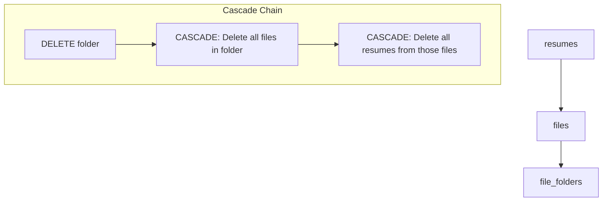
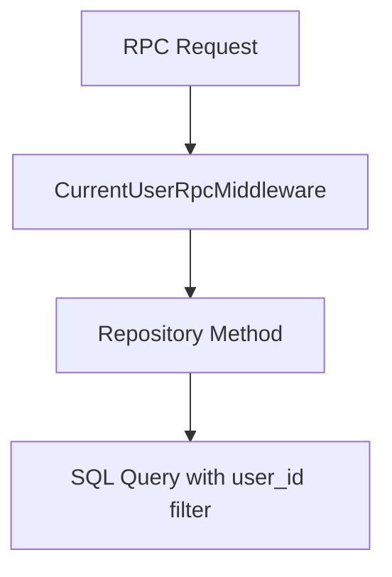
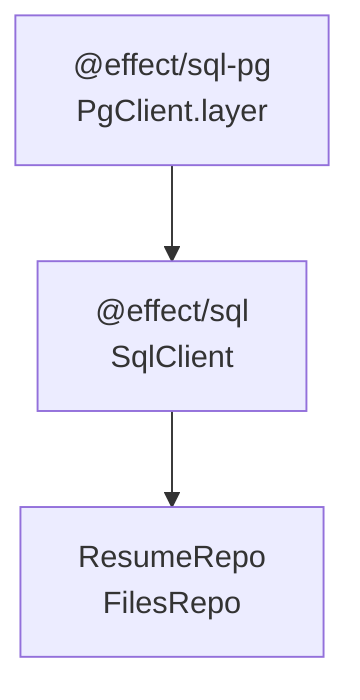

# Database Schema

> **Relevant source files**
> * [packages/server/src/db/migrations/0002_create_resumes.ts](https://github.com/oscaromsn/TalentScore/blob/428ed1eb/packages/server/src/db/migrations/0002_create_resumes.ts)
> * [packages/server/src/db/migrations/sql/_schema.sql](https://github.com/oscaromsn/TalentScore/blob/428ed1eb/packages/server/src/db/migrations/sql/_schema.sql)
> * [packages/server/src/public/resume/index.ts](https://github.com/oscaromsn/TalentScore/blob/428ed1eb/packages/server/src/public/resume/index.ts)
> * [packages/server/src/server.ts](https://github.com/oscaromsn/TalentScore/blob/428ed1eb/packages/server/src/server.ts)

This document details the PostgreSQL database schema used by TalentScore to store file metadata, folder structures, and resume analysis results. The schema consists of three primary tables (`file_folders`, `files`, `resumes`) with foreign key relationships that enable cascading deletes and multi-tenant data isolation.

For information about how data is accessed and manipulated through the repository layer, see [Resume Repository](/oscaromsn/TalentScore/4.4.3-resume-repository) and [Files Repository](/oscaromsn/TalentScore/4.5.1-files-repository). For details about the migration system and database connection setup, see [HTTP and RPC Server Setup](/oscaromsn/TalentScore/4.1-http-and-rpc-server-setup).

## Schema Overview

The database schema implements a hierarchical file organization system with resume analysis storage. All tables include `user_id` columns to support multi-tenant data isolation, ensuring users can only access their own data.

```css
#mermaid-3wr8bqn6d1y{font-family:ui-sans-serif,-apple-system,system-ui,Segoe UI,Helvetica;font-size:16px;fill:#ccc;}@keyframes edge-animation-frame{from{stroke-dashoffset:0;}}@keyframes dash{to{stroke-dashoffset:0;}}#mermaid-3wr8bqn6d1y .edge-animation-slow{stroke-dasharray:9,5!important;stroke-dashoffset:900;animation:dash 50s linear infinite;stroke-linecap:round;}#mermaid-3wr8bqn6d1y .edge-animation-fast{stroke-dasharray:9,5!important;stroke-dashoffset:900;animation:dash 20s linear infinite;stroke-linecap:round;}#mermaid-3wr8bqn6d1y .error-icon{fill:#333;}#mermaid-3wr8bqn6d1y .error-text{fill:#cccccc;stroke:#cccccc;}#mermaid-3wr8bqn6d1y .edge-thickness-normal{stroke-width:1px;}#mermaid-3wr8bqn6d1y .edge-thickness-thick{stroke-width:3.5px;}#mermaid-3wr8bqn6d1y .edge-pattern-solid{stroke-dasharray:0;}#mermaid-3wr8bqn6d1y .edge-thickness-invisible{stroke-width:0;fill:none;}#mermaid-3wr8bqn6d1y .edge-pattern-dashed{stroke-dasharray:3;}#mermaid-3wr8bqn6d1y .edge-pattern-dotted{stroke-dasharray:2;}#mermaid-3wr8bqn6d1y .marker{fill:#666;stroke:#666;}#mermaid-3wr8bqn6d1y .marker.cross{stroke:#666;}#mermaid-3wr8bqn6d1y svg{font-family:ui-sans-serif,-apple-system,system-ui,Segoe UI,Helvetica;font-size:16px;}#mermaid-3wr8bqn6d1y p{margin:0;}#mermaid-3wr8bqn6d1y .entityBox{fill:#111;stroke:#222;}#mermaid-3wr8bqn6d1y .relationshipLabelBox{fill:#333;opacity:0.7;background-color:#333;}#mermaid-3wr8bqn6d1y .relationshipLabelBox rect{opacity:0.5;}#mermaid-3wr8bqn6d1y .labelBkg{background-color:rgba(51, 51, 51, 0.5);}#mermaid-3wr8bqn6d1y .edgeLabel .label{fill:#222;font-size:14px;}#mermaid-3wr8bqn6d1y .label{font-family:ui-sans-serif,-apple-system,system-ui,Segoe UI,Helvetica;color:#fff;}#mermaid-3wr8bqn6d1y .edge-pattern-dashed{stroke-dasharray:8,8;}#mermaid-3wr8bqn6d1y .node rect,#mermaid-3wr8bqn6d1y .node circle,#mermaid-3wr8bqn6d1y .node ellipse,#mermaid-3wr8bqn6d1y .node polygon{fill:#111;stroke:#222;stroke-width:1px;}#mermaid-3wr8bqn6d1y .relationshipLine{stroke:#666;stroke-width:1;fill:none;}#mermaid-3wr8bqn6d1y .marker{fill:none!important;stroke:#666!important;stroke-width:1;}#mermaid-3wr8bqn6d1y :root{--mermaid-font-family:"trebuchet ms",verdana,arial,sans-serif;}containsanalyzed_asfile_foldersuuididPKuuiduser_idtextnametimestamptzcreated_attimestamptzupdated_atfilesuuididPKuuiduser_iduuidfolder_idFKtextuploadthing_keyUKtextuploadthing_urltextnametextsizetextmime_typeuuiduploaded_by_user_idtimestamptzcreated_attimestamptzupdated_atresumesuuididPKuuiduser_iduuidfile_idFKtextfile_namejsonbparsed_dataintegerscoretimestamptzcreated_at
```

**Sources:** [packages/server/src/db/migrations/sql/_schema.sql L1-L45](https://github.com/oscaromsn/TalentScore/blob/428ed1eb/packages/server/src/db/migrations/sql/_schema.sql#L1-L45)

## Tables

### file_folders Table

The `file_folders` table stores folder metadata for organizing uploaded files. Each folder is owned by a single user and can contain zero or more files.

| Column | Type | Constraints | Description |
| --- | --- | --- | --- |
| `id` | UUID | PRIMARY KEY, DEFAULT gen_random_uuid() | Unique folder identifier |
| `user_id` | UUID | NOT NULL | Owner of the folder (multi-tenant isolation) |
| `name` | TEXT | NOT NULL | Display name of the folder |
| `created_at` | TIMESTAMPTZ | DEFAULT now() | Folder creation timestamp |
| `updated_at` | TIMESTAMPTZ | DEFAULT now() | Last modification timestamp |

**Key Design Decisions:**

* Uses UUID as the primary key to avoid enumeration attacks
* `user_id` is NOT NULL to enforce ownership
* No unique constraint on `name` per user, allowing duplicate folder names
* Timestamps use `TIMESTAMPTZ` for timezone-aware storage

**Sources:** [packages/server/src/db/migrations/sql/_schema.sql L3-L10](https://github.com/oscaromsn/TalentScore/blob/428ed1eb/packages/server/src/db/migrations/sql/_schema.sql#L3-L10)

### files Table

The `files` table stores metadata for uploaded files. The actual file content is stored in UploadThing's S3 storage, while this table maintains references and organizational structure.

| Column | Type | Constraints | Description |
| --- | --- | --- | --- |
| `id` | UUID | PRIMARY KEY, DEFAULT gen_random_uuid() | Unique file identifier |
| `user_id` | UUID | NOT NULL | Owner of the file (multi-tenant isolation) |
| `folder_id` | UUID | FK → file_folders(id) ON DELETE CASCADE, nullable | Parent folder (NULL for root-level files) |
| `uploadthing_key` | TEXT | NOT NULL, UNIQUE | UploadThing's unique file identifier |
| `uploadthing_url` | TEXT | NOT NULL | Direct URL to file in UploadThing storage |
| `name` | TEXT | NOT NULL | Original filename |
| `size` | TEXT | NOT NULL | File size (stored as text to handle large values) |
| `mime_type` | TEXT | NOT NULL | MIME type (e.g., "application/pdf") |
| `uploaded_by_user_id` | UUID | NOT NULL | User who performed the upload |
| `created_at` | TIMESTAMPTZ | DEFAULT now() | Upload timestamp |
| `updated_at` | TIMESTAMPTZ | DEFAULT now() | Last modification timestamp |

**Key Design Decisions:**

* `folder_id` is nullable to support root-level files (those not in any folder)
* `uploadthing_key` has a UNIQUE constraint to prevent duplicate file references
* `ON DELETE CASCADE` ensures files are deleted when their parent folder is deleted
* `user_id` and `uploaded_by_user_id` are separate to support future sharing scenarios
* `size` stored as TEXT rather than BIGINT to handle edge cases in file size representation

**Sources:** [packages/server/src/db/migrations/sql/_schema.sql L12-L25](https://github.com/oscaromsn/TalentScore/blob/428ed1eb/packages/server/src/db/migrations/sql/_schema.sql#L12-L25)

### resumes Table

The `resumes` table stores parsed resume analysis results. Each resume is associated with a file and contains both the extracted structured data and calculated scores.

| Column | Type | Constraints | Description |
| --- | --- | --- | --- |
| `id` | UUID | PRIMARY KEY, DEFAULT gen_random_uuid() | Unique resume analysis identifier |
| `user_id` | UUID | NOT NULL | Owner of the resume (multi-tenant isolation) |
| `file_id` | UUID | FK → files(id) ON DELETE CASCADE, NOT NULL | Source file that was analyzed |
| `file_name` | TEXT | NOT NULL | Snapshot of filename at analysis time |
| `parsed_data` | JSONB | NOT NULL | Complete structured resume data from BAML extraction |
| `score` | INTEGER | NOT NULL | Aggregate score for default context |
| `created_at` | TIMESTAMPTZ | DEFAULT now() | Analysis timestamp |

**Key Design Decisions:**

* `file_id` has `ON DELETE CASCADE` so resumes are deleted when source files are deleted
* `parsed_data` uses JSONB for flexible schema and efficient querying
* `file_name` is denormalized from `files` table to preserve analysis context if file is renamed
* `score` stores a single integer representing the default context score (full `ScoringMatrix` is in `parsed_data`)
* No `updated_at` field because resume analyses are immutable once created

**JSONB Structure:**
The `parsed_data` column contains the complete `ResumeAnalysis` object including:

* `data`: Extracted resume fields (contact, education, experience, skills, etc.)
* `scores`: The 5×4 `ScoringMatrix` with context-specific scores and dealbreakers
* Metadata from the BAML extraction process

**Sources:** [packages/server/src/db/migrations/sql/_schema.sql L32-L41](https://github.com/oscaromsn/TalentScore/blob/428ed1eb/packages/server/src/db/migrations/sql/_schema.sql#L32-L41)

 [packages/server/src/db/migrations/0002_create_resumes.ts L4-L22](https://github.com/oscaromsn/TalentScore/blob/428ed1eb/packages/server/src/db/migrations/0002_create_resumes.ts#L4-L22)

## Indexes

The schema includes performance-optimized indexes for common query patterns:

### Files Table Indexes

| Index Name | Columns | Purpose |
| --- | --- | --- |
| `idx_files_user_id` | `user_id` | Filter files by owner (multi-tenant queries) |
| `idx_files_folder_id` | `folder_id` | Retrieve all files in a folder |
| `idx_files_uploadthing_key` | `uploadthing_key` | Look up files by UploadThing key during sync |

**Sources:** [packages/server/src/db/migrations/sql/_schema.sql L27-L29](https://github.com/oscaromsn/TalentScore/blob/428ed1eb/packages/server/src/db/migrations/sql/_schema.sql#L27-L29)

### File Folders Table Indexes

| Index Name | Columns | Purpose |
| --- | --- | --- |
| `idx_file_folders_user_id` | `user_id` | Filter folders by owner (multi-tenant queries) |

**Sources:** [packages/server/src/db/migrations/sql/_schema.sql L30](https://github.com/oscaromsn/TalentScore/blob/428ed1eb/packages/server/src/db/migrations/sql/_schema.sql#L30-L30)

### Resumes Table Indexes

| Index Name | Columns | Purpose |
| --- | --- | --- |
| `idx_resumes_user_id` | `user_id` | Filter resumes by owner (multi-tenant queries) |
| `idx_resumes_created_at` | `created_at` | Sort resumes chronologically (newest first) |

**Sources:** [packages/server/src/db/migrations/sql/_schema.sql L43-L44](https://github.com/oscaromsn/TalentScore/blob/428ed1eb/packages/server/src/db/migrations/sql/_schema.sql#L43-L44)

**Query Pattern Optimization:**

* All `user_id` indexes support the multi-tenant filtering pattern used throughout the repository layer
* `idx_files_uploadthing_key` enables efficient polling during the file sync phase (see [File State Management](/oscaromsn/TalentScore/5.2.2-file-state-management))
* `idx_resumes_created_at` supports the default sort order in `ResumeRepo.list()`

## Foreign Key Relationships and Cascading Behavior



### files.folder_id → file_folders.id

**Constraint:** `REFERENCES file_folders (id) ON DELETE CASCADE`

**Behavior:** When a folder is deleted, all files with that `folder_id` are automatically deleted. This triggers the next cascade level for any resumes associated with those files.

**Nullability:** `folder_id` is nullable to support root-level files. Files without a folder have `folder_id = NULL`.

**Sources:** [packages/server/src/db/migrations/sql/_schema.sql L16](https://github.com/oscaromsn/TalentScore/blob/428ed1eb/packages/server/src/db/migrations/sql/_schema.sql#L16-L16)

### resumes.file_id → files.id

**Constraint:** `REFERENCES files (id) ON DELETE CASCADE`

**Behavior:** When a file is deleted, all resume analyses derived from that file are automatically deleted. This ensures referential integrity and prevents orphaned resume data.

**Implementation Note:** The `FilesRepo.deleteFiles()` method leverages this cascade to clean up resume analyses without explicit queries.

**Sources:** [packages/server/src/db/migrations/sql/_schema.sql L36](https://github.com/oscaromsn/TalentScore/blob/428ed1eb/packages/server/src/db/migrations/sql/_schema.sql#L36-L36)

### Cascade Chain Example

When a user deletes a folder:

1. `DELETE FROM file_folders WHERE id = $1`
2. PostgreSQL automatically deletes all rows in `files` where `folder_id = $1`
3. PostgreSQL then deletes all rows in `resumes` where `file_id` matches any of the deleted files
4. The application returns the `uploadthing_key` values of deleted files for cleanup in UploadThing storage

**Sources:** [packages/server/src/db/migrations/sql/_schema.sql L16](https://github.com/oscaromsn/TalentScore/blob/428ed1eb/packages/server/src/db/migrations/sql/_schema.sql#L16-L16)

 [packages/server/src/db/migrations/sql/_schema.sql L36](https://github.com/oscaromsn/TalentScore/blob/428ed1eb/packages/server/src/db/migrations/sql/_schema.sql#L36-L36)

## Multi-Tenant Data Isolation

All three tables include a `user_id` column to enforce data isolation between users. This is a **query-level enforcement** pattern rather than database-level row security.

### Implementation Pattern



**How It Works:**

1. `CurrentUserRpcMiddleware` (see [HTTP and RPC Server Setup](/oscaromsn/TalentScore/4.1-http-and-rpc-server-setup)) extracts user identity from requests
2. Repository methods receive `CurrentUser` via Effect dependency injection
3. All queries include `WHERE user_id = $userId` conditions
4. Indexes on `user_id` columns optimize these filtered queries

**Example Query Pattern:**

```sql
// All repository methods follow this pattern
sql`SELECT * FROM files WHERE user_id = ${userId} AND folder_id = ${folderId}`
```

**Security Note:** This pattern relies on application-level enforcement. The database schema does not enforce row-level security policies. All queries must explicitly filter by `user_id` to maintain isolation.

**Sources:** [packages/server/src/db/migrations/sql/_schema.sql L6](https://github.com/oscaromsn/TalentScore/blob/428ed1eb/packages/server/src/db/migrations/sql/_schema.sql#L6-L6)

 [packages/server/src/db/migrations/sql/_schema.sql L15](https://github.com/oscaromsn/TalentScore/blob/428ed1eb/packages/server/src/db/migrations/sql/_schema.sql#L15-L15)

 [packages/server/src/db/migrations/sql/_schema.sql L35](https://github.com/oscaromsn/TalentScore/blob/428ed1eb/packages/server/src/db/migrations/sql/_schema.sql#L35-L35)

## Migration System

The database schema is managed through Effect SQL migrations located in `packages/server/src/db/migrations/`.

### Migration Files

| File | Purpose | Applied Order |
| --- | --- | --- |
| `0001_create_files.ts` | Creates `file_folders` and `files` tables with indexes | 1 |
| `0002_create_resumes.ts` | Creates `resumes` table with indexes | 2 |
| `sql/_schema.sql` | Complete schema dump for reference and testing | N/A (not executed) |

### Migration Structure

Each migration file exports a default Effect that contains SQL DDL statements:

```javascript
export default Effect.gen(function* () {
  const sql = yield* SqlClient.SqlClient;
  
  yield* sql`CREATE TABLE ...`;
  yield* sql`CREATE INDEX ...`;
});
```

**Key Features:**

* Migrations are pure Effect programs that can be composed and tested
* Each migration is executed in a transaction
* The migration runner tracks applied migrations to prevent re-execution
* Migrations use template literals with `@effect/sql` for type-safe SQL

**Execution Command:**

```
pnpm db:migrate
```

This command connects to the PostgreSQL database specified in environment variables and applies all pending migrations in order.

**Sources:** [packages/server/src/db/migrations/0002_create_resumes.ts L1-L22](https://github.com/oscaromsn/TalentScore/blob/428ed1eb/packages/server/src/db/migrations/0002_create_resumes.ts#L1-L22)

 [packages/server/src/db/migrations/sql/_schema.sql L1-L2](https://github.com/oscaromsn/TalentScore/blob/428ed1eb/packages/server/src/db/migrations/sql/_schema.sql#L1-L2)

## Database Connection Configuration

The PostgreSQL connection is configured through environment variables and provided as an Effect Layer to the application:

**Environment Variables:**

* `PGHOST`: PostgreSQL host (default: localhost)
* `PGPORT`: PostgreSQL port (default: 5432)
* `PGUSER`: Database user
* `PGPASSWORD`: Database password
* `PGDATABASE`: Database name

**Effect Layer Structure:**



The `@effect/sql-pg` package provides the `PgClient.layer` which creates a connection pool and provides the `SqlClient` service. Repositories depend on `SqlClient` and execute queries through it.

**Sources:** System diagrams (Technology Stack), [packages/server/src/server.ts L1-L163](https://github.com/oscaromsn/TalentScore/blob/428ed1eb/packages/server/src/server.ts#L1-L163)