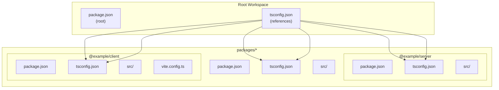
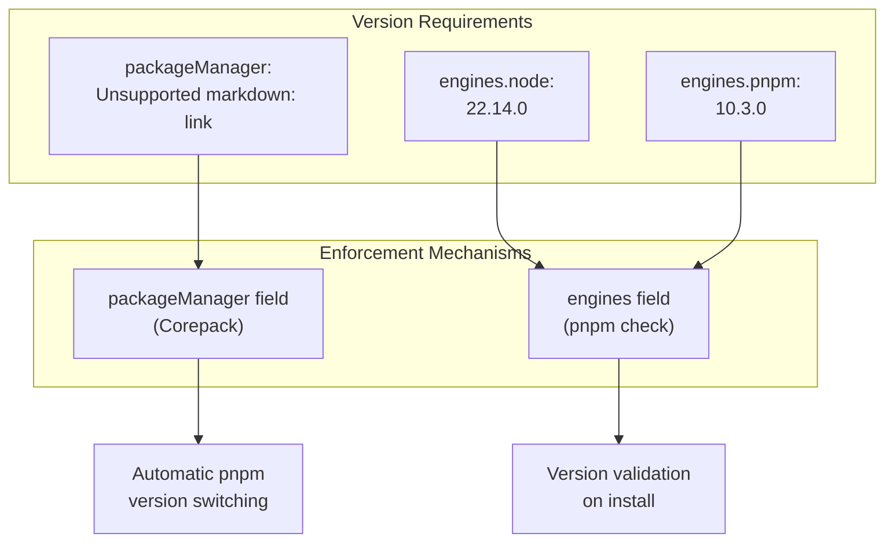
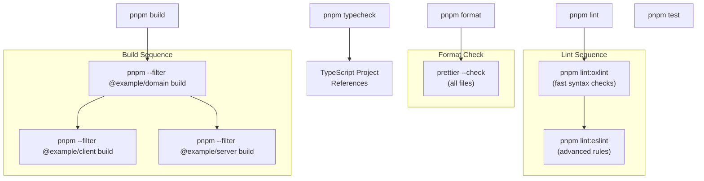
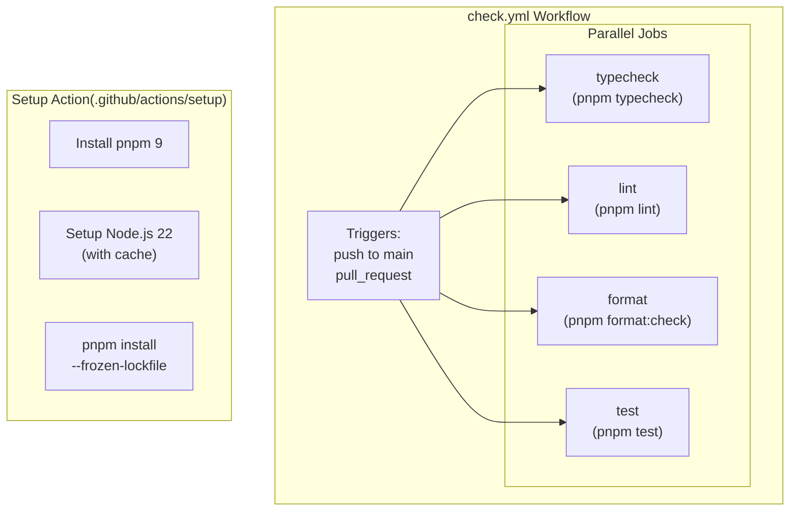
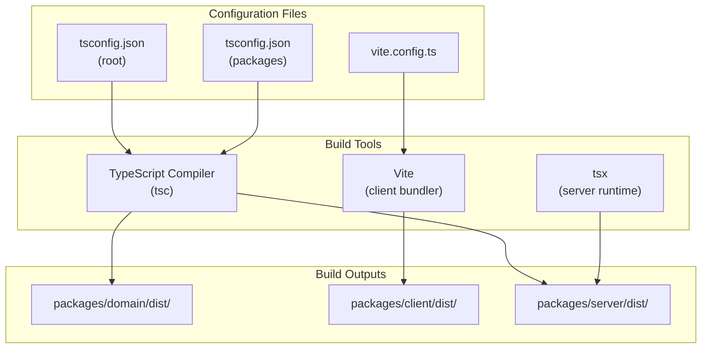

# Development Infrastructure

> **Relevant source files**
> * [.github/actions/setup/action.yml](https://github.com/lucas-barake/effect-file-manager/blob/28eedd82/.github/actions/setup/action.yml)
> * [.github/workflows/check.yml](https://github.com/lucas-barake/effect-file-manager/blob/28eedd82/.github/workflows/check.yml)
> * [package.json](https://github.com/lucas-barake/effect-file-manager/blob/28eedd82/package.json)

This document covers the development infrastructure of the Effect File Manager repository, including the monorepo build system, package manager configuration, build scripts, task orchestration, and CI/CD setup. This page focuses on the tooling and automation that supports day-to-day development.

For detailed information about specific aspects:

* Code quality tools (linting and formatting): see [Code Quality Tools](/lucas-barake/effect-file-manager/8.1-code-quality-tools)
* CI/CD pipeline and automation: see [CI/CD Pipeline](/lucas-barake/effect-file-manager/8.2-cicd-pipeline)
* Testing framework and strategies: see [Testing Strategy](/lucas-barake/effect-file-manager/8.3-testing-strategy)

## Overview

The Effect File Manager uses a modern JavaScript development infrastructure built on:

* **Package Manager**: pnpm 10.3.0 with workspace support
* **Runtime**: Node.js 22.14.0 (LTS)
* **Build System**: TypeScript compilation with package-specific build tools
* **Monorepo**: Three packages managed as pnpm workspaces
* **Automation**: GitHub Actions for continuous integration

The infrastructure prioritizes type safety, consistent tooling, and reproducible builds across development environments.

**Sources**: [package.json L1-L68](https://github.com/lucas-barake/effect-file-manager/blob/28eedd82/package.json#L1-L68)

## Monorepo Structure



**Monorepo Structure Diagram**: Shows the workspace organization with three packages and their TypeScript project references

The repository is organized as a pnpm workspace with three packages:

| Package | Path | Purpose | Build Tool |
| --- | --- | --- | --- |
| `@example/domain` | `packages/domain` | Shared types, schemas, and RPC definitions | TypeScript compiler |
| `@example/client` | `packages/client` | React frontend application | Vite + TypeScript |
| `@example/server` | `packages/server` | Node.js backend server | TypeScript compiler |

The workspace configuration is defined at [package.json L9-L11](https://github.com/lucas-barake/effect-file-manager/blob/28eedd82/package.json#L9-L11)

:

```
"workspaces": [
  "packages/*"
]
```

This structure enables:

* **Shared dependencies**: Common packages installed once at the root
* **Type safety**: TypeScript project references ensure cross-package type checking
* **Atomic changes**: Single commits can modify multiple packages
* **Efficient builds**: Only changed packages are rebuilt

**Sources**: [package.json L9-L11](https://github.com/lucas-barake/effect-file-manager/blob/28eedd82/package.json#L9-L11)

## Package Manager Configuration

The repository pins specific versions of the package manager and runtime for reproducibility:



**Version Enforcement Diagram**: Shows how package manager and runtime versions are enforced

### Version Pinning

The root [package.json L4-L8](https://github.com/lucas-barake/effect-file-manager/blob/28eedd82/package.json#L4-L8)

 specifies exact versions:

```

```

* `packageManager`: Used by Corepack to automatically download and use the correct pnpm version
* `engines`: Enforced by pnpm to prevent installation with incompatible versions

### Dependency Overrides

The repository uses pnpm overrides at [package.json L48-L63](https://github.com/lucas-barake/effect-file-manager/blob/28eedd82/package.json#L48-L63)

 to ensure consistent versions of Effect-TS packages across all workspaces:

| Package | Overridden Version | Reason |
| --- | --- | --- |
| `effect` | 3.19.8 | Core Effect library |
| `@effect/platform` | 0.93.6 | Platform-agnostic APIs |
| `@effect/platform-node` | 0.103.0 | Node.js bindings |
| `@effect/platform-browser` | 0.73.0 | Browser bindings |
| `@effect/rpc` | 0.72.2 | RPC framework |
| `@effect-atom/atom` | 0.4.7 | State management |
| `@effect-atom/atom-react` | 0.4.2 | React integration |

This prevents version conflicts when multiple packages depend on Effect-TS libraries with overlapping version ranges.

**Sources**: [package.json L4-L8](https://github.com/lucas-barake/effect-file-manager/blob/28eedd82/package.json#L4-L8)

 [package.json L48-L63](https://github.com/lucas-barake/effect-file-manager/blob/28eedd82/package.json#L48-L63)

## Build Scripts and Task Orchestration



**Build Script Orchestration Diagram**: Shows the execution order of build and quality check scripts

### Build Order

The build script at [package.json L13](https://github.com/lucas-barake/effect-file-manager/blob/28eedd82/package.json#L13-L13)

 enforces a specific order:

```

```

This sequential execution is necessary because:

1. `@example/domain` must build first (provides shared types)
2. `@example/client` and `@example/server` depend on `@example/domain`
3. Client and server can build in parallel after domain completes

### Type Checking

The `typecheck` script at [package.json L14](https://github.com/lucas-barake/effect-file-manager/blob/28eedd82/package.json#L14-L14)

 runs TypeScript's build mode:

```

```

The `-b` flag enables TypeScript project references, which:

* Only rebuilds changed projects and their dependents
* Checks type consistency across package boundaries
* Outputs `.tsbuildinfo` files for incremental compilation

### Linting Pipeline

The lint process at [package.json L17-L20](https://github.com/lucas-barake/effect-file-manager/blob/28eedd82/package.json#L17-L20)

 uses two linters in sequence:

```

```

**OxLint** ([package.json L18](https://github.com/lucas-barake/effect-file-manager/blob/28eedd82/package.json#L18-L18)

):

* Fast Rust-based linter
* Type-aware checks via `--type-aware --tsconfig tsconfig.json`
* Catches common mistakes quickly

**ESLint** ([package.json L19](https://github.com/lucas-barake/effect-file-manager/blob/28eedd82/package.json#L19-L19)

):

* Comprehensive JavaScript/TypeScript linting
* Custom rules and plugins
* Runs after OxLint to avoid redundant checks

### Common Development Scripts

| Script | Command | Purpose |
| --- | --- | --- |
| `dev:server` | `pnpm --filter @example/server dev` | Start server in watch mode |
| `dev:client` | `pnpm --filter @example/client dev` | Start Vite dev server |
| `check:fast` | `pnpm lint && pnpm check` | Quick validation (lint + typecheck) |
| `format` | `prettier --write "**/*.{...}"` | Format all files |
| `format:check` | `prettier --check "**/*.{...}"` | Verify formatting |
| `test` | `vitest run` | Run all tests once |
| `test:watch` | `vitest` | Run tests in watch mode |

**Sources**: [package.json L12-L28](https://github.com/lucas-barake/effect-file-manager/blob/28eedd82/package.json#L12-L28)

## Development Workflow

```mermaid
sequenceDiagram
  participant Developer
  participant Git Repository
  participant pnpm Scripts
  participant TypeScript
  participant OxLint + ESLint
  participant Vitest

  Developer->>Git Repository: git clone
  Developer->>pnpm Scripts: pnpm install
  pnpm Scripts->>pnpm Scripts: Install dependencies
  Developer->>pnpm Scripts: (frozen lockfile)
  Developer->>pnpm Scripts: pnpm dev:server
  note over Developer: Make changes
  Developer->>pnpm Scripts: pnpm dev:client
  pnpm Scripts->>OxLint + ESLint: pnpm check:fast
  pnpm Scripts->>TypeScript: Run linters
  OxLint + ESLint-->>Developer: Type check
  TypeScript-->>Developer: Report issues
  Developer->>pnpm Scripts: Type errors
  pnpm Scripts->>Vitest: pnpm test
  Vitest-->>Developer: Run test suite
  Developer->>pnpm Scripts: Test results
  pnpm Scripts->>pnpm Scripts: pnpm format
  Developer->>Git Repository: Format code
```

**Development Workflow Diagram**: Shows the typical development cycle from setup to commit

### Initial Setup

1. Clone repository
2. Run `pnpm install --frozen-lockfile` to install dependencies * The `--frozen-lockfile` flag ensures exact versions from `pnpm-lock.yaml` * Prevents accidental dependency updates

### Local Development

Start both development servers:

```

```

Both servers run in watch mode, rebuilding on file changes.

### Pre-commit Validation

Before committing, run:

```

```

The `check:fast` command ([package.json L16](https://github.com/lucas-barake/effect-file-manager/blob/28eedd82/package.json#L16-L16)

) combines linting and type checking without running the full build, providing quick feedback.

**Sources**: [package.json L16](https://github.com/lucas-barake/effect-file-manager/blob/28eedd82/package.json#L16-L16)

 [package.json L25-L26](https://github.com/lucas-barake/effect-file-manager/blob/28eedd82/package.json#L25-L26)

## CI/CD Setup



**CI/CD Architecture Diagram**: Shows the GitHub Actions workflow structure with parallel job execution

### GitHub Actions Workflow

The repository uses a single workflow file at [.github/workflows/check.yml L1-L73](https://github.com/lucas-barake/effect-file-manager/blob/28eedd82/.github/workflows/check.yml#L1-L73)

 that runs on:

* Pushes to `main` branch
* Pull requests targeting `main`

The workflow defines four parallel jobs:

| Job | Script | Purpose | Timeout |
| --- | --- | --- | --- |
| `typecheck` | `pnpm typecheck` | TypeScript compilation | 10 minutes |
| `lint` | `pnpm lint` | OxLint + ESLint checks | 10 minutes |
| `format` | `pnpm format:check` | Prettier formatting verification | 10 minutes |
| `test` | `pnpm test` | Vitest test suite | 10 minutes |

Each job runs independently on `ubuntu-latest` runners.

### Concurrency Control

The workflow at [.github/workflows/check.yml L9-L11](https://github.com/lucas-barake/effect-file-manager/blob/28eedd82/.github/workflows/check.yml#L9-L11)

 uses concurrency groups:

```

```

This ensures:

* Only one workflow runs per branch at a time
* New pushes cancel in-progress workflows on the same branch
* Reduces CI queue time and compute costs

### Custom Setup Action

All jobs use a reusable setup action at [.github/actions/setup/action.yml L1-L21](https://github.com/lucas-barake/effect-file-manager/blob/28eedd82/.github/actions/setup/action.yml#L1-L21)

 that:

1. **Installs pnpm** ([.github/actions/setup/action.yml L7-L10](https://github.com/lucas-barake/effect-file-manager/blob/28eedd82/.github/actions/setup/action.yml#L7-L10) ): ``` ```
2. **Sets up Node.js** ([.github/actions/setup/action.yml L12-L16](https://github.com/lucas-barake/effect-file-manager/blob/28eedd82/.github/actions/setup/action.yml#L12-L16) ): ``` ``` The `cache: "pnpm"` line enables automatic caching of `node_modules` based on `pnpm-lock.yaml`.
3. **Installs dependencies** ([.github/actions/setup/action.yml L18-L20](https://github.com/lucas-barake/effect-file-manager/blob/28eedd82/.github/actions/setup/action.yml#L18-L20) ): ``` ```

This reusable action ensures consistent setup across all jobs and simplifies maintenance.

**Sources**: [.github/workflows/check.yml L1-L73](https://github.com/lucas-barake/effect-file-manager/blob/28eedd82/.github/workflows/check.yml#L1-L73)

 [.github/actions/setup/action.yml L1-L21](https://github.com/lucas-barake/effect-file-manager/blob/28eedd82/.github/actions/setup/action.yml#L1-L21)

## Build System Integration



**Build System Integration Diagram**: Shows how different build tools consume configuration and produce outputs

The build system uses different tools for each package:

* **Domain package**: TypeScript compiler produces ES modules in `dist/`
* **Client package**: Vite bundles React application with code splitting
* **Server package**: TypeScript compiler for production, `tsx` for development

TypeScript project references ensure the domain package builds before its dependents, maintaining type safety across package boundaries.

**Sources**: [package.json L13](https://github.com/lucas-barake/effect-file-manager/blob/28eedd82/package.json#L13-L13)

 [package.json L14](https://github.com/lucas-barake/effect-file-manager/blob/28eedd82/package.json#L14-L14)

---

For detailed information about:

* Linting rules and formatting configuration: see [Code Quality Tools](/lucas-barake/effect-file-manager/8.1-code-quality-tools)
* CI/CD workflow implementation and optimization: see [CI/CD Pipeline](/lucas-barake/effect-file-manager/8.2-cicd-pipeline)
* Testing framework, mock layers, and test patterns: see [Testing Strategy](/lucas-barake/effect-file-manager/8.3-testing-strategy)