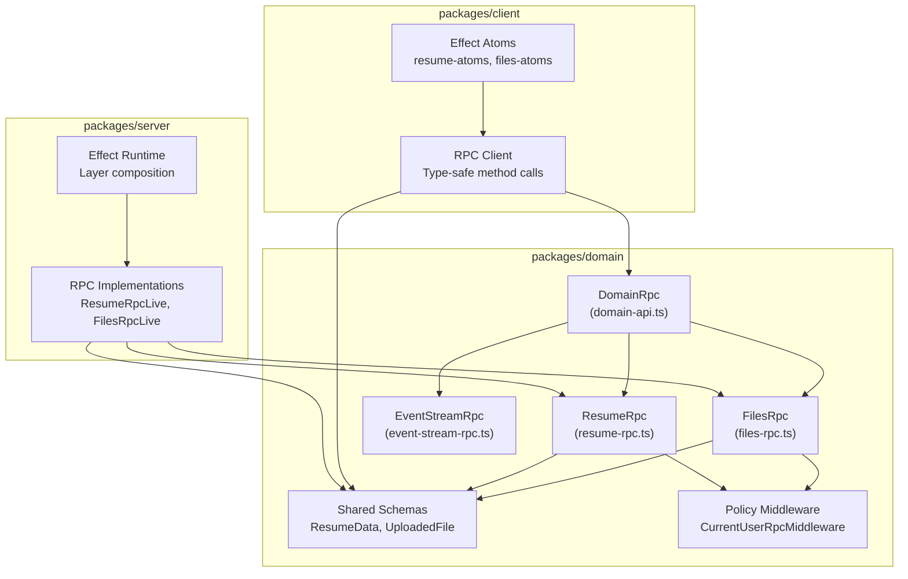
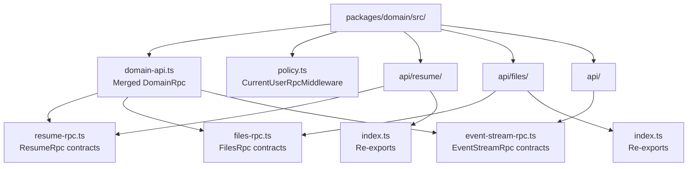
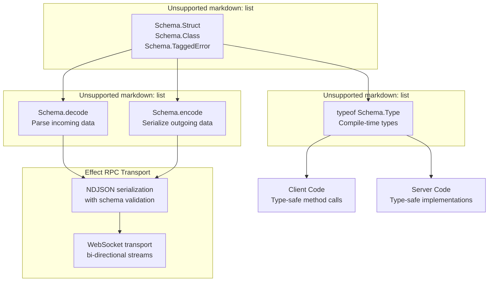
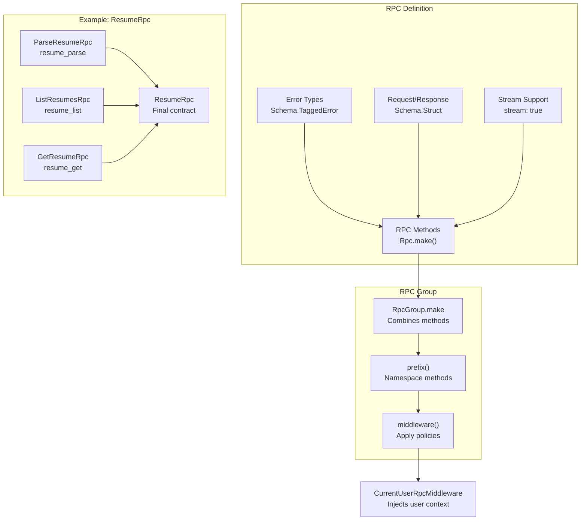
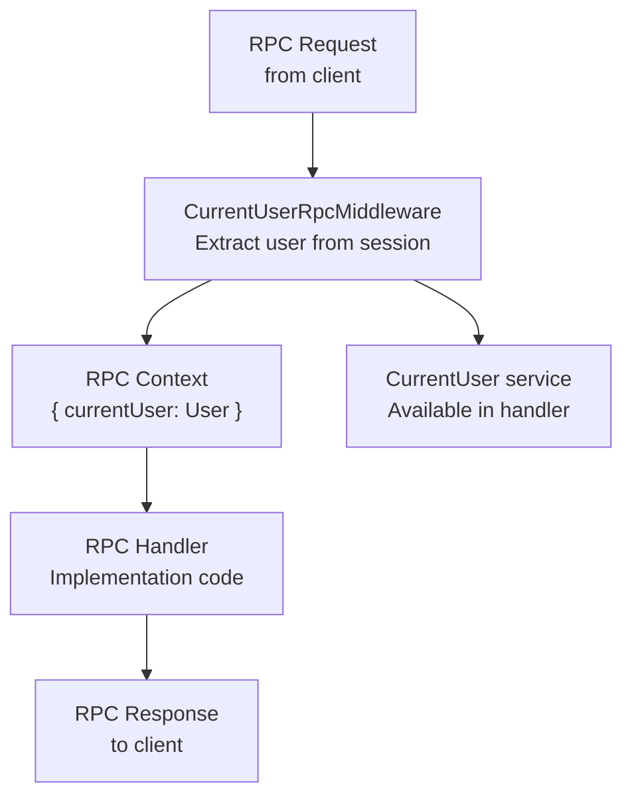

# Domain Package

> **Relevant source files**
> * [packages/domain/src/api/resume/index.ts](https://github.com/oscaromsn/TalentScore/blob/428ed1eb/packages/domain/src/api/resume/index.ts)
> * [packages/domain/src/api/resume/resume-rpc.ts](https://github.com/oscaromsn/TalentScore/blob/428ed1eb/packages/domain/src/api/resume/resume-rpc.ts)
> * [packages/domain/src/domain-api.ts](https://github.com/oscaromsn/TalentScore/blob/428ed1eb/packages/domain/src/domain-api.ts)

## Purpose and Scope

The Domain Package (`packages/domain`) serves as the **contract layer** for the TalentScore application. It defines all RPC (Remote Procedure Call) interfaces, shared data schemas, and cross-cutting policies that govern communication between the client and server. Both the client and server packages depend on the domain package, but they do not depend on each other, enabling independent development and compile-time type safety across the network boundary.

This document provides an overview of the domain package's architecture and design principles. For detailed information about specific subsystems, see:

* **RPC Contracts**: [RPC Contracts](/oscaromsn/TalentScore/3.1-rpc-contracts) - Details of ResumeRpc, FilesRpc, and EventStreamRpc APIs
* **Data Models**: [Data Models and Schemas](/oscaromsn/TalentScore/3.2-data-models-and-schemas) - Shared data structures and validation schemas
* **Scoring System**: [Scoring Matrix Design](/oscaromsn/TalentScore/3.3-scoring-matrix-design) - Context-aware scoring type system

---

## Contract-First Architecture

The domain package implements a **contract-first architecture** where API interfaces are defined independently of their implementation. This pattern provides several benefits:

| Benefit | Description |
| --- | --- |
| **Type Safety** | Effect Schemas validate data at runtime and provide TypeScript types at compile time |
| **Independent Development** | Client and server teams can work in parallel once contracts are defined |
| **Version Control** | Contract changes are explicit and tracked in a single location |
| **Code Generation** | RPC clients are automatically generated from contracts |
| **No Circular Dependencies** | Domain → Server, Domain → Client (never Server ↔ Client) |

**Diagram: Dependency Flow in Monorepo**



**Sources**: [packages/domain/src/domain-api.ts L1-L5](https://github.com/oscaromsn/TalentScore/blob/428ed1eb/packages/domain/src/domain-api.ts#L1-L5)

---

## Unified API Surface

The domain package exports a single unified API through the `DomainRpc` class, which merges all individual RPC groups:

```javascript
// packages/domain/src/domain-api.ts
export class DomainRpc extends EventStreamRpc.merge(FilesRpc).merge(ResumeRpc) {}
```

This merge operation combines three RPC groups into a single contract:

| RPC Group | Prefix | Purpose |
| --- | --- | --- |
| `EventStreamRpc` | `events_` | Real-time event streaming for file operations and system notifications |
| `FilesRpc` | `files_` | File and folder management (upload, organize, delete) |
| `ResumeRpc` | `resume_` | Resume parsing, scoring, and retrieval |

Each RPC group is implemented as an Effect RPC Group using method prefixes to avoid naming collisions. For example, the `ResumeRpc` group defines methods like `resume_parse`, `resume_list`, and `resume_get`.

**Sources**: [packages/domain/src/domain-api.ts L1-L5](https://github.com/oscaromsn/TalentScore/blob/428ed1eb/packages/domain/src/domain-api.ts#L1-L5)

---

## Package Structure

The domain package is organized into API subdirectories that group related contracts and schemas:

**Diagram: Domain Package File Organization**



Each API subdirectory follows a consistent pattern:

1. **Contract Definition** (`*-rpc.ts`): Defines RPC methods, schemas, and errors
2. **Index Re-export** (`index.ts`): Provides clean export interface
3. **Co-located Schemas**: Data models defined alongside their RPC usage

**Sources**: [packages/domain/src/domain-api.ts L1-L5](https://github.com/oscaromsn/TalentScore/blob/428ed1eb/packages/domain/src/domain-api.ts#L1-L5)

 [packages/domain/src/api/resume/index.ts L1-L2](https://github.com/oscaromsn/TalentScore/blob/428ed1eb/packages/domain/src/api/resume/index.ts#L1-L2)

---

## Type Safety Architecture

The domain package leverages Effect Schema to provide **three-layer type safety**:

**Diagram: Type Safety Layers**



### Schema Definition Pattern

The domain package uses Effect Schema constructs to define all data types:

| Construct | Purpose | Example |
| --- | --- | --- |
| `Schema.Struct` | Plain data structures | `Experience`, `Education`, `Skill` |
| `Schema.Class` | Classes with methods | `ResumeData`, `ResumeAnalysis` |
| `Schema.TaggedError` | Typed error classes | `LimitExceededError`, `ParsingFailedError` |
| `Schema.Union` | Discriminated unions | `ParseEvent = Partial \| Complete` |
| `Schema.Literal` | Enum-like types | `PositionType`, `CompanyProfile` |
| `Schema.Brand` | Branded primitives | `ResumeId = UUID & Brand<"ResumeId">` |

**Example: Resume ID with Branding**

The `ResumeId` type demonstrates branded types for preventing primitive obsession:

[packages/domain/src/api/resume/resume-rpc.ts L59-L60](https://github.com/oscaromsn/TalentScore/blob/428ed1eb/packages/domain/src/api/resume/resume-rpc.ts#L59-L60)

```javascript
export const ResumeId = Schema.UUID.pipe(Schema.brand("ResumeId"));
export type ResumeId = typeof ResumeId.Type;
```

This creates a UUID that cannot be accidentally mixed with other UUID types (e.g., `UploadedFileId`). The type system enforces the distinction at compile time, while the runtime validation ensures valid UUID format.

**Sources**: [packages/domain/src/api/resume/resume-rpc.ts L59-L60](https://github.com/oscaromsn/TalentScore/blob/428ed1eb/packages/domain/src/api/resume/resume-rpc.ts#L59-L60)

---

## RPC Group Pattern

Each RPC group in the domain package follows a consistent structure:

**Diagram: RPC Group Components**



### ResumeRpc Example

The `ResumeRpc` group demonstrates the pattern:

[packages/domain/src/api/resume/resume-rpc.ts L208-L214](https://github.com/oscaromsn/TalentScore/blob/428ed1eb/packages/domain/src/api/resume/resume-rpc.ts#L208-L214)

```javascript
export class ResumeRpc extends RpcGroup.make(
  ParseResumeRpc,
  ListResumesRpc,
  GetResumeRpc,
)
  .prefix("resume_")
  .middleware(CurrentUserRpcMiddleware) {}
```

**Key Elements**:

1. **Method Composition**: `RpcGroup.make()` combines individual RPC methods
2. **Namespace Prefix**: `prefix("resume_")` prevents naming collisions (becomes `resume_parse`, `resume_list`, etc.)
3. **Middleware Chain**: `middleware()` applies cross-cutting concerns like authentication

Each individual RPC method is defined with:

* `payload`: Input schema (e.g., `{ fileId: UploadedFileId }`)
* `success`: Output schema (e.g., `ResumeAnalysis`)
* `error`: Error union (e.g., `LimitExceededError | FileNotFoundError`)
* `stream`: Boolean flag for streaming responses

**Sources**: [packages/domain/src/api/resume/resume-rpc.ts L186-L214](https://github.com/oscaromsn/TalentScore/blob/428ed1eb/packages/domain/src/api/resume/resume-rpc.ts#L186-L214)

---

## Policy System

The domain package defines middleware policies that enforce cross-cutting concerns. The primary policy is `CurrentUserRpcMiddleware`, which provides user context to all RPC methods.

**Policy Application Pattern**:



The middleware pattern allows:

* **Dependency Injection**: Services like `CurrentUser` are available in handler context
* **Authorization**: Handlers can access user permissions without manual checks
* **Multi-tenancy**: User context ensures data isolation between users

See [RPC Contracts](/oscaromsn/TalentScore/3.1-rpc-contracts) for detailed information about how policies are applied to specific RPC methods.

**Sources**: [packages/domain/src/api/resume/resume-rpc.ts L5](https://github.com/oscaromsn/TalentScore/blob/428ed1eb/packages/domain/src/api/resume/resume-rpc.ts#L5-L5)

 [packages/domain/src/api/resume/resume-rpc.ts L214](https://github.com/oscaromsn/TalentScore/blob/428ed1eb/packages/domain/src/api/resume/resume-rpc.ts#L214-L214)

---

## Export Structure

The domain package provides two levels of exports:

| Export Level | Purpose | Usage |
| --- | --- | --- |
| **Unified API** | `DomainRpc` class | Server runtime, client RPC client |
| **Individual Contracts** | `ResumeRpc`, `FilesRpc`, etc. | Testing, partial implementations |
| **Shared Schemas** | `ResumeData`, `UploadedFile`, etc. | Type imports, validation |
| **Constants** | `POSITION_TYPES`, `COMPANY_PROFILES` | Iteration, UI dropdowns |

Consumers can import either the unified API or individual components:

```javascript
// Unified API (recommended for production)
import { DomainRpc } from "@repo/domain/domain-api";

// Individual contracts (for testing or partial usage)
import { ResumeRpc } from "@repo/domain/api/resume";
import { FilesRpc } from "@repo/domain/api/files";

// Shared schemas (for type checking)
import type { ResumeData, UploadedFile } from "@repo/domain";
```

The domain package is published as a workspace package in the monorepo, allowing both client and server to reference it via `@repo/domain` alias.

**Sources**: [packages/domain/src/domain-api.ts L1-L5](https://github.com/oscaromsn/TalentScore/blob/428ed1eb/packages/domain/src/domain-api.ts#L1-L5)

 [packages/domain/src/api/resume/index.ts L1-L2](https://github.com/oscaromsn/TalentScore/blob/428ed1eb/packages/domain/src/api/resume/index.ts#L1-L2)

---

## Summary

The Domain Package serves as the **contract layer** that enables type-safe, bidirectional communication between client and server. By defining RPC contracts, schemas, and policies in a shared package, TalentScore achieves:

* **Compile-time type safety** across network boundaries
* **Runtime validation** of all data crossing the RPC boundary
* **Independent development** of client and server implementations
* **Clear API versioning** through explicit contract definitions
* **Reduced boilerplate** via automatic RPC client generation

For detailed information about specific domain subsystems, continue to:

* [RPC Contracts](/oscaromsn/TalentScore/3.1-rpc-contracts) - Detailed API specifications for all RPC methods
* [Data Models and Schemas](/oscaromsn/TalentScore/3.2-data-models-and-schemas) - Complete schema reference for domain entities
* [Scoring Matrix Design](/oscaromsn/TalentScore/3.3-scoring-matrix-design) - Context-aware scoring type system

**Sources**: [packages/domain/src/domain-api.ts L1-L5](https://github.com/oscaromsn/TalentScore/blob/428ed1eb/packages/domain/src/domain-api.ts#L1-L5)

 [packages/domain/src/api/resume/resume-rpc.ts L1-L215](https://github.com/oscaromsn/TalentScore/blob/428ed1eb/packages/domain/src/api/resume/resume-rpc.ts#L1-L215)