# Effect Ecosystem Integration

> **Relevant source files**
> * [.gitignore](https://github.com/oscaromsn/TalentScore/blob/428ed1eb/.gitignore)
> * [bun.lock](https://github.com/oscaromsn/TalentScore/blob/428ed1eb/bun.lock)
> * [package.json](https://github.com/oscaromsn/TalentScore/blob/428ed1eb/package.json)
> * [packages/server/package.json](https://github.com/oscaromsn/TalentScore/blob/428ed1eb/packages/server/package.json)
> * [packages/server/src/db/migrations/sql/_schema.sql](https://github.com/oscaromsn/TalentScore/blob/428ed1eb/packages/server/src/db/migrations/sql/_schema.sql)
> * [packages/server/src/server.ts](https://github.com/oscaromsn/TalentScore/blob/428ed1eb/packages/server/src/server.ts)

This document explains how the Effect-TS ecosystem is integrated throughout TalentScore to provide type-safe error handling, structured concurrency, and composable dependency injection. Effect serves as the foundational runtime for both server and client operations, replacing traditional Promise-based patterns with a more robust functional approach.

For information about specific data models and schemas, see [Data Models and Schemas](/oscaromsn/TalentScore/3.2-data-models-and-schemas). For RPC contract details, see [RPC Contracts](/oscaromsn/TalentScore/3.1-rpc-contracts). For state management patterns on the client, see [State Management with Effect Atoms](/oscaromsn/TalentScore/5.2-state-management-with-effect-atoms).

---

## Effect Core Runtime

The Effect runtime provides the foundational layer for all asynchronous operations in TalentScore. Unlike Promises, Effect values are lazy, composable, and carry explicit type information about their success type, error type, and required dependencies.

### Version Management

All Effect packages are pinned to synchronized versions to prevent compatibility issues across the monorepo:

| Package | Version |
| --- | --- |
| `effect` | 3.19.8 |
| `@effect/platform` | 0.93.6 |
| `@effect/platform-node` | 0.103.0 |
| `@effect/platform-browser` | 0.73.0 |
| `@effect/rpc` | 0.72.2 |
| `@effect/sql` | 0.48.6 |
| `@effect/sql-pg` | 0.49.7 |
| `@effect/opentelemetry` | 0.59.1 |
| `@effect-atom/atom` | 0.4.7 |
| `@effect-atom/atom-react` | 0.4.2 |

**Sources:** [package.json L53-L67](https://github.com/oscaromsn/TalentScore/blob/428ed1eb/package.json#L53-L67)

### Effect Type Signature

Effect values have the signature `Effect<Success, Error, Requirements>`:

* **Success**: The type of value produced on successful execution
* **Error**: The type of errors that can occur (typed failures)
* **Requirements**: Services that must be provided to execute the effect

This enables compile-time guarantees about error handling and dependency satisfaction.

---

## Effect Platform Architecture

The Effect Platform provides cross-platform abstractions for HTTP, file system, and other platform-specific operations. TalentScore uses different platform implementations for client and server.

```

```

**Sources:** [package.json L49-L67](https://github.com/oscaromsn/TalentScore/blob/428ed1eb/package.json#L49-L67)

 [bun.lock L111-L124](https://github.com/oscaromsn/TalentScore/blob/428ed1eb/bun.lock#L111-L124)

---

## Layer System for Dependency Injection

Effect's Layer system provides compile-time-safe dependency injection. Layers compose vertically (providing dependencies) and horizontally (merging independent layers).

### Server Layer Composition

The server constructs a dependency graph using layers:


The main server composition uses `Layer.provide` to satisfy dependencies:

```
Layer.provide(NodeHttpServer.layer(createServer, { port: 3001 }))
Layer.provide(TracerLive)
Layer.provide(LoggingLevelLive)
Layer.launch
NodeRuntime.runMain
```

**Sources:** [packages/server/src/server.ts L86-L163](https://github.com/oscaromsn/TalentScore/blob/428ed1eb/packages/server/src/server.ts#L86-L163)

### Layer Construction Patterns

**Simple Layer (Succeed):**

```

```

**Effectful Layer (Unwrap):**

```

```

**Merged Layers:**

```

```

**Sources:** [packages/server/src/server.ts L27-L135](https://github.com/oscaromsn/TalentScore/blob/428ed1eb/packages/server/src/server.ts#L27-L135)

---

## Effect RPC Integration

Effect RPC provides type-safe, bidirectional communication over WebSocket with streaming support. The domain package defines contracts that both client and server implement.

### RPC Server Configuration


The server configures RPC with middleware:

```

```

Key configuration options:

* **group**: Domain RPC contracts with middleware applied
* **path**: WebSocket endpoint (`/rpc`)
* **protocol**: `"websocket"` for bidirectional streaming
* **spanPrefix**: OpenTelemetry span prefix
* **disableFatalDefects**: Prevents server crashes on defects

**Sources:** [packages/server/src/server.ts L114-L124](https://github.com/oscaromsn/TalentScore/blob/428ed1eb/packages/server/src/server.ts#L114-L124)

### RPC Middleware Chain

Middleware executes in a chain, wrapping the handler:

| Middleware | Purpose |
| --- | --- |
| `RpcLogger` | Logs RPC failures with method name and client ID |
| `CurrentUser` | Extracts user from authorization header, injects into context |
| NDJSON Serialization | Encodes/decodes streaming messages |

The `RpcLogger` middleware:

```

```

**Sources:** [packages/server/src/server.ts L90-L112](https://github.com/oscaromsn/TalentScore/blob/428ed1eb/packages/server/src/server.ts#L90-L112)

---

## Effect SQL Integration

Effect SQL provides type-safe database queries with automatic connection pooling and transaction management.

### SQL Layer Stack


### Repository Pattern

Repositories use `SqlClient` service for all database operations:

```

```

Typical query pattern:

1. Access `SqlClient` from context
2. Build SQL query with template literals
3. Apply result transformations
4. Handle errors at layer boundaries

**Sources:** [packages/server/src/db/migrations/sql/_schema.sql L1-L45](https://github.com/oscaromsn/TalentScore/blob/428ed1eb/packages/server/src/db/migrations/sql/_schema.sql#L1-L45)

---

## Effect OpenTelemetry Integration

OpenTelemetry tracing is deeply integrated into the Effect runtime, automatically instrumenting all effects with distributed traces.

### Tracer Configuration


The tracer layer:

```

```

Key configuration:

* **url**: OTLP HTTP endpoint
* **serviceName**: Identifier in Jaeger UI
* **exportInterval**: Batch export frequency
* **maxBatchSize**: Spans per batch

**Sources:** [packages/server/src/server.ts L27-L41](https://github.com/oscaromsn/TalentScore/blob/428ed1eb/packages/server/src/server.ts#L27-L41)

### Automatic Span Generation

HTTP requests automatically generate spans:

```

```

Span names follow the format: `http {METHOD} {PATH}`

**Sources:** [packages/server/src/server.ts L146-L157](https://github.com/oscaromsn/TalentScore/blob/428ed1eb/packages/server/src/server.ts#L146-L157)

### Trace Context Propagation

HTTP requests propagate trace context via headers:

| Header | Format |
| --- | --- |
| `traceparent` | W3C Trace Context standard |
| `B3` | Zipkin B3 format (legacy) |

CORS configuration allows these headers:

```

```

**Sources:** [packages/server/src/server.ts L127-L134](https://github.com/oscaromsn/TalentScore/blob/428ed1eb/packages/server/src/server.ts#L127-L134)

---

## HTTP Server Middleware Stack

The HTTP server uses a layered middleware architecture built with Effect.

```mermaid
flowchart TD

IncomingRequest["Incoming HTTP Request"]
TracerDisabledCheck["withTracerDisabledWhen<br>Skip OPTIONS, /health, /rpc"]
SpanNameGen["withSpanNameGenerator<br>http METHOD PATH"]
HttpLogger["httpLogger middleware<br>Request/response logging"]
CorsMiddleware["CORS middleware<br>Preflight + headers"]
HealthRouter["HealthRouter<br>GET /health → text('OK')"]
RpcRouter["RpcRouter<br>WebSocket /rpc"]
HttpResponse["HTTP Response"]

IncomingRequest --> TracerDisabledCheck
CorsMiddleware --> HealthRouter
CorsMiddleware --> RpcRouter
HealthRouter --> HttpResponse
RpcRouter --> HttpResponse

subgraph Response ["Response"]
    HttpResponse
end

subgraph subGraph2 ["Router Layer"]
    HealthRouter
    RpcRouter
end

subgraph subGraph1 ["Middleware Pipeline"]
    TracerDisabledCheck
    SpanNameGen
    HttpLogger
    CorsMiddleware
    TracerDisabledCheck --> SpanNameGen
    SpanNameGen --> HttpLogger
    HttpLogger --> CorsMiddleware
end

subgraph subGraph0 ["Request Flow"]
    IncomingRequest
end
```



### HTTP Logger Middleware

The custom `httpLogger` middleware annotates logs with HTTP metadata:

```

```

Log annotations:

* `http.method`: Request method (GET, POST, etc.)
* `http.url`: Full request URL
* `http.status`: Response status code
* `http.span.N`: Unique span identifier

**Sources:** [packages/server/src/server.ts L45-L84](https://github.com/oscaromsn/TalentScore/blob/428ed1eb/packages/server/src/server.ts#L45-L84)

---

## Effect Atoms for Client State Management

Effect Atoms provide reactive state management on the client, bridging Effect runtime with React components.

### Atom Architecture


### Atom Types

| Atom Type | Purpose | Example |
| --- | --- | --- |
| Primitive Atom | Simple state value | `selectedResumeIdAtom` |
| Computed Atom | Derived from other atoms | `selectedResumeAtom` |
| Effect Atom | Async Effect operations | `parseResumeAtom` |
| Atom Family | Parameterized atoms | `uploadAtom(uploadId)` |

**Sources:** [bun.lock L201-L203](https://github.com/oscaromsn/TalentScore/blob/428ed1eb/bun.lock#L201-L203)

 [package.json L64-L65](https://github.com/oscaromsn/TalentScore/blob/428ed1eb/package.json#L64-L65)

### Integration with React 19

Effect Atoms integrate with React 19's concurrent rendering:

```

```

React 19 features leveraged:

* Automatic batching of state updates
* Concurrent rendering for smooth UI
* Suspense integration for async atoms

**Sources:** [bun.lock L52-L56](https://github.com/oscaromsn/TalentScore/blob/428ed1eb/bun.lock#L52-L56)

---

## Error Handling Patterns

Effect provides structured error handling with typed errors at compile time.

### Error Types in Type Signature

```

```

Common error patterns:

| Pattern | Usage |
| --- | --- |
| `Effect.fail(error)` | Create a failed effect |
| `Effect.catchTag(tag, handler)` | Catch specific error type |
| `Effect.catchAll(handler)` | Catch all errors |
| `Effect.catchSome(handler)` | Partial recovery |
| `Effect.orElse(() => fallback)` | Provide fallback |

### HTTP Error Handling

The server extracts HTTP errors from failed effects:

```

```

**Sources:** [packages/server/src/server.ts L55-L70](https://github.com/oscaromsn/TalentScore/blob/428ed1eb/packages/server/src/server.ts#L55-L70)

---

## Logging System

Effect's logging system provides structured logging with automatic span correlation.

### Log Level Configuration

```

```

Available log levels:

* `LogLevel.Trace`
* `LogLevel.Debug`
* `LogLevel.Info`
* `LogLevel.Warning`
* `LogLevel.Error`
* `LogLevel.Fatal`

**Sources:** [packages/server/src/server.ts L43](https://github.com/oscaromsn/TalentScore/blob/428ed1eb/packages/server/src/server.ts#L43-L43)

### Structured Logging with Annotations

```

```

Annotations appear as structured fields in logs and traces, enabling:

* Filtering by field values
* Correlation across services
* Rich context in Jaeger UI

**Sources:** [packages/server/src/server.ts L61-L68](https://github.com/oscaromsn/TalentScore/blob/428ed1eb/packages/server/src/server.ts#L61-L68)

 [packages/server/src/server.ts L103-L106](https://github.com/oscaromsn/TalentScore/blob/428ed1eb/packages/server/src/server.ts#L103-L106)

---

## Runtime Execution

The Effect runtime provides the execution engine for all effects.

### Server Runtime

```

```

Execution steps:

1. Build HTTP application with routes
2. Apply middleware layers
3. Provide infrastructure dependencies
4. `Layer.launch` - Start the server
5. `NodeRuntime.runMain` - Execute in Node.js runtime

**Sources:** [packages/server/src/server.ts L137-L163](https://github.com/oscaromsn/TalentScore/blob/428ed1eb/packages/server/src/server.ts#L137-L163)

### Client Runtime

Client-side effects execute within the browser runtime provided by `@effect/platform-browser`, with Effect Atoms managing the bridge to React's rendering lifecycle.

**Sources:** [bun.lock L215-L216](https://github.com/oscaromsn/TalentScore/blob/428ed1eb/bun.lock#L215-L216)

---

## Summary of Effect Packages

| Package | Purpose in TalentScore |
| --- | --- |
| `effect` | Core runtime, Effect type, combinators |
| `@effect/platform` | Cross-platform HTTP, file system abstractions |
| `@effect/platform-node` | Node.js HTTP server, file system implementation |
| `@effect/platform-browser` | Browser HTTP client, storage APIs |
| `@effect/rpc` | WebSocket-based RPC with streaming |
| `@effect/sql` | Type-safe SQL client interface |
| `@effect/sql-pg` | PostgreSQL driver implementation |
| `@effect/opentelemetry` | Distributed tracing integration |
| `@effect-atom/atom` | Reactive state atoms |
| `@effect-atom/atom-react` | React integration for atoms |

**Sources:** [package.json L53-L67](https://github.com/oscaromsn/TalentScore/blob/428ed1eb/package.json#L53-L67)

 [bun.lock L111-L124](https://github.com/oscaromsn/TalentScore/blob/428ed1eb/bun.lock#L111-L124)