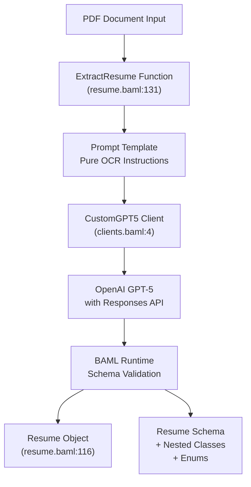
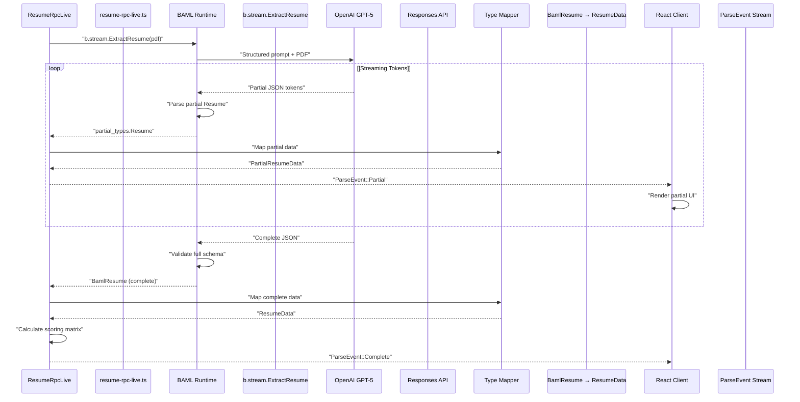
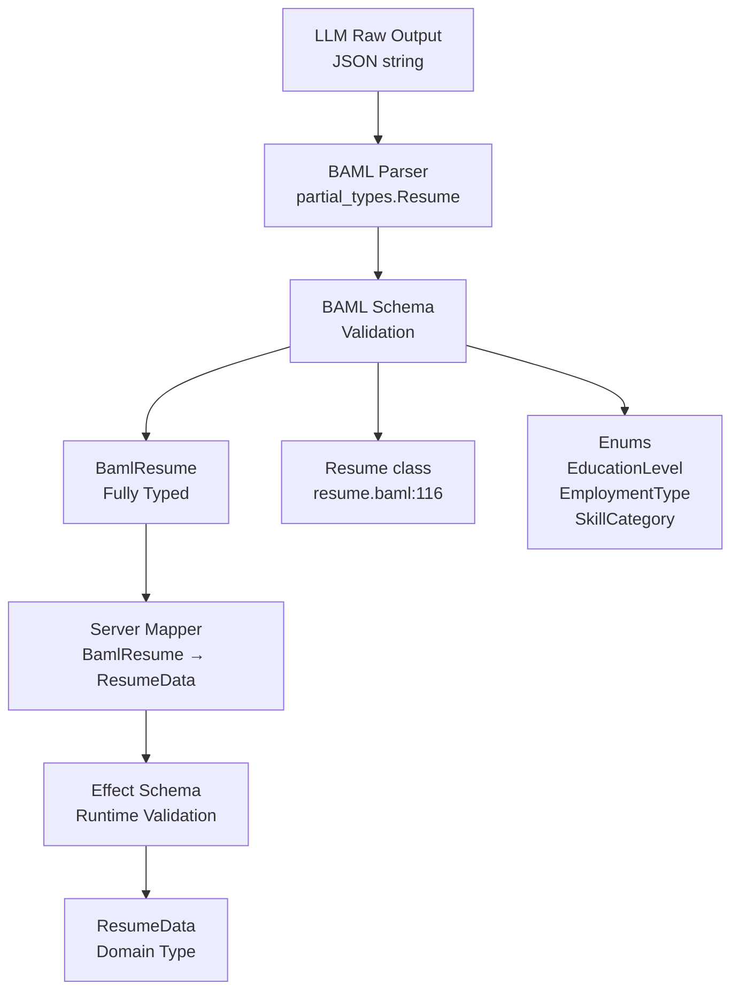
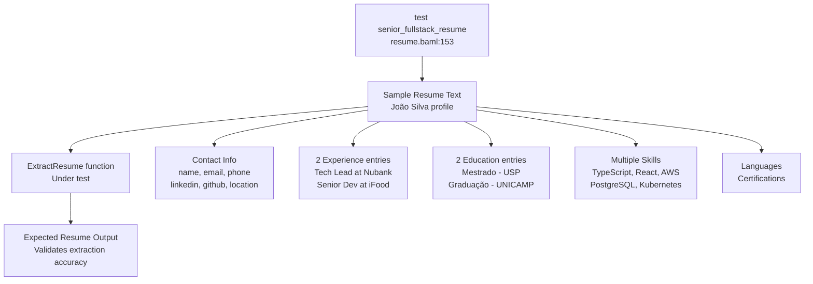
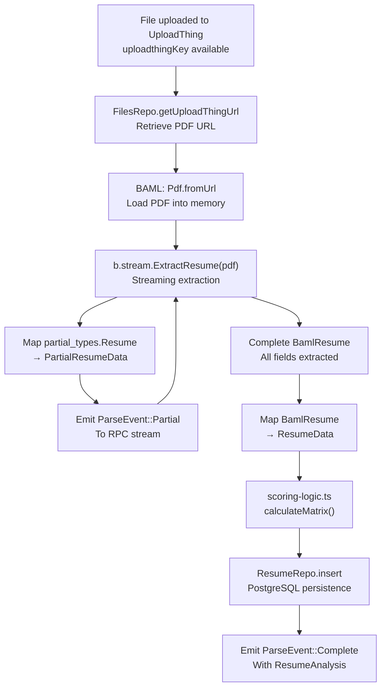

# ExtractResume Function

> **Relevant source files**
> * [packages/server/baml_src/clients.baml](https://github.com/oscaromsn/TalentScore/blob/428ed1eb/packages/server/baml_src/clients.baml)
> * [packages/server/baml_src/resume.baml](https://github.com/oscaromsn/TalentScore/blob/428ed1eb/packages/server/baml_src/resume.baml)

## Purpose and Scope

This page documents the `ExtractResume` BAML function, which transforms unstructured PDF resume documents into structured, type-safe `Resume` objects using LLM-based extraction. This function serves as the core AI component in the resume processing pipeline, implementing a "pure OCR" extraction strategy without inference or reasoning.

For information about the LLM client configuration used by this function, see [LLM Client Configuration](/oscaromsn/TalentScore/4.3.1-llm-client-configuration). For details about the Resume schema and enum definitions that structure the output, see [Resume Extraction Schema](/oscaromsn/TalentScore/4.3.2-resume-extraction-schema). For the complete resume processing pipeline that orchestrates this function, see [Resume Processing Pipeline](/oscaromsn/TalentScore/4.4-resume-processing-pipeline).

**Sources**: [packages/server/baml_src/resume.baml L127-L147](https://github.com/oscaromsn/TalentScore/blob/428ed1eb/packages/server/baml_src/resume.baml#L127-L147)

---

## Function Overview

The `ExtractResume` function is defined in BAML (BoundaryML) configuration language and provides structured data extraction from PDF resumes. It enforces strict extraction rules to minimize hallucination and ensure data accuracy.

| Aspect | Details |
| --- | --- |
| **Function Name** | `ExtractResume` |
| **Input Type** | `pdf` (BAML type for PDF documents) |
| **Output Type** | `Resume` (structured class with nested data models) |
| **LLM Client** | `CustomGPT5` (OpenAI GPT-5 with Responses API) |
| **Extraction Strategy** | Pure OCR - extract exactly as written, no inference |
| **Streaming Support** | Yes (via `b.stream.ExtractResume` in server code) |

**Sources**: [packages/server/baml_src/resume.baml L131-L147](https://github.com/oscaromsn/TalentScore/blob/428ed1eb/packages/server/baml_src/resume.baml#L131-L147)

---

## Function Signature and Configuration

### BAML Function Definition

```javascript
function ExtractResume(document: pdf) -> Resume {
  client CustomGPT5
  prompt #"..."#
}
```

The function signature specifies:

* **Parameter**: `document` of type `pdf` - BAML's built-in type for PDF files
* **Return Type**: `Resume` - the main data model defined at [packages/server/baml_src/resume.baml L116-L125](https://github.com/oscaromsn/TalentScore/blob/428ed1eb/packages/server/baml_src/resume.baml#L116-L125)
* **Client Selection**: `CustomGPT5` - configured in [packages/server/baml_src/clients.baml L4-L14](https://github.com/oscaromsn/TalentScore/blob/428ed1eb/packages/server/baml_src/clients.baml#L4-L14)

### Client Configuration Details

The `CustomGPT5` client is configured with specific options for PDF handling:

```
client<llm> CustomGPT5 {
  provider openai-responses
  options {
    model "gpt-5"
    api_key env.OPENAI_API_KEY
    media_url_handler {
      pdf "send_base64"
    }
  }
}
```

**Key Configuration**:

* **Provider**: `openai-responses` - Uses OpenAI's enhanced Responses API
* **Media Handling**: PDFs are sent as base64-encoded data (required by OpenAI)
* **API Key**: Retrieved from `OPENAI_API_KEY` environment variable

**Sources**: [packages/server/baml_src/resume.baml L131-L147](https://github.com/oscaromsn/TalentScore/blob/428ed1eb/packages/server/baml_src/resume.baml#L131-L147)

 [packages/server/baml_src/clients.baml L4-L14](https://github.com/oscaromsn/TalentScore/blob/428ed1eb/packages/server/baml_src/clients.baml#L4-L14)

---

## Prompt Engineering Strategy

### ExtractResume Function Flow



**Sources**: [packages/server/baml_src/resume.baml L131-L147](https://github.com/oscaromsn/TalentScore/blob/428ed1eb/packages/server/baml_src/resume.baml#L131-L147)

### Prompt Template Structure

The prompt is designed with three key directives to minimize hallucination:

```
You are a document data extractor. Extract information EXACTLY as written.
DO NOT infer, reason, or add information not explicitly present.
If a field is not found, leave it empty or null.
```

**Prompt Components**:

| Component | Purpose | Template Syntax |
| --- | --- | --- |
| **System Role** | Establishes extraction rules | Direct instructions |
| **User Role** | Marks input boundary | `{{ _.role("user") }}` |
| **Document Content** | PDF data injection | `{{ document }}` |
| **Extraction Instructions** | Specific field rules | Plain text instructions |
| **Output Format** | Schema enforcement | `{{ ctx.output_format }}` |

**Extraction Rules**:

1. **Dates**: Extract only explicitly mentioned years/months
2. **Skills**: Categorize based on skill name only (no inference)
3. **Missing Fields**: Leave empty or null (no assumptions)
4. **Exact Matching**: Use exact text from document (no paraphrasing)

**Sources**: [packages/server/baml_src/resume.baml L133-L146](https://github.com/oscaromsn/TalentScore/blob/428ed1eb/packages/server/baml_src/resume.baml#L133-L146)

---

## Streaming Extraction Process

### Server-Side Streaming Integration

The `ExtractResume` function is invoked in streaming mode by the server through the BAML TypeScript client:

```

```

This generates a stream of partial `Resume` objects during extraction, enabling real-time UI updates.

### Streaming Data Flow



**Streaming Benefits**:

* **Progressive UI Updates**: Users see data appear as extraction progresses
* **Reduced Perceived Latency**: First fields render before full extraction completes
* **Error Detection**: Partial results reveal extraction issues early

**Sources**: [packages/server/baml_src/resume.baml L131-L147](https://github.com/oscaromsn/TalentScore/blob/428ed1eb/packages/server/baml_src/resume.baml#L131-L147)

---

## Type Safety and Validation

### Schema Enforcement Pipeline

The `ExtractResume` function benefits from multiple layers of type safety:



**Validation Layers**:

| Layer | Location | Purpose |
| --- | --- | --- |
| **BAML Schema** | resume.baml:116-125 | Structural validation of extracted data |
| **Enum Constraints** | resume.baml:5-48 | Valid value enforcement for categorical fields |
| **Nested Class Validation** | resume.baml:54-110 | Required vs optional field validation |
| **TypeScript Types** | Generated by `pnpm baml:generate` | Compile-time type checking |
| **Domain Mapping** | Server implementation | Transformation to Effect Schema types |

### Enum Type Enforcement

The function output is constrained by enum definitions:

| Enum | Values | Usage |
| --- | --- | --- |
| **EducationLevel** | ENSINO_MEDIO, TECNOLOGO, GRADUACAO, POS_GRADUACAO, MESTRADO, DOUTORADO | Education.level field |
| **EducationStatus** | COMPLETO, EM_ANDAMENTO, TRANCADO, INCOMPLETO | Education.status field |
| **EmploymentType** | CLT, PJ, ESTAGIO, FREELANCE, VOLUNTARIO | Experience.employment_type field |
| **LanguageProficiency** | BASICO, INTERMEDIARIO, AVANCADO, FLUENTE, NATIVO | Language.proficiency field |
| **SkillCategory** | PROGRAMMING_LANGUAGE, FRAMEWORK, DATABASE, CLOUD, DEVOPS, SOFT_SKILL, METHODOLOGY, TOOL, LANGUAGE, OTHER | Skill.category field |

**Sources**: [packages/server/baml_src/resume.baml L5-L48](https://github.com/oscaromsn/TalentScore/blob/428ed1eb/packages/server/baml_src/resume.baml#L5-L48)

 [packages/server/baml_src/resume.baml L116-L125](https://github.com/oscaromsn/TalentScore/blob/428ed1eb/packages/server/baml_src/resume.baml#L116-L125)

---

## Test Case Example

### Embedded Test Definition

The BAML file includes a test case demonstrating expected extraction behavior:



### Test Input Characteristics

The test resume at [packages/server/baml_src/resume.baml L156-L192](https://github.com/oscaromsn/TalentScore/blob/428ed1eb/packages/server/baml_src/resume.baml#L156-L192)

 includes:

**Contact Information**:

* Name: João Silva
* Email, phone, LinkedIn, GitHub URLs
* Location: São Paulo, SP

**Professional Experience**:

* **Current Role**: Tech Lead at Nubank (CLT, Mar 2021 - Atual) * Technologies: TypeScript, React, Kotlin, AWS
* **Previous Role**: Senior Developer at iFood (CLT, Jan 2018 - Fev 2021) * Technologies: Java, Spring Boot, PostgreSQL, Kubernetes

**Education**:

* Mestrado (MESTRADO) in Ciência da Computação - USP (2017) - COMPLETO
* Graduação (GRADUACAO) in Sistemas de Informação - UNICAMP (2014) - COMPLETO

**Skills**: 13 technologies across multiple categories (PROGRAMMING_LANGUAGE, FRAMEWORK, DATABASE, CLOUD, DEVOPS, METHODOLOGY)

**Languages**: Portuguese (NATIVO), English (FLUENTE)

**Certifications**: AWS Solutions Architect Associate - Amazon (2022)

### Test Validation Points

The test case validates:

1. **Date Extraction**: Correctly parses "Mar 2021" as month 3, year 2021
2. **Employment Type**: Maps "CLT" to EmploymentType.CLT enum
3. **Current Position**: Sets `is_current: true` for "Atual" positions
4. **Technology Arrays**: Extracts comma-separated technologies as string arrays
5. **Education Level Mapping**: Maps "Mestrado" to EducationLevel.MESTRADO
6. **Skill Categorization**: Infers category from skill name (e.g., "TypeScript" → PROGRAMMING_LANGUAGE)
7. **Language Proficiency**: Maps "Fluente" to LanguageProficiency.FLUENTE

**Sources**: [packages/server/baml_src/resume.baml L153-L194](https://github.com/oscaromsn/TalentScore/blob/428ed1eb/packages/server/baml_src/resume.baml#L153-L194)

---

## Integration with Resume Processing Pipeline

### ExtractResume in the Server Pipeline



**Pipeline Stages**:

| Stage | Component | Purpose |
| --- | --- | --- |
| **1. File Retrieval** | FilesRepo | Convert uploadthingKey to accessible PDF URL |
| **2. PDF Loading** | BAML Pdf.fromUrl | Load PDF into BAML's internal representation |
| **3. Streaming Extraction** | ExtractResume | Stream partial Resume objects from LLM |
| **4. Partial Mapping** | Type Mapper | Convert partial_types.Resume → PartialResumeData |
| **5. Stream Emission** | ResumeRpcLive | Send ParseEvent::Partial to client |
| **6. Complete Mapping** | Type Mapper | Convert BamlResume → ResumeData |
| **7. Scoring** | scoring-logic.ts | Generate 5×4 context score matrix |
| **8. Persistence** | ResumeRepo | Save to PostgreSQL resumes table |
| **9. Final Event** | ResumeRpcLive | Send ParseEvent::Complete to client |

### Error Handling

The `ExtractResume` function can fail at multiple points:

**Failure Modes**:

* **PDF Load Error**: Invalid URL or inaccessible file
* **LLM API Error**: OpenAI service unavailable or rate limited
* **Parsing Error**: LLM output doesn't match schema
* **Validation Error**: Enum values don't match BAML definitions

**Retry Behavior**:
The `CustomGPT5` client does not have an explicit retry policy configured (unlike `CustomGPT5Mini` which uses `Exponential` retry policy at [packages/server/baml_src/clients.baml L18](https://github.com/oscaromsn/TalentScore/blob/428ed1eb/packages/server/baml_src/clients.baml#L18-L18)

). This means single-attempt extraction with failure propagation to the server layer.

**Sources**: [packages/server/baml_src/resume.baml L131-L147](https://github.com/oscaromsn/TalentScore/blob/428ed1eb/packages/server/baml_src/resume.baml#L131-L147)

 [packages/server/baml_src/clients.baml L4-L14](https://github.com/oscaromsn/TalentScore/blob/428ed1eb/packages/server/baml_src/clients.baml#L4-L14)

---

## Summary

The `ExtractResume` function implements a streaming, type-safe AI extraction pipeline with the following characteristics:

**Design Principles**:

* **Pure OCR Strategy**: Extract exactly as written, no inference
* **Streaming Architecture**: Progressive data delivery for real-time UI updates
* **Multi-layer Type Safety**: BAML schema → TypeScript types → Effect Schema
* **Enum-Driven Categorization**: Controlled vocabulary for scoring consistency

**Technical Implementation**:

* BAML function definition with `CustomGPT5` client
* OpenAI Responses API with base64 PDF encoding
* Nested class structure with 7 data models and 5 enums
* Test-driven validation with realistic resume examples

**Integration Points**:

* Invoked by `ResumeRpcLive.parse` via `b.stream.ExtractResume`
* Outputs mapped to domain types for scoring algorithm
* Results persisted to PostgreSQL via `ResumeRepo`
* Real-time streaming events delivered to React client

**Sources**: [packages/server/baml_src/resume.baml L1-L195](https://github.com/oscaromsn/TalentScore/blob/428ed1eb/packages/server/baml_src/resume.baml#L1-L195)

 [packages/server/baml_src/clients.baml L4-L14](https://github.com/oscaromsn/TalentScore/blob/428ed1eb/packages/server/baml_src/clients.baml#L4-L14)