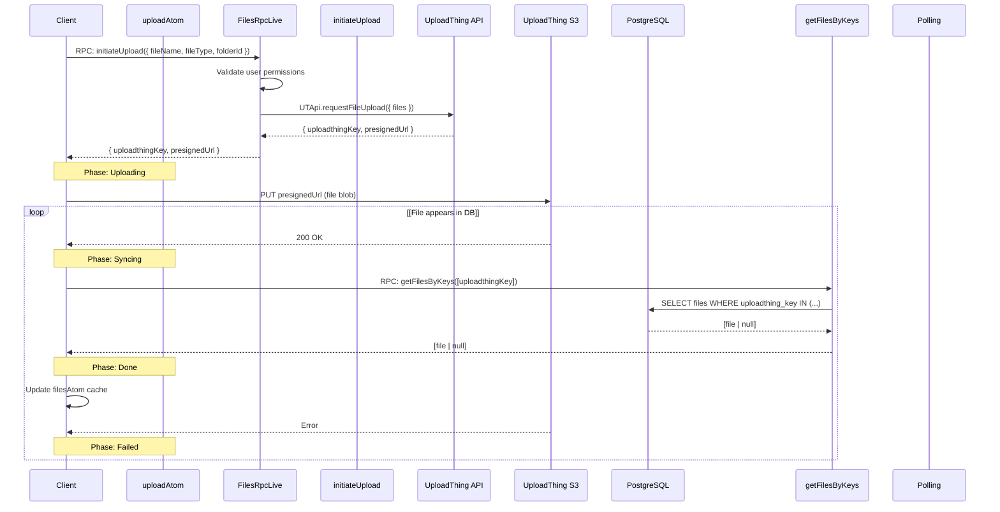
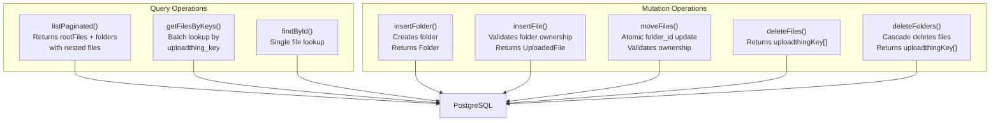
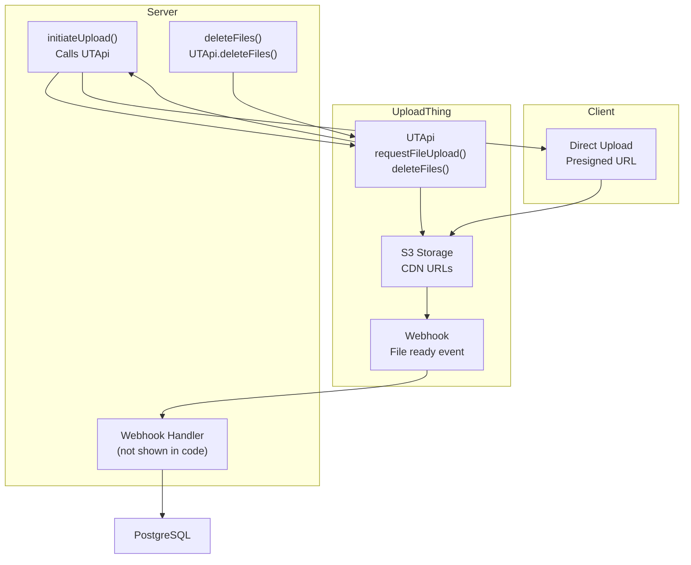
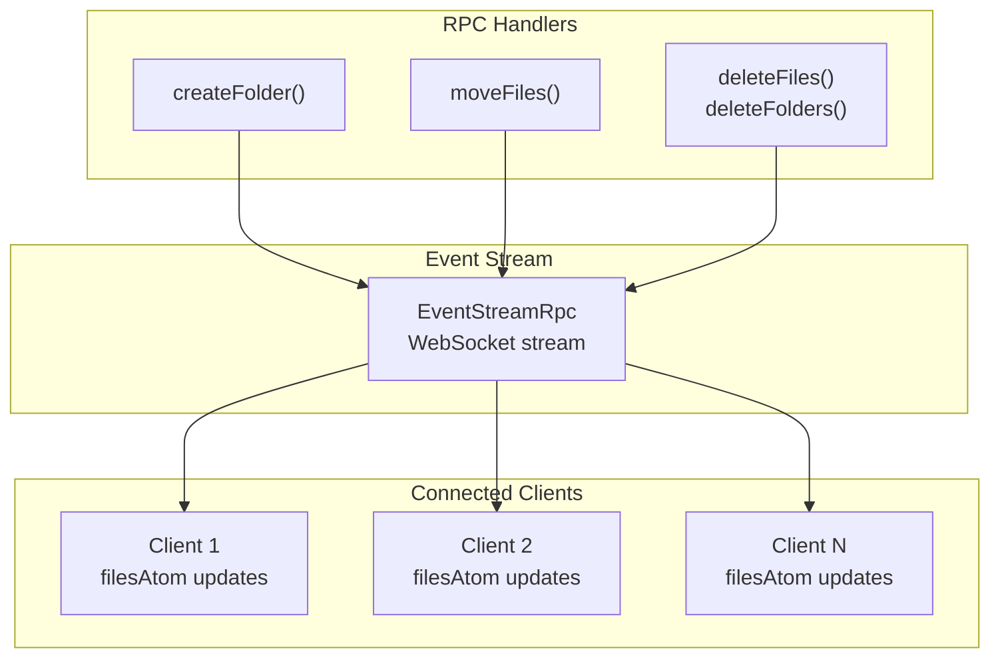

# File Management System

> **Relevant source files**
> * [packages/server/src/db/migrations/sql/_schema.sql](https://github.com/oscaromsn/TalentScore/blob/428ed1eb/packages/server/src/db/migrations/sql/_schema.sql)
> * [packages/server/src/public/files/files-repo.ts](https://github.com/oscaromsn/TalentScore/blob/428ed1eb/packages/server/src/public/files/files-repo.ts)
> * [packages/server/src/server.ts](https://github.com/oscaromsn/TalentScore/blob/428ed1eb/packages/server/src/server.ts)

## Purpose and Scope

This document describes the server-side file management system, which provides file upload, folder organization, and metadata persistence capabilities. The system integrates with UploadThing for cloud storage and exposes RPC operations for file/folder CRUD operations.

This page covers the server architecture, database schema, and core file management operations. For detailed repository method documentation, see [Files Repository](/oscaromsn/TalentScore/4.5.1-files-repository). For client-side upload state management, see [File State Management](/oscaromsn/TalentScore/5.2.2-file-state-management). For UI components, see [File Management UI](/oscaromsn/TalentScore/5.4-file-management-ui).

**Sources:** [packages/server/src/server.ts](https://github.com/oscaromsn/TalentScore/blob/428ed1eb/packages/server/src/server.ts)

 Diagram 4 (File Management System Architecture)

---

## System Architecture

The file management system implements a **dual-storage architecture** separating file content from metadata:

* **File Content**: Stored in UploadThing's S3-compatible storage
* **File Metadata**: Persisted in PostgreSQL for querying and access control

This separation enables efficient file operations (metadata updates, moves, queries) without touching the large file blobs, while delegating storage scaling and CDN delivery to UploadThing.

### Architecture Diagram

```

```

**Sources:** [packages/server/src/server.ts L24](https://github.com/oscaromsn/TalentScore/blob/428ed1eb/packages/server/src/server.ts#L24-L24)

 [packages/server/src/public/files/files-repo.ts L11-L16](https://github.com/oscaromsn/TalentScore/blob/428ed1eb/packages/server/src/public/files/files-repo.ts#L11-L16)

---

## Database Schema

The file management system uses a two-table schema with hierarchical folder support:

### Schema Diagram

```sql
#mermaid-l05pnpeg4s{font-family:ui-sans-serif,-apple-system,system-ui,Segoe UI,Helvetica;font-size:16px;fill:#ccc;}@keyframes edge-animation-frame{from{stroke-dashoffset:0;}}@keyframes dash{to{stroke-dashoffset:0;}}#mermaid-l05pnpeg4s .edge-animation-slow{stroke-dasharray:9,5!important;stroke-dashoffset:900;animation:dash 50s linear infinite;stroke-linecap:round;}#mermaid-l05pnpeg4s .edge-animation-fast{stroke-dasharray:9,5!important;stroke-dashoffset:900;animation:dash 20s linear infinite;stroke-linecap:round;}#mermaid-l05pnpeg4s .error-icon{fill:#333;}#mermaid-l05pnpeg4s .error-text{fill:#cccccc;stroke:#cccccc;}#mermaid-l05pnpeg4s .edge-thickness-normal{stroke-width:1px;}#mermaid-l05pnpeg4s .edge-thickness-thick{stroke-width:3.5px;}#mermaid-l05pnpeg4s .edge-pattern-solid{stroke-dasharray:0;}#mermaid-l05pnpeg4s .edge-thickness-invisible{stroke-width:0;fill:none;}#mermaid-l05pnpeg4s .edge-pattern-dashed{stroke-dasharray:3;}#mermaid-l05pnpeg4s .edge-pattern-dotted{stroke-dasharray:2;}#mermaid-l05pnpeg4s .marker{fill:#666;stroke:#666;}#mermaid-l05pnpeg4s .marker.cross{stroke:#666;}#mermaid-l05pnpeg4s svg{font-family:ui-sans-serif,-apple-system,system-ui,Segoe UI,Helvetica;font-size:16px;}#mermaid-l05pnpeg4s p{margin:0;}#mermaid-l05pnpeg4s .entityBox{fill:#111;stroke:#222;}#mermaid-l05pnpeg4s .relationshipLabelBox{fill:#333;opacity:0.7;background-color:#333;}#mermaid-l05pnpeg4s .relationshipLabelBox rect{opacity:0.5;}#mermaid-l05pnpeg4s .labelBkg{background-color:rgba(51, 51, 51, 0.5);}#mermaid-l05pnpeg4s .edgeLabel .label{fill:#222;font-size:14px;}#mermaid-l05pnpeg4s .label{font-family:ui-sans-serif,-apple-system,system-ui,Segoe UI,Helvetica;color:#fff;}#mermaid-l05pnpeg4s .edge-pattern-dashed{stroke-dasharray:8,8;}#mermaid-l05pnpeg4s .node rect,#mermaid-l05pnpeg4s .node circle,#mermaid-l05pnpeg4s .node ellipse,#mermaid-l05pnpeg4s .node polygon{fill:#111;stroke:#222;stroke-width:1px;}#mermaid-l05pnpeg4s .relationshipLine{stroke:#666;stroke-width:1;fill:none;}#mermaid-l05pnpeg4s .marker{fill:none!important;stroke:#666!important;stroke-width:1;}#mermaid-l05pnpeg4s :root{--mermaid-font-family:"trebuchet ms",verdana,arial,sans-serif;}containsfile_foldersuuididPKuuiduser_idNOT NULLtextnameNOT NULLtimestamptzcreated_attimestamptzupdated_atfilesuuididPKuuiduser_idNOT NULLuuidfolder_idFK, NULL, ON DELETE CASCADEtextuploadthing_keyUNIQUE, NOT NULLtextuploadthing_urlNOT NULLtextnameNOT NULLtextsizeNOT NULLtextmime_typeNOT NULLuuiduploaded_by_user_idNOT NULLtimestamptzcreated_attimestamptzupdated_at
```

### Table Specifications

| Table | Purpose | Key Constraints |
| --- | --- | --- |
| `file_folders` | Stores folder metadata for organizing files | - `user_id` enables multi-tenancy- `name` is user-defined- Indexed on `user_id` |
| `files` | Stores file metadata with UploadThing references | - `uploadthing_key` UNIQUE prevents duplicates- `folder_id` nullable for root-level files- `ON DELETE CASCADE` ensures atomic folder deletion- Indexed on `user_id`, `folder_id`, `uploadthing_key` |

### Key Design Decisions

1. **Nullable `folder_id`**: Enables root-level files (files not in any folder). The query in `listPaginated` separates root files from folder files using `WHERE folder_id IS NULL`.
2. **UNIQUE `uploadthing_key`**: Prevents duplicate file uploads. This is the primary link between PostgreSQL metadata and UploadThing storage.
3. **Cascading Deletes**: `ON DELETE CASCADE` on `folder_id` ensures that when a folder is deleted, all contained files are automatically removed from the database. The application code then handles deletion from UploadThing storage.
4. **Size as TEXT**: File sizes are stored as text to handle arbitrarily large file sizes without integer overflow issues.

**Sources:** [packages/server/src/db/migrations/sql/_schema.sql L3-L30](https://github.com/oscaromsn/TalentScore/blob/428ed1eb/packages/server/src/db/migrations/sql/_schema.sql#L3-L30)

---

## Upload Flow

The file upload process follows a **three-phase state machine** coordinated between client, server, and UploadThing:

### Upload Sequence Diagram



### Upload Phases

| Phase | Description | Client State | Error Handling |
| --- | --- | --- | --- |
| **Uploading** | Direct PUT to S3 with presigned URL | `uploadingPhase: "uploading"` | Exponential backoff retry (3 attempts) |
| **Syncing** | Poll server waiting for DB registration | `uploadingPhase: "syncing"` | Timeout after 20 polls (10 seconds) |
| **Done** | File registered, update local cache | `uploadingPhase: "done"` | N/A |
| **Failed** | Upload or sync failed | `uploadingPhase: "failed"` | Error displayed to user |

### Why Polling for Sync?

UploadThing's webhook-based file registration is asynchronous. The server receives a webhook from UploadThing after S3 upload completes, then calls `FilesRepo.insertFile`. The client polls `getFilesByKeys` to detect when this registration completes, enabling immediate UI updates without waiting for a separate WebSocket event.

**Sources:** Diagram 4 (File Management System Architecture), Diagram 6 (Data Flow: Resume Parsing to UI Display)

---

## CRUD Operations

The `FilesRepo` exposes the following operations, each wrapped in Effect's type-safe error handling:

### Repository API Surface



### Method Details

#### listPaginated

Returns paginated file/folder data with nested structure:

```

```

Implementation uses complex SQL with CTEs to efficiently query root files and paginated folders with their nested files in a single query.

**Source:** [packages/server/src/public/files/files-repo.ts L18-L168](https://github.com/oscaromsn/TalentScore/blob/428ed1eb/packages/server/src/public/files/files-repo.ts#L18-L168)

---

#### insertFile

Inserts file metadata with automatic folder ownership validation:

| Parameter | Type | Description |
| --- | --- | --- |
| `userId` | `UserId` | Owner of the file |
| `folderId` | `FolderId \| null` | Target folder (null for root) |
| `uploadthingKey` | `string` | Unique UploadThing identifier (UNIQUE constraint) |
| `uploadthingUrl` | `string` | CDN URL for file access |
| `name` | `string` | Display name |
| `size` | `string` | File size in bytes (as text) |
| `mimeType` | `string` | Content type |
| `uploadedByUserId` | `UUID` | User who performed upload |

**Ownership Validation**: When `folderId` is non-null, the query includes a CTE that validates the folder exists and belongs to `userId` before insertion. This prevents users from inserting files into other users' folders.

**Source:** [packages/server/src/public/files/files-repo.ts L196-L293](https://github.com/oscaromsn/TalentScore/blob/428ed1eb/packages/server/src/public/files/files-repo.ts#L196-L293)

---

#### moveFiles

Atomically updates `folder_id` for multiple files:

* **Validation**: Checks target folder ownership before update (lines 382-390)
* **Batch Operation**: Uses `sql.in()` to update multiple files in one transaction
* **Root Move**: Setting `folderId` to `null` moves files to root level
* **Atomicity**: Entire operation succeeds or fails as a unit

**Source:** [packages/server/src/public/files/files-repo.ts L356-L395](https://github.com/oscaromsn/TalentScore/blob/428ed1eb/packages/server/src/public/files/files-repo.ts#L356-L395)

---

#### deleteFiles and deleteFolders

Both methods implement **two-phase deletion**:

1. **Phase 1 (Database)**: Delete from PostgreSQL, return `uploadthingKey[]`
2. **Phase 2 (Storage)**: Caller uses returned keys to delete from UploadThing

This pattern ensures database consistency even if UploadThing deletion fails. The server RPC handler coordinates both phases.

**Cascade Behavior**: `deleteFolders` relies on `ON DELETE CASCADE` to automatically delete contained files from the database, then queries for all affected `uploadthingKey` values before deletion.

**Sources:** [packages/server/src/public/files/files-repo.ts L295-L354](https://github.com/oscaromsn/TalentScore/blob/428ed1eb/packages/server/src/public/files/files-repo.ts#L295-L354)

---

#### getFilesByKeys

Batch lookup method used for sync polling:

* **Input**: Array of `uploadthingKey` strings
* **Output**: Array of `UploadedFile | null` in same order
* **Purpose**: Enables client to detect when uploaded files appear in database
* **Optimization**: Returns early if input array is empty

**Source:** [packages/server/src/public/files/files-repo.ts L397-L436](https://github.com/oscaromsn/TalentScore/blob/428ed1eb/packages/server/src/public/files/files-repo.ts#L397-L436)

---

## Multi-tenant Data Model

All operations enforce user isolation through consistent `user_id` filtering:

### User Isolation Pattern

```

```

### Security Properties

| Operation | Security Mechanism |
| --- | --- |
| **List** | Only returns user's files/folders via `user_id` filter |
| **Insert** | Validates folder ownership with CTE before insertion |
| **Move** | Validates both file ownership AND target folder ownership |
| **Delete** | Only deletes files/folders matching `user_id` |
| **Get by ID** | Includes `user_id` in WHERE clause |

All SQL queries include `user_id` predicates to prevent cross-tenant data access, even if an attacker obtains a valid file/folder UUID.

**Sources:** [packages/server/src/public/files/files-repo.ts L18-L476](https://github.com/oscaromsn/TalentScore/blob/428ed1eb/packages/server/src/public/files/files-repo.ts#L18-L476)

---

## UploadThing Integration

UploadThing serves as the external file storage provider:

### Integration Points



### UploadThing API Methods

| Method | Purpose | Server Usage |
| --- | --- | --- |
| `requestFileUpload()` | Generates presigned S3 URL + unique key | Called in `initiateUpload` RPC handler |
| Webhook callback | Notifies when file upload completes | Triggers `FilesRepo.insertFile` to register metadata |
| `deleteFiles(keys)` | Removes files from storage | Called after `deleteFiles`/`deleteFolders` database operations |

### Upload Flow Details

1. **Client** calls `initiateUpload` RPC with file metadata
2. **Server** calls `UTApi.requestFileUpload()`, receives: * `uploadthingKey`: Unique identifier for this file * `presignedUrl`: Time-limited S3 PUT endpoint
3. **Server** returns both to client
4. **Client** uploads file blob directly to S3 (bypassing server)
5. **UploadThing** triggers webhook when upload completes
6. **Server** webhook handler calls `FilesRepo.insertFile` with metadata
7. **Client** polling detects file appearance via `getFilesByKeys`

This architecture minimizes server bandwidth by routing large file uploads directly to S3.

**Sources:** Diagram 4 (File Management System Architecture), [packages/server/src/server.ts L24](https://github.com/oscaromsn/TalentScore/blob/428ed1eb/packages/server/src/server.ts#L24-L24)

---

## Real-time Synchronization

File operations broadcast real-time events to keep all connected clients synchronized:

### Event Broadcasting Pattern



### Synchronization Strategy

The system uses a **dual-channel** approach:

1. **Optimistic Updates**: Client immediately updates local `filesAtom` cache after mutations
2. **Real-time Broadcast**: Server broadcasts `FilesEvent` to all connected clients
3. **Cache Reconciliation**: Other clients receive event and update their caches

This ensures low-latency local updates while maintaining eventual consistency across all connected sessions.

### Event Types

Events are defined in the `FilesRpc` contract and include metadata for cache updates:

* `FileCreated`: New file registered (includes full `UploadedFile`)
* `FolderCreated`: New folder created (includes full `Folder`)
* `FilesMoved`: Files moved to different folder (includes `fileIds` + new `folderId`)
* `FilesDeleted`: Files removed (includes `fileIds`)
* `FoldersDeleted`: Folders removed (includes `folderIds`)

**Sources:** [packages/server/src/server.ts L23](https://github.com/oscaromsn/TalentScore/blob/428ed1eb/packages/server/src/server.ts#L23-L23)

 Diagram 4 (File Management System Architecture)

---

## Performance Considerations

### Indexing Strategy

The schema includes targeted indexes for common query patterns:

```

```

These indexes optimize:

* Multi-tenant queries filtering by `user_id`
* Folder contents queries filtering by `folder_id`
* Sync polling queries looking up `uploadthing_key`

**Source:** [packages/server/src/db/migrations/sql/_schema.sql L27-L30](https://github.com/oscaromsn/TalentScore/blob/428ed1eb/packages/server/src/db/migrations/sql/_schema.sql#L27-L30)

---

### Pagination Implementation

The `listPaginated` query uses CTEs to efficiently paginate folders while eagerly loading their contained files:

1. **counts CTE**: Calculates total folder count once
2. **page_folders CTE**: Fetches only the folders for current page
3. **Main Query**: Joins page folders with their files using `LEFT JOIN LATERAL`

This avoids N+1 queries while limiting memory usage for large folder counts.

**Source:** [packages/server/src/public/files/files-repo.ts L33-L164](https://github.com/oscaromsn/TalentScore/blob/428ed1eb/packages/server/src/public/files/files-repo.ts#L33-L164)

---

### Batch Operations

Both `moveFiles` and `deleteFiles` accept arrays of IDs and use `sql.in()` for batch SQL operations:

```

```

This reduces round-trips for bulk operations like multi-select delete.

**Sources:** [packages/server/src/public/files/files-repo.ts L304-L315](https://github.com/oscaromsn/TalentScore/blob/428ed1eb/packages/server/src/public/files/files-repo.ts#L304-L315)

 [packages/server/src/public/files/files-repo.ts L370-L391](https://github.com/oscaromsn/TalentScore/blob/428ed1eb/packages/server/src/public/files/files-repo.ts#L370-L391)

---

## Error Handling

All repository methods use Effect's error handling patterns:

* `Effect.orDie`: Treats database errors as defects (unrecoverable)
* `Effect.withSpan`: Adds OpenTelemetry tracing to all operations
* Schema validation: `SqlSchema` validates query results against Effect schemas

The RPC layer (not shown here) catches these errors and maps them to domain-specific error types returned to clients.

**Sources:** [packages/server/src/public/files/files-repo.ts L166-L167](https://github.com/oscaromsn/TalentScore/blob/428ed1eb/packages/server/src/public/files/files-repo.ts#L166-L167)

 [packages/server/src/public/files/files-repo.ts L292-L293](https://github.com/oscaromsn/TalentScore/blob/428ed1eb/packages/server/src/public/files/files-repo.ts#L292-L293)