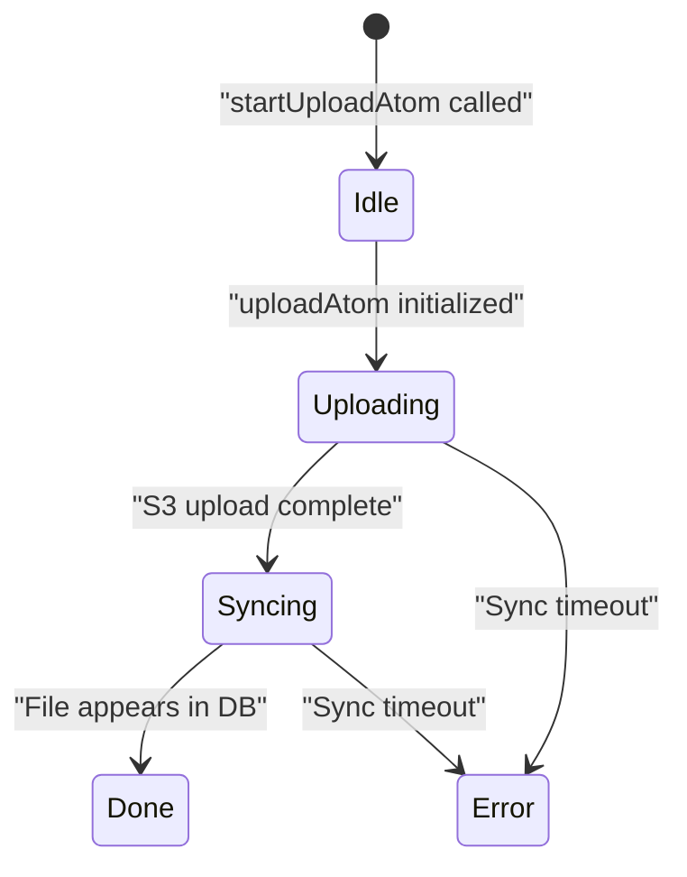
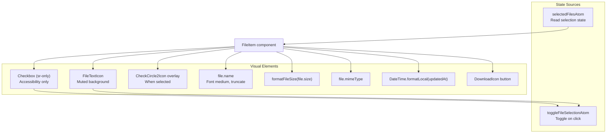
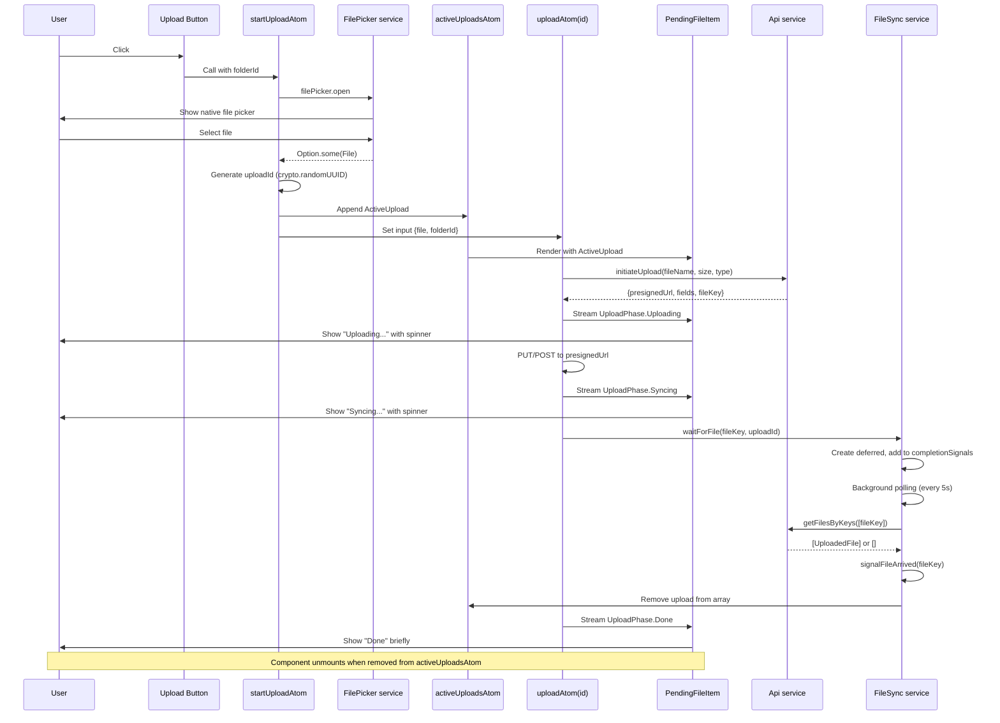
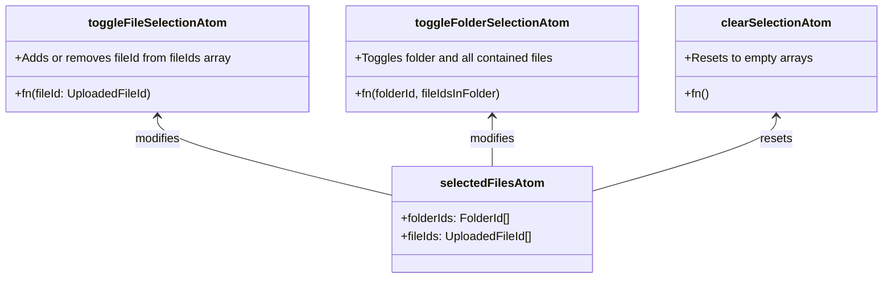

# File Management UI

> **Relevant source files**
> * [packages/client/src/routes/files/-files/file-item/file-item.tsx](https://github.com/oscaromsn/TalentScore/blob/428ed1eb/packages/client/src/routes/files/-files/file-item/file-item.tsx)
> * [packages/client/src/routes/files/-files/file-item/pending-file-item.tsx](https://github.com/oscaromsn/TalentScore/blob/428ed1eb/packages/client/src/routes/files/-files/file-item/pending-file-item.tsx)
> * [packages/client/src/routes/files/-files/files-atoms/files-atoms.test.ts](https://github.com/oscaromsn/TalentScore/blob/428ed1eb/packages/client/src/routes/files/-files/files-atoms/files-atoms.test.ts)
> * [packages/client/src/routes/files/-files/files-atoms/files-atoms.tsx](https://github.com/oscaromsn/TalentScore/blob/428ed1eb/packages/client/src/routes/files/-files/files-atoms/files-atoms.tsx)

This document describes the React components that implement the file management user interface in TalentScore. It covers the upload components (`PendingFileItem`), file display components (`FileItem`), and their integration with the state management layer. For the underlying state management logic and RPC integration, see [File State Management](/oscaromsn/TalentScore/5.2.2-file-state-management). For the server-side file repository, see [Files Repository](/oscaromsn/TalentScore/4.5.1-files-repository).

---

## Component Architecture

The file management UI consists of two primary component types: pending upload items that display in-progress uploads, and file items that display synced files. Both components read from Effect Atoms to display real-time state updates.

```

```

**Sources**: [packages/client/src/routes/files/-files/file-item/pending-file-item.tsx L1-L94](https://github.com/oscaromsn/TalentScore/blob/428ed1eb/packages/client/src/routes/files/-files/file-item/pending-file-item.tsx#L1-L94)

 [packages/client/src/routes/files/-files/file-item/file-item.tsx L1-L109](https://github.com/oscaromsn/TalentScore/blob/428ed1eb/packages/client/src/routes/files/-files/file-item/file-item.tsx#L1-L109)

 [packages/client/src/routes/files/-files/files-atoms/files-atoms.tsx L1-L691](https://github.com/oscaromsn/TalentScore/blob/428ed1eb/packages/client/src/routes/files/-files/files-atoms/files-atoms.tsx#L1-L691)

---

## PendingFileItem Component

The `PendingFileItem` component displays files during the upload process, showing real-time progress through three phases: Uploading, Syncing, and Done. It subscribes to the `uploadAtom` family to receive streaming upload state updates.

### Component Props and State

| Prop | Type | Description |
| --- | --- | --- |
| `upload` | `ActiveUpload` | Metadata about the upload (id, fileName, fileSize, mimeType, folderId) |

The component reads from `uploadAtom(upload.id)` which returns a `Result<Option<UploadPhase>>`:



**Sources**: [packages/client/src/routes/files/-files/file-item/pending-file-item.tsx L35-L93](https://github.com/oscaromsn/TalentScore/blob/428ed1eb/packages/client/src/routes/files/-files/file-item/pending-file-item.tsx#L35-L93)

 [packages/client/src/routes/files/-files/files-atoms/files-atoms.tsx L66-L92](https://github.com/oscaromsn/TalentScore/blob/428ed1eb/packages/client/src/routes/files/-files/files-atoms/files-atoms.tsx#L66-L92)

### Upload Phase Detection

The component determines the current phase and error state using Effect Result pattern matching:

[packages/client/src/routes/files/-files/file-item/pending-file-item.tsx L36-L51](https://github.com/oscaromsn/TalentScore/blob/428ed1eb/packages/client/src/routes/files/-files/file-item/pending-file-item.tsx#L36-L51)

The phase detection logic:

* `Result.value(result)` extracts `Option<UploadPhase>` if successful
* `Option.getOrNull()` unwraps the phase or returns null
* `Result.isFailure() && !Result.isInterrupted()` detects true errors (not user cancellations)
* Status label maps phase tags to user-friendly strings

### Visual States

The component renders different visual indicators based on state:

| State | Icon | Status Text | Border | Action |
| --- | --- | --- | --- | --- |
| `Uploading` | `Loader2Icon` (animated) | "Uploading..." | `border-border` | Cancel button (X) |
| `Syncing` | `Loader2Icon` (animated) | "Syncing..." | `border-border` | No action |
| `Done` | `Loader2Icon` | "Done" | `border-border` | No action |
| Error | `AlertCircleIcon` | "Upload failed" | `border-destructive` | No action |
| Starting | `Loader2Icon` (animated) | "Starting..." | `border-border` | No action |

**Sources**: [packages/client/src/routes/files/-files/file-item/pending-file-item.tsx L54-L93](https://github.com/oscaromsn/TalentScore/blob/428ed1eb/packages/client/src/routes/files/-files/file-item/pending-file-item.tsx#L54-L93)

### File Size Formatting

The component includes a utility function `formatFileSize` that converts byte sizes to human-readable format:

[packages/client/src/routes/files/-files/file-item/pending-file-item.tsx L13-L29](https://github.com/oscaromsn/TalentScore/blob/428ed1eb/packages/client/src/routes/files/-files/file-item/pending-file-item.tsx#L13-L29)

The formatting algorithm:

* Handles 0 bytes as special case
* Iterates through units (B, KB, MB, GB, TB, PB)
* Divides by 1024 until value < 1024 or max unit reached
* Shows 1 decimal place for values < 10, otherwise 0 decimals

### Cancel Functionality

During the `Uploading` phase, users can cancel the upload by clicking the X button, which calls `cancelUploadAtom`:

[packages/client/src/routes/files/-files/file-item/pending-file-item.tsx L86-L90](https://github.com/oscaromsn/TalentScore/blob/428ed1eb/packages/client/src/routes/files/-files/file-item/pending-file-item.tsx#L86-L90)

The cancel action:

1. Sets `uploadAtom(uploadId)` to `Atom.Interrupt`
2. Removes the upload from `activeUploadsAtom`
3. Triggers cleanup of HTTP request and file picker

**Sources**: [packages/client/src/routes/files/-files/files-atoms/files-atoms.tsx L352-L362](https://github.com/oscaromsn/TalentScore/blob/428ed1eb/packages/client/src/routes/files/-files/files-atoms/files-atoms.tsx#L352-L362)

---

## FileItem Component

The `FileItem` component displays synced files with selection, metadata, and download capabilities. It integrates with the multi-select system for bulk operations.

### Component Structure



**Sources**: [packages/client/src/routes/files/-files/file-item/file-item.tsx L40-L108](https://github.com/oscaromsn/TalentScore/blob/428ed1eb/packages/client/src/routes/files/-files/file-item/file-item.tsx#L40-L108)

### Selection State

The component uses a label-wrapped checkbox pattern for accessibility and better UX:

[packages/client/src/routes/files/-files/file-item/file-item.tsx L55-L68](https://github.com/oscaromsn/TalentScore/blob/428ed1eb/packages/client/src/routes/files/-files/file-item/file-item.tsx#L55-L68)

Selection state management:

* `useAtomValue(selectedFilesAtom)` reads current selection
* `Arr.contains(selection.fileIds, file.id)` determines if this file is selected
* `useAtomSet(toggleFileSelectionAtom)` provides toggle function
* `<input type="checkbox" className="sr-only">` provides screen reader accessibility
* Clicking anywhere on the label toggles selection

### Visual Selection Feedback

Selected files receive distinct visual styling:

| Property | Unselected | Selected |
| --- | --- | --- |
| Border | `border-border` | `border-primary border-2` |
| Background | `bg-card` | `bg-primary/10` |
| Hover | `hover:border-primary/40 hover:shadow-md` | N/A |
| Icon Overlay | None | `CheckCircle2Icon` with backdrop-blur |

The selected state shows a checkmark overlay on the file icon:

[packages/client/src/routes/files/-files/file-item/file-item.tsx L71-L78](https://github.com/oscaromsn/TalentScore/blob/428ed1eb/packages/client/src/routes/files/-files/file-item/file-item.tsx#L71-L78)

**Sources**: [packages/client/src/routes/files/-files/file-item/file-item.tsx L54-L78](https://github.com/oscaromsn/TalentScore/blob/428ed1eb/packages/client/src/routes/files/-files/file-item/file-item.tsx#L54-L78)

### File Metadata Display

The component displays three lines of metadata:

1. **File name**: `file.name` - truncated with ellipsis if too long
2. **Size and MIME type**: `formatFileSize(file.size) • file.mimeType`
3. **Last updated**: Formatted using `DateTime.formatLocal` with month/day/year and time

Date formatting configuration:
[packages/client/src/routes/files/-files/file-item/file-item.tsx L86-L92](https://github.com/oscaromsn/TalentScore/blob/428ed1eb/packages/client/src/routes/files/-files/file-item/file-item.tsx#L86-L92)

The format produces strings like "Dec 15, 2024, 2:30 PM" using the user's locale.

### File Size Formatting

Similar to `PendingFileItem`, this component has its own `formatFileSize` implementation but handles `BigInt` for server-provided size strings:

[packages/client/src/routes/files/-files/file-item/file-item.tsx L13-L34](https://github.com/oscaromsn/TalentScore/blob/428ed1eb/packages/client/src/routes/files/-files/file-item/file-item.tsx#L13-L34)

The BigInt implementation:

* Converts string size to `BigInt` for precise large number handling
* Divides using BigInt arithmetic (`value / 1024n`)
* Calculates decimal precision using modulo and remainder conversion
* Combines integer and decimal parts for final display value

### Download Functionality

The download button creates a temporary anchor element to trigger browser download:

[packages/client/src/routes/files/-files/file-item/file-item.tsx L45-L52](https://github.com/oscaromsn/TalentScore/blob/428ed1eb/packages/client/src/routes/files/-files/file-item/file-item.tsx#L45-L52)

Download implementation:

1. `e.stopPropagation()` prevents triggering file selection
2. Creates ephemeral `<a>` element with `href` set to `file.uploadthingUrl`
3. Sets `download` attribute to suggest filename
4. Sets `target="_blank"` for new tab (some browsers ignore this for downloads)
5. Programmatically clicks the link to trigger download

**Sources**: [packages/client/src/routes/files/-files/file-item/file-item.tsx L1-L109](https://github.com/oscaromsn/TalentScore/blob/428ed1eb/packages/client/src/routes/files/-files/file-item/file-item.tsx#L1-L109)

---

## Upload Workflow Integration

The upload workflow connects user actions through the FilePicker service, upload atoms, and UI components in a streaming architecture.

### End-to-End Upload Flow



**Sources**: [packages/client/src/routes/files/-files/files-atoms/files-atoms.tsx L317-L346](https://github.com/oscaromsn/TalentScore/blob/428ed1eb/packages/client/src/routes/files/-files/files-atoms/files-atoms.tsx#L317-L346)

 [packages/client/src/routes/files/-files/files-atoms/files-atoms.tsx L234-L307](https://github.com/oscaromsn/TalentScore/blob/428ed1eb/packages/client/src/routes/files/-files/files-atoms/files-atoms.tsx#L234-L307)

 [packages/client/src/routes/files/-files/files-atoms/files-atoms.tsx L94-L162](https://github.com/oscaromsn/TalentScore/blob/428ed1eb/packages/client/src/routes/files/-files/files-atoms/files-atoms.tsx#L94-L162)

### FilePicker Service

The `FilePicker` service creates a scoped file input element that lives for the duration of the upload workflow:

[packages/client/src/routes/files/-files/files-atoms/files-atoms.tsx L164-L207](https://github.com/oscaromsn/TalentScore/blob/428ed1eb/packages/client/src/routes/files/-files/files-atoms/files-atoms.tsx#L164-L207)

Service architecture:

* `Effect.acquireRelease` ensures cleanup when scope ends
* Creates hidden `<input type="file">` with PDF filter
* `Effect.async` wraps browser event listeners as Effect
* Returns `Option.Option<File>` - `Some` if selected, `None` if cancelled
* Removes element from DOM on scope exit

### Upload State Machine

The `uploadAtom` family implements a state machine using `Stream.unfoldEffect`:

[packages/client/src/routes/files/-files/files-atoms/files-atoms.tsx L234-L311](https://github.com/oscaromsn/TalentScore/blob/428ed1eb/packages/client/src/routes/files/-files/files-atoms/files-atoms.tsx#L234-L311)

State transitions:

1. **Idle → Uploading**: Initialize upload, return `UploadPhase.Uploading()`
2. **Uploading → Syncing**: Call `initiateUpload`, HTTP PUT/POST to S3, return `UploadPhase.Syncing()`
3. **Syncing → Done**: Call `waitForFile`, block until backend sync, return `UploadPhase.Done()`
4. **Done → None**: Return `Option.none()` to complete stream

Error handling:

* `catchTags` converts RPC/HTTP errors to `Effect.die` (unrecoverable)
* Retry policy on HTTP client: 3 attempts with exponential backoff (250ms × 1.5)
* User cancellation via `Atom.Interrupt` stops stream immediately

**Sources**: [packages/client/src/routes/files/-files/files-atoms/files-atoms.tsx L234-L311](https://github.com/oscaromsn/TalentScore/blob/428ed1eb/packages/client/src/routes/files/-files/files-atoms/files-atoms.tsx#L234-L311)

### FileSync Polling Mechanism

The `FileSync` service manages the Syncing → Done transition by polling the backend:

[packages/client/src/routes/files/-files/files-atoms/files-atoms.tsx L94-L162](https://github.com/oscaromsn/TalentScore/blob/428ed1eb/packages/client/src/routes/files/-files/files-atoms/files-atoms.tsx#L94-L162)

Polling strategy:

* Background fiber runs `Effect.repeat` every 5 seconds
* Only polls files added more than 5 seconds ago (prevents premature polling)
* Maintains `completionSignals` map of `uploadthingKey → Deferred`
* When file appears in response, completes the deferred
* Removes upload from `activeUploadsAtom` atomically

The deferred pattern enables blocking `waitForFile` calls:

1. Upload creates deferred, adds to map
2. Syncing phase awaits the deferred
3. Background polling signals completion when file found
4. Await returns, stream transitions to Done

**Sources**: [packages/client/src/routes/files/-files/files-atoms/files-atoms.tsx L111-L159](https://github.com/oscaromsn/TalentScore/blob/428ed1eb/packages/client/src/routes/files/-files/files-atoms/files-atoms.tsx#L111-L159)

---

## Selection System

The file management UI supports multi-select operations with distinct selection atoms for files and folders.

### Selection State Schema



**Sources**: [packages/client/src/routes/files/-files/files-atoms/files-atoms.tsx L219-L222](https://github.com/oscaromsn/TalentScore/blob/428ed1eb/packages/client/src/routes/files/-files/files-atoms/files-atoms.tsx#L219-L222)

### Individual File Selection

The `toggleFileSelectionAtom` adds or removes a single file from selection:

[packages/client/src/routes/files/-files/files-atoms/files-atoms.tsx L368-L379](https://github.com/oscaromsn/TalentScore/blob/428ed1eb/packages/client/src/routes/files/-files/files-atoms/files-atoms.tsx#L368-L379)

Toggle logic:

1. Read current selection state
2. Check if `fileId` exists in `current.fileIds` using `Arr.contains`
3. If exists, filter it out; otherwise append it
4. Update `selectedFilesAtom` with new array

### Folder Selection

The `toggleFolderSelectionAtom` implements hierarchical selection logic:

[packages/client/src/routes/files/-files/files-atoms/files-atoms.tsx L381-L405](https://github.com/oscaromsn/TalentScore/blob/428ed1eb/packages/client/src/routes/files/-files/files-atoms/files-atoms.tsx#L381-L405)

Folder toggle behavior:

| Current State | Action | Result |
| --- | --- | --- |
| Folder selected | Toggle | Remove `folderId` from `folderIds`, remove all `fileIdsInFolder` from `fileIds` |
| Folder not selected | Toggle | Add `folderId` to `folderIds`, add all `fileIdsInFolder` to `fileIds` |

This ensures:

* Selecting a folder selects all files inside
* Deselecting a folder deselects all files inside
* Individual file selection/deselection doesn't affect folder selection state

### Bulk Operations

Selected files and folders can be deleted using `deleteFilesAtom`:

[packages/client/src/routes/files/-files/files-atoms/files-atoms.tsx L421-L443](https://github.com/oscaromsn/TalentScore/blob/428ed1eb/packages/client/src/routes/files/-files/files-atoms/files-atoms.tsx#L421-L443)

Bulk delete workflow:

1. Read `fileIds` and `folderIds` from `selectedFilesAtom`
2. Call `api.deleteFiles` and `api.deleteFolders` concurrently using `Effect.zip`
3. Skip empty arrays using `Effect.unless`
4. Update `filesAtom` optimistically with `DeleteFolders` and `DeleteFiles` cache updates
5. Refresh `selectedFilesAtom` to reset selection state

**Sources**: [packages/client/src/routes/files/-files/files-atoms/files-atoms.tsx L368-L443](https://github.com/oscaromsn/TalentScore/blob/428ed1eb/packages/client/src/routes/files/-files/files-atoms/files-atoms.tsx#L368-L443)

---

## Real-Time Sync

The file management UI maintains cache consistency through WebSocket event streams that broadcast file changes to all connected clients.

### Event Stream Subscription

The `filesEventStreamAtom` subscribes to `FilesEvent` WebSocket events:

[packages/client/src/routes/files/-files/files-atoms/files-atoms.tsx L610-L629](https://github.com/oscaromsn/TalentScore/blob/428ed1eb/packages/client/src/routes/files/-files/files-atoms/files-atoms.tsx#L610-L629)

Event handling flow:

1. `makeEventStreamAtom` creates subscription atom with `FilesEvent` schema predicate
2. When event arrives, extract `event.file` (UploadedFile)
3. Signal `FileSync.signalFileArrived(event.file.uploadthingKey)` to complete pending uploads
4. Update `filesAtom` with `AddFile` cache update

This enables:

* Immediate UI updates when other users upload files
* Completion of local uploads when backend processes them
* Automatic cache synchronization without manual refresh

### Cache Update Operations

The `filesAtom` supports multiple cache update types defined in `FileCacheUpdate` tagged enum:

[packages/client/src/routes/files/-files/files-atoms/files-atoms.tsx L449-L464](https://github.com/oscaromsn/TalentScore/blob/428ed1eb/packages/client/src/routes/files/-files/files-atoms/files-atoms.tsx#L449-L464)

| Update Type | Parameters | Effect |
| --- | --- | --- |
| `DeleteFolders` | `folderIds` | Filters folders array, removes matching folders |
| `DeleteFiles` | `fileIds` | Filters files from root and all folder.files arrays |
| `CreateFolder` | `folder` | Appends new folder with empty files array |
| `MoveFiles` | `fileIds, fromFolderId, toFolderId` | Collects moved files, removes from source, adds to destination |
| `AddFile` | `file, folderId` | Prepends file to root or target folder |

The writable atom pattern enables optimistic updates:

[packages/client/src/routes/files/-files/files-atoms/files-atoms.tsx L466-L604](https://github.com/oscaromsn/TalentScore/blob/428ed1eb/packages/client/src/routes/files/-files/files-atoms/files-atoms.tsx#L466-L604)

Writable atom structure:

* **Getter**: Mounts event stream, reads remote atom
* **Setter**: Applies `FileCacheUpdate` transformations to current cached value
* **Refresher**: Triggers remote atom reload

**Sources**: [packages/client/src/routes/files/-files/files-atoms/files-atoms.tsx L449-L629](https://github.com/oscaromsn/TalentScore/blob/428ed1eb/packages/client/src/routes/files/-files/files-atoms/files-atoms.tsx#L449-L629)

---

## Testing Coverage

The file management UI atoms have comprehensive test coverage validating upload workflows, cancellation, and concurrent uploads.

### Test Infrastructure

The test suite uses mock layers for all external dependencies:

[packages/client/src/routes/files/-files/files-atoms/files-atoms.test.ts L41-L177](https://github.com/oscaromsn/TalentScore/blob/428ed1eb/packages/client/src/routes/files/-files/files-atoms/files-atoms.test.ts#L41-L177)

Mock factories:

* `makeApiMock`: Mocks `Api` service with call tracking and configurable failures
* `makeHttpClientMock`: Mocks HTTP client for S3 upload simulation
* `makeFilePickerMock`: Returns predefined `File` or `Option.none()`
* `makeFileSyncMock`: Simulates sync polling with manual trigger capability
* `makeEventStreamMock`: Captures published events

### Upload Flow Test

The primary test validates complete upload workflow from initiation through sync completion:

[packages/client/src/routes/files/-files/files-atoms/files-atoms.test.ts L226-L260](https://github.com/oscaromsn/TalentScore/blob/428ed1eb/packages/client/src/routes/files/-files/files-atoms/files-atoms.test.ts#L226-L260)

Test sequence:

1. Create mock `File` and test layer
2. Create registry with test layer
3. Mount `uploadAtom(uploadId)`
4. Set atom with `{file, folderId: null}`
5. Advance timers to process async operations
6. Verify state transitions to `Uploading` or `Syncing`
7. Manually trigger `triggerFileArrival(TEST_FILE_KEY)`
8. Verify final state is `Done`
9. Verify API and HTTP calls made

### Cancellation Test

Tests that `Atom.Interrupt` properly cancels in-progress uploads:

[packages/client/src/routes/files/-files/files-atoms/files-atoms.test.ts L262-L287](https://github.com/oscaromsn/TalentScore/blob/428ed1eb/packages/client/src/routes/files/-files/files-atoms/files-atoms.test.ts#L262-L287)

Cancellation behavior:

1. Start upload, verify success state
2. Set `uploadAtom(uploadId)` to `Atom.Interrupt`
3. Verify result becomes `Result.isInterrupted(result)`
4. Ensures cleanup of resources and removal from active uploads

### Concurrent Upload Test

Validates that multiple simultaneous uploads operate independently:

[packages/client/src/routes/files/-files/files-atoms/files-atoms.test.ts L289-L332](https://github.com/oscaromsn/TalentScore/blob/428ed1eb/packages/client/src/routes/files/-files/files-atoms/files-atoms.test.ts#L289-L332)

Test assertions:

* Two uploads can run concurrently
* Both reach `Uploading` or `Syncing` state
* Cancelling one upload doesn't affect the other
* Each upload maintains its own state machine

**Sources**: [packages/client/src/routes/files/-files/files-atoms/files-atoms.test.ts L1-L396](https://github.com/oscaromsn/TalentScore/blob/428ed1eb/packages/client/src/routes/files/-files/files-atoms/files-atoms.test.ts#L1-L396)

---

## Summary Table

| Component | File | Primary Atoms | Purpose |
| --- | --- | --- | --- |
| `PendingFileItem` | [pending-file-item.tsx L35-L93](https://github.com/oscaromsn/TalentScore/blob/428ed1eb/pending-file-item.tsx#L35-L93) | `uploadAtom`, `activeUploadsAtom`, `cancelUploadAtom` | Display in-progress uploads with phase-based status |
| `FileItem` | [file-item.tsx L40-L108](https://github.com/oscaromsn/TalentScore/blob/428ed1eb/file-item.tsx#L40-L108) | `selectedFilesAtom`, `toggleFileSelectionAtom` | Display synced files with selection and download |
| `FilePicker` | [files-atoms.tsx L164-L207](https://github.com/oscaromsn/TalentScore/blob/428ed1eb/files-atoms.tsx#L164-L207) | N/A (service) | Browser file selection dialog abstraction |
| `FileSync` | [files-atoms.tsx L94-L162](https://github.com/oscaromsn/TalentScore/blob/428ed1eb/files-atoms.tsx#L94-L162) | N/A (service) | Poll backend for upload completion |
| Upload state machine | [files-atoms.tsx L234-L311](https://github.com/oscaromsn/TalentScore/blob/428ed1eb/files-atoms.tsx#L234-L311) | `uploadAtom` family | Three-phase upload workflow (Uploading → Syncing → Done) |
| Selection management | [files-atoms.tsx L368-L415](https://github.com/oscaromsn/TalentScore/blob/428ed1eb/files-atoms.tsx#L368-L415) | `selectedFilesAtom`, toggle atoms, `clearSelectionAtom` | Multi-select files and folders for bulk operations |
| Cache synchronization | [files-atoms.tsx L466-L629](https://github.com/oscaromsn/TalentScore/blob/428ed1eb/files-atoms.tsx#L466-L629) | `filesAtom`, `filesEventStreamAtom` | Optimistic updates with WebSocket sync |