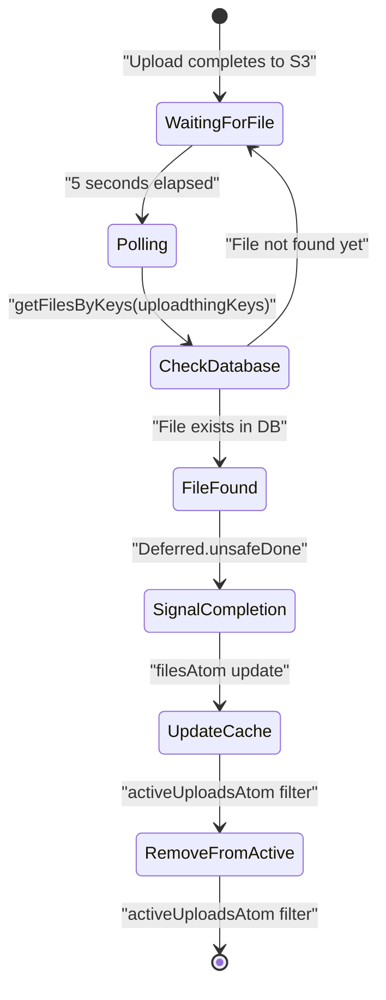
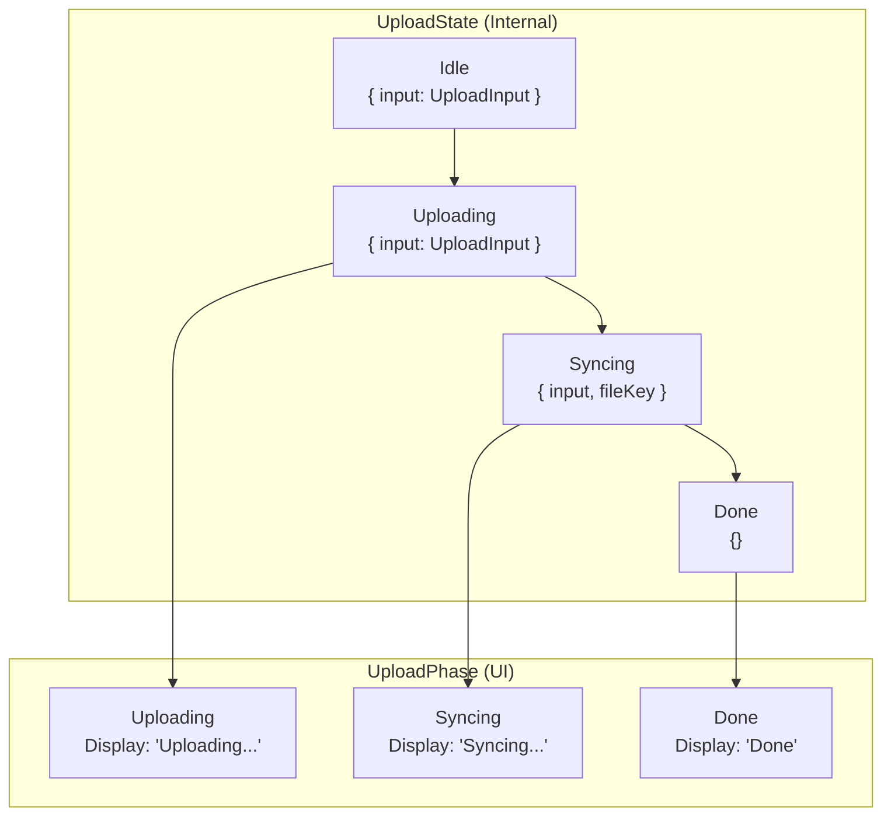
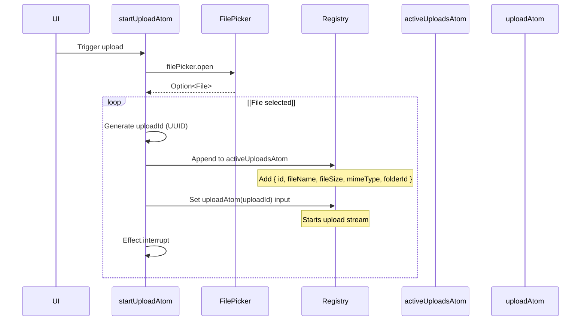
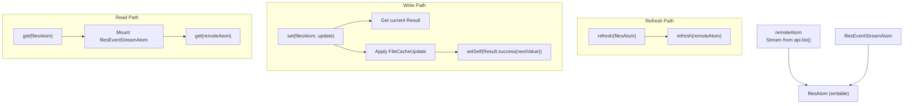
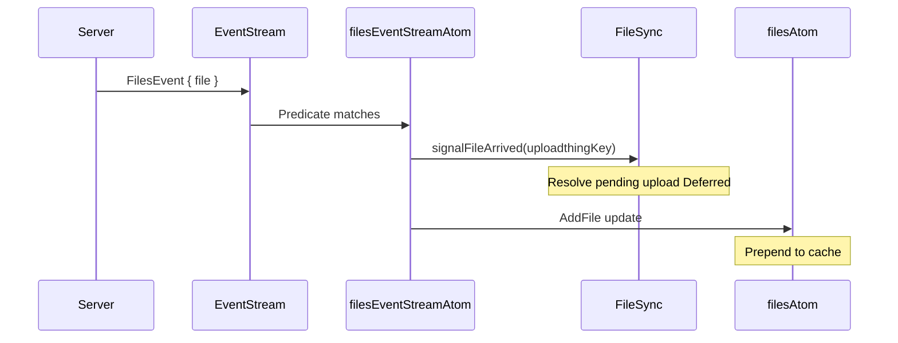

# File State Management

> **Relevant source files**
> * [packages/client/src/routes/files/-files/file-item/file-item.tsx](https://github.com/oscaromsn/TalentScore/blob/428ed1eb/packages/client/src/routes/files/-files/file-item/file-item.tsx)
> * [packages/client/src/routes/files/-files/file-item/pending-file-item.tsx](https://github.com/oscaromsn/TalentScore/blob/428ed1eb/packages/client/src/routes/files/-files/file-item/pending-file-item.tsx)
> * [packages/client/src/routes/files/-files/files-atoms/files-atoms.test.ts](https://github.com/oscaromsn/TalentScore/blob/428ed1eb/packages/client/src/routes/files/-files/files-atoms/files-atoms.test.ts)
> * [packages/client/src/routes/files/-files/files-atoms/files-atoms.tsx](https://github.com/oscaromsn/TalentScore/blob/428ed1eb/packages/client/src/routes/files/-files/files-atoms/files-atoms.tsx)

## Purpose and Scope

This document describes the client-side state management system for file uploads, synchronization, and organization. It covers the Effect Atom architecture used to manage file upload workflows, cache file metadata, and coordinate with the server via RPC. For resume-specific state management patterns, see [Resume State Management](/oscaromsn/TalentScore/5.2.1-resume-state-management). For the UI components that consume these atoms, see [File Management UI](/oscaromsn/TalentScore/5.4-file-management-ui).

The file state management system handles:

* Multi-phase file uploads (local → UploadThing S3 → server registration)
* Real-time file synchronization across clients
* Optimistic cache updates for file operations
* File/folder selection state

**Sources:** [packages/client/src/routes/files/-files/files-atoms/files-atoms.tsx L1-L691](https://github.com/oscaromsn/TalentScore/blob/428ed1eb/packages/client/src/routes/files/-files/files-atoms/files-atoms.tsx#L1-L691)

---

## Architecture Overview

The file state management system is built around Effect Services and Effect Atoms, providing reactive state updates and type-safe async operations.

```

```

**Sources:** [packages/client/src/routes/files/-files/files-atoms/files-atoms.tsx L37-L217](https://github.com/oscaromsn/TalentScore/blob/428ed1eb/packages/client/src/routes/files/-files/files-atoms/files-atoms.tsx#L37-L217)

---

## Effect Services

### Api Service

The `Api` service wraps all file-related RPC methods, providing a clean abstraction over the `DomainRpcClient`. It depends on `DomainRpcClient.Default` and exposes methods that match the Files RPC contract.

| Method | RPC Call | Purpose |
| --- | --- | --- |
| `list()` | `files_list()` | Stream paginated file/folder data |
| `initiateUpload(payload)` | `files_initiateUpload(payload)` | Get presigned S3 URL |
| `deleteFiles(payload)` | `files_deleteFiles(payload)` | Delete files by IDs |
| `deleteFolders(payload)` | `files_deleteFolders(payload)` | Delete folders by IDs |
| `createFolder(payload)` | `files_createFolder(payload)` | Create new folder |
| `moveFiles(payload)` | `files_moveFiles(payload)` | Move files to folder |
| `getFilesByKeys(payload)` | `files_getFilesByKeys(payload)` | Poll for file registration |

**Sources:** [packages/client/src/routes/files/-files/files-atoms/files-atoms.tsx L37-L60](https://github.com/oscaromsn/TalentScore/blob/428ed1eb/packages/client/src/routes/files/-files/files-atoms/files-atoms.tsx#L37-L60)

### FileSync Service

The `FileSync` service manages the synchronization between UploadThing uploads and server-side file registration. It maintains a map of `completionSignals` that coordinate between upload completion and database persistence.

**Key responsibilities:**

* Track pending uploads waiting for server confirmation
* Poll `getFilesByKeys` every 5 seconds for files older than 5 seconds
* Signal upload atoms when files appear in the database
* Clean up completion signals after file arrival



**Sources:** [packages/client/src/routes/files/-files/files-atoms/files-atoms.tsx L94-L162](https://github.com/oscaromsn/TalentScore/blob/428ed1eb/packages/client/src/routes/files/-files/files-atoms/files-atoms.tsx#L94-L162)

### FilePicker Service

The `FilePicker` service provides a scoped Effect service that manages a hidden file input element. It uses `Effect.acquireRelease` to ensure the DOM element is cleaned up properly.

**Key features:**

* Accepts only PDF files (`accept = "application/pdf,.pdf"`)
* Returns `Option<File>` (Some if file selected, None if canceled)
* Automatically cleans up event listeners and DOM nodes
* Uses scoped Effect lifecycle for resource management

**Sources:** [packages/client/src/routes/files/-files/files-atoms/files-atoms.tsx L164-L207](https://github.com/oscaromsn/TalentScore/blob/428ed1eb/packages/client/src/routes/files/-files/files-atoms/files-atoms.tsx#L164-L207)

---

## Upload State Machine

The upload system uses a dual-layer state model to separate UI presentation from internal workflow management.

### State Types



**UploadPhase:** Tagged enum for UI rendering (3 states)

* `Uploading` - File is being uploaded to S3
* `Syncing` - Waiting for server to register file in database
* `Done` - Upload complete and file synchronized

**UploadState:** Tagged enum for internal state machine (4 states)

* `Idle` - Initial state with file to upload
* `Uploading` - Actively uploading to S3
* `Syncing` - Polling for database registration
* `Done` - Terminal state

**Sources:** [packages/client/src/routes/files/-files/files-atoms/files-atoms.tsx L66-L92](https://github.com/oscaromsn/TalentScore/blob/428ed1eb/packages/client/src/routes/files/-files/files-atoms/files-atoms.tsx#L66-L92)

### State Transition Logic

The `makeUploadStream` function implements the state machine using `Stream.unfoldEffect`. Each state transition is handled by the `transition` function.

#### Idle → Uploading

No external work required. Returns `Uploading` phase and state.

**Sources:** [packages/client/src/routes/files/-files/files-atoms/files-atoms.tsx L249-L254](https://github.com/oscaromsn/TalentScore/blob/428ed1eb/packages/client/src/routes/files/-files/files-atoms/files-atoms.tsx#L249-L254)

#### Uploading → Syncing

1. Call `api.initiateUpload` to get presigned URL and file key
2. Create `FormData` with file and any required fields
3. Determine HTTP method (PUT for UploadThing v7, POST for v6)
4. Upload to S3 with exponential backoff retry (3 attempts, 250ms base, 1.5x multiplier)
5. Return `Syncing` phase and state with `fileKey`

**Sources:** [packages/client/src/routes/files/-files/files-atoms/files-atoms.tsx L256-L283](https://github.com/oscaromsn/TalentScore/blob/428ed1eb/packages/client/src/routes/files/-files/files-atoms/files-atoms.tsx#L256-L283)

#### Syncing → Done

1. Call `fileSync.waitForFile(fileKey, uploadId)` which creates a `Deferred`
2. Wait for `FileSync` polling to detect file in database
3. Signal deferred completion
4. Return `Done` phase and state

**Sources:** [packages/client/src/routes/files/-files/files-atoms/files-atoms.tsx L285-L291](https://github.com/oscaromsn/TalentScore/blob/428ed1eb/packages/client/src/routes/files/-files/files-atoms/files-atoms.tsx#L285-L291)

#### Error Handling

The transition function catches specific error types and converts them to `Effect.die`:

* `Unauthorized` - Auth failure
* `RpcClientError` - RPC communication error
* `RequestError` - HTTP request error
* `ResponseError` - HTTP response error

This ensures errors are unrecoverable and bubble up to the atom's failure state.

**Sources:** [packages/client/src/routes/files/-files/files-atoms/files-atoms.tsx L297-L304](https://github.com/oscaromsn/TalentScore/blob/428ed1eb/packages/client/src/routes/files/-files/files-atoms/files-atoms.tsx#L297-L304)

### uploadAtom Family

The `uploadAtom` is an atom family (one atom instance per upload ID) that creates upload streams.

```

```

Each atom instance:

* Takes `UploadInput` (file + optional folderId)
* Returns a stream of `UploadPhase` states
* Maintains independent lifecycle per upload ID
* Can be interrupted via `Atom.Interrupt`

**Sources:** [packages/client/src/routes/files/-files/files-atoms/files-atoms.tsx L309-L311](https://github.com/oscaromsn/TalentScore/blob/428ed1eb/packages/client/src/routes/files/-files/files-atoms/files-atoms.tsx#L309-L311)

---

## Upload Workflow

### startUploadAtom

The `startUploadAtom` orchestrates the upload initialization flow:



**Sources:** [packages/client/src/routes/files/-files/files-atoms/files-atoms.tsx L317-L346](https://github.com/oscaromsn/TalentScore/blob/428ed1eb/packages/client/src/routes/files/-files/files-atoms/files-atoms.tsx#L317-L346)

### cancelUploadAtom

The `cancelUploadAtom` interrupts an in-progress upload:

1. Set `uploadAtom(uploadId)` to `Atom.Interrupt`
2. Filter `uploadId` out of `activeUploadsAtom`

This causes the upload stream to stop and the UI to remove the pending item.

**Sources:** [packages/client/src/routes/files/-files/files-atoms/files-atoms.tsx L352-L362](https://github.com/oscaromsn/TalentScore/blob/428ed1eb/packages/client/src/routes/files/-files/files-atoms/files-atoms.tsx#L352-L362)

### activeUploadsAtom

A simple atom holding an array of `ActiveUpload` metadata for UI rendering:

```

```

The `PendingFileItem` component reads from `uploadAtom(upload.id)` to display upload progress.

**Sources:** [packages/client/src/routes/files/-files/files-atoms/files-atoms.tsx L73-L228](https://github.com/oscaromsn/TalentScore/blob/428ed1eb/packages/client/src/routes/files/-files/files-atoms/files-atoms.tsx#L73-L228)

 [packages/client/src/routes/files/-files/file-item/pending-file-item.tsx L35-L93](https://github.com/oscaromsn/TalentScore/blob/428ed1eb/packages/client/src/routes/files/-files/file-item/pending-file-item.tsx#L35-L93)

---

## File Cache Management

### filesAtom Structure

The `filesAtom` maintains a local cache of file and folder data, combining remote data fetching with optimistic updates.

**Data structure:**

```

```

**Sources:** [packages/client/src/routes/files/-files/files-atoms/files-atoms.tsx L466-L604](https://github.com/oscaromsn/TalentScore/blob/428ed1eb/packages/client/src/routes/files/-files/files-atoms/files-atoms.tsx#L466-L604)

### Cache Update Operations

The `filesAtom` is a writable atom that accepts `FileCacheUpdate` tagged enum values for optimistic updates:

| Update Type | Description | Cache Mutation |
| --- | --- | --- |
| `DeleteFolders` | Remove folders by IDs | Filter out folder IDs from `folders` array |
| `DeleteFiles` | Remove files by IDs | Filter out file IDs from both `rootFiles` and folder files |
| `CreateFolder` | Add new folder | Append folder with empty files array |
| `MoveFiles` | Move files between folders | Remove from source, append to destination |
| `AddFile` | Add newly uploaded file | Prepend to `rootFiles` or folder's files array |

**Sources:** [packages/client/src/routes/files/-files/files-atoms/files-atoms.tsx L449-L465](https://github.com/oscaromsn/TalentScore/blob/428ed1eb/packages/client/src/routes/files/-files/files-atoms/files-atoms.tsx#L449-L465)

### Cache Implementation



The atom uses three functions for its writable atom implementation:

1. **Read function:** Mounts the event stream and returns remote data
2. **Write function:** Applies optimistic `FileCacheUpdate` to current cache state
3. **Refresh function:** Reloads remote data from server

**Sources:** [packages/client/src/routes/files/-files/files-atoms/files-atoms.tsx L466-L604](https://github.com/oscaromsn/TalentScore/blob/428ed1eb/packages/client/src/routes/files/-files/files-atoms/files-atoms.tsx#L466-L604)

### Real-time Synchronization

The `filesEventStreamAtom` subscribes to `FilesEvent` WebSocket messages and updates the cache:



**Sources:** [packages/client/src/routes/files/-files/files-atoms/files-atoms.tsx L610-L629](https://github.com/oscaromsn/TalentScore/blob/428ed1eb/packages/client/src/routes/files/-files/files-atoms/files-atoms.tsx#L610-L629)

---

## Folder and File Operations

### createFolderAtom

Creates a new folder and optimistically updates the cache:

1. Call `api.createFolder({ folderName })`
2. Update `filesAtom` with `CreateFolder` cache update
3. Return created folder

**Sources:** [packages/client/src/routes/files/-files/files-atoms/files-atoms.tsx L635-L645](https://github.com/oscaromsn/TalentScore/blob/428ed1eb/packages/client/src/routes/files/-files/files-atoms/files-atoms.tsx#L635-L645)

### moveFilesAtom

Moves files to a different folder (or to root if `folderId` is null):

1. Determine source folder by inspecting current `filesAtom` state
2. Call `api.moveFiles({ fileIds, folderId })`
3. Update `filesAtom` with `MoveFiles` cache update
4. Refresh `selectedFilesAtom` to clear selection

**Sources:** [packages/client/src/routes/files/-files/files-atoms/files-atoms.tsx L651-L690](https://github.com/oscaromsn/TalentScore/blob/428ed1eb/packages/client/src/routes/files/-files/files-atoms/files-atoms.tsx#L651-L690)

### deleteFilesAtom

Deletes selected files and folders:

1. Get `fileIds` and `folderIds` from `selectedFilesAtom`
2. Call `api.deleteFiles` and `api.deleteFolders` concurrently
3. Update `filesAtom` with both `DeleteFolders` and `DeleteFiles` cache updates
4. Refresh `selectedFilesAtom` to clear selection

**Sources:** [packages/client/src/routes/files/-files/files-atoms/files-atoms.tsx L421-L443](https://github.com/oscaromsn/TalentScore/blob/428ed1eb/packages/client/src/routes/files/-files/files-atoms/files-atoms.tsx#L421-L443)

---

## Selection Management

### selectedFilesAtom

A simple atom holding IDs of selected files and folders:

```

```

**Sources:** [packages/client/src/routes/files/-files/files-atoms/files-atoms.tsx L219-L222](https://github.com/oscaromsn/TalentScore/blob/428ed1eb/packages/client/src/routes/files/-files/files-atoms/files-atoms.tsx#L219-L222)

### Selection Operations

| Atom | Purpose | Behavior |
| --- | --- | --- |
| `toggleFileSelectionAtom` | Toggle individual file | Add or remove `fileId` from `fileIds` array |
| `toggleFolderSelectionAtom` | Toggle folder and all files | Add/remove folder ID and all file IDs in folder |
| `clearSelectionAtom` | Clear all selections | Reset both arrays to empty |

**Folder selection logic:**

* If folder is selected: Remove folder ID and all file IDs in that folder
* If folder is not selected: Add folder ID and all file IDs in that folder

This ensures folder selection state is coupled with its file contents.

**Sources:** [packages/client/src/routes/files/-files/files-atoms/files-atoms.tsx L368-L415](https://github.com/oscaromsn/TalentScore/blob/428ed1eb/packages/client/src/routes/files/-files/files-atoms/files-atoms.tsx#L368-L415)

---

## Runtime and Layer Composition

The file atoms runtime composes all necessary Effect layers:

```

```

This runtime is used by all action atoms to provide services:

* `Api` for RPC calls
* `FetchHttpClient` for HTTP requests
* `FilePicker` for file dialogs
* `EventStream` for WebSocket events
* `FileSync` for upload completion tracking

**Sources:** [packages/client/src/routes/files/-files/files-atoms/files-atoms.tsx L209-L217](https://github.com/oscaromsn/TalentScore/blob/428ed1eb/packages/client/src/routes/files/-files/files-atoms/files-atoms.tsx#L209-L217)

---

## Testing Strategy

The test suite uses mock layers to isolate behavior and verify state transitions.

### Mock Factories

| Mock | Purpose | Key Behavior |
| --- | --- | --- |
| `makeApiMock` | Mock RPC calls | Records method calls, returns configurable responses |
| `makeHttpClientMock` | Mock HTTP client | Records URLs, simulates success/failure |
| `makeFilePickerMock` | Mock file dialog | Returns predefined file or none |
| `makeFileSyncMock` | Mock sync service | Manages deferred completion signals |
| `makeEventStreamMock` | Mock event stream | Records published events |

**Sources:** [packages/client/src/routes/files/-files/files-atoms/files-atoms.test.ts L38-L177](https://github.com/oscaromsn/TalentScore/blob/428ed1eb/packages/client/src/routes/files/-files/files-atoms/files-atoms.test.ts#L38-L177)

### Test Scenarios

The test suite validates:

* Complete upload flow for text files
* Upload cancellation via `Atom.Interrupt`
* Multiple concurrent independent uploads
* Error handling when API calls fail
* State machine phase transitions

Example test pattern:

```

```

**Sources:** [packages/client/src/routes/files/-files/files-atoms/files-atoms.test.ts L216-L395](https://github.com/oscaromsn/TalentScore/blob/428ed1eb/packages/client/src/routes/files/-files/files-atoms/files-atoms.test.ts#L216-L395)