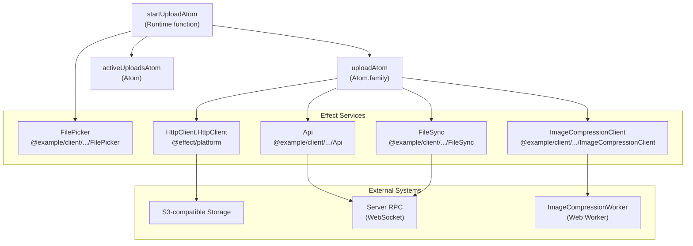
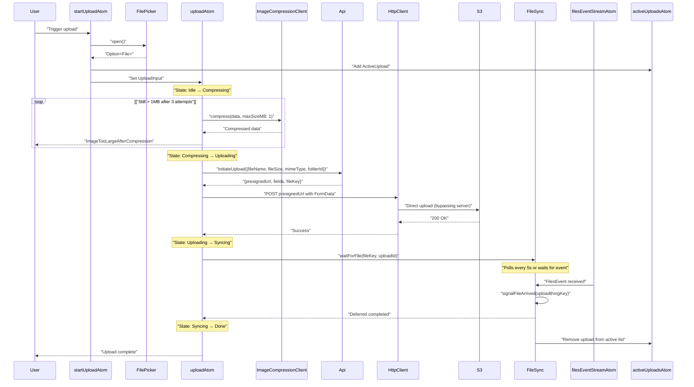
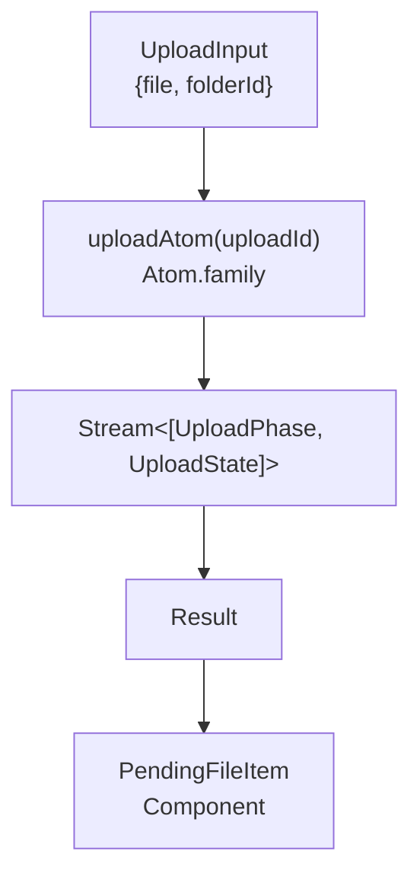
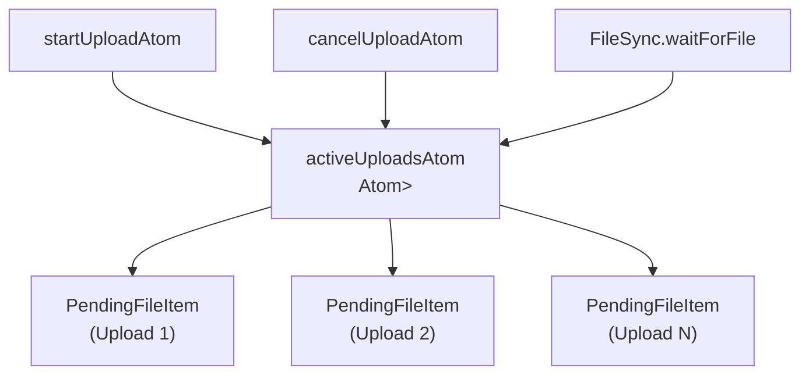
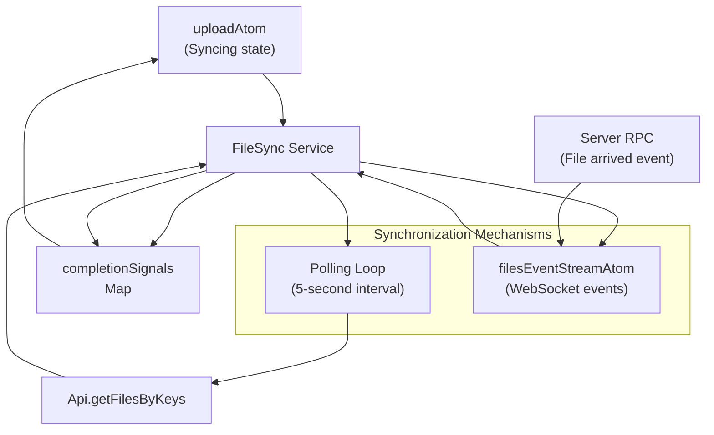
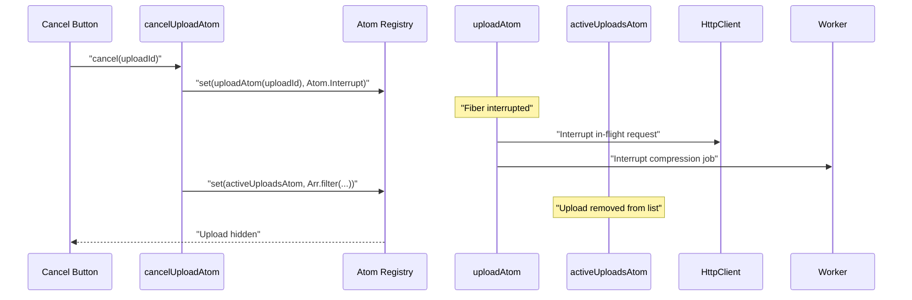
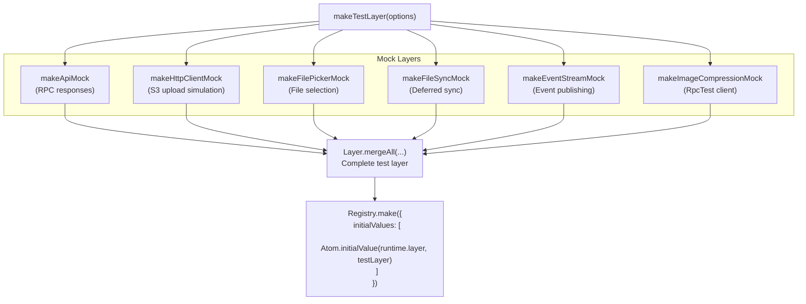

# File Upload System

> **Relevant source files**
> * [packages/client/src/routes/files/-files/file-item/pending-file-item.tsx](https://github.com/lucas-barake/effect-file-manager/blob/28eedd82/packages/client/src/routes/files/-files/file-item/pending-file-item.tsx)
> * [packages/client/src/routes/files/-files/files-atoms/files-atoms.test.ts](https://github.com/lucas-barake/effect-file-manager/blob/28eedd82/packages/client/src/routes/files/-files/files-atoms/files-atoms.test.ts)
> * [packages/client/src/routes/files/-files/files-atoms/files-atoms.tsx](https://github.com/lucas-barake/effect-file-manager/blob/28eedd82/packages/client/src/routes/files/-files/files-atoms/files-atoms.tsx)

## Purpose and Scope

This document provides an architectural overview of the file upload pipeline, the most critical system in the Effect File Manager application. The upload system handles client-side file selection, optional image compression, direct upload to S3-compatible storage via presigned URLs, and synchronization with the backend.

The file upload system consists of four major subsystems, each documented in detail in their respective pages:

* **Upload State Machine** - See [Upload State Machine](/lucas-barake/effect-file-manager/4.1-upload-state-machine) for details on state transitions and the `uploadAtom` implementation
* **Image Compression** - See [Image Compression System](/lucas-barake/effect-file-manager/4.2-image-compression-system) for the web worker-based compression pipeline
* **UploadThing Integration** - See [UploadThing Integration](/lucas-barake/effect-file-manager/4.3-uploadthing-integration) for presigned URL acquisition and direct S3 uploads
* **Upload UI** - See [Upload UI Component](/lucas-barake/effect-file-manager/4.4-upload-ui-component) for the `PendingFileItem` component that displays upload progress

For information about state management patterns used throughout the upload system, see [State Management with Effect Atoms](/lucas-barake/effect-file-manager/5-state-management-with-effect-atoms).

---

## System Overview

The file upload system is a multi-phase pipeline that transforms a user's file selection into a persisted file record in the database. The system is designed around several key architectural principles:

| Principle | Implementation |
| --- | --- |
| **Client-side processing** | Images larger than 1MB are compressed in a web worker before upload |
| **Direct upload pattern** | Files upload directly to S3 storage, not through the server |
| **State machine architecture** | Each upload progresses through discrete, observable states |
| **Asynchronous synchronization** | Upload completion is decoupled from backend processing |
| **Concurrent upload support** | Multiple uploads execute independently without interference |

The entire upload lifecycle is managed through the `uploadAtom` family, which creates an isolated Effect stream for each upload. This stream progresses through phases (Compressing → Uploading → Syncing → Done) and emits progress updates that drive the UI.

**Sources:** [packages/client/src/routes/files/-files/files-atoms/files-atoms.tsx L1-L781](https://github.com/lucas-barake/effect-file-manager/blob/28eedd82/packages/client/src/routes/files/-files/files-atoms/files-atoms.tsx#L1-L781)

---

## Service Architecture

The upload system is composed of five Effect services that handle different aspects of the upload pipeline:



**Service Responsibilities**

| Service | Purpose | Key Methods |
| --- | --- | --- |
| `FilePicker` | Creates and manages an `<input type="file">` element for file selection | `open()` - Returns `Effect<Option<File>>` |
| `Api` | Wraps RPC client with typed methods for file operations | `initiateUpload()` - Obtains presigned URL from server |
| `ImageCompressionClient` | Communicates with web worker for off-thread image processing | `compress()` - Reduces image size iteratively |
| `FileSync` | Coordinates upload completion between client and server | `waitForFile()` - Blocks until backend confirms file availability |
| `HttpClient` | Performs direct HTTP upload to S3 with retry logic | (Provided by `@effect/platform`) |

Each service is defined using `Effect.Service<T>()` pattern, enabling dependency injection and comprehensive testing with mock layers.

**Sources:** [packages/client/src/routes/files/-files/files-atoms/files-atoms.tsx L40-L245](https://github.com/lucas-barake/effect-file-manager/blob/28eedd82/packages/client/src/routes/files/-files/files-atoms/files-atoms.tsx#L40-L245)

---

## Upload Flow Architecture

The following diagram maps the complete upload flow from user interaction to database persistence, showing state transitions and service interactions:



**Flow Phases:**

1. **Initiation (startUploadAtom)** - Lines [407-436](https://github.com/lucas-barake/effect-file-manager/blob/28eedd82/407-436)  handle file selection and create a new upload entry
2. **Idle State** - Lines [289-305](https://github.com/lucas-barake/effect-file-manager/blob/28eedd82/289-305)  determine whether compression is needed based on file size and type
3. **Compression** - Lines [307-351](https://github.com/lucas-barake/effect-file-manager/blob/28eedd82/307-351)  iteratively compress images up to 3 times targeting 1MB
4. **Upload** - Lines [353-373](https://github.com/lucas-barake/effect-file-manager/blob/28eedd82/353-373)  obtain presigned URL and perform direct S3 upload
5. **Synchronization** - Lines [375-381](https://github.com/lucas-barake/effect-file-manager/blob/28eedd82/375-381)  wait for backend confirmation via `FileSync`
6. **Completion** - Lines [383-385](https://github.com/lucas-barake/effect-file-manager/blob/28eedd82/383-385)  transition to done state

**Sources:** [packages/client/src/routes/files/-files/files-atoms/files-atoms.tsx L273-L397](https://github.com/lucas-barake/effect-file-manager/blob/28eedd82/packages/client/src/routes/files/-files/files-atoms/files-atoms.tsx#L273-L397)

 [packages/client/src/routes/files/-files/files-atoms/files-atoms.tsx L407-L436](https://github.com/lucas-barake/effect-file-manager/blob/28eedd82/packages/client/src/routes/files/-files/files-atoms/files-atoms.tsx#L407-L436)

---

## State Machine Implementation

The upload state machine is implemented as an Effect stream that unfolds through state transitions. The core types define the machine's structure:

```

```

**State vs Phase Distinction**

| Concept | Purpose | Visibility |
| --- | --- | --- |
| `UploadState` | Internal state with payload data (input file, keys, etc.) | Used within `makeUploadStream` function |
| `UploadPhase` | External observable phase without sensitive data | Emitted to `Result<UploadPhase>` for UI consumption |

The `uploadAtom` family function creates a separate atom for each upload ID, returning an atom bound to an Effect stream:



The `makeUploadStream` function implements the state transition logic using `Stream.unfoldEffect`, which repeatedly applies the `transition` function to the current state, emitting `[UploadPhase, UploadState]` tuples until `Option.none()` is returned.

**Key Implementation Details:**

* **Transition Function** - Lines [286-394](https://github.com/lucas-barake/effect-file-manager/blob/28eedd82/286-394)  - Pattern matches on `state._tag` and returns `Option.some([phase, nextState])` for each valid transition
* **Error Recovery** - Lines [388-394](https://github.com/lucas-barake/effect-file-manager/blob/28eedd82/388-394)  - Catches specific Effect errors and converts them to fatal defects using `Effect.die`
* **Unfold Pattern** - Line [396](https://github.com/lucas-barake/effect-file-manager/blob/28eedd82/396)  - Uses `Stream.unfoldEffect` starting from `UploadState.Idle({ input })`
* **Atom Binding** - Lines [399-401](https://github.com/lucas-barake/effect-file-manager/blob/28eedd82/399-401)  - Wraps stream in `runtime.fn` to create a settable atom

**Sources:** [packages/client/src/routes/files/-files/files-atoms/files-atoms.tsx L100-L128](https://github.com/lucas-barake/effect-file-manager/blob/28eedd82/packages/client/src/routes/files/-files/files-atoms/files-atoms.tsx#L100-L128)

 [packages/client/src/routes/files/-files/files-atoms/files-atoms.tsx L273-L401](https://github.com/lucas-barake/effect-file-manager/blob/28eedd82/packages/client/src/routes/files/-files/files-atoms/files-atoms.tsx#L273-L401)

---

## Active Uploads Tracking

The `activeUploadsAtom` maintains a list of in-progress uploads for UI rendering. This atom serves as an ephemeral cache separate from the persistent `filesAtom`.



**ActiveUpload Type:**

```

```

**Lifecycle Management:**

| Event | Action | Location |
| --- | --- | --- |
| Upload start | `Arr.append(registry.get(activeUploadsAtom), newUpload)` | [files-atoms.tsx L420-L429](https://github.com/lucas-barake/effect-file-manager/blob/28eedd82/files-atoms.tsx#L420-L429) |
| Upload cancel | `Arr.filter(registry.get(activeUploadsAtom), u => u.id !== uploadId)` | [files-atoms.tsx L447-L450](https://github.com/lucas-barake/effect-file-manager/blob/28eedd82/files-atoms.tsx#L447-L450) |
| Upload complete | `Arr.filter(registry.get(activeUploadsAtom), u => u.id !== uploadId)` | [files-atoms.tsx L165-L169](https://github.com/lucas-barake/effect-file-manager/blob/28eedd82/files-atoms.tsx#L165-L169) |

The active uploads list is purely for UI purposes—it does not affect the upload logic itself. Each `PendingFileItem` component observes both `activeUploadsAtom` (for metadata) and its specific `uploadAtom(upload.id)` (for phase/progress).

**Sources:** [packages/client/src/routes/files/-files/files-atoms/files-atoms.tsx L267-L268](https://github.com/lucas-barake/effect-file-manager/blob/28eedd82/packages/client/src/routes/files/-files/files-atoms/files-atoms.tsx#L267-L268)

 [packages/client/src/routes/files/-files/files-atoms/files-atoms.tsx L407-L436](https://github.com/lucas-barake/effect-file-manager/blob/28eedd82/packages/client/src/routes/files/-files/files-atoms/files-atoms.tsx#L407-L436)

 [packages/client/src/routes/files/-files/files-atoms/files-atoms.tsx L442-L452](https://github.com/lucas-barake/effect-file-manager/blob/28eedd82/packages/client/src/routes/files/-files/files-atoms/files-atoms.tsx#L442-L452)

---

## File Synchronization Strategy

The `FileSync` service solves a distributed systems challenge: after uploading to S3, the file is not immediately queryable from the backend database. The synchronization mechanism uses a dual approach combining polling and event streams.

**FileSync Architecture:**



**Dual Mechanism Rationale:**

| Mechanism | Purpose | Implementation |
| --- | --- | --- |
| **WebSocket Events** | Ideal case - immediate notification when backend processes file | Lines [700-719](https://github.com/lucas-barake/effect-file-manager/blob/28eedd82/700-719) <br>  - `filesEventStreamAtom` handler |
| **Polling Loop** | Fallback - handles missed events, connection drops, or delays | Lines [171-191](https://github.com/lucas-barake/effect-file-manager/blob/28eedd82/171-191) <br>  - Scoped fiber that runs every 5 seconds |

**Synchronization Flow:**

1. **Wait Registration** - Lines [156-169](https://github.com/lucas-barake/effect-file-manager/blob/28eedd82/156-169)  - `waitForFile` creates a `Deferred<void>` and stores it in `completionSignals` map with the UploadThing key
2. **Polling Check** - Lines [173-189](https://github.com/lucas-barake/effect-file-manager/blob/28eedd82/173-189)  - Every 5 seconds, queries `Api.getFilesByKeys` for files added more than 5 seconds ago (to avoid premature queries)
3. **Event Handler** - Lines [704-718](https://github.com/lucas-barake/effect-file-manager/blob/28eedd82/704-718)  - When `FilesEvent` arrives via WebSocket, calls `signalFileArrived` which completes the deferred
4. **Signal Completion** - Lines [149-154](https://github.com/lucas-barake/effect-file-manager/blob/28eedd82/149-154)  - `signalFileArrived` calls `Deferred.unsafeDone(entry.deferred, Exit.void)` and removes entry from map
5. **Cleanup** - Lines [165-169](https://github.com/lucas-barake/effect-file-manager/blob/28eedd82/165-169)  - After deferred completes, removes upload from `activeUploadsAtom`

**Performance Considerations:**

* Deferreds are stored with `addedAt` timestamp to implement the 5-second grace period
* Polling only queries files that are "stale" (older than 5 seconds)
* Map cleanup prevents memory leaks from cancelled or failed uploads

**Sources:** [packages/client/src/routes/files/-files/files-atoms/files-atoms.tsx L132-L200](https://github.com/lucas-barake/effect-file-manager/blob/28eedd82/packages/client/src/routes/files/-files/files-atoms/files-atoms.tsx#L132-L200)

 [packages/client/src/routes/files/-files/files-atoms/files-atoms.tsx L700-L719](https://github.com/lucas-barake/effect-file-manager/blob/28eedd82/packages/client/src/routes/files/-files/files-atoms/files-atoms.tsx#L700-L719)

---

## Error Handling

The upload system defines a custom error type for the common failure case of images that cannot be compressed below the size threshold:

```

```

**Error Categories and Handling:**

| Error Type | Cause | Handling | Location |
| --- | --- | --- | --- |
| `ImageTooLargeAfterCompression` | Image still > 1MB after 3 compression attempts | Displayed to user with size info | [files-atoms.tsx L335-L341](https://github.com/lucas-barake/effect-file-manager/blob/28eedd82/files-atoms.tsx#L335-L341) |
| `Unauthorized` | RPC authentication failure | Converted to fatal defect (`Effect.die`) | [files-atoms.tsx L389](https://github.com/lucas-barake/effect-file-manager/blob/28eedd82/files-atoms.tsx#L389-L389) |
| `RpcClientError` | RPC communication error | Converted to fatal defect | [files-atoms.tsx L390](https://github.com/lucas-barake/effect-file-manager/blob/28eedd82/files-atoms.tsx#L390-L390) |
| `RequestError` | HTTP request failed to initiate | Converted to fatal defect | [files-atoms.tsx L391](https://github.com/lucas-barake/effect-file-manager/blob/28eedd82/files-atoms.tsx#L391-L391) |
| `ResponseError` | S3 upload HTTP error | Converted to fatal defect | [files-atoms.tsx L392](https://github.com/lucas-barake/effect-file-manager/blob/28eedd82/files-atoms.tsx#L392-L392) |
| `Atom.Interrupt` | User cancellation | Result state becomes `Result.isInterrupted(result)` | [pending-file-item.tsx L41](https://github.com/lucas-barake/effect-file-manager/blob/28eedd82/pending-file-item.tsx#L41-L41) |

**Error Display in UI:**

The `PendingFileItem` component extracts error information from the `Result` type:

```

```

The component distinguishes between `Result.isInterrupted` (user cancelled) and `Result.isFailure` (actual error). Only failures are displayed as errors with the destructive styling.

**Sources:** [packages/client/src/routes/files/-files/files-atoms/files-atoms.tsx L92-L98](https://github.com/lucas-barake/effect-file-manager/blob/28eedd82/packages/client/src/routes/files/-files/files-atoms/files-atoms.tsx#L92-L98)

 [packages/client/src/routes/files/-files/files-atoms/files-atoms.tsx L388-L394](https://github.com/lucas-barake/effect-file-manager/blob/28eedd82/packages/client/src/routes/files/-files/files-atoms/files-atoms.tsx#L388-L394)

 [packages/client/src/routes/files/-files/file-item/pending-file-item.tsx L40-L62](https://github.com/lucas-barake/effect-file-manager/blob/28eedd82/packages/client/src/routes/files/-files/file-item/pending-file-item.tsx#L40-L62)

---

## Upload Cancellation

The cancellation mechanism leverages Effect's interruption system. Setting `Atom.Interrupt` on an upload atom triggers fiber interruption, which propagates through the entire Effect chain.

**Cancellation Flow:**



**Implementation Details:**

* **Cancellation Function** - Lines [442-452](https://github.com/lucas-barake/effect-file-manager/blob/28eedd82/442-452)  - `cancelUploadAtom` sets `Atom.Interrupt` and filters the upload from `activeUploadsAtom`
* **Interrupt Propagation** - Effect's fiber system automatically cancels all operations in the stream (HTTP requests, web worker jobs, etc.)
* **UI Availability** - Cancel button is only shown during `Compressing` and `Uploading` phases (lines [97-101](https://github.com/lucas-barake/effect-file-manager/blob/28eedd82/97-101)  in `pending-file-item.tsx`)
* **Result State** - After interruption, `Result.isInterrupted(result)` returns `true`, which the UI uses to suppress error display

**Cancellation Boundary:**

Once an upload reaches the `Syncing` phase, cancellation is not allowed because:

1. The file has already been uploaded to S3 (cannot be reverted)
2. The backend is processing the file metadata
3. Allowing cancellation would create inconsistent state between S3 and the database

**Sources:** [packages/client/src/routes/files/-files/files-atoms/files-atoms.tsx L442-L452](https://github.com/lucas-barake/effect-file-manager/blob/28eedd82/packages/client/src/routes/files/-files/files-atoms/files-atoms.tsx#L442-L452)

 [packages/client/src/routes/files/-files/file-item/pending-file-item.tsx L36-L104](https://github.com/lucas-barake/effect-file-manager/blob/28eedd82/packages/client/src/routes/files/-files/file-item/pending-file-item.tsx#L36-L104)

---

## Testing Strategy

The upload system tests use Effect's mock layers to provide test implementations of all services, enabling deterministic, isolated testing without network requests or web workers.

**Mock Layer Composition:**



**Key Test Patterns:**

| Pattern | Purpose | Example |
| --- | --- | --- |
| **Mock call tracking** | Assert that services are called with correct arguments | Lines [52-53](https://github.com/lucas-barake/effect-file-manager/blob/28eedd82/52-53) <br>  - `calls` array in `makeApiMock` |
| **Deferred control** | Manually trigger file arrival events | Lines [133-143](https://github.com/lucas-barake/effect-file-manager/blob/28eedd82/133-143) <br>  - `triggerFileArrival` function |
| **Registry-based testing** | Mount atoms, set values, assert on results | Lines [255-262](https://github.com/lucas-barake/effect-file-manager/blob/28eedd82/255-262) <br>  - Create registry, mount atom, set value |
| **Concurrent upload isolation** | Verify multiple uploads don't interfere | Lines [314-357](https://github.com/lucas-barake/effect-file-manager/blob/28eedd82/314-357) <br>  - Start two uploads, cancel one, verify the other continues |
| **Interruption testing** | Verify cancellation mechanism works correctly | Lines [287-312](https://github.com/lucas-barake/effect-file-manager/blob/28eedd82/287-312) <br>  - Set `Atom.Interrupt`, assert `Result.isInterrupted` |
| **Fake timers** | Control time progression for polling tests | Lines [242-248](https://github.com/lucas-barake/effect-file-manager/blob/28eedd82/242-248) <br>  - `vitest.useFakeTimers()` |

**Example Test Structure:**

```

```

The test creates a full dependency graph, mounts the upload atom, triggers the upload, manually signals file arrival, and asserts on the final state—all without hitting real services.

**Sources:** [packages/client/src/routes/files/-files/files-atoms/files-atoms.test.ts L1-L421](https://github.com/lucas-barake/effect-file-manager/blob/28eedd82/packages/client/src/routes/files/-files/files-atoms/files-atoms.test.ts#L1-L421)

 [packages/client/src/routes/files/-files/files-atoms/files-atoms.test.ts L44-L235](https://github.com/lucas-barake/effect-file-manager/blob/28eedd82/packages/client/src/routes/files/-files/files-atoms/files-atoms.test.ts#L44-L235)