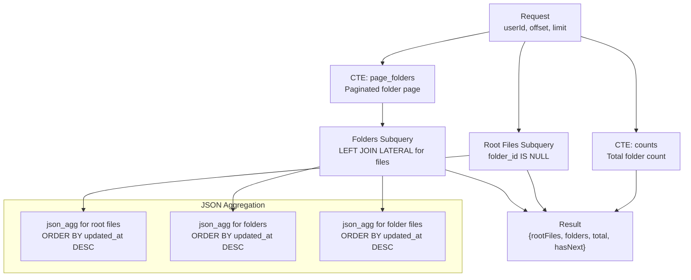
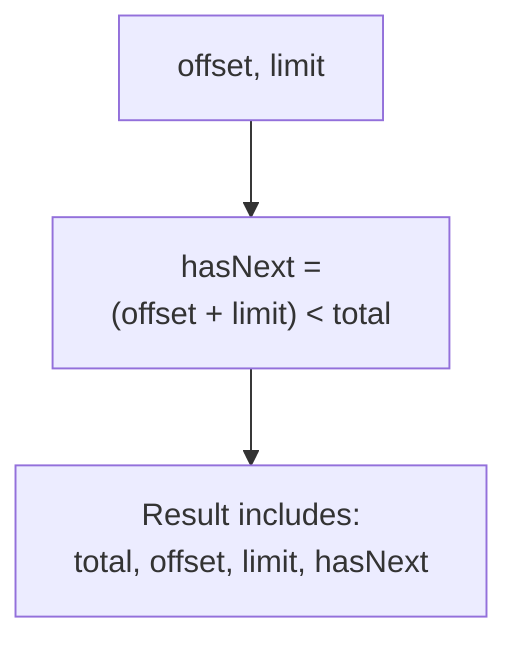
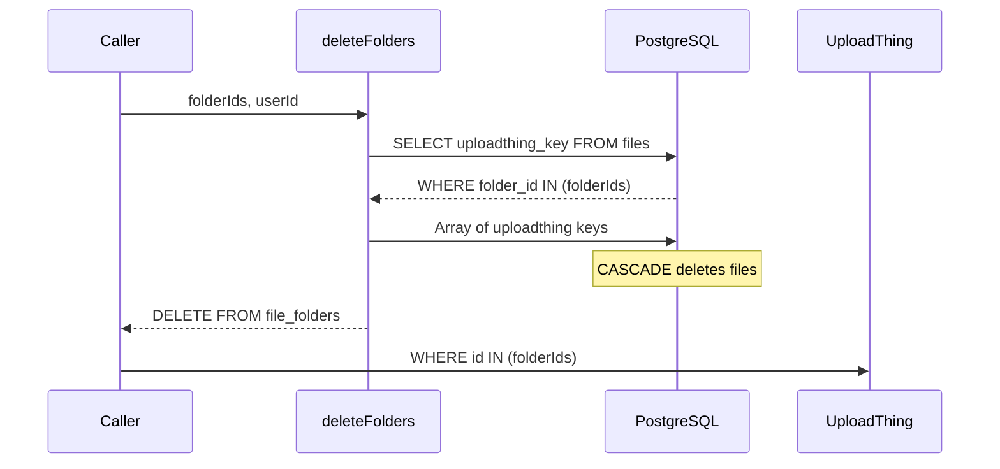
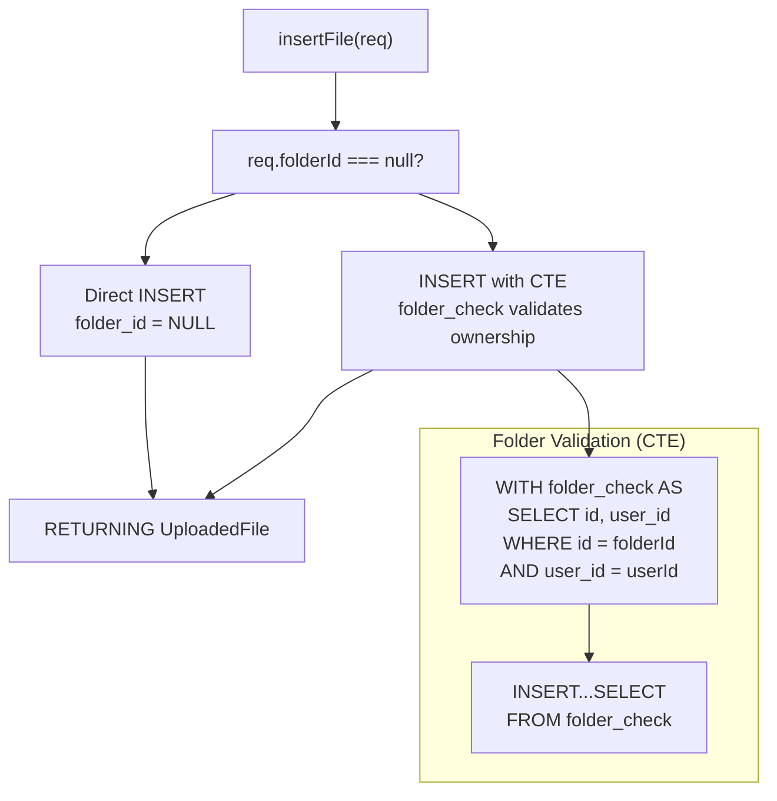
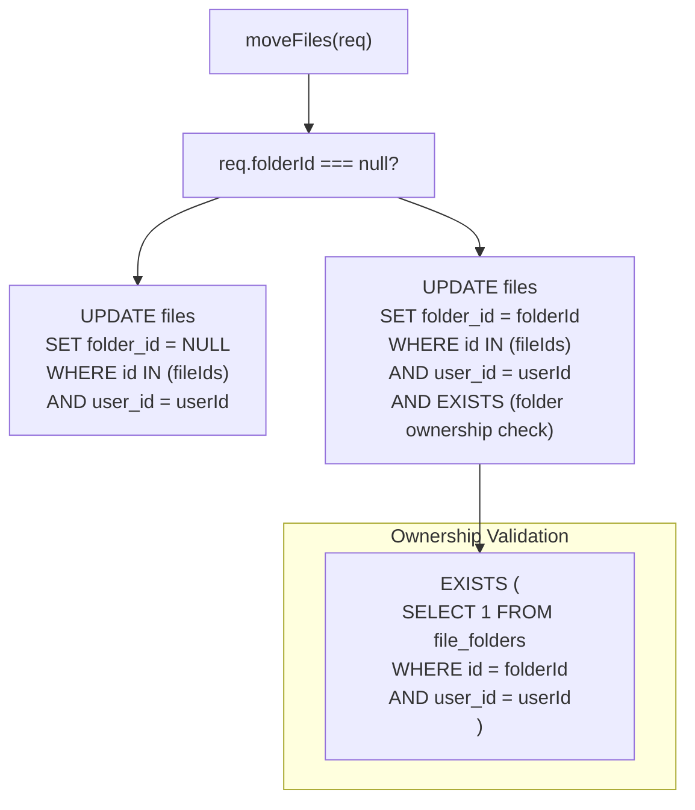
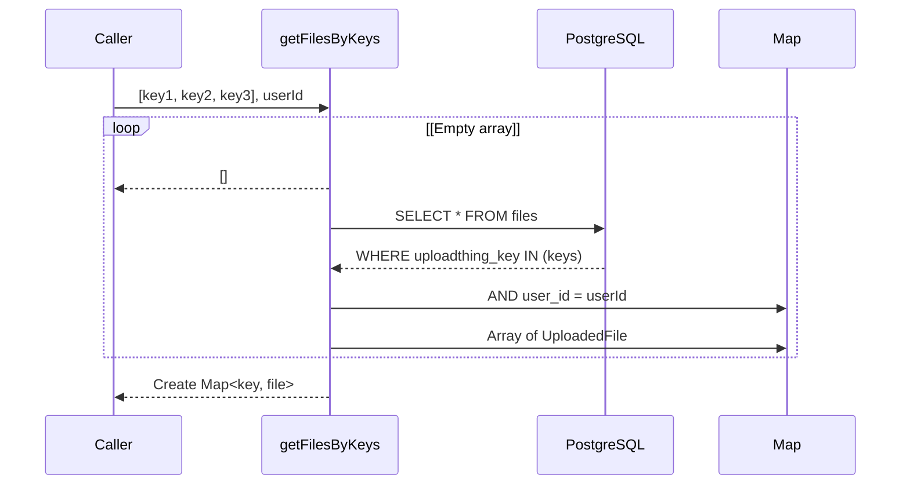
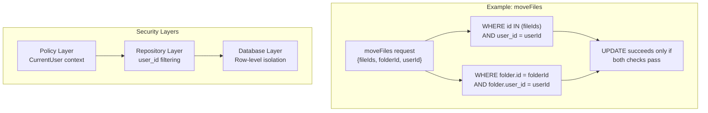
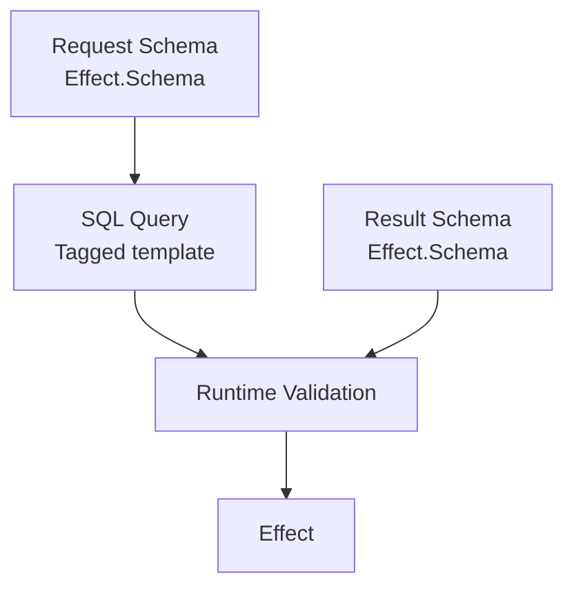

# Files Repository

> **Relevant source files**
> * [packages/server/src/public/files/files-repo.ts](https://github.com/oscaromsn/TalentScore/blob/428ed1eb/packages/server/src/public/files/files-repo.ts)

## Purpose and Scope

The Files Repository (`FilesRepo`) is the data access layer for file and folder operations in TalentScore. This service provides type-safe SQL queries for CRUD operations on files and folders, enforcing multi-tenant isolation and ownership validation at the database level. For the overall file management system architecture, see [File Management System](/oscaromsn/TalentScore/4.5-file-management-system). For the RPC API that consumes this repository, see the server implementation in `packages/server/src/public/files/` directory.

**Sources:** [packages/server/src/public/files/files-repo.ts L1-L476](https://github.com/oscaromsn/TalentScore/blob/428ed1eb/packages/server/src/public/files/files-repo.ts#L1-L476)

---

## Service Architecture

`FilesRepo` is implemented as an Effect Service that depends on the PostgreSQL database layer (`PgLive`). All methods return `Effect` types that include automatic span tracing for observability.

```

```

**Sources:** [packages/server/src/public/files/files-repo.ts L11-L16](https://github.com/oscaromsn/TalentScore/blob/428ed1eb/packages/server/src/public/files/files-repo.ts#L11-L16)

 [packages/server/src/public/files/files-repo.ts L464-L475](https://github.com/oscaromsn/TalentScore/blob/428ed1eb/packages/server/src/public/files/files-repo.ts#L464-L475)

---

## Paginated List Query

The `listPaginated` method implements a complex SQL query using Common Table Expressions (CTEs) to efficiently fetch root-level files and folders with their nested files in a single round-trip.

### Query Structure



### CTE Breakdown

| CTE Name | Purpose | Key Columns |
| --- | --- | --- |
| `counts` | Calculate total folder count for pagination | `total_folders::int` |
| `page_folders` | Select current page of folders | `id, user_id, name, created_at, updated_at` |

### JSON Aggregation Strategy

The query uses `json_agg` with `json_build_object` to construct nested JSON structures directly in PostgreSQL:

1. **Root Files**: Files where `folder_id IS NULL`, aggregated into JSON array ordered by `updated_at DESC`
2. **Folders**: Page of folders from `page_folders` CTE
3. **Folder Files**: For each folder, a `LEFT JOIN LATERAL` subquery aggregates its files into a JSON array

The `COALESCE(..., '[]')` pattern ensures empty arrays instead of `NULL` when no records exist.

**Sources:** [packages/server/src/public/files/files-repo.ts L18-L168](https://github.com/oscaromsn/TalentScore/blob/428ed1eb/packages/server/src/public/files/files-repo.ts#L18-L168)

### Pagination Metadata



The `hasNext` boolean enables infinite scroll patterns by comparing `(offset + limit)` against the total folder count.

**Sources:** [packages/server/src/public/files/files-repo.ts L153-L163](https://github.com/oscaromsn/TalentScore/blob/428ed1eb/packages/server/src/public/files/files-repo.ts#L153-L163)

---

## Folder Management

### Creating Folders

The `insertFolder` method creates a new folder and returns the complete `Folder` record with generated ID and timestamps.

| Parameter | Type | Description |
| --- | --- | --- |
| `userId` | `UserId` | Owner of the folder |
| `name` | `String` | Folder name |

**Returns:** `Folder` with `id`, `name`, `createdAt`, `updatedAt`

**Sources:** [packages/server/src/public/files/files-repo.ts L170-L194](https://github.com/oscaromsn/TalentScore/blob/428ed1eb/packages/server/src/public/files/files-repo.ts#L170-L194)

### Deleting Folders

The `deleteFolders` method implements a two-phase delete:



This pattern enables the caller to clean up external storage after successful database deletion.

**Sources:** [packages/server/src/public/files/files-repo.ts L318-L354](https://github.com/oscaromsn/TalentScore/blob/428ed1eb/packages/server/src/public/files/files-repo.ts#L318-L354)

---

## File Management

### Inserting Files

The `insertFile` method handles two scenarios:

1. **Root-level files** (`folderId === null`): Direct insert without ownership check
2. **Folder files** (`folderId !== null`): Insert with CTE-based ownership validation



The CTE pattern ensures that files can only be inserted into folders owned by the requesting user. If the folder doesn't exist or is owned by another user, the `INSERT...SELECT` returns zero rows.

**Sources:** [packages/server/src/public/files/files-repo.ts L196-L293](https://github.com/oscaromsn/TalentScore/blob/428ed1eb/packages/server/src/public/files/files-repo.ts#L196-L293)

### Deleting Files

The `deleteFiles` method deletes files and returns their UploadThing keys for external cleanup:

```

```

The `userId` filter ensures multi-tenant isolation at the SQL level.

**Sources:** [packages/server/src/public/files/files-repo.ts L295-L316](https://github.com/oscaromsn/TalentScore/blob/428ed1eb/packages/server/src/public/files/files-repo.ts#L295-L316)

### Moving Files

The `moveFiles` method updates the `folder_id` of files, with conditional logic based on the target:

| Target | SQL Logic |
| --- | --- |
| Root level (`folderId === null`) | `UPDATE SET folder_id = NULL` |
| Specific folder | `UPDATE SET folder_id = folderId` with `EXISTS` subquery validating folder ownership |



The `EXISTS` subquery prevents moving files into folders owned by other users.

**Sources:** [packages/server/src/public/files/files-repo.ts L356-L395](https://github.com/oscaromsn/TalentScore/blob/428ed1eb/packages/server/src/public/files/files-repo.ts#L356-L395)

---

## Query by Keys

### Batch File Retrieval

The `getFilesByKeys` method fetches files by their UploadThing keys and returns them in the same order as the input array, with `null` for missing keys.



This method is critical for the upload synchronization flow, where the client polls for files to appear after direct S3 upload.

**Key Implementation Details:**

1. **Empty array optimization**: Returns immediately if input is empty [packages/server/src/public/files/files-repo.ts L402-L404](https://github.com/oscaromsn/TalentScore/blob/428ed1eb/packages/server/src/public/files/files-repo.ts#L402-L404)
2. **Order preservation**: Uses a `Map` to match results back to input order [packages/server/src/public/files/files-repo.ts L431-L435](https://github.com/oscaromsn/TalentScore/blob/428ed1eb/packages/server/src/public/files/files-repo.ts#L431-L435)
3. **Null for missing**: Returns `null` for keys not found in database

**Sources:** [packages/server/src/public/files/files-repo.ts L397-L436](https://github.com/oscaromsn/TalentScore/blob/428ed1eb/packages/server/src/public/files/files-repo.ts#L397-L436)

### Single File Lookup

The `findById` method retrieves a single file by its database ID:

```

```

Returns `SqlError` if the file doesn't exist or belongs to another user.

**Sources:** [packages/server/src/public/files/files-repo.ts L438-L462](https://github.com/oscaromsn/TalentScore/blob/428ed1eb/packages/server/src/public/files/files-repo.ts#L438-L462)

---

## Multi-Tenant Security Model

Every repository method enforces tenant isolation through SQL-level filtering on `user_id`. This ensures that users can only access their own data, even if they somehow obtain valid IDs for other users' resources.



### Security Patterns by Method

| Method | Security Mechanism |
| --- | --- |
| `listPaginated` | Filters folders and files by `user_id` in all CTEs |
| `insertFolder` | Directly inserts with provided `userId` |
| `insertFile` | CTE validates folder ownership before insert (if folderId provided) |
| `deleteFiles` | `WHERE user_id = userId` prevents deleting others' files |
| `deleteFolders` | Joins with folders table to ensure ownership |
| `moveFiles` | `EXISTS` subquery validates destination folder ownership |
| `getFilesByKeys` | `WHERE user_id = userId` filters results |
| `findById` | `WHERE user_id = userId` enforces ownership |

**Sources:** All methods in [packages/server/src/public/files/files-repo.ts L18-L462](https://github.com/oscaromsn/TalentScore/blob/428ed1eb/packages/server/src/public/files/files-repo.ts#L18-L462)

---

## Type Safety and Error Handling

### Effect SQL Schema Integration

All SQL queries use `SqlSchema` helpers for compile-time type safety:



### Schema Composition

The repository uses domain schemas directly:

| Schema | Source | Purpose |
| --- | --- | --- |
| `UserId` | `@example/domain/policy` | User identification |
| `FolderId` | `@example/domain/api/files/files-rpc` | Folder IDs |
| `UploadedFileId` | `@example/domain/api/files/files-rpc` | File IDs |
| `UploadedFile` | `@example/domain/api/files/files-rpc` | File data model |
| `Folder` | `@example/domain/api/files/files-rpc` | Folder data model |
| `Folder.WithUploadedFiles` | `@example/domain/api/files/files-rpc` | Folder with nested files |

**Sources:** [packages/server/src/public/files/files-repo.ts L4-L5](https://github.com/oscaromsn/TalentScore/blob/428ed1eb/packages/server/src/public/files/files-repo.ts#L4-L5)

### Error Handling Strategy

All methods use `.pipe(Effect.orDie)`, which converts SQL errors into defects. This is appropriate for repository operations where SQL errors indicate programmer errors (malformed queries) or infrastructure failures (database down), not recoverable business logic errors.

### Observability

Every method is wrapped with `Effect.withSpan("FilesRepo.methodName")` for distributed tracing integration with OpenTelemetry/Jaeger.

**Example trace spans:**

* `FilesRepo.listPaginated`
* `FilesRepo.insertFile`
* `FilesRepo.deleteFiles`
* `FilesRepo.moveFiles`

**Sources:** All methods include `.pipe(..., Effect.withSpan(...))` [packages/server/src/public/files/files-repo.ts L167-L394](https://github.com/oscaromsn/TalentScore/blob/428ed1eb/packages/server/src/public/files/files-repo.ts#L167-L394)