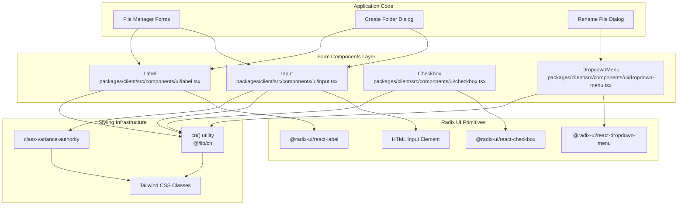
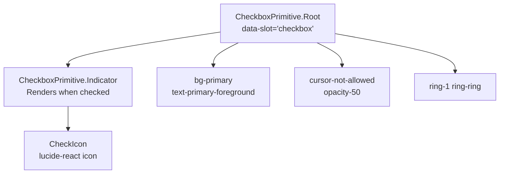
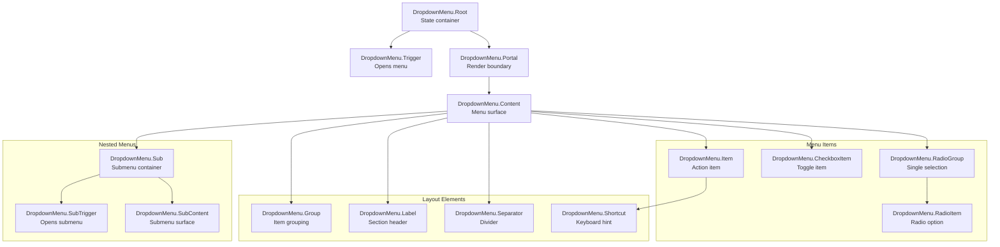
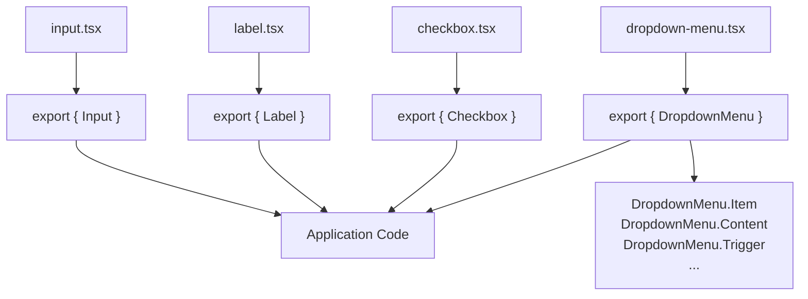

# Form Components

> **Relevant source files**
> * [packages/client/src/components/ui/checkbox.tsx](https://github.com/lucas-barake/effect-file-manager/blob/28eedd82/packages/client/src/components/ui/checkbox.tsx)
> * [packages/client/src/components/ui/dropdown-menu.tsx](https://github.com/lucas-barake/effect-file-manager/blob/28eedd82/packages/client/src/components/ui/dropdown-menu.tsx)
> * [packages/client/src/components/ui/input.tsx](https://github.com/lucas-barake/effect-file-manager/blob/28eedd82/packages/client/src/components/ui/input.tsx)
> * [packages/client/src/components/ui/label.tsx](https://github.com/lucas-barake/effect-file-manager/blob/28eedd82/packages/client/src/components/ui/label.tsx)

## Purpose and Scope

This document details the form-specific UI components in the client application, including `Input`, `Label`, `Checkbox`, and `DropdownMenu`. These components are built as thin wrappers around Radix UI primitives with Tailwind CSS styling applied. They provide accessible, composable form elements used throughout the application for user input and selection.

For general UI components (buttons, dialogs, cards, etc.), see [UI Component Library](/lucas-barake/effect-file-manager/7.1-ui-component-library). For the underlying styling approach and theming system, see [Styling System](/lucas-barake/effect-file-manager/7.2-styling-system).

---

## Architecture Overview

All form components follow a consistent architectural pattern:

1. **Radix UI Foundation**: Each component wraps a corresponding Radix UI primitive (`@radix-ui/react-*`)
2. **Tailwind Styling**: Design tokens and utility classes are applied via the `cn()` utility
3. **TypeScript Forwarding**: Components forward refs and props using `React.ComponentPropsWithoutRef` and `React.forwardRef`
4. **Data Attributes**: Components expose `data-slot` attributes for testing and styling hooks

### Component Dependency Structure



**Sources:** [packages/client/src/components/ui/input.tsx](https://github.com/lucas-barake/effect-file-manager/blob/28eedd82/packages/client/src/components/ui/input.tsx)

 [packages/client/src/components/ui/label.tsx](https://github.com/lucas-barake/effect-file-manager/blob/28eedd82/packages/client/src/components/ui/label.tsx)

 [packages/client/src/components/ui/checkbox.tsx](https://github.com/lucas-barake/effect-file-manager/blob/28eedd82/packages/client/src/components/ui/checkbox.tsx)

 [packages/client/src/components/ui/dropdown-menu.tsx](https://github.com/lucas-barake/effect-file-manager/blob/28eedd82/packages/client/src/components/ui/dropdown-menu.tsx)

---

## Input Component

The `Input` component is a styled wrapper around the native HTML `<input>` element with integrated focus states, validation styling, and file input support.

### Implementation Details

Located at [packages/client/src/components/ui/input.tsx L1-L24](https://github.com/lucas-barake/effect-file-manager/blob/28eedd82/packages/client/src/components/ui/input.tsx#L1-L24)

 the component uses `class-variance-authority` for variant management.

| Property | Type | Description |
| --- | --- | --- |
| `className` | `string` | Additional Tailwind classes to merge |
| `type` | `string` | HTML input type (text, email, file, etc.) |
| `...props` | `React.ComponentProps<"input">` | All standard HTML input attributes |

### Styling Variants

The component defines `inputVariants` using `cva()` at [packages/client/src/components/ui/input.tsx L5-L7](https://github.com/lucas-barake/effect-file-manager/blob/28eedd82/packages/client/src/components/ui/input.tsx#L5-L7)

 which includes:

* **Focus states**: `focus-visible:ring-1 focus-visible:ring-ring`
* **Disabled states**: `disabled:pointer-events-none disabled:cursor-not-allowed disabled:opacity-50`
* **File input styling**: Custom button appearance for file inputs via `file:` pseudo-element
* **Placeholder styling**: Muted text color via `placeholder:text-muted-foreground`
* **Selection styling**: Primary color background when text is selected

### Key Features

* **Shadow & Border**: Subtle shadow (`shadow-sm`) and border (`border-input`) for depth
* **Transition**: Smooth transitions on `color` and `box-shadow` properties
* **Responsive Text**: Base text size on mobile, smaller on `md` breakpoint
* **Data Attribute**: Exposes `data-slot="input"` for targeted styling/testing

**Sources:** [packages/client/src/components/ui/input.tsx L1-L24](https://github.com/lucas-barake/effect-file-manager/blob/28eedd82/packages/client/src/components/ui/input.tsx#L1-L24)

---

## Label Component

The `Label` component wraps `@radix-ui/react-label` and provides semantic association between form labels and inputs, with optional required field indicators.

### Implementation Details

Located at [packages/client/src/components/ui/label.tsx L1-L28](https://github.com/lucas-barake/effect-file-manager/blob/28eedd82/packages/client/src/components/ui/label.tsx#L1-L28)

 the component extends Radix's `LabelPrimitive.Root` with custom props.

| Property | Type | Default | Description |
| --- | --- | --- | --- |
| `required` | `boolean` | `false` | Displays red asterisk when true |
| `className` | `string` | - | Additional Tailwind classes |
| `...props` | `React.ComponentProps<typeof LabelPrimitive.Root>` | - | All Radix Label props |

### Required Field Indicator

When `required={true}`, the component appends a red asterisk at [packages/client/src/components/ui/label.tsx L22](https://github.com/lucas-barake/effect-file-manager/blob/28eedd82/packages/client/src/components/ui/label.tsx#L22-L22)

:

```xml
{required && <span className="ml-0.5 text-red-500">*</span>}
```

### Accessibility Features

* **Group Disabled State**: Responds to `group-data-[disabled=true]` for coordinated disabling
* **Peer Disabled State**: Uses `peer-disabled:` variants to style based on associated input state
* **User Select**: `select-none` prevents accidental text selection of labels

**Sources:** [packages/client/src/components/ui/label.tsx L1-L28](https://github.com/lucas-barake/effect-file-manager/blob/28eedd82/packages/client/src/components/ui/label.tsx#L1-L28)

---

## Checkbox Component

The `Checkbox` component wraps `@radix-ui/react-checkbox` with accessible state management and visual feedback.

### Implementation Details

Located at [packages/client/src/components/ui/checkbox.tsx L1-L24](https://github.com/lucas-barake/effect-file-manager/blob/28eedd82/packages/client/src/components/ui/checkbox.tsx#L1-L24)

 the component uses `React.forwardRef` for ref forwarding to the underlying Radix primitive.

### Component Structure



**Sources:** [packages/client/src/components/ui/checkbox.tsx L1-L24](https://github.com/lucas-barake/effect-file-manager/blob/28eedd82/packages/client/src/components/ui/checkbox.tsx#L1-L24)

### Styling Features

| State | Classes Applied |
| --- | --- |
| Default | `border border-primary shadow rounded-sm` |
| Checked | `bg-primary text-primary-foreground` |
| Focused | `focus-visible:ring-1 focus-visible:ring-ring` |
| Disabled | `disabled:cursor-not-allowed disabled:opacity-50` |

### Visual Indicator

The check icon is rendered inside `CheckboxPrimitive.Indicator` at [packages/client/src/components/ui/checkbox.tsx L18-L20](https://github.com/lucas-barake/effect-file-manager/blob/28eedd82/packages/client/src/components/ui/checkbox.tsx#L18-L20)

 which automatically handles visibility based on the checked state. The `CheckIcon` from `lucide-react` is sized to `h-4 w-4`.

**Sources:** [packages/client/src/components/ui/checkbox.tsx L6-L23](https://github.com/lucas-barake/effect-file-manager/blob/28eedd82/packages/client/src/components/ui/checkbox.tsx#L6-L23)

---

## DropdownMenu Component

The `DropdownMenu` is a comprehensive component system built on `@radix-ui/react-dropdown-menu`, providing context menus, action menus, and selection controls. It consists of multiple sub-components composed together.

### Component Architecture



**Sources:** [packages/client/src/components/ui/dropdown-menu.tsx L1-L229](https://github.com/lucas-barake/effect-file-manager/blob/28eedd82/packages/client/src/components/ui/dropdown-menu.tsx#L1-L229)

### Core Components

Located at [packages/client/src/components/ui/dropdown-menu.tsx](https://github.com/lucas-barake/effect-file-manager/blob/28eedd82/packages/client/src/components/ui/dropdown-menu.tsx)

 the module exports an `Object.assign`-based API at [packages/client/src/components/ui/dropdown-menu.tsx L213-L228](https://github.com/lucas-barake/effect-file-manager/blob/28eedd82/packages/client/src/components/ui/dropdown-menu.tsx#L213-L228)

 for dot-notation composition.

#### DropdownMenu.Root

Entry point component wrapping `DropdownMenuPrimitive.Root` at [packages/client/src/components/ui/dropdown-menu.tsx L6-L10](https://github.com/lucas-barake/effect-file-manager/blob/28eedd82/packages/client/src/components/ui/dropdown-menu.tsx#L6-L10)

 Manages open/close state and provides context to children.

#### DropdownMenu.Trigger

Button or element that opens the menu, defined at [packages/client/src/components/ui/dropdown-menu.tsx L18-L22](https://github.com/lucas-barake/effect-file-manager/blob/28eedd82/packages/client/src/components/ui/dropdown-menu.tsx#L18-L22)

 Accepts all standard Radix Trigger props.

#### DropdownMenu.Content

The floating menu surface, implemented at [packages/client/src/components/ui/dropdown-menu.tsx L24-L42](https://github.com/lucas-barake/effect-file-manager/blob/28eedd82/packages/client/src/components/ui/dropdown-menu.tsx#L24-L42)

 Includes sophisticated animations:

| Animation State | Classes |
| --- | --- |
| Opening | `animate-in fade-in-0 zoom-in-95 slide-in-from-{direction}-2` |
| Closing | `animate-out fade-out-0 zoom-out-95` |

The `sideOffset` defaults to `4` pixels for spacing from the trigger.

### Menu Items

#### DropdownMenu.Item

Standard action item at [packages/client/src/components/ui/dropdown-menu.tsx L50-L71](https://github.com/lucas-barake/effect-file-manager/blob/28eedd82/packages/client/src/components/ui/dropdown-menu.tsx#L50-L71)

 with two variants:

| Variant | Applied Classes |
| --- | --- |
| `default` | Standard hover state with `focus:bg-accent` |
| `destructive` | Red text (`text-red-500`) with destructive background on hover |

The `inset` prop adds left padding (`data-[inset]:pl-8`) for alignment with items that have icons.

#### DropdownMenu.CheckboxItem

Toggle item at [packages/client/src/components/ui/dropdown-menu.tsx L73-L97](https://github.com/lucas-barake/effect-file-manager/blob/28eedd82/packages/client/src/components/ui/dropdown-menu.tsx#L73-L97)

 with a check icon indicator. The indicator is positioned absolutely at the left edge ([packages/client/src/components/ui/dropdown-menu.tsx L89-L93](https://github.com/lucas-barake/effect-file-manager/blob/28eedd82/packages/client/src/components/ui/dropdown-menu.tsx#L89-L93)

):

```xml
<span className="pointer-events-none absolute left-2 flex size-3.5 items-center justify-center">
  <DropdownMenuPrimitive.ItemIndicator>
    <CheckIcon className="size-4" />
  </DropdownMenuPrimitive.ItemIndicator>
</span>
```

#### DropdownMenu.RadioGroup and RadioItem

Radio selection pattern implemented at [packages/client/src/components/ui/dropdown-menu.tsx L99-L127](https://github.com/lucas-barake/effect-file-manager/blob/28eedd82/packages/client/src/components/ui/dropdown-menu.tsx#L99-L127)

 The `RadioItem` displays a filled circle indicator using `CircleIcon` at [packages/client/src/components/ui/dropdown-menu.tsx L119-L123](https://github.com/lucas-barake/effect-file-manager/blob/28eedd82/packages/client/src/components/ui/dropdown-menu.tsx#L119-L123)

### Layout Components

| Component | Purpose | Key Classes |
| --- | --- | --- |
| `Label` | Section headers | `font-semibold px-2 py-1.5` |
| `Separator` | Visual dividers | `h-px bg-border -mx-1 my-1` |
| `Group` | Logical grouping | No specific styling |
| `Shortcut` | Keyboard hints | `ml-auto text-xs text-muted-foreground` |

Defined at [packages/client/src/components/ui/dropdown-menu.tsx L129-L167](https://github.com/lucas-barake/effect-file-manager/blob/28eedd82/packages/client/src/components/ui/dropdown-menu.tsx#L129-L167)

### Nested Submenus

Submenus are created using three components at [packages/client/src/components/ui/dropdown-menu.tsx L169-L211](https://github.com/lucas-barake/effect-file-manager/blob/28eedd82/packages/client/src/components/ui/dropdown-menu.tsx#L169-L211)

:

1. **DropdownMenu.Sub**: Container for submenu state
2. **DropdownMenu.SubTrigger**: Trigger with right chevron icon
3. **DropdownMenu.SubContent**: The submenu surface with similar animations to main content

The `SubTrigger` automatically appends `ChevronRightIcon` at [packages/client/src/components/ui/dropdown-menu.tsx L192](https://github.com/lucas-barake/effect-file-manager/blob/28eedd82/packages/client/src/components/ui/dropdown-menu.tsx#L192-L192)

 to indicate the submenu.

**Sources:** [packages/client/src/components/ui/dropdown-menu.tsx L1-L229](https://github.com/lucas-barake/effect-file-manager/blob/28eedd82/packages/client/src/components/ui/dropdown-menu.tsx#L1-L229)

---

## Component Export Pattern

All form components use a consistent export pattern at the end of their respective files:



**Sources:** [packages/client/src/components/ui/input.tsx L23](https://github.com/lucas-barake/effect-file-manager/blob/28eedd82/packages/client/src/components/ui/input.tsx#L23-L23)

 [packages/client/src/components/ui/label.tsx L27](https://github.com/lucas-barake/effect-file-manager/blob/28eedd82/packages/client/src/components/ui/label.tsx#L27-L27)

 [packages/client/src/components/ui/checkbox.tsx L23](https://github.com/lucas-barake/effect-file-manager/blob/28eedd82/packages/client/src/components/ui/checkbox.tsx#L23-L23)

 [packages/client/src/components/ui/dropdown-menu.tsx L213-L228](https://github.com/lucas-barake/effect-file-manager/blob/28eedd82/packages/client/src/components/ui/dropdown-menu.tsx#L213-L228)

The `DropdownMenu` uses a unique `Object.assign` pattern to create a composite API with dot-notation access to all sub-components, avoiding namespace pollution while maintaining ergonomic usage.

---

## Usage Patterns

### Form Field Composition

Form components are typically composed together using the following pattern:

1. **Label** wraps or precedes the input for semantic association
2. **Input** or **Checkbox** receives user input
3. **DropdownMenu** provides selection interfaces when multiple options exist

### Common Attributes

All components support:

* `className` for style customization via Tailwind utilities
* `data-slot` attributes for testing selectors
* Standard React props via spread operators (`...props`)
* Ref forwarding for imperative DOM access

### Accessibility Considerations

| Feature | Implementation |
| --- | --- |
| Keyboard Navigation | Radix UI handles arrow keys, Tab, Enter automatically |
| Screen Reader Support | Semantic HTML and ARIA attributes from Radix primitives |
| Focus Management | `focus-visible` states for keyboard-only indicators |
| Disabled States | Consistent `disabled:` variants across all components |

**Sources:** [packages/client/src/components/ui/input.tsx](https://github.com/lucas-barake/effect-file-manager/blob/28eedd82/packages/client/src/components/ui/input.tsx)

 [packages/client/src/components/ui/label.tsx](https://github.com/lucas-barake/effect-file-manager/blob/28eedd82/packages/client/src/components/ui/label.tsx)

 [packages/client/src/components/ui/checkbox.tsx](https://github.com/lucas-barake/effect-file-manager/blob/28eedd82/packages/client/src/components/ui/checkbox.tsx)

 [packages/client/src/components/ui/dropdown-menu.tsx](https://github.com/lucas-barake/effect-file-manager/blob/28eedd82/packages/client/src/components/ui/dropdown-menu.tsx)