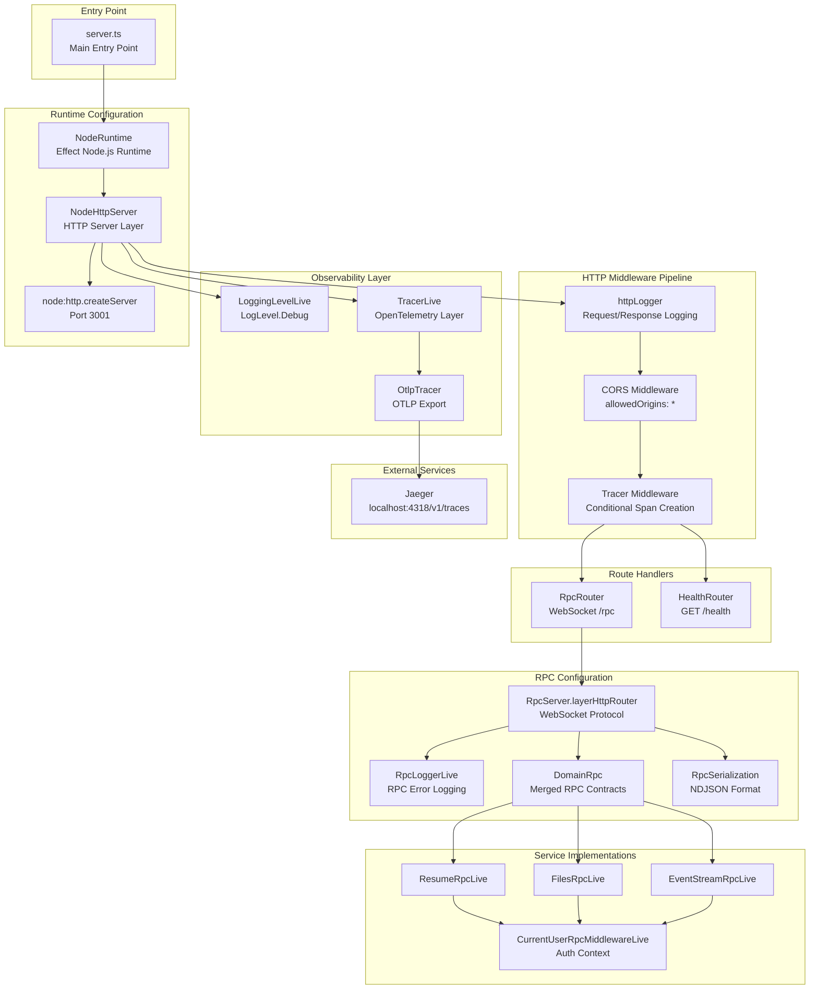
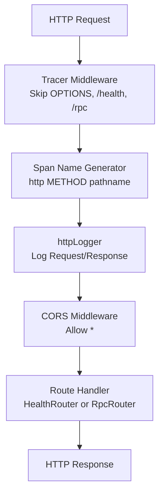
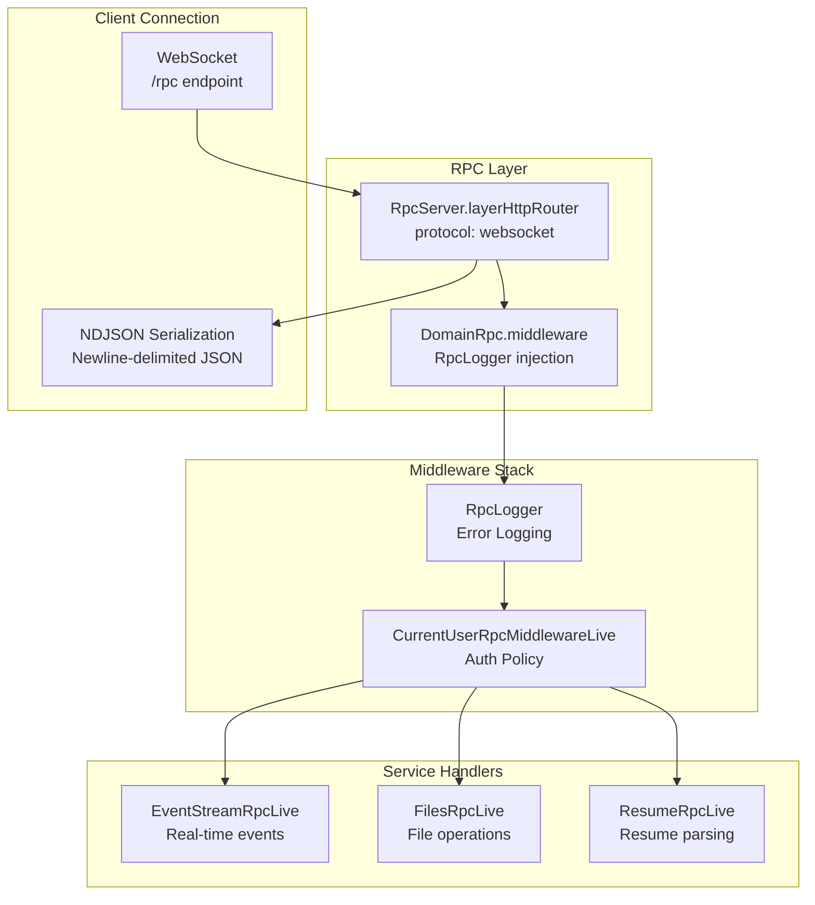
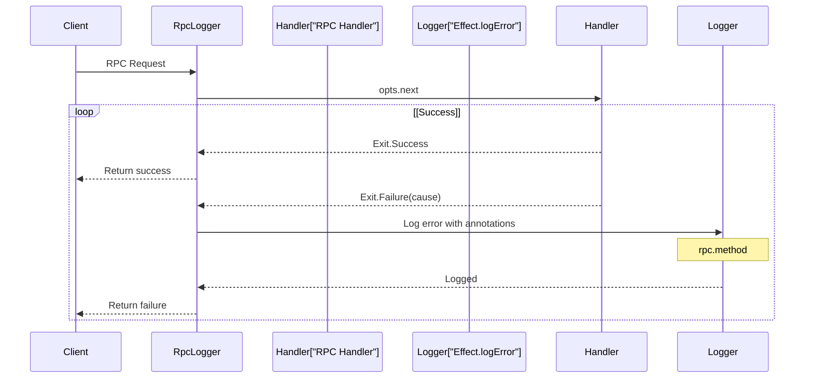
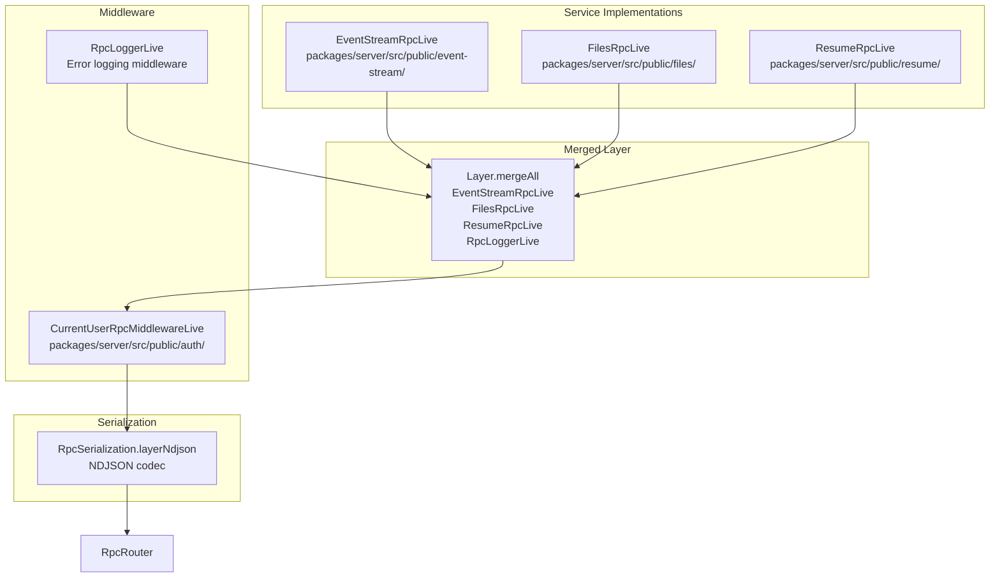

# HTTP and RPC Server Setup

> **Relevant source files**
> * [packages/server/src/db/migrations/sql/_schema.sql](https://github.com/oscaromsn/TalentScore/blob/428ed1eb/packages/server/src/db/migrations/sql/_schema.sql)
> * [packages/server/src/server.ts](https://github.com/oscaromsn/TalentScore/blob/428ed1eb/packages/server/src/server.ts)

## Purpose and Scope

This document describes the HTTP server and RPC server configuration in the TalentScore backend. It covers the server initialization, middleware pipeline (CORS, logging, authentication), OpenTelemetry tracing integration, and the composition of service layers.

For details about the specific RPC service implementations (resume parsing, file management), see [Resume RPC Implementation](/oscaromsn/TalentScore/4.4.1-resume-rpc-implementation) and [Files Repository](/oscaromsn/TalentScore/4.5.1-files-repository). For database connectivity, see [Database Schema](/oscaromsn/TalentScore/4.2-database-schema). For BAML integration details, see [BAML Integration](/oscaromsn/TalentScore/4.3-baml-integration).

**Sources:** [packages/server/src/server.ts L1-L163](https://github.com/oscaromsn/TalentScore/blob/428ed1eb/packages/server/src/server.ts#L1-L163)

---

## Server Architecture Overview

The TalentScore server is built using Effect's HTTP platform abstractions, with a dual-protocol architecture serving both standard HTTP endpoints and WebSocket-based RPC connections. The server runs on Node.js and integrates OpenTelemetry for distributed tracing.

### Server Components Diagram



**Sources:** [packages/server/src/server.ts L1-L163](https://github.com/oscaromsn/TalentScore/blob/428ed1eb/packages/server/src/server.ts#L1-L163)

---

## OpenTelemetry Tracing Configuration

The server integrates OpenTelemetry for distributed tracing, enabling observability of all HTTP requests and RPC calls. Traces are exported to a Jaeger backend using the OTLP protocol.

### TracerLive Layer

The `TracerLive` layer is constructed dynamically, reading the OTLP endpoint from configuration with a fallback to localhost:

| Configuration | Default Value | Description |
| --- | --- | --- |
| `OTLP_URL` | `http://localhost:4318/v1/traces` | Jaeger OTLP endpoint for trace export |
| `serviceName` | `effect-files-example-api` | Service identifier in traces |
| `exportInterval` | `1 second` | Batch export frequency |
| `maxBatchSize` | `100` | Maximum traces per batch |

The layer uses `FetchHttpClient` for HTTP communication with the tracing backend.

**Implementation:**

```javascript
TracerLive = Layer.unwrapEffect(
  Effect.gen(function* () {
    const otlpUrl = yield* Config.string("OTLP_URL").pipe(
      Config.withDefault("http://localhost:4318/v1/traces")
    )
    return OtlpTracer.layer({...})
  })
).pipe(Layer.provide(FetchHttpClient.layer))
```

**Sources:** [packages/server/src/server.ts L27-L41](https://github.com/oscaromsn/TalentScore/blob/428ed1eb/packages/server/src/server.ts#L27-L41)

### Conditional Tracing

The server applies conditional tracing to exclude noisy endpoints from trace collection:

* `OPTIONS` requests (CORS preflight)
* `/health` endpoint (high-frequency health checks)
* `/rpc` endpoint (WebSocket upgrade requests)

Actual RPC method calls within the WebSocket connection are traced with the `spanPrefix: "rpc"` configuration, creating spans named like `rpc.resume_parse`.

**Sources:** [packages/server/src/server.ts L142-L145](https://github.com/oscaromsn/TalentScore/blob/428ed1eb/packages/server/src/server.ts#L142-L145)

---

## HTTP Middleware Pipeline

The HTTP middleware pipeline processes requests in the following order:



**Sources:** [packages/server/src/server.ts L137-L163](https://github.com/oscaromsn/TalentScore/blob/428ed1eb/packages/server/src/server.ts#L137-L163)

### httpLogger Middleware

The `httpLogger` middleware logs all HTTP requests and responses with structured annotations. It attaches the following metadata to logs:

| Field | Description |
| --- | --- |
| `http.method` | HTTP method (GET, POST, etc.) |
| `http.url` | Full request URL |
| `http.status` | Response status code |
| `http.span.N` | Unique span identifier (incremental counter) |

The logger skips 404 responses to reduce noise and uses `Effect.annotateLogs` for structured logging integration with OpenTelemetry.

**Sources:** [packages/server/src/server.ts L45-L84](https://github.com/oscaromsn/TalentScore/blob/428ed1eb/packages/server/src/server.ts#L45-L84)

### CORS Configuration

CORS is configured to allow cross-origin requests from any origin with the following settings:

| Setting | Value | Purpose |
| --- | --- | --- |
| `allowedOrigins` | `["*"]` | Accept requests from any origin |
| `allowedMethods` | `["GET", "POST", "PUT", "DELETE", "PATCH"]` | Permitted HTTP methods |
| `allowedHeaders` | `["Content-Type", "Authorization", "B3", "traceparent"]` | Permitted request headers |
| `credentials` | `true` | Allow credentials in cross-origin requests |

The `B3` and `traceparent` headers enable distributed tracing context propagation across services.

**Sources:** [packages/server/src/server.ts L126-L135](https://github.com/oscaromsn/TalentScore/blob/428ed1eb/packages/server/src/server.ts#L126-L135)

---

## RPC Server Configuration

The RPC server uses Effect's `@effect/rpc` library to expose type-safe, streaming RPC methods over WebSocket connections with NDJSON serialization.

### RPC Server Architecture



**Sources:** [packages/server/src/server.ts L114-L124](https://github.com/oscaromsn/TalentScore/blob/428ed1eb/packages/server/src/server.ts#L114-L124)

### RpcRouter Configuration

The `RpcRouter` is created using `RpcServer.layerHttpRouter` with the following configuration:

| Parameter | Value | Description |
| --- | --- | --- |
| `group` | `DomainRpc.middleware(RpcLogger)` | Merged RPC contracts with logging |
| `path` | `/rpc` | WebSocket endpoint path |
| `protocol` | `websocket` | Transport protocol |
| `spanPrefix` | `rpc` | OpenTelemetry span naming prefix |
| `disableFatalDefects` | `true` | Prevent fatal errors from crashing server |

The `group` parameter references `DomainRpc` from `@example/domain/domain-api`, which merges all RPC contracts (`ResumeRpc`, `FilesRpc`, `EventStreamRpc`) into a single API surface.

**Sources:** [packages/server/src/server.ts L114-L124](https://github.com/oscaromsn/TalentScore/blob/428ed1eb/packages/server/src/server.ts#L114-L124)

### RPC Logger Middleware

The `RpcLogger` is a custom middleware that logs failed RPC requests with structured context:



The logger uses `Effect.annotateLogs` to attach `rpc.method` and `rpc.clientId` to error logs, enabling correlation with distributed traces.

**Sources:** [packages/server/src/server.ts L90-L112](https://github.com/oscaromsn/TalentScore/blob/428ed1eb/packages/server/src/server.ts#L90-L112)

---

## Service Layer Composition

The RPC router composes multiple service layers, each implementing a subset of the `DomainRpc` contract:

### Service Layer Diagram



**Sources:** [packages/server/src/server.ts L114-L124](https://github.com/oscaromsn/TalentScore/blob/428ed1eb/packages/server/src/server.ts#L114-L124)

### Layer Composition Strategy

The service layers are composed using Effect's `Layer.mergeAll` and `Layer.provide` for dependency injection:

1. **Service Layer Merge**: `Layer.mergeAll(EventStreamRpcLive, FilesRpcLive, ResumeRpcLive, RpcLoggerLive)` combines all service implementations
2. **Auth Middleware**: `Layer.provide(CurrentUserRpcMiddlewareLive)` injects authentication context
3. **Serialization**: `Layer.provide(RpcSerialization.layerNdjson)` configures NDJSON codec

Each service layer implements a specific RPC contract:

* **EventStreamRpcLive**: Implements `EventStreamRpc` for real-time event broadcasting
* **FilesRpcLive**: Implements `FilesRpc` for file and folder management operations
* **ResumeRpcLive**: Implements `ResumeRpc` for resume parsing and retrieval

**Sources:** [packages/server/src/server.ts L121-L124](https://github.com/oscaromsn/TalentScore/blob/428ed1eb/packages/server/src/server.ts#L121-L124)

 [packages/server/src/server.ts L22-L25](https://github.com/oscaromsn/TalentScore/blob/428ed1eb/packages/server/src/server.ts#L22-L25)

---

## Health Check Endpoint

The server exposes a simple health check endpoint for load balancer and orchestration integration:

| Method | Path | Response | Status Code |
| --- | --- | --- | --- |
| GET | `/health` | `OK` (text/plain) | 200 |

The health check is implemented using `HttpLayerRouter` and returns immediately without database or external service checks.

**Implementation:**

```javascript
HealthRouter = HttpLayerRouter.use((router) =>
  router.add("GET", "/health", HttpServerResponse.text("OK"))
)
```

**Sources:** [packages/server/src/server.ts L86-L88](https://github.com/oscaromsn/TalentScore/blob/428ed1eb/packages/server/src/server.ts#L86-L88)

---

## Server Startup and Runtime

The server initialization follows Effect's layer-based architecture, composing all dependencies and launching the HTTP server.

### Startup Sequence Diagram

```

```

**Sources:** [packages/server/src/server.ts L137-L163](https://github.com/oscaromsn/TalentScore/blob/428ed1eb/packages/server/src/server.ts#L137-L163)

### Layer Composition

The final server layer is constructed by piping multiple layers together:

```
HttpLayerRouter.serve(AllRoutes, {...})
  .pipe(HttpMiddleware.withTracerDisabledWhen(...))
  .pipe(HttpMiddleware.withSpanNameGenerator(...))
  .pipe(Layer.provide(NodeHttpServer.layer(createServer, { port: 3001 })))
  .pipe(Layer.provide(TracerLive))
  .pipe(Layer.provide(LoggingLevelLive))
  .pipe(Layer.launch)
  .pipe(NodeRuntime.runMain)
```

**Key Configuration:**

| Component | Configuration | Description |
| --- | --- | --- |
| `HttpLayerRouter.serve` | `middleware: httpLogger` | Attach request/response logger |
|  | `disableLogger: false` | Enable built-in HTTP logging |
|  | `disableListenLog: false` | Log server startup message |
| `NodeHttpServer.layer` | `createServer` | Node.js `http.createServer` factory |
|  | `port: 3001` | Server listening port |
| `LoggingLevelLive` | `LogLevel.Debug` | Minimum log level threshold |

**Sources:** [packages/server/src/server.ts L137-L163](https://github.com/oscaromsn/TalentScore/blob/428ed1eb/packages/server/src/server.ts#L137-L163)

 [packages/server/src/server.ts L43](https://github.com/oscaromsn/TalentScore/blob/428ed1eb/packages/server/src/server.ts#L43-L43)

---

## Port Configuration

The HTTP server listens on port **3001** by default. This is hardcoded in the `NodeHttpServer.layer` configuration:

```
Layer.provide(NodeHttpServer.layer(createServer, { port: 3001 }))
```

The port is not configurable via environment variables in the current implementation. To change the port, modify the hardcoded value in the server startup configuration.

**Sources:** [packages/server/src/server.ts L158](https://github.com/oscaromsn/TalentScore/blob/428ed1eb/packages/server/src/server.ts#L158-L158)

---

## Summary

The TalentScore server uses Effect's platform abstractions to create a production-ready HTTP server with:

* **Dual-protocol support**: Standard HTTP endpoints and WebSocket RPC
* **Built-in observability**: OpenTelemetry tracing with Jaeger integration
* **Type-safe RPC**: Contract-first API with runtime validation
* **Structured logging**: Request/response logging with trace correlation
* **CORS support**: Configurable cross-origin resource sharing
* **Health checks**: Simple endpoint for orchestration tools
* **Modular architecture**: Clean separation of concerns via Effect layers

The server runs on Node.js port 3001 and exports traces to Jaeger on `localhost:4318/v1/traces` by default.

**Sources:** [packages/server/src/server.ts L1-L163](https://github.com/oscaromsn/TalentScore/blob/428ed1eb/packages/server/src/server.ts#L1-L163)