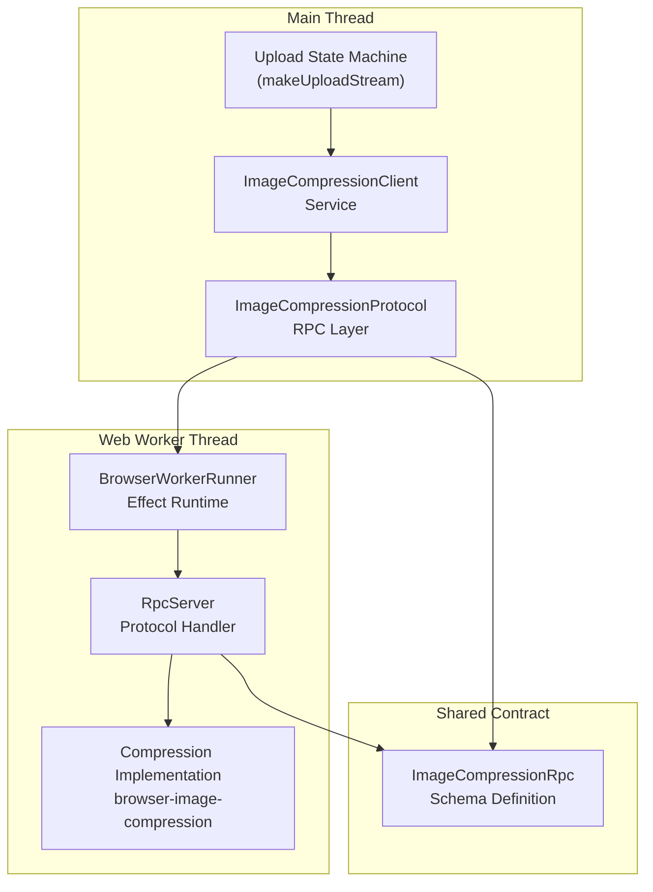
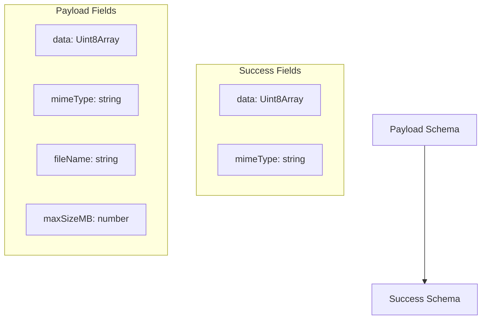
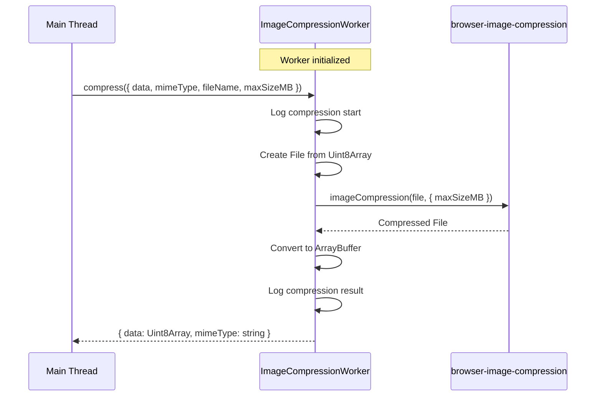
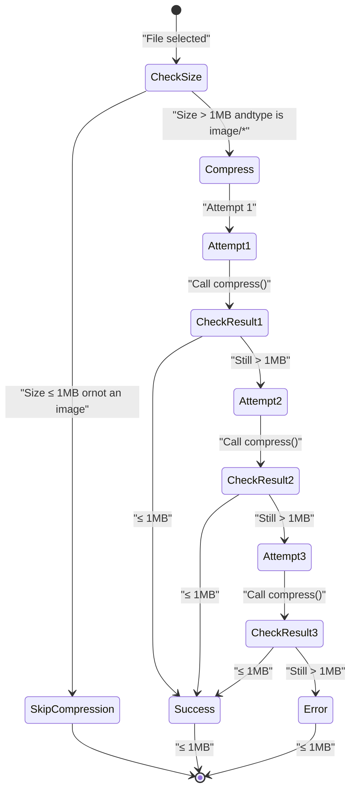
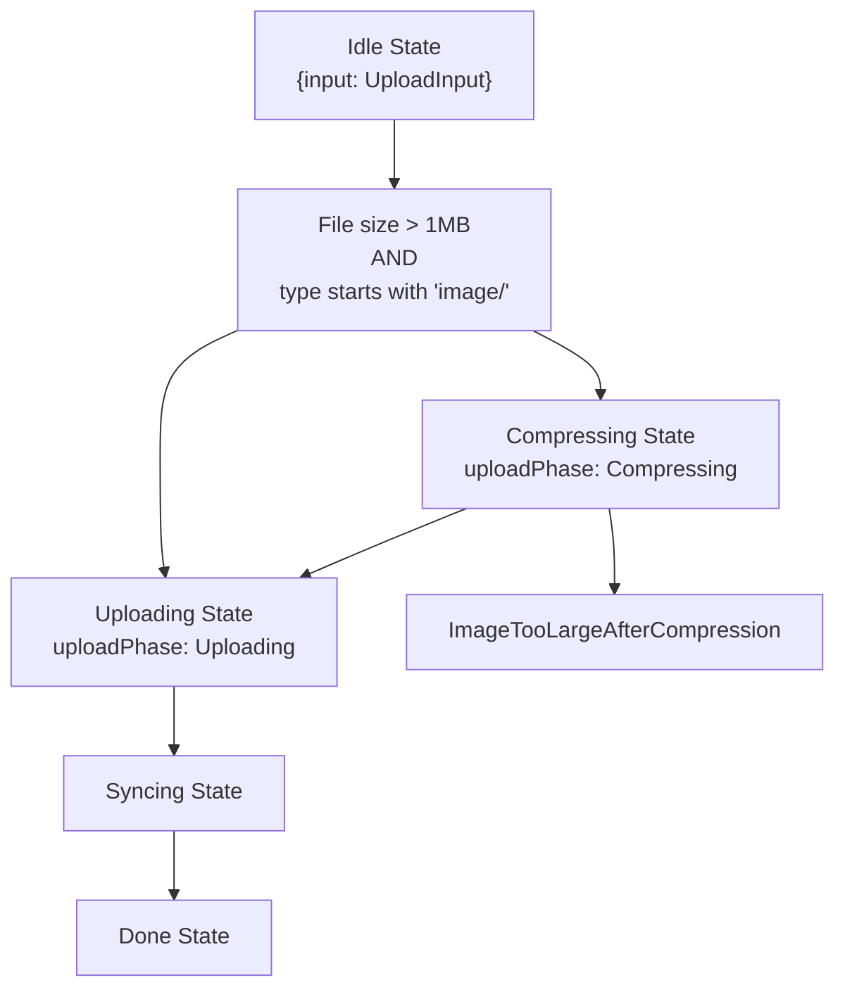

# Image Compression System

> **Relevant source files**
> * [packages/client/src/routes/files/-files/files-atoms/files-atoms.tsx](https://github.com/lucas-barake/effect-file-manager/blob/28eedd82/packages/client/src/routes/files/-files/files-atoms/files-atoms.tsx)
> * [packages/client/src/routes/files/-files/files-atoms/internal/image-compression-rpc.ts](https://github.com/lucas-barake/effect-file-manager/blob/28eedd82/packages/client/src/routes/files/-files/files-atoms/internal/image-compression-rpc.ts)
> * [packages/client/src/routes/files/-files/files-atoms/internal/image-compression-worker.ts](https://github.com/lucas-barake/effect-file-manager/blob/28eedd82/packages/client/src/routes/files/-files/files-atoms/internal/image-compression-worker.ts)

## Purpose and Scope

This document describes the client-side image compression system, which runs in a dedicated Web Worker to compress large images before upload. The system ensures images meet the 1MB size threshold without blocking the UI thread.

For the broader upload workflow and state machine, see [Upload State Machine](/lucas-barake/effect-file-manager/4.1-upload-state-machine). For presigned URL handling and direct S3 upload, see [UploadThing Integration](/lucas-barake/effect-file-manager/4.3-uploadthing-integration).

**Sources:** [packages/client/src/routes/files/-files/files-atoms/files-atoms.tsx L1-L781](https://github.com/lucas-barake/effect-file-manager/blob/28eedd82/packages/client/src/routes/files/-files/files-atoms/files-atoms.tsx#L1-L781)

---

## Architecture Overview

The image compression system follows a Web Worker pattern with typed RPC communication. The main thread delegates compression tasks to a dedicated worker, preventing UI freezes during intensive image processing operations.

### System Component Diagram



**Sources:** [packages/client/src/routes/files/-files/files-atoms/files-atoms.tsx L70-L86](https://github.com/lucas-barake/effect-file-manager/blob/28eedd82/packages/client/src/routes/files/-files/files-atoms/files-atoms.tsx#L70-L86)

 [packages/client/src/routes/files/-files/files-atoms/internal/image-compression-worker.ts L1-L52](https://github.com/lucas-barake/effect-file-manager/blob/28eedd82/packages/client/src/routes/files/-files/files-atoms/internal/image-compression-worker.ts#L1-L52)

---

## Service Definition

### ImageCompressionClient Service

The `ImageCompressionClient` is an Effect service that provides access to the compression worker via RPC.

| Property | Type | Description |
| --- | --- | --- |
| Service Name | `string` | `@example/client/routes/files/-files/files-atoms/ImageCompressionClient` |
| Dependencies | `Layer` | `ImageCompressionProtocol` |
| Client | `RpcClient` | Typed RPC client for `ImageCompressionRpc` |

**Implementation:**

```

```

**Sources:** [packages/client/src/routes/files/-files/files-atoms/files-atoms.tsx L78-L86](https://github.com/lucas-barake/effect-file-manager/blob/28eedd82/packages/client/src/routes/files/-files/files-atoms/files-atoms.tsx#L78-L86)

### ImageCompressionProtocol Layer

The protocol layer configures the RPC transport over a Web Worker.

```

```

| Configuration | Value | Rationale |
| --- | --- | --- |
| `size` | `2` | Worker pool size (allows 2 concurrent workers) |
| `concurrency` | `1` | Only 1 request per worker at a time |
| Worker Factory | `ImageCompressionWorker` | References the bundled worker script |

**Sources:** [packages/client/src/routes/files/-files/files-atoms/files-atoms.tsx L70-L76](https://github.com/lucas-barake/effect-file-manager/blob/28eedd82/packages/client/src/routes/files/-files/files-atoms/files-atoms.tsx#L70-L76)

---

## RPC Protocol Definition

The `ImageCompressionRpc` defines the typed contract between the main thread and worker.

### Compress RPC Definition



**Schema Definition:**

| Field | Type | Direction | Description |
| --- | --- | --- | --- |
| `data` | `Uint8Array` | Payload | Raw image data to compress |
| `mimeType` | `string` | Payload | Original MIME type (e.g., `image/png`) |
| `fileName` | `string` | Payload | File name for logging purposes |
| `maxSizeMB` | `number` | Payload | Target size in megabytes |
| `data` | `Uint8Array` | Success | Compressed image data |
| `mimeType` | `string` | Success | Resulting MIME type (may differ from input) |

**Sources:** [packages/client/src/routes/files/-files/files-atoms/internal/image-compression-rpc.ts L1-L18](https://github.com/lucas-barake/effect-file-manager/blob/28eedd82/packages/client/src/routes/files/-files/files-atoms/internal/image-compression-rpc.ts#L1-L18)

---

## Web Worker Implementation

The worker runs in an isolated thread, executing the `browser-image-compression` library without blocking the main thread.

### Worker Lifecycle



**Key Implementation Details:**

| Aspect | Implementation | Location |
| --- | --- | --- |
| Runtime | `BrowserRuntime.runMain` | [image-compression-worker.ts L51](https://github.com/lucas-barake/effect-file-manager/blob/28eedd82/image-compression-worker.ts#L51-L51) |
| Server Layer | `RpcServer.layer(ImageCompressionRpc)` | [image-compression-worker.ts L45](https://github.com/lucas-barake/effect-file-manager/blob/28eedd82/image-compression-worker.ts#L45-L45) |
| Compression Library | `browser-image-compression` | [image-compression-worker.ts L4](https://github.com/lucas-barake/effect-file-manager/blob/28eedd82/image-compression-worker.ts#L4-L4) |
| Worker Config | `useWebWorker: false` | [image-compression-worker.ts L26](https://github.com/lucas-barake/effect-file-manager/blob/28eedd82/image-compression-worker.ts#L26-L26) |

The worker explicitly sets `useWebWorker: false` because it is already running inside a Web Worker, avoiding nested worker creation.

**Sources:** [packages/client/src/routes/files/-files/files-atoms/internal/image-compression-worker.ts L1-L52](https://github.com/lucas-barake/effect-file-manager/blob/28eedd82/packages/client/src/routes/files/-files/files-atoms/internal/image-compression-worker.ts#L1-L52)

---

## Compression Algorithm

The compression algorithm is integrated into the upload state machine's "Compressing" state.

### Iterative Compression Flow



### Implementation: Compressing State Transition

The compression occurs in the `Compressing` state of the upload state machine:

```

```

**Algorithm Parameters:**

| Parameter | Value | Purpose |
| --- | --- | --- |
| `MAX_FILE_SIZE_BYTES` | `1 * 1024 * 1024` (1 MB) | Target compression threshold |
| `maxAttempts` | `3` | Maximum compression iterations |
| `maxSizeMB` | `1` | Target size passed to compression library |

**Sources:** [packages/client/src/routes/files/-files/files-atoms/files-atoms.tsx L130](https://github.com/lucas-barake/effect-file-manager/blob/28eedd82/packages/client/src/routes/files/-files/files-atoms/files-atoms.tsx#L130-L130)

 [packages/client/src/routes/files/-files/files-atoms/files-atoms.tsx L307-L351](https://github.com/lucas-barake/effect-file-manager/blob/28eedd82/packages/client/src/routes/files/-files/files-atoms/files-atoms.tsx#L307-L351)

---

## Integration with Upload Pipeline

The compression system integrates seamlessly with the upload state machine via conditional state transitions.

### State Machine Integration Diagram



### Conditional Compression Logic

The upload state machine checks two conditions before initiating compression:

1. **Size Check:** File must exceed `MAX_FILE_SIZE_BYTES` (1 MB)
2. **Type Check:** MIME type must start with `image/`

```

```

Non-image files or files under 1 MB bypass compression entirely, transitioning directly from `Idle` to `Uploading`.

**Sources:** [packages/client/src/routes/files/-files/files-atoms/files-atoms.tsx L289-L305](https://github.com/lucas-barake/effect-file-manager/blob/28eedd82/packages/client/src/routes/files/-files/files-atoms/files-atoms.tsx#L289-L305)

---

## Error Handling

### ImageTooLargeAfterCompression Error

When compression fails to reduce a file below 1 MB after 3 attempts, the system throws a typed error:

```

```

**Error Fields:**

| Field | Type | Description |
| --- | --- | --- |
| `fileName` | `string` | Name of the file that failed compression |
| `originalSizeBytes` | `number` | Original file size in bytes |
| `compressedSizeBytes` | `number` | Final size after 3 compression attempts |
| `_tag` | `"ImageTooLargeAfterCompression"` | Tagged union discriminator |

This error is thrown when the compressed file still exceeds the threshold:

```

```

The error propagates to the UI via the upload atom's error channel, allowing the `PendingFileItem` component to display an appropriate error message to the user.

**Sources:** [packages/client/src/routes/files/-files/files-atoms/files-atoms.tsx L92-L98](https://github.com/lucas-barake/effect-file-manager/blob/28eedd82/packages/client/src/routes/files/-files/files-atoms/files-atoms.tsx#L92-L98)

 [packages/client/src/routes/files/-files/files-atoms/files-atoms.tsx L335-L341](https://github.com/lucas-barake/effect-file-manager/blob/28eedd82/packages/client/src/routes/files/-files/files-atoms/files-atoms.tsx#L335-L341)

---

## File Type Transformation

The compression process may change the file's MIME type. The worker returns the compressed file's MIME type, which replaces the original:

```

```

**Example Transformation:**

| Original | Compressed | Reason |
| --- | --- | --- |
| `image/png` | `image/jpeg` | JPEG offers better compression for photos |
| `image/bmp` | `image/jpeg` | BMP is uncompressed, converts to JPEG |
| `image/webp` | `image/webp` | Already efficient, maintains format |

The `browser-image-compression` library determines the optimal output format based on the compression configuration.

**Sources:** [packages/client/src/routes/files/-files/files-atoms/files-atoms.tsx L343-L345](https://github.com/lucas-barake/effect-file-manager/blob/28eedd82/packages/client/src/routes/files/-files/files-atoms/files-atoms.tsx#L343-L345)

---

## Performance Characteristics

### Compression Timing

| Operation | Duration | Notes |
| --- | --- | --- |
| Worker Initialization | ~100-300ms | One-time cost, occurs on first use |
| Compression (1st attempt) | ~200-1000ms | Depends on image size and complexity |
| Compression (2nd attempt) | ~150-800ms | Faster due to smaller input size |
| Compression (3rd attempt) | ~100-600ms | Smallest input, fastest iteration |
| RPC Overhead | ~5-20ms | Serialization + worker communication |

### Concurrency Configuration

The `ImageCompressionProtocol` configures a pool of 2 workers with concurrency=1:

* **Pool Size (`size: 2`):** Allows 2 simultaneous file compressions
* **Concurrency (`concurrency: 1`):** Each worker handles 1 task at a time
* **Total Capacity:** Up to 2 files can be compressed in parallel

This configuration balances parallelism with resource usage, preventing excessive memory consumption from multiple large image buffers.

**Sources:** [packages/client/src/routes/files/-files/files-atoms/files-atoms.tsx L70-L76](https://github.com/lucas-barake/effect-file-manager/blob/28eedd82/packages/client/src/routes/files/-files/files-atoms/files-atoms.tsx#L70-L76)

---

## Testing Considerations

The compression system is testable via Effect's dependency injection. Tests can provide a mock `ImageCompressionClient` layer:

```

```

This allows unit testing of the upload state machine without spawning actual Web Workers or performing real compression.

**Sources:** [packages/client/src/routes/files/-files/files-atoms/files-atoms.tsx L78-L86](https://github.com/lucas-barake/effect-file-manager/blob/28eedd82/packages/client/src/routes/files/-files/files-atoms/files-atoms.tsx#L78-L86)

 [packages/client/src/routes/files/-files/files-atoms/files-atoms.tsx L247-L256](https://github.com/lucas-barake/effect-file-manager/blob/28eedd82/packages/client/src/routes/files/-files/files-atoms/files-atoms.tsx#L247-L256)