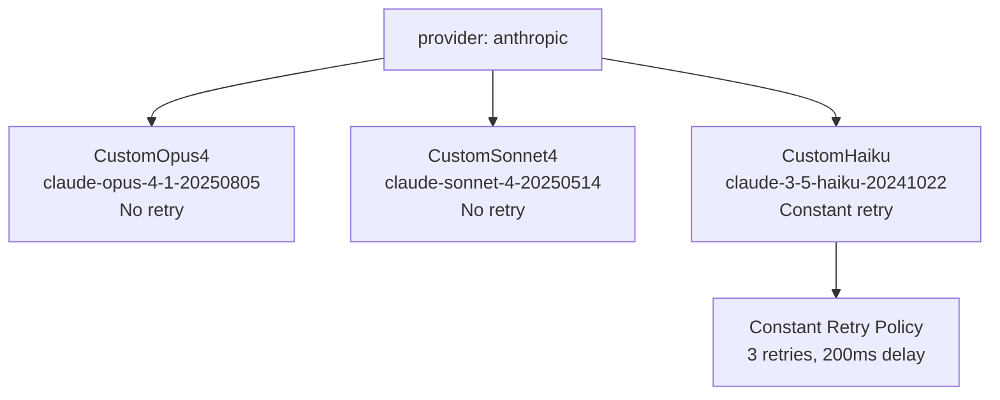
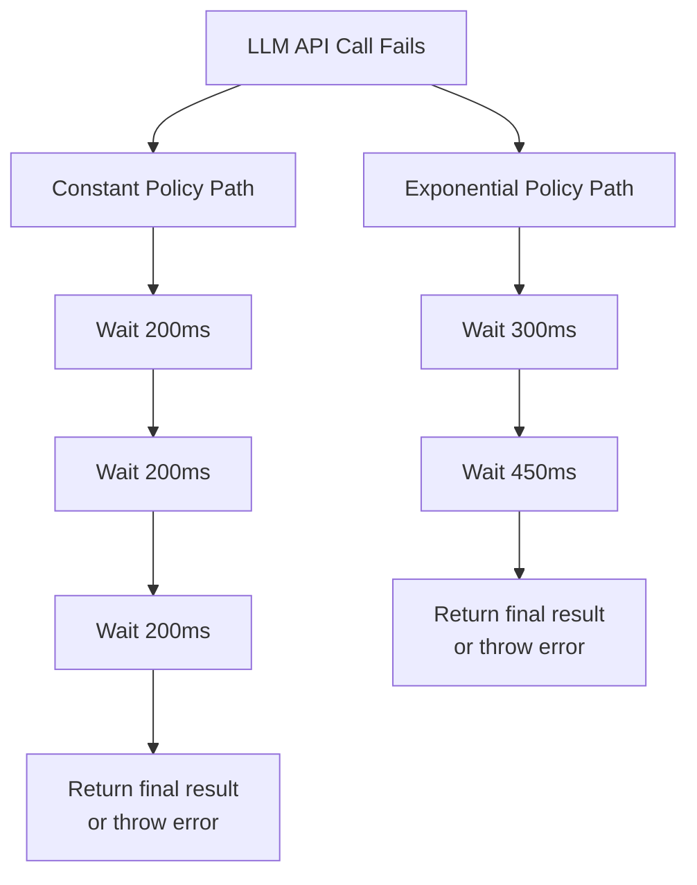
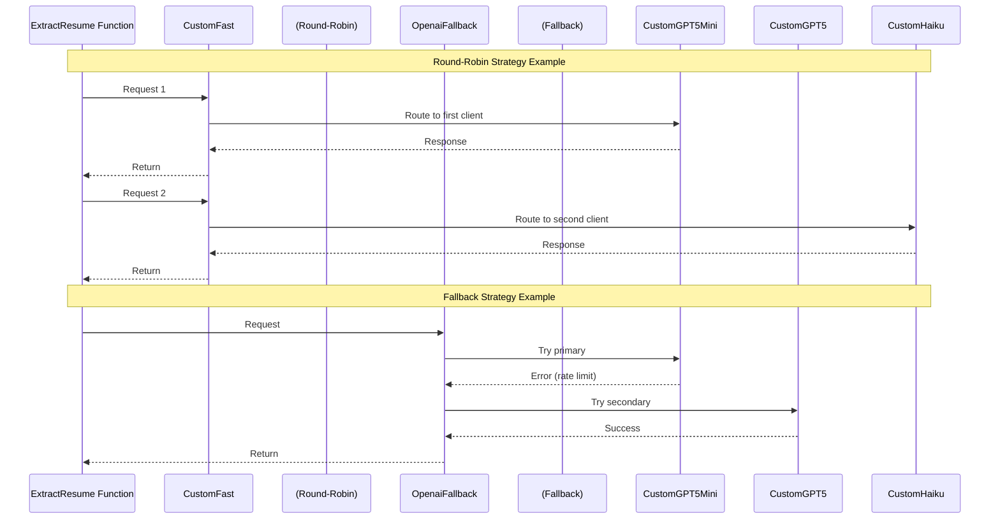
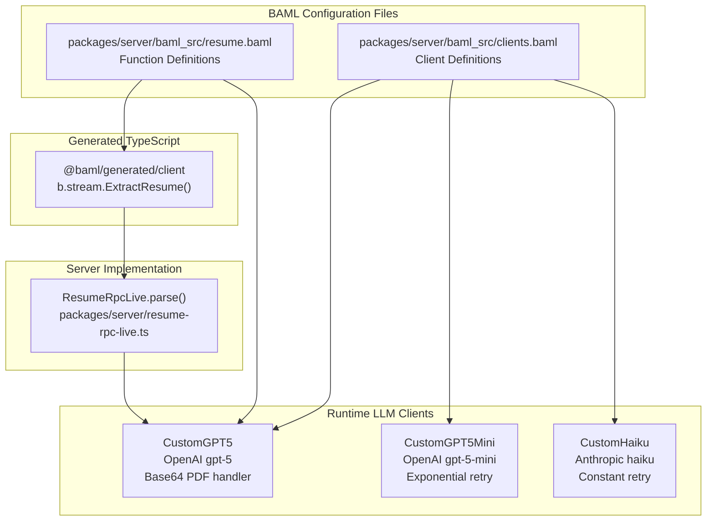

# LLM Client Configuration

> **Relevant source files**
> * [packages/server/baml_src/clients.baml](https://github.com/oscaromsn/TalentScore/blob/428ed1eb/packages/server/baml_src/clients.baml)
> * [packages/server/baml_src/resume.baml](https://github.com/oscaromsn/TalentScore/blob/428ed1eb/packages/server/baml_src/resume.baml)

This document details the BAML LLM client configurations defined in [packages/server/baml_src/clients.baml](https://github.com/oscaromsn/TalentScore/blob/428ed1eb/packages/server/baml_src/clients.baml)

 These clients abstract interactions with various LLM providers (OpenAI, Anthropic, Google AI, AWS Bedrock, etc.) and define retry policies, fallback strategies, and provider-specific options.

For information about the resume extraction schema that uses these clients, see [4.3.2](/oscaromsn/TalentScore/4.3.2-resume-extraction-schema). For details on the `ExtractResume` function implementation, see [4.3.3](/oscaromsn/TalentScore/4.3.3-extractresume-function).

**Sources:** [packages/server/baml_src/clients.baml L1-L146](https://github.com/oscaromsn/TalentScore/blob/428ed1eb/packages/server/baml_src/clients.baml#L1-L146)

---

## Client Architecture Overview

BAML clients are declarative configurations that specify how the system communicates with LLM providers. Each client defines:

* **Provider**: The underlying API (e.g., `openai-responses`, `anthropic`)
* **Model**: Specific model version (e.g., `gpt-5`, `claude-opus-4-1-20250805`)
* **Authentication**: API key from environment variables
* **Options**: Provider-specific configuration (media handling, API versions, etc.)
* **Retry Policy**: Optional error recovery strategy

### Client Type Hierarchy

```

```

**Sources:** [packages/server/baml_src/clients.baml L1-L146](https://github.com/oscaromsn/TalentScore/blob/428ed1eb/packages/server/baml_src/clients.baml#L1-L146)

---

## OpenAI Client Configurations

The system defines three OpenAI clients using different provider interfaces and models:

| Client Name | Provider | Model | Retry Policy | Special Configuration |
| --- | --- | --- | --- | --- |
| `CustomGPT5` | `openai-responses` | `gpt-5` | None | PDF sent as base64 |
| `CustomGPT5Mini` | `openai-responses` | `gpt-5-mini` | `Exponential` | None |
| `CustomGPT5Chat` | `openai` | `gpt-5` | None | Chat completion API |

### CustomGPT5 (Primary Client)

The `CustomGPT5` client is the default client used by the `ExtractResume` function [packages/server/baml_src/resume.baml L132](https://github.com/oscaromsn/TalentScore/blob/428ed1eb/packages/server/baml_src/resume.baml#L132-L132)

 It uses the `openai-responses` provider, which enables enhanced formatting capabilities.

**Key Configuration:**

```

```

**PDF Handling:** OpenAI requires PDF documents to be sent as base64-encoded strings rather than URLs. The `media_url_handler` configuration [packages/server/baml_src/clients.baml L10-L12](https://github.com/oscaromsn/TalentScore/blob/428ed1eb/packages/server/baml_src/clients.baml#L10-L12)

 ensures PDFs are automatically converted before transmission.

### CustomGPT5Mini (Cost-Optimized)

The `CustomGPT5Mini` client uses the smaller, faster `gpt-5-mini` model and includes exponential backoff retry logic [packages/server/baml_src/clients.baml L16-L23](https://github.com/oscaromsn/TalentScore/blob/428ed1eb/packages/server/baml_src/clients.baml#L16-L23)

 This client is suitable for less complex extraction tasks or as part of fallback/round-robin strategies.

### CustomGPT5Chat (Alternative Interface)

Uses the traditional OpenAI chat completion API (`provider openai`) instead of the responses API [packages/server/baml_src/clients.baml L26-L32](https://github.com/oscaromsn/TalentScore/blob/428ed1eb/packages/server/baml_src/clients.baml#L26-L32)

 This provides compatibility with older OpenAI client libraries if needed.

**Sources:** [packages/server/baml_src/clients.baml L4-L32](https://github.com/oscaromsn/TalentScore/blob/428ed1eb/packages/server/baml_src/clients.baml#L4-L32)

 [packages/server/baml_src/resume.baml L132](https://github.com/oscaromsn/TalentScore/blob/428ed1eb/packages/server/baml_src/resume.baml#L132-L132)

---

## Anthropic Claude Client Configurations

Three Anthropic Claude clients provide access to different Claude model tiers:

| Client Name | Model | Retry Policy | Use Case |
| --- | --- | --- | --- |
| `CustomOpus4` | `claude-opus-4-1-20250805` | None | Highest quality reasoning |
| `CustomSonnet4` | `claude-sonnet-4-20250514` | None | Balanced quality/speed |
| `CustomHaiku` | `claude-3-5-haiku-20241022` | `Constant` | Fast, cost-efficient |

### Client Definitions



All Anthropic clients use the `anthropic` provider and authenticate via `env.ANTHROPIC_API_KEY` [packages/server/baml_src/clients.baml L35-L58](https://github.com/oscaromsn/TalentScore/blob/428ed1eb/packages/server/baml_src/clients.baml#L35-L58)

**`CustomHaiku` Retry Configuration:** The fastest model includes a `Constant` retry policy to handle transient API failures [packages/server/baml_src/clients.baml L52-L53](https://github.com/oscaromsn/TalentScore/blob/428ed1eb/packages/server/baml_src/clients.baml#L52-L53)

 This ensures reliability for high-throughput scenarios.

**Sources:** [packages/server/baml_src/clients.baml L35-L58](https://github.com/oscaromsn/TalentScore/blob/428ed1eb/packages/server/baml_src/clients.baml#L35-L58)

---

## Retry Policies

BAML defines two retry policies that clients can reference to handle LLM API failures:

### Constant Retry Policy

Fixed delay between retry attempts:

```
retry_policy Constant {
  max_retries 3
  strategy {
    type constant_delay
    delay_ms 200
  }
}
```

| Parameter | Value | Purpose |
| --- | --- | --- |
| `max_retries` | 3 | Total retry attempts after initial failure |
| `type` | `constant_delay` | Same delay between each retry |
| `delay_ms` | 200 | Wait 200ms between attempts |

**Total worst-case latency:** Initial request + 3 retries × 200ms = base latency + 600ms

**Used by:** `CustomHaiku` [packages/server/baml_src/clients.baml L53](https://github.com/oscaromsn/TalentScore/blob/428ed1eb/packages/server/baml_src/clients.baml#L53-L53)

### Exponential Retry Policy

Exponentially increasing delay for handling sustained API issues:

```
retry_policy Exponential {
  max_retries 2
  strategy {
    type exponential_backoff
    delay_ms 300
    multiplier 1.5
    max_delay_ms 10000
  }
}
```

| Parameter | Value | Purpose |
| --- | --- | --- |
| `max_retries` | 2 | Fewer retries due to longer delays |
| `type` | `exponential_backoff` | Increasing delay pattern |
| `delay_ms` | 300 | Initial delay (first retry) |
| `multiplier` | 1.5 | Each subsequent delay is 1.5× previous |
| `max_delay_ms` | 10000 | Cap delay at 10 seconds |

**Retry timing:**

* First retry: 300ms
* Second retry: 450ms (300 × 1.5)
* Total worst-case latency: base + 750ms

**Used by:** `CustomGPT5Mini` [packages/server/baml_src/clients.baml L18](https://github.com/oscaromsn/TalentScore/blob/428ed1eb/packages/server/baml_src/clients.baml#L18-L18)

### Retry Policy Comparison



**Sources:** [packages/server/baml_src/clients.baml L130-L146](https://github.com/oscaromsn/TalentScore/blob/428ed1eb/packages/server/baml_src/clients.baml#L130-L146)

---

## Advanced Client Strategies

BAML supports orchestration strategies that combine multiple clients for improved reliability and performance.

### Round-Robin Strategy (CustomFast)

Alternates between clients to distribute load and potentially reduce costs:

```

```

**Behavior:**

1. First request → `CustomGPT5Mini` (OpenAI gpt-5-mini)
2. Second request → `CustomHaiku` (Anthropic claude-3-5-haiku)
3. Third request → `CustomGPT5Mini` (cycle repeats)

**Use cases:**

* Distributing load across providers to avoid rate limits
* Cost optimization by alternating between cheaper models
* Geographic latency reduction if providers have different data center locations

**Sources:** [packages/server/baml_src/clients.baml L112-L118](https://github.com/oscaromsn/TalentScore/blob/428ed1eb/packages/server/baml_src/clients.baml#L112-L118)

### Fallback Strategy (OpenaiFallback)

Attempts clients in sequence until one succeeds:

```

```

**Behavior:**

1. Try `CustomGPT5Mini` (faster, cheaper model)
2. If it fails → try `CustomGPT5` (more capable model)
3. If `CustomGPT5` fails → propagate error

**Failure scenarios handled:**

* Rate limiting on primary client
* Temporary API outages
* Model-specific errors (e.g., content policy violations)

### Strategy Orchestration Flow



**Sources:** [packages/server/baml_src/clients.baml L112-L127](https://github.com/oscaromsn/TalentScore/blob/428ed1eb/packages/server/baml_src/clients.baml#L112-L127)

---

## Alternative Provider Configurations (Commented Examples)

The configuration file includes commented examples for additional providers that can be enabled by uncommenting and configuring environment variables:

| Provider | Client Name | Model Example | Authentication |
| --- | --- | --- | --- |
| Google AI | `CustomGemini` | `gemini-2.5-pro` | `env.GOOGLE_API_KEY` |
| AWS Bedrock | `CustomBedrock` | `anthropic.claude-sonnet-4-*` | AWS credentials auto-detected |
| Azure OpenAI | `CustomAzure` | `gpt-5` | `env.AZURE_OPENAI_API_KEY` |
| Vertex AI | `CustomVertex` | `gemini-2.5-pro` | Google Cloud ADC |
| Ollama (Local) | `CustomOllama` | `llama4` | No authentication |

### Example: Ollama Local Model Configuration

```

```

**Key differences for local models:**

* Uses `openai-generic` provider for OpenAI-compatible APIs
* `base_url` points to local Ollama server
* `default_role` set to `"user"` (most local models prefer this over system role)
* No authentication required

**Sources:** [packages/server/baml_src/clients.baml L61-L109](https://github.com/oscaromsn/TalentScore/blob/428ed1eb/packages/server/baml_src/clients.baml#L61-L109)

---

## Client-to-Code Mapping

The following diagram shows how BAML client names map to actual code usage:



### Environment Variable Requirements

All active clients require corresponding environment variables in the server's `.env` file:

```

```

**Sources:** [packages/server/baml_src/clients.baml L8-L56](https://github.com/oscaromsn/TalentScore/blob/428ed1eb/packages/server/baml_src/clients.baml#L8-L56)

 [packages/server/baml_src/resume.baml L132](https://github.com/oscaromsn/TalentScore/blob/428ed1eb/packages/server/baml_src/resume.baml#L132-L132)

---

## Client Selection Guidelines

| Use Case | Recommended Client | Rationale |
| --- | --- | --- |
| Primary resume extraction | `CustomGPT5` | Best structured output quality, supports base64 PDF |
| High-throughput parsing | `CustomFast` | Load balancing across providers |
| Production with fallback | `OpenaiFallback` | Automatic failover to backup model |
| Cost-sensitive operations | `CustomGPT5Mini` or `CustomHaiku` | Cheaper models with retry policies |
| Maximum quality | `CustomOpus4` | Anthropic's most capable model |

**Sources:** [packages/server/baml_src/clients.baml L1-L146](https://github.com/oscaromsn/TalentScore/blob/428ed1eb/packages/server/baml_src/clients.baml#L1-L146)

 [packages/server/baml_src/resume.baml L132](https://github.com/oscaromsn/TalentScore/blob/428ed1eb/packages/server/baml_src/resume.baml#L132-L132)