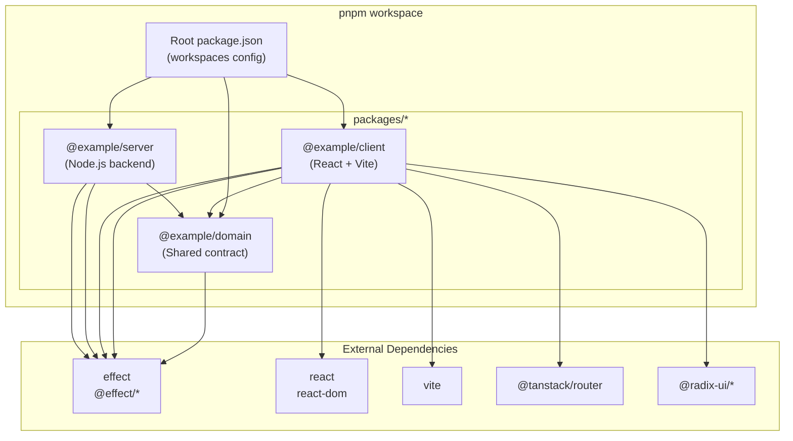
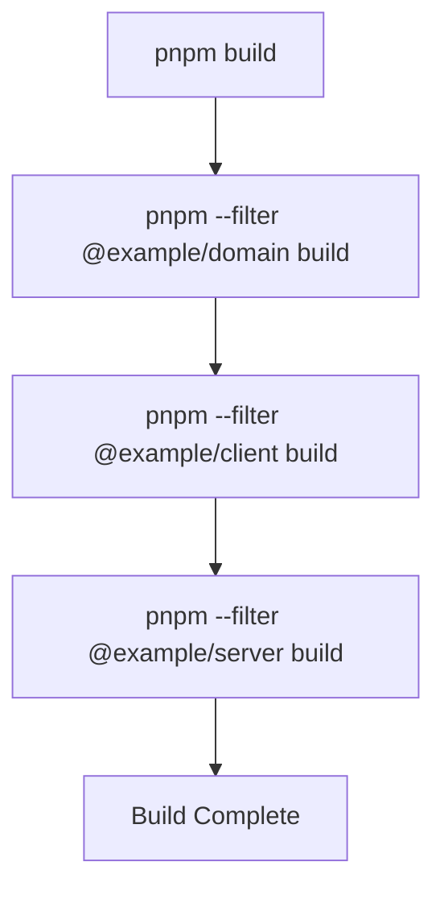
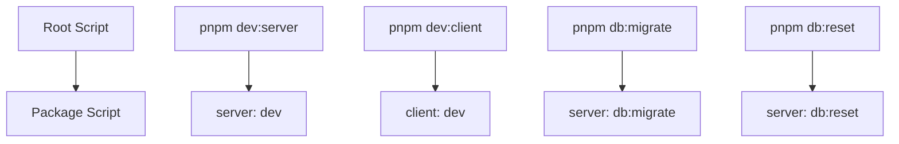
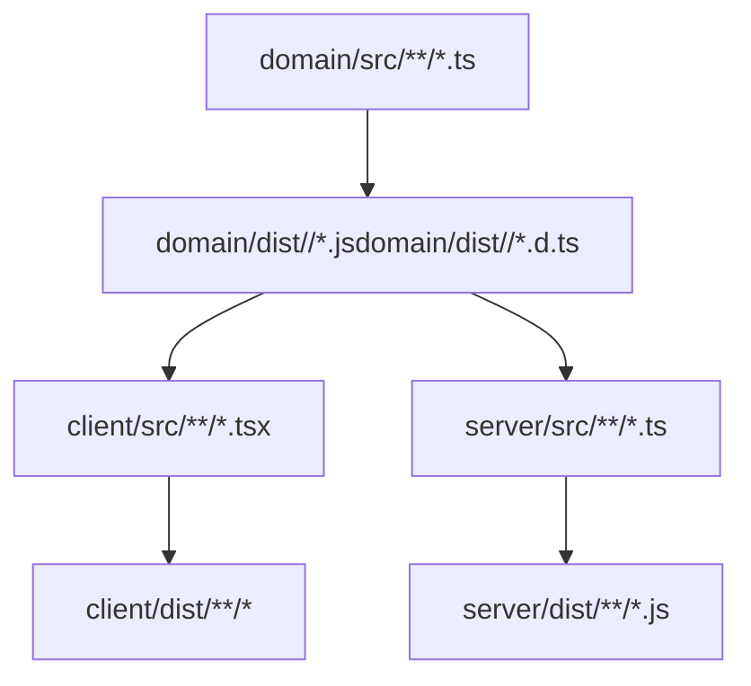
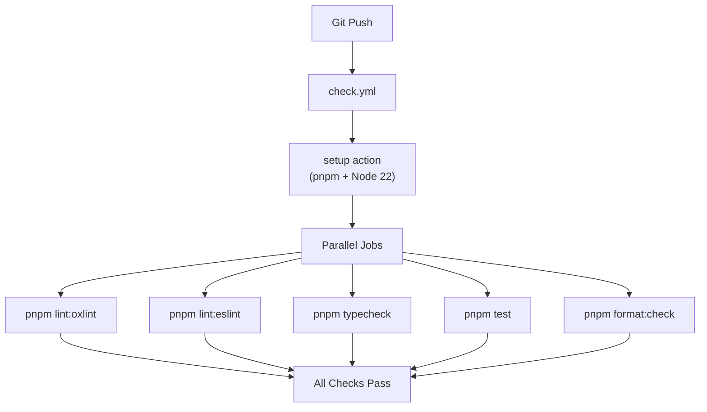

# Monorepo Structure

> **Relevant source files**
> * [package.json](https://github.com/lucas-barake/effect-file-manager/blob/28eedd82/package.json)
> * [packages/client/package.json](https://github.com/lucas-barake/effect-file-manager/blob/28eedd82/packages/client/package.json)

## Purpose and Scope

This document describes the physical organization of the Effect File Manager codebase as a pnpm workspace monorepo. It covers the three packages (`@example/domain`, `@example/client`, `@example/server`), their dependency relationships, the workspace configuration, and how build scripts coordinate across packages.

For information about the architectural patterns and how these packages interact at runtime, see [Architecture Overview](/lucas-barake/effect-file-manager/3-architecture-overview). For details on how Effect-TS is integrated throughout the codebase, see [Effect-TS Integration](/lucas-barake/effect-file-manager/3.2-effect-ts-integration).

---

## Workspace Organization

The repository uses **pnpm workspaces** to manage a monorepo containing three packages. The workspace is configured at the root [package.json L9-L10](https://github.com/lucas-barake/effect-file-manager/blob/28eedd82/package.json#L9-L10)

 with the `workspaces` field pointing to `packages/*`.

**Package Manager and Runtime Requirements:**

| Requirement | Version | Enforced By |
| --- | --- | --- |
| pnpm | 10.3.0 | [package.json L4](https://github.com/lucas-barake/effect-file-manager/blob/28eedd82/package.json#L4-L4) |
| Node.js | 22.14.0 | [package.json L6](https://github.com/lucas-barake/effect-file-manager/blob/28eedd82/package.json#L6-L6) |
| TypeScript | 5.8.3 | [package.json L45](https://github.com/lucas-barake/effect-file-manager/blob/28eedd82/package.json#L45-L45) |

These versions are strictly enforced via the `engines` field [package.json L5-L8](https://github.com/lucas-barake/effect-file-manager/blob/28eedd82/package.json#L5-L8)

 and `packageManager` field [package.json L4](https://github.com/lucas-barake/effect-file-manager/blob/28eedd82/package.json#L4-L4)

 ensuring consistent behavior across development environments.

### Workspace Dependency Management

All Effect ecosystem packages are version-pinned via pnpm overrides [package.json L48-L63](https://github.com/lucas-barake/effect-file-manager/blob/28eedd82/package.json#L48-L63)

:

```

```

This prevents version conflicts when multiple packages depend on Effect libraries, ensuring all packages use identical Effect versions throughout the monorepo.

**Sources:** [package.json L1-L68](https://github.com/lucas-barake/effect-file-manager/blob/28eedd82/package.json#L1-L68)

---

## Package Structure

### Package Dependency Graph



**Sources:** [package.json L9-L10](https://github.com/lucas-barake/effect-file-manager/blob/28eedd82/package.json#L9-L10)

 [packages/client/package.json L20](https://github.com/lucas-barake/effect-file-manager/blob/28eedd82/packages/client/package.json#L20-L20)

---

### @example/domain Package

The `@example/domain` package serves as the **shared contract layer** between client and server. It contains:

* RPC interface definitions (request/response schemas)
* Domain types (File, Folder, FileMetadata)
* Schema validators (using `@effect/schema`)
* Serialization utilities for NDJSON

**Key Characteristics:**

* **No runtime dependencies** on client or server packages
* Acts as the single source of truth for types
* Enables type-safe communication across the network boundary
* Must be built before client and server packages

**Package Location:** `packages/domain/`

**Sources:** Context from Diagram 4 (Client-Server Communication Layers)

---

### @example/client Package

The `@example/client` package contains the React frontend application built with Vite.

**Package Configuration:**

| Field | Value | Purpose |
| --- | --- | --- |
| name | `@example/client` | Package identifier |
| type | `module` | ES modules |
| version | `0.0.0` | Private package |

**Core Dependencies:**

```

```

The `workspace:^` protocol [packages/client/package.json L20](https://github.com/lucas-barake/effect-file-manager/blob/28eedd82/packages/client/package.json#L20-L20)

 links to the local domain package, ensuring the client always uses the monorepo's domain package rather than a published version.

**Build Tools:**

| Tool | Purpose |
| --- | --- |
| Vite | Development server and production bundler |
| `@vitejs/plugin-react-swc` | Fast React compilation using SWC |
| `@tanstack/router-plugin` | Type-safe route generation |
| `@tailwindcss/vite` | CSS processing |

**Scripts:**

| Script | Command | Purpose |
| --- | --- | --- |
| dev | `dotenv -e ../../.env vite` | Start dev server with root .env |
| build | `tsc -b && vite build` | Type-check then bundle |
| tsr:generate | `tsr generate` | Generate TanStack Router types |
| postinstall | `tsr generate` | Auto-generate routes after install |

**Sources:** [packages/client/package.json L1-L57](https://github.com/lucas-barake/effect-file-manager/blob/28eedd82/packages/client/package.json#L1-L57)

---

### @example/server Package

The `@example/server` package contains the Node.js backend implementing the RPC server, database layer, and business logic.

**Expected Dependencies:**

* `@example/domain` (workspace link)
* `@effect/platform-node` (Node.js platform layer)
* `@effect/rpc` (RPC server implementation)
* `@effect/sql` and `@effect/sql-pg` (PostgreSQL integration)
* `@effect/opentelemetry` (Jaeger tracing)

**Expected Scripts:**

* `dev` - Start development server with hot reload
* `build` - Compile TypeScript
* `db:migrate` - Run database migrations
* `db:reset` - Reset database schema

**Package Location:** `packages/server/`

**Sources:** Context from Diagram 1 (Overall System Architecture)

---

## Build Orchestration

### Build Script Execution Order

The root `build` script [package.json L13](https://github.com/lucas-barake/effect-file-manager/blob/28eedd82/package.json#L13-L13)

 orchestrates package builds in dependency order:



This sequential execution ensures:

1. **Domain builds first** - Generates types and schemas used by other packages
2. **Client and Server build after** - Can import compiled domain package

The `--filter` flag targets specific packages in the workspace without affecting others.

**Sources:** [package.json L13](https://github.com/lucas-barake/effect-file-manager/blob/28eedd82/package.json#L13-L13)

---

### Root Script Catalog

The root [package.json L12-L28](https://github.com/lucas-barake/effect-file-manager/blob/28eedd82/package.json#L12-L28)

 defines workspace-wide scripts that operate across all packages:

#### Type Checking

| Script | Command | Behavior |
| --- | --- | --- |
| typecheck | `tsc -b` | Build all TypeScript projects |
| check | `tsc -b` | Alias for typecheck |
| check:fast | `pnpm lint && pnpm check` | Lint + typecheck without building |

#### Linting

| Script | Command | Purpose |
| --- | --- | --- |
| lint | `pnpm lint:oxlint && pnpm lint:eslint` | Run both linters sequentially |
| lint:oxlint | `oxlint --tsconfig tsconfig.json --type-aware --quiet` | Fast Rust-based linter |
| lint:eslint | `eslint . --quiet` | Advanced rule linter |
| lint:fix | Combined fix command | Auto-fix issues |

The dual-linter strategy uses OxLint for speed and ESLint for complex rules. See [Code Quality Tools](/lucas-barake/effect-file-manager/8.1-code-quality-tools) for configuration details.

#### Testing

| Script | Command | Purpose |
| --- | --- | --- |
| test | `vitest run` | Run all tests once |
| test:watch | `vitest` | Watch mode for development |

#### Formatting

| Script | Command | Purpose |
| --- | --- | --- |
| format | `prettier --write "**/*.{...}"` | Format all files |
| format:check | `prettier --check "**/*.{...}"` | Verify formatting (CI) |

**Sources:** [package.json L12-L28](https://github.com/lucas-barake/effect-file-manager/blob/28eedd82/package.json#L12-L28)

---

### Per-Package Script Isolation

Each package defines its own scripts for package-specific operations. The root provides convenience aliases:



This pattern allows:

* Running package scripts from the root directory
* Avoiding `cd` commands during development
* Maintaining package isolation

**Sources:** [package.json L25-L28](https://github.com/lucas-barake/effect-file-manager/blob/28eedd82/package.json#L25-L28)

---

## File System Layout

```markdown
effect-file-manager/
├── .github/
│   └── workflows/           # CI/CD automation
├── packages/
│   ├── domain/              # @example/domain
│   │   ├── src/
│   │   ├── package.json
│   │   └── tsconfig.json
│   ├── client/              # @example/client
│   │   ├── src/
│   │   ├── public/
│   │   ├── package.json
│   │   ├── tsconfig.json
│   │   ├── vite.config.ts
│   │   └── tailwind.config.ts
│   └── server/              # @example/server
│       ├── src/
│       ├── package.json
│       └── tsconfig.json
├── package.json             # Workspace root
├── pnpm-workspace.yaml      # Workspace config
├── tsconfig.json            # Root TypeScript config
├── .env                     # Environment variables
├── compose.yaml             # Docker services
└── flake.nix               # Nix development env
```

### Configuration File Hierarchy

**TypeScript Compilation:**

* Root `tsconfig.json` - Workspace-wide settings and project references
* Each package has its own `tsconfig.json` extending root settings

**Package Management:**

* Root `package.json` - Workspace configuration, shared dev dependencies
* Each package `package.json` - Package-specific dependencies and scripts

**Environment Variables:**

* `.env` at root - Shared by both client and server
* Client uses `dotenv -e ../../.env` [packages/client/package.json L7](https://github.com/lucas-barake/effect-file-manager/blob/28eedd82/packages/client/package.json#L7-L7)  to load root env

**Sources:** [package.json L1-L68](https://github.com/lucas-barake/effect-file-manager/blob/28eedd82/package.json#L1-L68)

 [packages/client/package.json L7](https://github.com/lucas-barake/effect-file-manager/blob/28eedd82/packages/client/package.json#L7-L7)

---

## Inter-Package Communication

### Workspace Protocol

The `workspace:^` protocol in dependency declarations [packages/client/package.json L20](https://github.com/lucas-barake/effect-file-manager/blob/28eedd82/packages/client/package.json#L20-L20)

 creates a symbolic link to the local package:

```

```

**Behavior:**

* **Development:** Direct link to `packages/domain/` directory
* **Publishing:** Replaced with actual version range (not applicable for private monorepo)
* **Type Safety:** TypeScript resolves types from source, not compiled output

### Build-Time Dependencies



The domain package must be built before dependent packages can import its compiled types and runtime code.

**Sources:** [package.json L13](https://github.com/lucas-barake/effect-file-manager/blob/28eedd82/package.json#L13-L13)

 [packages/client/package.json L20](https://github.com/lucas-barake/effect-file-manager/blob/28eedd82/packages/client/package.json#L20-L20)

---

## Development Workflow Integration

### Local Development Flow

1. **Install dependencies:** ``` ``` * Installs all workspace packages * Creates symlinks for workspace dependencies * Runs `postinstall` hooks (e.g., TanStack Router generation in client)
2. **Start infrastructure:** ``` ``` * Starts PostgreSQL and Jaeger containers * See [Infrastructure & Observability](/lucas-barake/effect-file-manager/9-infrastructure-and-observability) for details
3. **Run migrations:** ``` ``` * Executes `@example/server`'s migration script
4. **Start development servers:** ``` ``` * Server starts on configured PORT (default 3000) * Client starts on Vite's default port (5173)

**Sources:** [package.json L25-L28](https://github.com/lucas-barake/effect-file-manager/blob/28eedd82/package.json#L25-L28)

---

## CI/CD Integration

The monorepo structure integrates with the GitHub Actions workflow defined in `.github/workflows/check.yml`:



The CI workflow leverages root-level scripts [package.json L14-L24](https://github.com/lucas-barake/effect-file-manager/blob/28eedd82/package.json#L14-L24)

 to validate all packages simultaneously without requiring manual filtering.

For complete CI/CD documentation, see [CI/CD Pipeline](/lucas-barake/effect-file-manager/8.2-cicd-pipeline).

**Sources:** [package.json L12-L28](https://github.com/lucas-barake/effect-file-manager/blob/28eedd82/package.json#L12-L28)

 Context from Diagram 5 (Development & Build Infrastructure)