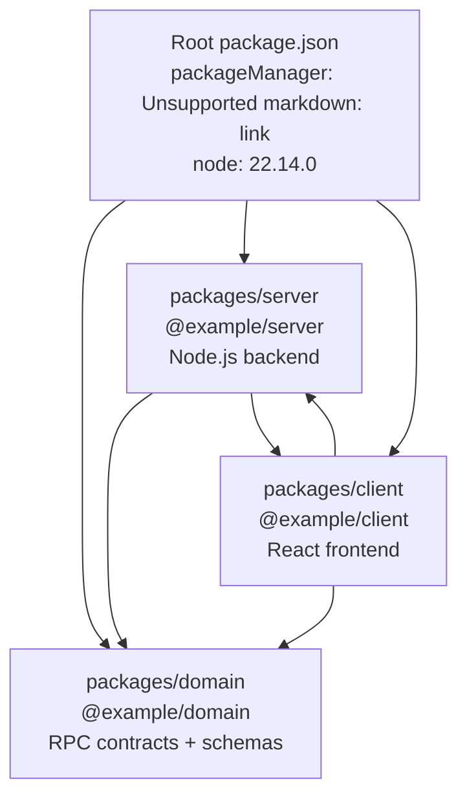
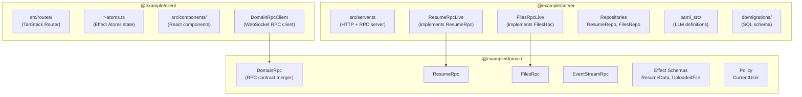
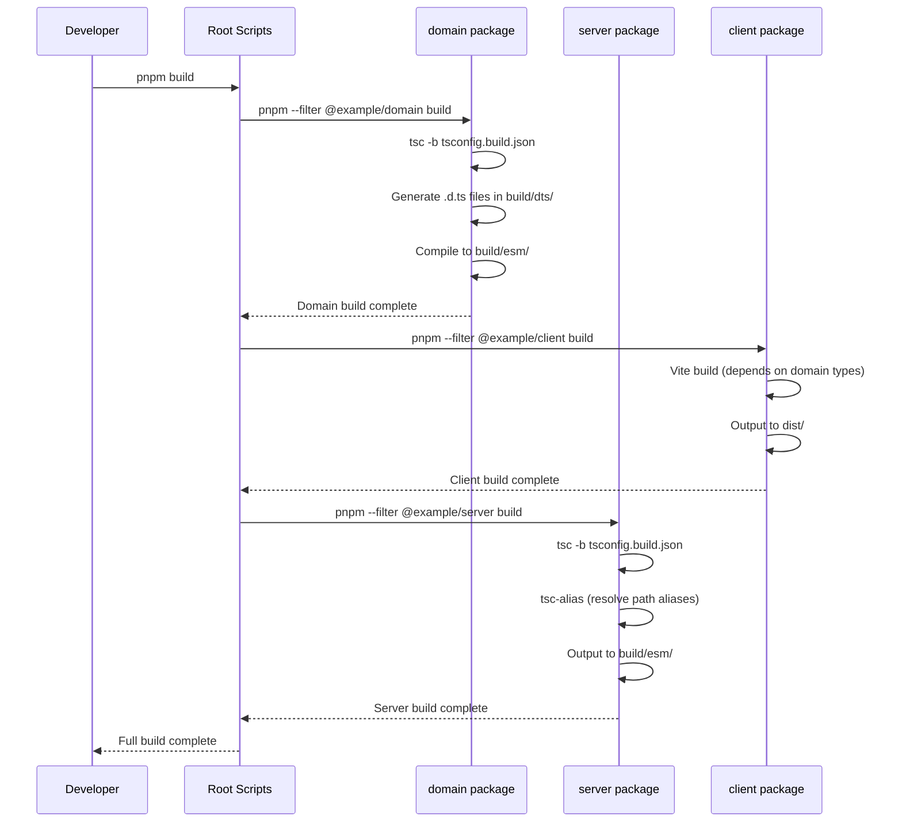
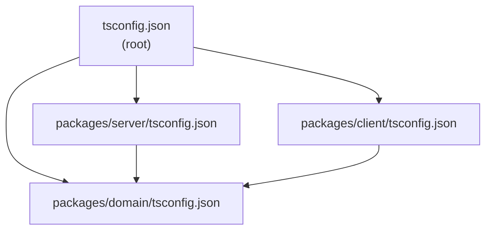
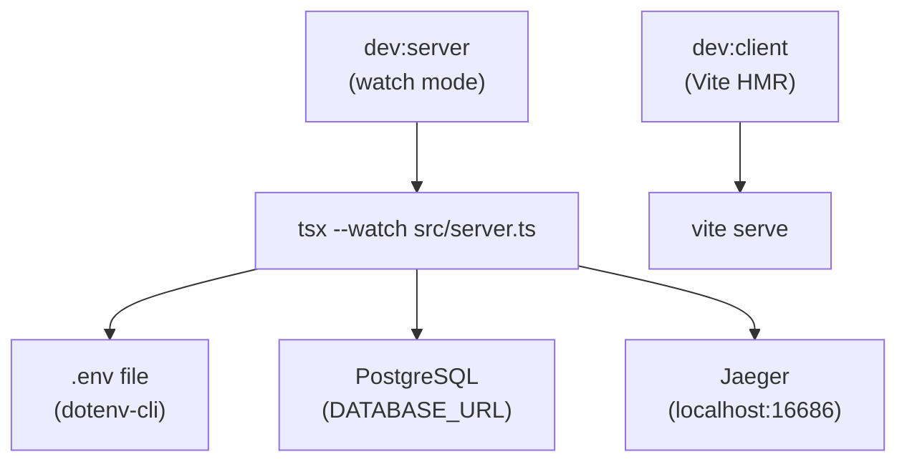
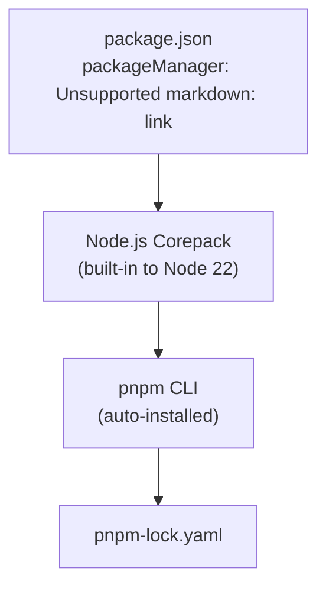

# Monorepo Structure

> **Relevant source files**
> * [.gitignore](https://github.com/oscaromsn/TalentScore/blob/428ed1eb/.gitignore)
> * [bun.lock](https://github.com/oscaromsn/TalentScore/blob/428ed1eb/bun.lock)
> * [package.json](https://github.com/oscaromsn/TalentScore/blob/428ed1eb/package.json)
> * [packages/server/package.json](https://github.com/oscaromsn/TalentScore/blob/428ed1eb/packages/server/package.json)

## Purpose and Scope

This document details the monorepo structure of the TalentScore codebase, including the pnpm workspace configuration, package organization, and build system architecture. It covers the physical layout of the three main packages (`@example/domain`, `@example/server`, `@example/client`) and how they depend on each other. For information about the technology choices within each package, see [Technology Stack](/oscaromsn/TalentScore/2.2-technology-stack). For Effect-specific patterns used across the monorepo, see [Effect Ecosystem Integration](/oscaromsn/TalentScore/2.3-effect-ecosystem-integration).

**Sources:** [package.json L1-L68](https://github.com/oscaromsn/TalentScore/blob/428ed1eb/package.json#L1-L68)

 [.gitignore L1-L37](https://github.com/oscaromsn/TalentScore/blob/428ed1eb/.gitignore#L1-L37)

---

## Workspace Configuration

The project uses **pnpm workspaces** to manage a monorepo containing three packages with unidirectional dependencies. The workspace is configured at the root level with Node.js 22.14.0 and pnpm 10.3.0 as the required package manager.



**Workspace Definition:**

The workspace configuration is declared in [package.json L9-L11](https://github.com/oscaromsn/TalentScore/blob/428ed1eb/package.json#L9-L11)

:

| Configuration | Value | Purpose |
| --- | --- | --- |
| `workspaces` | `["packages/*"]` | Discovers all packages in the `packages/` directory |
| `packageManager` | `pnpm@10.3.0` | Enforces pnpm version via Corepack |
| `engines.node` | `22.14.0` | Specifies required Node.js version |
| `engines.pnpm` | `10.3.0` | Specifies required pnpm version |

The unidirectional dependency flow ensures that `domain` has no dependencies on `server` or `client`, enabling independent development and preventing circular dependencies.

**Sources:** [package.json L4-L11](https://github.com/oscaromsn/TalentScore/blob/428ed1eb/package.json#L4-L11)

---

## Package Organization

The monorepo contains three packages organized by architectural layer. Each package has a specific role and defined dependency boundaries.

### Package Roles



| Package | Path | Purpose | Key Exports |
| --- | --- | --- | --- |
| **domain** | `packages/domain/` | Shared RPC contracts and data models | `DomainRpc`, `ResumeData`, `UploadedFile`, `ScoringMatrix` |
| **server** | `packages/server/` | Node.js backend with Effect runtime | RPC implementations, repositories, BAML integration |
| **client** | `packages/client/` | React 19 frontend with Effect Atoms | Routes, components, state management |

**Sources:** [package.json L9-L11](https://github.com/oscaromsn/TalentScore/blob/428ed1eb/package.json#L9-L11)

 [packages/server/package.json L2-L29](https://github.com/oscaromsn/TalentScore/blob/428ed1eb/packages/server/package.json#L2-L29)

### Directory Structure

The physical directory layout follows the workspace package boundaries with standardized internal organization:

```markdown
TalentScore/
├── package.json                    # Root workspace config
├── pnpm-workspace.yaml            # (implicit via package.json)
├── tsconfig.json                  # Root TypeScript config
├── .gitignore                     # Monorepo-wide ignores
│
├── packages/
│   ├── domain/
│   │   ├── package.json           # @example/domain
│   │   ├── src/
│   │   │   ├── resume-rpc.ts      # ResumeRpc contract
│   │   │   ├── files-rpc.ts       # FilesRpc contract
│   │   │   ├── domain-rpc.ts      # Merged DomainRpc
│   │   │   ├── resume-data.ts     # Resume schemas
│   │   │   └── files-data.ts      # File schemas
│   │   └── build/                 # Compiled output
│   │
│   ├── server/
│   │   ├── package.json           # @example/server
│   │   ├── src/
│   │   │   ├── server.ts          # HTTP server entry point
│   │   │   ├── resume-rpc-live.ts # ResumeRpc implementation
│   │   │   ├── files-rpc-live.ts  # FilesRpc implementation
│   │   │   ├── db/
│   │   │   │   ├── migrations/    # SQL migration files
│   │   │   │   ├── repositories/  # Data access layer
│   │   │   │   └── scripts/       # DB utilities
│   │   │   └── services/          # Business logic
│   │   ├── baml_src/              # BAML LLM definitions
│   │   │   ├── resume.baml        # Resume extraction schema
│   │   │   └── clients.baml       # LLM client configs
│   │   └── build/                 # Compiled output
│   │
│   └── client/
│       ├── package.json           # @example/client
│       ├── src/
│       │   ├── routes/            # TanStack Router routes
│       │   ├── components/        # React components
│       │   ├── lib/               # Atoms and utilities
│       │   └── main.tsx           # Vite entry point
│       ├── dist/                  # Build output (Vite)
│       └── index.html             # HTML template
```

**Sources:** [.gitignore L3-L7](https://github.com/oscaromsn/TalentScore/blob/428ed1eb/.gitignore#L3-L7)

 [.gitignore L16-L17](https://github.com/oscaromsn/TalentScore/blob/428ed1eb/.gitignore#L16-L17)

 [.gitignore L30-L31](https://github.com/oscaromsn/TalentScore/blob/428ed1eb/.gitignore#L30-L31)

---

## Build System

The build system uses **TypeScript with project references** to enable incremental compilation across packages. Each package has its own `tsconfig.json` that references its dependencies.

### Build Process Flow



### Build Configuration

The root-level build script in [package.json L13](https://github.com/oscaromsn/TalentScore/blob/428ed1eb/package.json#L13-L13)

 orchestrates the build in dependency order:

```
pnpm --filter @example/domain build && 
pnpm --filter @example/client build && 
pnpm --filter @example/server build
```

| Package | Build Command | Output Directory | Key Build Steps |
| --- | --- | --- | --- |
| `domain` | `tsc -b tsconfig.build.json` | `build/dts/` (types), `build/esm/` (JS) | TypeScript compilation only |
| `server` | `tsc -b && tsc-alias` | `build/esm/` | TypeScript + path alias resolution |
| `client` | `vite build` | `dist/` | Vite bundling with Rollup |

**Server Build Details:**

The server package uses `tsc-alias` to resolve TypeScript path mappings (e.g., `@/lib/*`) after compilation. See [packages/server/package.json L15](https://github.com/oscaromsn/TalentScore/blob/428ed1eb/packages/server/package.json#L15-L15)

 for the build command:

```

```

**Sources:** [package.json L13](https://github.com/oscaromsn/TalentScore/blob/428ed1eb/package.json#L13-L13)

 [packages/server/package.json L14-L15](https://github.com/oscaromsn/TalentScore/blob/428ed1eb/packages/server/package.json#L14-L15)

### TypeScript Configuration Strategy

The monorepo uses **TypeScript project references** for incremental builds and cross-package type checking:



The root `typecheck` script runs `tsc -b` to type-check all packages in dependency order. See [package.json L14](https://github.com/oscaromsn/TalentScore/blob/428ed1eb/package.json#L14-L14)

**Sources:** [package.json L14](https://github.com/oscaromsn/TalentScore/blob/428ed1eb/package.json#L14-L14)

---

## Dependency Management

The monorepo uses **pnpm overrides** to pin all Effect ecosystem packages to synchronized versions, preventing version conflicts in the workspace.

### Version Overrides

The [package.json L53-L67](https://github.com/oscaromsn/TalentScore/blob/428ed1eb/package.json#L53-L67)

 section pins critical dependencies:

| Category | Packages | Pinned Version | Reason |
| --- | --- | --- | --- |
| **Effect Core** | `effect` | `3.19.8` | Core runtime compatibility |
| **Platform** | `@effect/platform``@effect/platform-node``@effect/platform-browser` | `0.93.6``0.103.0``0.73.0` | Platform abstraction sync |
| **SQL** | `@effect/sql``@effect/sql-pg` | `0.48.6``0.49.7` | Database driver compatibility |
| **RPC** | `@effect/rpc` | `0.72.2` | Client-server contract sync |
| **Atoms** | `@effect-atom/atom``@effect-atom/atom-react` | `0.4.7``0.4.2` | State management compatibility |
| **Observability** | `@effect/opentelemetry` | `0.59.1` | Tracing integration |
| **Testing** | `@effect/vitest` | `0.27.0` | Test framework integration |

**Workspace Dependency Resolution:**

Server package dependencies use workspace protocol in [packages/server/package.json L23-L34](https://github.com/oscaromsn/TalentScore/blob/428ed1eb/packages/server/package.json#L23-L34)

:

```

```

This ensures the server always uses the local `domain` package build, enabling type-safe development without publishing.

**Sources:** [package.json L53-L67](https://github.com/oscaromsn/TalentScore/blob/428ed1eb/package.json#L53-L67)

 [packages/server/package.json L29](https://github.com/oscaromsn/TalentScore/blob/428ed1eb/packages/server/package.json#L29-L29)

### Global Dependencies

Root-level dependencies in [package.json L49-L51](https://github.com/oscaromsn/TalentScore/blob/428ed1eb/package.json#L49-L51)

 are hoisted to all workspaces:

```

```

These packages are used across multiple workspace packages (BAML in server, Tailwind in client).

**Sources:** [package.json L49-L51](https://github.com/oscaromsn/TalentScore/blob/428ed1eb/package.json#L49-L51)

---

## Development Scripts

The root package provides convenience scripts that orchestrate operations across packages using `pnpm --filter` to target specific workspaces.

### Core Development Commands



| Script | Command | Purpose |
| --- | --- | --- |
| `dev:server` | `pnpm --filter @example/server dev` | Runs server in watch mode with `tsx --watch` |
| `dev:client` | `pnpm --filter @example/client dev` | Starts Vite dev server with HMR |
| `build` | Sequential filter commands | Builds all packages in dependency order |
| `db:migrate` | `pnpm --filter @example/server db:migrate` | Runs database migrations |
| `db:reset` | `pnpm --filter @example/server db:reset` | Drops and recreates database schema |
| `baml:generate` | `bunx baml-cli generate` | Generates TypeScript LLM client from `.baml` files |

**Sources:** [package.json L12-L29](https://github.com/oscaromsn/TalentScore/blob/428ed1eb/package.json#L12-L29)

 [packages/server/package.json L17-L20](https://github.com/oscaromsn/TalentScore/blob/428ed1eb/packages/server/package.json#L17-L20)

### Code Quality Commands

| Script | Tools | Purpose |
| --- | --- | --- |
| `lint` | `oxlint` + `eslint` | Runs both linters (oxlint first for performance) |
| `lint:fix` | `oxlint --fix` + `eslint --fix` | Auto-fixes linting issues |
| `typecheck` | `tsc -b` | Type-checks all packages via project references |
| `test` | `vitest run` | Runs all tests across workspaces |
| `test:watch` | `vitest` | Runs tests in watch mode |
| `format` | `prettier --write` | Formats all code files |
| `format:check` | `prettier --check` | Verifies code formatting in CI |

The `check:fast` script [package.json L16](https://github.com/oscaromsn/TalentScore/blob/428ed1eb/package.json#L16-L16)

 combines linting and type-checking for rapid feedback:

```

```

**Sources:** [package.json L14-L24](https://github.com/oscaromsn/TalentScore/blob/428ed1eb/package.json#L14-L24)

### BAML Code Generation

The `baml:generate` script [package.json L29](https://github.com/oscaromsn/TalentScore/blob/428ed1eb/package.json#L29-L29)

 generates TypeScript clients from BAML definitions:

```

```

This reads `.baml` files in `packages/server/baml_src/` and outputs generated code to `packages/server/baml_client/`. The generated directory is gitignored (see [.gitignore L30-L31](https://github.com/oscaromsn/TalentScore/blob/428ed1eb/.gitignore#L30-L31)

) and must be regenerated after modifying BAML schemas.

**Sources:** [package.json L29](https://github.com/oscaromsn/TalentScore/blob/428ed1eb/package.json#L29-L29)

 [.gitignore L30-L31](https://github.com/oscaromsn/TalentScore/blob/428ed1eb/.gitignore#L30-L31)

---

## Build Artifacts and Gitignore Strategy

The [.gitignore L1-L37](https://github.com/oscaromsn/TalentScore/blob/428ed1eb/.gitignore#L1-L37)

 file defines monorepo-wide ignore patterns for build artifacts, dependencies, and generated code.

### Ignored Directories by Category

| Category | Patterns | Purpose |
| --- | --- | --- |
| **Dependencies** | `node_modules/` | pnpm-installed packages (workspace + package-level) |
| **Build Outputs** | `dist/`, `build/`, `*.tsbuildinfo` | TypeScript compilation artifacts |
| **Generated Code** | `baml_client/` | BAML-generated TypeScript clients |
| **Environment** | `.env`, `.env.local`, `.env.*.local` | Secrets and local overrides |
| **Development Tools** | `.direnv/`, `.idea/`, `tmp/` | IDE and shell configurations |
| **Coverage** | `coverage/` | Test coverage reports |
| **Client Artifacts** | `stats.html` | Vite bundle analyzer output |

**BAML Generated Code Strategy:**

The `baml_client/` directory [.gitignore L31](https://github.com/oscaromsn/TalentScore/blob/428ed1eb/.gitignore#L31-L31)

 is generated during the build process and should be regenerated via `pnpm baml:generate` after:

* Modifying `.baml` schema files
* Changing LLM client configurations
* Updating BAML CLI version

**Sources:** [.gitignore L1-L37](https://github.com/oscaromsn/TalentScore/blob/428ed1eb/.gitignore#L1-L37)

---

## Package Manager Configuration

The project enforces **pnpm 10.3.0** via Corepack, ensuring consistent dependency resolution across development environments.

### Enforcement Mechanism



When any pnpm command is run, Corepack verifies the version matches [package.json L4](https://github.com/oscaromsn/TalentScore/blob/428ed1eb/package.json#L4-L4)

:

```

```

If the installed version doesn't match, Corepack automatically downloads and activates the correct version.

**Node.js Version Enforcement:**

The [package.json L5-L8](https://github.com/oscaromsn/TalentScore/blob/428ed1eb/package.json#L5-L8)

 `engines` field documents required versions but does not enforce them without additional tooling (e.g., `.nvmrc`, `volta`):

```

```

**Sources:** [package.json L4-L8](https://github.com/oscaromsn/TalentScore/blob/428ed1eb/package.json#L4-L8)