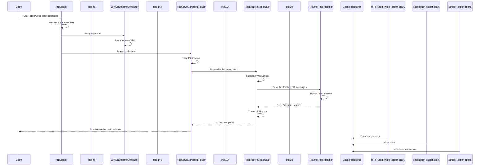
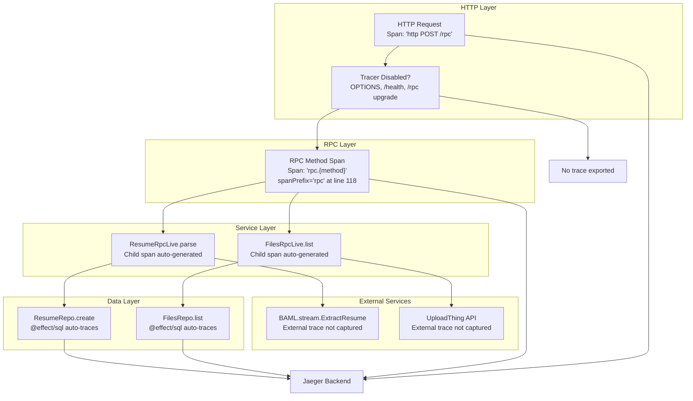

# Observability and Debugging

> **Relevant source files**
> * [README.md](https://github.com/oscaromsn/TalentScore/blob/428ed1eb/README.md)
> * [packages/server/src/db/migrations/sql/_schema.sql](https://github.com/oscaromsn/TalentScore/blob/428ed1eb/packages/server/src/db/migrations/sql/_schema.sql)
> * [packages/server/src/server.ts](https://github.com/oscaromsn/TalentScore/blob/428ed1eb/packages/server/src/server.ts)

## Purpose and Scope

This document explains the observability and debugging infrastructure in TalentScore. It covers distributed tracing via OpenTelemetry/Jaeger, structured logging for HTTP and RPC requests, and practical workflows for debugging server-side operations. For information about the overall server architecture, see [HTTP and RPC Server Setup](/oscaromsn/TalentScore/4.1-http-and-rpc-server-setup). For build and runtime commands, see [Build and Development Commands](/oscaromsn/TalentScore/6.2-build-and-development-commands).

---

## Tracing Infrastructure

TalentScore implements distributed tracing using the **Effect OpenTelemetry** integration, which exports traces to a **Jaeger** backend running in Docker. Every server-side operation automatically generates trace spans that can be visualized in the Jaeger UI.

### OpenTelemetry Integration

The tracing layer is configured in [packages/server/src/server.ts L27-L41](https://github.com/oscaromsn/TalentScore/blob/428ed1eb/packages/server/src/server.ts#L27-L41)

 using the `OtlpTracer.layer` from `@effect/opentelemetry/OtlpTracer`. The configuration is built dynamically from environment variables:

| Configuration | Default Value | Environment Variable |
| --- | --- | --- |
| OTLP Endpoint | `http://localhost:4318/v1/traces` | `OTLP_URL` |
| Service Name | `effect-files-example-api` | (hardcoded) |
| Export Interval | 1 second | (hardcoded) |
| Max Batch Size | 100 spans | (hardcoded) |

The tracer layer is provided to the entire HTTP server at [packages/server/src/server.ts L159](https://github.com/oscaromsn/TalentScore/blob/428ed1eb/packages/server/src/server.ts#L159-L159)

 ensuring all Effect operations are instrumented. The `FetchHttpClient.layer` is required as a dependency for making OTLP export requests.

**Sources:** [packages/server/src/server.ts L27-L41](https://github.com/oscaromsn/TalentScore/blob/428ed1eb/packages/server/src/server.ts#L27-L41)

 [packages/server/src/server.ts L159](https://github.com/oscaromsn/TalentScore/blob/428ed1eb/packages/server/src/server.ts#L159-L159)

---

### Jaeger Backend Configuration

Jaeger runs as a Docker service defined in `docker-compose.yml` with the following characteristics:

* **All-in-one image:** Includes collector, query service, and UI
* **Port 16686:** Web UI for viewing traces
* **Port 4318:** OTLP HTTP receiver for trace ingestion
* **Storage:** In-memory (traces cleared on restart)

To access the Jaeger UI during development:

```yaml
http://localhost:16686
```

The UI allows searching traces by service name, operation name, tags, or trace ID. Trace IDs are logged by the server and can be used to jump directly to specific request traces.

**Sources:** [README.md L85](https://github.com/oscaromsn/TalentScore/blob/428ed1eb/README.md#L85-L85)

 [packages/server/src/server.ts L27-L41](https://github.com/oscaromsn/TalentScore/blob/428ed1eb/packages/server/src/server.ts#L27-L41)

---

## Trace and Log Correlation Architecture

```

```

This diagram shows how traces and logs flow through the system. The `httpLogger` middleware at the entry point establishes the trace context, which propagates through all child operations. Both logs and trace spans are annotated with the same trace ID, enabling correlation between console output and visual trace timelines in Jaeger.

**Sources:** [packages/server/src/server.ts L45-L84](https://github.com/oscaromsn/TalentScore/blob/428ed1eb/packages/server/src/server.ts#L45-L84)

 [packages/server/src/server.ts L90-L112](https://github.com/oscaromsn/TalentScore/blob/428ed1eb/packages/server/src/server.ts#L90-L112)

---

## Logging System

TalentScore implements two layers of structured logging: HTTP request/response logging and RPC method-level logging. Both use Effect's annotation system to attach metadata to log entries.

### HTTP Request Logging

The `httpLogger` middleware at [packages/server/src/server.ts L45-L84](https://github.com/oscaromsn/TalentScore/blob/428ed1eb/packages/server/src/server.ts#L45-L84)

 intercepts all HTTP requests and logs:

**Success Path:**

* Message: `"Sent HTTP response"`
* Annotations: * `http.method`: Request method (GET, POST, etc.) * `http.url`: Full request URL * `http.status`: Response status code

**Failure Path:**

* Message: The error cause or `"Sent HTTP Response"` if cause is stripped
* Same annotations as success path
* 404 errors are silently ignored (line 58)

The middleware uses `Effect.withLogSpan` to group logs hierarchically with a counter-based span name (`http.span.1`, `http.span.2`, etc.). This enables filtering logs by individual request spans.

**Special Cases:**

* **OPTIONS requests:** Tracing disabled (line 143)
* **/health endpoint:** Tracing disabled (line 143)
* **/rpc endpoint:** Tracing disabled for WebSocket upgrade (line 143)

**Sources:** [packages/server/src/server.ts L45-L84](https://github.com/oscaromsn/TalentScore/blob/428ed1eb/packages/server/src/server.ts#L45-L84)

 [packages/server/src/server.ts L142-L144](https://github.com/oscaromsn/TalentScore/blob/428ed1eb/packages/server/src/server.ts#L142-L144)

---

### RPC Method Logging

The `RpcLogger` middleware at [packages/server/src/server.ts L90-L112](https://github.com/oscaromsn/TalentScore/blob/428ed1eb/packages/server/src/server.ts#L90-L112)

 provides method-level observability for all RPC calls. It is implemented as an Effect RPC middleware tag and logs only failures:

**Logged Information:**

* Message: `"RPC request failed: {method_name}"`
* Cause: Full Effect cause chain (includes stack traces)
* Annotations: * `rpc.method`: The RPC method tag (e.g., `"resume_parse"`, `"files_list"`) * `rpc.clientId`: Unique client identifier from WebSocket connection

**Why Only Failures?**
The middleware uses `Effect.logError` only in the `onFailure` branch (lines 101-108). Successful RPC calls are traced via OpenTelemetry but not logged to reduce console noise. This follows the principle that logs should capture exceptional events, while traces capture all operations.

The `RpcLogger` is applied to the entire `DomainRpc` at [packages/server/src/server.ts L115](https://github.com/oscaromsn/TalentScore/blob/428ed1eb/packages/server/src/server.ts#L115-L115)

 via the `.middleware()` method, ensuring all handlers inherit this behavior.

**Sources:** [packages/server/src/server.ts L90-L112](https://github.com/oscaromsn/TalentScore/blob/428ed1eb/packages/server/src/server.ts#L90-L112)

 [packages/server/src/server.ts L115](https://github.com/oscaromsn/TalentScore/blob/428ed1eb/packages/server/src/server.ts#L115-L115)

---

### Log Level Configuration

The global log level is configured at [packages/server/src/server.ts L43](https://github.com/oscaromsn/TalentScore/blob/428ed1eb/packages/server/src/server.ts#L43-L43)

:

```javascript
const LoggingLevelLive = Logger.minimumLogLevel(LogLevel.Debug);
```

This sets the minimum level to `Debug`, which means:

* `Debug`, `Info`, `Warning`, `Error`, `Fatal` logs are displayed
* `Trace` level logs are suppressed

The log level layer is provided to the entire server at [packages/server/src/server.ts L160](https://github.com/oscaromsn/TalentScore/blob/428ed1eb/packages/server/src/server.ts#L160-L160)

 To change the log level, modify the `LogLevel` enum value. Available levels (from most to least verbose):

| Level | Typical Use |
| --- | --- |
| `Trace` | Ultra-verbose debugging (internal library calls) |
| `Debug` | Development debugging (current default) |
| `Info` | Informational messages (production events) |
| `Warning` | Recoverable issues |
| `Error` | Request failures |
| `Fatal` | Unrecoverable system failures |

**Sources:** [packages/server/src/server.ts L43](https://github.com/oscaromsn/TalentScore/blob/428ed1eb/packages/server/src/server.ts#L43-L43)

 [packages/server/src/server.ts L160](https://github.com/oscaromsn/TalentScore/blob/428ed1eb/packages/server/src/server.ts#L160-L160)

---

## Span Name Generation and Context Propagation



This sequence demonstrates how span names are generated and how trace context propagates through the middleware stack. The `withSpanNameGenerator` at [packages/server/src/server.ts L146-L157](https://github.com/oscaromsn/TalentScore/blob/428ed1eb/packages/server/src/server.ts#L146-L157)

 parses the request URL to extract a clean pathname, handling malformed URLs gracefully by returning `"[unparseable_url_path]"`.

**Key Behaviors:**

* HTTP spans use format: `"http {METHOD} {PATH}"`
* RPC spans are prefixed with `"rpc."` (configured at line 118)
* Child spans inherit parent trace ID
* Span export happens asynchronously every 1 second (batch mode)

**Sources:** [packages/server/src/server.ts L146-L157](https://github.com/oscaromsn/TalentScore/blob/428ed1eb/packages/server/src/server.ts#L146-L157)

 [packages/server/src/server.ts L114-L124](https://github.com/oscaromsn/TalentScore/blob/428ed1eb/packages/server/src/server.ts#L114-L124)

---

## Debugging Workflows

### Using Jaeger UI to Diagnose Issues

The Jaeger UI provides several views for analyzing system behavior:

**1. Search View (Landing Page)**

* **Service Dropdown:** Select `effect-files-example-api`
* **Operation Filter:** Filter by span name (e.g., `"rpc.resume_parse"`)
* **Tags Filter:** Filter by custom tags like `rpc.method=resume_parse`
* **Lookback:** Default 1 hour, adjustable for historical analysis

**2. Trace Detail View**

* **Timeline:** Visual representation of span durations
* **Parent-Child Relationships:** Indentation shows call hierarchy
* **Span Tags:** Click any span to see annotations (method, status, etc.)
* **Logs:** Effect logs attached to spans appear in the "Logs" tab

**3. Trace Comparison**

* Compare slow requests to fast requests
* Identify which spans contribute most to latency
* Useful for performance regression analysis

**Common Search Patterns:**

| Goal | Jaeger Query |
| --- | --- |
| Find all resume parsing traces | `operation="rpc.resume_parse"` |
| Find failed RPC calls | `error=true` |
| Find traces for specific user | `rpc.clientId=<client_id>` |
| Find database-heavy operations | `operation=~".*sql.*"` (regex) |

**Sources:** [README.md L85](https://github.com/oscaromsn/TalentScore/blob/428ed1eb/README.md#L85-L85)

 [packages/server/src/server.ts L27-L41](https://github.com/oscaromsn/TalentScore/blob/428ed1eb/packages/server/src/server.ts#L27-L41)

---

### Correlating Console Logs with Jaeger Traces

When debugging a specific request, follow this workflow:

**Step 1: Identify the Trace ID**

Console logs include trace annotations. Example log output:

```yaml
[2024-01-15 10:23:45] INFO: Sent HTTP response
  http.method: POST
  http.url: /rpc
  http.status: 200
  trace_id: 7f9a2b3c4d5e6f7g
```

**Step 2: Search in Jaeger**

1. Open Jaeger UI: `http://localhost:16686`
2. Click "Search" tab
3. Paste trace ID in "Trace ID" field
4. Click "Find Traces"

**Step 3: Navigate the Trace**

The trace view shows:

* **Root Span:** HTTP request (line 45 middleware)
* **Child Spans:** RPC method calls, DB queries, BAML invocations
* **Duration:** Each span's execution time
* **Tags/Logs:** Metadata like SQL queries, error messages

**Step 4: Identify Bottlenecks**

Look for:

* **Long-duration spans:** Operations taking >1s
* **Retry patterns:** Multiple spans for the same operation (BAML retries)
* **Database N+1:** Many DB query spans in sequence
* **Error flags:** Spans marked with `error=true`

**Sources:** [packages/server/src/server.ts L45-L84](https://github.com/oscaromsn/TalentScore/blob/428ed1eb/packages/server/src/server.ts#L45-L84)

 [packages/server/src/server.ts L90-L112](https://github.com/oscaromsn/TalentScore/blob/428ed1eb/packages/server/src/server.ts#L90-L112)

---

## Common Debugging Scenarios

### Scenario 1: Resume Parsing Hangs or Times Out

**Symptoms:**

* Client shows "Parsing..." indefinitely
* No "Complete" event received

**Debugging Steps:**

1. **Check Console Logs for RPC Errors:** ``` RPC request failed: resume_parse ``` Look for error cause (BAML timeout, LLM API failure, etc.)
2. **Search Jaeger for the Trace:** * Operation: `rpc.resume_parse` * Filter by time range when the hang occurred
3. **Inspect BAML Spans:** * Look for `b.stream.ExtractResume` child spans * Check duration (should be <30s for typical resumes) * If missing, BAML likely failed before streaming started
4. **Check LLM API Errors:** * BAML logs errors to console * Common issues: API key invalid, rate limit exceeded, model unavailable

**Sources:** [packages/server/src/public/resume/resume-rpc-live.ts](https://github.com/oscaromsn/TalentScore/blob/428ed1eb/packages/server/src/public/resume/resume-rpc-live.ts)

 [packages/server/baml_src/resume.baml](https://github.com/oscaromsn/TalentScore/blob/428ed1eb/packages/server/baml_src/resume.baml)

---

### Scenario 2: File Upload Succeeds but File Not Appearing

**Symptoms:**

* UploadThing reports success
* Client polls `getFilesByKeys` but file not found
* Syncing phase times out after 10 seconds

**Debugging Steps:**

1. **Verify Database State:** Connect to PostgreSQL and query: ```sql SELECT * FROM files WHERE uploadthing_key = '<key>'; ```
2. **Check Jaeger for `files_getFilesByKeys`:** * Find traces for polling attempts * Check if SQL query returns empty results * Look for SQL errors or constraint violations
3. **Check UploadThing Webhook:** * UploadThing may not have sent webhook yet * File registered in S3 but not in database * Solution: Implement webhook handler or increase polling timeout
4. **Check User ID Mismatch:** * Files are scoped by `user_id` * Verify client is authenticated with correct user * Check `CurrentUserRpcMiddleware` logs

**Sources:** [packages/server/src/public/files/files-repo.ts](https://github.com/oscaromsn/TalentScore/blob/428ed1eb/packages/server/src/public/files/files-repo.ts)

 [packages/server/src/db/migrations/sql/_schema.sql L13-L25](https://github.com/oscaromsn/TalentScore/blob/428ed1eb/packages/server/src/db/migrations/sql/_schema.sql#L13-L25)

---

### Scenario 3: Slow RPC Performance

**Symptoms:**

* RPC methods taking >2s to respond
* UI feels laggy

**Debugging Steps:**

1. **Profile with Jaeger:** * Search for operation: `"http POST /rpc"` * Sort traces by duration (longest first) * Click slowest trace
2. **Identify Bottleneck Span:** Common culprits: * **Database Queries:** Slow joins or missing indexes * **BAML Calls:** LLM latency or retries * **File I/O:** Large PDF downloads from UploadThing
3. **Database Query Optimization:** * Check for sequential N+1 queries (should be batched) * Verify indexes exist on `user_id`, `folder_id`, `uploadthing_key` * Run `EXPLAIN ANALYZE` on slow SQL queries
4. **BAML Retry Tuning:** * Check `baml_src/clients.baml` for retry policies * Exponential backoff may amplify LLM API slowness * Consider using faster models for initial extraction

**Sources:** [packages/server/src/db/migrations/sql/_schema.sql L27-L30](https://github.com/oscaromsn/TalentScore/blob/428ed1eb/packages/server/src/db/migrations/sql/_schema.sql#L27-L30)

 [packages/server/baml_src/clients.baml](https://github.com/oscaromsn/TalentScore/blob/428ed1eb/packages/server/baml_src/clients.baml)

---

## Trace Propagation Through the Stack



This diagram maps the trace propagation hierarchy. Note that:

* **HTTP upgrade requests** for WebSocket RPC are not traced (line 143)
* **External service calls** (BAML, UploadThing) do not propagate traces automatically
* **@effect/sql** automatically creates spans for SQL queries
* **Span names** are determined by `spanPrefix` configuration and middleware names

**Sources:** [packages/server/src/server.ts L114-L124](https://github.com/oscaromsn/TalentScore/blob/428ed1eb/packages/server/src/server.ts#L114-L124)

 [packages/server/src/server.ts L142-L144](https://github.com/oscaromsn/TalentScore/blob/428ed1eb/packages/server/src/server.ts#L142-L144)

---

## Performance Monitoring Best Practices

### Understanding Span Durations

When analyzing performance in Jaeger, focus on:

**1. Self-Time vs. Total Time**

* **Total Time:** Span duration including all children
* **Self Time:** Time spent in the span itself (excluding children)
* High self-time indicates the operation itself is slow, not its dependencies

**2. Critical Path Analysis**

* Identify the longest sequential path through the trace
* This represents the minimum possible request duration
* Parallelize operations outside the critical path

**3. Batch Size Configuration**

* Tracer exports 100 spans per batch (line 38)
* If spans are lost, increase `maxBatchSize`
* If export is slow, decrease batch size or increase interval

**Sources:** [packages/server/src/server.ts L32-L39](https://github.com/oscaromsn/TalentScore/blob/428ed1eb/packages/server/src/server.ts#L32-L39)

---

### Identifying Common Bottlenecks

| Bottleneck Type | Span Name Pattern | Mitigation |
| --- | --- | --- |
| Database Connection Pool | Long gaps between SQL spans | Increase pool size in connection config |
| LLM API Latency | `b.stream.ExtractResume` >10s | Use faster models or implement caching |
| File Download | UploadThing fetch spans >2s | Implement CDN or local caching |
| N+1 Database Queries | Many sequential SQL spans | Use SQL joins or batch queries |
| Retry Storms | Multiple identical spans | Tune retry policies in BAML config |

**Sources:** [packages/server/baml_src/clients.baml](https://github.com/oscaromsn/TalentScore/blob/428ed1eb/packages/server/baml_src/clients.baml)

 [packages/server/src/public/resume/resume-rpc-live.ts](https://github.com/oscaromsn/TalentScore/blob/428ed1eb/packages/server/src/public/resume/resume-rpc-live.ts)

---

## Production Considerations

### Disabling Verbose Logging

In production, change the log level to `Info` or `Warning`:

```javascript
const LoggingLevelLive = Logger.minimumLogLevel(LogLevel.Info);
```

This suppresses `Debug` logs while retaining error visibility.

### Trace Sampling

For high-traffic production systems, consider implementing sampling:

* **Head-based sampling:** Sample before trace starts (via OTLP config)
* **Tail-based sampling:** Keep all error traces, sample success traces
* Effect does not currently support built-in sampling; implement at OTLP collector level

### OTLP Exporter Configuration

For production, use a dedicated OTLP collector instead of direct Jaeger export:

* Set `OTLP_URL` to collector endpoint (e.g., `https://otel-collector.prod.example.com/v1/traces`)
* Collector can buffer, batch, and route to multiple backends (Jaeger, Honeycomb, Datadog)
* Adds resilience if observability backend is down

**Sources:** [packages/server/src/server.ts L27-L41](https://github.com/oscaromsn/TalentScore/blob/428ed1eb/packages/server/src/server.ts#L27-L41)

 [packages/server/src/server.ts L43](https://github.com/oscaromsn/TalentScore/blob/428ed1eb/packages/server/src/server.ts#L43-L43)

---

## Summary

TalentScore's observability stack provides:

* **Automatic distributed tracing** via Effect OpenTelemetry integration
* **Structured logging** with trace correlation for HTTP and RPC layers
* **Visual debugging** through Jaeger UI for understanding request flow
* **Performance analysis** capabilities for identifying bottlenecks

All server operations are automatically instrumented. To debug issues:

1. Check console logs for error messages and trace IDs
2. Search Jaeger using the trace ID or operation name
3. Analyze span durations and error flags
4. Correlate findings with database state and external service logs

**Sources:** [packages/server/src/server.ts L27-L164](https://github.com/oscaromsn/TalentScore/blob/428ed1eb/packages/server/src/server.ts#L27-L164)

 [README.md L85](https://github.com/oscaromsn/TalentScore/blob/428ed1eb/README.md#L85-L85)