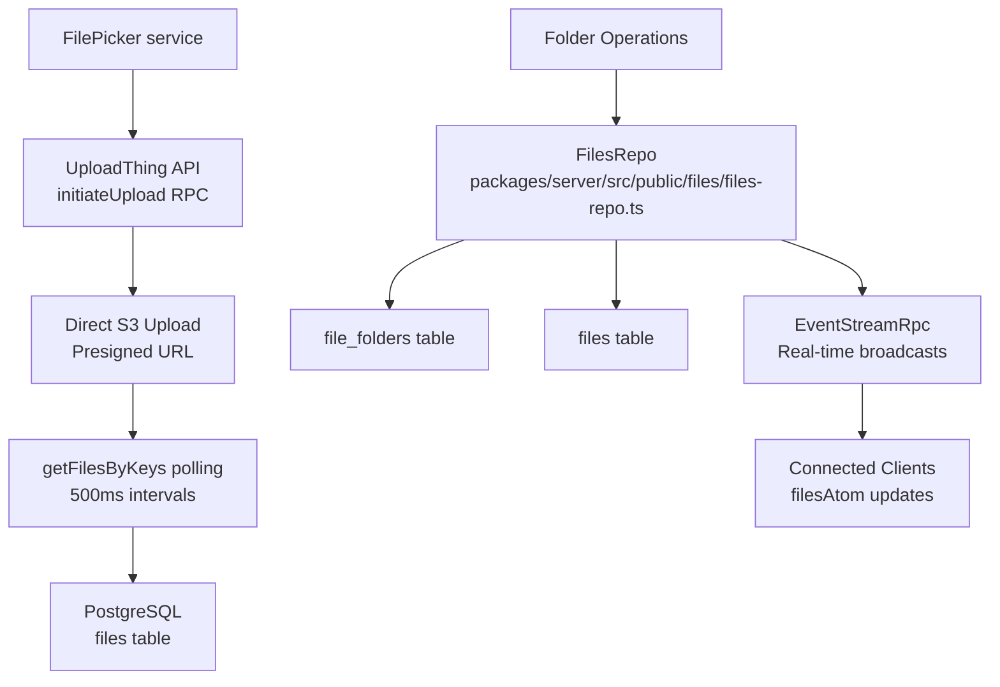
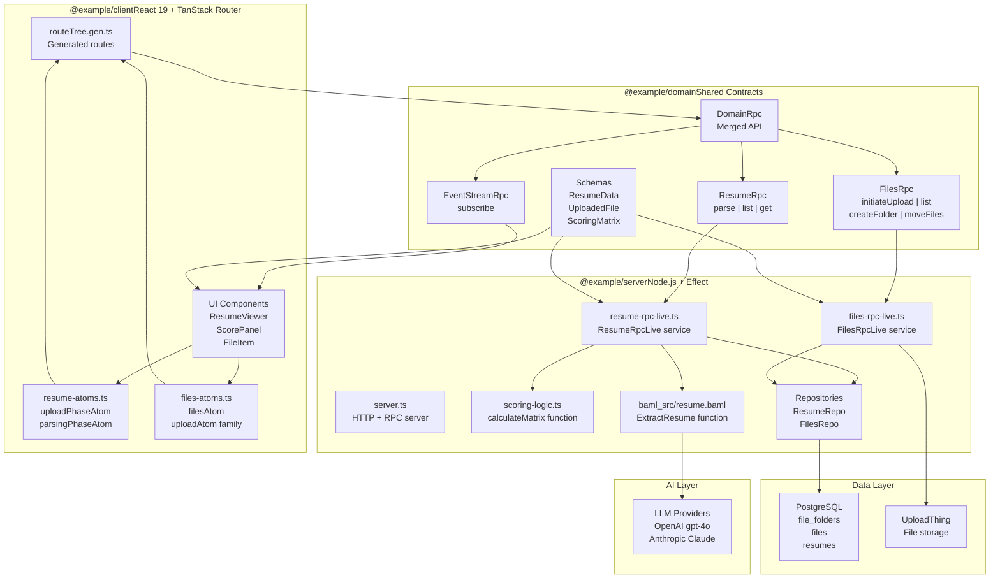
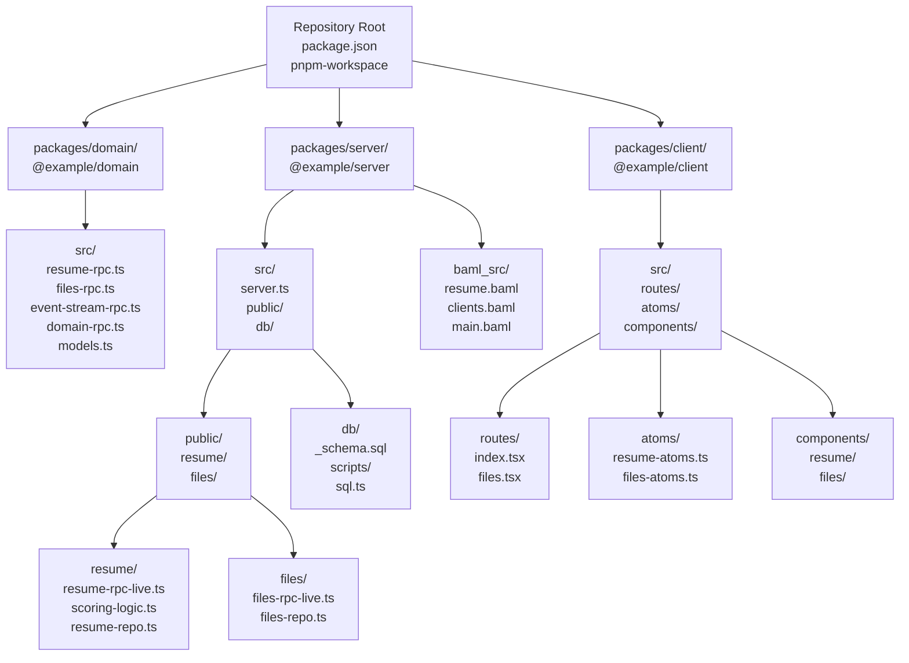
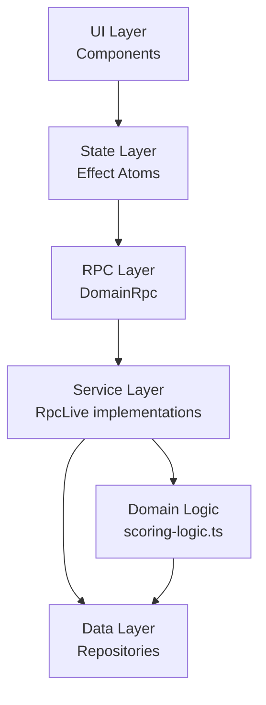
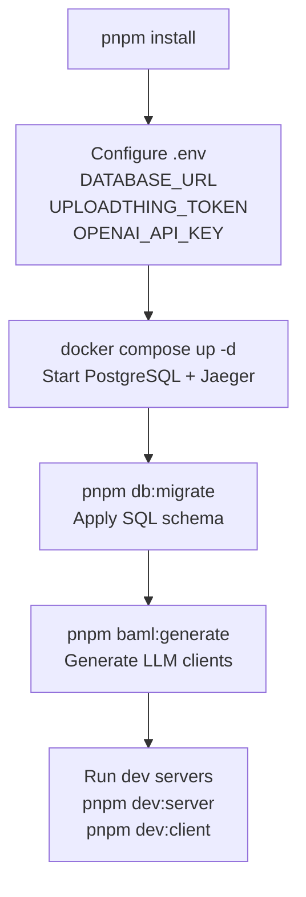

# Overview

> **Relevant source files**
> * [.gitignore](https://github.com/oscaromsn/TalentScore/blob/428ed1eb/.gitignore)
> * [README.md](https://github.com/oscaromsn/TalentScore/blob/428ed1eb/README.md)
> * [bun.lock](https://github.com/oscaromsn/TalentScore/blob/428ed1eb/bun.lock)
> * [package.json](https://github.com/oscaromsn/TalentScore/blob/428ed1eb/package.json)
> * [packages/server/package.json](https://github.com/oscaromsn/TalentScore/blob/428ed1eb/packages/server/package.json)

## Purpose and Scope

This page introduces **TalentScore**, an AI-powered resume analysis system that demonstrates production-grade application development using the Effect ecosystem. It covers the system's purpose, high-level architecture, core features, and the relationship between major components.

For detailed information about specific subsystems:

* System architecture and technology choices: [Architecture](/oscaromsn/TalentScore/2-architecture)
* Domain package contracts and schemas: [Domain Package](/oscaromsn/TalentScore/3-domain-package)
* Server implementation and AI pipeline: [Server Package](/oscaromsn/TalentScore/4-server-package)
* Client application and UI components: [Client Package](/oscaromsn/TalentScore/5-client-package)
* Development setup and workflows: [Development Guide](/oscaromsn/TalentScore/6-development-guide)

**Sources**: [README.md L1-L137](https://github.com/oscaromsn/TalentScore/blob/428ed1eb/README.md#L1-L137)

---

## What is TalentScore?

TalentScore is a full-stack demonstration application that showcases how to build type-safe, observable systems using Effect-TS. The system extracts structured data from unstructured PDF resumes using Large Language Models (LLMs), then applies deterministic scoring algorithms to evaluate candidates based on configurable job contexts.

The core philosophy is to **use LLMs for what they do best**: transforming messy, unstructured information into typed data that can be modeled deterministically. This pattern is particularly valuable for regulated industries where systems must be explainable and auditable while handling documents with varying formats and structures.

TalentScore demonstrates two integrated domains:

| Domain | Purpose | Key Technologies |
| --- | --- | --- |
| **File Management** | Secure file upload, folder organization, multi-user isolation | UploadThing, PostgreSQL, WebSocket events |
| **Resume Analysis** | PDF parsing, structured extraction, context-aware scoring | BAML, OpenAI/Anthropic, streaming responses |

**Sources**: [README.md L1-L11](https://github.com/oscaromsn/TalentScore/blob/428ed1eb/README.md#L1-L11)

---

## Core Features

### AI Resume Parser

```

```

**Structured Extraction**: The system uses BAML (BoundaryML) to guarantee type-safe extraction of resume components:

* Work experience with companies, titles, dates, and descriptions
* Education history including degrees, institutions, and dates
* Skills (technical and soft) with categorization
* Contact information and personal details
* Certifications and additional qualifications

**Streaming Responses**: Resume parsing uses `Stream.async` to provide real-time UI updates as the LLM processes the document. The server emits `ParseEvent::Partial` messages containing incrementally extracted data, enabling progressive rendering in the client.

**Context-Aware Scoring**: The `calculateMatrix` function in [packages/server/src/public/resume/scoring-logic.ts](https://github.com/oscaromsn/TalentScore/blob/428ed1eb/packages/server/src/public/resume/scoring-logic.ts)

 generates a 5×4 scoring matrix evaluating the candidate against:

* 5 **Position Types**: `FRONTEND`, `BACKEND`, `FULLSTACK`, `TECH_LEAD`, `MANAGER`
* 4 **Company Profiles**: `STARTUP`, `SCALE_UP`, `ENTERPRISE`, `CONSULTANCY`

Each context has unique dimension weights (e.g., Technical Depth vs. Leadership), producing scores from 0-1000.

**Dealbreaker Detection**: The scoring logic identifies context-specific gaps, such as:

* Missing required certifications for Enterprise contexts
* Insufficient experience years for leadership positions
* Lack of specific technical skills for specialized roles

**Sources**: [README.md L14-L18](https://github.com/oscaromsn/TalentScore/blob/428ed1eb/README.md#L14-L18)

 Diagram 3 (Resume Processing AI Pipeline)

### File Management System



**UploadThing Integration**: The system uses UploadThing v7 for secure, resumable file uploads with:

* Direct-to-S3 uploads via presigned URLs
* Server-side registration in PostgreSQL
* Client-side polling for sync confirmation

**Real-time Synchronization**: File operations broadcast `FilesEvent` messages over WebSocket connections, enabling:

* Instant file list updates across all connected clients
* Optimistic UI updates with server reconciliation
* Multi-user awareness of file system changes

**Folder Organization**: Users can:

* Create nested folders via `createFolder` RPC method
* Move files between folders with atomic `moveFiles` operations
* Delete files with two-phase commit (database + storage)

**Sources**: [README.md L20-L23](https://github.com/oscaromsn/TalentScore/blob/428ed1eb/README.md#L20-L23)

 Diagram 4 (File Management System Architecture)

---

## System Architecture Overview



TalentScore implements a **contract-first, layered architecture** with clear separation of concerns:

### Client Layer (@example/client)

The React 19 application uses TanStack Router for type-safe routing and Effect Atoms for reactive state management. Key state containers include:

* **`resume-atoms.ts`**: Manages upload phases (`Idle`, `Uploading`, `Syncing`) and parsing phases (`Idle`, `Parsing`, `Complete`)
* **`files-atoms.ts`**: Maintains file cache (`filesAtom`), per-upload state machines (`uploadAtom` family), and selection state
* **Components**: `ResumeViewer`, `ScorePanel`, `ResumeHistoryList`, `FileItem` consume atoms and render UI

### Domain Layer (@example/domain)

The domain package serves as the single source of truth for contracts and types. It defines:

* **RPC Contracts**: `ResumeRpc`, `FilesRpc`, `EventStreamRpc` specify method signatures and streaming endpoints
* **Schemas**: `ResumeData`, `UploadedFile`, `Folder`, `ScoringMatrix` with Effect Schema validation
* **Merged API**: `DomainRpc` combines all contracts into a unified API surface

Both client and server depend on domain, but not on each other, enabling independent development.

### Server Layer (@example/server)

The Node.js server implements the RPC contracts using Effect-TS patterns:

* **`server.ts`**: HTTP server with CORS, authentication, OpenTelemetry tracing
* **`resume-rpc-live.ts`**: Implements `ResumeRpc` with streaming parse operations
* **`files-rpc-live.ts`**: Implements `FilesRpc` with UploadThing integration
* **`scoring-logic.ts`**: Pure function calculating context-aware scores
* **`baml_src/resume.baml`**: Declarative LLM extraction configuration
* **Repositories**: `ResumeRepo`, `FilesRepo` abstract database access

### Data Layer

* **PostgreSQL**: Stores file metadata, folder structure, and resume analyses
* **UploadThing**: External service for secure file storage and presigned uploads

### AI Layer

* **BAML Engine**: Orchestrates LLM calls with retry policies and streaming support
* **LLM Providers**: OpenAI (`gpt-4o`) and Anthropic (`claude-3-5-sonnet`) configured in `baml_src/clients.baml`

**Sources**: [README.md L87-L96](https://github.com/oscaromsn/TalentScore/blob/428ed1eb/README.md#L87-L96)

 Diagram 1 (System Architecture Overview), Diagram 2 (Monorepo Package Structure)

---

## Technology Stack

### Effect Ecosystem

| Package | Version | Purpose |
| --- | --- | --- |
| `effect` | 3.19.8 | Core runtime for type-safe error handling and concurrency |
| `@effect/platform` | 0.93.6 | Cross-platform abstractions for HTTP, FileSystem, etc. |
| `@effect/platform-node` | 0.103.0 | Node.js-specific implementations |
| `@effect/rpc` | 0.72.2 | Type-safe RPC over WebSocket + NDJSON |
| `@effect/sql` | 0.48.6 | SQL client with query builders |
| `@effect/sql-pg` | 0.49.7 | PostgreSQL driver integration |
| `@effect/opentelemetry` | 0.59.1 | Distributed tracing with Jaeger |

All Effect packages are pinned to synchronized versions via [package.json L53-L67](https://github.com/oscaromsn/TalentScore/blob/428ed1eb/package.json#L53-L67)

 overrides to prevent version conflicts.

### Frontend

| Technology | Purpose |
| --- | --- |
| React 19 | UI library with automatic batching and concurrent rendering |
| TanStack Router | Type-safe, file-based routing with generated `routeTree.gen.ts` |
| `@effect-atom/atom-react` | Reactive state management bridging Effect runtime with React |
| Tailwind CSS v4 | Utility-first styling framework |
| Vite | Development server and build tool |

### AI/ML

| Technology | Purpose |
| --- | --- |
| BAML 0.214.0 | Structured LLM extraction with type-safe streaming |
| OpenAI API | Primary LLM provider (`gpt-4o` model) |
| Anthropic API | Alternative provider (`claude-3-5-sonnet`, `claude-3-5-haiku`) |

### Infrastructure

| Service | Purpose |
| --- | --- |
| PostgreSQL | Primary database for file metadata and resume analyses |
| UploadThing v7 | Secure file storage with presigned upload URLs |
| Jaeger | OpenTelemetry trace visualization (exposed on `:16686`) |
| Docker Compose | Local development environment orchestration |

### Build Tools

| Tool | Purpose |
| --- | --- |
| pnpm 10.3.0 | Workspace management for monorepo |
| TypeScript 5.8.3 | Strict type checking across all packages |
| tsx | TypeScript execution for development (`dev:server`) |
| Vitest 3.1.1 | Test framework with Effect integration |
| oxlint + ESLint | Code linting with type-aware checks |

**Sources**: [package.json L1-L68](https://github.com/oscaromsn/TalentScore/blob/428ed1eb/package.json#L1-L68)

 [packages/server/package.json L1-L44](https://github.com/oscaromsn/TalentScore/blob/428ed1eb/packages/server/package.json#L1-L44)

 Diagram 5 (Technology Stack), [README.md L109-L118](https://github.com/oscaromsn/TalentScore/blob/428ed1eb/README.md#L109-L118)

---

## Monorepo Structure



The monorepo uses **pnpm workspaces** configured in [package.json L9-L11](https://github.com/oscaromsn/TalentScore/blob/428ed1eb/package.json#L9-L11)

 with three packages:

### packages/domain

The contract package defining RPC interfaces and shared types. Contains no runtime logic, only type definitions and schemas.

**Key Files**:

* `resume-rpc.ts`: Defines `ResumeRpc` interface with `parse`, `list`, `get` methods
* `files-rpc.ts`: Defines `FilesRpc` interface with file and folder operations
* `event-stream-rpc.ts`: Defines `EventStreamRpc` for real-time events
* `domain-rpc.ts`: Merges all RPC contracts into `DomainRpc` API
* `models.ts`: Exports all Effect Schemas (`ResumeData`, `UploadedFile`, etc.)

### packages/server

The Node.js runtime implementing all RPC contracts. Orchestrates BAML, scoring, and database operations.

**Key Directories**:

* `src/public/resume/`: Resume parsing and scoring logic
* `src/public/files/`: File management and UploadThing integration
* `src/db/`: Database schema (`_schema.sql`), migrations, SQL client layer
* `baml_src/`: BAML definitions for LLM extraction

**Key Files**:

* `server.ts`: HTTP server setup, middleware, RPC handler registration
* `public/resume/resume-rpc-live.ts`: Implements `ResumeRpc` contract
* `public/files/files-rpc-live.ts`: Implements `FilesRpc` contract
* `public/resume/scoring-logic.ts`: Context-aware scoring algorithm

### packages/client

The React application consuming the RPC API through `DomainRpc` client.

**Key Directories**:

* `src/routes/`: TanStack Router pages (file-based routing)
* `src/atoms/`: Effect Atom state containers
* `src/components/resume/`: Resume viewing and scoring UI
* `src/components/files/`: File upload and management UI

**Key Files**:

* `atoms/resume-atoms.ts`: Upload and parsing state machines
* `atoms/files-atoms.ts`: File cache and upload tracking
* `components/resume/resume-viewer.tsx`: Main resume display component
* `components/resume/score-panel.tsx`: Context-aware score visualization

**Sources**: [.gitignore L1-L37](https://github.com/oscaromsn/TalentScore/blob/428ed1eb/.gitignore#L1-L37)

 Diagram 2 (Monorepo Package Structure), [README.md L89-L96](https://github.com/oscaromsn/TalentScore/blob/428ed1eb/README.md#L89-L96)

---

## Key Design Principles

### 1. Contract-First Architecture

The domain package establishes a **compile-time contract** between client and server. RPC methods defined in `ResumeRpc` and `FilesRpc` must be implemented by the server and can only be called with correct types by the client. This prevents API mismatches at development time.

**Example**: The `resume_parse` method signature in `resume-rpc.ts`:

```

```

Guarantees that:

* Server must return a `Stream` of `ParseEvent` items
* Client receives type-safe `ParseEvent` objects with discriminated unions
* TypeScript compiler catches any type mismatches

### 2. Streaming by Default

Long-running operations like resume parsing use `Stream.async` to emit incremental results. The client receives `ParseEvent::Partial` messages containing partially extracted data, enabling progressive UI updates without waiting for complete LLM responses.

### 3. Separation of Concerns



Each layer has a single responsibility:

* **UI**: Render data and handle user interactions
* **State**: Manage client-side state with reactive updates
* **RPC**: Type-safe communication protocol
* **Service**: Orchestrate business logic and external integrations
* **Domain**: Pure functions for deterministic calculations
* **Data**: Abstract database and external service access

### 4. Type Safety Across Boundaries

Effect Schemas validate data at runtime while providing compile-time types. Every RPC payload, database row, and API response is validated against a schema, catching type errors before they propagate.

### 5. Observability Baked In

Every server operation is traced via `@effect/opentelemetry`. The Jaeger UI (`:16686`) shows:

* RPC call latency and dependencies
* Database query performance
* BAML LLM call durations
* Error propagation across services

Trace IDs appear in server logs for debugging production issues.

**Sources**: [README.md L25-L28](https://github.com/oscaromsn/TalentScore/blob/428ed1eb/README.md#L25-L28)

 Diagram 1 (System Architecture Overview), Diagram 2 (Monorepo Package Structure)

---

## Development Workflow

### Initial Setup



The typical development workflow follows these steps:

1. **Install dependencies**: `pnpm install` installs all workspace packages
2. **Configure environment**: Copy `.env.example` to `.env` and set required variables
3. **Start infrastructure**: `docker compose up -d` launches PostgreSQL and Jaeger containers
4. **Initialize database**: `pnpm db:migrate` applies migrations from [packages/server/src/db/_schema.sql](https://github.com/oscaromsn/TalentScore/blob/428ed1eb/packages/server/src/db/_schema.sql)
5. **Generate BAML clients**: `pnpm baml:generate` produces TypeScript types from `.baml` files
6. **Run servers**: * `pnpm dev:server` starts Node.js API on `localhost:3001` with hot reload via `tsx --watch` * `pnpm dev:client` starts Vite dev server on `localhost:5173`

### Key Commands

| Command | Description | Location |
| --- | --- | --- |
| `pnpm build` | Build all packages in dependency order | [package.json L13](https://github.com/oscaromsn/TalentScore/blob/428ed1eb/package.json#L13-L13) |
| `pnpm check` | Run TypeScript type checking across monorepo | [package.json L15](https://github.com/oscaromsn/TalentScore/blob/428ed1eb/package.json#L15-L15) |
| `pnpm lint` | Run oxlint and ESLint with type-aware checks | [package.json L17](https://github.com/oscaromsn/TalentScore/blob/428ed1eb/package.json#L17-L17) |
| `pnpm test` | Execute Vitest test suite | [package.json L21](https://github.com/oscaromsn/TalentScore/blob/428ed1eb/package.json#L21-L21) |
| `pnpm db:reset` | Drop all tables and re-apply schema | [package.json L28](https://github.com/oscaromsn/TalentScore/blob/428ed1eb/package.json#L28-L28) |
| `pnpm baml:generate` | Regenerate TypeScript clients from BAML | [package.json L29](https://github.com/oscaromsn/TalentScore/blob/428ed1eb/package.json#L29-L29) |

### Observability

The application exposes two endpoints for monitoring:

* **Application**: `http://localhost:5173` - React client UI
* **Jaeger UI**: `http://localhost:16686` - Distributed tracing dashboard

Server logs include trace IDs in this format:

```
[trace_id: 1a2b3c4d5e6f] Processing resume parse for file: file_abc123
```

Copy the trace ID and search for it in Jaeger to visualize the complete request flow, including:

* HTTP request handling
* RPC method invocation
* Database queries
* BAML LLM calls
* Scoring calculations

**Sources**: [README.md L30-L86](https://github.com/oscaromsn/TalentScore/blob/428ed1eb/README.md#L30-L86)

 [README.md L119-L129](https://github.com/oscaromsn/TalentScore/blob/428ed1eb/README.md#L119-L129)

 [package.json L12-L29](https://github.com/oscaromsn/TalentScore/blob/428ed1eb/package.json#L12-L29)

---

## Summary

TalentScore demonstrates how to build production-grade applications using the Effect ecosystem. The system combines:

* **Type-safe RPC**: Contract-first architecture with compile-time guarantees
* **Streaming AI Pipeline**: Real-time resume parsing with progressive UI updates
* **Context-Aware Scoring**: Deterministic evaluation based on job roles and company profiles
* **Reactive State Management**: Effect Atoms bridge Effect runtime with React components
* **Full Observability**: OpenTelemetry tracing throughout the request lifecycle

The monorepo structure (`domain`/`server`/`client`) enforces clear boundaries and unidirectional dependencies. The domain package serves as the contract layer, while server and client implement and consume those contracts independently.

For deeper exploration:

* [Architecture](/oscaromsn/TalentScore/2-architecture) covers technology choices and design patterns
* [Domain Package](/oscaromsn/TalentScore/3-domain-package) documents RPC contracts and data models
* [Server Package](/oscaromsn/TalentScore/4-server-package) explains the AI pipeline and scoring algorithm
* [Client Package](/oscaromsn/TalentScore/5-client-package) details the React application and state management
* [Development Guide](/oscaromsn/TalentScore/6-development-guide) provides setup instructions and debugging tips

**Sources**: [README.md L1-L137](https://github.com/oscaromsn/TalentScore/blob/428ed1eb/README.md#L1-L137)

 All diagrams