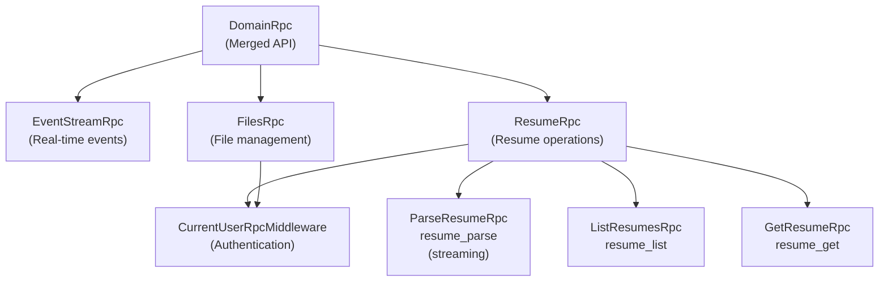
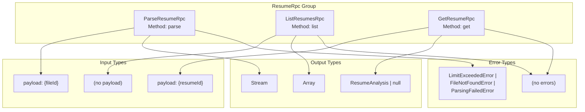
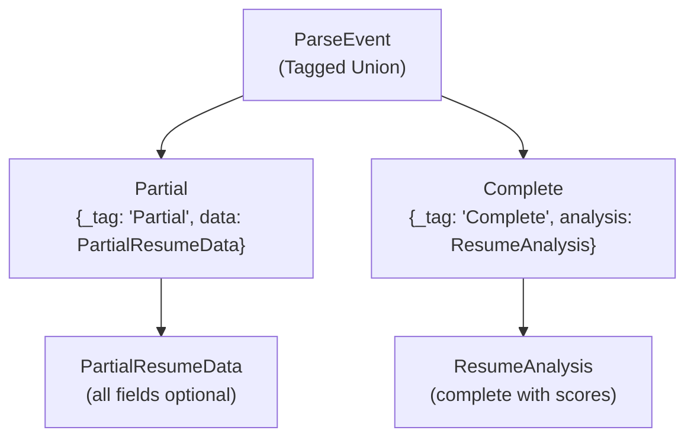
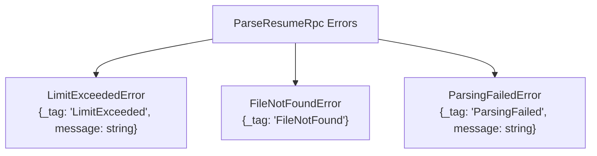
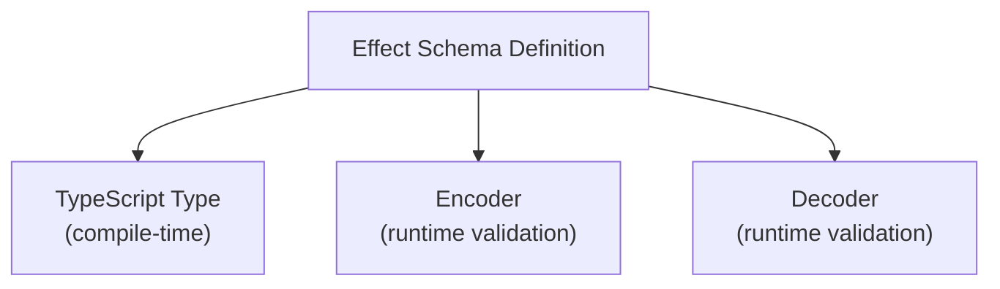
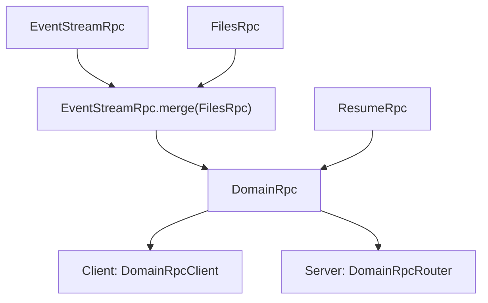

# RPC Contracts

> **Relevant source files**
> * [packages/domain/src/api/resume/index.ts](https://github.com/oscaromsn/TalentScore/blob/428ed1eb/packages/domain/src/api/resume/index.ts)
> * [packages/domain/src/api/resume/resume-rpc.ts](https://github.com/oscaromsn/TalentScore/blob/428ed1eb/packages/domain/src/api/resume/resume-rpc.ts)
> * [packages/domain/src/domain-api.ts](https://github.com/oscaromsn/TalentScore/blob/428ed1eb/packages/domain/src/domain-api.ts)

## Purpose and Scope

This page documents the RPC (Remote Procedure Call) contracts defined in the `packages/domain` package that establish the API surface between the client and server. These contracts use the Effect RPC framework to provide type-safe, validated communication with support for both request-response and streaming patterns.

For the server-side implementation of these contracts, see [Resume RPC Implementation](/oscaromsn/TalentScore/4.4.1-resume-rpc-implementation). For client-side usage of these contracts, see [State Management with Effect Atoms](/oscaromsn/TalentScore/5.2-state-management-with-effect-atoms). For the data models referenced by these contracts, see [Data Models and Schemas](/oscaromsn/TalentScore/3.2-data-models-and-schemas).

---

## Contract-First Architecture

The domain package implements a **contract-first design** where all RPC interfaces are defined using Effect Schema and Effect RPC before any implementation code is written. Both client and server depend on these contracts, ensuring compile-time type safety and runtime validation across the network boundary.

**Key Benefits:**

* **Type Safety**: TypeScript types are automatically derived from Effect Schemas
* **Runtime Validation**: All payloads are validated against schemas at runtime
* **Streaming Support**: RPC definitions can specify streaming responses for real-time updates
* **Error Modeling**: Errors are typed and validated, enabling exhaustive error handling
* **Middleware Composition**: Cross-cutting concerns (authentication, logging) are applied declaratively

Sources: [packages/domain/src/api/resume/resume-rpc.ts L1-L214](https://github.com/oscaromsn/TalentScore/blob/428ed1eb/packages/domain/src/api/resume/resume-rpc.ts#L1-L214)

---

## RPC Contract Hierarchy

The system defines three primary RPC groups that are merged into a single `DomainRpc` API surface:



**Diagram: DomainRpc Contract Hierarchy**

The `DomainRpc` class uses Effect RPC's `.merge()` method to combine three independent RPC groups into a unified API. Each group defines a set of related operations:

| RPC Group | Prefix | Middleware | Purpose |
| --- | --- | --- | --- |
| `EventStreamRpc` | N/A | N/A | Real-time event broadcasting to clients |
| `FilesRpc` | `files_` | `CurrentUserRpcMiddleware` | File and folder CRUD operations |
| `ResumeRpc` | `resume_` | `CurrentUserRpcMiddleware` | Resume parsing, listing, and retrieval |

Sources: [packages/domain/src/domain-api.ts L1-L6](https://github.com/oscaromsn/TalentScore/blob/428ed1eb/packages/domain/src/domain-api.ts#L1-L6)

 [packages/domain/src/api/resume/resume-rpc.ts L208-L214](https://github.com/oscaromsn/TalentScore/blob/428ed1eb/packages/domain/src/api/resume/resume-rpc.ts#L208-L214)

---

## ResumeRpc Contract

The `ResumeRpc` group defines three operations for resume management, all prefixed with `resume_` and protected by `CurrentUserRpcMiddleware`.

### Contract Structure



**Diagram: ResumeRpc Operations and Types**

Sources: [packages/domain/src/api/resume/resume-rpc.ts L186-L214](https://github.com/oscaromsn/TalentScore/blob/428ed1eb/packages/domain/src/api/resume/resume-rpc.ts#L186-L214)

---

### ParseResumeRpc (Streaming)

The `ParseResumeRpc` operation initiates resume parsing and returns a **stream** of `ParseEvent` objects, enabling real-time UI updates as the LLM extracts data.

**Contract Definition:**

| Property | Value |
| --- | --- |
| Method Name | `parse` |
| Full RPC Name | `resume_parse` |
| Payload | `{fileId: UploadedFileId}` |
| Streaming | `true` |
| Success Type | `ParseEvent` (union type) |
| Error Types | `LimitExceededError \| FileNotFoundError \| ParsingFailedError` |

**ParseEvent Union Type:**



**Diagram: ParseEvent Stream Type Structure**

The streaming architecture allows the server to emit multiple `Partial` events as the LLM progressively extracts data, followed by a final `Complete` event containing the full analysis with scoring matrix.

**Stream Event Sequence:**

1. **Partial Events (0-N)**: Each event contains a `PartialResumeData` object with incrementally extracted fields. Arrays (`experience`, `education`, `skills`, etc.) are progressively populated as the LLM identifies them.
2. **Complete Event (1)**: Final event containing a `ResumeAnalysis` object with: * Complete `ResumeData` (all fields populated) * `ScoringMatrix` (5×4 context scores) * Database-persisted `id`, `createdAt`, and `fileName`

Sources: [packages/domain/src/api/resume/resume-rpc.ts L153-L193](https://github.com/oscaromsn/TalentScore/blob/428ed1eb/packages/domain/src/api/resume/resume-rpc.ts#L153-L193)

---

### ListResumesRpc

The `ListResumesRpc` operation retrieves all resumes for the authenticated user.

**Contract Definition:**

| Property | Value |
| --- | --- |
| Method Name | `list` |
| Full RPC Name | `resume_list` |
| Payload | (none) |
| Streaming | `false` |
| Success Type | `Array<ResumeAnalysis>` |
| Error Types | (none) |

This operation returns the complete list of `ResumeAnalysis` objects ordered by creation date (descending). Each object includes the full resume data and scoring matrix, enabling the client to render the resume history list without additional requests.

Sources: [packages/domain/src/api/resume/resume-rpc.ts L195-L197](https://github.com/oscaromsn/TalentScore/blob/428ed1eb/packages/domain/src/api/resume/resume-rpc.ts#L195-L197)

---

### GetResumeRpc

The `GetResumeRpc` operation retrieves a single resume by its unique identifier.

**Contract Definition:**

| Property | Value |
| --- | --- |
| Method Name | `get` |
| Full RPC Name | `resume_get` |
| Payload | `{resumeId: ResumeId}` |
| Streaming | `false` |
| Success Type | `ResumeAnalysis \| null` |
| Error Types | (none) |

Returns `null` if the resume does not exist or does not belong to the authenticated user. This operation is used when navigating directly to a resume via URL.

Sources: [packages/domain/src/api/resume/resume-rpc.ts L199-L204](https://github.com/oscaromsn/TalentScore/blob/428ed1eb/packages/domain/src/api/resume/resume-rpc.ts#L199-L204)

---

## Error Modeling

The RPC contracts use **typed errors** modeled as Effect Schema tagged errors. Each error class extends `Schema.TaggedError` with a discriminant `_tag` field for exhaustive pattern matching.

### Resume Error Types



**Diagram: Resume RPC Error Types**

| Error Class | When Raised | Fields |
| --- | --- | --- |
| `LimitExceededError` | User has reached the 10-resume limit | `message: string` |
| `FileNotFoundError` | `fileId` does not exist or user lacks permission | (none) |
| `ParsingFailedError` | BAML extraction fails or PDF is invalid | `message: string` |

**Client Error Handling Example:**

When consuming the `resume_parse` RPC, clients can exhaustively handle errors using Effect's pattern matching:

```javascript
// Pseudocode illustrating error handling
Effect.gen(function*() {
  const stream = yield* client.resume_parse({fileId});
  // Handle stream events...
}).pipe(
  Effect.catchTags({
    LimitExceeded: (error) => Effect.succeed({type: 'limit', message: error.message}),
    FileNotFound: () => Effect.succeed({type: 'not-found'}),
    ParsingFailed: (error) => Effect.succeed({type: 'parsing', message: error.message}),
  })
)
```

Sources: [packages/domain/src/api/resume/resume-rpc.ts L165-L182](https://github.com/oscaromsn/TalentScore/blob/428ed1eb/packages/domain/src/api/resume/resume-rpc.ts#L165-L182)

---

## Type Safety and Schema Validation

All RPC contracts leverage **Effect Schema** for compile-time type inference and runtime validation. Each schema definition automatically generates:

1. **TypeScript Type**: Extracted via `typeof Schema.Type`
2. **Encoder**: Validates and serializes data for network transmission
3. **Decoder**: Validates and deserializes incoming data

### Schema Definition Pattern

The contract defines schemas using Effect Schema's declarative API:



**Diagram: Schema to Type and Validator Generation**

**Example: ResumeAnalysis Schema**

The `ResumeAnalysis` class extends `Schema.Class` with a structural definition:

```yaml
ResumeAnalysis {
  id: ResumeId (branded UUID)
  fileId: UploadedFileId (branded UUID)
  fileName: string
  data: ResumeData (nested class)
  score: number
  createdAt: DateTimeUtc (ISO 8601 string)
}
```

Each field's schema enforces constraints:

* `ResumeId` and `UploadedFileId` are **branded UUIDs** preventing accidental type mixing
* `DateTimeUtc` validates ISO 8601 format and converts to JavaScript `Date` objects
* `ResumeData` is a nested schema with recursive validation of all nested structures

Sources: [packages/domain/src/api/resume/resume-rpc.ts L59-L149](https://github.com/oscaromsn/TalentScore/blob/428ed1eb/packages/domain/src/api/resume/resume-rpc.ts#L59-L149)

---

## Branded Types for Type Safety

The contracts use **branded types** to prevent accidental mixing of semantically different UUIDs:

```
ResumeId = UUID & Brand<"ResumeId">
UploadedFileId = UUID & Brand<"UploadedFileId">
```

This prevents compile-time errors like:

```typescript
// Compile error: Type 'UploadedFileId' is not assignable to type 'ResumeId'
const resumeId: ResumeId = someUploadedFileId;
```

The `Schema.brand()` combinator creates a nominal type that TypeScript treats as distinct, even though both are UUIDs at runtime.

Sources: [packages/domain/src/api/resume/resume-rpc.ts L59-L60](https://github.com/oscaromsn/TalentScore/blob/428ed1eb/packages/domain/src/api/resume/resume-rpc.ts#L59-L60)

 [packages/domain/src/api/resume/resume-rpc.ts L4](https://github.com/oscaromsn/TalentScore/blob/428ed1eb/packages/domain/src/api/resume/resume-rpc.ts#L4-L4)

---

## Middleware Integration

The `ResumeRpc` group applies `CurrentUserRpcMiddleware` to all operations via the `.middleware()` method. This middleware:

1. **Authenticates** the request by validating session tokens
2. **Injects** a `CurrentUser` dependency into the Effect context
3. **Rejects** unauthenticated requests before reaching the handler

**Middleware Application:**

```
ResumeRpc = RpcGroup.make(...)
  .prefix("resume_")
  .middleware(CurrentUserRpcMiddleware)
```

All handlers implementing `ResumeRpc` operations automatically receive the authenticated user context via Effect's dependency injection, eliminating manual authentication checks.

Sources: [packages/domain/src/api/resume/resume-rpc.ts L208-L214](https://github.com/oscaromsn/TalentScore/blob/428ed1eb/packages/domain/src/api/resume/resume-rpc.ts#L208-L214)

 [packages/domain/src/api/resume/resume-rpc.ts L5](https://github.com/oscaromsn/TalentScore/blob/428ed1eb/packages/domain/src/api/resume/resume-rpc.ts#L5-L5)

---

## RPC Group Composition

The Effect RPC framework enables **compositional API design** where independent RPC groups are merged into a unified API surface without coupling:



**Diagram: RPC Group Merging and Consumption**

The `.merge()` operation combines RPC groups while preserving type information, enabling:

* **Single WebSocket Connection**: All RPC operations share one connection
* **Type-Safe Client**: Auto-generated client with methods for all operations
* **Unified Routing**: Server router handles all groups through a single handler

This composition strategy allows teams to develop RPC groups independently while maintaining a cohesive API surface.

Sources: [packages/domain/src/domain-api.ts L1-L6](https://github.com/oscaromsn/TalentScore/blob/428ed1eb/packages/domain/src/domain-api.ts#L1-L6)

---

## Streaming vs Request-Response Patterns

The RPC framework supports two communication patterns, chosen per-operation:

| Pattern | Declaration | Use Case | Example Operation |
| --- | --- | --- | --- |
| **Request-Response** | `stream: false` (default) | Single response, immediate result | `resume_list`, `resume_get` |
| **Streaming** | `stream: true` | Multiple responses, progressive data | `resume_parse` |

**Streaming Operation Characteristics:**

1. **Server yields multiple values** via Effect streams (`Stream.make`, `Stream.fromIterable`, etc.)
2. **Client receives each value** as it's emitted, enabling real-time UI updates
3. **Automatic backpressure** prevents overwhelming the client
4. **Stream completes** when server closes the stream or client disconnects

The `ParseResumeRpc` operation demonstrates streaming by emitting partial resume data as the LLM extracts it, followed by a complete event with scores.

Sources: [packages/domain/src/api/resume/resume-rpc.ts L186-L193](https://github.com/oscaromsn/TalentScore/blob/428ed1eb/packages/domain/src/api/resume/resume-rpc.ts#L186-L193)