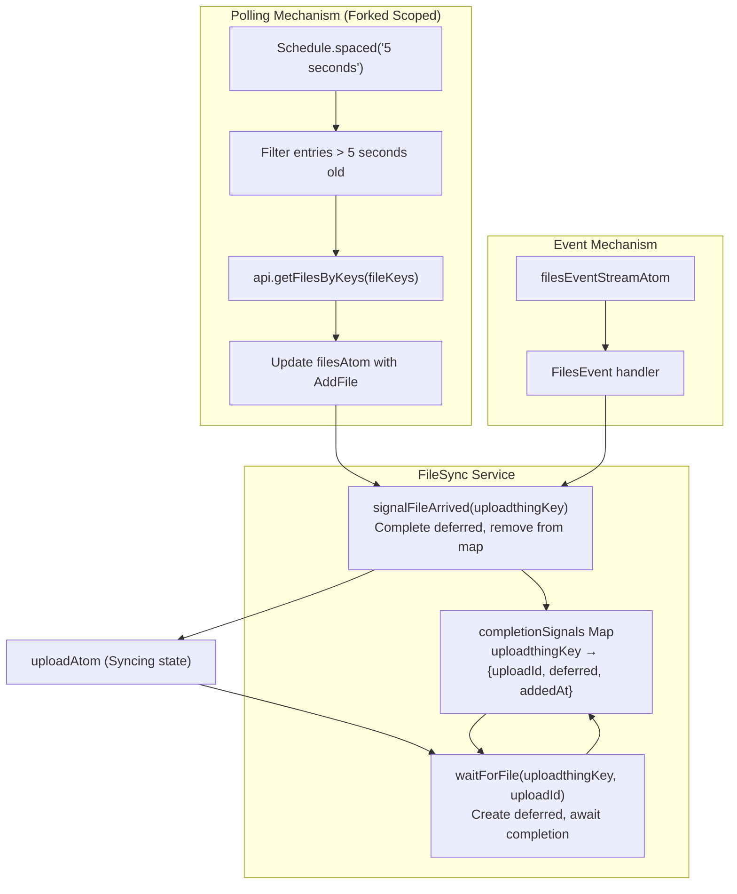
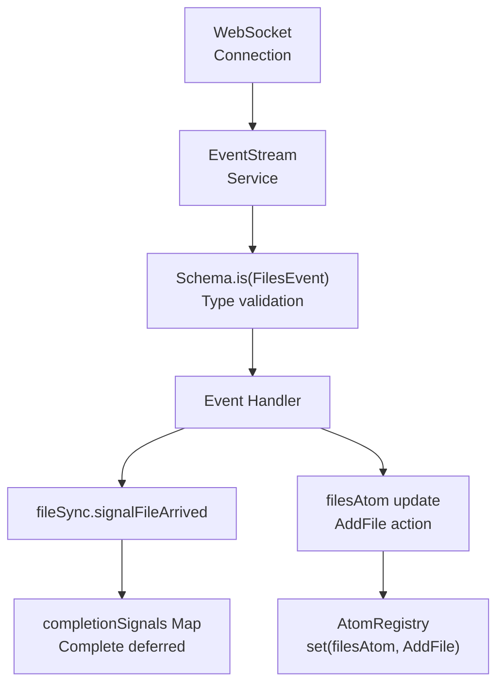
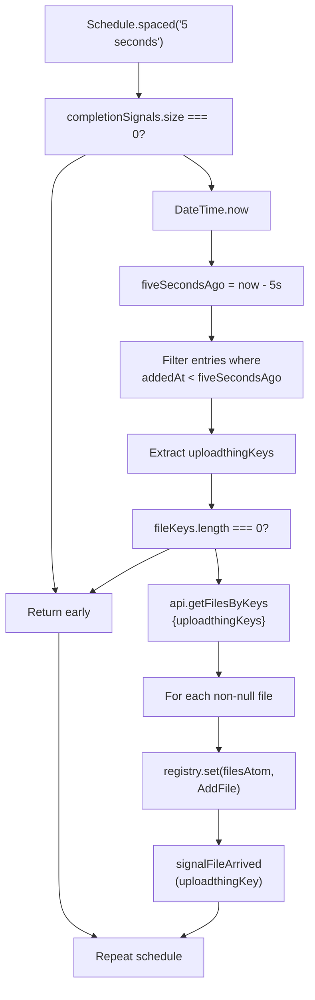
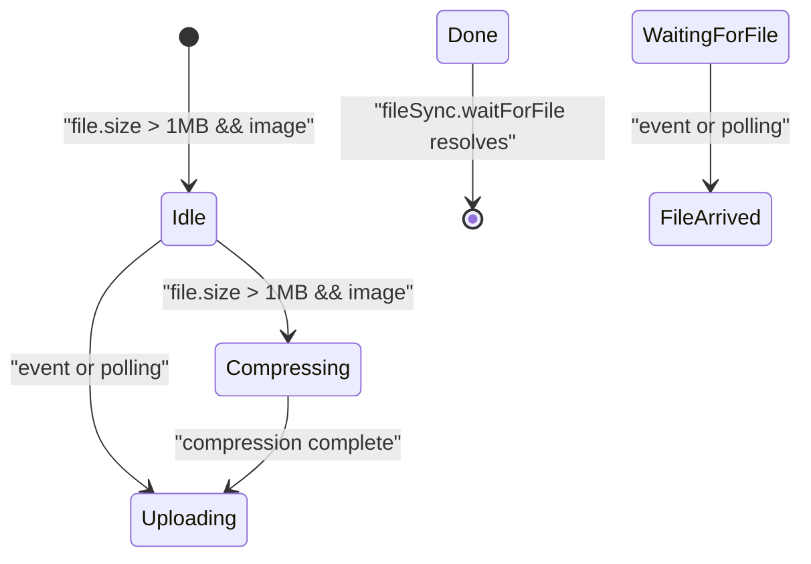
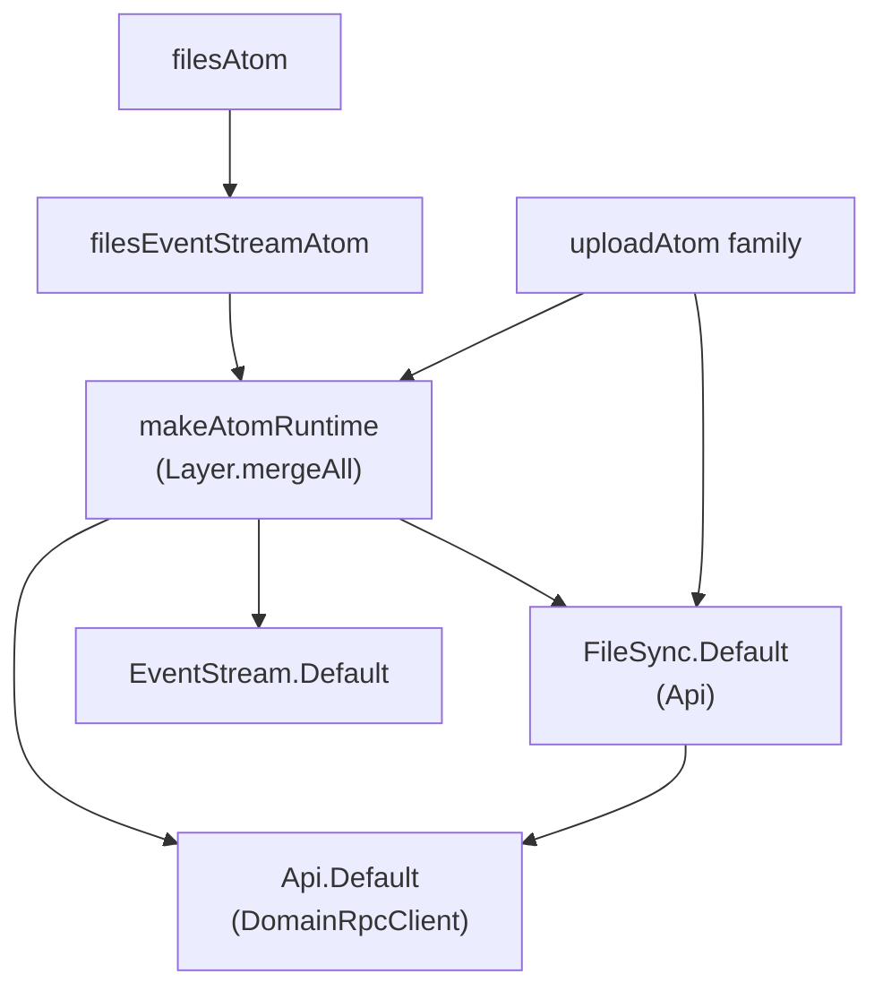
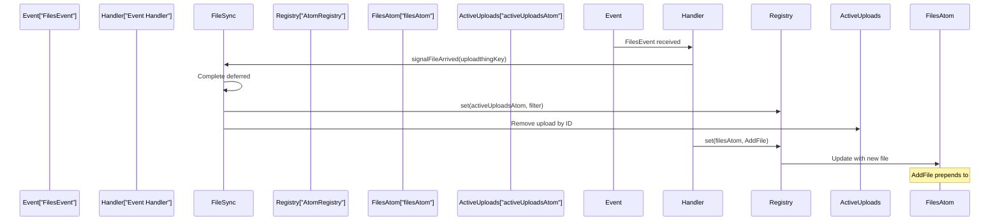

# Real-time Synchronization

> **Relevant source files**
> * [README.md](https://github.com/lucas-barake/effect-file-manager/blob/28eedd82/README.md)
> * [packages/client/src/routes/files/-files/files-atoms/files-atoms.tsx](https://github.com/lucas-barake/effect-file-manager/blob/28eedd82/packages/client/src/routes/files/-files/files-atoms/files-atoms.tsx)

## Purpose and Scope

This document describes the real-time synchronization system that ensures uploaded files are immediately visible to all connected clients. After a file is uploaded to S3-compatible storage, there is a delay before it becomes queryable in the database. The synchronization system bridges this gap using a dual mechanism: WebSocket-based event streams and periodic polling.

For information about the upload pipeline that precedes synchronization, see [File Upload System](/lucas-barake/effect-file-manager/4-file-upload-system). For details about state management and atoms, see [State Management with Effect Atoms](/lucas-barake/effect-file-manager/5-state-management-with-effect-atoms).

---

## Synchronization Problem

When a file upload completes, the client has successfully written data to S3, but the server's database may not yet reflect the new file. This creates a distributed systems challenge:

| Phase | Status |
| --- | --- |
| Client uploads file to S3 | ✓ Complete |
| Server processes upload webhook from UploadThing | ⏳ Pending |
| Database contains file metadata | ⏳ Pending |
| File appears in client UI | ❌ Missing |

The synchronization system resolves this by waiting for server confirmation before transitioning the upload to the "Done" state.

**Sources:** [packages/client/src/routes/files/-files/files-atoms/files-atoms.tsx L132-L200](https://github.com/lucas-barake/effect-file-manager/blob/28eedd82/packages/client/src/routes/files/-files/files-atoms/files-atoms.tsx#L132-L200)

---

## FileSync Service Architecture

The `FileSync` service manages the synchronization lifecycle for uploaded files. It maintains a registry of pending uploads and signals when files become available.

### Service Structure



**Diagram: FileSync Service Internal Architecture**

**Sources:** [packages/client/src/routes/files/-files/files-atoms/files-atoms.tsx L132-L200](https://github.com/lucas-barake/effect-file-manager/blob/28eedd82/packages/client/src/routes/files/-files/files-atoms/files-atoms.tsx#L132-L200)

### Completion Signals Registry

The `completionSignals` map tracks files waiting for synchronization:

```
Map<string, {
  uploadId: string;
  deferred: Deferred.Deferred<void>;
  addedAt: DateTime.Utc;
}>
```

* **Key**: UploadThing file key (unique identifier from presigned URL)
* **Value**: Upload metadata including a deferred that completes when the file arrives
* **addedAt**: Timestamp used to determine when to start polling (after 5 seconds)

**Sources:** [packages/client/src/routes/files/-files/files-atoms/files-atoms.tsx L140-L147](https://github.com/lucas-barake/effect-file-manager/blob/28eedd82/packages/client/src/routes/files/-files/files-atoms/files-atoms.tsx#L140-L147)

---

## Dual Synchronization Mechanism

The system employs two parallel mechanisms to ensure reliable synchronization:

### Mechanism Comparison

| Mechanism | Trigger | Latency | Reliability |
| --- | --- | --- | --- |
| WebSocket Event Stream | Server-push when file processed | ~100ms | High (requires active connection) |
| Periodic Polling | Client polls every 5s after delay | ~5s | Guaranteed (works offline/reconnect) |

### Sequence Diagram

```

```

**Diagram: Dual Synchronization Flow**

**Sources:** [packages/client/src/routes/files/-files/files-atoms/files-atoms.tsx L156-L169](https://github.com/lucas-barake/effect-file-manager/blob/28eedd82/packages/client/src/routes/files/-files/files-atoms/files-atoms.tsx#L156-L169)

 [packages/client/src/routes/files/-files/files-atoms/files-atoms.tsx L171-L191](https://github.com/lucas-barake/effect-file-manager/blob/28eedd82/packages/client/src/routes/files/-files/files-atoms/files-atoms.tsx#L171-L191)

---

## Event Stream Integration

The `filesEventStreamAtom` subscribes to server-pushed events and integrates with the `FileSync` service.

### Event Stream Atom



**Diagram: Event Stream Processing Pipeline**

The event handler performs two critical actions:

1. **Signal Upload Completion**: Calls `fileSync.signalFileArrived(event.file.uploadthingKey)` to resolve any pending deferreds
2. **Update File Cache**: Updates `filesAtom` with the new file via `AddFile` action

This ensures both the upload state machine completes and the file list updates atomically.

**Sources:** [packages/client/src/routes/files/-files/files-atoms/files-atoms.tsx L700-L719](https://github.com/lucas-barake/effect-file-manager/blob/28eedd82/packages/client/src/routes/files/-files/files-atoms/files-atoms.tsx#L700-L719)

### Event Stream Creation

The event stream atom is created using the `makeEventStreamAtom` utility:

```javascript
const filesEventStreamAtom = makeEventStreamAtom({
  runtime,
  identifier: "Files",
  predicate: Schema.is(FilesEvent),
  handler: (event: FilesEvent) => Effect.gen(...)
})
```

* **runtime**: Provides Effect runtime with all service dependencies
* **identifier**: Names the event stream for debugging
* **predicate**: Schema-based validation ensures type safety
* **handler**: Effect-based handler with access to services via `yield*`

**Sources:** [packages/client/src/routes/files/-files/files-atoms/files-atoms.tsx L700-L719](https://github.com/lucas-barake/effect-file-manager/blob/28eedd82/packages/client/src/routes/files/-files/files-atoms/files-atoms.tsx#L700-L719)

---

## Polling Mechanism

The polling mechanism serves as a fallback when event streams fail or are delayed.

### Polling Logic



**Diagram: Polling Mechanism Flow**

### Implementation Details

The polling fiber is forked in the scoped effect of the `FileSync` service:

| Aspect | Implementation |
| --- | --- |
| Schedule | `Schedule.spaced("5 seconds")` - constant interval |
| Scope | Forked with `Effect.forkScoped` - lifecycle tied to service |
| Delay threshold | 5 seconds from `addedAt` timestamp |
| Batch query | `api.getFilesByKeys({ uploadthingKeys })` accepts array |
| Idempotency | Safe to signal multiple times; deferred completes once |

**Sources:** [packages/client/src/routes/files/-files/files-atoms/files-atoms.tsx L171-L191](https://github.com/lucas-barake/effect-file-manager/blob/28eedd82/packages/client/src/routes/files/-files/files-atoms/files-atoms.tsx#L171-L191)

---

## Integration with Upload Pipeline

The synchronization system integrates into the upload state machine at the "Syncing" phase.

### Upload State Transitions



**Diagram: Upload State Machine with Syncing Phase**

### Syncing State Logic

When the upload enters the "Syncing" state:

```
case "Syncing": {
  yield* fileSync.waitForFile(state.fileKey, uploadId);
  return Option.some<readonly [UploadPhase, UploadState]>([
    UploadPhase.Done(),
    UploadState.Done(),
  ]);
}
```

The `waitForFile` function:

1. Creates a `Deferred<void>`
2. Stores it in `completionSignals` map with current timestamp
3. Awaits the deferred (blocks until resolved)
4. Removes the upload from `activeUploadsAtom` upon completion

**Sources:** [packages/client/src/routes/files/-files/files-atoms/files-atoms.tsx L375-L380](https://github.com/lucas-barake/effect-file-manager/blob/28eedd82/packages/client/src/routes/files/-files/files-atoms/files-atoms.tsx#L375-L380)

 [packages/client/src/routes/files/-files/files-atoms/files-atoms.tsx L156-L169](https://github.com/lucas-barake/effect-file-manager/blob/28eedd82/packages/client/src/routes/files/-files/files-atoms/files-atoms.tsx#L156-L169)

---

## Service Dependencies and Runtime

The `FileSync` service is integrated into the application runtime layer.

### Service Dependency Graph



**Diagram: FileSync Service Dependencies**

The runtime composition at [packages/client/src/routes/files/-files/files-atoms/files-atoms.tsx L247-L256](https://github.com/lucas-barake/effect-file-manager/blob/28eedd82/packages/client/src/routes/files/-files/files-atoms/files-atoms.tsx#L247-L256)

:

```javascript
export const runtime = makeAtomRuntime(
  Layer.mergeAll(
    Api.Default,
    FetchHttpClient.layer,
    FilePicker.Default,
    EventStream.Default,
    FileSync.Default,
    ImageCompressionClient.Default,
  ),
);
```

All atoms and runtime functions have access to `FileSync` via dependency injection through the Effect runtime.

**Sources:** [packages/client/src/routes/files/-files/files-atoms/files-atoms.tsx L247-L256](https://github.com/lucas-barake/effect-file-manager/blob/28eedd82/packages/client/src/routes/files/-files/files-atoms/files-atoms.tsx#L247-L256)

 [packages/client/src/routes/files/-files/files-atoms/files-atoms.tsx L132-L200](https://github.com/lucas-barake/effect-file-manager/blob/28eedd82/packages/client/src/routes/files/-files/files-atoms/files-atoms.tsx#L132-L200)

---

## Atom Updates and Cache Consistency

The synchronization system ensures cache consistency by coordinating updates to `filesAtom`.

### File Arrival Update Flow



**Diagram: Atom Update Coordination**

### AddFile Action

The `AddFile` action updates the file cache based on folder location:

| Condition | Action |
| --- | --- |
| `folderId === null` | Prepend to `rootFiles` array |
| `folderId !== null` | Find folder by ID, prepend to `folder.files` |

The use of `prepend` ensures newly uploaded files appear at the top of the list.

**Sources:** [packages/client/src/routes/files/-files/files-atoms/files-atoms.tsx L664-L684](https://github.com/lucas-barake/effect-file-manager/blob/28eedd82/packages/client/src/routes/files/-files/files-atoms/files-atoms.tsx#L664-L684)

 [packages/client/src/routes/files/-files/files-atoms/files-atoms.tsx L704-L718](https://github.com/lucas-barake/effect-file-manager/blob/28eedd82/packages/client/src/routes/files/-files/files-atoms/files-atoms.tsx#L704-L718)

---

## Error Handling and Edge Cases

The synchronization system handles several edge cases:

### Edge Case Handling

| Scenario | Behavior |
| --- | --- |
| Event arrives before polling starts | Deferred completes immediately, polling skips |
| Polling finds file before event | Deferred completes, subsequent event is no-op |
| Multiple clients upload same file | Each client tracks own `uploadId`, no collision |
| WebSocket disconnection | Polling mechanism ensures eventual consistency |
| Upload cancelled during sync | `cancelUploadAtom` interrupts, removes from registry |

### Signal Idempotency

The `signalFileArrived` function is idempotent:

```javascript
const signalFileArrived = (uploadthingKey: string) => {
  const entry = completionSignals.get(uploadthingKey);
  if (!entry) return;  // Already signaled or never registered
  Deferred.unsafeDone(entry.deferred, Exit.void);
  completionSignals.delete(uploadthingKey);
};
```

Multiple calls with the same key are safe - only the first call completes the deferred.

**Sources:** [packages/client/src/routes/files/-files/files-atoms/files-atoms.tsx L149-L154](https://github.com/lucas-barake/effect-file-manager/blob/28eedd82/packages/client/src/routes/files/-files/files-atoms/files-atoms.tsx#L149-L154)

---

## Performance Characteristics

### Latency Analysis

| Path | Best Case | Worst Case | Average |
| --- | --- | --- | --- |
| Event stream | ~100-200ms | N/A (falls back to polling) | ~150ms |
| Polling | ~5 seconds | ~10 seconds | ~7.5 seconds |
| Combined (dual mechanism) | ~100-200ms | ~10 seconds | ~500ms |

The dual mechanism ensures low latency in the common case (event stream) while guaranteeing eventual consistency through polling.

### Resource Usage

* **Memory**: O(n) where n = concurrent uploads waiting for sync
* **CPU**: Minimal - scheduled polling runs once per 5 seconds
* **Network**: 1 batch API call per 5s (only when pending uploads exist)
* **WebSocket**: Single persistent connection shared across all features

**Sources:** [packages/client/src/routes/files/-files/files-atoms/files-atoms.tsx L171-L191](https://github.com/lucas-barake/effect-file-manager/blob/28eedd82/packages/client/src/routes/files/-files/files-atoms/files-atoms.tsx#L171-L191)

---

## Testing Considerations

The `FileSync` service can be mocked for testing:

### Mock Layer Pattern

```javascript
const MockFileSync = Layer.succeed(
  FileSync,
  FileSync.of({
    completionSignals: new Map(),
    signalFileArrived: () => {},
    waitForFile: () => Effect.void,
  })
)
```

This allows testing upload state transitions without actual network synchronization.

For comprehensive testing examples, see [Testing State Management](/lucas-barake/effect-file-manager/5.3-testing-state-management).

**Sources:** [packages/client/src/routes/files/-files/files-atoms/files-atoms.tsx L132-L200](https://github.com/lucas-barake/effect-file-manager/blob/28eedd82/packages/client/src/routes/files/-files/files-atoms/files-atoms.tsx#L132-L200)