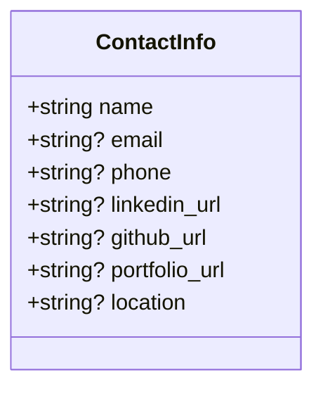
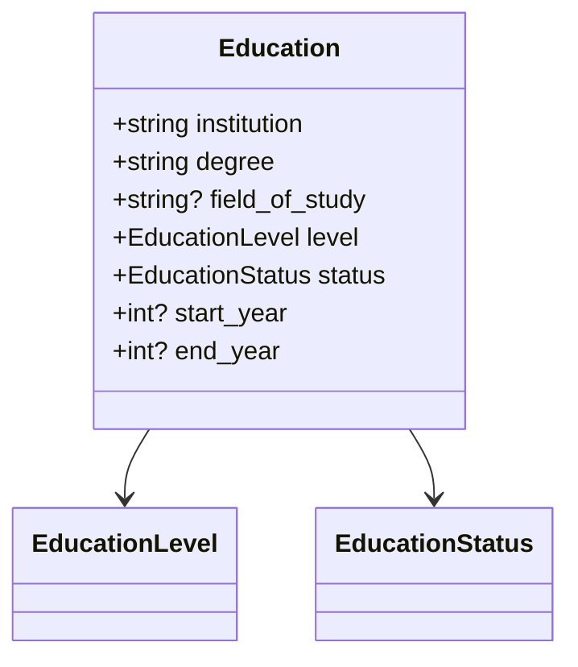
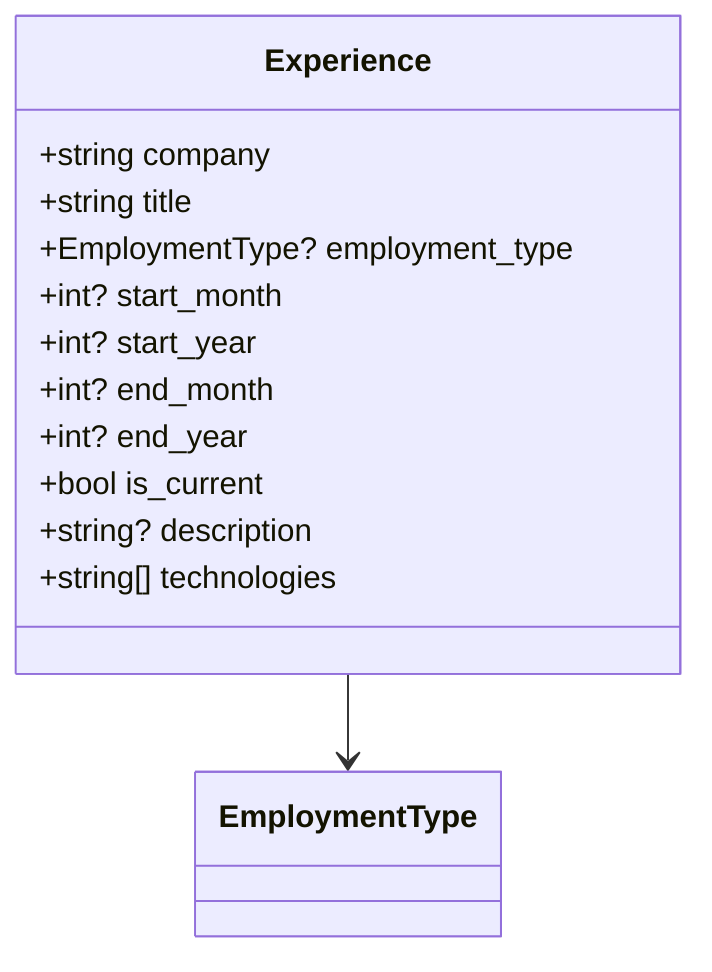
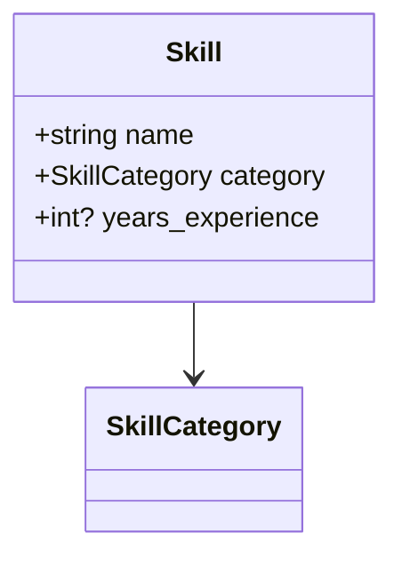
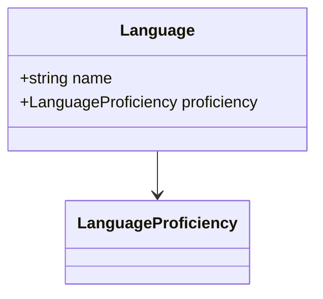
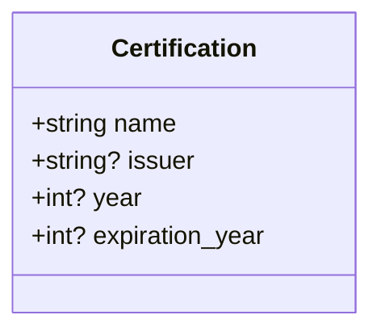
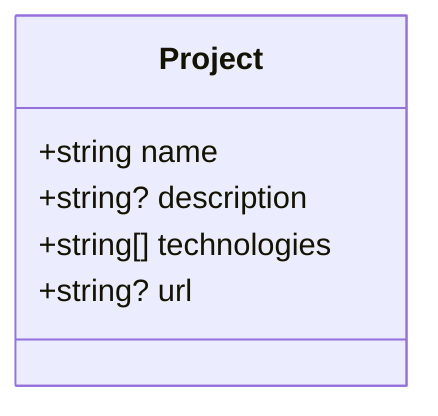
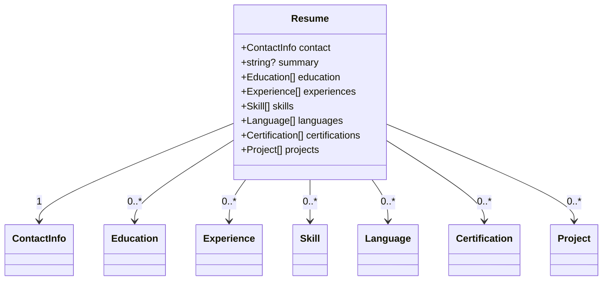
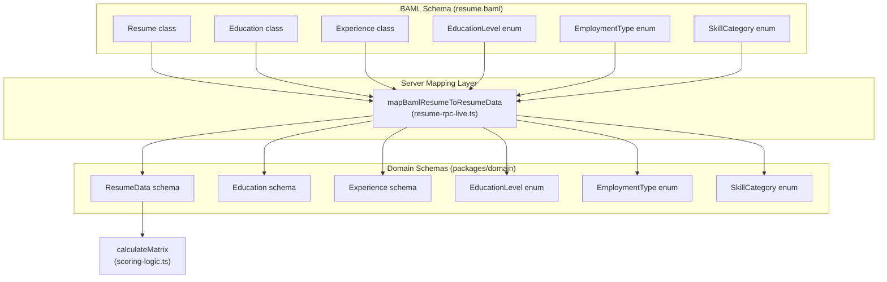
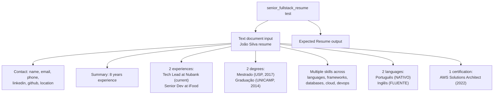

# Resume Extraction Schema

> **Relevant source files**
> * [packages/server/baml_src/clients.baml](https://github.com/oscaromsn/TalentScore/blob/428ed1eb/packages/server/baml_src/clients.baml)
> * [packages/server/baml_src/resume.baml](https://github.com/oscaromsn/TalentScore/blob/428ed1eb/packages/server/baml_src/resume.baml)

## Purpose and Scope

This document details the BAML schema definition used for structured LLM extraction of resume data. The schema defines five enumeration types and seven data models that together compose the `Resume` class. These type definitions enforce strict structure on LLM outputs, enabling deterministic scoring calculations downstream.

This page covers only the schema itself (enums and classes). For information about the extraction function that uses this schema, see [ExtractResume Function](/oscaromsn/TalentScore/4.3.3-extractresume-function). For details on LLM client configuration, see [LLM Client Configuration](/oscaromsn/TalentScore/4.3.1-llm-client-configuration). For how the scoring algorithm consumes this data, see [Scoring Algorithm](/oscaromsn/TalentScore/4.4.2-scoring-algorithm).

**Sources:** [packages/server/baml_src/resume.baml L1-L195](https://github.com/oscaromsn/TalentScore/blob/428ed1eb/packages/server/baml_src/resume.baml#L1-L195)

---

## Schema Architecture Overview

The BAML resume schema is organized into three layers: enumeration types for categorical data, granular data models for resume sections, and a root `Resume` class that aggregates all components.

```

```

**Design Rationale:**

* **Enums provide deterministic scoring inputs**: Categorical values like `EducationLevel` enable objective comparison across resumes
* **Granular models prevent data loss**: Separate classes for `Experience`, `Education`, etc. preserve all extracted information
* **Arrays enable multiple entries**: Resume sections like experiences and skills are modeled as arrays to capture complete work histories
* **Optional fields balance completeness with reality**: Fields marked with `?` acknowledge that not all resumes contain complete information

**Sources:** [packages/server/baml_src/resume.baml L1-L126](https://github.com/oscaromsn/TalentScore/blob/428ed1eb/packages/server/baml_src/resume.baml#L1-L126)

---

## Enumeration Types

### EducationLevel

Defines six standardized education levels aligned with Brazilian academic degrees.

| Enum Value | Meaning | Typical Duration |
| --- | --- | --- |
| `ENSINO_MEDIO` | High school | 3 years |
| `TECNOLOGO` | Technology degree | 2-3 years |
| `GRADUACAO` | Bachelor's degree | 4-5 years |
| `POS_GRADUACAO` | Specialization/Post-grad | 1-2 years |
| `MESTRADO` | Master's degree | 2 years |
| `DOUTORADO` | PhD/Doctorate | 4+ years |

The scoring algorithm uses this enum to weight education credentials. For example, `MESTRADO` and `DOUTORADO` receive higher dimension scores in academic or research-heavy contexts.

**Sources:** [packages/server/baml_src/resume.baml L5-L12](https://github.com/oscaromsn/TalentScore/blob/428ed1eb/packages/server/baml_src/resume.baml#L5-L12)

---

### EducationStatus

Captures the completion status of educational programs.

| Enum Value | Meaning | Scoring Impact |
| --- | --- | --- |
| `COMPLETO` | Completed | Full credit |
| `EM_ANDAMENTO` | In progress | Partial credit |
| `TRANCADO` | Suspended/On hold | Minimal credit |
| `INCOMPLETO` | Incomplete/Dropped out | Minimal credit |

The scoring logic treats `COMPLETO` and `EM_ANDAMENTO` as valid credentials, while `TRANCADO` and `INCOMPLETO` reduce the education dimension score.

**Sources:** [packages/server/baml_src/resume.baml L14-L19](https://github.com/oscaromsn/TalentScore/blob/428ed1eb/packages/server/baml_src/resume.baml#L14-L19)

---

### EmploymentType

Categorizes work arrangements to assess employment stability and experience quality.

| Enum Value | Meaning | Common in Brazil |
| --- | --- | --- |
| `CLT` | Full-time employment (Consolidação das Leis do Trabalho) | Most formal employment |
| `PJ` | Independent contractor (Pessoa Jurídica) | Freelance/contract work |
| `ESTAGIO` | Internship | Entry-level positions |
| `FREELANCE` | Project-based freelance work | Short-term engagements |
| `VOLUNTARIO` | Volunteer work | Non-paid experience |

The scoring algorithm differentiates between these types when calculating experience duration. `CLT` and `PJ` roles receive full weight, while `ESTAGIO` and `VOLUNTARIO` may receive reduced weight in certain contexts.

**Sources:** [packages/server/baml_src/resume.baml L21-L27](https://github.com/oscaromsn/TalentScore/blob/428ed1eb/packages/server/baml_src/resume.baml#L21-L27)

---

### LanguageProficiency

Five-level scale for language skills, from basic to native proficiency.

| Enum Value | Meaning | CEFR Equivalent |
| --- | --- | --- |
| `BASICO` | Basic/Elementary | A1-A2 |
| `INTERMEDIARIO` | Intermediate | B1-B2 |
| `AVANCADO` | Advanced | C1 |
| `FLUENTE` | Fluent/Proficient | C2 |
| `NATIVO` | Native speaker | N/A |

Language proficiency is particularly important for positions requiring international communication. The scoring logic considers English proficiency at `FLUENTE` or `NATIVO` level as a requirement for certain company contexts (e.g., multinational enterprises).

**Sources:** [packages/server/baml_src/resume.baml L29-L35](https://github.com/oscaromsn/TalentScore/blob/428ed1eb/packages/server/baml_src/resume.baml#L29-L35)

---

### SkillCategory

Ten categories for skill classification, enabling structured skill analysis.

| Category | Examples | Used For |
| --- | --- | --- |
| `PROGRAMMING_LANGUAGE` | TypeScript, Python, Java, Kotlin | Technical depth assessment |
| `FRAMEWORK` | React, Spring Boot, NestJS | Technology stack matching |
| `DATABASE` | PostgreSQL, MongoDB, Redis | Data layer expertise |
| `CLOUD` | AWS, Azure, GCP | Infrastructure knowledge |
| `DEVOPS` | Docker, Kubernetes, Terraform | Operations capability |
| `SOFT_SKILL` | Leadership, Communication | Team fit evaluation |
| `METHODOLOGY` | Scrum, Kanban, TDD | Process alignment |
| `TOOL` | Git, Jira, Figma | Workflow efficiency |
| `LANGUAGE` | English, Spanish | Communication ability |
| `OTHER` | Domain-specific skills | Catch-all category |

The scoring algorithm uses these categories to match candidate skills against position requirements. For example, a `TECH_LEAD` position heavily weights `SOFT_SKILL` and `METHODOLOGY` categories.

**Sources:** [packages/server/baml_src/resume.baml L37-L48](https://github.com/oscaromsn/TalentScore/blob/428ed1eb/packages/server/baml_src/resume.baml#L37-L48)

---

## Data Models

### ContactInfo Class



Captures candidate contact information and professional profile URLs. Only `name` is required; all other fields are optional to accommodate resumes with varying levels of contact detail.

**Field Usage:**

* `name`: Used as primary identifier in UI displays
* `email`, `phone`: Contact methods (not used in scoring)
* `linkedin_url`, `github_url`: Validate professional presence (bonus in scoring)
* `portfolio_url`: Additional credibility signal
* `location`: Geographic context (used for remote work assessment)

**Sources:** [packages/server/baml_src/resume.baml L54-L62](https://github.com/oscaromsn/TalentScore/blob/428ed1eb/packages/server/baml_src/resume.baml#L54-L62)

---

### Education Class



Represents a single educational credential. Multiple `Education` objects in the `Resume.education[]` array capture complete academic history.

**Field Details:**

* `institution`: University or school name (e.g., "USP", "UNICAMP")
* `degree`: Full degree name (e.g., "Mestrado em Ciência da Computação")
* `field_of_study`: Optional specialization (e.g., "Sistemas Distribuídos")
* `level`: Enum determining academic weight
* `status`: Completion status affecting scoring
* `start_year`, `end_year`: Used to calculate recency and duration

**Scoring Impact:** The highest `level` with `status=COMPLETO` or `EM_ANDAMENTO` determines the education dimension score. Multiple degrees at the same level do not compound.

**Sources:** [packages/server/baml_src/resume.baml L64-L72](https://github.com/oscaromsn/TalentScore/blob/428ed1eb/packages/server/baml_src/resume.baml#L64-L72)

---

### Experience Class



Captures a single work experience entry. The `technologies[]` array is critical for technical skill matching.

**Key Fields:**

* `company`: Employer name (used for prestige scoring in some contexts)
* `title`: Position held (e.g., "Senior Developer", "Tech Lead")
* `employment_type`: Affects experience weighting
* Date fields (`start_month`, `start_year`, `end_month`, `end_year`): Calculate tenure
* `is_current`: Boolean flag indicating active employment
* `description`: Free-text responsibilities (not used in scoring)
* `technologies[]`: Critical for skill-tech matching (e.g., `["TypeScript", "React", "AWS"]`)

**Duration Calculation:** If `is_current=true`, end date is assumed to be present. Total experience is summed across all entries, with adjustments for `employment_type`.

**Sources:** [packages/server/baml_src/resume.baml L74-L85](https://github.com/oscaromsn/TalentScore/blob/428ed1eb/packages/server/baml_src/resume.baml#L74-L85)

---

### Skill Class



Represents an individual skill with optional experience duration.

**Field Usage:**

* `name`: Skill identifier (e.g., "TypeScript", "Leadership")
* `category`: Enum classification for grouping
* `years_experience`: Optional duration (often not explicitly stated in resumes)

**Scoring Logic:** Skills are matched against position requirements by name and category. The scoring algorithm normalizes skill counts by category to avoid over-weighting candidates with exhaustive skill lists.

**Sources:** [packages/server/baml_src/resume.baml L87-L91](https://github.com/oscaromsn/TalentScore/blob/428ed1eb/packages/server/baml_src/resume.baml#L87-L91)

---

### Language Class



Captures language skills with standardized proficiency levels.

**Common Languages:**

* Portuguese: Typically `NATIVO` for Brazilian candidates
* English: Key differentiator for international positions
* Spanish: Bonus for Latin American market reach

**Sources:** [packages/server/baml_src/resume.baml L93-L96](https://github.com/oscaromsn/TalentScore/blob/428ed1eb/packages/server/baml_src/resume.baml#L93-L96)

---

### Certification Class



Represents professional certifications, which are weighted heavily in enterprise and cloud-heavy contexts.

**Examples:**

* "AWS Solutions Architect Associate" (issuer: "Amazon")
* "Certified Kubernetes Administrator" (issuer: "CNCF")
* "Scrum Master Certification" (issuer: "Scrum Alliance")

The scoring algorithm gives bonus points for recent certifications (within last 3 years) and penalizes expired certifications.

**Sources:** [packages/server/baml_src/resume.baml L98-L103](https://github.com/oscaromsn/TalentScore/blob/428ed1eb/packages/server/baml_src/resume.baml#L98-L103)

---

### Project Class



Captures side projects, open-source contributions, or portfolio work.

**Field Usage:**

* `name`: Project identifier
* `description`: Brief summary (not used in scoring)
* `technologies[]`: Adds to overall skill inventory
* `url`: Verifiable link (bonus credibility signal)

Projects are particularly valuable for candidates with limited professional experience, as they demonstrate initiative and technical capability.

**Sources:** [packages/server/baml_src/resume.baml L105-L110](https://github.com/oscaromsn/TalentScore/blob/428ed1eb/packages/server/baml_src/resume.baml#L105-L110)

---

## Root Resume Model

The `Resume` class aggregates all components into a single structured output.



**Field Cardinality:**

* `contact`: Required single object (every resume must have a name)
* `summary`: Optional professional summary text
* All other fields: Arrays allowing zero or more entries

**Streaming Behavior:** During extraction, the LLM progressively populates these arrays. The client receives `PartialResumeData` events as each section completes, enabling real-time UI updates before the full `Resume` is constructed.

**Sources:** [packages/server/baml_src/resume.baml L116-L125](https://github.com/oscaromsn/TalentScore/blob/428ed1eb/packages/server/baml_src/resume.baml#L116-L125)

---

## Schema-to-Domain Type Mapping

The BAML schema types are mapped to Effect Schema types in the domain package for use throughout the application.



**Mapping Process:**

1. `ExtractResume` function returns BAML-typed `Resume` object
2. Server mapping layer (`resume-rpc-live.ts`) transforms BAML types to domain types
3. Domain schemas enforce runtime validation via Effect Schema
4. Scoring logic consumes validated domain types

**Why Two Type Systems?**

* **BAML types** are optimized for LLM extraction with streaming support
* **Domain types** add additional validation rules and integrate with the Effect ecosystem
* Separation enables evolution of extraction schema independent of domain model

**Sources:** [packages/server/baml_src/resume.baml L1-L195](https://github.com/oscaromsn/TalentScore/blob/428ed1eb/packages/server/baml_src/resume.baml#L1-L195)

---

## Test Data

The schema includes a comprehensive test case demonstrating expected extraction output.



This test serves as both documentation and validation that the schema correctly extracts complex, multi-section resumes. The test input demonstrates realistic Brazilian resume formatting with Portuguese labels ("RESUMO", "EXPERIÊNCIA", "FORMAÇÃO", etc.).

**Sources:** [packages/server/baml_src/resume.baml L153-L194](https://github.com/oscaromsn/TalentScore/blob/428ed1eb/packages/server/baml_src/resume.baml#L153-L194)