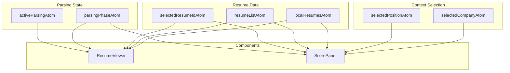
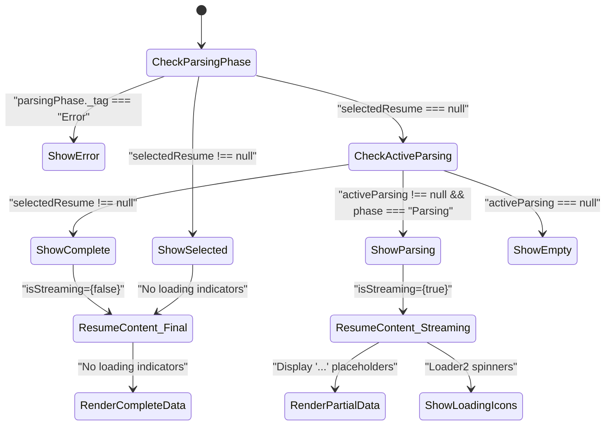
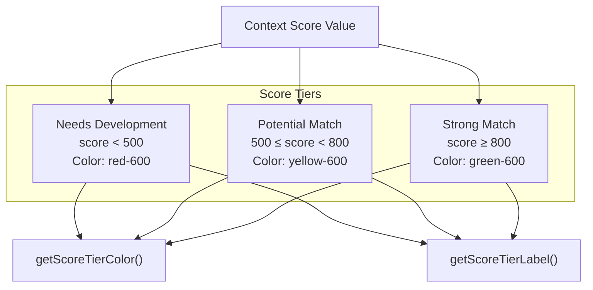
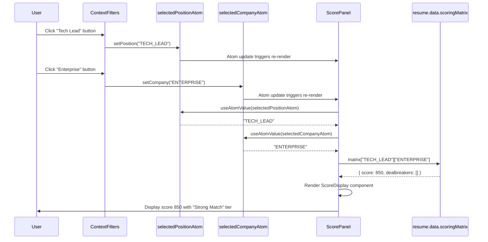

# Resume Features

> **Relevant source files**
> * [packages/client/src/routes/resume/-resume/components/context-filters.tsx](https://github.com/oscaromsn/TalentScore/blob/428ed1eb/packages/client/src/routes/resume/-resume/components/context-filters.tsx)
> * [packages/client/src/routes/resume/-resume/components/resume-viewer.tsx](https://github.com/oscaromsn/TalentScore/blob/428ed1eb/packages/client/src/routes/resume/-resume/components/resume-viewer.tsx)
> * [packages/client/src/routes/resume/-resume/components/score-panel.tsx](https://github.com/oscaromsn/TalentScore/blob/428ed1eb/packages/client/src/routes/resume/-resume/components/score-panel.tsx)

## Purpose and Scope

This document provides an overview of the resume analysis UI components in the TalentScore client application. These components render parsed resume data, display context-aware scores, and provide interactive filtering controls. The resume features implement a streaming display pattern that progressively renders data as it arrives from the AI parsing pipeline.

For detailed state management of resume parsing and upload workflows, see [Resume State Management](/oscaromsn/TalentScore/5.2.1-resume-state-management). For the complete list of all resumes, see [Resume History List](/oscaromsn/TalentScore/5.3.3-resume-history-list). For server-side parsing implementation, see [Resume Processing Pipeline](/oscaromsn/TalentScore/4.4-resume-processing-pipeline).

**Sources:** [packages/client/src/routes/resume/-resume/components/resume-viewer.tsx](https://github.com/oscaromsn/TalentScore/blob/428ed1eb/packages/client/src/routes/resume/-resume/components/resume-viewer.tsx)

 [packages/client/src/routes/resume/-resume/components/score-panel.tsx](https://github.com/oscaromsn/TalentScore/blob/428ed1eb/packages/client/src/routes/resume/-resume/components/score-panel.tsx)

---

## Component Architecture

The resume features consist of three primary React components that work together to provide a complete resume analysis interface:

| Component | File | Primary Responsibility |
| --- | --- | --- |
| `ResumeViewer` | [packages/client/src/routes/resume/-resume/components/resume-viewer.tsx L307-L370](https://github.com/oscaromsn/TalentScore/blob/428ed1eb/packages/client/src/routes/resume/-resume/components/resume-viewer.tsx#L307-L370) | Renders resume data with streaming support for partial updates |
| `ScorePanel` | [packages/client/src/routes/resume/-resume/components/score-panel.tsx L90-L167](https://github.com/oscaromsn/TalentScore/blob/428ed1eb/packages/client/src/routes/resume/-resume/components/score-panel.tsx#L90-L167) | Displays context-filtered score, tier classification, and dealbreakers |
| `ContextFilters` | [packages/client/src/routes/resume/-resume/components/context-filters.tsx L28-L75](https://github.com/oscaromsn/TalentScore/blob/428ed1eb/packages/client/src/routes/resume/-resume/components/context-filters.tsx#L28-L75) | Provides position type and company profile selection controls |

### Component Hierarchy and Data Flow

```

```

**Sources:** [packages/client/src/routes/resume/-resume/components/resume-viewer.tsx](https://github.com/oscaromsn/TalentScore/blob/428ed1eb/packages/client/src/routes/resume/-resume/components/resume-viewer.tsx)

 [packages/client/src/routes/resume/-resume/components/score-panel.tsx](https://github.com/oscaromsn/TalentScore/blob/428ed1eb/packages/client/src/routes/resume/-resume/components/score-panel.tsx)

 [packages/client/src/routes/resume/-resume/components/context-filters.tsx](https://github.com/oscaromsn/TalentScore/blob/428ed1eb/packages/client/src/routes/resume/-resume/components/context-filters.tsx)

---

## State Management Integration

The resume features consume multiple Effect Atoms to coordinate their display logic. The atoms provide reactive updates as parsing progresses or user selections change.

### Primary Atom Dependencies



The `ResumeViewer` and `ScorePanel` both implement the same resume lookup logic to find the selected resume from two sources:

1. **Local Cache First**: Check `localResumesAtom` for newly parsed resumes not yet synced to server
2. **Server List Fallback**: Check `resumeListAtom` for previously parsed resumes

This dual-source strategy ensures immediate display of new parses while maintaining access to historical data.

**Sources:** [packages/client/src/routes/resume/-resume/components/resume-viewer.tsx L307-L329](https://github.com/oscaromsn/TalentScore/blob/428ed1eb/packages/client/src/routes/resume/-resume/components/resume-viewer.tsx#L307-L329)

 [packages/client/src/routes/resume/-resume/components/score-panel.tsx L90-L114](https://github.com/oscaromsn/TalentScore/blob/428ed1eb/packages/client/src/routes/resume/-resume/components/score-panel.tsx#L90-L114)

---

## Streaming Display Pattern

The resume components implement a progressive rendering pattern that updates the UI in real-time as partial data arrives from the BAML extraction stream.

### Parsing Phase State Machine

The `parsingPhaseAtom` transitions through three states:

| State | Type | Display Behavior |
| --- | --- | --- |
| `Idle` | No active parsing | Show empty state or selected resume |
| `Parsing` | `{ _tag: "Parsing", partial: PartialResumeData }` | Render partial data with loading indicators |
| `Complete` | `{ _tag: "Complete", analysis: ResumeAnalysis }` | Render complete data with scores |
| `Error` | `{ _tag: "Error", message: string }` | Display error banner |

### Progressive Rendering Implementation

The `ResumeViewer` component handles streaming display through conditional logic:



The `ResumeContent` component receives an `isStreaming` prop that controls placeholder rendering:

* **Name Field**: Shows "Extracting name..." during streaming [packages/client/src/routes/resume/-resume/components/resume-viewer.tsx L118-L122](https://github.com/oscaromsn/TalentScore/blob/428ed1eb/packages/client/src/routes/resume/-resume/components/resume-viewer.tsx#L118-L122)
* **Experience Items**: Display "..." for missing title/company fields [packages/client/src/routes/resume/-resume/components/resume-viewer.tsx L49-L50](https://github.com/oscaromsn/TalentScore/blob/428ed1eb/packages/client/src/routes/resume/-resume/components/resume-viewer.tsx#L49-L50)
* **Section Headers**: Include `Loader2` spinner icon when streaming [packages/client/src/routes/resume/-resume/components/resume-viewer.tsx L159-L161](https://github.com/oscaromsn/TalentScore/blob/428ed1eb/packages/client/src/routes/resume/-resume/components/resume-viewer.tsx#L159-L161)

**Sources:** [packages/client/src/routes/resume/-resume/components/resume-viewer.tsx L307-L370](https://github.com/oscaromsn/TalentScore/blob/428ed1eb/packages/client/src/routes/resume/-resume/components/resume-viewer.tsx#L307-L370)

 [packages/client/src/routes/resume/-resume/components/resume-viewer.tsx L106-L304](https://github.com/oscaromsn/TalentScore/blob/428ed1eb/packages/client/src/routes/resume/-resume/components/resume-viewer.tsx#L106-L304)

---

## Context-Aware Scoring Display

The scoring system evaluates resumes across a 5×4 matrix of contexts (5 position types × 4 company profiles). The UI provides interactive filters to select which context score to display.

### Position Types and Company Profiles

The `ContextFilters` component allows users to select evaluation context:

**Position Types** (defined in [packages/client/src/routes/resume/-resume/components/context-filters.tsx L13-L19](https://github.com/oscaromsn/TalentScore/blob/428ed1eb/packages/client/src/routes/resume/-resume/components/context-filters.tsx#L13-L19)

):

* `FRONTEND` - Frontend Engineer
* `BACKEND` - Backend Engineer
* `FULLSTACK` - Full Stack Engineer
* `DEVOPS` - DevOps Engineer
* `TECH_LEAD` - Technical Lead

**Company Profiles** (defined in [packages/client/src/routes/resume/-resume/components/context-filters.tsx L21-L26](https://github.com/oscaromsn/TalentScore/blob/428ed1eb/packages/client/src/routes/resume/-resume/components/context-filters.tsx#L21-L26)

):

* `STARTUP_EARLY` - Early-stage startup
* `SCALEUP` - Growth-stage company
* `ENTERPRISE` - Large enterprise
* `CONSULTORIA` - Consulting firm

These selections are stored in `selectedPositionAtom` and `selectedCompanyAtom` atoms, which both components use to index into the scoring matrix.

### Score Display Components

The `ScorePanel` renders three key elements:

1. **Score Badge**: Large circular display with color-coded tier [packages/client/src/routes/resume/-resume/components/score-panel.tsx L42-L45](https://github.com/oscaromsn/TalentScore/blob/428ed1eb/packages/client/src/routes/resume/-resume/components/score-panel.tsx#L42-L45)
2. **Tier Classification**: Label and explanation of score range [packages/client/src/routes/resume/-resume/components/score-panel.tsx L47-L52](https://github.com/oscaromsn/TalentScore/blob/428ed1eb/packages/client/src/routes/resume/-resume/components/score-panel.tsx#L47-L52)
3. **Dealbreakers**: Context-specific warning list [packages/client/src/routes/resume/-resume/components/score-panel.tsx L73-L85](https://github.com/oscaromsn/TalentScore/blob/428ed1eb/packages/client/src/routes/resume/-resume/components/score-panel.tsx#L73-L85)

### Score Tier System



The tier functions (`getScoreTierColor` and `getScoreTierLabel`) are imported from the resume atoms module and provide consistent classification across the application.

**Sources:** [packages/client/src/routes/resume/-resume/components/score-panel.tsx L30-L88](https://github.com/oscaromsn/TalentScore/blob/428ed1eb/packages/client/src/routes/resume/-resume/components/score-panel.tsx#L30-L88)

 [packages/client/src/routes/resume/-resume/components/context-filters.tsx L28-L75](https://github.com/oscaromsn/TalentScore/blob/428ed1eb/packages/client/src/routes/resume/-resume/components/context-filters.tsx#L28-L75)

---

## Dealbreaker Display

Dealbreakers are context-specific factors that may disqualify a candidate for a particular role. The scoring algorithm detects these during analysis, and the UI displays them prominently.

### Dealbreaker Formatting

The `ScorePanel` includes a mapping of dealbreaker keys to human-readable labels [packages/client/src/routes/resume/-resume/components/score-panel.tsx L19-L24](https://github.com/oscaromsn/TalentScore/blob/428ed1eb/packages/client/src/routes/resume/-resume/components/score-panel.tsx#L19-L24)

:

| Dealbreaker Key | Display Label |
| --- | --- |
| `missing_certification` | "Missing required certifications" |
| `no_leadership_experience` | "No leadership experience detected" |
| `outdated_tech_stack` | "Technology stack appears outdated" |
| `insufficient_experience` | "Insufficient years of experience" |

The `formatDealbreaker` function converts keys not in the mapping by replacing underscores with spaces [packages/client/src/routes/resume/-resume/components/score-panel.tsx L26-L28](https://github.com/oscaromsn/TalentScore/blob/428ed1eb/packages/client/src/routes/resume/-resume/components/score-panel.tsx#L26-L28)

### Conditional Rendering

Dealbreakers only display when the array is non-empty [packages/client/src/routes/resume/-resume/components/score-panel.tsx L73-L85](https://github.com/oscaromsn/TalentScore/blob/428ed1eb/packages/client/src/routes/resume/-resume/components/score-panel.tsx#L73-L85)

 The section uses destructive styling (red background/border) to draw attention to critical issues.

**Sources:** [packages/client/src/routes/resume/-resume/components/score-panel.tsx L19-L28](https://github.com/oscaromsn/TalentScore/blob/428ed1eb/packages/client/src/routes/resume/-resume/components/score-panel.tsx#L19-L28)

 [packages/client/src/routes/resume/-resume/components/score-panel.tsx L73-L85](https://github.com/oscaromsn/TalentScore/blob/428ed1eb/packages/client/src/routes/resume/-resume/components/score-panel.tsx#L73-L85)

---

## Component Interaction Sequence

The following diagram shows the complete data flow when a user changes context filters:



Both `ContextFilters` and `ScorePanel` use the same atoms, ensuring synchronized state across components. The `ScorePanel` indexes into the scoring matrix using the current position and company values [packages/client/src/routes/resume/-resume/components/score-panel.tsx L133](https://github.com/oscaromsn/TalentScore/blob/428ed1eb/packages/client/src/routes/resume/-resume/components/score-panel.tsx#L133-L133)

 [packages/client/src/routes/resume/-resume/components/score-panel.tsx L144](https://github.com/oscaromsn/TalentScore/blob/428ed1eb/packages/client/src/routes/resume/-resume/components/score-panel.tsx#L144-L144)

**Sources:** [packages/client/src/routes/resume/-resume/components/context-filters.tsx L28-L75](https://github.com/oscaromsn/TalentScore/blob/428ed1eb/packages/client/src/routes/resume/-resume/components/context-filters.tsx#L28-L75)

 [packages/client/src/routes/resume/-resume/components/score-panel.tsx L90-L167](https://github.com/oscaromsn/TalentScore/blob/428ed1eb/packages/client/src/routes/resume/-resume/components/score-panel.tsx#L90-L167)

---

## Resume Data Model Visualization

The `ResumeViewer` renders all fields from the `ResumeData` schema, organized into visual sections:

```mermaid
flowchart TD

ResumeData["ResumeData Schema"]
Name["name: string"]
Email["email?: string"]
Phone["phone?: string"]
Location["location?: string"]
Summary["summary?: string"]
Experience["experience: Experience[]"]
ExpTitle["title: string"]
ExpCompany["company: string"]
ExpDates["startYear, endYear, isCurrent"]
ExpDesc["description?: string"]
ExpTech["technologies: string[]"]
Education["education: Education[]"]
EduDegree["degree: string"]
EduInst["institution: string"]
EduField["fieldOfStudy?: string"]
EduLevel["level: EducationLevel"]
EduStatus["status: EducationStatus"]
Skills["skills: Skill[]"]
SkillName["name: string"]
SkillCategory["category: string"]
SkillYears["yearsExperience?: number"]
Certs["certifications: Certification[]"]
CertName["name: string"]
CertIssuer["issuer?: string"]
CertYear["year?: number"]
Languages["languages: Language[]"]
LangName["name: string"]
LangProf["proficiency: string"]

ResumeData --> Name
ResumeData --> Email
ResumeData --> Phone
ResumeData --> Location
ResumeData --> Summary
ResumeData --> Experience
ResumeData --> Education
ResumeData --> Skills
ResumeData --> Certs
ResumeData --> Languages

subgraph subGraph5 ["Languages Section"]
    Languages
    LangName
    LangProf
    Languages --> LangName
    Languages --> LangProf
end

subgraph subGraph4 ["Certifications Section"]
    Certs
    CertName
    CertIssuer
    CertYear
    Certs --> CertName
    Certs --> CertIssuer
    Certs --> CertYear
end

subgraph subGraph3 ["Skills Section"]
    Skills
    SkillName
    SkillCategory
    SkillYears
    Skills --> SkillName
    Skills --> SkillCategory
    Skills --> SkillYears
end

subgraph subGraph2 ["Education Section"]
    Education
    EduDegree
    EduInst
    EduField
    EduLevel
    EduStatus
    Education --> EduDegree
    Education --> EduInst
    Education --> EduField
    Education --> EduLevel
    Education --> EduStatus
end

subgraph subGraph1 ["Experience Section"]
    Experience
    ExpTitle
    ExpCompany
    ExpDates
    ExpDesc
    ExpTech
    Experience --> ExpTitle
    Experience --> ExpCompany
    Experience --> ExpDates
    Experience --> ExpDesc
    Experience --> ExpTech
end

subgraph subGraph0 ["Header Section"]
    Name
    Email
    Phone
    Location
    Summary
end
```



Each section is implemented as a separate rendering block within the `ResumeContent` component:

* **Header**: [packages/client/src/routes/resume/-resume/components/resume-viewer.tsx L113-L152](https://github.com/oscaromsn/TalentScore/blob/428ed1eb/packages/client/src/routes/resume/-resume/components/resume-viewer.tsx#L113-L152)
* **Experience**: [packages/client/src/routes/resume/-resume/components/resume-viewer.tsx L154-L175](https://github.com/oscaromsn/TalentScore/blob/428ed1eb/packages/client/src/routes/resume/-resume/components/resume-viewer.tsx#L154-L175)
* **Education**: [packages/client/src/routes/resume/-resume/components/resume-viewer.tsx L177-L200](https://github.com/oscaromsn/TalentScore/blob/428ed1eb/packages/client/src/routes/resume/-resume/components/resume-viewer.tsx#L177-L200)
* **Skills**: [packages/client/src/routes/resume/-resume/components/resume-viewer.tsx L202-L234](https://github.com/oscaromsn/TalentScore/blob/428ed1eb/packages/client/src/routes/resume/-resume/components/resume-viewer.tsx#L202-L234)
* **Certifications**: [packages/client/src/routes/resume/-resume/components/resume-viewer.tsx L236-L269](https://github.com/oscaromsn/TalentScore/blob/428ed1eb/packages/client/src/routes/resume/-resume/components/resume-viewer.tsx#L236-L269)
* **Languages**: [packages/client/src/routes/resume/-resume/components/resume-viewer.tsx L271-L302](https://github.com/oscaromsn/TalentScore/blob/428ed1eb/packages/client/src/routes/resume/-resume/components/resume-viewer.tsx#L271-L302)

**Sources:** [packages/client/src/routes/resume/-resume/components/resume-viewer.tsx L106-L304](https://github.com/oscaromsn/TalentScore/blob/428ed1eb/packages/client/src/routes/resume/-resume/components/resume-viewer.tsx#L106-L304)

---

## Empty and Error States

Both `ResumeViewer` and `ScorePanel` implement comprehensive state handling:

### ResumeViewer States

| Condition | Display | Implementation |
| --- | --- | --- |
| `parsingPhase._tag === "Error"` | Error banner with message | [packages/client/src/routes/resume/-resume/components/resume-viewer.tsx L332-L340](https://github.com/oscaromsn/TalentScore/blob/428ed1eb/packages/client/src/routes/resume/-resume/components/resume-viewer.tsx#L332-L340) |
| `selectedResume !== null` | Full resume content | [packages/client/src/routes/resume/-resume/components/resume-viewer.tsx L343-L345](https://github.com/oscaromsn/TalentScore/blob/428ed1eb/packages/client/src/routes/resume/-resume/components/resume-viewer.tsx#L343-L345) |
| `parsingPhase._tag === "Parsing"` | Streaming banner + partial content | [packages/client/src/routes/resume/-resume/components/resume-viewer.tsx L349-L361](https://github.com/oscaromsn/TalentScore/blob/428ed1eb/packages/client/src/routes/resume/-resume/components/resume-viewer.tsx#L349-L361) |
| `parsingPhase._tag === "Complete"` | Complete resume content | [packages/client/src/routes/resume/-resume/components/resume-viewer.tsx L363-L365](https://github.com/oscaromsn/TalentScore/blob/428ed1eb/packages/client/src/routes/resume/-resume/components/resume-viewer.tsx#L363-L365) |
| No active state | Return `null` (parent handles) | [packages/client/src/routes/resume/-resume/components/resume-viewer.tsx L368-L369](https://github.com/oscaromsn/TalentScore/blob/428ed1eb/packages/client/src/routes/resume/-resume/components/resume-viewer.tsx#L368-L369) |

### ScorePanel States

| Condition | Display | Implementation |
| --- | --- | --- |
| Parsing active | Loading spinner + "Calculating score..." | [packages/client/src/routes/resume/-resume/components/score-panel.tsx L117-L129](https://github.com/oscaromsn/TalentScore/blob/428ed1eb/packages/client/src/routes/resume/-resume/components/score-panel.tsx#L117-L129) |
| Parsing complete | Score from new analysis | [packages/client/src/routes/resume/-resume/components/score-panel.tsx L132-L140](https://github.com/oscaromsn/TalentScore/blob/428ed1eb/packages/client/src/routes/resume/-resume/components/score-panel.tsx#L132-L140) |
| Resume selected | Score from selected resume | [packages/client/src/routes/resume/-resume/components/score-panel.tsx L143-L151](https://github.com/oscaromsn/TalentScore/blob/428ed1eb/packages/client/src/routes/resume/-resume/components/score-panel.tsx#L143-L151) |
| No selection | Award icon + "Select a resume" message | [packages/client/src/routes/resume/-resume/components/score-panel.tsx L154-L166](https://github.com/oscaromsn/TalentScore/blob/428ed1eb/packages/client/src/routes/resume/-resume/components/score-panel.tsx#L154-L166) |

Both components always render the `ContextFilters` component regardless of state, ensuring users can change context even while parsing is in progress.

**Sources:** [packages/client/src/routes/resume/-resume/components/resume-viewer.tsx L307-L370](https://github.com/oscaromsn/TalentScore/blob/428ed1eb/packages/client/src/routes/resume/-resume/components/resume-viewer.tsx#L307-L370)

 [packages/client/src/routes/resume/-resume/components/score-panel.tsx L90-L167](https://github.com/oscaromsn/TalentScore/blob/428ed1eb/packages/client/src/routes/resume/-resume/components/score-panel.tsx#L90-L167)