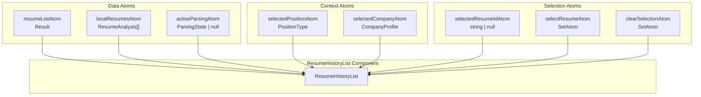
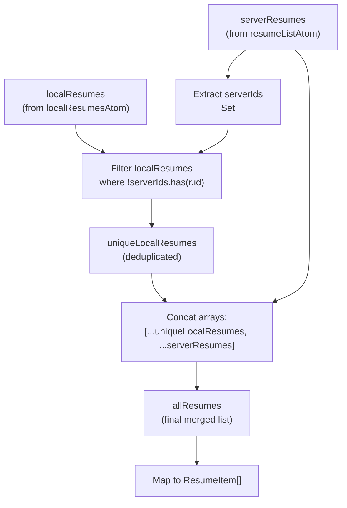
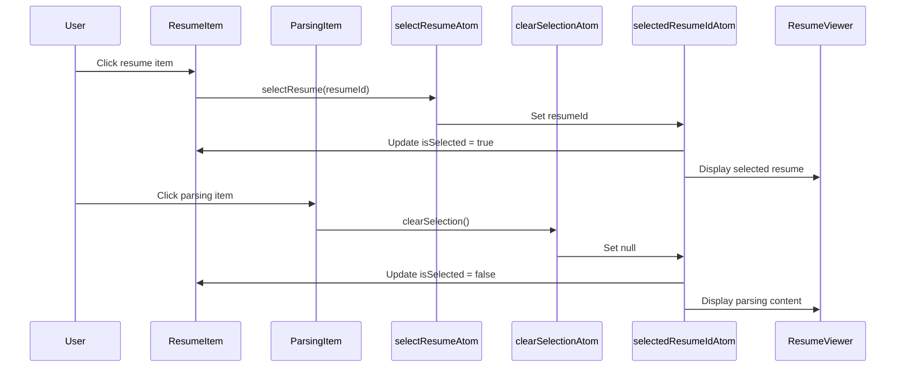
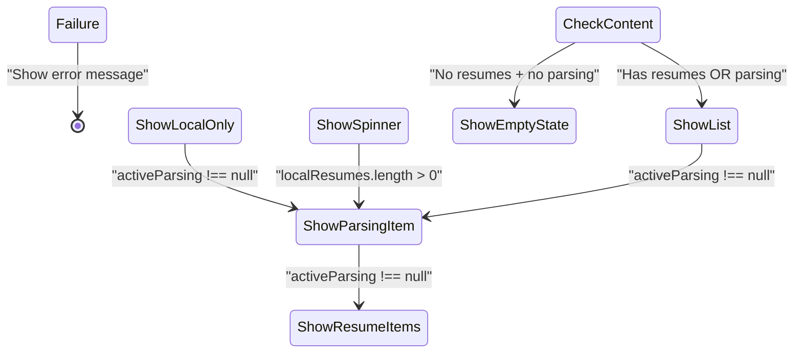
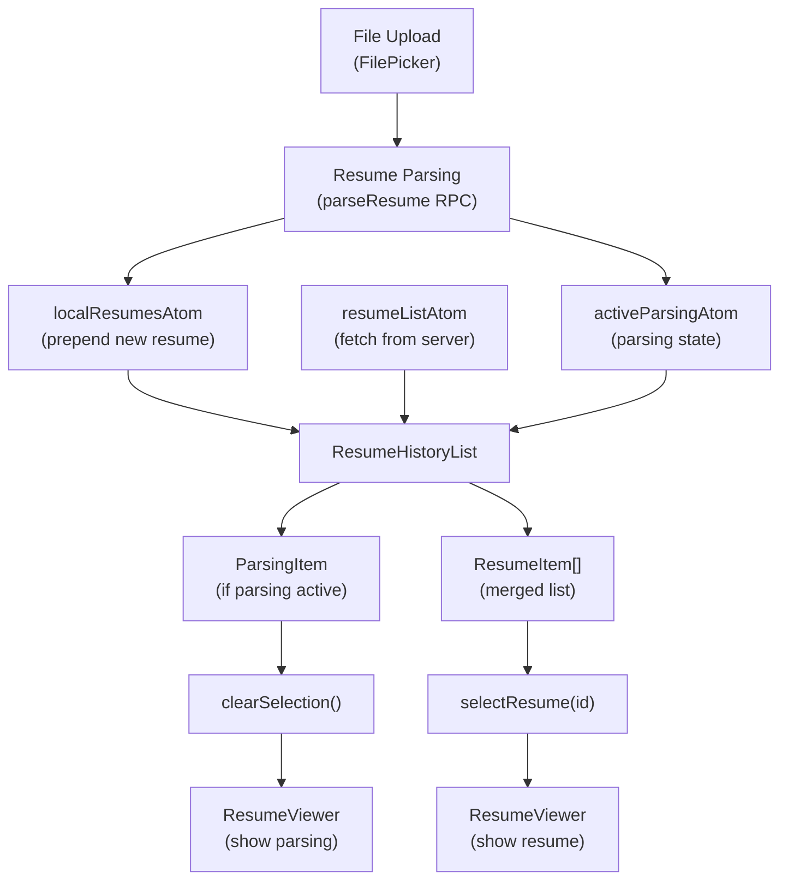

# Resume History List

> **Relevant source files**
> * [packages/client/src/routes/resume/-resume/components/resume-history-list.tsx](https://github.com/oscaromsn/TalentScore/blob/428ed1eb/packages/client/src/routes/resume/-resume/components/resume-history-list.tsx)

## Purpose and Scope

The Resume History List component provides a scrollable, interactive list of all resumes that have been analyzed, displaying context-specific scores based on the user's selected hiring context (position and company profile). It serves as the primary navigation interface for browsing and selecting resumes for detailed viewing.

This document covers the `ResumeHistoryList` component, its two item sub-components (`ResumeItem` and `ParsingItem`), and how it integrates with the resume state management system. For details on the resume viewer that displays full details of a selected resume, see [Resume Viewer Component](/oscaromsn/TalentScore/5.3.1-resume-viewer-component). For information on the scoring system and context filters, see [Score Panel and Context Filters](/oscaromsn/TalentScore/5.3.2-score-panel-and-context-filters).

**Sources:** [packages/client/src/routes/resume/-resume/components/resume-history-list.tsx L1-L182](https://github.com/oscaromsn/TalentScore/blob/428ed1eb/packages/client/src/routes/resume/-resume/components/resume-history-list.tsx#L1-L182)

---

## Component Architecture

The Resume History List consists of three React components that work together to display resume entries:

| Component | Purpose | Rendered When |
| --- | --- | --- |
| `ResumeHistoryList` | Main container component | Always (handles all states) |
| `ResumeItem` | Displays completed resume with score | Resume analysis is complete |
| `ParsingItem` | Displays resume being parsed | Resume is actively parsing |

### Component Hierarchy Diagram

```

```

**Sources:** [packages/client/src/routes/resume/-resume/components/resume-history-list.tsx L85-L182](https://github.com/oscaromsn/TalentScore/blob/428ed1eb/packages/client/src/routes/resume/-resume/components/resume-history-list.tsx#L85-L182)

---

## State Management Integration

The component subscribes to multiple atoms from the resume state management system to reactively update the UI:

### Atom Dependencies



### Atom Usage Table

| Atom | Type | Purpose | Access Pattern |
| --- | --- | --- | --- |
| `resumeListAtom` | `Result<ResumeAnalysis[]>` | Server-fetched resumes | `useAtomValue` (read-only) |
| `localResumesAtom` | `ResumeAnalysis[]` | Client-cached new resumes | `useAtomValue` (read-only) |
| `selectedResumeIdAtom` | `string \| null` | Currently selected resume ID | `useAtomValue` (read-only) |
| `activeParsingAtom` | `ParsingState \| null` | Resume being parsed | `useAtomValue` (read-only) |
| `selectedPositionAtom` | `PositionType` | Context for score display | `useAtomValue` (read-only) |
| `selectedCompanyAtom` | `CompanyProfile` | Context for score display | `useAtomValue` (read-only) |
| `selectResumeAtom` | `SetAtom<string>` | Action to select resume | `useAtomSet` (write-only) |
| `clearSelectionAtom` | `SetAtom<void>` | Action to clear selection | `useAtomSet` (write-only) |

**Sources:** [packages/client/src/routes/resume/-resume/components/resume-history-list.tsx L86-L93](https://github.com/oscaromsn/TalentScore/blob/428ed1eb/packages/client/src/routes/resume/-resume/components/resume-history-list.tsx#L86-L93)

---

## Resume List Composition

The component merges resumes from two sources to create a unified list:

### Data Source Merging Logic



### Deduplication Algorithm

The component implements a deduplication strategy where local resumes take precedence over server resumes:

1. **Extract Server IDs**: Create a `Set<string>` of all resume IDs from `serverResumes`
2. **Filter Local Resumes**: Remove any local resume whose ID exists in the server set
3. **Concatenate**: Place unique local resumes first, followed by server resumes

This ensures newly parsed resumes (cached locally) appear immediately without waiting for server refresh, while avoiding duplicate entries when the server list updates.

**Sources:** [packages/client/src/routes/resume/-resume/components/resume-history-list.tsx L100-L107](https://github.com/oscaromsn/TalentScore/blob/428ed1eb/packages/client/src/routes/resume/-resume/components/resume-history-list.tsx#L100-L107)

---

## Item Rendering Components

### ResumeItem Component

Displays a completed resume analysis with the following information:

| Display Element | Data Source | Description |
| --- | --- | --- |
| Candidate Name | `resume.data.name` | Primary display text |
| File Name | `resume.fileName` | Secondary text (muted) |
| Context Score | `resume.data.scoringMatrix[position][company].score` | Numeric score with color coding |
| Selection State | `isSelected` prop | Visual border and background styling |

#### Score Color Coding

The component uses the `getScoreTierColor()` utility function to apply color classes based on score ranges, providing visual feedback on resume quality within the selected context.

**Component Props:**

```

```

**Sources:** [packages/client/src/routes/resume/-resume/components/resume-history-list.tsx L21-L55](https://github.com/oscaromsn/TalentScore/blob/428ed1eb/packages/client/src/routes/resume/-resume/components/resume-history-list.tsx#L21-L55)

### ParsingItem Component

Displays a resume that is actively being parsed by the BAML extraction pipeline:

| Display Element | Value | Description |
| --- | --- | --- |
| Primary Text | "Parsing..." (italic, muted) | Indicates in-progress state |
| Secondary Text | `fileName` prop | Original file name |
| Icon | `<Loader2>` (spinning) | Animated loading indicator |
| Border Style | `border-primary/50` | Distinct visual treatment |

#### Viewing State

When the user views a parsing resume (by clicking on it), the component highlights with `border-primary bg-primary/10` to indicate it is the active view, while the Resume Viewer component displays partial data as it streams in.

**Component Props:**

```

```

**Sources:** [packages/client/src/routes/resume/-resume/components/resume-history-list.tsx L57-L83](https://github.com/oscaromsn/TalentScore/blob/428ed1eb/packages/client/src/routes/resume/-resume/components/resume-history-list.tsx#L57-L83)

---

## Selection and Interaction

### Selection Flow Diagram



### Selection Logic

The component determines the viewing state for parsing resumes using the following expression:

```

```

This means:

* When `selectedResumeIdAtom` is `null` and a parsing operation is active, the user is viewing the parsing progress
* When a resume ID is selected, the user is viewing a completed resume
* The Resume Viewer component responds to this same state to render appropriate content

**Sources:** [packages/client/src/routes/resume/-resume/components/resume-history-list.tsx L92-L96](https://github.com/oscaromsn/TalentScore/blob/428ed1eb/packages/client/src/routes/resume/-resume/components/resume-history-list.tsx#L92-L96)

---

## Loading and Error States

The component uses the `Result.builder` pattern from Effect Atoms to handle asynchronous state:

### State Handling Diagram



### State Implementation Details

#### Waiting State

When `resumeListAtom` is still loading:

* If `localResumes.length > 0`: Render local resumes immediately with their context scores
* If `localResumes.length === 0`: Display centered `<Loader2>` spinner
* If `activeParsing !== null`: Always show `ParsingItem` at the top regardless

This provides optimistic UI updates where newly parsed resumes appear instantly without waiting for server confirmation.

#### Success State

When `resumeListAtom` resolves successfully:

* Merge local and server resumes (deduplicated)
* Calculate `hasContent = allResumes.length > 0 || activeParsing !== null`
* If no content: Display empty state with `<FileText>` icon and "No resumes yet" message
* If has content: Render `ParsingItem` (if active) followed by all `ResumeItem` components

#### Failure State

When `resumeListAtom` encounters an error:

* Display centered error message: "Failed to load resumes"
* Uses `text-destructive` color for emphasis
* Does not render any resume items

**Sources:** [packages/client/src/routes/resume/-resume/components/resume-history-list.tsx L98-L181](https://github.com/oscaromsn/TalentScore/blob/428ed1eb/packages/client/src/routes/resume/-resume/components/resume-history-list.tsx#L98-L181)

---

## Integration with Resume Workflow

### Complete Workflow Context



The Resume History List acts as the navigation layer between resume parsing operations and the detailed Resume Viewer. When a user uploads a new resume:

1. The file is uploaded via UploadThing and parsing begins
2. `activeParsingAtom` updates with the parsing state
3. `ParsingItem` appears at the top of the list with a spinner
4. User can click the parsing item to watch partial data stream in the viewer
5. When parsing completes, `localResumesAtom` is updated
6. The resume transitions from `ParsingItem` to `ResumeItem` with its calculated score
7. Eventually, `resumeListAtom` refreshes from the server and deduplication ensures no duplicates

**Sources:** [packages/client/src/routes/resume/-resume/components/resume-history-list.tsx L1-L182](https://github.com/oscaromsn/TalentScore/blob/428ed1eb/packages/client/src/routes/resume/-resume/components/resume-history-list.tsx#L1-L182)