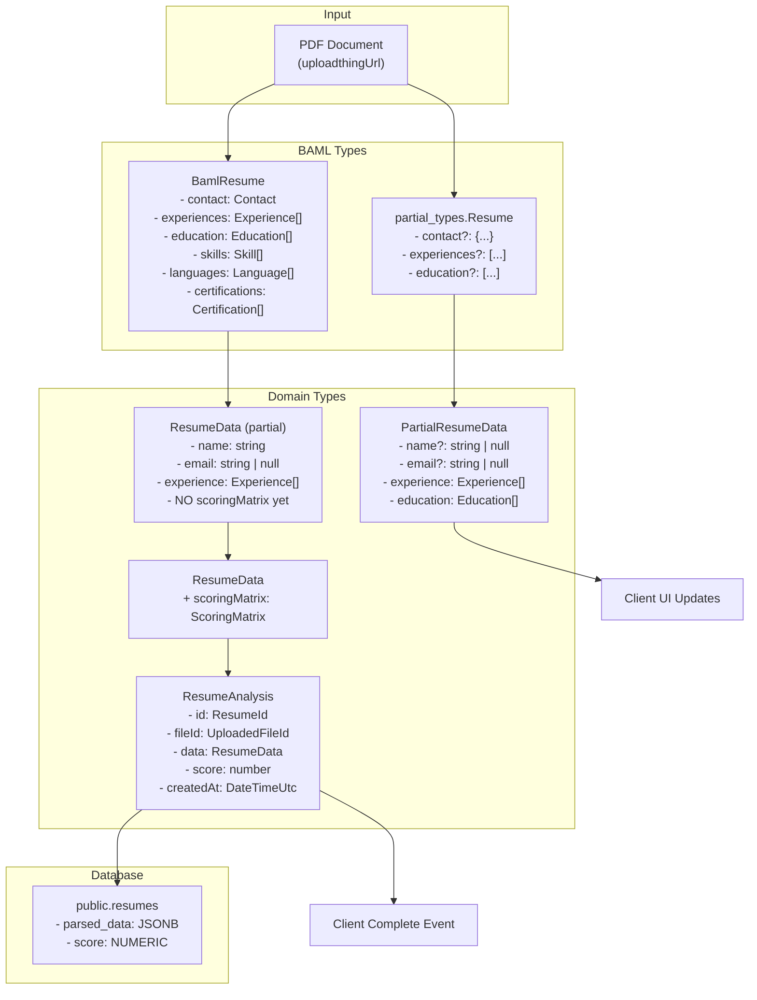
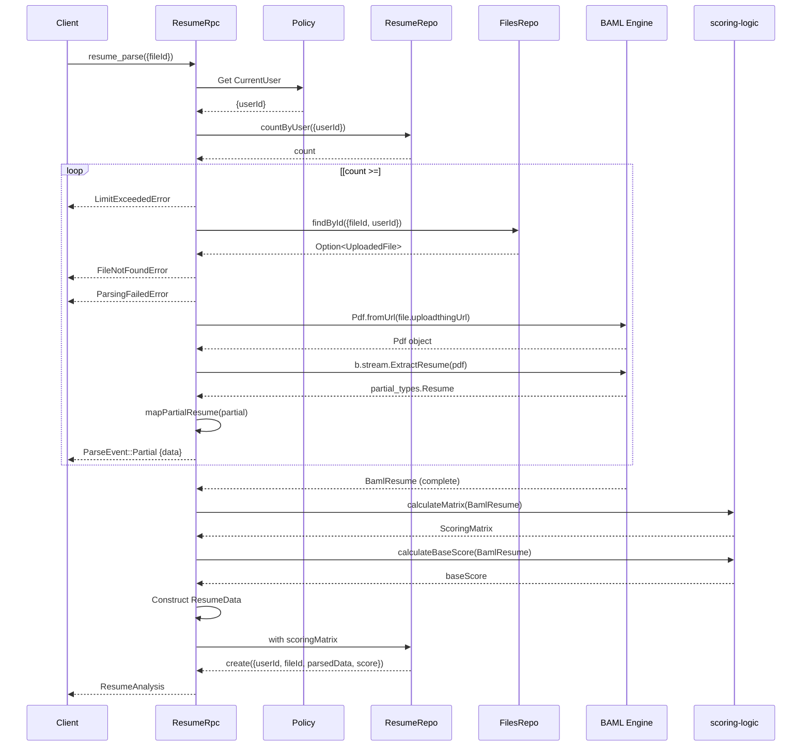
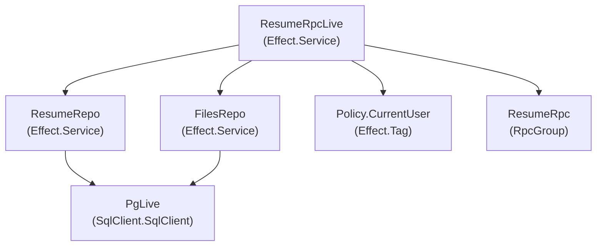
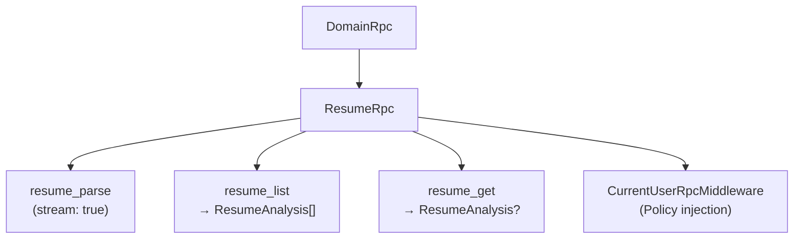

# Resume Processing Pipeline

> **Relevant source files**
> * [packages/domain/src/api/resume/index.ts](https://github.com/oscaromsn/TalentScore/blob/428ed1eb/packages/domain/src/api/resume/index.ts)
> * [packages/domain/src/api/resume/resume-rpc.ts](https://github.com/oscaromsn/TalentScore/blob/428ed1eb/packages/domain/src/api/resume/resume-rpc.ts)
> * [packages/domain/src/domain-api.ts](https://github.com/oscaromsn/TalentScore/blob/428ed1eb/packages/domain/src/domain-api.ts)
> * [packages/server/src/public/resume/resume-repo.ts](https://github.com/oscaromsn/TalentScore/blob/428ed1eb/packages/server/src/public/resume/resume-repo.ts)
> * [packages/server/src/public/resume/resume-rpc-live.ts](https://github.com/oscaromsn/TalentScore/blob/428ed1eb/packages/server/src/public/resume/resume-rpc-live.ts)

## Purpose and Scope

This document provides an overview of the resume processing pipeline, which transforms uploaded PDF resumes into structured, scored `ResumeAnalysis` objects. The pipeline orchestrates file retrieval, AI-powered extraction via BAML, context-aware scoring, and database persistence.

This page covers the high-level architecture and data flow. For implementation details of specific components, see:

* [Resume RPC Implementation](/oscaromsn/TalentScore/4.4.1-resume-rpc-implementation) - Server handlers and streaming architecture
* [Scoring Algorithm](/oscaromsn/TalentScore/4.4.2-scoring-algorithm) - Score calculation and weight resolution logic
* [Resume Repository](/oscaromsn/TalentScore/4.4.3-resume-repository) - Database persistence layer

For BAML configuration details, see [BAML Integration](/oscaromsn/TalentScore/4.3-baml-integration). For client-side resume state management, see [Resume State Management](/oscaromsn/TalentScore/5.2.1-resume-state-management).

---

## Pipeline Architecture

The resume processing pipeline implements a **streaming architecture** that provides incremental updates to the client as parsing progresses. The pipeline consists of six main stages:

```

```

**Sources:** [packages/server/src/public/resume/resume-rpc-live.ts L168-L267](https://github.com/oscaromsn/TalentScore/blob/428ed1eb/packages/server/src/public/resume/resume-rpc-live.ts#L168-L267)

---

## Data Flow and Type Transformations

The pipeline performs multiple type transformations as data flows through different layers:



**Sources:** [packages/server/src/public/resume/resume-rpc-live.ts L27-L147](https://github.com/oscaromsn/TalentScore/blob/428ed1eb/packages/server/src/public/resume/resume-rpc-live.ts#L27-L147)

 [packages/domain/src/api/resume/resume-rpc.ts L109-L149](https://github.com/oscaromsn/TalentScore/blob/428ed1eb/packages/domain/src/api/resume/resume-rpc.ts#L109-L149)

### Type Mapping Functions

The pipeline defines explicit mapper functions for each BAML type:

| BAML Type | Mapper Function | Domain Type | Key Transformations |
| --- | --- | --- | --- |
| `BamlResume["experiences"][number]` | `mapExperience()` | `Experience` | `employment_type` → `employmentType`, `start_month` → `startMonth` |
| `BamlResume["education"][number]` | `mapEducation()` | `Education` | `field_of_study` → `fieldOfStudy` |
| `BamlResume["skills"][number]` | `mapSkill()` | `Skill` | `years_experience` → `yearsExperience` |
| `BamlResume["languages"][number]` | `mapLanguage()` | `Language` | Direct mapping |
| `BamlResume["certifications"][number]` | `mapCertification()` | `Certification` | `expiration_year` → `expirationYear` |
| `partial_types.Resume` | `mapPartialResume()` | `PartialResumeData` | All fields optional, defaults to `null` |
| `BamlResume` | `mapFinalResume()` | `ResumeData (without scoringMatrix)` | Complete mapping |

**Sources:** [packages/server/src/public/resume/resume-rpc-live.ts L29-L147](https://github.com/oscaromsn/TalentScore/blob/428ed1eb/packages/server/src/public/resume/resume-rpc-live.ts#L29-L147)

---

## Component Interaction Diagram



**Sources:** [packages/server/src/public/resume/resume-rpc-live.ts L168-L267](https://github.com/oscaromsn/TalentScore/blob/428ed1eb/packages/server/src/public/resume/resume-rpc-live.ts#L168-L267)

---

## Stream Event Protocol

The pipeline emits two types of events via the `ParseEvent` union type:

### ParseEvent::Partial

Emitted multiple times during BAML streaming to provide incremental UI updates:

```

```

**Characteristics:**

* All scalar fields (name, email, etc.) are optional: `optionalWith(Schema.NullOr(Schema.String), { exact: true })`
* Array fields (experience, education, etc.) are always present but may be empty
* Client can render partial data immediately with loading indicators

**Sources:** [packages/domain/src/api/resume/resume-rpc.ts L126-L140](https://github.com/oscaromsn/TalentScore/blob/428ed1eb/packages/domain/src/api/resume/resume-rpc.ts#L126-L140)

### ParseEvent::Complete

Emitted once after scoring calculation completes:

```

```

**Characteristics:**

* Contains fully populated `ResumeData` with all required fields
* Includes `scoringMatrix` (5×4 context scores)
* Contains database-generated fields: `id`, `createdAt`
* Has `baseScore` for overall ranking

**Sources:** [packages/domain/src/api/resume/resume-rpc.ts L153-L161](https://github.com/oscaromsn/TalentScore/blob/428ed1eb/packages/domain/src/api/resume/resume-rpc.ts#L153-L161)

---

## Validation and Error Handling

The pipeline implements three layers of validation with corresponding error types:

| Validation Stage | Error Type | Condition | HTTP-like Status |
| --- | --- | --- | --- |
| User Limit Check | `LimitExceededError` | `count >= MAX_RESUMES_PER_USER (10)` | 429 Too Many Requests |
| File Existence | `FileNotFoundError` | `Option.isNone(fileOption)` | 404 Not Found |
| File Type Check | `ParsingFailedError` | `mimeType !== "application/pdf"` | 400 Bad Request |
| BAML Parsing | `ParsingFailedError` | BAML extraction fails or throws | 422 Unprocessable Entity |

**Error Schema Definitions:**

All errors are tagged using Effect's `Schema.TaggedError` pattern:

```

```

**Sources:** [packages/domain/src/api/resume/resume-rpc.ts L165-L182](https://github.com/oscaromsn/TalentScore/blob/428ed1eb/packages/domain/src/api/resume/resume-rpc.ts#L165-L182)

 [packages/server/src/public/resume/resume-rpc-live.ts L173-L201](https://github.com/oscaromsn/TalentScore/blob/428ed1eb/packages/server/src/public/resume/resume-rpc-live.ts#L173-L201)

---

## Database Persistence Schema

The pipeline stores processed resumes in the `public.resumes` table with the following structure:

```css
#mermaid-kvqg8n7r2s{font-family:ui-sans-serif,-apple-system,system-ui,Segoe UI,Helvetica;font-size:16px;fill:#ccc;}@keyframes edge-animation-frame{from{stroke-dashoffset:0;}}@keyframes dash{to{stroke-dashoffset:0;}}#mermaid-kvqg8n7r2s .edge-animation-slow{stroke-dasharray:9,5!important;stroke-dashoffset:900;animation:dash 50s linear infinite;stroke-linecap:round;}#mermaid-kvqg8n7r2s .edge-animation-fast{stroke-dasharray:9,5!important;stroke-dashoffset:900;animation:dash 20s linear infinite;stroke-linecap:round;}#mermaid-kvqg8n7r2s .error-icon{fill:#333;}#mermaid-kvqg8n7r2s .error-text{fill:#cccccc;stroke:#cccccc;}#mermaid-kvqg8n7r2s .edge-thickness-normal{stroke-width:1px;}#mermaid-kvqg8n7r2s .edge-thickness-thick{stroke-width:3.5px;}#mermaid-kvqg8n7r2s .edge-pattern-solid{stroke-dasharray:0;}#mermaid-kvqg8n7r2s .edge-thickness-invisible{stroke-width:0;fill:none;}#mermaid-kvqg8n7r2s .edge-pattern-dashed{stroke-dasharray:3;}#mermaid-kvqg8n7r2s .edge-pattern-dotted{stroke-dasharray:2;}#mermaid-kvqg8n7r2s .marker{fill:#666;stroke:#666;}#mermaid-kvqg8n7r2s .marker.cross{stroke:#666;}#mermaid-kvqg8n7r2s svg{font-family:ui-sans-serif,-apple-system,system-ui,Segoe UI,Helvetica;font-size:16px;}#mermaid-kvqg8n7r2s p{margin:0;}#mermaid-kvqg8n7r2s .entityBox{fill:#111;stroke:#222;}#mermaid-kvqg8n7r2s .relationshipLabelBox{fill:#333;opacity:0.7;background-color:#333;}#mermaid-kvqg8n7r2s .relationshipLabelBox rect{opacity:0.5;}#mermaid-kvqg8n7r2s .labelBkg{background-color:rgba(51, 51, 51, 0.5);}#mermaid-kvqg8n7r2s .edgeLabel .label{fill:#222;font-size:14px;}#mermaid-kvqg8n7r2s .label{font-family:ui-sans-serif,-apple-system,system-ui,Segoe UI,Helvetica;color:#fff;}#mermaid-kvqg8n7r2s .edge-pattern-dashed{stroke-dasharray:8,8;}#mermaid-kvqg8n7r2s .node rect,#mermaid-kvqg8n7r2s .node circle,#mermaid-kvqg8n7r2s .node ellipse,#mermaid-kvqg8n7r2s .node polygon{fill:#111;stroke:#222;stroke-width:1px;}#mermaid-kvqg8n7r2s .relationshipLine{stroke:#666;stroke-width:1;fill:none;}#mermaid-kvqg8n7r2s .marker{fill:none!important;stroke:#666!important;stroke-width:1;}#mermaid-kvqg8n7r2s :root{--mermaid-font-family:"trebuchet ms",verdana,arial,sans-serif;}file_idresumesUUIDidPKUUIDuser_idFKUUIDfile_idFKVARCHARfile_nameJSONBparsed_dataNUMERICscoreTIMESTAMPTZcreated_atfilesUUIDidPK
```

### JSONB Data Structure

The `parsed_data` column stores the complete `ResumeData` object as JSONB:

```

```

The `score` column stores the `baseScore` for efficient sorting/filtering without parsing JSONB.

**Sources:** [packages/server/src/public/resume/resume-repo.ts L14-L21](https://github.com/oscaromsn/TalentScore/blob/428ed1eb/packages/server/src/public/resume/resume-repo.ts#L14-L21)

 [packages/server/src/public/resume/resume-repo.ts L62-L80](https://github.com/oscaromsn/TalentScore/blob/428ed1eb/packages/server/src/public/resume/resume-repo.ts#L62-L80)

### Type-Safe JSONB Parsing

The `ResumeRepo` uses `Schema.parseJson()` to safely parse the JSONB string back to typed `ResumeData`:

```

```

**Sources:** [packages/server/src/public/resume/resume-repo.ts L14-L21](https://github.com/oscaromsn/TalentScore/blob/428ed1eb/packages/server/src/public/resume/resume-repo.ts#L14-L21)

---

## Service Dependencies

The `ResumeRpcLive` service requires two repository dependencies:



The dependencies are injected via Effect's layer system:

```

```

**Sources:** [packages/server/src/public/resume/resume-rpc-live.ts L149-L270](https://github.com/oscaromsn/TalentScore/blob/428ed1eb/packages/server/src/public/resume/resume-rpc-live.ts#L149-L270)

---

## RPC Contract Integration

The `ResumeRpc` group defines three RPC methods that are merged into the root `DomainRpc`:



**RPC Method Definitions:**

| Method | Stream | Payload | Success | Error |
| --- | --- | --- | --- | --- |
| `resume_parse` | ✅ Yes | `{fileId: UploadedFileId}` | `ParseEvent` | `LimitExceededError \| FileNotFoundError \| ParsingFailedError` |
| `resume_list` | ❌ No | None | `ResumeAnalysis[]` | - |
| `resume_get` | ❌ No | `{resumeId: ResumeId}` | `ResumeAnalysis \| null` | - |

All methods are prefixed with `resume_` and protected by `CurrentUserRpcMiddleware`, which injects the authenticated user into the request context.

**Sources:** [packages/domain/src/api/resume/resume-rpc.ts L186-L214](https://github.com/oscaromsn/TalentScore/blob/428ed1eb/packages/domain/src/api/resume/resume-rpc.ts#L186-L214)

 [packages/domain/src/domain-api.ts L1-L5](https://github.com/oscaromsn/TalentScore/blob/428ed1eb/packages/domain/src/domain-api.ts#L1-L5)

---

## Performance Characteristics

### Streaming Efficiency

The pipeline's streaming architecture provides several performance benefits:

1. **Progressive Rendering:** Client receives and displays partial data within 1-2 seconds (first BAML chunk)
2. **Perceived Speed:** Full UI populated before scoring calculation completes
3. **Memory Efficiency:** BAML streaming prevents buffering entire LLM response in memory
4. **Backpressure:** Effect Stream handles backpressure if client consumes slowly

### Database Operations

| Operation | Query Type | Indexes Used | Expected Time |
| --- | --- | --- | --- |
| `countByUser` | `COUNT(*)` | `user_id` index | < 10ms |
| `create` | `INSERT ... RETURNING` | Auto-increment primary key | < 20ms |
| `list` | `SELECT ... ORDER BY created_at DESC` | `(user_id, created_at)` composite | < 50ms |
| `findById` | `SELECT ... WHERE id = ? AND user_id = ?` | Primary key + user_id | < 10ms |

**Sources:** [packages/server/src/public/resume/resume-repo.ts L30-L137](https://github.com/oscaromsn/TalentScore/blob/428ed1eb/packages/server/src/public/resume/resume-repo.ts#L30-L137)

---

## Observability

The pipeline implements OpenTelemetry tracing at two levels:

### Repository-Level Spans

Each database operation creates a span:

```

```

**Sources:** [packages/server/src/public/resume/resume-repo.ts L49-L136](https://github.com/oscaromsn/TalentScore/blob/428ed1eb/packages/server/src/public/resume/resume-repo.ts#L49-L136)

### RPC-Level Tracing

The entire `resume_parse` operation is traced as a single span, with repository operations appearing as child spans in the trace hierarchy:

```sql
resume_parse [12.5s]
├─ ResumeRepo.countByUser [8ms]
├─ FilesRepo.findById [12ms]
├─ BAML.ExtractResume [10.2s]
├─ calculateMatrix [45ms]
├─ calculateBaseScore [15ms]
└─ ResumeRepo.create [18ms]
```

For details on viewing traces, see [Observability and Debugging](/oscaromsn/TalentScore/6.3-observability-and-debugging).

**Sources:** [packages/server/src/public/resume/resume-repo.ts L1-L147](https://github.com/oscaromsn/TalentScore/blob/428ed1eb/packages/server/src/public/resume/resume-repo.ts#L1-L147)