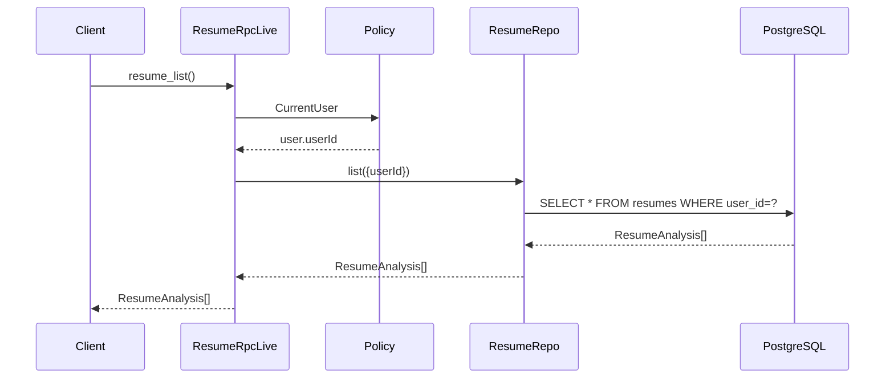
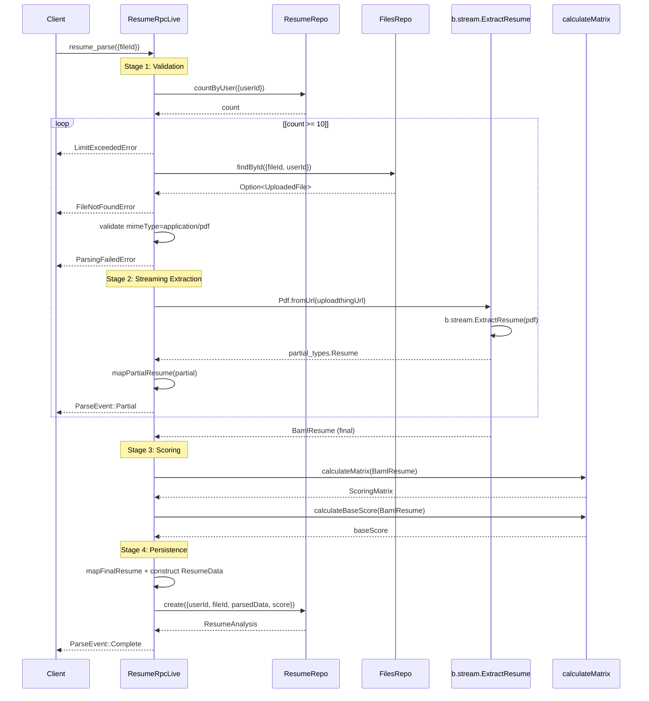
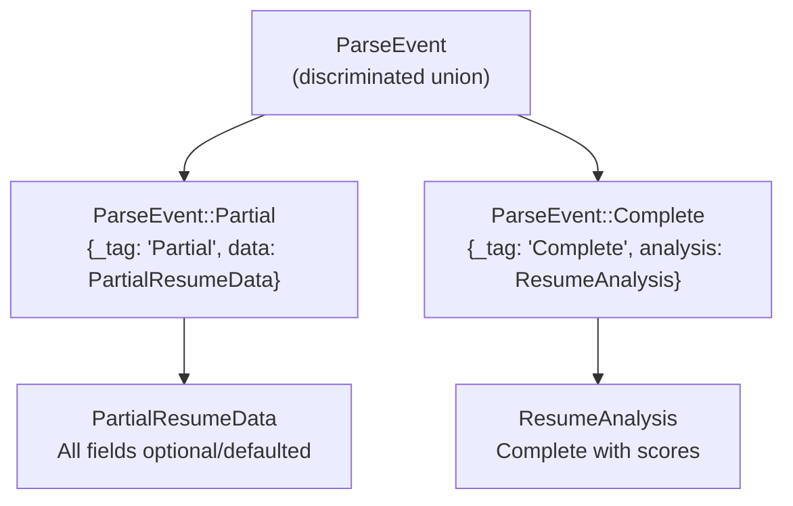
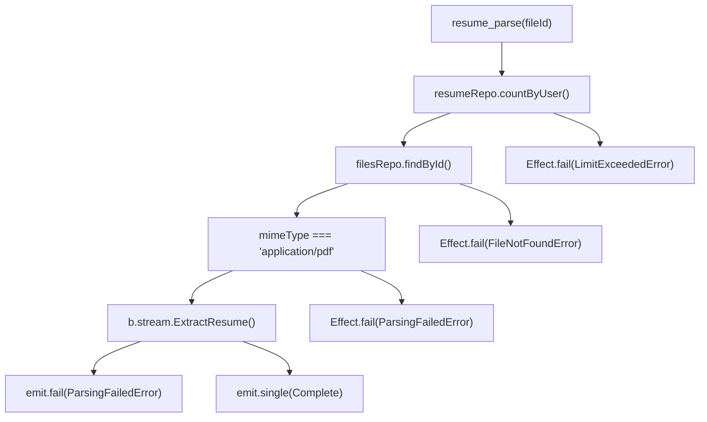

# Resume RPC Implementation

> **Relevant source files**
> * [packages/server/src/public/resume/resume-repo.ts](https://github.com/oscaromsn/TalentScore/blob/428ed1eb/packages/server/src/public/resume/resume-repo.ts)
> * [packages/server/src/public/resume/resume-rpc-live.ts](https://github.com/oscaromsn/TalentScore/blob/428ed1eb/packages/server/src/public/resume/resume-rpc-live.ts)

## Purpose and Scope

This document details the server-side implementation of the `ResumeRpc` contract defined in the domain package. The `ResumeRpcLive` service provides three RPC methods for resume management: listing resumes, retrieving individual resumes, and parsing new resumes from PDF files via streaming AI extraction.

This page focuses on the RPC service implementation layer. For the underlying data access patterns, see [Resume Repository](/oscaromsn/TalentScore/4.4.3-resume-repository). For the scoring algorithm that processes parsed resumes, see [Scoring Algorithm](/oscaromsn/TalentScore/4.4.2-scoring-algorithm). For the BAML extraction function that powers the parsing, see [ExtractResume Function](/oscaromsn/TalentScore/4.3.3-extractresume-function).

**Sources:** [packages/server/src/public/resume/resume-rpc-live.ts L1-L271](https://github.com/oscaromsn/TalentScore/blob/428ed1eb/packages/server/src/public/resume/resume-rpc-live.ts#L1-L271)

---

## Service Architecture

The `ResumeRpcLive` service implements the `ResumeRpc` contract through Effect's dependency injection system, composing two repository dependencies to fulfill its operations.

### Service Layer Diagram

```

```

**Sources:** [packages/server/src/public/resume/resume-rpc-live.ts L149-L270](https://github.com/oscaromsn/TalentScore/blob/428ed1eb/packages/server/src/public/resume/resume-rpc-live.ts#L149-L270)

### Dependency Injection

The service is constructed as an Effect Layer that provides dependencies to its implementation:

| Dependency | Type | Purpose |
| --- | --- | --- |
| `ResumeRepo` | Repository | Persist and query resume analyses in PostgreSQL |
| `FilesRepo` | Repository | Retrieve file metadata and validate file access |
| `Policy.CurrentUser` | Policy | Extract authenticated user context from request |

**Sources:** [packages/server/src/public/resume/resume-rpc-live.ts L149-L152](https://github.com/oscaromsn/TalentScore/blob/428ed1eb/packages/server/src/public/resume/resume-rpc-live.ts#L149-L152)

 [packages/server/src/public/resume/resume-rpc-live.ts L270](https://github.com/oscaromsn/TalentScore/blob/428ed1eb/packages/server/src/public/resume/resume-rpc-live.ts#L270-L270)

---

## RPC Method Implementations

The service exposes three methods that implement the `ResumeRpc` contract:

### resume_list

Returns all resume analyses for the authenticated user, ordered by creation date descending.



**Implementation:**

* Extracts `userId` from `Policy.CurrentUser`
* Delegates to `resumeRepo.list()` with user filter
* Returns array of `ResumeAnalysis` objects with parsed data and scores

**Sources:** [packages/server/src/public/resume/resume-rpc-live.ts L155-L158](https://github.com/oscaromsn/TalentScore/blob/428ed1eb/packages/server/src/public/resume/resume-rpc-live.ts#L155-L158)

 [packages/server/src/public/resume/resume-repo.ts L86-L110](https://github.com/oscaromsn/TalentScore/blob/428ed1eb/packages/server/src/public/resume/resume-repo.ts#L86-L110)

### resume_get

Retrieves a single resume analysis by ID, ensuring the requesting user owns the resume.

**Implementation:**

* Accepts `resumeId` in payload
* Extracts `userId` from `Policy.CurrentUser`
* Queries `resumeRepo.findById()` with both IDs for access control
* Returns `ResumeAnalysis | null`

**Sources:** [packages/server/src/public/resume/resume-rpc-live.ts L160-L166](https://github.com/oscaromsn/TalentScore/blob/428ed1eb/packages/server/src/public/resume/resume-rpc-live.ts#L160-L166)

 [packages/server/src/public/resume/resume-repo.ts L112-L137](https://github.com/oscaromsn/TalentScore/blob/428ed1eb/packages/server/src/public/resume/resume-repo.ts#L112-L137)

### resume_parse

Parses a PDF resume via streaming AI extraction, calculates context-aware scores, and persists the analysis. This is the core method that orchestrates the entire resume processing pipeline.

**Sources:** [packages/server/src/public/resume/resume-rpc-live.ts L168-L267](https://github.com/oscaromsn/TalentScore/blob/428ed1eb/packages/server/src/public/resume/resume-rpc-live.ts#L168-L267)

---

## Resume Parse Workflow

The `resume_parse` method implements a multi-stage pipeline that transforms a PDF file into a structured, scored resume analysis.

### Parse Workflow Sequence



**Sources:** [packages/server/src/public/resume/resume-rpc-live.ts L168-L267](https://github.com/oscaromsn/TalentScore/blob/428ed1eb/packages/server/src/public/resume/resume-rpc-live.ts#L168-L267)

### Workflow Stages

#### Stage 1: Validation (Lines 172-201)

Three validation checks ensure the parse operation can proceed:

| Check | Implementation | Error |
| --- | --- | --- |
| **User Limit** | `resumeRepo.countByUser()` | `LimitExceededError` if count ≥ 10 |
| **File Access** | `filesRepo.findById()` with `userId` | `FileNotFoundError` if not found |
| **PDF Format** | `file.mimeType === "application/pdf"` | `ParsingFailedError` if wrong type |

**Constant:** `MAX_RESUMES_PER_USER = 10`

**Sources:** [packages/server/src/public/resume/resume-rpc-live.ts L172-L201](https://github.com/oscaromsn/TalentScore/blob/428ed1eb/packages/server/src/public/resume/resume-rpc-live.ts#L172-L201)

#### Stage 2: Streaming Extraction (Lines 204-223)

BAML's streaming parser emits incremental results as the LLM generates structured data:

1. Create BAML PDF object: `Pdf.fromUrl(file.uploadthingUrl)`
2. Initialize stream: `b.stream.ExtractResume(pdf)`
3. Iterate over partial results: `for await (const partial of bamlStream)`
4. Map each partial to `PartialResumeData` domain type
5. Emit `ParseEvent::Partial` to client for progressive UI updates
6. Await final result: `bamlStream.getFinalResponse()`

**Sources:** [packages/server/src/public/resume/resume-rpc-live.ts L204-L223](https://github.com/oscaromsn/TalentScore/blob/428ed1eb/packages/server/src/public/resume/resume-rpc-live.ts#L204-L223)

#### Stage 3: Scoring (Lines 225-226)

The complete BAML result is passed to the scoring algorithm:

* `calculateMatrix(finalResult)`: Generates 5×4 context score matrix (Position × Company)
* `calculateBaseScore(finalResult)`: Calculates weighted average base score

**Sources:** [packages/server/src/public/resume/resume-rpc-live.ts L225-L226](https://github.com/oscaromsn/TalentScore/blob/428ed1eb/packages/server/src/public/resume/resume-rpc-live.ts#L225-L226)

#### Stage 4: Persistence (Lines 228-250)

The final analysis is constructed and saved:

1. Map BAML types to domain types: `mapFinalResume(finalResult)`
2. Construct `ResumeData` with scoring matrix
3. Create database record: `resumeRepo.create()`
4. Emit `ParseEvent::Complete` with `ResumeAnalysis`
5. End stream: `emit.end()`

**Sources:** [packages/server/src/public/resume/resume-rpc-live.ts L228-L250](https://github.com/oscaromsn/TalentScore/blob/428ed1eb/packages/server/src/public/resume/resume-rpc-live.ts#L228-L250)

---

## Type Mapping System

The service maintains a strict separation between BAML-generated types and domain types through explicit mapping functions.

### Type Hierarchy

```mermaid
flowchart TD

BamlResume["BamlResume<br>(generated)"]
PartialResume["partial_types.Resume<br>(streaming)"]
mapFinalResume["mapFinalResume()<br>lines 134-147"]
mapPartialResume["mapPartialResume()<br>lines 119-132"]
mapExperience["mapExperience()"]
mapEducation["mapEducation()"]
mapSkill["mapSkill()"]
mapLanguage["mapLanguage()"]
mapCertification["mapCertification()"]
mapPartialExperience["mapPartialExperience()"]
mapPartialEducation["mapPartialEducation()"]
mapPartialSkill["mapPartialSkill()"]
mapPartialLanguage["mapPartialLanguage()"]
mapPartialCertification["mapPartialCertification()"]
ResumeData["ResumeData<br>(from @example/domain)"]
PartialResumeData["PartialResumeData<br>(from @example/domain)"]

BamlResume --> mapFinalResume
mapFinalResume --> ResumeData
PartialResume --> mapPartialResume
mapPartialResume --> PartialResumeData

subgraph subGraph2 ["Domain Types"]
    ResumeData
    PartialResumeData
end

subgraph Mappers ["Mappers"]
    mapFinalResume
    mapPartialResume
    mapExperience
    mapEducation
    mapSkill
    mapLanguage
    mapCertification
    mapPartialExperience
    mapPartialEducation
    mapPartialSkill
    mapPartialLanguage
    mapPartialCertification
    mapFinalResume --> mapExperience
    mapFinalResume --> mapEducation
    mapFinalResume --> mapSkill
    mapFinalResume --> mapLanguage
    mapFinalResume --> mapCertification
    mapPartialResume --> mapPartialExperience
    mapPartialResume --> mapPartialEducation
    mapPartialResume --> mapPartialSkill
    mapPartialResume --> mapPartialLanguage
    mapPartialResume --> mapPartialCertification
end

subgraph subGraph0 ["BAML Types"]
    BamlResume
    PartialResume
end
```



**Sources:** [packages/server/src/public/resume/resume-rpc-live.ts L27-L147](https://github.com/oscaromsn/TalentScore/blob/428ed1eb/packages/server/src/public/resume/resume-rpc-live.ts#L27-L147)

### Final Type Mappers

Complete data mappers transform validated BAML results into domain types with strict null handling:

| Mapper Function | Input Type | Output Type | Key Transformations |
| --- | --- | --- | --- |
| `mapExperience` | `BamlResume["experiences"][number]` | Domain `Experience` | `employment_type` → `employmentType`, `is_current` → `isCurrent` |
| `mapEducation` | `BamlResume["education"][number]` | Domain `Education` | `field_of_study` → `fieldOfStudy` |
| `mapSkill` | `BamlResume["skills"][number]` | Domain `Skill` | `years_experience` → `yearsExperience` |
| `mapLanguage` | `BamlResume["languages"][number]` | Domain `Language` | Direct mapping with snake_case conversion |
| `mapCertification` | `BamlResume["certifications"][number]` | Domain `Certification` | `expiration_year` → `expirationYear` |

**Null Handling:** BAML optional fields (`?`) are coalesced to `null` using the nullish coalescing operator (`??`).

**Sources:** [packages/server/src/public/resume/resume-rpc-live.ts L29-L68](https://github.com/oscaromsn/TalentScore/blob/428ed1eb/packages/server/src/public/resume/resume-rpc-live.ts#L29-L68)

### Partial Type Mappers

Streaming mappers handle incomplete data with default values to ensure UI can render partial state:

| Default Strategy | Field Examples | Default Value |
| --- | --- | --- |
| **Empty String** | `company`, `title`, `name`, `degree` | `""` |
| **Null** | `employmentType`, `description`, `fieldOfStudy` | `null` |
| **False** | `isCurrent` | `false` |
| **Empty Array** | `technologies`, `experiences`, `skills` | `[]` |

**Example from `mapPartialExperience`:**

```yaml
{
  company: exp.company ?? "",
  title: exp.title ?? "",
  employmentType: exp.employment_type ?? null,
  isCurrent: exp.is_current ?? false,
  technologies: [...(exp.technologies ?? [])],
}
```

**Sources:** [packages/server/src/public/resume/resume-rpc-live.ts L78-L117](https://github.com/oscaromsn/TalentScore/blob/428ed1eb/packages/server/src/public/resume/resume-rpc-live.ts#L78-L117)

### Top-Level Mapping

The `mapPartialResume` and `mapFinalResume` functions aggregate nested mappers:

* **Partial:** Wraps all fields with nullish coalescing, maps arrays with partial mappers
* **Final:** Direct field access (validated by BAML), maps arrays with final mappers
* **Contact Fields:** Nested under `result.contact` in BAML, flattened to top-level in domain

**Sources:** [packages/server/src/public/resume/resume-rpc-live.ts L119-L147](https://github.com/oscaromsn/TalentScore/blob/428ed1eb/packages/server/src/public/resume/resume-rpc-live.ts#L119-L147)

---

## Streaming Implementation

The `resume_parse` method returns an Effect `Stream` rather than a single result, enabling real-time UI updates during LLM extraction.

### Stream Event Types



**Sources:** [packages/server/src/public/resume/resume-rpc-live.ts L209-L252](https://github.com/oscaromsn/TalentScore/blob/428ed1eb/packages/server/src/public/resume/resume-rpc-live.ts#L209-L252)

### Stream Construction

The Effect `Stream` is created using `Stream.async` with an unbounded buffer:

```javascript
Stream.async<ParseEvent, LimitExceededError | FileNotFoundError | ParsingFailedError>(
  (emit) => {
    (async () => {
      try {
        // Stream partial results
        for await (const partial of bamlStream) {
          emit.single({ _tag: "Partial", data: mapPartialResume(partial) });
        }
        
        // Get final result, score, persist
        const finalResult = await bamlStream.getFinalResponse();
        const analysis = await Effect.runPromise(/* ... */);
        
        emit.single({ _tag: "Complete", analysis });
        emit.end();
      } catch (error) {
        emit.fail(new ParsingFailedError({ /* ... */ }));
      }
    })();
  },
  "unbounded",
)
```

**Emission Operations:**

* `emit.single(event)`: Push event to stream
* `emit.end()`: Close stream after successful completion
* `emit.fail(error)`: Terminate stream with error

**Sources:** [packages/server/src/public/resume/resume-rpc-live.ts L209-L266](https://github.com/oscaromsn/TalentScore/blob/428ed1eb/packages/server/src/public/resume/resume-rpc-live.ts#L209-L266)

### Async-to-Stream Bridge

The inner async function bridges BAML's async iterator to Effect's Stream:

1. **BAML Iteration:** `for await (const partial of bamlStream)`
2. **Mapping Layer:** `mapPartialResume(partial)` converts types
3. **Stream Emission:** `emit.single()` pushes to Effect Stream
4. **Final Await:** `bamlStream.getFinalResponse()` blocks until complete
5. **Database Persistence:** `Effect.runPromise()` executes repository create
6. **Stream Completion:** `emit.end()` signals end-of-stream

**Sources:** [packages/server/src/public/resume/resume-rpc-live.ts L211-L252](https://github.com/oscaromsn/TalentScore/blob/428ed1eb/packages/server/src/public/resume/resume-rpc-live.ts#L211-L252)

---

## Error Handling

The service defines three domain-specific error types for resume parsing operations:

### Error Types Table

| Error Class | Trigger Condition | HTTP Equivalent | Recovery Action |
| --- | --- | --- | --- |
| `LimitExceededError` | User has ≥10 resumes | 403 Forbidden | Delete old resumes or upgrade account |
| `FileNotFoundError` | `fileId` not found or not owned by user | 404 Not Found | Verify file ID and user access |
| `ParsingFailedError` | Non-PDF file or BAML extraction failure | 422 Unprocessable Entity | Upload valid PDF resume |

**Sources:** [packages/server/src/public/resume/resume-rpc-live.ts L3-L11](https://github.com/oscaromsn/TalentScore/blob/428ed1eb/packages/server/src/public/resume/resume-rpc-live.ts#L3-L11)

### Error Handling Flow



**Sources:** [packages/server/src/public/resume/resume-rpc-live.ts L172-L261](https://github.com/oscaromsn/TalentScore/blob/428ed1eb/packages/server/src/public/resume/resume-rpc-live.ts#L172-L261)

### Error Message Construction

The `ParsingFailedError` provides detailed feedback when BAML extraction fails:

```yaml
catch (error) {
  emit.fail(
    new ParsingFailedError({
      message: error instanceof Error
        ? `Unable to parse resume: ${error.message}`
        : "Unable to parse resume. Please ensure the file is a valid resume document.",
    }),
  );
}
```

**Error Propagation:** All repository operations use `Effect.orDie` to convert SQL errors into defects, ensuring only domain errors are exposed to clients.

**Sources:** [packages/server/src/public/resume/resume-rpc-live.ts L254-L261](https://github.com/oscaromsn/TalentScore/blob/428ed1eb/packages/server/src/public/resume/resume-rpc-live.ts#L254-L261)

---

## Integration with Dependencies

The service orchestrates multiple dependencies to fulfill its operations:

### Dependency Usage Matrix

| Dependency | Used By Method | Purpose | Key Operations |
| --- | --- | --- | --- |
| `ResumeRepo` | All methods | Resume persistence | `countByUser`, `list`, `findById`, `create` |
| `FilesRepo` | `resume_parse` | File validation | `findById` to verify file access and get URL |
| `Policy.CurrentUser` | All methods | Authentication | Extract `userId` from request context |
| BAML (`b.stream`) | `resume_parse` | AI extraction | Stream resume data from PDF |
| `calculateMatrix` | `resume_parse` | Scoring | Generate context-aware score matrix |
| `calculateBaseScore` | `resume_parse` | Scoring | Calculate weighted average score |

**Sources:** [packages/server/src/public/resume/resume-rpc-live.ts L149-L270](https://github.com/oscaromsn/TalentScore/blob/428ed1eb/packages/server/src/public/resume/resume-rpc-live.ts#L149-L270)

### Layer Provision

The service layer explicitly provides its dependencies when constructing the implementation:

```javascript
export const ResumeRpcLive = ResumeRpc.toLayer(
  Effect.gen(function* () {
    const resumeRepo = yield* ResumeRepo;
    const filesRepo = yield* FilesRepo;
    return ResumeRpc.of({ /* ... */ });
  }),
).pipe(Layer.provide([ResumeRepo.Default, FilesRepo.Default]));
```

**Effect Pattern:** The `Layer.provide` ensures `ResumeRepo.Default` and `FilesRepo.Default` are available to the Effect generator function.

**Sources:** [packages/server/src/public/resume/resume-rpc-live.ts L149-L270](https://github.com/oscaromsn/TalentScore/blob/428ed1eb/packages/server/src/public/resume/resume-rpc-live.ts#L149-L270)

---

## Summary

The `ResumeRpcLive` service implements the `ResumeRpc` contract as an Effect Layer, providing three core operations:

1. **resume_list:** Query all resumes for authenticated user
2. **resume_get:** Retrieve single resume with access control
3. **resume_parse:** Stream-based PDF parsing with AI extraction, scoring, and persistence

The implementation demonstrates several architectural patterns:

* **Contract Implementation:** Strict adherence to domain-defined RPC interface
* **Streaming Architecture:** Real-time UI updates via Effect Streams and BAML async iterators
* **Type Safety:** Explicit mappers between BAML and domain types with runtime validation
* **Error Handling:** Domain-specific errors with descriptive messages
* **Dependency Injection:** Effect layers compose repositories and services declaratively
* **Multi-Stage Pipeline:** Validation → Streaming → Scoring → Persistence

The service serves as the bridge between the client's RPC calls and the server's AI/database infrastructure, orchestrating BAML extraction, scoring logic, and data persistence into a cohesive resume analysis pipeline.

**Sources:** [packages/server/src/public/resume/resume-rpc-live.ts L1-L271](https://github.com/oscaromsn/TalentScore/blob/428ed1eb/packages/server/src/public/resume/resume-rpc-live.ts#L1-L271)