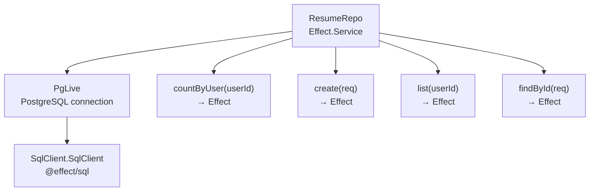
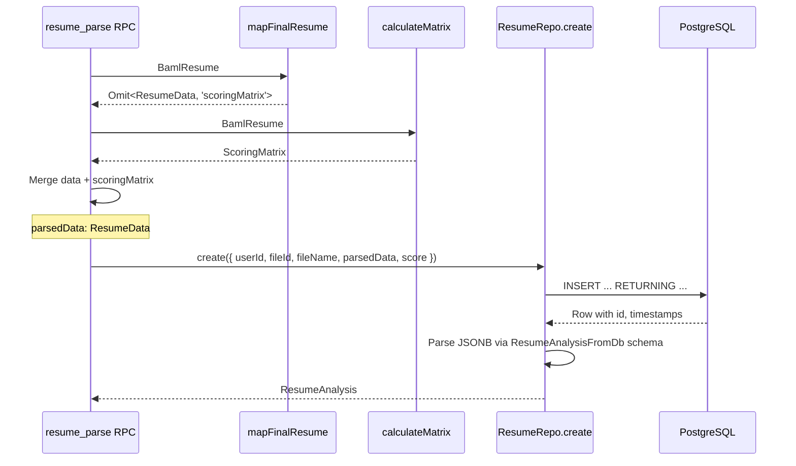
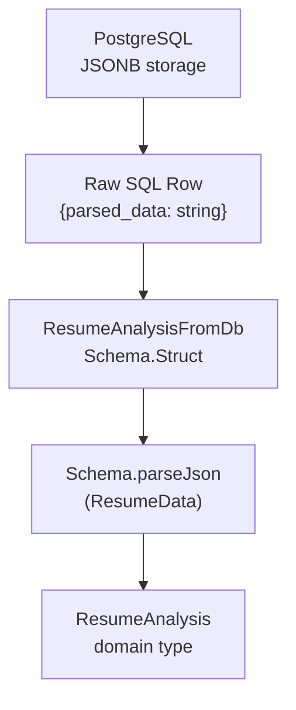
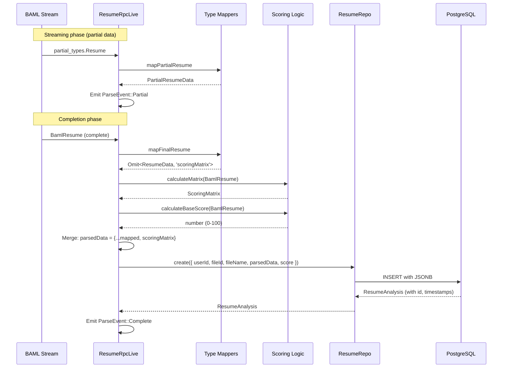

# Resume Repository

> **Relevant source files**
> * [packages/server/src/db/migrations/0002_create_resumes.ts](https://github.com/oscaromsn/TalentScore/blob/428ed1eb/packages/server/src/db/migrations/0002_create_resumes.ts)
> * [packages/server/src/public/resume/index.ts](https://github.com/oscaromsn/TalentScore/blob/428ed1eb/packages/server/src/public/resume/index.ts)
> * [packages/server/src/public/resume/resume-repo.ts](https://github.com/oscaromsn/TalentScore/blob/428ed1eb/packages/server/src/public/resume/resume-repo.ts)
> * [packages/server/src/public/resume/resume-rpc-live.ts](https://github.com/oscaromsn/TalentScore/blob/428ed1eb/packages/server/src/public/resume/resume-rpc-live.ts)

## Purpose and Scope

The Resume Repository (`ResumeRepo`) is the data access layer responsible for persisting and retrieving resume analyses from PostgreSQL. It provides type-safe CRUD operations for the `resumes` table, including user limit checking, resume creation with JSONB-stored parsed data, listing operations with ordering, and individual resume retrieval.

This page documents the database schema, the `ResumeRepo` Effect service, and how parsed resume data flows from BAML extraction through the repository into persistent storage. For the server-side RPC handlers that orchestrate resume parsing and use this repository, see [Resume RPC Implementation](/oscaromsn/TalentScore/4.4.1-resume-rpc-implementation). For details on how scoring data is calculated before persistence, see [Scoring Algorithm](/oscaromsn/TalentScore/4.4.2-scoring-algorithm).

**Sources:** [packages/server/src/public/resume/resume-repo.ts L1-L148](https://github.com/oscaromsn/TalentScore/blob/428ed1eb/packages/server/src/public/resume/resume-repo.ts#L1-L148)

---

## Database Schema

The `resumes` table stores parsed resume analyses as JSONB documents along with metadata linking them to users and files.

### Table Structure

```css
#mermaid-jn2nu8pzhjm{font-family:ui-sans-serif,-apple-system,system-ui,Segoe UI,Helvetica;font-size:16px;fill:#ccc;}@keyframes edge-animation-frame{from{stroke-dashoffset:0;}}@keyframes dash{to{stroke-dashoffset:0;}}#mermaid-jn2nu8pzhjm .edge-animation-slow{stroke-dasharray:9,5!important;stroke-dashoffset:900;animation:dash 50s linear infinite;stroke-linecap:round;}#mermaid-jn2nu8pzhjm .edge-animation-fast{stroke-dasharray:9,5!important;stroke-dashoffset:900;animation:dash 20s linear infinite;stroke-linecap:round;}#mermaid-jn2nu8pzhjm .error-icon{fill:#333;}#mermaid-jn2nu8pzhjm .error-text{fill:#cccccc;stroke:#cccccc;}#mermaid-jn2nu8pzhjm .edge-thickness-normal{stroke-width:1px;}#mermaid-jn2nu8pzhjm .edge-thickness-thick{stroke-width:3.5px;}#mermaid-jn2nu8pzhjm .edge-pattern-solid{stroke-dasharray:0;}#mermaid-jn2nu8pzhjm .edge-thickness-invisible{stroke-width:0;fill:none;}#mermaid-jn2nu8pzhjm .edge-pattern-dashed{stroke-dasharray:3;}#mermaid-jn2nu8pzhjm .edge-pattern-dotted{stroke-dasharray:2;}#mermaid-jn2nu8pzhjm .marker{fill:#666;stroke:#666;}#mermaid-jn2nu8pzhjm .marker.cross{stroke:#666;}#mermaid-jn2nu8pzhjm svg{font-family:ui-sans-serif,-apple-system,system-ui,Segoe UI,Helvetica;font-size:16px;}#mermaid-jn2nu8pzhjm p{margin:0;}#mermaid-jn2nu8pzhjm .entityBox{fill:#111;stroke:#222;}#mermaid-jn2nu8pzhjm .relationshipLabelBox{fill:#333;opacity:0.7;background-color:#333;}#mermaid-jn2nu8pzhjm .relationshipLabelBox rect{opacity:0.5;}#mermaid-jn2nu8pzhjm .labelBkg{background-color:rgba(51, 51, 51, 0.5);}#mermaid-jn2nu8pzhjm .edgeLabel .label{fill:#222;font-size:14px;}#mermaid-jn2nu8pzhjm .label{font-family:ui-sans-serif,-apple-system,system-ui,Segoe UI,Helvetica;color:#fff;}#mermaid-jn2nu8pzhjm .edge-pattern-dashed{stroke-dasharray:8,8;}#mermaid-jn2nu8pzhjm .node rect,#mermaid-jn2nu8pzhjm .node circle,#mermaid-jn2nu8pzhjm .node ellipse,#mermaid-jn2nu8pzhjm .node polygon{fill:#111;stroke:#222;stroke-width:1px;}#mermaid-jn2nu8pzhjm .relationshipLine{stroke:#666;stroke-width:1;fill:none;}#mermaid-jn2nu8pzhjm .marker{fill:none!important;stroke:#666!important;stroke-width:1;}#mermaid-jn2nu8pzhjm :root{--mermaid-font-family:"trebuchet ms",verdana,arial,sans-serif;}file_id FKresumesuuididPKPrimary key (gen_random_uuid)uuiduser_idUser identifieruuidfile_idFKReferences files(id) CASCADEtextfile_nameOriginal filenamejsonbparsed_dataResumeData schemaintegerscoreBase score (0-100)timestamptzcreated_atTimestamp with timezonefilesuuididPK
```

### Column Specifications

| Column | Type | Constraints | Description |
| --- | --- | --- | --- |
| `id` | `UUID` | `PRIMARY KEY`, `DEFAULT gen_random_uuid()` | Unique resume identifier |
| `user_id` | `UUID` | `NOT NULL` | Owner of the resume analysis |
| `file_id` | `UUID` | `NOT NULL`, `REFERENCES files(id) ON DELETE CASCADE` | Source PDF file |
| `file_name` | `TEXT` | `NOT NULL` | Displayed filename |
| `parsed_data` | `JSONB` | `NOT NULL` | Structured resume data (contact, experience, education, skills, etc.) + scoring matrix |
| `score` | `INTEGER` | `NOT NULL` | Base score calculated from resume dimensions |
| `created_at` | `TIMESTAMPTZ` | `DEFAULT now()` | Creation timestamp |

### Indexes

The schema defines two indexes to optimize common query patterns:

* **`idx_resumes_user_id`**: Enables efficient filtering by `user_id` for user-scoped queries
* **`idx_resumes_created_at`**: Supports chronological ordering in list operations

**Foreign Key Behavior:**

The `file_id` foreign key uses `ON DELETE CASCADE`, ensuring that when a file is deleted from the `files` table, all associated resume analyses are automatically removed, maintaining referential integrity.

**Sources:** [packages/server/src/db/migrations/0002_create_resumes.ts L1-L23](https://github.com/oscaromsn/TalentScore/blob/428ed1eb/packages/server/src/db/migrations/0002_create_resumes.ts#L1-L23)

---

## ResumeRepo Service

The `ResumeRepo` is implemented as an Effect service using the `Effect.Service` pattern, providing dependency injection and composable error handling.

### Service Definition



The service is defined using `Effect.Service<ResumeRepo>()` with a unique identifier `"@example/server/public/resume/resume-repo/ResumeRepo"` and depends on `PgLive` to access the PostgreSQL client.

**Sources:** [packages/server/src/public/resume/resume-repo.ts L23-L27](https://github.com/oscaromsn/TalentScore/blob/428ed1eb/packages/server/src/public/resume/resume-repo.ts#L23-L27)

---

## Repository Methods

### countByUser

Counts the total number of resumes for a given user, used to enforce the limit of 10 resumes per user.

**Signature:**

```javascript
countByUser: (req: { userId: UserId }) => Effect.Effect<number, never, never>
```

**SQL Query:**

```sql
SELECT COUNT(*)::int AS count
FROM public.resumes
WHERE user_id = ${userId}
```

**Implementation Details:**

* Uses `SqlSchema.single` to expect exactly one result row
* Casts `COUNT(*)` to `int` for type compatibility
* Maps result to extract the `count` field
* `Effect.orDie` converts SQL errors to defects (unrecoverable)
* `Effect.withSpan` adds OpenTelemetry tracing

**Usage in Resume Parsing:**

[packages/server/src/public/resume/resume-rpc-live.ts L173-L180](https://github.com/oscaromsn/TalentScore/blob/428ed1eb/packages/server/src/public/resume/resume-rpc-live.ts#L173-L180)

 demonstrates how this method enforces the 10-resume limit before initiating parsing:

```javascript
const count = yield* resumeRepo.countByUser({ userId: user.userId });
if (count >= MAX_RESUMES_PER_USER) {
  return yield* Effect.fail(new LimitExceededError({...}));
}
```

**Sources:** [packages/server/src/public/resume/resume-repo.ts L30-L50](https://github.com/oscaromsn/TalentScore/blob/428ed1eb/packages/server/src/public/resume/resume-repo.ts#L30-L50)

---

### create

Inserts a new resume analysis into the database, storing the parsed data as JSONB.

**Signature:**

```javascript
create: (req: {
  userId: UserId;
  fileId: UploadedFileId;
  fileName: string;
  parsedData: ResumeData;
  score: number;
}) => Effect.Effect<ResumeAnalysis, never, never>
```

**SQL Query:**

```sql
INSERT INTO public.resumes (user_id, file_id, file_name, parsed_data, score)
VALUES (${userId}, ${fileId}, ${fileName}, ${parsedData}::jsonb, ${score})
RETURNING id, file_id AS "fileId", file_name AS "fileName",
          parsed_data AS data, score, created_at AS "createdAt"
```

**Data Flow Diagram:**



**JSONB Serialization:**

The `parsedData` parameter (of type `ResumeData`) is serialized to JSON before insertion:

```
${JSON.stringify(req.parsedData)}::jsonb
```

This JSONB field stores the complete resume structure including:

* Contact information (`name`, `email`, `phone`, `location`, URLs)
* Work experience array with technologies, dates, employment types
* Education history with degrees, institutions, levels
* Skills array with categories and years of experience
* Languages with proficiency levels
* Certifications with issuers and expiration dates
* **Scoring matrix** (5×4 context scores + dealbreakers)

**Column Aliasing:**

The query uses `AS` aliases to convert snake_case database columns to camelCase TypeScript properties:

* `file_id AS "fileId"`
* `file_name AS "fileName"`
* `created_at AS "createdAt"`

**Sources:** [packages/server/src/public/resume/resume-repo.ts L52-L84](https://github.com/oscaromsn/TalentScore/blob/428ed1eb/packages/server/src/public/resume/resume-repo.ts#L52-L84)

 [packages/server/src/public/resume/resume-rpc-live.ts L235-L245](https://github.com/oscaromsn/TalentScore/blob/428ed1eb/packages/server/src/public/resume/resume-rpc-live.ts#L235-L245)

---

### list

Retrieves all resume analyses for a user, ordered by creation time (newest first).

**Signature:**

```javascript
list: (req: { userId: UserId }) => Effect.Effect<ResumeAnalysis[], never, never>
```

**SQL Query:**

```sql
SELECT id, file_id AS "fileId", file_name AS "fileName",
       parsed_data AS data, score, created_at AS "createdAt"
FROM public.resumes
WHERE user_id = ${userId}
ORDER BY created_at DESC
```

**Implementation Details:**

* Uses `SqlSchema.findAll` to return an array of results
* Parses the JSONB `parsed_data` column via `Schema.parseJson(ResumeData)`
* Orders by `created_at DESC` to show most recent analyses first
* Returns empty array `[]` if user has no resumes
* Used by the client to populate the resume history list

**Client Integration:**

The resume list RPC is consumed by the client's `resumeHistoryLoadAtom` [referenced in diagram 6], which displays resumes with their context-filtered scores.

**Sources:** [packages/server/src/public/resume/resume-repo.ts L86-L110](https://github.com/oscaromsn/TalentScore/blob/428ed1eb/packages/server/src/public/resume/resume-repo.ts#L86-L110)

---

### findById

Retrieves a single resume analysis by its ID, scoped to the requesting user.

**Signature:**

```javascript
findById: (req: {
  resumeId: ResumeId;
  userId: UserId;
}) => Effect.Effect<ResumeAnalysis | null, never, never>
```

**SQL Query:**

```sql
SELECT id, file_id AS "fileId", file_name AS "fileName",
       parsed_data AS data, score, created_at AS "createdAt"
FROM public.resumes
WHERE id = ${resumeId} AND user_id = ${userId}
```

**Security Model:**

The query includes both `id = ${resumeId}` and `user_id = ${userId}` in the `WHERE` clause, ensuring that users can only access their own resume analyses. This implements row-level security at the query level.

**Return Value:**

* Returns `null` if the resume doesn't exist or doesn't belong to the user
* Returns `ResumeAnalysis` object if found
* Uses `Option.getOrNull` to convert Effect's `Option<T>` to nullable type

**Error Handling:**

Like other methods, this uses `Effect.orDie` to treat SQL errors as defects, under the assumption that well-formed queries should not produce expected errors.

**Sources:** [packages/server/src/public/resume/resume-repo.ts L112-L137](https://github.com/oscaromsn/TalentScore/blob/428ed1eb/packages/server/src/public/resume/resume-repo.ts#L112-L137)

---

## Type Safety and Schema Validation

The repository employs multi-layered type safety using Effect Schema for runtime validation and compile-time type checking.

### ResumeAnalysisFromDb Schema



The schema defines how database rows are decoded into domain types:

```javascript
const ResumeAnalysisFromDb = Schema.Struct({
  id: ResumeId,                        // UUID → branded type
  fileId: UploadedFileId,              // UUID → branded type
  fileName: Schema.String,
  data: Schema.parseJson(ResumeData),  // JSON string → validated object
  score: Schema.Number,
  createdAt: Schema.DateTimeUtc,       // Postgres TIMESTAMPTZ → Date
});
```

**Key Schema Features:**

| Field | Schema Transformation | Purpose |
| --- | --- | --- |
| `id` | `ResumeId` | Branded type prevents ID confusion |
| `fileId` | `UploadedFileId` | Branded type for file reference |
| `data` | `Schema.parseJson(ResumeData)` | Parse JSONB string and validate against `ResumeData` schema |
| `createdAt` | `Schema.DateTimeUtc` | Convert PostgreSQL timestamp to JavaScript `Date` |

**JSONB Parsing:**

`Schema.parseJson(ResumeData)` performs two operations:

1. `JSON.parse()` on the JSONB string representation
2. Runtime validation against the `ResumeData` schema (defined in domain package)

This ensures that database corruption or schema drift is caught at runtime with detailed error messages.

**Sources:** [packages/server/src/public/resume/resume-repo.ts L14-L21](https://github.com/oscaromsn/TalentScore/blob/428ed1eb/packages/server/src/public/resume/resume-repo.ts#L14-L21)

---

## Integration with Resume Processing Pipeline

The `ResumeRepo` is a dependency of `ResumeRpcLive` and is called during the final stage of resume parsing.

### Data Flow from Parsing to Persistence



### Type Mapping Layers

The resume data passes through multiple type transformations:

1. **BAML Types** (`BamlResume`) → Generated by BAML from LLM extraction
2. **Mapped Domain Types** (`Omit<ResumeData, 'scoringMatrix'>`) → Via `mapFinalResume` helper
3. **Scoring Enrichment** → Add `ScoringMatrix` via `calculateMatrix`
4. **Complete Domain Type** (`ResumeData`) → Ready for persistence
5. **Database Row** → JSONB serialization
6. **Return Type** (`ResumeAnalysis`) → Includes DB metadata (id, createdAt)

**Mapper Function Reference:**

[packages/server/src/public/resume/resume-rpc-live.ts L134-L147](https://github.com/oscaromsn/TalentScore/blob/428ed1eb/packages/server/src/public/resume/resume-rpc-live.ts#L134-L147)

 shows the `mapFinalResume` function that transforms BAML types to domain types, handling:

* Nested array mapping (`experiences`, `education`, `skills`, etc.)
* Optional field handling (`?? null`)
* Enum preservation (`EmploymentType`, `EducationLevel`, `SkillCategory`, etc.)

**Sources:** [packages/server/src/public/resume/resume-rpc-live.ts L168-L267](https://github.com/oscaromsn/TalentScore/blob/428ed1eb/packages/server/src/public/resume/resume-rpc-live.ts#L168-L267)

---

## Effect Patterns and Observability

The `ResumeRepo` demonstrates several Effect-TS best practices:

### SqlSchema Pattern

All database operations use `SqlSchema` helpers:

* **`SqlSchema.single`**: Expects exactly one result row (e.g., `countByUser`, `create`)
* **`SqlSchema.findAll`**: Returns array of results (e.g., `list`)
* **`SqlSchema.findOne`**: Returns `Option<T>` for nullable results (e.g., `findById`)

These helpers provide:

* Automatic schema validation of results
* Type-safe query construction
* Integration with Effect error channel

### Error Handling Strategy

All repository methods use `.pipe(Effect.orDie)`, treating SQL errors as defects:

```
Effect.orDie  // SQL errors become unrecoverable defects
```

**Rationale:** Database errors in a well-formed application indicate infrastructure failure (connection loss, schema mismatch) rather than expected error conditions. These are logged and traced but not recoverable at the application level.

### Distributed Tracing

Each method is wrapped with `Effect.withSpan` for OpenTelemetry tracing:

```
Effect.withSpan("ResumeRepo.countByUser")
```

This creates named spans in Jaeger, enabling:

* Query performance monitoring
* End-to-end request tracing (from RPC → Repo → SQL)
* Error attribution across service boundaries

**Trace Example:**

```sql
resume_parse (RPC)
├─ ResumeRepo.countByUser (1.2ms)
├─ BAML ExtractResume (4.8s)
├─ ResumeRepo.create (15ms)
└─ EventStream.broadcast (0.5ms)
```

**Sources:** [packages/server/src/public/resume/resume-repo.ts L30-L137](https://github.com/oscaromsn/TalentScore/blob/428ed1eb/packages/server/src/public/resume/resume-repo.ts#L30-L137)

---

## Service Export and Layer Composition

The repository is exported with its default layer for dependency injection:

```javascript
export class ResumeRepo extends Effect.Service<ResumeRepo>() {
  // ... implementation
}
```

The `.Default` property provides a standard layer that includes `PgLive`:

```
Layer.provide([ResumeRepo.Default, FilesRepo.Default])
```

This is used in `ResumeRpcLive` [packages/server/src/public/resume/resume-rpc-live.ts L270](https://github.com/oscaromsn/TalentScore/blob/428ed1eb/packages/server/src/public/resume/resume-rpc-live.ts#L270-L270)

 to compose service dependencies.

**Sources:** [packages/server/src/public/resume/index.ts L1-L3](https://github.com/oscaromsn/TalentScore/blob/428ed1eb/packages/server/src/public/resume/index.ts#L1-L3)

 [packages/server/src/public/resume/resume-repo.ts L23-L147](https://github.com/oscaromsn/TalentScore/blob/428ed1eb/packages/server/src/public/resume/resume-repo.ts#L23-L147)