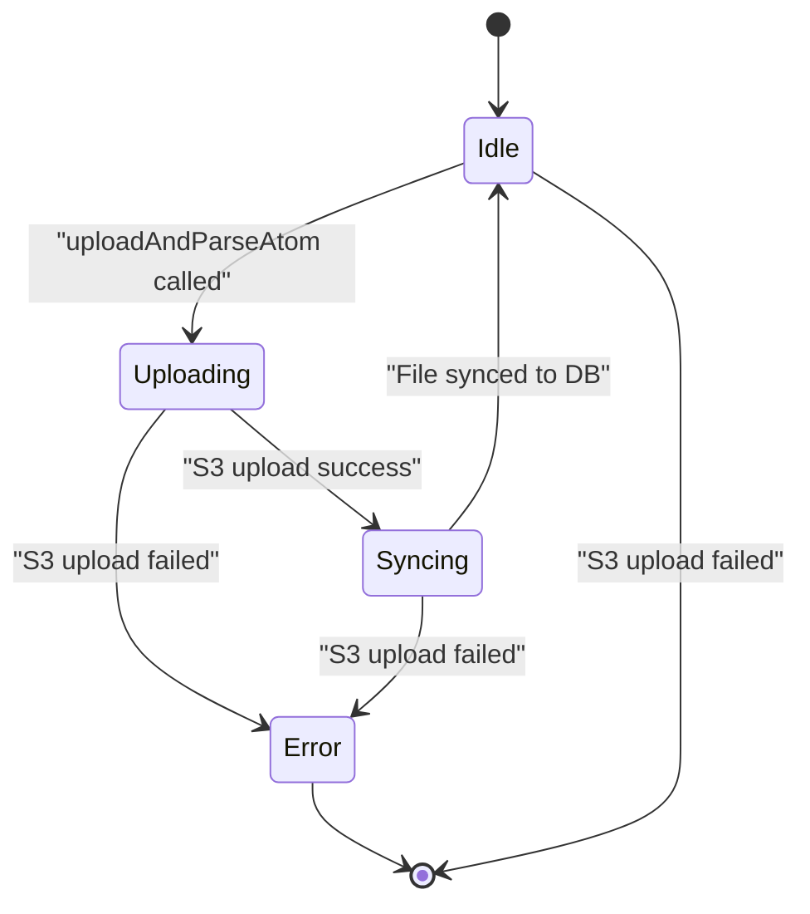
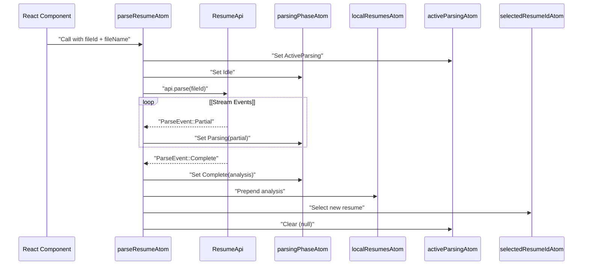
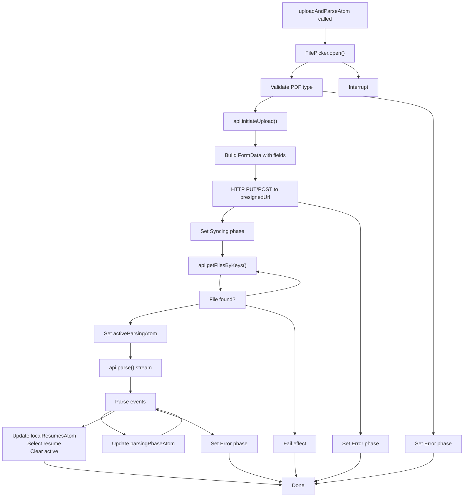
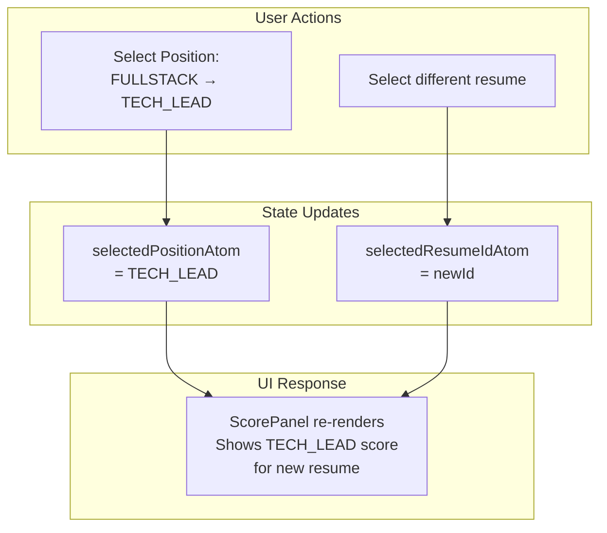

# Resume State Management

> **Relevant source files**
> * [packages/client/src/routes/resume/-resume/resume-atoms.ts](https://github.com/oscaromsn/TalentScore/blob/428ed1eb/packages/client/src/routes/resume/-resume/resume-atoms.ts)

## Purpose and Scope

This document describes the client-side state management system for resume processing in the TalentScore application. It covers the Effect Atoms architecture that orchestrates the complete resume workflow from file upload through AI parsing to UI display, including real-time streaming updates, local caching strategies, and context-aware score filtering.

For information about the file management state system (separate from resume state), see [File State Management](/oscaromsn/TalentScore/5.2.2-file-state-management). For details on the UI components that consume this state, see [Resume Viewer Component](/oscaromsn/TalentScore/5.3.1-resume-viewer-component) and [Score Panel and Context Filters](/oscaromsn/TalentScore/5.3.2-score-panel-and-context-filters).

**Sources:** [packages/client/src/routes/resume/-resume/resume-atoms.ts L1-L400](https://github.com/oscaromsn/TalentScore/blob/428ed1eb/packages/client/src/routes/resume/-resume/resume-atoms.ts#L1-L400)

---

## Architecture Overview

The resume state management system is implemented in a single file that provides a cohesive runtime environment with three primary Effect Services and multiple reactive atoms.

### Service Layer

```

```

**Sources:** [packages/client/src/routes/resume/-resume/resume-atoms.ts L41-L116](https://github.com/oscaromsn/TalentScore/blob/428ed1eb/packages/client/src/routes/resume/-resume/resume-atoms.ts#L41-L116)

#### ResumeApi Service

The `ResumeApi` service encapsulates all RPC calls related to resume and file operations. It depends on `DomainRpcClient` and exposes five methods:

| Method | RPC Contract | Purpose |
| --- | --- | --- |
| `list()` | `resume_list` | Fetch all resumes for current user |
| `get(payload)` | `resume_get` | Fetch single resume by ID |
| `parse(payload)` | `resume_parse` | Stream parsing events for a file |
| `initiateUpload(payload)` | `files_initiateUpload` | Get presigned URL for S3 upload |
| `getFilesByKeys(payload)` | `files_getFilesByKeys` | Poll for file sync status |

The service is defined as an Effect Service at [packages/client/src/routes/resume/-resume/resume-atoms.ts L41-L59](https://github.com/oscaromsn/TalentScore/blob/428ed1eb/packages/client/src/routes/resume/-resume/resume-atoms.ts#L41-L59)

 providing a type-safe abstraction over the underlying RPC client.

#### FilePicker Service

The `FilePicker` service manages browser file input interactions with proper resource cleanup. It uses Effect's `acquireRelease` pattern to ensure the hidden input element is removed from the DOM when the service scope closes.

**Key Implementation Details:**

* Creates a hidden `<input type="file">` element accepting only PDFs
* Exposes an `open` method that returns `Effect.async<Option.Option<File>>`
* Handles both file selection and user cancellation events
* Automatically resets input value after selection for reusability

**Sources:** [packages/client/src/routes/resume/-resume/resume-atoms.ts L65-L108](https://github.com/oscaromsn/TalentScore/blob/428ed1eb/packages/client/src/routes/resume/-resume/resume-atoms.ts#L65-L108)

#### Runtime Configuration

The runtime is created using `makeAtomRuntime` with a merged layer providing all services:

```

```

This runtime instance is used to create all Effect-based atoms and functions, ensuring consistent dependency injection across the resume workflow.

**Sources:** [packages/client/src/routes/resume/-resume/resume-atoms.ts L114-L116](https://github.com/oscaromsn/TalentScore/blob/428ed1eb/packages/client/src/routes/resume/-resume/resume-atoms.ts#L114-L116)

---

## State Atoms Catalog

The system maintains state across multiple atoms, organized by functional concern.

### Resume List and Selection

| Atom | Type | Initial Value | Purpose |
| --- | --- | --- | --- |
| `resumeListAtom` | `ResumeAnalysis[]` | Effect-loaded | Server-fetched resume list |
| `selectedResumeIdAtom` | `ResumeId \| null` | `null` | Currently selected resume ID |
| `localResumesAtom` | `readonly ResumeAnalysis[]` | `[]` | Locally cached resumes (prepended on parse) |

**Resume List Loading:**

The `resumeListAtom` is a runtime atom that automatically loads the resume list when first accessed:

```

```

**Local Cache Strategy:**

The `localResumesAtom` provides optimistic caching for newly parsed resumes. When parsing completes, the analysis is prepended to this array and the resume is auto-selected, enabling immediate UI updates without waiting for server list refresh.

**Sources:** [packages/client/src/routes/resume/-resume/resume-atoms.ts L122-L168](https://github.com/oscaromsn/TalentScore/blob/428ed1eb/packages/client/src/routes/resume/-resume/resume-atoms.ts#L122-L168)

### Context Filter State

| Atom | Type | Initial Value | Purpose |
| --- | --- | --- | --- |
| `selectedPositionAtom` | `PositionType` | `"FULLSTACK"` | Current position context filter |
| `selectedCompanyAtom` | `CompanyProfile` | `"SCALEUP"` | Current company context filter |

These atoms control which context-specific score is displayed in the Score Panel. The defaults (`FULLSTACK` + `SCALEUP`) represent general-purpose, mid-stage company contexts.

**Sources:** [packages/client/src/routes/resume/-resume/resume-atoms.ts L136-L141](https://github.com/oscaromsn/TalentScore/blob/428ed1eb/packages/client/src/routes/resume/-resume/resume-atoms.ts#L136-L141)

### Parsing State

| Atom | Type | Purpose |
| --- | --- | --- |
| `activeParsingAtom` | `ActiveParsing \| null` | Tracks which file is currently being parsed |
| `parsingPhaseAtom` | `ParsingPhase` | Current phase of parsing state machine |

**ActiveParsing Structure:**

```

```

**Sources:** [packages/client/src/routes/resume/-resume/resume-atoms.ts L145-L168](https://github.com/oscaromsn/TalentScore/blob/428ed1eb/packages/client/src/routes/resume/-resume/resume-atoms.ts#L145-L168)

### Upload State

| Atom | Type | Initial Value | Purpose |
| --- | --- | --- | --- |
| `uploadPhaseAtom` | `UploadPhase` | `UploadPhase.Idle()` | Current phase of upload state machine |

**Sources:** [packages/client/src/routes/resume/-resume/resume-atoms.ts L269-L279](https://github.com/oscaromsn/TalentScore/blob/428ed1eb/packages/client/src/routes/resume/-resume/resume-atoms.ts#L269-L279)

---

## Phase State Machines

The resume workflow uses two tagged enums to represent state machines with explicit phases.

### ParsingPhase State Machine

```

```

**Type Definition:**

```

```

**Phase Transitions:**

| From | Event | To | Side Effects |
| --- | --- | --- | --- |
| Idle | `parseResumeAtom` called | Idle | Set `activeParsingAtom` |
| Idle | `ParseEvent::Partial` | Parsing | Store partial data |
| Parsing | `ParseEvent::Partial` | Parsing | Update partial data |
| Parsing | `ParseEvent::Complete` | Complete | Prepend to `localResumesAtom`, select resume, clear active |
| Parsing | Error | Error | Store error message, clear active |

**Sources:** [packages/client/src/routes/resume/-resume/resume-atoms.ts L147-L162](https://github.com/oscaromsn/TalentScore/blob/428ed1eb/packages/client/src/routes/resume/-resume/resume-atoms.ts#L147-L162)

### UploadPhase State Machine



**Type Definition:**

```

```

**Phase Transitions:**

| From | Event | To | Side Effects |
| --- | --- | --- | --- |
| Idle | File selected | Uploading | Validate PDF, initiate upload |
| Uploading | HTTP success | Syncing | Start polling for file in DB |
| Syncing | File found | Idle | Transition to parsing workflow |
| Uploading/Syncing | Error | Error | Display error message |

**Sources:** [packages/client/src/routes/resume/-resume/resume-atoms.ts L271-L279](https://github.com/oscaromsn/TalentScore/blob/428ed1eb/packages/client/src/routes/resume/-resume/resume-atoms.ts#L271-L279)

---

## Parsing Workflow

The `parseResumeAtom` function orchestrates the streaming resume parsing workflow.

### Parse Stream Processing



**Implementation Details:**

The function at [packages/client/src/routes/resume/-resume/resume-atoms.ts L179-L227](https://github.com/oscaromsn/TalentScore/blob/428ed1eb/packages/client/src/routes/resume/-resume/resume-atoms.ts#L179-L227)

 implements the following logic:

1. **Initialization:** Generate unique parsing ID, set active parsing state, reset phase to Idle
2. **Stream Consumption:** Use `Stream.runForEach` to process each `ParseEvent`
3. **Partial Updates:** On `ParseEvent::Partial`, update `parsingPhaseAtom` with partial data
4. **Completion:** On `ParseEvent::Complete`: * Set phase to Complete with full analysis * Prepend analysis to `localResumesAtom` using `Arr.prepend` * Auto-select the new resume via `selectedResumeIdAtom` * Clear `activeParsingAtom`
5. **Error Handling:** Catch all errors with `Effect.catchAll`, extract message, set Error phase

**Key Pattern: Non-Blocking Selection**

Lines 234-249 show that `selectResumeAtom` and `clearSelectionAtom` do NOT clear the parsing state. This allows users to browse other resumes while parsing continues in the background. The UI components use conditional rendering to show parsing progress when no resume is selected.

**Sources:** [packages/client/src/routes/resume/-resume/resume-atoms.ts L179-L249](https://github.com/oscaromsn/TalentScore/blob/428ed1eb/packages/client/src/routes/resume/-resume/resume-atoms.ts#L179-L249)

---

## Upload and Parse Orchestration

The `uploadAndParseAtom` function implements the complete end-to-end workflow from file selection to parsed resume.

### Complete Workflow Phases



**Implementation Breakdown:**

The function at [packages/client/src/routes/resume/-resume/resume-atoms.ts L285-L399](https://github.com/oscaromsn/TalentScore/blob/428ed1eb/packages/client/src/routes/resume/-resume/resume-atoms.ts#L285-L399)

 implements three distinct phases:

### Phase 1: Upload (Lines 313-334)

1. Set `uploadPhaseAtom` to `Uploading({ fileName })`
2. Call `api.initiateUpload()` to get presigned URL and fields
3. Build FormData with fields from UploadThing response
4. Append the file to FormData
5. Determine HTTP method: PUT for v7 (empty fields), POST for v6
6. Execute upload with retry policy: 3 attempts, exponential backoff (250ms base, 1.5x multiplier)

**UploadThing v7 Detection:**

```

```

**Sources:** [packages/client/src/routes/resume/-resume/resume-atoms.ts L313-L334](https://github.com/oscaromsn/TalentScore/blob/428ed1eb/packages/client/src/routes/resume/-resume/resume-atoms.ts#L313-L334)

### Phase 2: Sync (Lines 336-353)

1. Set `uploadPhaseAtom` to `Syncing({ fileName })`
2. Poll `api.getFilesByKeys([fileKey])` with retry policy: * 20 attempts (times) * 500ms spacing between attempts * Total maximum wait: 10 seconds
3. Fail with `"not_found"` if file not in results
4. Return found file when sync completes

**Polling Pattern:**

```

```

**Sources:** [packages/client/src/routes/resume/-resume/resume-atoms.ts L336-L353](https://github.com/oscaromsn/TalentScore/blob/428ed1eb/packages/client/src/routes/resume/-resume/resume-atoms.ts#L336-L353)

### Phase 3: Parse (Lines 356-394)

1. Set `uploadPhaseAtom` to `Idle` (upload complete)
2. Generate parsing UUID and set `activeParsingAtom`
3. Reset `parsingPhaseAtom` to `Idle`
4. Call `api.parse({ fileId: file.id })` to get stream
5. Process stream events (identical logic to `parseResumeAtom`)
6. Handle errors by setting `parsingPhaseAtom` to Error and clearing active

**Duplicate Stream Logic:**

Note that lines 366-394 contain nearly identical stream processing logic to `parseResumeAtom` (lines 195-225). This duplication ensures the workflow is atomic—if any part fails, the entire effect fails cleanly.

**Sources:** [packages/client/src/routes/resume/-resume/resume-atoms.ts L356-L399](https://github.com/oscaromsn/TalentScore/blob/428ed1eb/packages/client/src/routes/resume/-resume/resume-atoms.ts#L356-L399)

---

## State Coordination Patterns

### Optimistic Updates with Local Cache

The `localResumesAtom` enables optimistic UI updates by caching newly parsed resumes immediately upon completion:

```

```

**UI Composition Pattern:**

Components like `ResumeHistoryList` merge server-fetched resumes with local resumes:

1. Read `resumeListAtom` for server resumes
2. Read `localResumesAtom` for local resumes
3. Deduplicate by ID (local takes precedence)
4. Render combined list

This pattern prevents flickering and provides instant feedback without waiting for server list refresh.

**Sources:** [packages/client/src/routes/resume/-resume/resume-atoms.ts L204-L207](https://github.com/oscaromsn/TalentScore/blob/428ed1eb/packages/client/src/routes/resume/-resume/resume-atoms.ts#L204-L207)

### Background Parsing with Foreground Selection

The state design allows users to select different resumes while parsing continues:

```

```

**Component Conditional Rendering:**

UI components check both `selectedResumeIdAtom` and `activeParsingAtom`:

* If `selectedResumeIdAtom` is set → Show that resume
* Else if `activeParsingAtom` is set → Show parsing progress
* Else → Show empty state

This pattern enables non-blocking UX where long-running AI parsing doesn't freeze the application.

**Sources:** [packages/client/src/routes/resume/-resume/resume-atoms.ts L234-L249](https://github.com/oscaromsn/TalentScore/blob/428ed1eb/packages/client/src/routes/resume/-resume/resume-atoms.ts#L234-L249)

### Context Filter Persistence

The `selectedPositionAtom` and `selectedCompanyAtom` persist across resume selections, maintaining the user's chosen context filter:



This allows users to compare multiple resumes in the same context without resetting their filters.

**Sources:** [packages/client/src/routes/resume/-resume/resume-atoms.ts L136-L141](https://github.com/oscaromsn/TalentScore/blob/428ed1eb/packages/client/src/routes/resume/-resume/resume-atoms.ts#L136-L141)

---

## Helper Functions and Utilities

### Resume Selection Functions

| Function | Purpose | Effect |
| --- | --- | --- |
| `selectResumeAtom(resumeId)` | Select a specific resume | Sets `selectedResumeIdAtom`, preserves parsing state |
| `clearSelectionAtom()` | Clear selection | Sets `selectedResumeIdAtom` to null, preserves parsing state |

Both functions explicitly preserve parsing state to enable background parsing while browsing.

**Sources:** [packages/client/src/routes/resume/-resume/resume-atoms.ts L234-L249](https://github.com/oscaromsn/TalentScore/blob/428ed1eb/packages/client/src/routes/resume/-resume/resume-atoms.ts#L234-L249)

### Score Tier Utilities

Two utility functions provide consistent score visualization:

```

```

**Tier Thresholds:**

| Score Range | Color | Label |
| --- | --- | --- |
| 800+ | Green | Strong Match |
| 500-799 | Yellow | Potential Match |
| 0-499 | Red | Needs Development |

**Sources:** [packages/client/src/routes/resume/-resume/resume-atoms.ts L255-L265](https://github.com/oscaromsn/TalentScore/blob/428ed1eb/packages/client/src/routes/resume/-resume/resume-atoms.ts#L255-L265)

---

## Summary: State Architecture Benefits

The Effect Atoms architecture provides several key advantages for resume state management:

1. **Type-Safe RPC:** All RPC calls are type-checked at compile time through Effect Services
2. **Streaming Support:** `Stream.runForEach` enables real-time UI updates during AI parsing
3. **Declarative State:** Tagged enums (`ParsingPhase`, `UploadPhase`) make state transitions explicit
4. **Composable Effects:** Functions like `uploadAndParseAtom` compose smaller effects (upload, poll, parse)
5. **Automatic Error Handling:** Effect's error channel ensures all failures are caught and displayed
6. **Non-Blocking UX:** Separate `activeParsingAtom` and `selectedResumeIdAtom` enable background processing
7. **Optimistic Updates:** `localResumesAtom` provides instant feedback before server sync

This architecture enables a responsive, production-quality resume processing experience with minimal boilerplate.

**Sources:** [packages/client/src/routes/resume/-resume/resume-atoms.ts L1-L400](https://github.com/oscaromsn/TalentScore/blob/428ed1eb/packages/client/src/routes/resume/-resume/resume-atoms.ts#L1-L400)