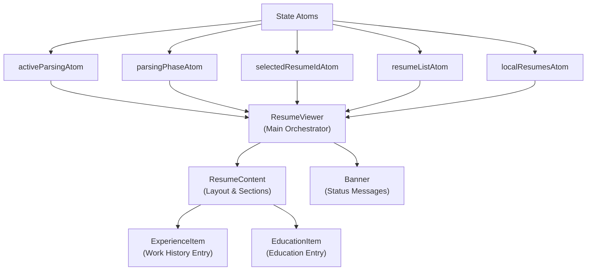
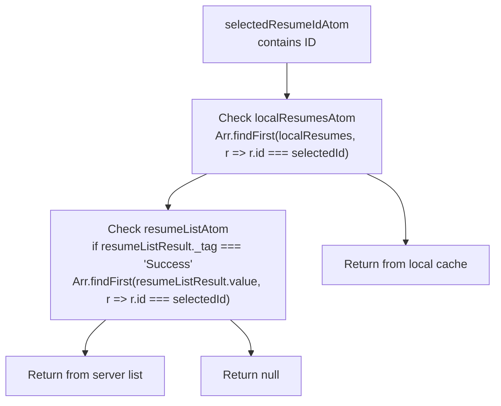
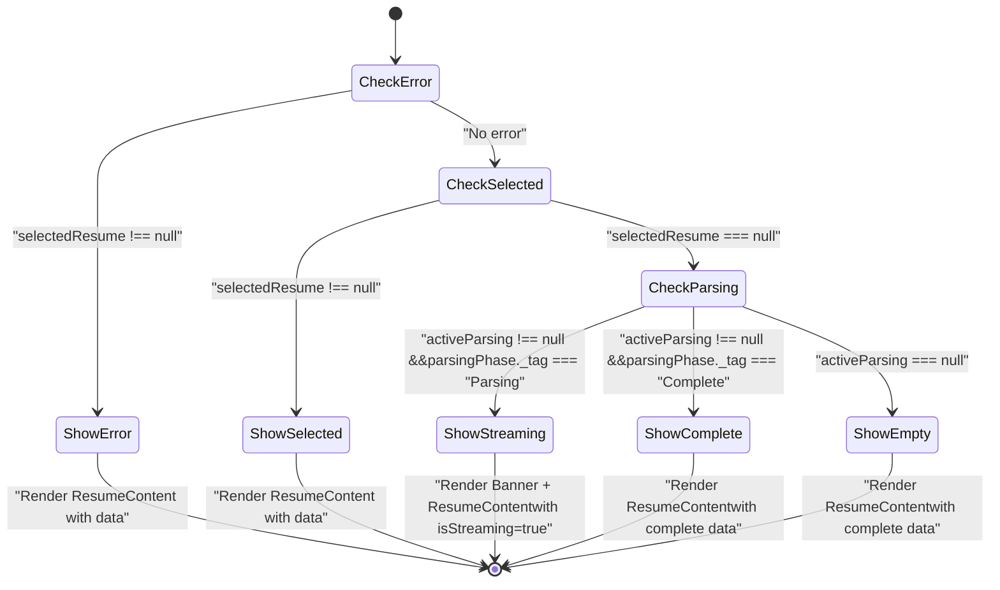
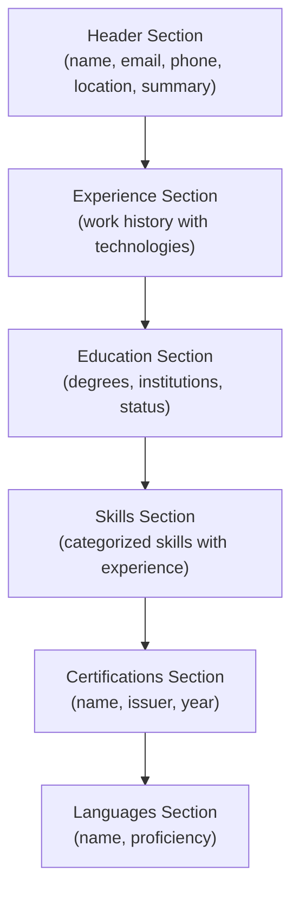
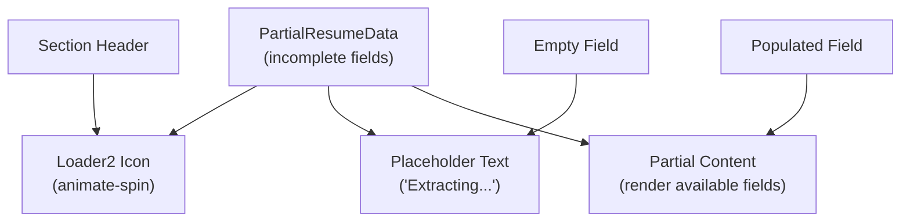
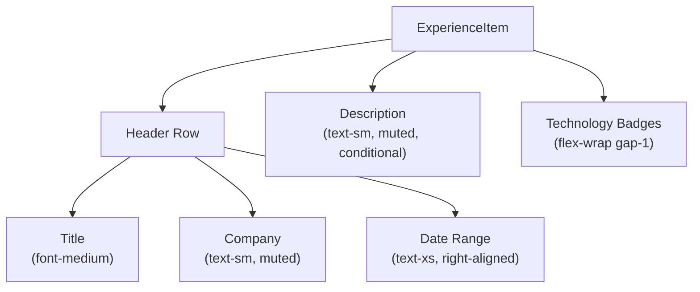

# Resume Viewer Component

> **Relevant source files**
> * [packages/client/src/routes/resume/-resume/components/resume-viewer.tsx](https://github.com/oscaromsn/TalentScore/blob/428ed1eb/packages/client/src/routes/resume/-resume/components/resume-viewer.tsx)

## Purpose and Scope

The Resume Viewer Component is responsible for displaying structured resume data extracted from PDF files. It handles three distinct rendering modes: streaming partial data during LLM extraction, displaying complete analyzed resumes, and showing error states. The component integrates with the resume state management atoms (see [5.2.1](/oscaromsn/TalentScore/5.2.1-resume-state-management)) to reactively render data as it becomes available.

For information about resume scoring visualization, see [5.3.2](/oscaromsn/TalentScore/5.3.2-score-panel-and-context-filters). For browsing and selecting resumes, see [5.3.3](/oscaromsn/TalentScore/5.3.3-resume-history-list).

**Sources:** [packages/client/src/routes/resume/-resume/components/resume-viewer.tsx L1-L371](https://github.com/oscaromsn/TalentScore/blob/428ed1eb/packages/client/src/routes/resume/-resume/components/resume-viewer.tsx#L1-L371)

---

## Component Architecture

The `ResumeViewer` component follows a compositional architecture where the main component handles state orchestration and delegates rendering to specialized sub-components.

### Component Hierarchy



**Sources:** [packages/client/src/routes/resume/-resume/components/resume-viewer.tsx L307-L370](https://github.com/oscaromsn/TalentScore/blob/428ed1eb/packages/client/src/routes/resume/-resume/components/resume-viewer.tsx#L307-L370)

 [packages/client/src/routes/resume/-resume/components/resume-viewer.tsx L1-L14](https://github.com/oscaromsn/TalentScore/blob/428ed1eb/packages/client/src/routes/resume/-resume/components/resume-viewer.tsx#L1-L14)

---

## State Management Integration

The `ResumeViewer` component subscribes to five atoms using `useAtomValue` from `@effect-atom/atom-react`:

| Atom | Type | Purpose |
| --- | --- | --- |
| `activeParsingAtom` | `{ fileId: string; fileName: string } \| null` | Tracks currently parsing file |
| `parsingPhaseAtom` | `ParsingPhase` | Current parsing state (Idle/Parsing/Complete/Error) |
| `selectedResumeIdAtom` | `string \| null` | ID of resume to display |
| `resumeListAtom` | `RemoteData<ResumeAnalysis[]>` | Server-fetched resume list |
| `localResumesAtom` | `ResumeAnalysis[]` | Client-side cache of new resumes |

### Resume Resolution Logic

The component implements a two-tier lookup strategy to find the selected resume:



This prioritizes newly parsed resumes in the local cache before falling back to the server-fetched list.

**Sources:** [packages/client/src/routes/resume/-resume/components/resume-viewer.tsx L307-L329](https://github.com/oscaromsn/TalentScore/blob/428ed1eb/packages/client/src/routes/resume/-resume/components/resume-viewer.tsx#L307-L329)

 [packages/client/src/routes/resume/-resume/components/resume-viewer.tsx L18-L25](https://github.com/oscaromsn/TalentScore/blob/428ed1eb/packages/client/src/routes/resume/-resume/components/resume-viewer.tsx#L18-L25)

---

## Rendering State Machine

The component's rendering behavior follows a priority-based state machine:



### State Rendering Table

| State | Condition | Component Tree |
| --- | --- | --- |
| **Error** | `parsingPhase._tag === "Error"` | `Banner(variant="destructive")` with error message |
| **Selected Resume** | `selectedResume !== null` | `ResumeContent(data=selectedResume.data)` |
| **Streaming** | `activeParsing !== null && parsingPhase._tag === "Parsing"` | `Banner` + `ResumeContent(data=parsingPhase.partial, isStreaming=true)` |
| **Complete** | `activeParsing !== null && parsingPhase._tag === "Complete"` | `ResumeContent(data=parsingPhase.analysis.data)` |
| **Empty** | All other conditions | `null` (parent handles empty state) |

**Sources:** [packages/client/src/routes/resume/-resume/components/resume-viewer.tsx L332-L369](https://github.com/oscaromsn/TalentScore/blob/428ed1eb/packages/client/src/routes/resume/-resume/components/resume-viewer.tsx#L332-L369)

---

## Data Model Sections

The `ResumeContent` component renders the following resume sections in order:

### Section Layout



### Section Rendering Rules

| Section | Icon | Always Shown | Conditionally Shown | Empty State Handling |
| --- | --- | --- | --- | --- |
| **Header** | `User` | Yes | - | Shows "Extracting name..." if streaming |
| **Experience** | `Briefcase` | Yes | - | Shows "Extracting experience..." if streaming |
| **Education** | `BookOpen` | No | If `data.education.length > 0 \|\| isStreaming` | Shows "Extracting education..." if streaming |
| **Skills** | `Sparkles` | Yes | - | Shows "Extracting skills..." if streaming |
| **Certifications** | `Award` | No | If `data.certifications.length > 0 \|\| isStreaming` | Shows "Extracting certifications..." if streaming |
| **Languages** | `Globe` | No | If `data.languages.length > 0 \|\| isStreaming` | Shows "Extracting languages..." if streaming |

All section headers display a spinning `Loader2` icon when `isStreaming=true`.

**Sources:** [packages/client/src/routes/resume/-resume/components/resume-viewer.tsx L106-L304](https://github.com/oscaromsn/TalentScore/blob/428ed1eb/packages/client/src/routes/resume/-resume/components/resume-viewer.tsx#L106-L304)

 [packages/client/src/routes/resume/-resume/components/resume-viewer.tsx L2-L13](https://github.com/oscaromsn/TalentScore/blob/428ed1eb/packages/client/src/routes/resume/-resume/components/resume-viewer.tsx#L2-L13)

---

## Streaming Data Display

During LLM extraction, the component receives partial data via the `parsingPhase.partial` object of type `PartialResumeData`. The streaming display provides real-time feedback as data is extracted.

### Streaming Indicators



### Field-Level Streaming Behavior

| Field | Streaming State | Complete State |
| --- | --- | --- |
| `name` | `"Extracting name..."` (italic) | Display name value |
| `email/phone/location` | Hidden until available | Display with icon |
| `summary` | Hidden until available | Display with border |
| `experience[].title` | `"..."` if missing | Display title or `"Untitled"` |
| `experience[].company` | `"..."` if missing | Display company or `"Unknown"` |
| `experience[].technologies` | Show partial array | Show complete array |
| `skills` | `"Extracting skills..."` | Display skill badges |
| `education` | `"Extracting education..."` | Display education items |

The component uses conditional rendering to show different content based on `isStreaming` prop and field availability:

**Sources:** [packages/client/src/routes/resume/-resume/components/resume-viewer.tsx L117-L123](https://github.com/oscaromsn/TalentScore/blob/428ed1eb/packages/client/src/routes/resume/-resume/components/resume-viewer.tsx#L117-L123)

 [packages/client/src/routes/resume/-resume/components/resume-viewer.tsx L159-L174](https://github.com/oscaromsn/TalentScore/blob/428ed1eb/packages/client/src/routes/resume/-resume/components/resume-viewer.tsx#L159-L174)

 [packages/client/src/routes/resume/-resume/components/resume-viewer.tsx L42-L74](https://github.com/oscaromsn/TalentScore/blob/428ed1eb/packages/client/src/routes/resume/-resume/components/resume-viewer.tsx#L42-L74)

---

## Helper Components

### ExperienceItem

Renders individual work experience entries with the following structure:



**Date Formatting Logic:** The `formatDateRange` function constructs date strings:

* If `exp.isCurrent === true`, uses `"Present"` for end date
* Otherwise uses `exp.endYear`
* Format: `"YYYY - YYYY"` or `"YYYY - Present"`

**Technology Display:** Each technology in `exp.technologies[]` renders as a badge with class `px-1.5 py-0.5 bg-secondary/50 text-secondary-foreground rounded text-xs`.

**Sources:** [packages/client/src/routes/resume/-resume/components/resume-viewer.tsx L42-L75](https://github.com/oscaromsn/TalentScore/blob/428ed1eb/packages/client/src/routes/resume/-resume/components/resume-viewer.tsx#L42-L75)

 [packages/client/src/routes/resume/-resume/components/resume-viewer.tsx L33-L40](https://github.com/oscaromsn/TalentScore/blob/428ed1eb/packages/client/src/routes/resume/-resume/components/resume-viewer.tsx#L33-L40)

---

### EducationItem

Renders individual education entries with the following fields:

| Field | Display Location | Styling |
| --- | --- | --- |
| `degree` | Top line | `font-medium` |
| `institution` | Second line | `text-sm text-muted-foreground` |
| `fieldOfStudy` | Third line (conditional) | `text-xs text-muted-foreground` |
| `endYear` | Right-aligned | `text-xs text-muted-foreground` |
| `level` | Bottom badge | `bg-blue-500/10 text-blue-600` |
| `status` | Bottom badge | `bg-muted text-muted-foreground` |

The component uses a `border-l-2 border-blue-500/30` to visually distinguish education entries from experience entries.

**Sources:** [packages/client/src/routes/resume/-resume/components/resume-viewer.tsx L77-L104](https://github.com/oscaromsn/TalentScore/blob/428ed1eb/packages/client/src/routes/resume/-resume/components/resume-viewer.tsx#L77-L104)

---

## Component Props and Types

### ResumeContentProps

```

```

* `data`: Can be either partial (during streaming) or complete resume data
* `isStreaming`: When `true`, displays loading indicators and placeholder text

### Imported Types

The component imports the following types from `@example/domain/api/resume/resume-rpc`:

| Type | Description |
| --- | --- |
| `ResumeData` | Complete resume analysis data structure |
| `Experience` | Work experience entry with title, company, dates, description, technologies |
| `Education` | Education entry with degree, institution, level, status, field of study |

The `PartialResumeData` type is defined in the resume atoms module and represents incomplete data during streaming.

**Sources:** [packages/client/src/routes/resume/-resume/components/resume-viewer.tsx L26-L31](https://github.com/oscaromsn/TalentScore/blob/428ed1eb/packages/client/src/routes/resume/-resume/components/resume-viewer.tsx#L26-L31)

 [packages/client/src/routes/resume/-resume/components/resume-viewer.tsx L18-L25](https://github.com/oscaromsn/TalentScore/blob/428ed1eb/packages/client/src/routes/resume/-resume/components/resume-viewer.tsx#L18-L25)

---

## Error Handling

The component handles parsing errors by checking `parsingPhase._tag === "Error"` as the highest priority rendering condition. When an error occurs:

1. All other rendering logic is bypassed
2. A `Banner` component with `variant="destructive"` is displayed
3. The banner contains: * `AlertCircle` icon * Title: "Parsing Failed" * Description: `parsingPhase.message`

This ensures that errors are always visible to the user, regardless of selected resume or parsing state.

**Sources:** [packages/client/src/routes/resume/-resume/components/resume-viewer.tsx L332-L340](https://github.com/oscaromsn/TalentScore/blob/428ed1eb/packages/client/src/routes/resume/-resume/components/resume-viewer.tsx#L332-L340)