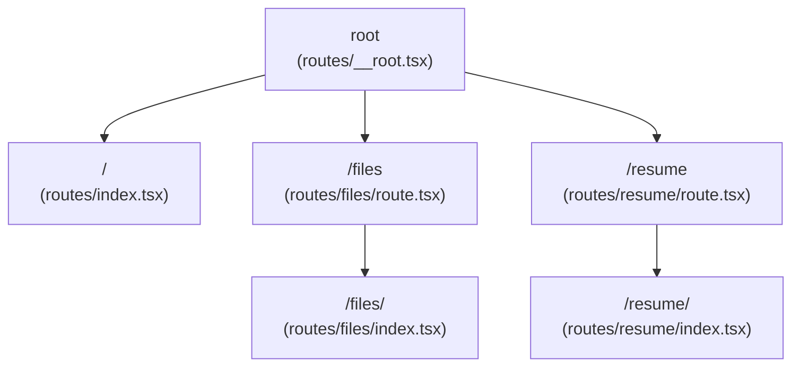
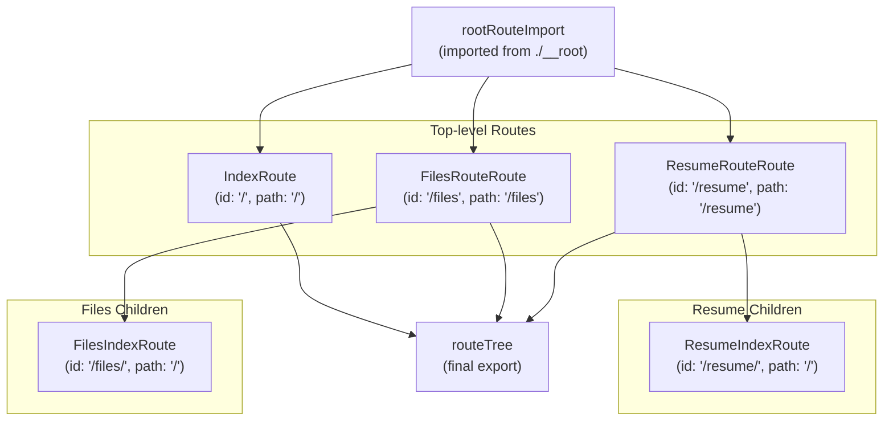
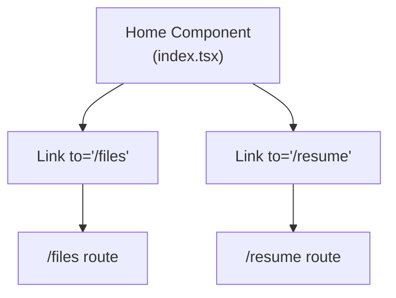
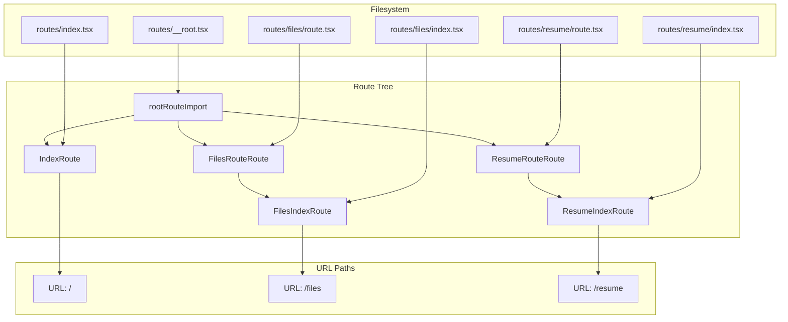

# Routing and Navigation

> **Relevant source files**
> * [packages/client/src/routeTree.gen.ts](https://github.com/oscaromsn/TalentScore/blob/428ed1eb/packages/client/src/routeTree.gen.ts)
> * [packages/client/src/routes/index.tsx](https://github.com/oscaromsn/TalentScore/blob/428ed1eb/packages/client/src/routes/index.tsx)

## Purpose and Scope

This document covers the client-side routing and navigation implementation using TanStack Router's file-based routing system. It explains how routes are organized in the filesystem, how the route tree is generated, and how navigation works throughout the TalentScore application.

For information about state management that coordinates with routing, see [State Management with Effect Atoms](/oscaromsn/TalentScore/5.2-state-management-with-effect-atoms). For details on specific UI components rendered by routes, see [Resume Features](/oscaromsn/TalentScore/5.3-resume-features) and [File Management UI](/oscaromsn/TalentScore/5.4-file-management-ui).

---

## Overview

The TalentScore client uses **TanStack Router** for type-safe, file-based routing. Routes are defined by the filesystem structure in [packages/client/src/routes/](https://github.com/oscaromsn/TalentScore/blob/428ed1eb/packages/client/src/routes/)

 and TanStack Router's CLI automatically generates a type-safe route tree in [packages/client/src/routeTree.gen.ts](https://github.com/oscaromsn/TalentScore/blob/428ed1eb/packages/client/src/routeTree.gen.ts)

The routing system provides:

| Feature | Implementation |
| --- | --- |
| **File-based routing** | Routes defined by file structure in `src/routes/` directory |
| **Type-safe navigation** | Generated TypeScript types for all routes and parameters |
| **Nested layouts** | Layout routes (`route.tsx`) with index children (`index.tsx`) |
| **Auto-generated route tree** | `routeTree.gen.ts` built by TanStack Router CLI |
| **Link components** | Type-safe `Link` component from `@tanstack/react-router` |

---

## Route Structure

### File-based Routing Organization

TanStack Router uses filesystem conventions to define routes. The application has the following route structure:



**Sources**: [packages/client/src/routeTree.gen.ts L11-L16](https://github.com/oscaromsn/TalentScore/blob/428ed1eb/packages/client/src/routeTree.gen.ts#L11-L16)

 [packages/client/src/routes/index.tsx L1-L32](https://github.com/oscaromsn/TalentScore/blob/428ed1eb/packages/client/src/routes/index.tsx#L1-L32)

### Route File Mapping

The filesystem structure maps to URL paths as follows:

| File Path | Route ID | URL Path | Purpose |
| --- | --- | --- | --- |
| `routes/__root.tsx` | `__root__` | N/A | Root layout wrapper for all routes |
| `routes/index.tsx` | `/` | `/` | Landing page with navigation links |
| `routes/files/route.tsx` | `/files` | `/files` | Files layout route (wrapper) |
| `routes/files/index.tsx` | `/files/` | `/files` | File management interface |
| `routes/resume/route.tsx` | `/resume` | `/resume` | Resume layout route (wrapper) |
| `routes/resume/index.tsx` | `/resume/` | `/resume` | Resume analysis interface |

**Sources**: [packages/client/src/routeTree.gen.ts L44-L70](https://github.com/oscaromsn/TalentScore/blob/428ed1eb/packages/client/src/routeTree.gen.ts#L44-L70)

### Layout Routes vs Index Routes

The application uses a **nested layout pattern**:

* **Layout routes** (`route.tsx`): Wrapper components that provide shared UI for child routes
* **Index routes** (`index.tsx`): Content rendered at the layout's base path

For example:

* `/resume/route.tsx` defines the layout wrapper for all resume-related routes
* `/resume/index.tsx` provides the content shown at the `/resume` path

This pattern enables shared layouts, navigation, and state management across related routes without code duplication.

**Sources**: [packages/client/src/routeTree.gen.ts L18-L42](https://github.com/oscaromsn/TalentScore/blob/428ed1eb/packages/client/src/routeTree.gen.ts#L18-L42)

---

## Generated Route Tree

### Auto-generation Process

The route tree is automatically generated by TanStack Router's CLI. The generated file [packages/client/src/routeTree.gen.ts](https://github.com/oscaromsn/TalentScore/blob/428ed1eb/packages/client/src/routeTree.gen.ts)

 includes warnings against manual editing:

```
This file was automatically generated by TanStack Router.
You should NOT make any changes in this file as it will be overwritten.
```

The generation process:

1. TanStack Router CLI scans the `src/routes/` directory
2. Parses route file structure and naming conventions
3. Generates TypeScript types and route configurations
4. Creates the `routeTree` export that the router consumes

**Sources**: [packages/client/src/routeTree.gen.ts L1-L9](https://github.com/oscaromsn/TalentScore/blob/428ed1eb/packages/client/src/routeTree.gen.ts#L1-L9)

### Route Tree Structure

The generated route tree builds a hierarchical structure of route objects:



**Sources**: [packages/client/src/routeTree.gen.ts L11-L149](https://github.com/oscaromsn/TalentScore/blob/428ed1eb/packages/client/src/routeTree.gen.ts#L11-L149)

### TypeScript Type System

The generated route tree provides comprehensive TypeScript types for type-safe navigation:

#### Route Lookup Types

```

```

```

```

**Key type interfaces**:

| Type Interface | Purpose |
| --- | --- |
| `FileRoutesByFullPath` | Maps full URL paths to route types |
| `FileRoutesByTo` | Maps navigation targets to final rendered routes |
| `FileRoutesById` | Maps route IDs to route types |
| `FileRouteTypes` | Union type containing all route metadata |
| `RootRouteChildren` | Type-safe children of root route |

These types enable compile-time validation when using the `Link` component or `navigate` function, preventing navigation to non-existent routes.

**Sources**: [packages/client/src/routeTree.gen.ts L44-L76](https://github.com/oscaromsn/TalentScore/blob/428ed1eb/packages/client/src/routeTree.gen.ts#L44-L76)

### Module Augmentation

The generated file augments the `@tanstack/react-router` module to inject application-specific route types:

```

```

This enables type-safe navigation throughout the application without importing route-specific types at every usage site.

**Sources**: [packages/client/src/routeTree.gen.ts L78-L116](https://github.com/oscaromsn/TalentScore/blob/428ed1eb/packages/client/src/routeTree.gen.ts#L78-L116)

---

## Route Definition Pattern

### Creating Routes

Routes are defined using the `createFileRoute` function from `@tanstack/react-router`. The pattern follows this structure:

```

```

Example from the landing page:

```

```

**Key characteristics**:

* Route configuration is exported as `Route` constant
* Path parameter matches the file's position in route hierarchy
* Component is specified in the configuration object
* The component function is defined in the same file

**Sources**: [packages/client/src/routes/index.tsx L1-L31](https://github.com/oscaromsn/TalentScore/blob/428ed1eb/packages/client/src/routes/index.tsx#L1-L31)

---

## Navigation Implementation

### Link Component Usage

The application uses the type-safe `Link` component from TanStack Router for navigation. Example from the landing page:



**Link implementation**:

```

```

The `to` prop is type-checked against the generated `FileRoutesByTo` interface, ensuring compile-time route validation.

**Sources**: [packages/client/src/routes/index.tsx L16-L21](https://github.com/oscaromsn/TalentScore/blob/428ed1eb/packages/client/src/routes/index.tsx#L16-L21)

### Navigation Features

The landing page demonstrates the navigation pattern:

| Element | Route Target | Description |
| --- | --- | --- |
| "Go to Files" button | `/files` | Navigates to file management interface |
| "Resume Parser" button | `/resume` | Navigates to resume analysis interface |

Both links use the `Link` component with:

* Type-safe `to` prop validated at compile time
* CSS classes for styling (Tailwind utility classes)
* Semantic button appearance with proper hover states

**Sources**: [packages/client/src/routes/index.tsx L15-L28](https://github.com/oscaromsn/TalentScore/blob/428ed1eb/packages/client/src/routes/index.tsx#L15-L28)

---

## Route Hierarchy and Parent-Child Relationships

### Parent Route Configuration

The generated route tree establishes parent-child relationships through the `getParentRoute` configuration:

```

```

```

```

**Sources**: [packages/client/src/routeTree.gen.ts L23-L42](https://github.com/oscaromsn/TalentScore/blob/428ed1eb/packages/client/src/routeTree.gen.ts#L23-L42)

### Route Children Assembly

Child routes are assembled into parent route objects using the `_addFileChildren` method:

```

```

This pattern:

1. Defines a type interface for child routes
2. Creates an object mapping child route names to route instances
3. Calls `_addFileChildren` to merge children into the parent route

The same pattern applies to both `/files` and `/resume` layout routes.

**Sources**: [packages/client/src/routeTree.gen.ts L118-L140](https://github.com/oscaromsn/TalentScore/blob/428ed1eb/packages/client/src/routeTree.gen.ts#L118-L140)

### Final Route Tree Export

The root route assembles all top-level routes and applies type information:

```

```

The `routeTree` export is the complete, type-safe route configuration consumed by the TanStack Router instance in the application setup.

**Sources**: [packages/client/src/routeTree.gen.ts L142-L149](https://github.com/oscaromsn/TalentScore/blob/428ed1eb/packages/client/src/routeTree.gen.ts#L142-L149)

---

## Route and Component Mapping

The following diagram shows how filesystem routes map to React components and URLs:



**Sources**: [packages/client/src/routeTree.gen.ts L1-L149](https://github.com/oscaromsn/TalentScore/blob/428ed1eb/packages/client/src/routeTree.gen.ts#L1-L149)

 [packages/client/src/routes/index.tsx L1-L32](https://github.com/oscaromsn/TalentScore/blob/428ed1eb/packages/client/src/routes/index.tsx#L1-L32)

---

## Integration with Application Setup

The generated `routeTree` is imported and configured in the router setup. The router instance is then provided to the application through the TanStack Router provider component, enabling:

* Client-side navigation without full page reloads
* Type-safe navigation throughout the component tree
* Automatic code-splitting at route boundaries
* Integration with Effect Atoms for route-aware state management

For details on how routes interact with state management, see [State Management with Effect Atoms](/oscaromsn/TalentScore/5.2-state-management-with-effect-atoms).

**Sources**: [packages/client/src/routeTree.gen.ts L147-L149](https://github.com/oscaromsn/TalentScore/blob/428ed1eb/packages/client/src/routeTree.gen.ts#L147-L149)