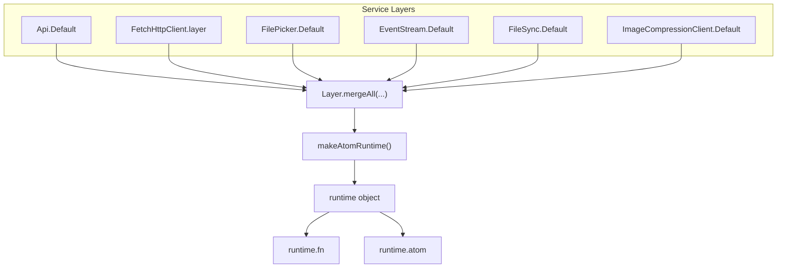
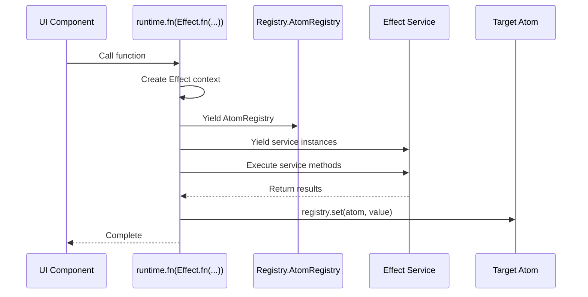
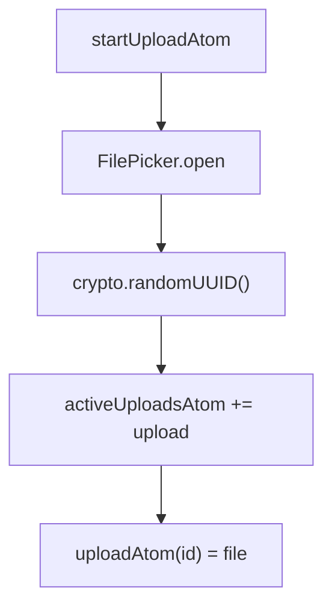
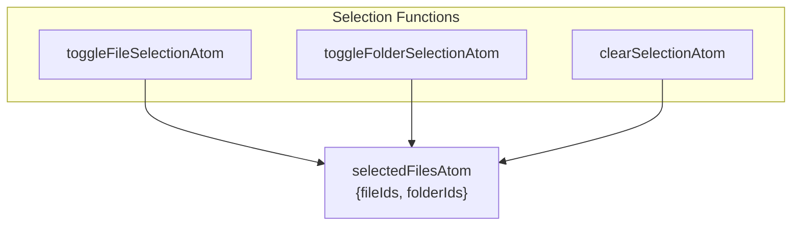
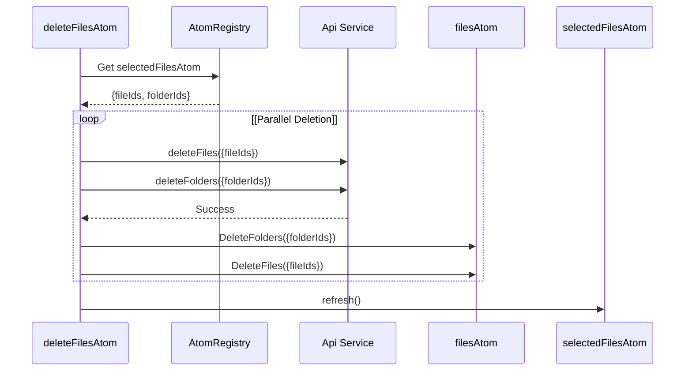
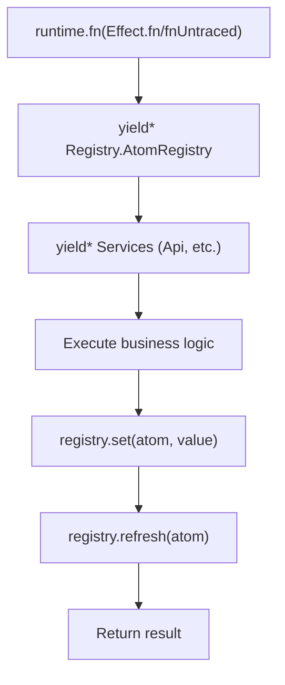
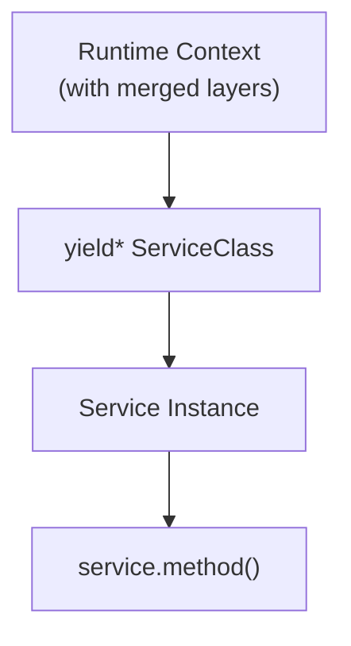
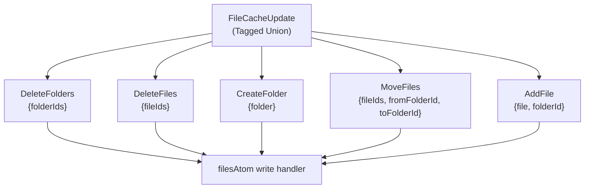
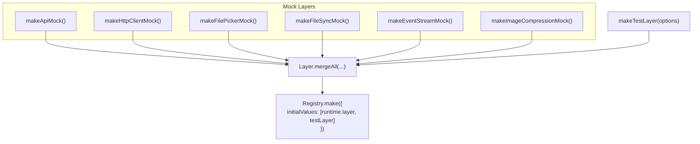

# Runtime Functions

> **Relevant source files**
> * [packages/client/src/routes/files/-files/files-atoms/files-atoms.test.ts](https://github.com/lucas-barake/effect-file-manager/blob/28eedd82/packages/client/src/routes/files/-files/files-atoms/files-atoms.test.ts)
> * [packages/client/src/routes/files/-files/files-atoms/files-atoms.tsx](https://github.com/lucas-barake/effect-file-manager/blob/28eedd82/packages/client/src/routes/files/-files/files-atoms/files-atoms.tsx)

## Purpose and Scope

This document explains the **runtime function pattern** used throughout the Effect Atoms state management system. Runtime functions are Effect-based action creators that orchestrate state changes across multiple atoms while accessing injected services. They serve as the primary interface for triggering side effects and coordinating complex state transitions.

For information about the atoms these functions manipulate, see [Core Atoms](/lucas-barake/effect-file-manager/5.1-core-atoms). For details on how these functions are tested, see [Testing State Management](/lucas-barake/effect-file-manager/5.3-testing-state-management). For the upload-specific state machine logic, see [Upload State Machine](/lucas-barake/effect-file-manager/4.1-upload-state-machine).

**Sources:** [packages/client/src/routes/files/-files/files-atoms/files-atoms.tsx L407-L780](https://github.com/lucas-barake/effect-file-manager/blob/28eedd82/packages/client/src/routes/files/-files/files-atoms/files-atoms.tsx#L407-L780)

---

## Runtime Object

The `runtime` object is a specialized Effect runtime configured with all necessary service dependencies for atom operations. It is created using `makeAtomRuntime`, which merges multiple Effect layers into a single runtime context.

### Runtime Creation



**Sources:** [packages/client/src/routes/files/-files/files-atoms/files-atoms.tsx L247-L256](https://github.com/lucas-barake/effect-file-manager/blob/28eedd82/packages/client/src/routes/files/-files/files-atoms/files-atoms.tsx#L247-L256)

The runtime provides two primary methods:

| Method | Purpose | Returns |
| --- | --- | --- |
| `runtime.fn` | Creates an executable function that runs an Effect with access to all runtime services | Function that returns a Promise |
| `runtime.atom` | Creates a streaming atom that continuously emits values from an Effect stream | Atom wrapping the stream |

---

## Runtime Function Patterns

Runtime functions follow a consistent pattern using Effect's functional effect composition. There are two primary variants:

### Effect.fn (Traced)

Functions wrapped with `Effect.fn` include execution tracing, enabling observability through OpenTelemetry spans.



**Sources:** [packages/client/src/routes/files/-files/files-atoms/files-atoms.tsx L407-L436](https://github.com/lucas-barake/effect-file-manager/blob/28eedd82/packages/client/src/routes/files/-files/files-atoms/files-atoms.tsx#L407-L436)

 [packages/client/src/routes/files/-files/files-atoms/files-atoms.tsx L511-L533](https://github.com/lucas-barake/effect-file-manager/blob/28eedd82/packages/client/src/routes/files/-files/files-atoms/files-atoms.tsx#L511-L533)

### Effect.fnUntraced (Untraced)

Functions wrapped with `Effect.fnUntraced` omit tracing overhead, suitable for lightweight synchronous operations like UI state updates.

**Sources:** [packages/client/src/routes/files/-files/files-atoms/files-atoms.tsx L442-L452](https://github.com/lucas-barake/effect-file-manager/blob/28eedd82/packages/client/src/routes/files/-files/files-atoms/files-atoms.tsx#L442-L452)

 [packages/client/src/routes/files/-files/files-atoms/files-atoms.tsx L458-L469](https://github.com/lucas-barake/effect-file-manager/blob/28eedd82/packages/client/src/routes/files/-files/files-atoms/files-atoms.tsx#L458-L469)

---

## File Upload Actions

### startUploadAtom

Initiates a new file upload by opening a file picker, creating an upload ID, and configuring the upload atom with the selected file.



**Key Implementation Details:**

* **Location:** [packages/client/src/routes/files/-files/files-atoms/files-atoms.tsx L407-L436](https://github.com/lucas-barake/effect-file-manager/blob/28eedd82/packages/client/src/routes/files/-files/files-atoms/files-atoms.tsx#L407-L436)
* **Service Dependencies:** `FilePicker`, `Registry.AtomRegistry`
* **Atoms Modified:** `activeUploadsAtom`, `uploadAtom(uploadId)`
* **Error Handling:** Interrupts if user cancels file selection (`NoSuchElementException`)

**Payload Structure:**

| Field | Type | Description |
| --- | --- | --- |
| `_tag` | `"Root" \| "Folder"` | Upload target location |
| `id` | `FolderId` (if Folder) | Target folder ID |

**Sources:** [packages/client/src/routes/files/-files/files-atoms/files-atoms.tsx L407-L436](https://github.com/lucas-barake/effect-file-manager/blob/28eedd82/packages/client/src/routes/files/-files/files-atoms/files-atoms.tsx#L407-L436)

### cancelUploadAtom

Interrupts an ongoing upload and removes it from the active uploads list.

**Key Implementation Details:**

* **Location:** [packages/client/src/routes/files/-files/files-atoms/files-atoms.tsx L442-L452](https://github.com/lucas-barake/effect-file-manager/blob/28eedd82/packages/client/src/routes/files/-files/files-atoms/files-atoms.tsx#L442-L452)
* **Mechanism:** Sets `uploadAtom(uploadId)` to `Atom.Interrupt`, which triggers Effect interruption
* **Atoms Modified:** `uploadAtom(uploadId)`, `activeUploadsAtom`
* **Synchronous:** Uses `Effect.fnUntraced` for immediate response

**Sources:** [packages/client/src/routes/files/-files/files-atoms/files-atoms.tsx L442-L452](https://github.com/lucas-barake/effect-file-manager/blob/28eedd82/packages/client/src/routes/files/-files/files-atoms/files-atoms.tsx#L442-L452)

---

## Selection Management Functions

Selection management functions handle UI selection state for files and folders. All use `Effect.fnUntraced` for immediate, lightweight updates.

### Function Comparison



**Sources:** [packages/client/src/routes/files/-files/files-atoms/files-atoms.tsx L458-L505](https://github.com/lucas-barake/effect-file-manager/blob/28eedd82/packages/client/src/routes/files/-files/files-atoms/files-atoms.tsx#L458-L505)

### toggleFileSelectionAtom

Toggles a single file's selection state.

**Location:** [packages/client/src/routes/files/-files/files-atoms/files-atoms.tsx L458-L469](https://github.com/lucas-barake/effect-file-manager/blob/28eedd82/packages/client/src/routes/files/-files/files-atoms/files-atoms.tsx#L458-L469)

**Logic:**

* If `fileId` is in `selectedFilesAtom.fileIds`, remove it
* Otherwise, append it

### toggleFolderSelectionAtom

Toggles folder selection and all files within that folder.

**Location:** [packages/client/src/routes/files/-files/files-atoms/files-atoms.tsx L471-L495](https://github.com/lucas-barake/effect-file-manager/blob/28eedd82/packages/client/src/routes/files/-files/files-atoms/files-atoms.tsx#L471-L495)

**Payload:**

| Field | Type | Description |
| --- | --- | --- |
| `folderId` | `FolderId` | Folder to toggle |
| `fileIdsInFolder` | `readonly UploadedFileId[]` | All file IDs contained in the folder |

**Logic:**

* If folder selected: Remove `folderId` and all `fileIdsInFolder` from selection
* If folder not selected: Add `folderId` and all `fileIdsInFolder` to selection

### clearSelectionAtom

Resets selection state to empty arrays.

**Location:** [packages/client/src/routes/files/-files/files-atoms/files-atoms.tsx L497-L505](https://github.com/lucas-barake/effect-file-manager/blob/28eedd82/packages/client/src/routes/files/-files/files-atoms/files-atoms.tsx#L497-L505)

**Sources:** [packages/client/src/routes/files/-files/files-atoms/files-atoms.tsx L458-L505](https://github.com/lucas-barake/effect-file-manager/blob/28eedd82/packages/client/src/routes/files/-files/files-atoms/files-atoms.tsx#L458-L505)

---

## File Operations

File operation functions coordinate API calls with optimistic UI updates. They use `Effect.fn` (traced) for observability.

### deleteFilesAtom

Deletes selected files and folders, performing parallel API calls followed by cache updates.



**Key Implementation Details:**

* **Location:** [packages/client/src/routes/files/-files/files-atoms/files-atoms.tsx L511-L533](https://github.com/lucas-barake/effect-file-manager/blob/28eedd82/packages/client/src/routes/files/-files/files-atoms/files-atoms.tsx#L511-L533)
* **Parallelism:** API calls execute concurrently via `Effect.zip` with `concurrent: true`
* **Conditional Updates:** Only updates cache if arrays are non-empty (`Arr.isNonEmptyArray`)
* **Cache Actions:** Uses `DeleteFolders` and `DeleteFiles` tagged union constructors

**Sources:** [packages/client/src/routes/files/-files/files-atoms/files-atoms.tsx L511-L533](https://github.com/lucas-barake/effect-file-manager/blob/28eedd82/packages/client/src/routes/files/-files/files-atoms/files-atoms.tsx#L511-L533)

### createFolderAtom

Creates a new folder and adds it to the local cache.

**Location:** [packages/client/src/routes/files/-files/files-atoms/files-atoms.tsx L725-L735](https://github.com/lucas-barake/effect-file-manager/blob/28eedd82/packages/client/src/routes/files/-files/files-atoms/files-atoms.tsx#L725-L735)

**Parameters:**

* `folderName: string` - Name for the new folder

**Flow:**

1. Call `api.createFolder({folderName})`
2. Update `filesAtom` with `CreateFolder({folder})` action
3. Return created `Folder` object

**Sources:** [packages/client/src/routes/files/-files/files-atoms/files-atoms.tsx L725-L735](https://github.com/lucas-barake/effect-file-manager/blob/28eedd82/packages/client/src/routes/files/-files/files-atoms/files-atoms.tsx#L725-L735)

### moveFilesAtom

Moves files to a different folder or to root, updating local cache optimistically.

**Location:** [packages/client/src/routes/files/-files/files-atoms/files-atoms.tsx L741-L780](https://github.com/lucas-barake/effect-file-manager/blob/28eedd82/packages/client/src/routes/files/-files/files-atoms/files-atoms.tsx#L741-L780)

**Payload:**

| Field | Type | Description |
| --- | --- | --- |
| `fileIds` | `readonly UploadedFileId[]` | Files to move |
| `folderId` | `FolderId \| null` | Destination (null = root) |

**Algorithm:**

1. Query `filesAtom` to determine source folder (`fromFolderId`)
2. Call `api.moveFiles(payload)`
3. Update `filesAtom` with `MoveFiles` action
4. Refresh `selectedFilesAtom` (clears stale selections)

**Sources:** [packages/client/src/routes/files/-files/files-atoms/files-atoms.tsx L741-L780](https://github.com/lucas-barake/effect-file-manager/blob/28eedd82/packages/client/src/routes/files/-files/files-atoms/files-atoms.tsx#L741-L780)

---

## Orchestration Patterns

Runtime functions orchestrate state changes through a consistent pattern:

### Pattern Structure



**Sources:** [packages/client/src/routes/files/-files/files-atoms/files-atoms.tsx L407-L780](https://github.com/lucas-barake/effect-file-manager/blob/28eedd82/packages/client/src/routes/files/-files/files-atoms/files-atoms.tsx#L407-L780)

### Atom Update Methods

Runtime functions use three methods from `Registry.AtomRegistry` to manipulate atoms:

| Method | Purpose | Example Usage |
| --- | --- | --- |
| `registry.get(atom)` | Read current atom value | `const current = registry.get(selectedFilesAtom)` |
| `registry.set(atom, value)` | Write new value to atom | `registry.set(filesAtom, DeleteFiles({fileIds}))` |
| `registry.refresh(atom)` | Force atom to re-compute from source | `registry.refresh(selectedFilesAtom)` |

**Sources:** [packages/client/src/routes/files/-files/files-atoms/files-atoms.tsx L407-L780](https://github.com/lucas-barake/effect-file-manager/blob/28eedd82/packages/client/src/routes/files/-files/files-atoms/files-atoms.tsx#L407-L780)

### Service Access Pattern

All runtime functions access Effect services through the `yield*` operator:



**Common Services:**

* **Api:** RPC client for server communication [packages/client/src/routes/files/-files/files-atoms/files-atoms.tsx L41-L64](https://github.com/lucas-barake/effect-file-manager/blob/28eedd82/packages/client/src/routes/files/-files/files-atoms/files-atoms.tsx#L41-L64)
* **FilePicker:** File selection dialog [packages/client/src/routes/files/-files/files-atoms/files-atoms.tsx L202-L245](https://github.com/lucas-barake/effect-file-manager/blob/28eedd82/packages/client/src/routes/files/-files/files-atoms/files-atoms.tsx#L202-L245)
* **FileSync:** Upload synchronization [packages/client/src/routes/files/-files/files-atoms/files-atoms.tsx L132-L200](https://github.com/lucas-barake/effect-file-manager/blob/28eedd82/packages/client/src/routes/files/-files/files-atoms/files-atoms.tsx#L132-L200)
* **Registry.AtomRegistry:** Atom manipulation interface (automatically injected)

**Sources:** [packages/client/src/routes/files/-files/files-atoms/files-atoms.tsx L41-L245](https://github.com/lucas-barake/effect-file-manager/blob/28eedd82/packages/client/src/routes/files/-files/files-atoms/files-atoms.tsx#L41-L245)

---

## Cache Update Actions

Runtime functions update `filesAtom` using a tagged union of cache actions. These actions are processed by the atom's write handler.

### FileCacheUpdate Types



**Sources:** [packages/client/src/routes/files/-files/files-atoms/files-atoms.tsx L539-L554](https://github.com/lucas-barake/effect-file-manager/blob/28eedd82/packages/client/src/routes/files/-files/files-atoms/files-atoms.tsx#L539-L554)

 [packages/client/src/routes/files/-files/files-atoms/files-atoms.tsx L579-L693](https://github.com/lucas-barake/effect-file-manager/blob/28eedd82/packages/client/src/routes/files/-files/files-atoms/files-atoms.tsx#L579-L693)

### Action Constructors

| Action | Fields | Purpose |
| --- | --- | --- |
| `DeleteFolders` | `folderIds: readonly FolderId[]` | Remove folders from cache |
| `DeleteFiles` | `fileIds: readonly UploadedFileId[]` | Remove files from cache |
| `CreateFolder` | `folder: Folder.WithUploadedFiles` | Add new folder to cache |
| `MoveFiles` | `fileIds`, `fromFolderId`, `toFolderId` | Relocate files in cache |
| `AddFile` | `file: UploadedFile`, `folderId: FolderId \| null` | Add uploaded file to cache |

**Usage Example:**

The `deleteFilesAtom` function demonstrates typical cache action usage:

```
// After successful API call
if (Arr.isNonEmptyArray(folderIds)) {
  registry.set(filesAtom, DeleteFolders({ folderIds }));
}
if (Arr.isNonEmptyArray(fileIds)) {
  registry.set(filesAtom, DeleteFiles({ fileIds }));
}
```

**Sources:** [packages/client/src/routes/files/-files/files-atoms/files-atoms.tsx L524-L529](https://github.com/lucas-barake/effect-file-manager/blob/28eedd82/packages/client/src/routes/files/-files/files-atoms/files-atoms.tsx#L524-L529)

---

## Error Handling

Runtime functions leverage Effect's error handling capabilities:

### Effect.catchTag

Specific error types can be handled differently:

**Example from startUploadAtom:**

```javascript
yield* filePicker.open.pipe(
  Effect.flatten,
  Effect.catchTag("NoSuchElementException", () => Effect.interrupt),
)
```

When the user cancels file selection, the function interrupts gracefully rather than failing.

**Sources:** [packages/client/src/routes/files/-files/files-atoms/files-atoms.tsx L412-L415](https://github.com/lucas-barake/effect-file-manager/blob/28eedd82/packages/client/src/routes/files/-files/files-atoms/files-atoms.tsx#L412-L415)

### Atom Interruption

Setting an atom to `Atom.Interrupt` cancels its running Effect:

```
registry.set(uploadAtom(uploadId), Atom.Interrupt);
```

This pattern is used by `cancelUploadAtom` to abort in-progress uploads.

**Sources:** [packages/client/src/routes/files/-files/files-atoms/files-atoms.tsx L446](https://github.com/lucas-barake/effect-file-manager/blob/28eedd82/packages/client/src/routes/files/-files/files-atoms/files-atoms.tsx#L446-L446)

---

## Testing Runtime Functions

Runtime functions are tested by providing mock service layers to the registry. The test suite demonstrates all patterns:

### Mock Layer Composition



**Sources:** [packages/client/src/routes/files/-files/files-atoms/files-atoms.test.ts L206-L235](https://github.com/lucas-barake/effect-file-manager/blob/28eedd82/packages/client/src/routes/files/-files/files-atoms/files-atoms.test.ts#L206-L235)

### Test Execution Pattern

Tests execute runtime functions by:

1. Creating a registry with mock layers
2. Mounting and setting atoms
3. Advancing fake timers to trigger Effects
4. Inspecting atom results and mock call logs

**Example Test Structure:**

```javascript
const { testLayer, apiCalls } = makeTestLayer({ file });
const r = Registry.make({
  initialValues: [Atom.initialValue(runtime.layer, testLayer)],
});

const uploadId = "test-upload-1";
const upload = uploadAtom(uploadId);
const unmount = r.mount(upload);

r.set(upload, { file, folderId: null });

await vitest.advanceTimersByTimeAsync(0);
const result = r.get(upload);
```

**Sources:** [packages/client/src/routes/files/-files/files-atoms/files-atoms.test.ts L251-L285](https://github.com/lucas-barake/effect-file-manager/blob/28eedd82/packages/client/src/routes/files/-files/files-atoms/files-atoms.test.ts#L251-L285)

---

## Summary

Runtime functions provide a structured pattern for coordinating state changes in the Effect Atoms system:

* **Runtime Object:** Configured with all service dependencies via layer composition
* **runtime.fn:** Wraps Effect-based functions for execution in the runtime context
* **Service Access:** Uses `yield*` to access injected services (Api, FilePicker, etc.)
* **Atom Manipulation:** Updates atoms via `registry.set()` and `registry.refresh()`
* **Cache Actions:** Uses tagged unions (`FileCacheUpdate`) for type-safe state updates
* **Error Handling:** Leverages Effect's structured error handling with `catchTag` and interruption
* **Testability:** Mock layers enable comprehensive testing without real services

**Sources:** [packages/client/src/routes/files/-files/files-atoms/files-atoms.tsx L247-L780](https://github.com/lucas-barake/effect-file-manager/blob/28eedd82/packages/client/src/routes/files/-files/files-atoms/files-atoms.tsx#L247-L780)

 [packages/client/src/routes/files/-files/files-atoms/files-atoms.test.ts L1-L420](https://github.com/lucas-barake/effect-file-manager/blob/28eedd82/packages/client/src/routes/files/-files/files-atoms/files-atoms.test.ts#L1-L420)