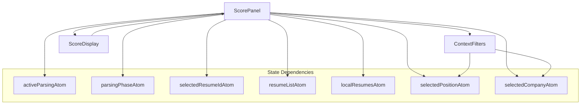
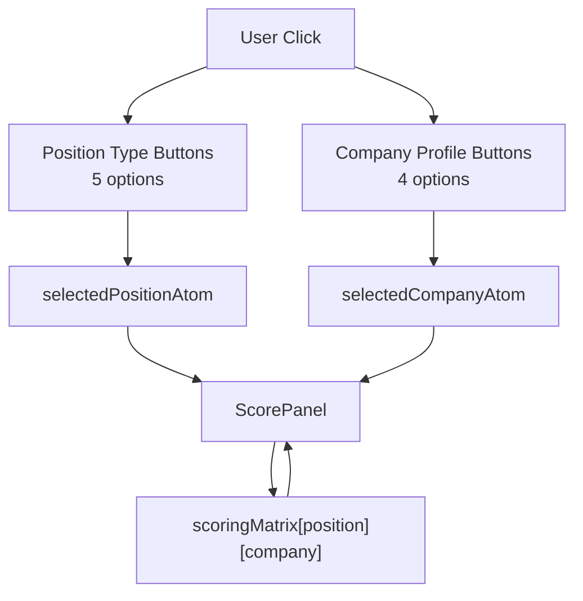
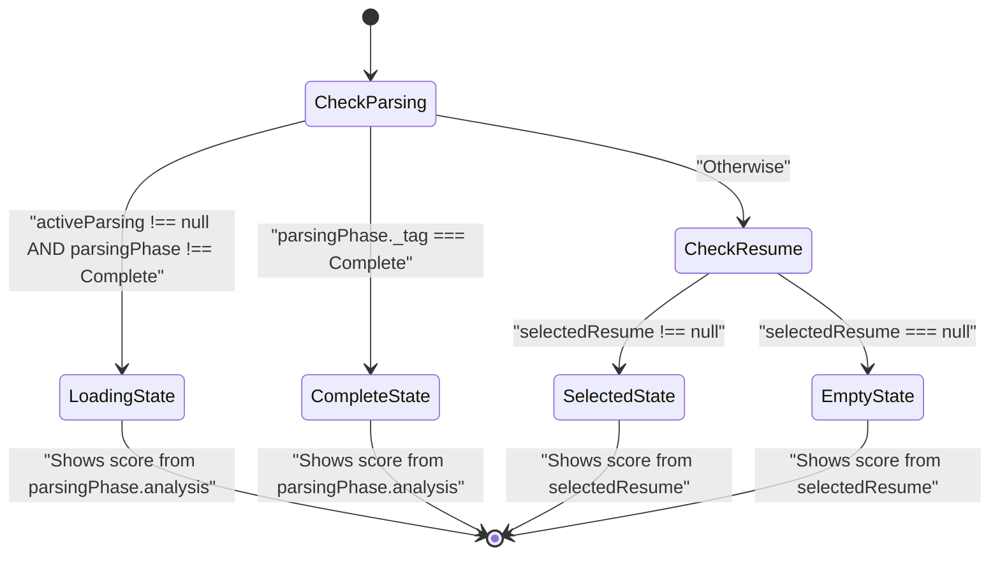
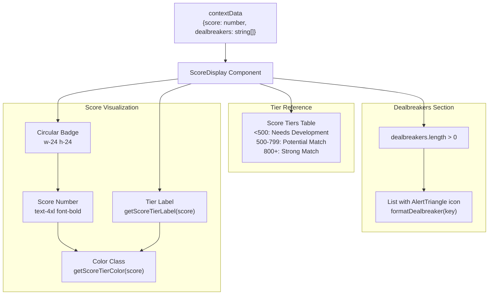
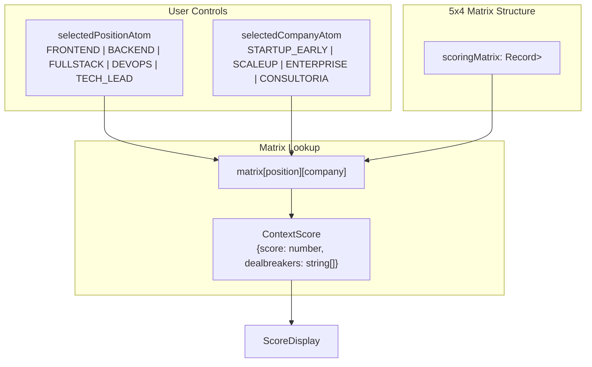

# Score Panel and Context Filters

> **Relevant source files**
> * [packages/client/src/routes/resume/-resume/components/context-filters.tsx](https://github.com/oscaromsn/TalentScore/blob/428ed1eb/packages/client/src/routes/resume/-resume/components/context-filters.tsx)
> * [packages/client/src/routes/resume/-resume/components/score-panel.tsx](https://github.com/oscaromsn/TalentScore/blob/428ed1eb/packages/client/src/routes/resume/-resume/components/score-panel.tsx)

## Purpose and Scope

This page documents the `ScorePanel` and `ContextFilters` components, which provide the user interface for viewing context-aware resume scores and controlling which scoring context is displayed. The `ScorePanel` displays the numerical score, tier classification, and dealbreakers for a selected resume, while `ContextFilters` provides controls for selecting the Position Type and Company Profile dimensions that determine which cell of the 5×4 scoring matrix is displayed.

For information about how scores are calculated, see [Scoring Algorithm](/oscaromsn/TalentScore/4.4.2-scoring-algorithm). For information about the scoring matrix data structure, see [Scoring Matrix Design](/oscaromsn/TalentScore/3.3-scoring-matrix-design). For information about the state management atoms used by these components, see [Resume State Management](/oscaromsn/TalentScore/5.2.1-resume-state-management).

---

## Component Architecture

The scoring display system consists of two primary components that work together to provide context-aware score visualization.

### Component Hierarchy Diagram

**Sources**: [packages/client/src/routes/resume/-resume/components/score-panel.tsx L1-L167](https://github.com/oscaromsn/TalentScore/blob/428ed1eb/packages/client/src/routes/resume/-resume/components/score-panel.tsx#L1-L167)

 [packages/client/src/routes/resume/-resume/components/context-filters.tsx L1-L76](https://github.com/oscaromsn/TalentScore/blob/428ed1eb/packages/client/src/routes/resume/-resume/components/context-filters.tsx#L1-L76)

---

## Context Filters Component

The `ContextFilters` component renders two button groups that allow users to select the scoring context. Changes to these filters immediately update the displayed score in the `ScorePanel`.

### Position Type Selection

The component renders buttons for five position types defined in `POSITION_TYPES`:

| Position Type | Display Label | Description |
| --- | --- | --- |
| `FRONTEND` | Frontend | Frontend development roles |
| `BACKEND` | Backend | Backend development roles |
| `FULLSTACK` | Full Stack | Full-stack development roles |
| `DEVOPS` | DevOps | DevOps and infrastructure roles |
| `TECH_LEAD` | Tech Lead | Technical leadership roles |

The selected position is stored in `selectedPositionAtom` and persists across navigation.

### Company Profile Selection

The component renders buttons for four company profiles defined in `COMPANY_PROFILES`:

| Company Profile | Display Label | Description |
| --- | --- | --- |
| `STARTUP_EARLY` | Startup | Early-stage startup environment |
| `SCALEUP` | Scale-up | Growth-stage company |
| `ENTERPRISE` | Enterprise | Large enterprise organization |
| `CONSULTORIA` | Consultoria | Consulting firm |

The selected company profile is stored in `selectedCompanyAtom`.

### Context Filter Implementation

The component uses `useAtom` hook from `@effect-atom/atom-react` to both read and write atom values. When a user clicks a button, the `onClick` handler calls `setPosition(p)` or `setCompany(c)`, which updates the atom and triggers re-renders in all components that depend on these atoms.

**Sources**: [packages/client/src/routes/resume/-resume/components/context-filters.tsx L1-L76](https://github.com/oscaromsn/TalentScore/blob/428ed1eb/packages/client/src/routes/resume/-resume/components/context-filters.tsx#L1-L76)

---

## Score Panel Component

The `ScorePanel` component is responsible for displaying the appropriate score based on the current application state. It handles four distinct rendering states.

### State-Based Rendering Logic

### State Priority and Resume Source Resolution

The component implements a priority system for finding the selected resume:

1. **Local cache first**: Searches `localResumesAtom` for newly parsed resumes that haven't yet synced to the server
2. **Server list second**: Searches `resumeListAtom` for resumes fetched from the database
3. **Null fallback**: If no resume is found with `selectedResumeIdAtom`, returns null

This two-tier lookup ensures that newly parsed resumes are immediately viewable even before they appear in the server list.

**Sources**: [packages/client/src/routes/resume/-resume/components/score-panel.tsx L90-L167](https://github.com/oscaromsn/TalentScore/blob/428ed1eb/packages/client/src/routes/resume/-resume/components/score-panel.tsx#L90-L167)

### Loading State

Rendered when a resume is actively being parsed but scoring hasn't completed:

* **Condition**: `activeParsing !== null && parsingPhase._tag !== "Complete"`
* **Display**: `Loader2` icon with spinning animation and "Calculating score..." text
* **Context filters**: Still rendered at top of panel

**Sources**: [packages/client/src/routes/resume/-resume/components/score-panel.tsx L117-L129](https://github.com/oscaromsn/TalentScore/blob/428ed1eb/packages/client/src/routes/resume/-resume/components/score-panel.tsx#L117-L129)

### Complete State

Rendered immediately after parsing completes, showing the newly calculated score:

* **Condition**: `parsingPhase._tag === "Complete"`
* **Data source**: `parsingPhase.analysis.data.scoringMatrix[position][company]`
* **Components**: `ContextFilters` + `ScoreDisplay` with score and dealbreakers

**Sources**: [packages/client/src/routes/resume/-resume/components/score-panel.tsx L132-L140](https://github.com/oscaromsn/TalentScore/blob/428ed1eb/packages/client/src/routes/resume/-resume/components/score-panel.tsx#L132-L140)

### Selected Resume State

Rendered when viewing a previously parsed resume from the history list:

* **Condition**: `selectedResume !== null`
* **Data source**: `selectedResume.data.scoringMatrix[position][company]`
* **Components**: `ContextFilters` + `ScoreDisplay` with score and dealbreakers

**Sources**: [packages/client/src/routes/resume/-resume/components/score-panel.tsx L143-L151](https://github.com/oscaromsn/TalentScore/blob/428ed1eb/packages/client/src/routes/resume/-resume/components/score-panel.tsx#L143-L151)

### Empty State

Rendered when no resume is selected and no parsing is in progress:

* **Condition**: All other conditions false
* **Display**: `Award` icon and "Select a resume to see the score" message
* **Context filters**: Still rendered to preserve user's context selection

**Sources**: [packages/client/src/routes/resume/-resume/components/score-panel.tsx L154-L166](https://github.com/oscaromsn/TalentScore/blob/428ed1eb/packages/client/src/routes/resume/-resume/components/score-panel.tsx#L154-L166)

---

## Score Display Component

The `ScoreDisplay` sub-component receives `score` and `dealbreakers` as props and renders the score visualization.

### Score Display Data Flow

**Sources**: [packages/client/src/routes/resume/-resume/components/score-panel.tsx L30-L88](https://github.com/oscaromsn/TalentScore/blob/428ed1eb/packages/client/src/routes/resume/-resume/components/score-panel.tsx#L30-L88)

### Score Tier Classification

The component applies color-coded styling based on score ranges:

| Score Range | Tier Label | Color Class | Semantic Meaning |
| --- | --- | --- | --- |
| < 500 | Needs Development | `text-red-600` | Low match quality |
| 500-799 | Potential Match | `text-yellow-600` | Medium match quality |
| 800+ | Strong Match | `text-green-600` | High match quality |

The tier color and label are determined by `getScoreTierColor(score)` and `getScoreTierLabel(score)` utility functions imported from `resume-atoms`.

**Sources**: [packages/client/src/routes/resume/-resume/components/score-panel.tsx L37-L38](https://github.com/oscaromsn/TalentScore/blob/428ed1eb/packages/client/src/routes/resume/-resume/components/score-panel.tsx#L37-L38)

 [packages/client/src/routes/resume/-resume/components/score-panel.tsx L54-L70](https://github.com/oscaromsn/TalentScore/blob/428ed1eb/packages/client/src/routes/resume/-resume/components/score-panel.tsx#L54-L70)

### Dealbreaker Display

When the `dealbreakers` array is non-empty, a destructive-styled alert box is rendered:

* **Container**: Red-tinted background with border (`bg-destructive/10 border-destructive/20`)
* **Header**: "Dealbreakers" with `AlertTriangle` icon from lucide-react
* **List**: Each dealbreaker is formatted using `formatDealbreaker(key)`

The `formatDealbreaker` function maps known dealbreaker keys to human-readable labels:

| Dealbreaker Key | Display Label |
| --- | --- |
| `missing_certification` | Missing required certifications |
| `no_leadership_experience` | No leadership experience detected |
| `outdated_tech_stack` | Technology stack appears outdated |
| `insufficient_experience` | Insufficient years of experience |

Unknown keys are formatted by replacing underscores with spaces.

**Sources**: [packages/client/src/routes/resume/-resume/components/score-panel.tsx L19-L28](https://github.com/oscaromsn/TalentScore/blob/428ed1eb/packages/client/src/routes/resume/-resume/components/score-panel.tsx#L19-L28)

 [packages/client/src/routes/resume/-resume/components/score-panel.tsx L73-L85](https://github.com/oscaromsn/TalentScore/blob/428ed1eb/packages/client/src/routes/resume/-resume/components/score-panel.tsx#L73-L85)

---

## Integration with Scoring Matrix

The components provide a UI layer over the 5×4 scoring matrix structure defined in the domain package. Each combination of Position Type and Company Profile maps to a unique cell in the matrix.

### Matrix Navigation Pattern

The lookup pattern `scoringMatrix[position][company]` is used in three places within `ScorePanel`:

1. **Line 133**: `parsingPhase.analysis.data.scoringMatrix[position][company]` for newly parsed resumes
2. **Line 144**: `selectedResume.data.scoringMatrix[position][company]` for selected resumes from list

This ensures the displayed score always reflects the current context filter selections.

**Sources**: [packages/client/src/routes/resume/-resume/components/score-panel.tsx L133](https://github.com/oscaromsn/TalentScore/blob/428ed1eb/packages/client/src/routes/resume/-resume/components/score-panel.tsx#L133-L133)

 [packages/client/src/routes/resume/-resume/components/score-panel.tsx L144](https://github.com/oscaromsn/TalentScore/blob/428ed1eb/packages/client/src/routes/resume/-resume/components/score-panel.tsx#L144-L144)

---

## Styling and Visual Design

Both components use Tailwind CSS utility classes for styling and follow a consistent design system.

### ContextFilters Visual Structure

* **Container**: `space-y-4 mb-6 p-4 bg-muted/30 rounded-lg border`
* **Labels**: `text-xs font-semibold text-muted-foreground uppercase tracking-wide`
* **Buttons**: Height `h-7`, small padding `text-xs`, variant changes on selection * Active position: `variant="default"` * Inactive position: `variant="outline"` * Active company: `variant="secondary"` * Inactive company: `variant="outline"`

The different active variants (`default` vs `secondary`) provide visual distinction between the two filter dimensions.

**Sources**: [packages/client/src/routes/resume/-resume/components/context-filters.tsx L33-L73](https://github.com/oscaromsn/TalentScore/blob/428ed1eb/packages/client/src/routes/resume/-resume/components/context-filters.tsx#L33-L73)

### ScorePanel Visual Structure

* **Circular score badge**: `w-24 h-24 rounded-full bg-secondary` with centered content
* **Score number**: `text-4xl font-bold` with dynamic tier color class
* **Tier label**: `text-lg font-semibold` with dynamic tier color class
* **Context hint**: `text-xs text-muted-foreground` indicating score is context-specific

**Sources**: [packages/client/src/routes/resume/-resume/components/score-panel.tsx L40-L52](https://github.com/oscaromsn/TalentScore/blob/428ed1eb/packages/client/src/routes/resume/-resume/components/score-panel.tsx#L40-L52)

---

## Component Reusability

The `ScoreDisplay` component is designed as a pure presentational component, receiving only `score` and `dealbreakers` as props. This separation allows it to be reused in different contexts:

* Could be embedded in a resume list item (showing preview scores)
* Could be used in comparison views (side-by-side score displays)
* Could be exported for use in reports or printable views

The parent `ScorePanel` handles all state management complexity, while `ScoreDisplay` focuses solely on presentation.

**Sources**: [packages/client/src/routes/resume/-resume/components/score-panel.tsx L30-L88](https://github.com/oscaromsn/TalentScore/blob/428ed1eb/packages/client/src/routes/resume/-resume/components/score-panel.tsx#L30-L88)