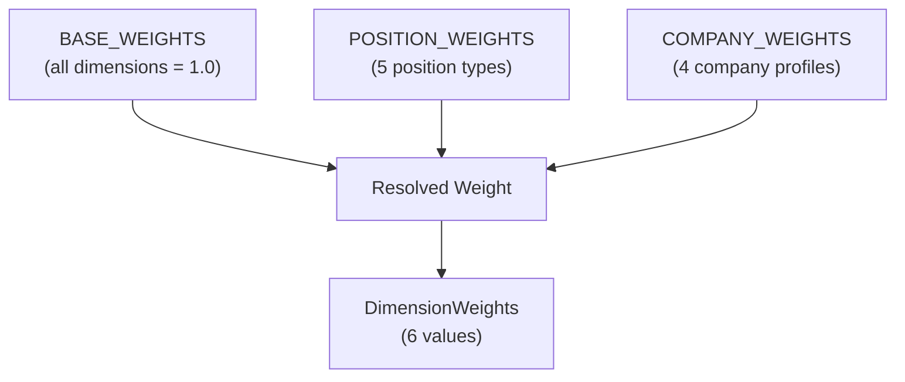
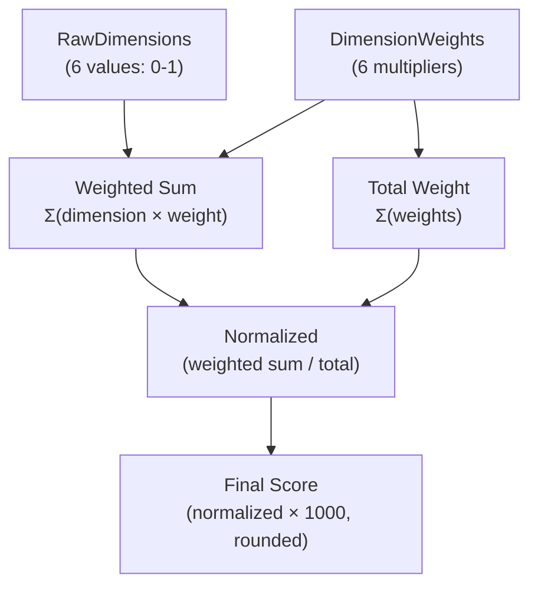
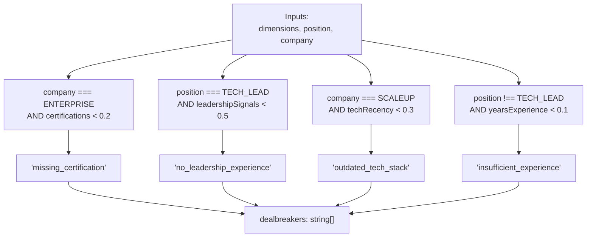
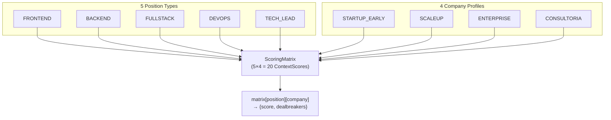
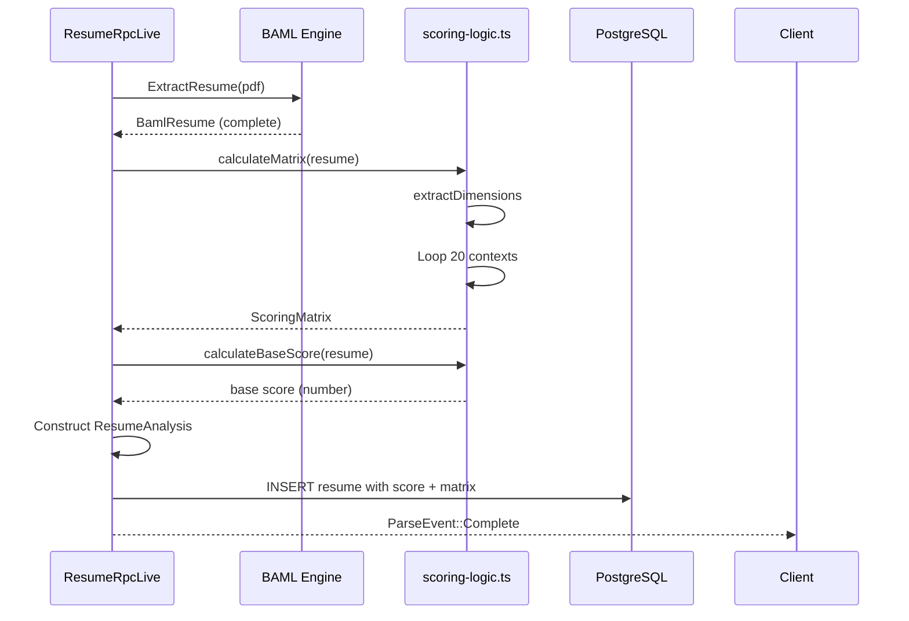

# Scoring Algorithm

> **Relevant source files**
> * [packages/server/src/public/resume/scoring-logic.ts](https://github.com/oscaromsn/TalentScore/blob/428ed1eb/packages/server/src/public/resume/scoring-logic.ts)

## Purpose and Scope

This page documents the deterministic scoring algorithm that evaluates parsed resumes across multiple hiring contexts. The algorithm transforms raw resume data extracted by BAML (see [ExtractResume Function](/oscaromsn/TalentScore/4.3.3-extractresume-function)) into a 5×4 scoring matrix representing combinations of 5 position types and 4 company profiles.

For information about the overall resume processing pipeline, see [Resume Processing Pipeline](/oscaromsn/TalentScore/4.4-resume-processing-pipeline). For details on how scores are stored in the database, see [Resume Repository](/oscaromsn/TalentScore/4.4.3-resume-repository). For information on how scores are displayed in the UI, see [Score Panel and Context Filters](/oscaromsn/TalentScore/5.3.2-score-panel-and-context-filters).

**Sources:** [packages/server/src/public/resume/scoring-logic.ts L1-L265](https://github.com/oscaromsn/TalentScore/blob/428ed1eb/packages/server/src/public/resume/scoring-logic.ts#L1-L265)

---

## Overview

The scoring algorithm operates in four distinct phases:

1. **Dimension Extraction**: Parse resume data into 6 normalized dimensions (0-1 scale)
2. **Weight Resolution**: Combine base, position-specific, and company-specific weights
3. **Score Calculation**: Compute weighted score (0-1000 range) for each context
4. **Dealbreaker Detection**: Identify context-specific disqualifying factors

The algorithm produces a `ScoringMatrix` containing 20 `ContextScore` objects (5 positions × 4 companies), each with a numeric score and array of dealbreaker strings. A "base score" using the FULLSTACK + SCALEUP context is also calculated for quick reference.

**Sources:** [packages/server/src/public/resume/scoring-logic.ts L240-L264](https://github.com/oscaromsn/TalentScore/blob/428ed1eb/packages/server/src/public/resume/scoring-logic.ts#L240-L264)

---

## Scoring Architecture

```

```

**Diagram: Scoring Algorithm Data Flow**

This diagram shows how the `extractDimensions` function transforms BAML resume fields into normalized dimensions, which then flow through context-specific weight resolution and score calculation to produce the final `ScoringMatrix`. The `resolveWeights` function multiplicatively combines three weight layers, while `calculateScore` and `detectDealbreakers` operate in parallel to produce each `ContextScore`.

**Sources:** [packages/server/src/public/resume/scoring-logic.ts L91-L141](https://github.com/oscaromsn/TalentScore/blob/428ed1eb/packages/server/src/public/resume/scoring-logic.ts#L91-L141)

 [packages/server/src/public/resume/scoring-logic.ts L146-L174](https://github.com/oscaromsn/TalentScore/blob/428ed1eb/packages/server/src/public/resume/scoring-logic.ts#L146-L174)

 [packages/server/src/public/resume/scoring-logic.ts L179-L201](https://github.com/oscaromsn/TalentScore/blob/428ed1eb/packages/server/src/public/resume/scoring-logic.ts#L179-L201)

 [packages/server/src/public/resume/scoring-logic.ts L206-L234](https://github.com/oscaromsn/TalentScore/blob/428ed1eb/packages/server/src/public/resume/scoring-logic.ts#L206-L234)

---

## Scoring Dimensions

The algorithm extracts six dimensions from a parsed resume, each normalized to a 0-1 scale. The `RawDimensions` interface defines these values.

### Dimension Definitions

| Dimension | Normalization | Max Value | Data Source |
| --- | --- | --- | --- |
| `yearsExperience` | Total months / 12 / 15 | 15 years = 1.0 | `experiences[]` dates |
| `educationLevel` | Highest completed level rank | Doutorado = 1.0 | `education[]` filtered by status |
| `skillMatch` | Skill count / 20 | 20 skills = 1.0 | `skills[]` length |
| `techRecency` | Recent tech count / 10 | 10 recent techs = 1.0 | `experiences[]` from last 2 years |
| `leadershipSignals` | Binary detection | 1 if detected | `experiences[].title` keyword match |
| `certifications` | Certification count / 5 | 5 certs = 1.0 | `certifications[]` length |

**Sources:** [packages/server/src/public/resume/scoring-logic.ts L49-L56](https://github.com/oscaromsn/TalentScore/blob/428ed1eb/packages/server/src/public/resume/scoring-logic.ts#L49-L56)

### Years of Experience Calculation

The algorithm calculates total months of professional experience by iterating through all `experiences` entries:

```

```

Current positions (`is_current = true`) use the system's current date as the end date. The final value is capped at 1.0 (equivalent to 15+ years of experience).

**Sources:** [packages/server/src/public/resume/scoring-logic.ts L92-L115](https://github.com/oscaromsn/TalentScore/blob/428ed1eb/packages/server/src/public/resume/scoring-logic.ts#L92-L115)

 [packages/server/src/public/resume/scoring-logic.ts L134](https://github.com/oscaromsn/TalentScore/blob/428ed1eb/packages/server/src/public/resume/scoring-logic.ts#L134-L134)

### Education Level Ranking

Education is ranked using the `EDUCATION_RANK` mapping, which assigns numeric values to each `EducationLevel` enum:

| Education Level | Rank Value |
| --- | --- |
| `ENSINO_MEDIO` | 0.3 |
| `TECNOLOGO` | 0.5 |
| `GRADUACAO` | 0.7 |
| `POS_GRADUACAO` | 0.8 |
| `MESTRADO` | 0.9 |
| `DOUTORADO` | 1.0 |

Only education entries with `status === EducationStatus.COMPLETO` are considered. The algorithm takes the maximum rank among all completed degrees.

**Sources:** [packages/server/src/public/resume/scoring-logic.ts L60-L67](https://github.com/oscaromsn/TalentScore/blob/428ed1eb/packages/server/src/public/resume/scoring-logic.ts#L60-L67)

 [packages/server/src/public/resume/scoring-logic.ts L118-L121](https://github.com/oscaromsn/TalentScore/blob/428ed1eb/packages/server/src/public/resume/scoring-logic.ts#L118-L121)

### Technology Recency

The algorithm counts technologies from experiences that are either:

* Currently active (`is_current = true`), or
* Ended within the last 2 years (`end_year >= currentYear - 2`)

Technologies from each qualifying experience are flattened into a single count and normalized with a maximum of 10 technologies.

**Sources:** [packages/server/src/public/resume/scoring-logic.ts L124-L126](https://github.com/oscaromsn/TalentScore/blob/428ed1eb/packages/server/src/public/resume/scoring-logic.ts#L124-L126)

### Leadership Signal Detection

Leadership is detected via keyword matching against experience titles. The `LEADERSHIP_TITLES` array defines the keywords:

```json
["lead", "senior", "principal", "manager", "head", "director", 
 "chief", "vp", "cto", "ceo", "architect"]
```

If any experience title contains any keyword (case-insensitive), `leadershipSignals` is set to 1, otherwise 0.

**Sources:** [packages/server/src/public/resume/scoring-logic.ts L71-L83](https://github.com/oscaromsn/TalentScore/blob/428ed1eb/packages/server/src/public/resume/scoring-logic.ts#L71-L83)

 [packages/server/src/public/resume/scoring-logic.ts L129-L131](https://github.com/oscaromsn/TalentScore/blob/428ed1eb/packages/server/src/public/resume/scoring-logic.ts#L129-L131)

---

## Weight Configuration

The scoring system uses a three-tier weight system that multiplicatively combines to produce final dimension weights for each context.

### Weight Hierarchy



**Diagram: Weight Resolution Hierarchy**

The `resolveWeights` function computes: `finalWeight = baseWeight × positionWeight × companyWeight` for each dimension.

**Sources:** [packages/server/src/public/resume/scoring-logic.ts L23-L30](https://github.com/oscaromsn/TalentScore/blob/428ed1eb/packages/server/src/public/resume/scoring-logic.ts#L23-L30)

 [packages/server/src/public/resume/scoring-logic.ts L146-L174](https://github.com/oscaromsn/TalentScore/blob/428ed1eb/packages/server/src/public/resume/scoring-logic.ts#L146-L174)

### Base Weights

All base weights are initialized to 1.0, providing a neutral baseline:

**Sources:** [packages/server/src/public/resume/scoring-logic.ts L23-L30](https://github.com/oscaromsn/TalentScore/blob/428ed1eb/packages/server/src/public/resume/scoring-logic.ts#L23-L30)

### Position-Specific Weights

The `POSITION_WEIGHTS` mapping defines multipliers for each `PositionType`:

| Position Type | Key Adjustments | Rationale |
| --- | --- | --- |
| `FRONTEND` | `skillMatch: 1.4`, `techRecency: 1.3`, `leadershipSignals: 0.7` | Emphasizes technical skills and modern frameworks |
| `BACKEND` | `skillMatch: 1.3`, `yearsExperience: 1.2`, `certifications: 1.1` | Values experience and technical certifications |
| `FULLSTACK` | `skillMatch: 1.2`, `techRecency: 1.2`, `yearsExperience: 1.1` | Balanced across technical dimensions |
| `DEVOPS` | `certifications: 1.5`, `techRecency: 1.4`, `skillMatch: 1.2` | Strongly emphasizes certifications and modern tools |
| `TECH_LEAD` | `leadershipSignals: 2.0`, `yearsExperience: 1.5`, `skillMatch: 0.9` | Heavily weights leadership and experience |

Unspecified dimensions default to 1.0 (no adjustment).

**Sources:** [packages/server/src/public/resume/scoring-logic.ts L32-L38](https://github.com/oscaromsn/TalentScore/blob/428ed1eb/packages/server/src/public/resume/scoring-logic.ts#L32-L38)

### Company-Specific Weights

The `COMPANY_WEIGHTS` mapping defines multipliers for each `CompanyProfile`:

| Company Profile | Key Adjustments | Rationale |
| --- | --- | --- |
| `STARTUP_EARLY` | `yearsExperience: 0.7`, `educationLevel: 0.5`, `techRecency: 1.3` | De-emphasizes credentials, emphasizes adaptability |
| `SCALEUP` | `techRecency: 1.4`, `skillMatch: 1.3`, `leadershipSignals: 1.1` | Values modern tech and growing leadership needs |
| `ENTERPRISE` | `educationLevel: 1.3`, `certifications: 1.5`, `yearsExperience: 1.2` | Emphasizes formal credentials and experience |
| `CONSULTORIA` | `leadershipSignals: 1.2`, `skillMatch: 1.1`, `educationLevel: 1.1` | Balanced with slight leadership emphasis |

**Sources:** [packages/server/src/public/resume/scoring-logic.ts L40-L45](https://github.com/oscaromsn/TalentScore/blob/428ed1eb/packages/server/src/public/resume/scoring-logic.ts#L40-L45)

### Weight Resolution Example

For a `TECH_LEAD` position at an `ENTERPRISE` company, the `leadershipSignals` dimension weight would be:

```
finalWeight = 1.0 (base) × 2.0 (TECH_LEAD) × 1.0 (ENTERPRISE default) = 2.0
```

While `certifications` would be:

```
finalWeight = 1.0 (base) × 1.0 (TECH_LEAD default) × 1.5 (ENTERPRISE) = 1.5
```

**Sources:** [packages/server/src/public/resume/scoring-logic.ts L146-L174](https://github.com/oscaromsn/TalentScore/blob/428ed1eb/packages/server/src/public/resume/scoring-logic.ts#L146-L174)

---

## Score Calculation

The `calculateScore` function computes the final score (0-1000 range) by taking a weighted sum of dimensions and normalizing by total weight.

### Calculation Formula



**Diagram: Score Calculation Flow**

The algorithm computes:

```
weightedSum = 
  dimensions.yearsExperience × weights.yearsExperience +
  dimensions.educationLevel × weights.educationLevel +
  dimensions.skillMatch × weights.skillMatch +
  dimensions.techRecency × weights.techRecency +
  dimensions.leadershipSignals × weights.leadershipSignals +
  dimensions.certifications × weights.certifications

totalWeight = sum of all 6 weight values

normalized = weightedSum / totalWeight

score = round(normalized × 1000)
```

This normalization ensures scores remain in 0-1000 range regardless of weight magnitudes, and the weighted average prevents any single dimension from dominating.

**Sources:** [packages/server/src/public/resume/scoring-logic.ts L179-L201](https://github.com/oscaromsn/TalentScore/blob/428ed1eb/packages/server/src/public/resume/scoring-logic.ts#L179-L201)

### Practical Example

Consider a resume with dimensions:

* `yearsExperience: 0.6` (9 years)
* `educationLevel: 0.7` (Graduação)
* `skillMatch: 0.5` (10 skills)
* `techRecency: 0.8` (8 recent techs)
* `leadershipSignals: 1` (has leadership title)
* `certifications: 0.4` (2 certs)

For `TECH_LEAD` + `ENTERPRISE`, resolved weights would be:

* `yearsExperience: 1.0 × 1.5 × 1.2 = 1.8`
* `educationLevel: 1.0 × 1.0 × 1.3 = 1.3`
* `skillMatch: 1.0 × 0.9 × 1.0 = 0.9`
* `techRecency: 1.0 × 1.0 × 1.0 = 1.0`
* `leadershipSignals: 1.0 × 2.0 × 1.0 = 2.0`
* `certifications: 1.0 × 1.0 × 1.5 = 1.5`

```
weightedSum = 0.6×1.8 + 0.7×1.3 + 0.5×0.9 + 0.8×1.0 + 1.0×2.0 + 0.4×1.5
            = 1.08 + 0.91 + 0.45 + 0.80 + 2.00 + 0.60
            = 5.84

totalWeight = 1.8 + 1.3 + 0.9 + 1.0 + 2.0 + 1.5 = 8.5

normalized = 5.84 / 8.5 = 0.687

score = round(0.687 × 1000) = 687
```

**Sources:** [packages/server/src/public/resume/scoring-logic.ts L179-L201](https://github.com/oscaromsn/TalentScore/blob/428ed1eb/packages/server/src/public/resume/scoring-logic.ts#L179-L201)

---

## Dealbreaker Detection

The `detectDealbreakers` function identifies context-specific disqualifying factors based on dimension thresholds. Dealbreakers are returned as string identifiers that can be displayed in the UI.

### Dealbreaker Rules



**Diagram: Dealbreaker Detection Logic**

**Sources:** [packages/server/src/public/resume/scoring-logic.ts L206-L234](https://github.com/oscaromsn/TalentScore/blob/428ed1eb/packages/server/src/public/resume/scoring-logic.ts#L206-L234)

### Rule Implementations

| Dealbreaker | Condition | Rationale |
| --- | --- | --- |
| `missing_certification` | `company === "ENTERPRISE"` AND `certifications < 0.2` | Enterprise companies typically require industry certifications |
| `no_leadership_experience` | `position === "TECH_LEAD"` AND `leadershipSignals < 0.5` | Tech Lead roles require demonstrated leadership |
| `outdated_tech_stack` | `company === "SCALEUP"` AND `techRecency < 0.3` | Scale-ups need candidates with modern tech experience |
| `insufficient_experience` | `position !== "TECH_LEAD"` AND `yearsExperience < 0.1` | Most non-lead roles require some professional experience |

Dealbreakers are accumulated into an array and returned alongside the numeric score in each `ContextScore` object. Multiple dealbreakers can apply to a single context.

**Sources:** [packages/server/src/public/resume/scoring-logic.ts L206-L234](https://github.com/oscaromsn/TalentScore/blob/428ed1eb/packages/server/src/public/resume/scoring-logic.ts#L206-L234)

---

## Scoring Matrix Generation

The `calculateMatrix` function orchestrates the complete scoring process, generating all 20 context scores in a single operation.

### Matrix Structure



**Diagram: Scoring Matrix Structure**

The `ScoringMatrix` type is a nested record structure:

```

```

Accessed as: `matrix["TECH_LEAD"]["ENTERPRISE"]` → `{score: 687, dealbreakers: []}`

**Sources:** [packages/server/src/public/resume/scoring-logic.ts L240-L256](https://github.com/oscaromsn/TalentScore/blob/428ed1eb/packages/server/src/public/resume/scoring-logic.ts#L240-L256)

### Matrix Generation Algorithm

```

```

**Diagram: calculateMatrix Sequence**

The function uses nested loops over `POSITION_TYPES` and `COMPANY_PROFILES` arrays (imported from the domain package) to ensure all 20 combinations are computed.

**Sources:** [packages/server/src/public/resume/scoring-logic.ts L240-L256](https://github.com/oscaromsn/TalentScore/blob/428ed1eb/packages/server/src/public/resume/scoring-logic.ts#L240-L256)

 [packages/server/src/public/resume/scoring-logic.ts L8-L9](https://github.com/oscaromsn/TalentScore/blob/428ed1eb/packages/server/src/public/resume/scoring-logic.ts#L8-L9)

### Base Score Calculation

The `calculateBaseScore` function provides a single representative score for quick comparisons:

```

```

This uses the `FULLSTACK` position and `SCALEUP` company context, chosen as a balanced "middle-ground" context that represents typical tech hiring scenarios. This base score is stored in the `resumes.score` database column and used for initial resume ranking in the UI.

**Sources:** [packages/server/src/public/resume/scoring-logic.ts L262-L264](https://github.com/oscaromsn/TalentScore/blob/428ed1eb/packages/server/src/public/resume/scoring-logic.ts#L262-L264)

---

## Integration with Resume Processing

The scoring algorithm is invoked during the resume parsing pipeline, immediately after BAML extraction completes:



**Diagram: Scoring in Resume Pipeline**

The scoring functions are pure and deterministic—given the same `BamlResume` input, they always produce the same output. This ensures scoring is reproducible and can be recomputed if the algorithm is updated.

**Sources:** [packages/server/src/public/resume/scoring-logic.ts L1-L265](https://github.com/oscaromsn/TalentScore/blob/428ed1eb/packages/server/src/public/resume/scoring-logic.ts#L1-L265)

---

## Type Definitions

### DimensionWeights Interface

```

```

Used to represent both weight configurations and resolved final weights for a specific context.

**Sources:** [packages/server/src/public/resume/scoring-logic.ts L14-L21](https://github.com/oscaromsn/TalentScore/blob/428ed1eb/packages/server/src/public/resume/scoring-logic.ts#L14-L21)

### RawDimensions Interface

```

```

Represents the normalized dimensions extracted from a resume. All values are in 0-1 range.

**Sources:** [packages/server/src/public/resume/scoring-logic.ts L49-L56](https://github.com/oscaromsn/TalentScore/blob/428ed1eb/packages/server/src/public/resume/scoring-logic.ts#L49-L56)

### ScoringMatrix and ContextScore

These types are defined in the domain package and represent the output structure:

```

```

**Sources:** [packages/server/src/public/resume/scoring-logic.ts L6-L7](https://github.com/oscaromsn/TalentScore/blob/428ed1eb/packages/server/src/public/resume/scoring-logic.ts#L6-L7)

---

## Algorithm Constants

### Position and Company Arrays

```

```

These arrays define the iteration order for matrix generation and ensure consistent ordering across the system.

**Sources:** [packages/server/src/public/resume/scoring-logic.ts L8-L9](https://github.com/oscaromsn/TalentScore/blob/428ed1eb/packages/server/src/public/resume/scoring-logic.ts#L8-L9)

### Education Rank Mapping

```

```

Maps BAML's `EducationLevel` enum values to numeric ranks for scoring.

**Sources:** [packages/server/src/public/resume/scoring-logic.ts L60-L67](https://github.com/oscaromsn/TalentScore/blob/428ed1eb/packages/server/src/public/resume/scoring-logic.ts#L60-L67)

### Leadership Keywords

```

```

Case-insensitive keywords used for leadership signal detection in experience titles.

**Sources:** [packages/server/src/public/resume/scoring-logic.ts L71-L83](https://github.com/oscaromsn/TalentScore/blob/428ed1eb/packages/server/src/public/resume/scoring-logic.ts#L71-L83)

---

## Performance Characteristics

The scoring algorithm has the following computational properties:

| Operation | Complexity | Notes |
| --- | --- | --- |
| `extractDimensions` | O(E + D + S + C) | E=experiences, D=education, S=skills, C=certifications |
| `resolveWeights` | O(1) | Fixed 6 multiplications per dimension |
| `calculateScore` | O(1) | Fixed 6 weighted sums |
| `detectDealbreakers` | O(1) | Fixed 4 conditional checks |
| `calculateMatrix` | O(20) | Fixed 20 iterations (5 × 4) |

The entire matrix calculation typically completes in <1ms for typical resume sizes (10-50 experiences, 5-20 skills). The algorithm is CPU-bound and requires no I/O operations.

**Sources:** [packages/server/src/public/resume/scoring-logic.ts L91-L256](https://github.com/oscaromsn/TalentScore/blob/428ed1eb/packages/server/src/public/resume/scoring-logic.ts#L91-L256)