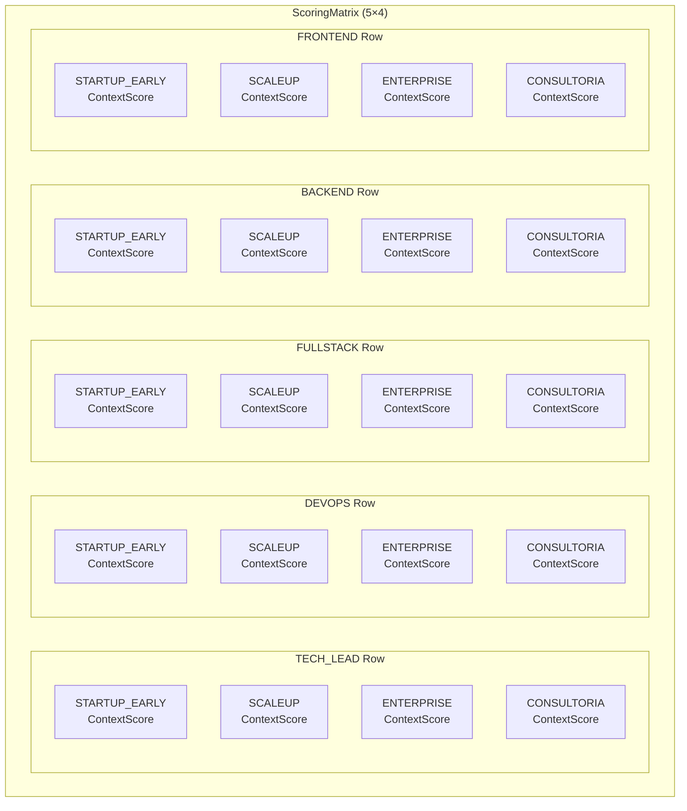
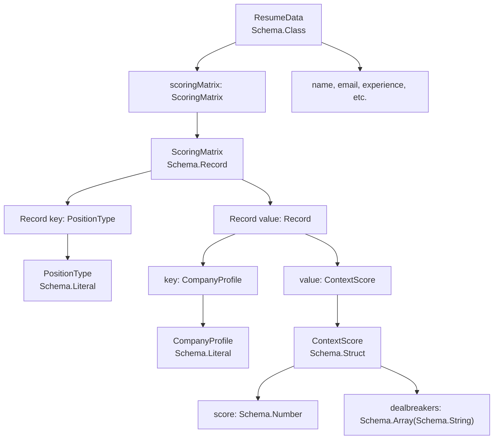
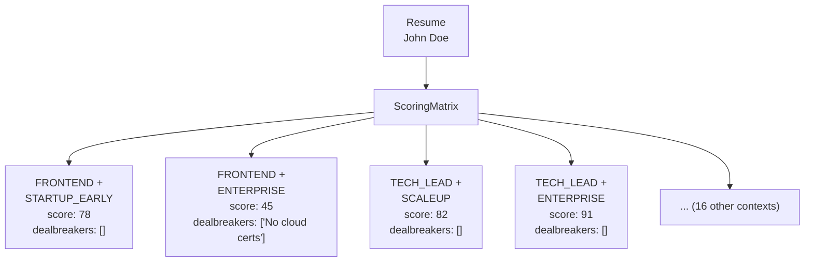

# Scoring Matrix Design

> **Relevant source files**
> * [packages/domain/src/api/resume/index.ts](https://github.com/oscaromsn/TalentScore/blob/428ed1eb/packages/domain/src/api/resume/index.ts)
> * [packages/domain/src/api/resume/resume-rpc.ts](https://github.com/oscaromsn/TalentScore/blob/428ed1eb/packages/domain/src/api/resume/resume-rpc.ts)
> * [packages/domain/src/domain-api.ts](https://github.com/oscaromsn/TalentScore/blob/428ed1eb/packages/domain/src/domain-api.ts)

## Purpose and Scope

This document explains the **Scoring Matrix** data structure defined in the domain package, which enables context-aware resume evaluation. The scoring matrix allows TalentScore to calculate 20 different scores for each resume (5 position types × 4 company profiles), each with context-specific weights and dealbreaker detection.

For the server-side algorithm that populates this matrix, see [Scoring Algorithm](/oscaromsn/TalentScore/4.4.2-scoring-algorithm). For the client UI components that display context-filtered scores, see [Score Panel and Context Filters](/oscaromsn/TalentScore/5.3.2-score-panel-and-context-filters).

---

## Context Dimensions

The scoring system evaluates resumes across two orthogonal dimensions: **position type** (the role being hired for) and **company profile** (the organizational context).

### Position Types

`PositionType` defines five distinct engineering role categories:

| Position Type | Description |
| --- | --- |
| `FRONTEND` | Client-side development roles (React, UI/UX implementation) |
| `BACKEND` | Server-side development roles (APIs, databases, business logic) |
| `FULLSTACK` | Roles requiring both frontend and backend expertise |
| `DEVOPS` | Infrastructure, CI/CD, and operational engineering roles |
| `TECH_LEAD` | Technical leadership roles requiring architecture and mentorship |

The schema is defined as a literal union type:

```
Schema.Literal(
  "FRONTEND",
  "BACKEND",
  "FULLSTACK",
  "DEVOPS",
  "TECH_LEAD"
)
```

**Sources**: [packages/domain/src/api/resume/resume-rpc.ts L9-L15](https://github.com/oscaromsn/TalentScore/blob/428ed1eb/packages/domain/src/api/resume/resume-rpc.ts#L9-L15)

### Company Profiles

`CompanyProfile` defines four organizational contexts, each with different hiring priorities:

| Company Profile | Description |
| --- | --- |
| `STARTUP_EARLY` | Early-stage startups (high risk tolerance, generalist skills valued) |
| `SCALEUP` | Growth-phase companies (process establishment, scalability focus) |
| `ENTERPRISE` | Large organizations (compliance, certifications, established practices) |
| `CONSULTORIA` | Consulting firms (client-facing skills, diverse project experience) |

The schema is defined as:

```
Schema.Literal(
  "STARTUP_EARLY",
  "SCALEUP",
  "ENTERPRISE",
  "CONSULTORIA"
)
```

**Sources**: [packages/domain/src/api/resume/resume-rpc.ts L18-L24](https://github.com/oscaromsn/TalentScore/blob/428ed1eb/packages/domain/src/api/resume/resume-rpc.ts#L18-L24)

---

## Data Structures

### ContextScore

Each context combination produces a `ContextScore` containing:

| Field | Type | Description |
| --- | --- | --- |
| `score` | `number` | Normalized score (0-100) for this specific context |
| `dealbreakers` | `string[]` | List of disqualifying issues for this context |

```javascript
const ContextScore = Schema.Struct({
  score: Schema.Number,
  dealbreakers: Schema.Array(Schema.String),
});
```

**Example dealbreakers by context**:

* **TECH_LEAD + ENTERPRISE**: "No leadership experience", "Missing required certifications"
* **FRONTEND + STARTUP_EARLY**: "No React experience", "Insufficient full-stack exposure"
* **DEVOPS + ENTERPRISE**: "No cloud certifications", "Missing compliance experience"

**Sources**: [packages/domain/src/api/resume/resume-rpc.ts L26-L30](https://github.com/oscaromsn/TalentScore/blob/428ed1eb/packages/domain/src/api/resume/resume-rpc.ts#L26-L30)

### ScoringMatrix

The `ScoringMatrix` is a nested record structure representing a 5×4 matrix:

```javascript
const ScoringMatrix = Schema.Record({
  key: PositionType,
  value: Schema.Record({
    key: CompanyProfile,
    value: ContextScore,
  }),
});
```

This creates a two-level map:

```
ScoringMatrix = {
  [PositionType]: {
    [CompanyProfile]: ContextScore
  }
}
```

**Type signature**:

```
type ScoringMatrix = Record<PositionType, Record<CompanyProfile, ContextScore>>
```

**Sources**: [packages/domain/src/api/resume/resume-rpc.ts L32-L39](https://github.com/oscaromsn/TalentScore/blob/428ed1eb/packages/domain/src/api/resume/resume-rpc.ts#L32-L39)

---

## Matrix Structure

### Visual Representation



Each cell contains a `ContextScore` with:

* **score**: Weighted evaluation for that specific context
* **dealbreakers**: Context-specific disqualifying factors

**Sources**: [packages/domain/src/api/resume/resume-rpc.ts L32-L39](https://github.com/oscaromsn/TalentScore/blob/428ed1eb/packages/domain/src/api/resume/resume-rpc.ts#L32-L39)

### Iteration Constants

The domain package exports constants for iterating over all context combinations:

```javascript
export const POSITION_TYPES: readonly PositionType[] = [
  "FRONTEND",
  "BACKEND",
  "FULLSTACK",
  "DEVOPS",
  "TECH_LEAD",
] as const;

export const COMPANY_PROFILES: readonly CompanyProfile[] = [
  "STARTUP_EARLY",
  "SCALEUP",
  "ENTERPRISE",
  "CONSULTORIA",
] as const;
```

These enable exhaustive iteration when:

1. **Server**: Calculating all 20 scores during resume processing
2. **Client**: Rendering context filter dropdowns in the UI

**Usage pattern**:

```javascript
for (const position of POSITION_TYPES) {
  for (const company of COMPANY_PROFILES) {
    const score = matrix[position][company];
    // Process score
  }
}
```

**Sources**: [packages/domain/src/api/resume/resume-rpc.ts L42-L55](https://github.com/oscaromsn/TalentScore/blob/428ed1eb/packages/domain/src/api/resume/resume-rpc.ts#L42-L55)

---

## Integration with ResumeData

The `ResumeData` schema includes the scoring matrix as a field:

```javascript
export class ResumeData extends Schema.Class<ResumeData>("ResumeData")({
  name: Schema.String,
  email: Schema.NullOr(Schema.String),
  // ... other personal/professional fields
  experience: Schema.Array(Experience),
  education: Schema.Array(Education),
  skills: Schema.Array(Skill),
  languages: Schema.Array(Language),
  certifications: Schema.Array(Certification),
  scoringMatrix: ScoringMatrix,  // ← Context-aware evaluation
}) {}
```

This design means:

* **Every parsed resume includes 20 pre-calculated scores**
* Scores are **persisted in the database** with the resume
* Client UI can **instantly filter** by context without recalculating
* Different users can **view the same resume through different lenses**

**Sources**: [packages/domain/src/api/resume/resume-rpc.ts L109-L123](https://github.com/oscaromsn/TalentScore/blob/428ed1eb/packages/domain/src/api/resume/resume-rpc.ts#L109-L123)

---

## Type Safety and Schema Relationships



The schema hierarchy ensures:

1. **Compile-time type checking**: Invalid position/company combinations rejected by TypeScript
2. **Runtime validation**: Effect Schema validates incoming data against the structure
3. **Exhaustive coverage**: Type system enforces all 20 context combinations exist

**Sources**: [packages/domain/src/api/resume/resume-rpc.ts L9-L39](https://github.com/oscaromsn/TalentScore/blob/428ed1eb/packages/domain/src/api/resume/resume-rpc.ts#L9-L39)

 [packages/domain/src/api/resume/resume-rpc.ts L109-L123](https://github.com/oscaromsn/TalentScore/blob/428ed1eb/packages/domain/src/api/resume/resume-rpc.ts#L109-L123)

---

## Data Flow Example

### Example: Resume with Multiple Contexts



The same resume receives different scores based on context:

* **High score for TECH_LEAD + ENTERPRISE**: Extensive leadership, certifications, established practices
* **Low score for FRONTEND + ENTERPRISE**: Missing specific frontend certifications
* **Medium score for FRONTEND + STARTUP_EARLY**: Solid skills but no dealbreakers for startups

**Sources**: [packages/domain/src/api/resume/resume-rpc.ts L32-L39](https://github.com/oscaromsn/TalentScore/blob/428ed1eb/packages/domain/src/api/resume/resume-rpc.ts#L32-L39)

---

## Usage in System Architecture

### Domain Layer (This Package)

The domain package **defines the contract** but does not implement scoring logic:

```javascript
// Contract definition only
export const ScoringMatrix = Schema.Record({ ... });
export const POSITION_TYPES = [...] as const;
export const COMPANY_PROFILES = [...] as const;
```

**Sources**: [packages/domain/src/api/resume/resume-rpc.ts L32-L55](https://github.com/oscaromsn/TalentScore/blob/428ed1eb/packages/domain/src/api/resume/resume-rpc.ts#L32-L55)

### Server Layer

The server **populates the matrix** during resume processing:

1. Parse resume with BAML → extract structured data
2. Run scoring algorithm → calculate all 20 context scores
3. Construct `ResumeData` with populated `scoringMatrix`
4. Persist to database

See [Scoring Algorithm](/oscaromsn/TalentScore/4.4.2-scoring-algorithm) for implementation details.

### Client Layer

The client **consumes the matrix** for filtering and display:

1. Fetch `ResumeAnalysis` with embedded `scoringMatrix`
2. User selects context via dropdowns (position + company)
3. UI displays `matrix[position][company].score`
4. Dealbreakers shown conditionally

See [Score Panel and Context Filters](/oscaromsn/TalentScore/5.3.2-score-panel-and-context-filters) for UI implementation.

**Sources**: [packages/domain/src/api/resume/resume-rpc.ts L109-L149](https://github.com/oscaromsn/TalentScore/blob/428ed1eb/packages/domain/src/api/resume/resume-rpc.ts#L109-L149)

---

## Export Structure

The domain API merges all RPC contracts, making the scoring types available to both client and server:

```javascript
// packages/domain/src/domain-api.ts
export class DomainRpc extends EventStreamRpc
  .merge(FilesRpc)
  .merge(ResumeRpc) {}
```

The `ResumeRpc` group includes:

* All scoring type exports (`PositionType`, `CompanyProfile`, `ScoringMatrix`)
* Resume data schemas (`ResumeData`, `PartialResumeData`)
* RPC methods (`ParseResumeRpc`, `ListResumesRpc`, `GetResumeRpc`)

Both packages import from `packages/domain`:

```javascript
import { PositionType, CompanyProfile, ScoringMatrix } from "@talentscore/domain";
```

**Sources**: [packages/domain/src/domain-api.ts L1-L5](https://github.com/oscaromsn/TalentScore/blob/428ed1eb/packages/domain/src/domain-api.ts#L1-L5)

 [packages/domain/src/api/resume/index.ts L1-L2](https://github.com/oscaromsn/TalentScore/blob/428ed1eb/packages/domain/src/api/resume/index.ts#L1-L2)

---

## Design Rationale

### Why Pre-Calculate All 20 Scores?

| Approach | Pros | Cons |
| --- | --- | --- |
| **Pre-calculate all contexts** (current) | ✅ Instant filtering✅ Persistent comparison✅ No client-side logic | ❌ Higher storage❌ More computation |
| **Calculate on-demand** | ✅ Lower storage | ❌ Slow filtering❌ Complex client logic |

TalentScore pre-calculates all scores because:

1. **Resume parsing is already expensive** (LLM call + extraction)
2. **Users frequently switch contexts** during evaluation
3. **Matrix enables historical comparison** across hiring contexts
4. **Storage cost is negligible** (20 floats + strings per resume)

### Why Two-Level Record Instead of Array?

```javascript
// Current: Type-safe nested records
matrix["TECH_LEAD"]["ENTERPRISE"].score

// Alternative: Array with search
matrix.find(ctx => ctx.position === "TECH_LEAD" && ctx.company === "ENTERPRISE")?.score
```

The nested record structure provides:

* ✅ **O(1) lookup** instead of O(n) search
* ✅ **Type-safe access** with autocomplete
* ✅ **Guaranteed existence** of all combinations (no undefined checks)
* ✅ **Natural JSON serialization** for API transport

**Sources**: [packages/domain/src/api/resume/resume-rpc.ts L32-L39](https://github.com/oscaromsn/TalentScore/blob/428ed1eb/packages/domain/src/api/resume/resume-rpc.ts#L32-L39)

---

## Summary Table

| Component | Type | Purpose |
| --- | --- | --- |
| `PositionType` | `Schema.Literal` | 5 engineering role categories |
| `CompanyProfile` | `Schema.Literal` | 4 organizational context types |
| `ContextScore` | `Schema.Struct` | Single context evaluation (score + dealbreakers) |
| `ScoringMatrix` | `Schema.Record` | 5×4 nested map of all context scores |
| `POSITION_TYPES` | `readonly array` | Constant for exhaustive iteration |
| `COMPANY_PROFILES` | `readonly array` | Constant for exhaustive iteration |
| `ResumeData.scoringMatrix` | `ScoringMatrix` | Embedded matrix in resume data model |

**Sources**: [packages/domain/src/api/resume/resume-rpc.ts L9-L123](https://github.com/oscaromsn/TalentScore/blob/428ed1eb/packages/domain/src/api/resume/resume-rpc.ts#L9-L123)