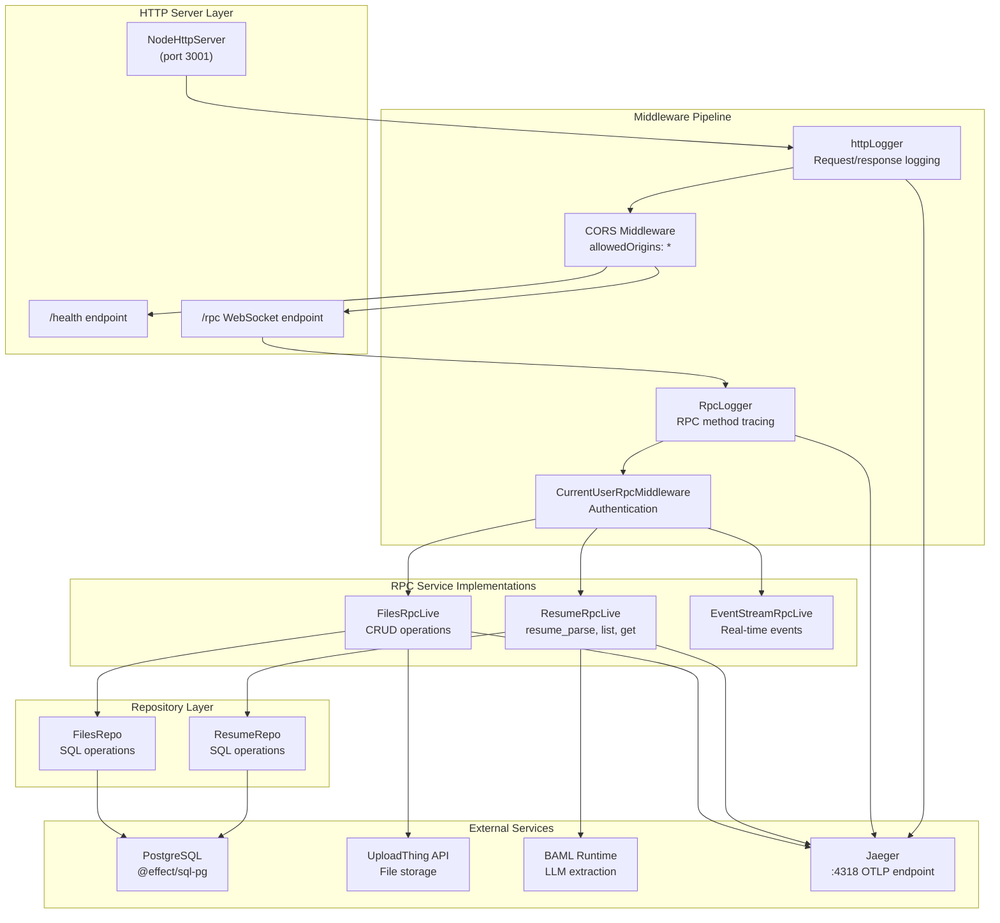
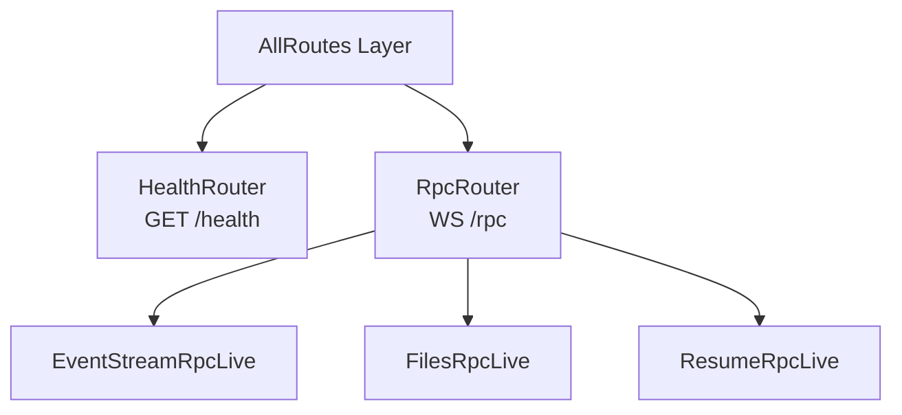
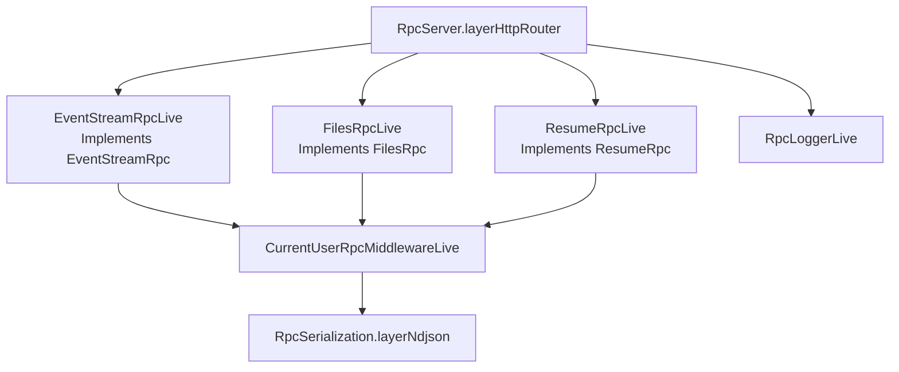

# Server Package

> **Relevant source files**
> * [.gitignore](https://github.com/oscaromsn/TalentScore/blob/428ed1eb/.gitignore)
> * [bun.lock](https://github.com/oscaromsn/TalentScore/blob/428ed1eb/bun.lock)
> * [package.json](https://github.com/oscaromsn/TalentScore/blob/428ed1eb/package.json)
> * [packages/server/package.json](https://github.com/oscaromsn/TalentScore/blob/428ed1eb/packages/server/package.json)
> * [packages/server/src/db/migrations/sql/_schema.sql](https://github.com/oscaromsn/TalentScore/blob/428ed1eb/packages/server/src/db/migrations/sql/_schema.sql)
> * [packages/server/src/server.ts](https://github.com/oscaromsn/TalentScore/blob/428ed1eb/packages/server/src/server.ts)

## Purpose and Scope

The **Server Package** (`@example/server`) is the Node.js backend implementation of the TalentScore system. It provides the HTTP/RPC server that implements the domain contracts defined in the [Domain Package](/oscaromsn/TalentScore/3-domain-package), orchestrates AI-powered resume analysis via BAML, manages file storage through UploadThing, and persists data to PostgreSQL.

This page covers the server architecture, HTTP/RPC configuration, middleware pipeline, and observability setup. For detailed information on specific subsystems:

* Database schema design: [Database Schema](/oscaromsn/TalentScore/4.2-database-schema)
* BAML/LLM integration: [BAML Integration](/oscaromsn/TalentScore/4.3-baml-integration)
* Resume processing implementation: [Resume Processing Pipeline](/oscaromsn/TalentScore/4.4-resume-processing-pipeline)
* File management implementation: [File Management System](/oscaromsn/TalentScore/4.5-file-management-system)

**Sources**: [packages/server/package.json L1-L44](https://github.com/oscaromsn/TalentScore/blob/428ed1eb/packages/server/package.json#L1-L44)

 [packages/server/src/server.ts L1-L164](https://github.com/oscaromsn/TalentScore/blob/428ed1eb/packages/server/src/server.ts#L1-L164)

---

## Package Configuration

### Dependencies and Technology Stack

The server package is built on the **Effect ecosystem** and leverages several specialized libraries:

| Category | Package | Purpose |
| --- | --- | --- |
| **Runtime** | `effect` | Core functional programming runtime |
| **Platform** | `@effect/platform-node` | Node.js-specific platform APIs |
| **RPC** | `@effect/rpc` | Type-safe RPC server with WebSocket support |
| **Database** | `@effect/sql`, `@effect/sql-pg`, `pg` | PostgreSQL client with Effect integration |
| **Observability** | `@effect/opentelemetry` | Distributed tracing via OpenTelemetry |
| **Domain** | `@example/domain` | Shared RPC contracts and schemas |

**Sources**: [packages/server/package.json L22-L36](https://github.com/oscaromsn/TalentScore/blob/428ed1eb/packages/server/package.json#L22-L36)

### Build and Development Scripts

```

```

* **`pnpm dev:server`** (from root): Runs server in watch mode using `tsx` for fast TypeScript execution
* **`pnpm build`** (from root): Compiles TypeScript and resolves path aliases with `tsc-alias`
* **`pnpm db:migrate`**: Applies database migrations to PostgreSQL
* **`pnpm db:reset`**: Drops and recreates database schema (development only)

**Sources**: [packages/server/package.json L11-L20](https://github.com/oscaromsn/TalentScore/blob/428ed1eb/packages/server/package.json#L11-L20)

---

## Server Architecture Overview

The following diagram illustrates the layered architecture of the server package and how requests flow through the system:



**Key Architectural Layers**:

1. **HTTP Server Layer**: Node.js HTTP server with health checks and WebSocket RPC endpoint
2. **Middleware Pipeline**: CORS, logging, authentication, and distributed tracing
3. **RPC Service Implementations**: Domain RPC contract implementations for resume, files, and event streams
4. **Repository Layer**: SQL-based data access abstraction
5. **External Services**: PostgreSQL, UploadThing, BAML, and Jaeger integrations

**Sources**: [packages/server/src/server.ts L1-L164](https://github.com/oscaromsn/TalentScore/blob/428ed1eb/packages/server/src/server.ts#L1-L164)

---

## HTTP and RPC Server Configuration

### HTTP Server Setup

The server uses `NodeHttpServer` from `@effect/platform-node` with the native Node.js `http.createServer`:

```

```

The server binds to **port 3001** and provides two main routes:

* **`GET /health`**: Simple health check returning `"OK"` text response
* **`POST /rpc`**: WebSocket endpoint for RPC communication

**Sources**: [packages/server/src/server.ts L86-L88](https://github.com/oscaromsn/TalentScore/blob/428ed1eb/packages/server/src/server.ts#L86-L88)

 [packages/server/src/server.ts L158](https://github.com/oscaromsn/TalentScore/blob/428ed1eb/packages/server/src/server.ts#L158-L158)

### RPC Server Configuration

The RPC server is configured using `RpcServer.layerHttpRouter` with the following settings:

| Configuration | Value | Description |
| --- | --- | --- |
| **Protocol** | `"websocket"` | WebSocket transport for bidirectional streaming |
| **Path** | `"/rpc"` | HTTP endpoint for WebSocket upgrade |
| **Serialization** | `NDJSON` | Newline-delimited JSON for streaming responses |
| **Span Prefix** | `"rpc"` | OpenTelemetry span naming prefix |
| **Group** | `DomainRpc.middleware(RpcLogger)` | RPC contract group with logging middleware |
| **Defects Handling** | `disableFatalDefects: true` | Non-fatal defect handling for resilience |

**Sources**: [packages/server/src/server.ts L114-L124](https://github.com/oscaromsn/TalentScore/blob/428ed1eb/packages/server/src/server.ts#L114-L124)

### Route Composition

The server composes routes using `HttpLayerRouter`:



**Sources**: [packages/server/src/server.ts L86-L88](https://github.com/oscaromsn/TalentScore/blob/428ed1eb/packages/server/src/server.ts#L86-L88)

 [packages/server/src/server.ts L114-L124](https://github.com/oscaromsn/TalentScore/blob/428ed1eb/packages/server/src/server.ts#L114-L124)

 [packages/server/src/server.ts L126-L135](https://github.com/oscaromsn/TalentScore/blob/428ed1eb/packages/server/src/server.ts#L126-L135)

---

## Middleware Stack

### CORS Configuration

CORS is configured to allow cross-origin requests from any origin with full method support:

```

```

Notable headers:

* **`B3`**: Zipkin-style trace propagation
* **`traceparent`**: W3C Trace Context propagation standard

**Sources**: [packages/server/src/server.ts L128-L133](https://github.com/oscaromsn/TalentScore/blob/428ed1eb/packages/server/src/server.ts#L128-L133)

### HTTP Logging Middleware

The `httpLogger` middleware logs all HTTP requests and responses with the following behavior:

| Scenario | Action |
| --- | --- |
| **404 responses** | Skipped (no log) |
| **Successful responses** | Log with `http.method`, `http.url`, `http.status` |
| **Error responses** | Log error cause with status code |
| **Fiber-disabled logging** | Respect `HttpMiddleware.loggerDisabled` flag |

Each request is wrapped in a log span with a unique counter: `http.span.{counter}`.

**Sources**: [packages/server/src/server.ts L45-L84](https://github.com/oscaromsn/TalentScore/blob/428ed1eb/packages/server/src/server.ts#L45-L84)

### RPC Logging Middleware

The `RpcLogger` is a custom RPC middleware that logs failed RPC requests:

```

```

Logs include:

* **`rpc.method`**: The RPC method tag (e.g., `"resume_parse"`)
* **`rpc.clientId`**: Unique client identifier for the WebSocket connection
* **`cause`**: The Effect Cause for failure analysis

**Sources**: [packages/server/src/server.ts L90-L112](https://github.com/oscaromsn/TalentScore/blob/428ed1eb/packages/server/src/server.ts#L90-L112)

### Authentication Middleware

The `CurrentUserRpcMiddlewareLive` implements authentication for all RPC requests. It is provided at line 122:

```

```

This middleware extracts user identity and makes it available via the `CurrentUser` policy defined in the domain package.

**Sources**: [packages/server/src/server.ts L22](https://github.com/oscaromsn/TalentScore/blob/428ed1eb/packages/server/src/server.ts#L22-L22)

 [packages/server/src/server.ts L122](https://github.com/oscaromsn/TalentScore/blob/428ed1eb/packages/server/src/server.ts#L122-L122)

---

## Service Implementation Layers

The server implements three primary RPC services by providing Effect layers:



Each service implements its corresponding RPC contract from the domain package:

* **`EventStreamRpcLive`**: Broadcasts real-time file and resume events to connected clients
* **`FilesRpcLive`**: Handles file/folder CRUD operations and UploadThing integration
* **`ResumeRpcLive`**: Orchestrates resume parsing, scoring, and storage

For detailed implementation, see:

* [Resume RPC Implementation](/oscaromsn/TalentScore/4.4.1-resume-rpc-implementation)
* [Files Repository](/oscaromsn/TalentScore/4.5.1-files-repository)

**Sources**: [packages/server/src/server.ts L23-L25](https://github.com/oscaromsn/TalentScore/blob/428ed1eb/packages/server/src/server.ts#L23-L25)

 [packages/server/src/server.ts L114-L124](https://github.com/oscaromsn/TalentScore/blob/428ed1eb/packages/server/src/server.ts#L114-L124)

---

## Observability and Tracing

### OpenTelemetry Configuration

The server integrates OpenTelemetry for distributed tracing using the OTLP HTTP exporter:

```

```

**Configuration**:

* **Service Name**: `"effect-files-example-api"`
* **Export Interval**: 1 second for low-latency trace visibility
* **Batch Size**: 100 spans per export
* **Endpoint**: Defaults to `localhost:4318` (Jaeger OTLP endpoint)

**Sources**: [packages/server/src/server.ts L27-L41](https://github.com/oscaromsn/TalentScore/blob/428ed1eb/packages/server/src/server.ts#L27-L41)

### Span Naming Strategy

HTTP spans are named using a custom generator to provide meaningful trace names:

```

```

Example span names:

* `http GET /health`
* `http POST /rpc`
* `rpc resume_parse` (for RPC methods)

**Sources**: [packages/server/src/server.ts L146-L157](https://github.com/oscaromsn/TalentScore/blob/428ed1eb/packages/server/src/server.ts#L146-L157)

### Selective Tracing

The server disables tracing for high-frequency, low-value requests:

```

```

This prevents trace saturation from CORS preflight requests and health checks.

**Sources**: [packages/server/src/server.ts L142-L145](https://github.com/oscaromsn/TalentScore/blob/428ed1eb/packages/server/src/server.ts#L142-L145)

### Logging Configuration

The server uses **Debug** level logging for development:

```

```

All logs include structured fields via `Effect.annotateLogs` for correlation with traces.

**Sources**: [packages/server/src/server.ts L43](https://github.com/oscaromsn/TalentScore/blob/428ed1eb/packages/server/src/server.ts#L43-L43)

---

## Database Schema Overview

The PostgreSQL database schema consists of three primary tables with foreign key relationships:

```css
#mermaid-jm9hj7xobp{font-family:ui-sans-serif,-apple-system,system-ui,Segoe UI,Helvetica;font-size:16px;fill:#ccc;}@keyframes edge-animation-frame{from{stroke-dashoffset:0;}}@keyframes dash{to{stroke-dashoffset:0;}}#mermaid-jm9hj7xobp .edge-animation-slow{stroke-dasharray:9,5!important;stroke-dashoffset:900;animation:dash 50s linear infinite;stroke-linecap:round;}#mermaid-jm9hj7xobp .edge-animation-fast{stroke-dasharray:9,5!important;stroke-dashoffset:900;animation:dash 20s linear infinite;stroke-linecap:round;}#mermaid-jm9hj7xobp .error-icon{fill:#333;}#mermaid-jm9hj7xobp .error-text{fill:#cccccc;stroke:#cccccc;}#mermaid-jm9hj7xobp .edge-thickness-normal{stroke-width:1px;}#mermaid-jm9hj7xobp .edge-thickness-thick{stroke-width:3.5px;}#mermaid-jm9hj7xobp .edge-pattern-solid{stroke-dasharray:0;}#mermaid-jm9hj7xobp .edge-thickness-invisible{stroke-width:0;fill:none;}#mermaid-jm9hj7xobp .edge-pattern-dashed{stroke-dasharray:3;}#mermaid-jm9hj7xobp .edge-pattern-dotted{stroke-dasharray:2;}#mermaid-jm9hj7xobp .marker{fill:#666;stroke:#666;}#mermaid-jm9hj7xobp .marker.cross{stroke:#666;}#mermaid-jm9hj7xobp svg{font-family:ui-sans-serif,-apple-system,system-ui,Segoe UI,Helvetica;font-size:16px;}#mermaid-jm9hj7xobp p{margin:0;}#mermaid-jm9hj7xobp .entityBox{fill:#111;stroke:#222;}#mermaid-jm9hj7xobp .relationshipLabelBox{fill:#333;opacity:0.7;background-color:#333;}#mermaid-jm9hj7xobp .relationshipLabelBox rect{opacity:0.5;}#mermaid-jm9hj7xobp .labelBkg{background-color:rgba(51, 51, 51, 0.5);}#mermaid-jm9hj7xobp .edgeLabel .label{fill:#222;font-size:14px;}#mermaid-jm9hj7xobp .label{font-family:ui-sans-serif,-apple-system,system-ui,Segoe UI,Helvetica;color:#fff;}#mermaid-jm9hj7xobp .edge-pattern-dashed{stroke-dasharray:8,8;}#mermaid-jm9hj7xobp .node rect,#mermaid-jm9hj7xobp .node circle,#mermaid-jm9hj7xobp .node ellipse,#mermaid-jm9hj7xobp .node polygon{fill:#111;stroke:#222;stroke-width:1px;}#mermaid-jm9hj7xobp .relationshipLine{stroke:#666;stroke-width:1;fill:none;}#mermaid-jm9hj7xobp .marker{fill:none!important;stroke:#666!important;stroke-width:1;}#mermaid-jm9hj7xobp :root{--mermaid-font-family:"trebuchet ms",verdana,arial,sans-serif;}folder_id FKfile_id FKfile_foldersuuididPKuuiduser_idtextnametimestamptzcreated_attimestamptzupdated_atfilesuuididPKuuiduser_iduuidfolder_idFKtextuploadthing_keyUKtextuploadthing_urltextnametextsizetextmime_typeuuiduploaded_by_user_idtimestamptzcreated_attimestamptzupdated_atresumesuuididPKuuiduser_iduuidfile_idFKtextfile_namejsonbparsed_dataintegerscoretimestamptzcreated_at
```

### Key Design Features

| Feature | Description |
| --- | --- |
| **Cascading Deletes** | `ON DELETE CASCADE` ensures folder/file deletion cleans up related data |
| **Unique Constraint** | `uploadthing_key` is UNIQUE to prevent duplicate file uploads |
| **Indexing Strategy** | Indexes on `user_id`, `folder_id`, and `uploadthing_key` for query performance |
| **JSONB Storage** | `parsed_data` stores complete resume analysis as structured JSON |
| **Multi-Tenancy** | `user_id` on all tables enables efficient user data isolation |

For detailed schema documentation, see [Database Schema](/oscaromsn/TalentScore/4.2-database-schema).

**Sources**: [packages/server/src/db/migrations/sql/_schema.sql L1-L45](https://github.com/oscaromsn/TalentScore/blob/428ed1eb/packages/server/src/db/migrations/sql/_schema.sql#L1-L45)

---

## Development Workflow

### Running the Server

```

```

### Database Management

```

```

### Environment Variables

The server reads configuration from `.env` file at repository root:

| Variable | Default | Description |
| --- | --- | --- |
| `DATABASE_URL` | - | PostgreSQL connection string (required) |
| `OTLP_URL` | `http://localhost:4318/v1/traces` | Jaeger OTLP endpoint |
| `UPLOADTHING_TOKEN` | - | UploadThing API token (required) |

**Sources**: [packages/server/package.json L17](https://github.com/oscaromsn/TalentScore/blob/428ed1eb/packages/server/package.json#L17-L17)

 [packages/server/src/server.ts L29-L31](https://github.com/oscaromsn/TalentScore/blob/428ed1eb/packages/server/src/server.ts#L29-L31)

---

## Production Build and Deployment

### Build Process

```

```

The build:

1. Compiles TypeScript to `build/esm/` directory
2. Resolves path aliases using `tsc-alias`
3. Generates `.d.ts` type definitions in `build/dts/`

**Entry Point**: `build/esm/server.js`

**Sources**: [packages/server/package.json L15](https://github.com/oscaromsn/TalentScore/blob/428ed1eb/packages/server/package.json#L15-L15)

### Runtime Execution

```

```

The server uses `NodeRuntime.runMain` which:

* Handles graceful shutdown on SIGINT/SIGTERM
* Logs uncaught exceptions and unhandled rejections
* Exits with appropriate status codes on failure

**Sources**: [packages/server/src/server.ts L137-L163](https://github.com/oscaromsn/TalentScore/blob/428ed1eb/packages/server/src/server.ts#L137-L163)

---

## Summary

The Server Package provides a production-ready Node.js backend built on the Effect ecosystem with:

* **Type-safe RPC** over WebSocket using domain contracts
* **Structured logging** with OpenTelemetry distributed tracing
* **Middleware pipeline** for CORS, authentication, and request logging
* **Service layer** implementing resume processing, file management, and event streaming
* **PostgreSQL integration** via Effect SQL with migration support
* **External service orchestration** for UploadThing and BAML/LLM providers

For detailed implementation of specific subsystems, refer to the child pages:

* [HTTP and RPC Server Setup](/oscaromsn/TalentScore/4.1-http-and-rpc-server-setup)
* [Database Schema](/oscaromsn/TalentScore/4.2-database-schema)
* [BAML Integration](/oscaromsn/TalentScore/4.3-baml-integration)
* [Resume Processing Pipeline](/oscaromsn/TalentScore/4.4-resume-processing-pipeline)
* [File Management System](/oscaromsn/TalentScore/4.5-file-management-system)

**Sources**: [packages/server/src/server.ts L1-L164](https://github.com/oscaromsn/TalentScore/blob/428ed1eb/packages/server/src/server.ts#L1-L164)

 [packages/server/package.json L1-L44](https://github.com/oscaromsn/TalentScore/blob/428ed1eb/packages/server/package.json#L1-L44)