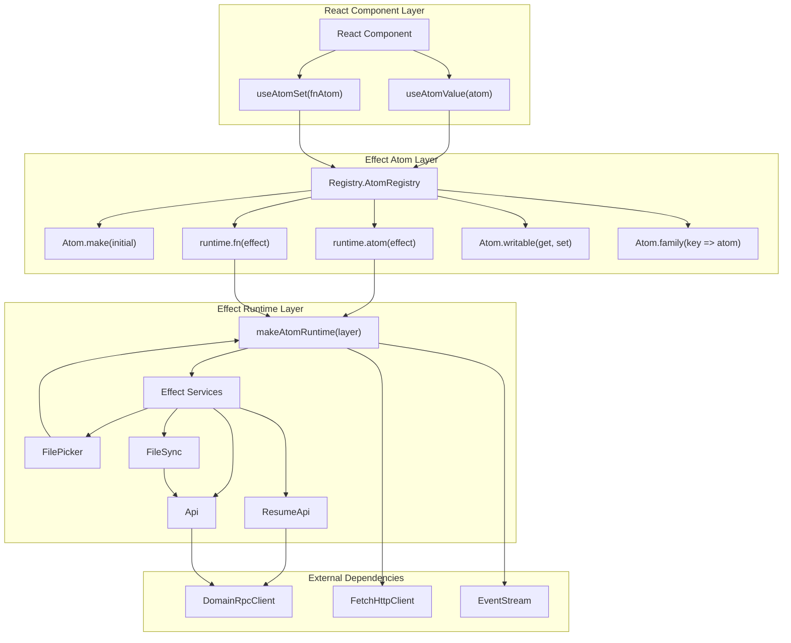
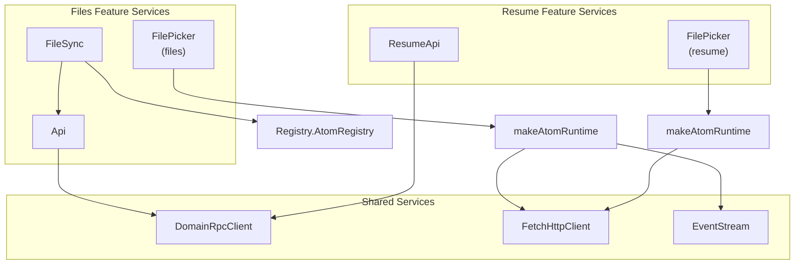
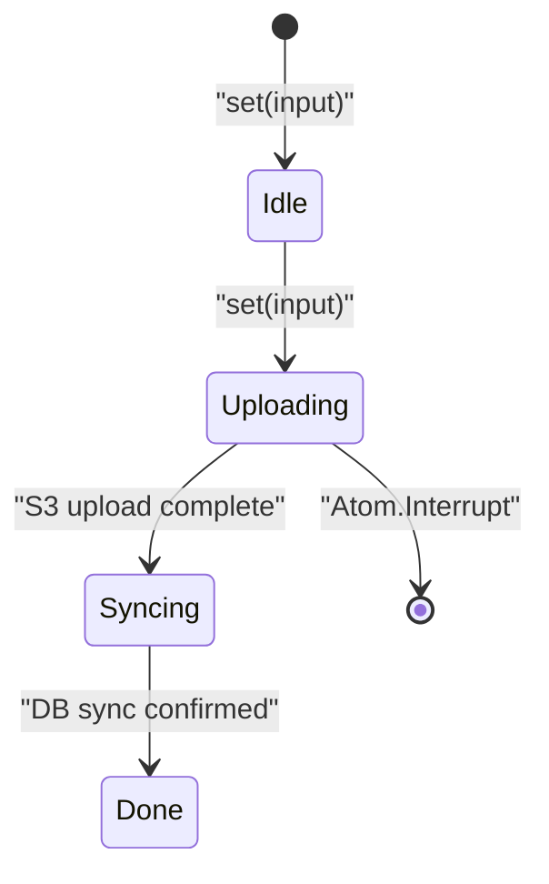
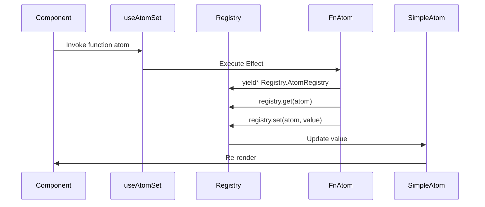
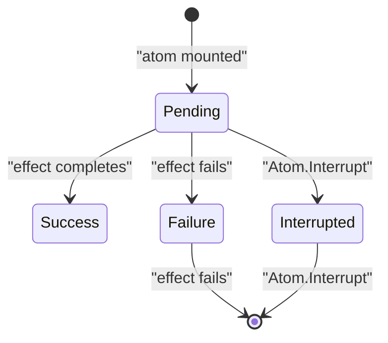

# State Management with Effect Atoms

> **Relevant source files**
> * [packages/client/src/routes/files/-files/file-item/file-item.tsx](https://github.com/oscaromsn/TalentScore/blob/428ed1eb/packages/client/src/routes/files/-files/file-item/file-item.tsx)
> * [packages/client/src/routes/files/-files/file-item/pending-file-item.tsx](https://github.com/oscaromsn/TalentScore/blob/428ed1eb/packages/client/src/routes/files/-files/file-item/pending-file-item.tsx)
> * [packages/client/src/routes/files/-files/files-atoms/files-atoms.test.ts](https://github.com/oscaromsn/TalentScore/blob/428ed1eb/packages/client/src/routes/files/-files/files-atoms/files-atoms.test.ts)
> * [packages/client/src/routes/files/-files/files-atoms/files-atoms.tsx](https://github.com/oscaromsn/TalentScore/blob/428ed1eb/packages/client/src/routes/files/-files/files-atoms/files-atoms.tsx)
> * [packages/client/src/routes/resume/-resume/resume-atoms.ts](https://github.com/oscaromsn/TalentScore/blob/428ed1eb/packages/client/src/routes/resume/-resume/resume-atoms.ts)

## Purpose and Scope

This page documents the Effect Atom architecture used for reactive state management in the TalentScore client application. Effect Atoms bridge the gap between Effect-TS functional programming patterns and React's component model, providing type-safe, composable state management with built-in error handling and async support.

For specific state implementations, see [Resume State Management](/oscaromsn/TalentScore/5.2.1-resume-state-management) and [File State Management](/oscaromsn/TalentScore/5.2.2-file-state-management). For information about RPC communication that atoms consume, see [RPC Contracts](/oscaromsn/TalentScore/3.1-rpc-contracts).

**Sources:** [packages/client/src/routes/resume/-resume/resume-atoms.ts L1-L400](https://github.com/oscaromsn/TalentScore/blob/428ed1eb/packages/client/src/routes/resume/-resume/resume-atoms.ts#L1-L400)

 [packages/client/src/routes/files/-files/files-atoms/files-atoms.tsx L1-L691](https://github.com/oscaromsn/TalentScore/blob/428ed1eb/packages/client/src/routes/files/-files/files-atoms/files-atoms.tsx#L1-L691)

---

## Effect Atom Architecture Overview

Effect Atoms provide a reactive state management layer that integrates Effect-TS's functional programming primitives with React's component lifecycle. The architecture consists of three core layers: the Effect runtime, the atom abstraction, and React hooks.

### Atom Architecture Diagram



**Sources:** [packages/client/src/routes/resume/-resume/resume-atoms.ts L114-L116](https://github.com/oscaromsn/TalentScore/blob/428ed1eb/packages/client/src/routes/resume/-resume/resume-atoms.ts#L114-L116)

 [packages/client/src/routes/files/-files/files-atoms/files-atoms.tsx L209-L217](https://github.com/oscaromsn/TalentScore/blob/428ed1eb/packages/client/src/routes/files/-files/files-atoms/files-atoms.tsx#L209-L217)

---

## Runtime and Service Layer

### Runtime Creation

The Effect Atom runtime bridges Effect's service container with React's component lifecycle. Each feature domain (resume, files) creates a dedicated runtime with its required services.

**Resume Runtime Configuration:**

[packages/client/src/routes/resume/-resume/resume-atoms.ts L114-L116](https://github.com/oscaromsn/TalentScore/blob/428ed1eb/packages/client/src/routes/resume/-resume/resume-atoms.ts#L114-L116)

```

```

**Files Runtime Configuration:**

[packages/client/src/routes/files/-files/files-atoms/files-atoms.tsx L209-L217](https://github.com/oscaromsn/TalentScore/blob/428ed1eb/packages/client/src/routes/files/-files/files-atoms/files-atoms.tsx#L209-L217)

```

```

### Service Dependency Graph



**Sources:** [packages/client/src/routes/resume/-resume/resume-atoms.ts L41-L59](https://github.com/oscaromsn/TalentScore/blob/428ed1eb/packages/client/src/routes/resume/-resume/resume-atoms.ts#L41-L59)

 [packages/client/src/routes/files/-files/files-atoms/files-atoms.tsx L37-L60](https://github.com/oscaromsn/TalentScore/blob/428ed1eb/packages/client/src/routes/files/-files/files-atoms/files-atoms.tsx#L37-L60)

 [packages/client/src/routes/files/-files/files-atoms/files-atoms.tsx L94-L162](https://github.com/oscaromsn/TalentScore/blob/428ed1eb/packages/client/src/routes/files/-files/files-atoms/files-atoms.tsx#L94-L162)

### Effect Service Pattern

Services are defined using `Effect.Service` with scoped or dependency-injected lifecycle management:

**API Service Example:**

[packages/client/src/routes/resume/-resume/resume-atoms.ts L41-L59](https://github.com/oscaromsn/TalentScore/blob/428ed1eb/packages/client/src/routes/resume/-resume/resume-atoms.ts#L41-L59)

```

```

**Scoped Service Example:**

[packages/client/src/routes/resume/-resume/resume-atoms.ts L65-L108](https://github.com/oscaromsn/TalentScore/blob/428ed1eb/packages/client/src/routes/resume/-resume/resume-atoms.ts#L65-L108)

```

```

The `FilePicker` service uses `acquireRelease` to ensure proper cleanup of DOM elements when the service scope ends.

**Sources:** [packages/client/src/routes/resume/-resume/resume-atoms.ts L41-L108](https://github.com/oscaromsn/TalentScore/blob/428ed1eb/packages/client/src/routes/resume/-resume/resume-atoms.ts#L41-L108)

 [packages/client/src/routes/files/-files/files-atoms/files-atoms.tsx L37-L60](https://github.com/oscaromsn/TalentScore/blob/428ed1eb/packages/client/src/routes/files/-files/files-atoms/files-atoms.tsx#L37-L60)

 [packages/client/src/routes/files/-files/files-atoms/files-atoms.tsx L164-L207](https://github.com/oscaromsn/TalentScore/blob/428ed1eb/packages/client/src/routes/files/-files/files-atoms/files-atoms.tsx#L164-L207)

---

## Atom Types and Patterns

### Simple State Atoms

Simple atoms store primitive values or data structures without async operations. Created using `Atom.make<T>(initialValue)`.

**Simple Atom Examples:**

| Atom | Type | Initial Value | Purpose |
| --- | --- | --- | --- |
| `selectedResumeIdAtom` | `ResumeId \| null` | `null` | Tracks currently selected resume |
| `selectedPositionAtom` | `PositionType` | `"FULLSTACK"` | Current position filter |
| `selectedCompanyAtom` | `CompanyProfile` | `"SCALEUP"` | Current company filter |
| `selectedFilesAtom` | `{ folderIds, fileIds }` | `{ [], [] }` | Selected files/folders |
| `activeUploadsAtom` | `ReadonlyArray<ActiveUpload>` | `[]` | Active upload operations |

[packages/client/src/routes/resume/-resume/resume-atoms.ts L133-L142](https://github.com/oscaromsn/TalentScore/blob/428ed1eb/packages/client/src/routes/resume/-resume/resume-atoms.ts#L133-L142)

 [packages/client/src/routes/files/-files/files-atoms/files-atoms.tsx L219-L228](https://github.com/oscaromsn/TalentScore/blob/428ed1eb/packages/client/src/routes/files/-files/files-atoms/files-atoms.tsx#L219-L228)

### Tagged Union State Atoms

Complex state machines use Effect's `Data.taggedEnum` for type-safe state transitions:

**Parsing Phase State Machine:**

[packages/client/src/routes/resume/-resume/resume-atoms.ts L147-L163](https://github.com/oscaromsn/TalentScore/blob/428ed1eb/packages/client/src/routes/resume/-resume/resume-atoms.ts#L147-L163)

```

```

**Upload Phase State Machine:**

[packages/client/src/routes/files/-files/files-atoms/files-atoms.tsx L66-L71](https://github.com/oscaromsn/TalentScore/blob/428ed1eb/packages/client/src/routes/files/-files/files-atoms/files-atoms.tsx#L66-L71)

```

```

**Sources:** [packages/client/src/routes/resume/-resume/resume-atoms.ts L147-L163](https://github.com/oscaromsn/TalentScore/blob/428ed1eb/packages/client/src/routes/resume/-resume/resume-atoms.ts#L147-L163)

 [packages/client/src/routes/resume/-resume/resume-atoms.ts L271-L279](https://github.com/oscaromsn/TalentScore/blob/428ed1eb/packages/client/src/routes/resume/-resume/resume-atoms.ts#L271-L279)

 [packages/client/src/routes/files/-files/files-atoms/files-atoms.tsx L66-L92](https://github.com/oscaromsn/TalentScore/blob/428ed1eb/packages/client/src/routes/files/-files/files-atoms/files-atoms.tsx#L66-L92)

### Runtime Effect Atoms

Runtime atoms execute Effect programs and stream results to React components. Created using `runtime.atom(effect)`.

**Streaming List Atom:**

[packages/client/src/routes/resume/-resume/resume-atoms.ts L122-L127](https://github.com/oscaromsn/TalentScore/blob/428ed1eb/packages/client/src/routes/resume/-resume/resume-atoms.ts#L122-L127)

```

```

**Streaming Aggregation Atom:**

[packages/client/src/routes/files/-files/files-atoms/files-atoms.tsx L466-L483](https://github.com/oscaromsn/TalentScore/blob/428ed1eb/packages/client/src/routes/files/-files/files-atoms/files-atoms.tsx#L466-L483)

```

```

**Sources:** [packages/client/src/routes/resume/-resume/resume-atoms.ts L122-L127](https://github.com/oscaromsn/TalentScore/blob/428ed1eb/packages/client/src/routes/resume/-resume/resume-atoms.ts#L122-L127)

 [packages/client/src/routes/files/-files/files-atoms/files-atoms.tsx L466-L483](https://github.com/oscaromsn/TalentScore/blob/428ed1eb/packages/client/src/routes/files/-files/files-atoms/files-atoms.tsx#L466-L483)

### Function Atoms

Function atoms encapsulate imperative operations with access to the Effect runtime and atom registry. Created using `runtime.fn(Effect.fn(...))`.

**Function Atom Pattern:**

[packages/client/src/routes/resume/-resume/resume-atoms.ts L233-L240](https://github.com/oscaromsn/TalentScore/blob/428ed1eb/packages/client/src/routes/resume/-resume/resume-atoms.ts#L233-L240)

```

```

**Complex Orchestration Function Atom:**

[packages/client/src/routes/resume/-resume/resume-atoms.ts L285-L399](https://github.com/oscaromsn/TalentScore/blob/428ed1eb/packages/client/src/routes/resume/-resume/resume-atoms.ts#L285-L399)

The `uploadAndParseAtom` demonstrates a multi-phase orchestration:

1. Opens file picker dialog
2. Validates PDF file type
3. Uploads to UploadThing S3
4. Polls for database sync
5. Initiates resume parsing stream
6. Updates multiple atoms as events arrive

**Sources:** [packages/client/src/routes/resume/-resume/resume-atoms.ts L233-L249](https://github.com/oscaromsn/TalentScore/blob/428ed1eb/packages/client/src/routes/resume/-resume/resume-atoms.ts#L233-L249)

 [packages/client/src/routes/resume/-resume/resume-atoms.ts L285-L399](https://github.com/oscaromsn/TalentScore/blob/428ed1eb/packages/client/src/routes/resume/-resume/resume-atoms.ts#L285-L399)

 [packages/client/src/routes/files/-files/files-atoms/files-atoms.tsx L317-L346](https://github.com/oscaromsn/TalentScore/blob/428ed1eb/packages/client/src/routes/files/-files/files-atoms/files-atoms.tsx#L317-L346)

### Writable Atoms

Writable atoms define custom read and write behavior, enabling optimistic updates and cache synchronization.

**Writable Atom Structure:**

[packages/client/src/routes/files/-files/files-atoms/files-atoms.tsx L484-L603](https://github.com/oscaromsn/TalentScore/blob/428ed1eb/packages/client/src/routes/files/-files/files-atoms/files-atoms.tsx#L484-L603)

```

```

The write function applies optimistic updates by pattern matching on the `FileCacheUpdate` tagged union and transforming the cached state.

**Sources:** [packages/client/src/routes/files/-files/files-atoms/files-atoms.tsx L466-L603](https://github.com/oscaromsn/TalentScore/blob/428ed1eb/packages/client/src/routes/files/-files/files-atoms/files-atoms.tsx#L466-L603)

### Atom Families

Atom families create parameterized atoms for managing collections of similar state. Each key produces an independent atom instance.

**Upload Atom Family:**

[packages/client/src/routes/files/-files/files-atoms/files-atoms.tsx L309-L311](https://github.com/oscaromsn/TalentScore/blob/428ed1eb/packages/client/src/routes/files/-files/files-atoms/files-atoms.tsx#L309-L311)

```

```

Each `uploadId` creates a separate upload state machine that streams `UploadPhase` transitions:



**Usage Pattern:**

[packages/client/src/routes/files/-files/file-item/pending-file-item.tsx L36-L38](https://github.com/oscaromsn/TalentScore/blob/428ed1eb/packages/client/src/routes/files/-files/file-item/pending-file-item.tsx#L36-L38)

```

```

**Sources:** [packages/client/src/routes/files/-files/files-atoms/files-atoms.tsx L234-L311](https://github.com/oscaromsn/TalentScore/blob/428ed1eb/packages/client/src/routes/files/-files/files-atoms/files-atoms.tsx#L234-L311)

 [packages/client/src/routes/files/-files/file-item/pending-file-item.tsx L35-L38](https://github.com/oscaromsn/TalentScore/blob/428ed1eb/packages/client/src/routes/files/-files/file-item/pending-file-item.tsx#L35-L38)

---

## State Update Flow

### Imperative Update Pattern

Function atoms use the registry to imperatively update atom state within an Effect context:



**Example Implementation:**

[packages/client/src/routes/resume/-resume/resume-atoms.ts L179-L227](https://github.com/oscaromsn/TalentScore/blob/428ed1eb/packages/client/src/routes/resume/-resume/resume-atoms.ts#L179-L227)

```

```

**Sources:** [packages/client/src/routes/resume/-resume/resume-atoms.ts L179-L227](https://github.com/oscaromsn/TalentScore/blob/428ed1eb/packages/client/src/routes/resume/-resume/resume-atoms.ts#L179-L227)

 [packages/client/src/routes/files/-files/files-atoms/files-atoms.tsx L317-L346](https://github.com/oscaromsn/TalentScore/blob/428ed1eb/packages/client/src/routes/files/-files/files-atoms/files-atoms.tsx#L317-L346)

### Optimistic Update Pattern

Writable atoms enable optimistic updates that immediately reflect in the UI before server confirmation:

[packages/client/src/routes/files/-files/files-atoms/files-atoms.tsx L635-L644](https://github.com/oscaromsn/TalentScore/blob/428ed1eb/packages/client/src/routes/files/-files/files-atoms/files-atoms.tsx#L635-L644)

```

```

The `filesAtom` writable atom's set function applies the update immediately:

[packages/client/src/routes/files/-files/files-atoms/files-atoms.tsx L516-L520](https://github.com/oscaromsn/TalentScore/blob/428ed1eb/packages/client/src/routes/files/-files/files-atoms/files-atoms.tsx#L516-L520)

```

```

**Sources:** [packages/client/src/routes/files/-files/files-atoms/files-atoms.tsx L489-L603](https://github.com/oscaromsn/TalentScore/blob/428ed1eb/packages/client/src/routes/files/-files/files-atoms/files-atoms.tsx#L489-L603)

 [packages/client/src/routes/files/-files/files-atoms/files-atoms.tsx L635-L644](https://github.com/oscaromsn/TalentScore/blob/428ed1eb/packages/client/src/routes/files/-files/files-atoms/files-atoms.tsx#L635-L644)

---

## React Component Integration

### Reading Atom State

Components subscribe to atom state using `useAtomValue(atom)`:

[packages/client/src/routes/files/-files/file-item/file-item.tsx L41-L43](https://github.com/oscaromsn/TalentScore/blob/428ed1eb/packages/client/src/routes/files/-files/file-item/file-item.tsx#L41-L43)

```

```

### Handling Result Types

Runtime atoms return `Result<T>` that encapsulates success, failure, and loading states:

[packages/client/src/routes/files/-files/file-item/pending-file-item.tsx L36-L51](https://github.com/oscaromsn/TalentScore/blob/428ed1eb/packages/client/src/routes/files/-files/file-item/pending-file-item.tsx#L36-L51)

```

```

### Result State Diagram



**Sources:** [packages/client/src/routes/files/-files/file-item/pending-file-item.tsx L35-L51](https://github.com/oscaromsn/TalentScore/blob/428ed1eb/packages/client/src/routes/files/-files/file-item/pending-file-item.tsx#L35-L51)

 [packages/client/src/routes/files/-files/file-item/file-item.tsx L40-L43](https://github.com/oscaromsn/TalentScore/blob/428ed1eb/packages/client/src/routes/files/-files/file-item/file-item.tsx#L40-L43)

### Invoking Function Atoms

Function atoms are invoked using `useAtomSet(fnAtom)`:

```

```

Function atoms can be fire-and-forget or return promises for synchronous handling.

**Sources:** [packages/client/src/routes/files/-files/file-item/file-item.tsx L42](https://github.com/oscaromsn/TalentScore/blob/428ed1eb/packages/client/src/routes/files/-files/file-item/file-item.tsx#L42-L42)

 [packages/client/src/routes/files/-files/file-item/file-item.tsx L66](https://github.com/oscaromsn/TalentScore/blob/428ed1eb/packages/client/src/routes/files/-files/file-item/file-item.tsx#L66-L66)

---

## Testing Atoms

### Mock Service Layer Pattern

Tests use `Layer.mock` to provide test implementations of services:

[packages/client/src/routes/files/-files/files-atoms/files-atoms.test.ts L41-L100](https://github.com/oscaromsn/TalentScore/blob/428ed1eb/packages/client/src/routes/files/-files/files-atoms/files-atoms.test.ts#L41-L100)

```

```

### Test Registry Pattern

Tests create a `Registry` with the test layer and mount atoms for observation:

[packages/client/src/routes/files/-files/files-atoms/files-atoms.test.ts L226-L260](https://github.com/oscaromsn/TalentScore/blob/428ed1eb/packages/client/src/routes/files/-files/files-atoms/files-atoms.test.ts#L226-L260)

```

```

### Testing Interruption

Atom interruption is tested by setting `Atom.Interrupt`:

[packages/client/src/routes/files/-files/files-atoms/files-atoms.test.ts L262-L287](https://github.com/oscaromsn/TalentScore/blob/428ed1eb/packages/client/src/routes/files/-files/files-atoms/files-atoms.test.ts#L262-L287)

```

```

**Sources:** [packages/client/src/routes/files/-files/files-atoms/files-atoms.test.ts L23-L395](https://github.com/oscaromsn/TalentScore/blob/428ed1eb/packages/client/src/routes/files/-files/files-atoms/files-atoms.test.ts#L23-L395)

---

## Key Patterns Summary

| Pattern | Atom Type | Use Case | Example |
| --- | --- | --- | --- |
| Simple State | `Atom.make<T>` | UI state, selections | `selectedResumeIdAtom` |
| State Machine | `Atom.make<TaggedEnum>` | Multi-phase operations | `parsingPhaseAtom`, `uploadPhaseAtom` |
| Remote Data | `runtime.atom(effect)` | Async data fetching | `resumeListAtom` |
| Imperative Action | `runtime.fn(effect)` | User actions, mutations | `selectResumeAtom`, `deleteFilesAtom` |
| Optimistic Cache | `Atom.writable(get, set)` | Client-side cache with updates | `filesAtom` |
| Parameterized State | `Atom.family(key => atom)` | Collection management | `uploadAtom(uploadId)` |

**Sources:** [packages/client/src/routes/resume/-resume/resume-atoms.ts L1-L400](https://github.com/oscaromsn/TalentScore/blob/428ed1eb/packages/client/src/routes/resume/-resume/resume-atoms.ts#L1-L400)

 [packages/client/src/routes/files/-files/files-atoms/files-atoms.tsx L1-L691](https://github.com/oscaromsn/TalentScore/blob/428ed1eb/packages/client/src/routes/files/-files/files-atoms/files-atoms.tsx#L1-L691)