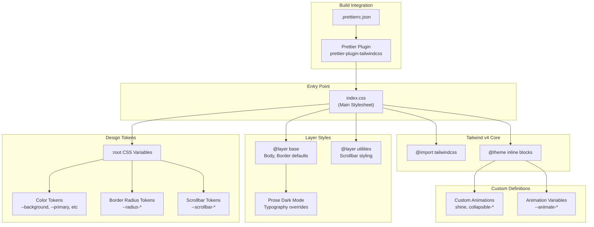
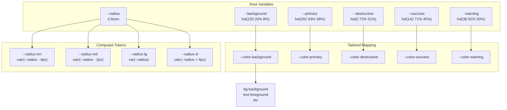
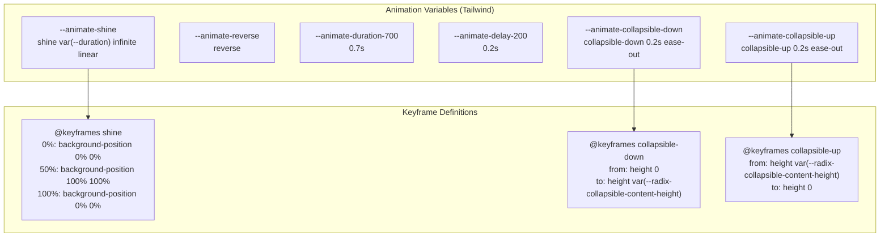
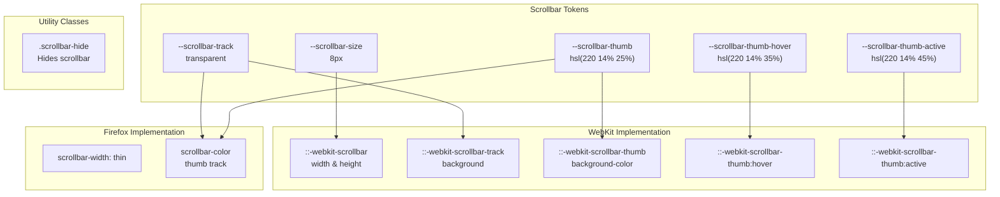

# Styling System

> **Relevant source files**
> * [.prettierrc.json](https://github.com/lucas-barake/effect-file-manager/blob/28eedd82/.prettierrc.json)
> * [packages/client/src/index.css](https://github.com/lucas-barake/effect-file-manager/blob/28eedd82/packages/client/src/index.css)

## Purpose and Scope

This document describes the styling infrastructure of the client application, including the Tailwind CSS v4 setup, CSS variable-based theming system, custom animations, and typography configuration. The styling system provides a consistent dark-mode design with reusable tokens for colors, spacing, and animations.

For information about UI components that use this styling system, see [UI Component Library](/lucas-barake/effect-file-manager/7.1-ui-component-library). For form-specific styled components, see [Form Components](/lucas-barake/effect-file-manager/7.3-form-components).

---

## Styling Architecture

The application uses Tailwind CSS v4 with a CSS variable-based theming approach. All styling is centralized in a single CSS file that defines design tokens, custom animations, and base styles.



**Sources:** [packages/client/src/index.css L1-L251](https://github.com/lucas-barake/effect-file-manager/blob/28eedd82/packages/client/src/index.css#L1-L251)

 [.prettierrc.json L1-L18](https://github.com/lucas-barake/effect-file-manager/blob/28eedd82/.prettierrc.json#L1-L18)

---

## Design Token System

The styling system uses CSS custom properties (variables) as design tokens, providing a centralized theming mechanism. All tokens are defined in the `:root` selector and then mapped to Tailwind-compatible color names.

### CSS Variable Hierarchy



**Sources:** [packages/client/src/index.css L42-L87](https://github.com/lucas-barake/effect-file-manager/blob/28eedd82/packages/client/src/index.css#L42-L87)

 [packages/client/src/index.css L89-L129](https://github.com/lucas-barake/effect-file-manager/blob/28eedd82/packages/client/src/index.css#L89-L129)

### Color Token Categories

The design token system organizes colors into functional categories:

| Category | CSS Variable | HSL Value | Purpose |
| --- | --- | --- | --- |
| **Background Hierarchy** | `--background` | `220 20% 8%` | Primary background |
|  | `--background-secondary` | `220 18% 11%` | Secondary surfaces |
|  | `--background-tertiary` | `220 16% 14%` | Tertiary surfaces |
| **Semantic Colors** | `--primary` | `262 83% 58%` | Primary actions (purple) |
|  | `--destructive` | `0 72% 51%` | Destructive actions (red) |
|  | `--success` | `142 71% 45%` | Success states (green) |
|  | `--warning` | `38 92% 50%` | Warning states (orange) |
| **Interactive States** | `--muted` | `220 14% 18%` | Muted backgrounds |
|  | `--accent` | `220 14% 20%` | Accent backgrounds |
|  | `--border` | `220 14% 20%` | Border colors |
|  | `--ring` | `262 83% 58%` | Focus ring color |
| **Text Variants** | `--destructive-text` | `0 72% 65%` | Destructive text (lighter) |
|  | `--success-text` | `142 69% 58%` | Success text (lighter) |
|  | `--warning-text` | `38 92% 65%` | Warning text (lighter) |

Each base color has a corresponding `-foreground` variant for text that appears on that color. For example, `--primary` (`262 83% 58%`) pairs with `--primary-foreground` (`0 0% 100%`) to ensure readable contrast.

**Sources:** [packages/client/src/index.css L42-L87](https://github.com/lucas-barake/effect-file-manager/blob/28eedd82/packages/client/src/index.css#L42-L87)

### Border Radius System

The radius system uses calculated values based on a single `--radius` variable:

```
--radius: 0.6rem;
--radius-sm: calc(var(--radius) - 4px);  /* ~0.35rem */
--radius-md: calc(var(--radius) - 2px);  /* ~0.475rem */
--radius-lg: var(--radius);               /* 0.6rem */
--radius-xl: calc(var(--radius) + 4px);  /* ~0.85rem */
```

These tokens are mapped to Tailwind's border radius utilities via the `@theme inline` block at [packages/client/src/index.css L125-L128](https://github.com/lucas-barake/effect-file-manager/blob/28eedd82/packages/client/src/index.css#L125-L128)

**Sources:** [packages/client/src/index.css L80](https://github.com/lucas-barake/effect-file-manager/blob/28eedd82/packages/client/src/index.css#L80-L80)

 [packages/client/src/index.css L125-L128](https://github.com/lucas-barake/effect-file-manager/blob/28eedd82/packages/client/src/index.css#L125-L128)

---

## Custom Animations

The styling system defines custom animations for UI interactions, registered in Tailwind's theme configuration.

### Animation Definitions



**Sources:** [packages/client/src/index.css L3-L40](https://github.com/lucas-barake/effect-file-manager/blob/28eedd82/packages/client/src/index.css#L3-L40)

### Shine Animation

The `shine` animation creates a moving gradient effect, useful for skeleton loaders and shimmer effects:

* **Keyframes:** [packages/client/src/index.css L11-L21](https://github.com/lucas-barake/effect-file-manager/blob/28eedd82/packages/client/src/index.css#L11-L21)
* **Variable:** `--animate-shine` at [packages/client/src/index.css L4](https://github.com/lucas-barake/effect-file-manager/blob/28eedd82/packages/client/src/index.css#L4-L4)
* **Usage:** Applied via Tailwind utility class `animate-shine`

The animation moves a background gradient from `0% 0%` to `100% 100%` and back, creating a continuous sweeping effect.

### Collapsible Animations

Two animations support Radix UI's Collapsible component:

1. **collapsible-down:** Expands from height 0 to full content height * **Keyframes:** [packages/client/src/index.css L23-L30](https://github.com/lucas-barake/effect-file-manager/blob/28eedd82/packages/client/src/index.css#L23-L30) * **Variable:** `--animate-collapsible-down` at [packages/client/src/index.css L8](https://github.com/lucas-barake/effect-file-manager/blob/28eedd82/packages/client/src/index.css#L8-L8) * **Duration:** 0.2s with `ease-out` timing
2. **collapsible-up:** Collapses from full height to 0 * **Keyframes:** [packages/client/src/index.css L32-L39](https://github.com/lucas-barake/effect-file-manager/blob/28eedd82/packages/client/src/index.css#L32-L39) * **Variable:** `--animate-collapsible-up` at [packages/client/src/index.css L9](https://github.com/lucas-barake/effect-file-manager/blob/28eedd82/packages/client/src/index.css#L9-L9) * **Duration:** 0.2s with `ease-out` timing

Both animations read the content height from Radix UI's CSS variable `--radix-collapsible-content-height`, ensuring smooth transitions regardless of content size.

**Sources:** [packages/client/src/index.css L3-L40](https://github.com/lucas-barake/effect-file-manager/blob/28eedd82/packages/client/src/index.css#L3-L40)

---

## Base Layer Styles

The `@layer base` block establishes global styling defaults that apply across the entire application.

### Universal Element Defaults

All elements receive consistent border and outline colors via the wildcard selector at [packages/client/src/index.css L132-L134](https://github.com/lucas-barake/effect-file-manager/blob/28eedd82/packages/client/src/index.css#L132-L134)

:

```
* {
  @apply border-border outline-ring/50;
}
```

This ensures:

* All borders use the `--border` color token (`hsl(220 14% 20%)`)
* All focus outlines use the `--ring` color at 50% opacity

### Body Styles

The `body` element sets the default background and text colors at [packages/client/src/index.css L135-L137](https://github.com/lucas-barake/effect-file-manager/blob/28eedd82/packages/client/src/index.css#L135-L137)

:

```
body {
  @apply bg-background text-foreground;
}
```

This applies:

* Background: `--background` (`hsl(220 20% 8%)`)
* Text: `--foreground` (`hsl(210 40% 98%)`)

**Sources:** [packages/client/src/index.css L131-L137](https://github.com/lucas-barake/effect-file-manager/blob/28eedd82/packages/client/src/index.css#L131-L137)

---

## Typography Styles (Prose)

The styling system includes comprehensive dark mode overrides for prose content (rendered markdown or rich text). These styles are defined in the `@layer base` block starting at [packages/client/src/index.css L139-L205](https://github.com/lucas-barake/effect-file-manager/blob/28eedd82/packages/client/src/index.css#L139-L205)

### Prose Style Overrides

All prose elements are forced to use the design token colors, overriding any light-mode defaults from typography plugins:

| Element Type | CSS Selector | Color Variable | Purpose |
| --- | --- | --- | --- |
| Container | `.prose` | `--color-foreground` | Main text color |
| Headings | `.prose h1, h2, h3, h4, h5, h6` | `--color-foreground` | Heading text |
| Paragraphs | `.prose p` | `--color-foreground` | Body text |
| Lists | `.prose ul, ol, li` | `--color-foreground` | List items |
| List Markers | `.prose li::marker` | `--color-foreground` | Bullets/numbers |
| Blockquotes | `.prose blockquote` | `--color-muted-foreground` | Quote text |
| Blockquote Border | `.prose blockquote` | `--color-border` | Left border |
| Inline Code | `.prose code` | `--color-foreground` | Code text |
| Code Background | `.prose code` | `--color-muted` | Code background |
| Code Blocks | `.prose pre` | `--color-foreground` / `--color-muted` | Pre-formatted text |
| Links | `.prose a` | `--color-primary` | Link color |
| Links (hover) | `.prose a:hover` | `--color-primary` | Hover state (80% opacity) |

Each style uses `!important` to ensure it overrides any default styling from typography libraries. The link hover effect at [packages/client/src/index.css L201-L204](https://github.com/lucas-barake/effect-file-manager/blob/28eedd82/packages/client/src/index.css#L201-L204)

 reduces opacity to 0.8 rather than changing color.

**Sources:** [packages/client/src/index.css L139-L205](https://github.com/lucas-barake/effect-file-manager/blob/28eedd82/packages/client/src/index.css#L139-L205)

---

## Scrollbar Customization

The application provides custom scrollbar styling for both Firefox and WebKit-based browsers (Chrome, Edge, Safari).

### Scrollbar Architecture



**Sources:** [packages/client/src/index.css L82-L86](https://github.com/lucas-barake/effect-file-manager/blob/28eedd82/packages/client/src/index.css#L82-L86)

 [packages/client/src/index.css L207-L250](https://github.com/lucas-barake/effect-file-manager/blob/28eedd82/packages/client/src/index.css#L207-L250)

### Scrollbar Tokens

Five CSS variables control scrollbar appearance, defined at [packages/client/src/index.css L82-L86](https://github.com/lucas-barake/effect-file-manager/blob/28eedd82/packages/client/src/index.css#L82-L86)

:

| Token | Value | Purpose |
| --- | --- | --- |
| `--scrollbar-size` | `8px` | Width/height of scrollbar |
| `--scrollbar-track` | `transparent` | Track background (invisible) |
| `--scrollbar-thumb` | `hsl(220 14% 25%)` | Thumb default color |
| `--scrollbar-thumb-hover` | `hsl(220 14% 35%)` | Thumb on hover (lighter) |
| `--scrollbar-thumb-active` | `hsl(220 14% 45%)` | Thumb when dragging (lightest) |

### Firefox Scrollbar Styling

Firefox uses the standard `scrollbar-width` and `scrollbar-color` properties at [packages/client/src/index.css L209-L212](https://github.com/lucas-barake/effect-file-manager/blob/28eedd82/packages/client/src/index.css#L209-L212)

:

```css
* {
  scrollbar-width: thin;
  scrollbar-color: var(--scrollbar-thumb) var(--scrollbar-track);
}
```

### WebKit Scrollbar Styling

WebKit browsers use pseudo-elements for fine-grained control, defined at [packages/client/src/index.css L214-L238](https://github.com/lucas-barake/effect-file-manager/blob/28eedd82/packages/client/src/index.css#L214-L238)

:

* **Size:** Set via `::-webkit-scrollbar` for both axes
* **Track:** Transparent background with rounded corners
* **Thumb:** Rounded corners with 2px transparent border (creates padding effect via `background-clip: content-box`)
* **Interactive States:** Separate hover and active colors

### Scrollbar Hiding Utility

The `.scrollbar-hide` utility class completely hides scrollbars while maintaining scroll functionality, supporting all browsers at [packages/client/src/index.css L240-L249](https://github.com/lucas-barake/effect-file-manager/blob/28eedd82/packages/client/src/index.css#L240-L249)

:

```
.scrollbar-hide::-webkit-scrollbar { display: none; }
.scrollbar-hide { 
  -ms-overflow-style: none;  /* IE/Edge */
  scrollbar-width: none;      /* Firefox */
}
```

**Sources:** [packages/client/src/index.css L207-L250](https://github.com/lucas-barake/effect-file-manager/blob/28eedd82/packages/client/src/index.css#L207-L250)

---

## Prettier Integration

The styling system integrates with Prettier for automatic Tailwind class sorting, ensuring consistent class order across the codebase.

### Configuration

The Prettier configuration at [.prettierrc.json L1-L18](https://github.com/lucas-barake/effect-file-manager/blob/28eedd82/.prettierrc.json#L1-L18)

 includes the Tailwind plugin:

```json
{
  "plugins": ["prettier-plugin-tailwindcss"],
  "tailwindStylesheet": "./packages/client/src/index.css"
}
```

The `tailwindStylesheet` setting points to the main CSS file, allowing the plugin to understand custom design tokens and utility classes when sorting.

### Class Sorting Behavior

The plugin automatically reorders Tailwind utility classes according to Tailwind's recommended order:

1. Layout (display, position, etc.)
2. Spacing (margin, padding, etc.)
3. Sizing (width, height, etc.)
4. Typography
5. Visual (background, border, etc.)
6. Effects (shadow, opacity, etc.)

This ensures consistency when multiple developers work on the same components.

**Sources:** [.prettierrc.json L1-L18](https://github.com/lucas-barake/effect-file-manager/blob/28eedd82/.prettierrc.json#L1-L18)

---

## Summary

The styling system provides a centralized, maintainable approach to theming:

1. **CSS Variables as Tokens:** All colors, spacing, and sizing use CSS custom properties for easy theming
2. **Tailwind v4 Integration:** Modern `@theme inline` blocks register custom animations and design tokens
3. **Dark Mode First:** All styles are optimized for dark mode with light, desaturated colors
4. **Accessibility:** Focus rings, contrast ratios, and semantic colors follow accessibility guidelines
5. **Cross-Browser Support:** Scrollbar styling works in Firefox and WebKit browsers
6. **Automated Formatting:** Prettier ensures consistent class ordering

The system is defined entirely in [packages/client/src/index.css](https://github.com/lucas-barake/effect-file-manager/blob/28eedd82/packages/client/src/index.css)

 making it easy to modify the theme by adjusting CSS variables in the `:root` block.