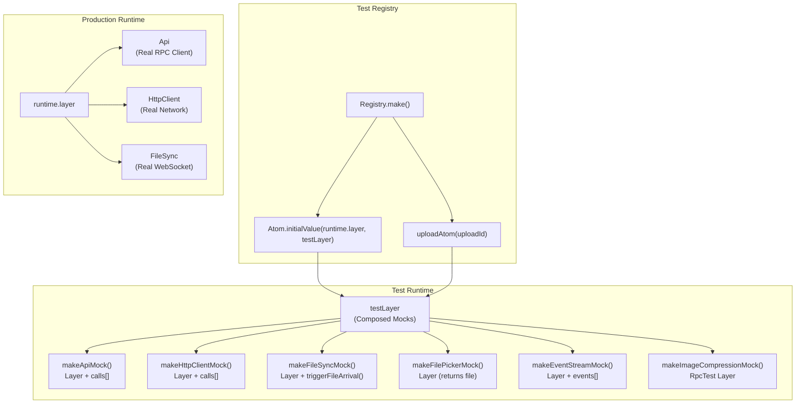
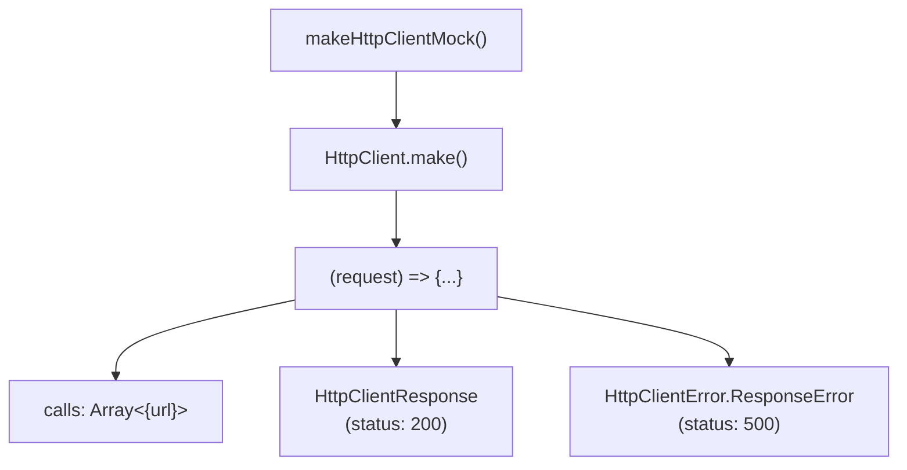
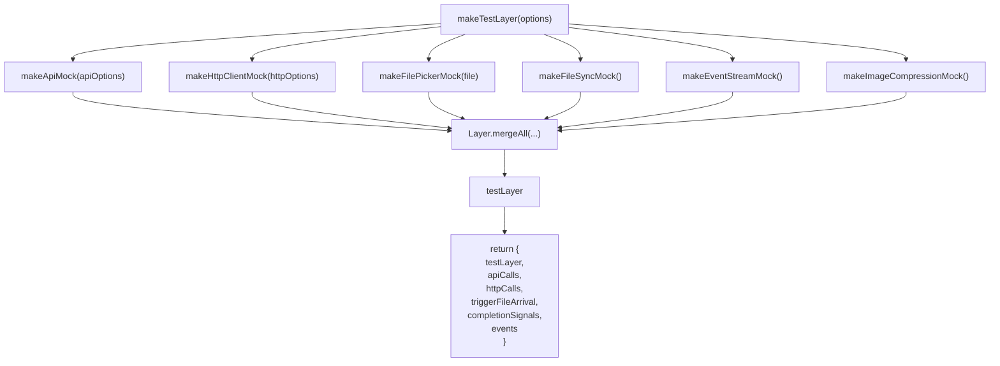
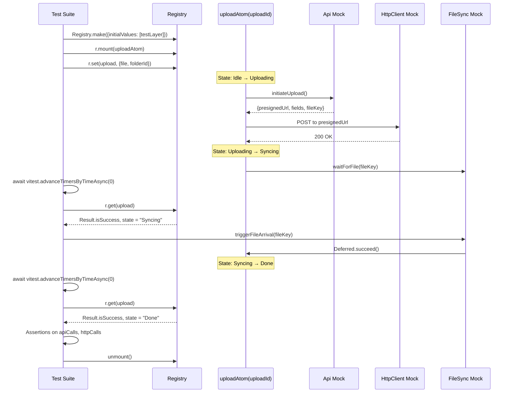
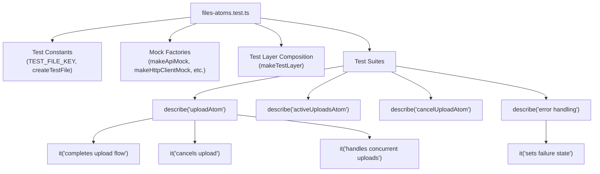

# Testing State Management

> **Relevant source files**
> * [packages/client/src/routes/files/-files/files-atoms/files-atoms.test.ts](https://github.com/lucas-barake/effect-file-manager/blob/28eedd82/packages/client/src/routes/files/-files/files-atoms/files-atoms.test.ts)

## Purpose and Scope

This page documents the testing patterns for Effect Atoms state management, demonstrating how Effect mock layers enable comprehensive, isolated testing of atom-based state logic. The testing approach leverages `Layer.mock()` from Effect-TS to create test doubles of services, allowing atoms to be tested without external dependencies.

For information about the atoms being tested, see [Core Atoms](/lucas-barake/effect-file-manager/5.1-core-atoms). For the runtime functions that orchestrate state changes, see [Runtime Functions](/lucas-barake/effect-file-manager/5.2-runtime-functions).

**Sources:** [packages/client/src/routes/files/-files/files-atoms/files-atoms.test.ts L1-L420](https://github.com/lucas-barake/effect-file-manager/blob/28eedd82/packages/client/src/routes/files/-files/files-atoms/files-atoms.test.ts#L1-L420)

---

## Mock Layer Architecture

The testing strategy uses Effect's dependency injection system to replace real service implementations with controlled mocks. Each service that atoms depend on has a corresponding mock factory that returns both a `Layer` and access to internal state for assertions.

### Mock Layer Pattern



**Mock Layer Composition Pattern**: Each mock factory returns a `Layer` that satisfies a service interface plus observability utilities (call tracking, manual event triggering). The test layer is constructed by merging all mocks using `Layer.mergeAll()`, which then replaces the production `runtime.layer` via `Atom.initialValue()`.

**Sources:** [packages/client/src/routes/files/-files/files-atoms/files-atoms.test.ts L206-L235](https://github.com/lucas-barake/effect-file-manager/blob/28eedd82/packages/client/src/routes/files/-files/files-atoms/files-atoms.test.ts#L206-L235)

---

## Service Mock Factories

### Api Mock Factory

The `makeApiMock()` factory creates a mock implementation of the `Api` service, which handles RPC calls to the server. It tracks all method invocations and allows configuring responses and failures.

| Feature | Implementation | Location |
| --- | --- | --- |
| Call Tracking | `calls: Array<{ method: string; args: unknown }>` | [files-atoms.test.ts L52](https://github.com/lucas-barake/effect-file-manager/blob/28eedd82/files-atoms.test.ts#L52-L52) |
| Mock Creation | `Layer.mock(Api, { ... })` | [files-atoms.test.ts L54](https://github.com/lucas-barake/effect-file-manager/blob/28eedd82/files-atoms.test.ts#L54-L54) |
| initiateUpload | Returns configurable presigned URL response | [files-atoms.test.ts L60-L72](https://github.com/lucas-barake/effect-file-manager/blob/28eedd82/files-atoms.test.ts#L60-L72) |
| Error Simulation | `shouldFail` option triggers `Effect.dieMessage()` | [files-atoms.test.ts L62-L64](https://github.com/lucas-barake/effect-file-manager/blob/28eedd82/files-atoms.test.ts#L62-L64) |
| Default Response | `fileKey: TEST_FILE_KEY` for sync verification | [files-atoms.test.ts L69](https://github.com/lucas-barake/effect-file-manager/blob/28eedd82/files-atoms.test.ts#L69-L69) |

**Example Usage:**

```

```

**Sources:** [packages/client/src/routes/files/-files/files-atoms/files-atoms.test.ts L44-L103](https://github.com/lucas-barake/effect-file-manager/blob/28eedd82/packages/client/src/routes/files/-files/files-atoms/files-atoms.test.ts#L44-L103)

---

### HttpClient Mock Factory

The `makeHttpClientMock()` factory mocks HTTP requests for direct S3 uploads. It captures request URLs and can simulate network failures.



| Property | Purpose |
| --- | --- |
| `calls` array | Records all HTTP request URLs for assertion |
| `shouldFail` option | Simulates network/server errors with 500 status |
| Response type | Returns `HttpClientResponse.fromWeb()` with configurable status |

**Sources:** [packages/client/src/routes/files/-files/files-atoms/files-atoms.test.ts L105-L125](https://github.com/lucas-barake/effect-file-manager/blob/28eedd82/packages/client/src/routes/files/-files/files-atoms/files-atoms.test.ts#L105-L125)

---

### FileSync Mock Factory

The `makeFileSyncMock()` factory provides manual control over file arrival confirmation, which is critical for testing the upload synchronization phase.

```

```

**Architecture:**

* Maintains `completionSignals: Map<string, Deferred<void>>` for pending file arrivals
* `waitForFile()` creates a `Deferred` and blocks until signaled
* `triggerFileArrival()` completes the deferred, unblocking the waiting upload
* `signalFileArrived()` provides synchronous completion for non-Effect contexts

This mock enables deterministic testing of the "Syncing" state without actual WebSocket events or polling delays.

**Sources:** [packages/client/src/routes/files/-files/files-atoms/files-atoms.test.ts L133-L164](https://github.com/lucas-barake/effect-file-manager/blob/28eedd82/packages/client/src/routes/files/-files/files-atoms/files-atoms.test.ts#L133-L164)

---

### FilePicker Mock Factory

The simplest mock, `makeFilePickerMock()` returns a predetermined file (or none) when the file picker is triggered:

```

```

This eliminates browser file picker interactions during tests.

**Sources:** [packages/client/src/routes/files/-files/files-atoms/files-atoms.test.ts L127-L131](https://github.com/lucas-barake/effect-file-manager/blob/28eedd82/packages/client/src/routes/files/-files/files-atoms/files-atoms.test.ts#L127-L131)

---

### EventStream Mock Factory

The `makeEventStreamMock()` tracks published events for verification:

```

```

The mock provides an empty `changes` stream and records all `publish()` calls to the `events` array.

**Sources:** [packages/client/src/routes/files/-files/files-atoms/files-atoms.test.ts L166-L180](https://github.com/lucas-barake/effect-file-manager/blob/28eedd82/packages/client/src/routes/files/-files/files-atoms/files-atoms.test.ts#L166-L180)

---

### ImageCompression Mock Factory

The `makeImageCompressionMock()` uses `RpcTest.makeClient()` from `@effect/rpc` to create a test RPC client that echoes back the input data without actual compression:

```

```

This approach tests the RPC integration without spawning a Web Worker.

**Sources:** [packages/client/src/routes/files/-files/files-atoms/files-atoms.test.ts L182-L200](https://github.com/lucas-barake/effect-file-manager/blob/28eedd82/packages/client/src/routes/files/-files/files-atoms/files-atoms.test.ts#L182-L200)

---

## Test Layer Composition

The `makeTestLayer()` function composes all mocks into a single `testLayer` for use in tests:



**Key Features:**

* Single function call creates complete test environment
* Options parameter allows per-test customization (file content, error modes)
* Returns observability utilities alongside the layer for assertions
* All mocks are compatible and merge cleanly via `Layer.mergeAll()`

**Sources:** [packages/client/src/routes/files/-files/files-atoms/files-atoms.test.ts L206-L235](https://github.com/lucas-barake/effect-file-manager/blob/28eedd82/packages/client/src/routes/files/-files/files-atoms/files-atoms.test.ts#L206-L235)

---

## Registry-Based Testing

Effect Atoms are tested using the `Registry` API from `@effect-atom/atom-react`, which provides an isolated environment for atom state:

### Test Setup Pattern

```

```

| Method | Purpose |
| --- | --- |
| `Registry.make()` | Creates isolated state container |
| `Atom.initialValue()` | Overrides production runtime with test layer |
| `r.mount(atom)` | Subscribes to atom, returns cleanup function |
| `r.get(atom)` | Reads current atom state (returns `Result`) |
| `r.set(atom, value)` | Updates atom state |
| `unmount()` | Cleans up atom subscriptions |

**Sources:** [packages/client/src/routes/files/-files/files-atoms/files-atoms.test.ts L255-L264](https://github.com/lucas-barake/effect-file-manager/blob/28eedd82/packages/client/src/routes/files/-files/files-atoms/files-atoms.test.ts#L255-L264)

---

## Test Execution Flow

### Successful Upload Test



**Sources:** [packages/client/src/routes/files/-files/files-atoms/files-atoms.test.ts L251-L285](https://github.com/lucas-barake/effect-file-manager/blob/28eedd82/packages/client/src/routes/files/-files/files-atoms/files-atoms.test.ts#L251-L285)

---

## Common Test Patterns

### Testing State Transitions

The upload flow verification checks that atoms progress through expected states:

```

```

**Pattern:** Set initial state → advance timers → verify intermediate state → trigger completion → advance timers → verify final state.

**Sources:** [packages/client/src/routes/files/-files/files-atoms/files-atoms.test.ts L263-L279](https://github.com/lucas-barake/effect-file-manager/blob/28eedd82/packages/client/src/routes/files/-files/files-atoms/files-atoms.test.ts#L263-L279)

---

### Testing Interruption/Cancellation

Effect Atoms support cancellation via `Atom.Interrupt`:

```

```

The `Effect.yieldNow()` call ensures the interruption signal propagates through the Effect runtime before checking state.

**Sources:** [packages/client/src/routes/files/-files/files-atoms/files-atoms.test.ts L287-L312](https://github.com/lucas-barake/effect-file-manager/blob/28eedd82/packages/client/src/routes/files/-files/files-atoms/files-atoms.test.ts#L287-L312)

 [files-atoms.test.ts L368-L391](https://github.com/lucas-barake/effect-file-manager/blob/28eedd82/files-atoms.test.ts#L368-L391)

---

### Testing Concurrent Operations

The atom family pattern enables independent state machines per upload:

```

```

This verifies isolation between concurrent upload instances.

**Sources:** [packages/client/src/routes/files/-files/files-atoms/files-atoms.test.ts L314-L357](https://github.com/lucas-barake/effect-file-manager/blob/28eedd82/packages/client/src/routes/files/-files/files-atoms/files-atoms.test.ts#L314-L357)

---

### Testing Error Handling

Mock factories support error injection to verify failure paths:

```

```

The `shouldFail` option causes `initiateUpload()` to return `Effect.dieMessage()`, which propagates as a failure to the atom.

**Sources:** [packages/client/src/routes/files/-files/files-atoms/files-atoms.test.ts L394-L418](https://github.com/lucas-barake/effect-file-manager/blob/28eedd82/packages/client/src/routes/files/-files/files-atoms/files-atoms.test.ts#L394-L418)

---

## Key Testing Utilities

### Vitest Fake Timers

All tests use fake timers to control async progression:

```

```

The `advanceTimersByTimeAsync(0)` call flushes microtasks and promises, allowing Effect computations to complete synchronously in tests.

**Sources:** [packages/client/src/routes/files/-files/files-atoms/files-atoms.test.ts L242-L248](https://github.com/lucas-barake/effect-file-manager/blob/28eedd82/packages/client/src/routes/files/-files/files-atoms/files-atoms.test.ts#L242-L248)

---

### Result Type Assertions

Atom state is wrapped in a `Result` type from `@effect-atom/atom-react`:

| Result Type | Check Method | Meaning |
| --- | --- | --- |
| Success | `Result.isSuccess(result)` | Atom computed successfully |
| Failure | `Result.isFailure(result)` | Effect failed with error |
| Interrupted | `Result.isInterrupted(result)` | Effect was interrupted/cancelled |

Access the success value via:

```

```

**Sources:** [packages/client/src/routes/files/-files/files-atoms/files-atoms.test.ts L268-L279](https://github.com/lucas-barake/effect-file-manager/blob/28eedd82/packages/client/src/routes/files/-files/files-atoms/files-atoms.test.ts#L268-L279)

---

### Effect.runPromise for Side Effects

When tests need to trigger mock behaviors (like file arrival), use `Effect.runPromise()`:

```

```

This executes the Effect immediately in the test context, causing the deferred to complete and unblocking `waitForFile()`.

**Sources:** [packages/client/src/routes/files/-files/files-atoms/files-atoms.test.ts L273](https://github.com/lucas-barake/effect-file-manager/blob/28eedd82/packages/client/src/routes/files/-files/files-atoms/files-atoms.test.ts#L273-L273)

---

## Test File Structure

### Test Organization



### File Sections

| Lines | Section | Purpose |
| --- | --- | --- |
| [1-24](https://github.com/lucas-barake/effect-file-manager/blob/28eedd82/1-24) | Imports | Effect, Vitest, domain types, atoms |
| [26-38](https://github.com/lucas-barake/effect-file-manager/blob/28eedd82/26-38) | Test Constants | `TEST_FILE_KEY`, `createTestFile()` |
| [40-200](https://github.com/lucas-barake/effect-file-manager/blob/28eedd82/40-200) | Mock Factories | One factory per service |
| [202-235](https://github.com/lucas-barake/effect-file-manager/blob/28eedd82/202-235) | Test Layer Composition | `makeTestLayer()` aggregator |
| [237-420](https://github.com/lucas-barake/effect-file-manager/blob/28eedd82/237-420) | Test Suites | Organized by atom/scenario |

**Sources:** [packages/client/src/routes/files/-files/files-atoms/files-atoms.test.ts L1-L420](https://github.com/lucas-barake/effect-file-manager/blob/28eedd82/packages/client/src/routes/files/-files/files-atoms/files-atoms.test.ts#L1-L420)

---

## Summary

The Effect Atoms testing strategy demonstrates several best practices:

1. **Service Isolation**: Every external dependency has a mock factory using `Layer.mock()`
2. **Observability**: Mocks return both layers and inspection utilities (call tracking, event triggers)
3. **Composability**: `Layer.mergeAll()` combines all mocks into a single test environment
4. **Determinism**: Fake timers and manual event triggering eliminate timing races
5. **Type Safety**: Mock implementations satisfy the same service interfaces as production code
6. **Test Independence**: Registry pattern provides isolated state per test
7. **Effect Integration**: Entire test infrastructure uses Effect primitives for consistency

This approach enables comprehensive testing of complex state machines without external dependencies, achieving both high test coverage and fast execution.

**Sources:** [packages/client/src/routes/files/-files/files-atoms/files-atoms.test.ts L1-L420](https://github.com/lucas-barake/effect-file-manager/blob/28eedd82/packages/client/src/routes/files/-files/files-atoms/files-atoms.test.ts#L1-L420)