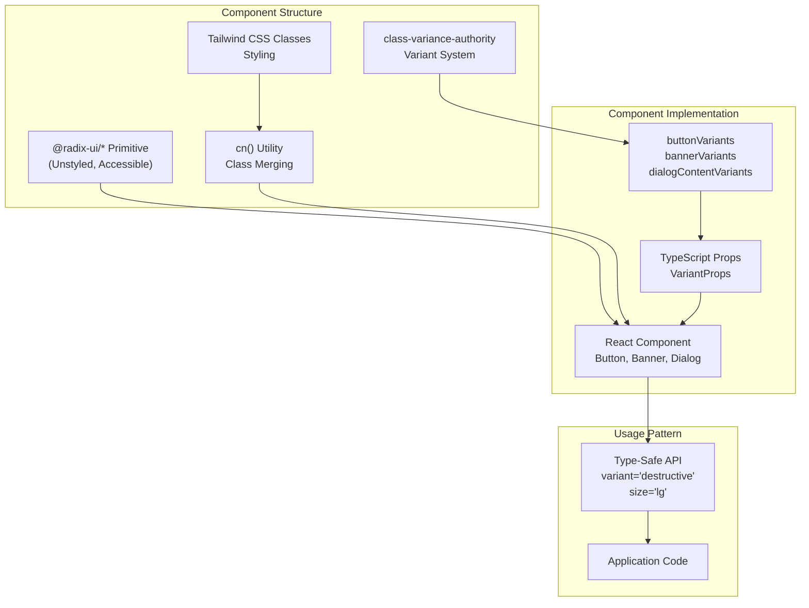
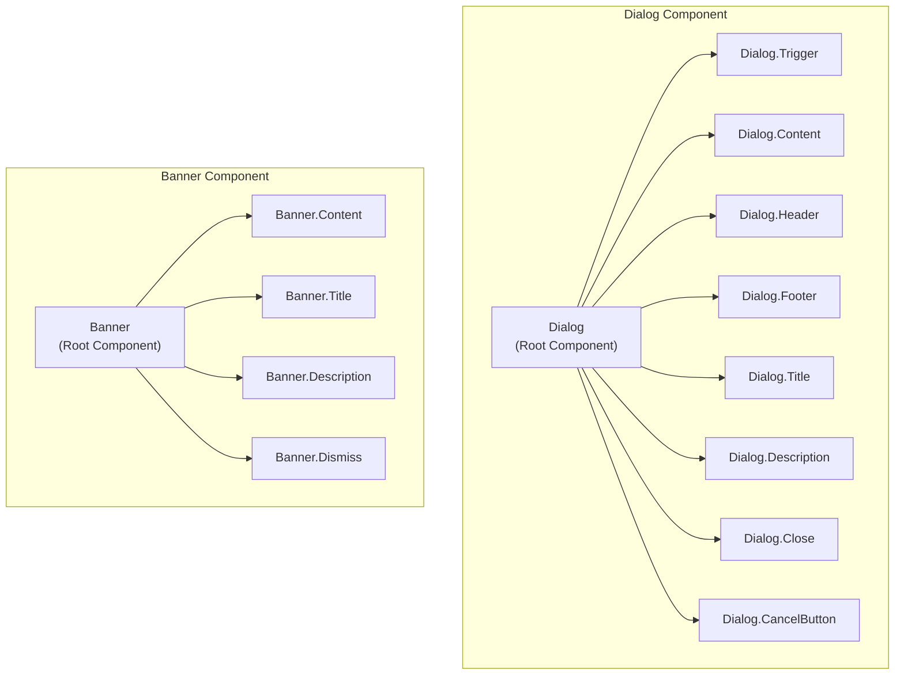
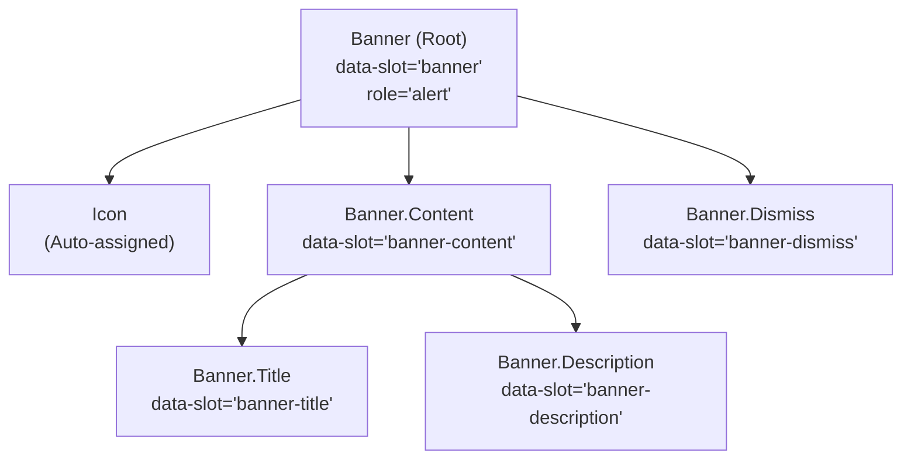
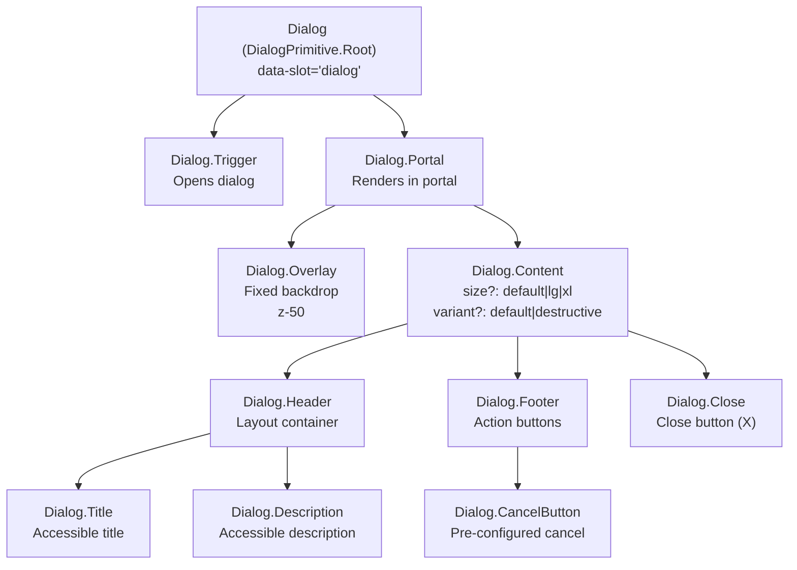
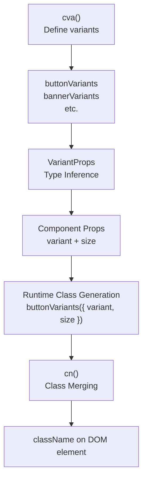
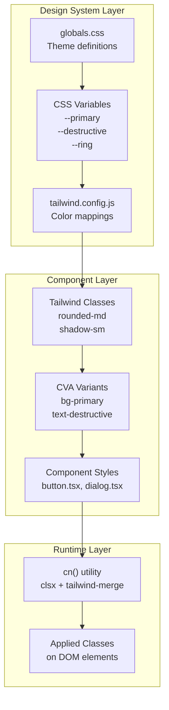

# UI Component Library

> **Relevant source files**
> * [packages/client/src/components/ui/banner.tsx](https://github.com/lucas-barake/effect-file-manager/blob/28eedd82/packages/client/src/components/ui/banner.tsx)
> * [packages/client/src/components/ui/button.tsx](https://github.com/lucas-barake/effect-file-manager/blob/28eedd82/packages/client/src/components/ui/button.tsx)
> * [packages/client/src/components/ui/dialog.tsx](https://github.com/lucas-barake/effect-file-manager/blob/28eedd82/packages/client/src/components/ui/dialog.tsx)
> * [packages/client/src/components/ui/input.tsx](https://github.com/lucas-barake/effect-file-manager/blob/28eedd82/packages/client/src/components/ui/input.tsx)

## Purpose and Scope

This document describes the reusable UI component library built for the Effect File Manager client application. The library provides a set of accessible, styled components built on top of Radix UI primitives with Tailwind CSS styling and type-safe variant management. These components serve as the building blocks for the application's user interface.

For information about the overall styling system, theming, and design tokens, see [Styling System](/lucas-barake/effect-file-manager/7.2-styling-system). For form-specific components like checkboxes, labels, and dropdown menus, see [Form Components](/lucas-barake/effect-file-manager/7.3-form-components).

---

## Component Architecture

The UI component library follows a consistent architectural pattern across all components:



**Diagram: Component Architecture Pattern**

Each component in the library follows this pattern:

1. **Radix UI Foundation**: Unstyled, accessible primitives provide the behavioral foundation
2. **CVA Variant System**: Defines type-safe variants for different visual styles and sizes
3. **Tailwind Styling**: Utility classes applied through the `cn()` utility for class merging
4. **TypeScript Integration**: Full type inference for props and variants

Sources: [packages/client/src/components/ui/button.tsx L1-L72](https://github.com/lucas-barake/effect-file-manager/blob/28eedd82/packages/client/src/components/ui/button.tsx#L1-L72)

 [packages/client/src/components/ui/dialog.tsx L1-L159](https://github.com/lucas-barake/effect-file-manager/blob/28eedd82/packages/client/src/components/ui/dialog.tsx#L1-L159)

 [packages/client/src/components/ui/banner.tsx L1-L110](https://github.com/lucas-barake/effect-file-manager/blob/28eedd82/packages/client/src/components/ui/banner.tsx#L1-L110)

---

## Compound Component Pattern

Several components use the compound component pattern, exposing sub-components through `Object.assign`:



**Diagram: Compound Component Structure**

This pattern enables flexible composition while maintaining a cohesive API. Components are assembled using `Object.assign`:

* [packages/client/src/components/ui/banner.tsx L102-L107](https://github.com/lucas-barake/effect-file-manager/blob/28eedd82/packages/client/src/components/ui/banner.tsx#L102-L107)  - `Banner = Object.assign(BannerRoot, { Content, Title, Description, Dismiss })`
* [packages/client/src/components/ui/dialog.tsx L147-L158](https://github.com/lucas-barake/effect-file-manager/blob/28eedd82/packages/client/src/components/ui/dialog.tsx#L147-L158)  - `Dialog = Object.assign(DialogRoot, { Trigger, Content, Header, ... })`

Sources: [packages/client/src/components/ui/banner.tsx L102-L107](https://github.com/lucas-barake/effect-file-manager/blob/28eedd82/packages/client/src/components/ui/banner.tsx#L102-L107)

 [packages/client/src/components/ui/dialog.tsx L147-L158](https://github.com/lucas-barake/effect-file-manager/blob/28eedd82/packages/client/src/components/ui/dialog.tsx#L147-L158)

---

## Core Components

### Button

The `Button` component provides the primary interactive element with support for multiple variants, sizes, loading states, and polymorphic rendering.

**Variants and Sizes:**

| Variant | Purpose | Visual Style |
| --- | --- | --- |
| `default` | Primary actions | Primary color background with shadow |
| `destructive` | Dangerous actions | Destructive color background |
| `outline` | Secondary actions | Border with transparent background |
| `secondary` | Alternative actions | Secondary color background |
| `ghost` | Subtle actions | No background, hover accent |
| `link` | Navigation | Styled as underlined link |

| Size | Height | Use Case |
| --- | --- | --- |
| `default` | 36px (h-9) | Standard buttons |
| `sm` | 32px (h-8) | Compact layouts |
| `lg` | 40px (h-10) | Prominent actions |
| `icon` | 36x36px (size-9) | Icon-only buttons |

**Key Props:**

* `loading: boolean` - Displays spinner and disables button [packages/client/src/components/ui/button.tsx L47](https://github.com/lucas-barake/effect-file-manager/blob/28eedd82/packages/client/src/components/ui/button.tsx#L47-L47)
* `asChild: boolean` - Uses Radix Slot for polymorphic rendering [packages/client/src/components/ui/button.tsx L43](https://github.com/lucas-barake/effect-file-manager/blob/28eedd82/packages/client/src/components/ui/button.tsx#L43-L43)
* `variant` and `size` - Type-safe variant selection

**Implementation Details:**

The button uses `cva` to define its variants at [packages/client/src/components/ui/button.tsx L7-L32](https://github.com/lucas-barake/effect-file-manager/blob/28eedd82/packages/client/src/components/ui/button.tsx#L7-L32)

 The component includes:

* Automatic spinner icon when `loading={true}` [packages/client/src/components/ui/button.tsx L63](https://github.com/lucas-barake/effect-file-manager/blob/28eedd82/packages/client/src/components/ui/button.tsx#L63-L63)
* Focus ring styling with `focus-visible:ring-4` [packages/client/src/components/ui/button.tsx L8](https://github.com/lucas-barake/effect-file-manager/blob/28eedd82/packages/client/src/components/ui/button.tsx#L8-L8)
* Active state scaling with `active:scale-95` [packages/client/src/components/ui/button.tsx L8](https://github.com/lucas-barake/effect-file-manager/blob/28eedd82/packages/client/src/components/ui/button.tsx#L8-L8)
* SVG icon sizing standardization [packages/client/src/components/ui/button.tsx L8](https://github.com/lucas-barake/effect-file-manager/blob/28eedd82/packages/client/src/components/ui/button.tsx#L8-L8)

Sources: [packages/client/src/components/ui/button.tsx L1-L72](https://github.com/lucas-barake/effect-file-manager/blob/28eedd82/packages/client/src/components/ui/button.tsx#L1-L72)

---

### Banner

The `Banner` component displays contextual notifications and alerts with automatic icon assignment based on variant.

**Component Hierarchy:**



**Diagram: Banner Component Structure**

**Variants and Icons:**

| Variant | Icon | Border/Background | Use Case |
| --- | --- | --- | --- |
| `default` | `InfoIcon` | Gray border/muted background | General information |
| `info` | `InfoIcon` | Primary border/primary background | Important information |
| `success` | `CheckCircleIcon` | Success border/success background | Success messages |
| `warning` | `AlertCircleIcon` | Warning border/warning background | Warnings |
| `destructive` | `AlertCircleIcon` | Destructive border/destructive background | Errors |
| `loading` | `Loader2Icon` (spinning) | Gray border/muted background | Loading states |

The variant-to-icon mapping is defined at [packages/client/src/components/ui/banner.tsx L25-L32](https://github.com/lucas-barake/effect-file-manager/blob/28eedd82/packages/client/src/components/ui/banner.tsx#L25-L32)

 using the `variantIcons` record. Icons are automatically selected based on the variant prop, but can be overridden via the `icon` prop [packages/client/src/components/ui/banner.tsx L36-L37](https://github.com/lucas-barake/effect-file-manager/blob/28eedd82/packages/client/src/components/ui/banner.tsx#L36-L37)

**Styling Features:**

* Semantic color system using CSS variables (e.g., `text-success-text`, `bg-destructive/10`)
* 30% opacity borders and 10% opacity backgrounds for subtle appearance [packages/client/src/components/ui/banner.tsx L10-L14](https://github.com/lucas-barake/effect-file-manager/blob/28eedd82/packages/client/src/components/ui/banner.tsx#L10-L14)
* SVG color inheritance via `[&>svg]:text-primary` pattern
* Accessible `role="alert"` attribute [packages/client/src/components/ui/banner.tsx L51](https://github.com/lucas-barake/effect-file-manager/blob/28eedd82/packages/client/src/components/ui/banner.tsx#L51-L51)

Sources: [packages/client/src/components/ui/banner.tsx L1-L110](https://github.com/lucas-barake/effect-file-manager/blob/28eedd82/packages/client/src/components/ui/banner.tsx#L1-L110)

---

### Dialog

The `Dialog` component provides modal overlays built on `@radix-ui/react-dialog` with support for different sizes and destructive variants.

**Component Graph:**



**Diagram: Dialog Component Composition**

**Content Size Variants:**

The `DialogContent` component supports three size variants defined at [packages/client/src/components/ui/dialog.tsx L40-L59](https://github.com/lucas-barake/effect-file-manager/blob/28eedd82/packages/client/src/components/ui/dialog.tsx#L40-L59)

:

| Size | Max Width | Responsive Behavior |
| --- | --- | --- |
| `default` | `max-w-lg` (32rem) | `max-w-[calc(100%-2rem)]` on mobile |
| `lg` | `max-w-2xl` (42rem) | `max-w-[calc(100%-2rem)]` on mobile |
| `xl` | `max-w-4xl` (56rem) | `max-w-[calc(100%-2rem)]` on mobile |

**Animation System:**

The dialog uses Radix's data attributes for animations:

* Entry: `data-[state=open]:fade-in-0` and `data-[state=open]:zoom-in-95` [packages/client/src/components/ui/dialog.tsx L41](https://github.com/lucas-barake/effect-file-manager/blob/28eedd82/packages/client/src/components/ui/dialog.tsx#L41-L41)
* Exit: `data-[state=closed]:fade-out-0` and `data-[state=closed]:zoom-out-95`
* 200ms transition duration [packages/client/src/components/ui/dialog.tsx L41](https://github.com/lucas-barake/effect-file-manager/blob/28eedd82/packages/client/src/components/ui/dialog.tsx#L41-L41)

**Accessibility Features:**

* Automatic focus management via Radix primitives
* Close button with `sr-only` label [packages/client/src/components/ui/dialog.tsx L80](https://github.com/lucas-barake/effect-file-manager/blob/28eedd82/packages/client/src/components/ui/dialog.tsx#L80-L80)
* Overlay backdrop prevents interaction with page content [packages/client/src/components/ui/dialog.tsx L32](https://github.com/lucas-barake/effect-file-manager/blob/28eedd82/packages/client/src/components/ui/dialog.tsx#L32-L32)
* Maximum height constraint with scrolling: `max-h-[calc(100vh-2rem)] overflow-y-auto` [packages/client/src/components/ui/dialog.tsx L41](https://github.com/lucas-barake/effect-file-manager/blob/28eedd82/packages/client/src/components/ui/dialog.tsx#L41-L41)

**Pre-configured Components:**

The `Dialog.CancelButton` provides a common pattern at [packages/client/src/components/ui/dialog.tsx L133-L145](https://github.com/lucas-barake/effect-file-manager/blob/28eedd82/packages/client/src/components/ui/dialog.tsx#L133-L145)

:

* Automatically triggers dialog close via `DialogTrigger asChild`
* Uses `secondary` variant
* Default "Cancel" text (overridable)

Sources: [packages/client/src/components/ui/dialog.tsx L1-L159](https://github.com/lucas-barake/effect-file-manager/blob/28eedd82/packages/client/src/components/ui/dialog.tsx#L1-L159)

---

### Input

The `Input` component provides styled text input fields with consistent styling across the application.

**Styling Features:**

The input styling is defined at [packages/client/src/components/ui/input.tsx L5-L7](https://github.com/lucas-barake/effect-file-manager/blob/28eedd82/packages/client/src/components/ui/input.tsx#L5-L7)

 and includes:

* **Focus States**: Ring appearance on focus with `focus-visible:ring-1 focus-visible:ring-ring`
* **Text Selection**: Primary-colored selection with `selection:bg-primary selection:text-primary-foreground`
* **File Input Styling**: Custom styling for file inputs with `file:inline-flex file:h-7 file:text-sm`
* **Disabled State**: Opacity reduction and cursor prevention with `disabled:opacity-50 disabled:pointer-events-none`
* **Responsive Typography**: Base text on desktop, small text on mobile with `md:text-sm`

**Shadow and Border System:**

* Default shadow: `shadow-sm` for subtle depth
* Border color: `border-input` using design token
* Transparent background: `bg-transparent` to inherit from parent context

The component uses the same `inputVariants` pattern as other components, exposing the CVA function as a static property at [packages/client/src/components/ui/input.tsx L9-L21](https://github.com/lucas-barake/effect-file-manager/blob/28eedd82/packages/client/src/components/ui/input.tsx#L9-L21)

Sources: [packages/client/src/components/ui/input.tsx L1-L24](https://github.com/lucas-barake/effect-file-manager/blob/28eedd82/packages/client/src/components/ui/input.tsx#L1-L24)

---

## Variant System with CVA

All components use `class-variance-authority` (CVA) for type-safe variant management:



**Diagram: CVA Variant System Flow**

**Pattern Implementation:**

Each component exports both the component and its variants function:

```

```

This pattern is used in:

* [packages/client/src/components/ui/button.tsx L40-L69](https://github.com/lucas-barake/effect-file-manager/blob/28eedd82/packages/client/src/components/ui/button.tsx#L40-L69)
* [packages/client/src/components/ui/input.tsx L9-L21](https://github.com/lucas-barake/effect-file-manager/blob/28eedd82/packages/client/src/components/ui/input.tsx#L9-L21)

The exported `variants` function enables external consumers to generate class names programmatically if needed, while maintaining type safety through `VariantProps<typeof buttonVariants>`.

Sources: [packages/client/src/components/ui/button.tsx L40-L69](https://github.com/lucas-barake/effect-file-manager/blob/28eedd82/packages/client/src/components/ui/button.tsx#L40-L69)

 [packages/client/src/components/ui/banner.tsx L6-L21](https://github.com/lucas-barake/effect-file-manager/blob/28eedd82/packages/client/src/components/ui/banner.tsx#L6-L21)

 [packages/client/src/components/ui/dialog.tsx L40-L59](https://github.com/lucas-barake/effect-file-manager/blob/28eedd82/packages/client/src/components/ui/dialog.tsx#L40-L59)

---

## Data Slot Pattern

All components use the `data-slot` attribute for consistent identification and styling hooks:

| Component | Data Slot Value | Purpose |
| --- | --- | --- |
| `Button` | `data-slot="button"` | Root button element |
| `Banner` | `data-slot="banner"` | Root banner container |
| `Banner.Content` | `data-slot="banner-content"` | Content wrapper |
| `Banner.Title` | `data-slot="banner-title"` | Title element |
| `Dialog` | `data-slot="dialog"` | Root dialog container |
| `Dialog.Content` | `data-slot="dialog-content"` | Modal content container |
| `Input` | `data-slot="input"` | Input element |

This pattern enables:

* CSS targeting via `[data-slot="button"]` selectors
* Testing queries via `screen.getByRole('button', { name: /.../ })`
* Programmatic component identification

Examples:

* [packages/client/src/components/ui/button.tsx L58](https://github.com/lucas-barake/effect-file-manager/blob/28eedd82/packages/client/src/components/ui/button.tsx#L58-L58)
* [packages/client/src/components/ui/banner.tsx L50](https://github.com/lucas-barake/effect-file-manager/blob/28eedd82/packages/client/src/components/ui/banner.tsx#L50-L50)
* [packages/client/src/components/ui/dialog.tsx L9](https://github.com/lucas-barake/effect-file-manager/blob/28eedd82/packages/client/src/components/ui/dialog.tsx#L9-L9)

Sources: [packages/client/src/components/ui/button.tsx L58](https://github.com/lucas-barake/effect-file-manager/blob/28eedd82/packages/client/src/components/ui/button.tsx#L58-L58)

 [packages/client/src/components/ui/banner.tsx L50-L73](https://github.com/lucas-barake/effect-file-manager/blob/28eedd82/packages/client/src/components/ui/banner.tsx#L50-L73)

 [packages/client/src/components/ui/dialog.tsx L9-L158](https://github.com/lucas-barake/effect-file-manager/blob/28eedd82/packages/client/src/components/ui/dialog.tsx#L9-L158)

---

## Integration with Application Styles

The components integrate seamlessly with the application's styling system:



**Diagram: Styling System Integration**

The components reference semantic color tokens like:

* `bg-primary` / `text-primary-foreground` [packages/client/src/components/ui/button.tsx L12](https://github.com/lucas-barake/effect-file-manager/blob/28eedd82/packages/client/src/components/ui/button.tsx#L12-L12)
* `bg-destructive` / `text-destructive-foreground` [packages/client/src/components/ui/button.tsx L13](https://github.com/lucas-barake/effect-file-manager/blob/28eedd82/packages/client/src/components/ui/button.tsx#L13-L13)
* `border-border` / `bg-muted` [packages/client/src/components/ui/banner.tsx L9](https://github.com/lucas-barake/effect-file-manager/blob/28eedd82/packages/client/src/components/ui/banner.tsx#L9-L9)

These tokens are resolved through the Tailwind configuration to CSS variables defined in the styling system (see [Styling System](/lucas-barake/effect-file-manager/7.2-styling-system) for details on theme configuration).

Sources: [packages/client/src/components/ui/button.tsx L7-L32](https://github.com/lucas-barake/effect-file-manager/blob/28eedd82/packages/client/src/components/ui/button.tsx#L7-L32)

 [packages/client/src/components/ui/banner.tsx L6-L21](https://github.com/lucas-barake/effect-file-manager/blob/28eedd82/packages/client/src/components/ui/banner.tsx#L6-L21)

---

## Accessibility Features

The component library maintains WCAG compliance through several mechanisms:

**Radix UI Foundation:**

* Keyboard navigation support (Tab, Enter, Escape)
* ARIA attributes automatically managed
* Focus management for modals and overlays
* Screen reader announcements

**Component-Specific Accessibility:**

| Component | Accessibility Features |
| --- | --- |
| `Banner` | `role="alert"` for announcements [packages/client/src/components/ui/banner.tsx L51](https://github.com/lucas-barake/effect-file-manager/blob/28eedd82/packages/client/src/components/ui/banner.tsx#L51-L51) |
| `Button` | Disabled state prevents interaction [packages/client/src/components/ui/button.tsx L60](https://github.com/lucas-barake/effect-file-manager/blob/28eedd82/packages/client/src/components/ui/button.tsx#L60-L60) |
| `Dialog` | Focus trap, close button with `sr-only` label [packages/client/src/components/ui/dialog.tsx L80](https://github.com/lucas-barake/effect-file-manager/blob/28eedd82/packages/client/src/components/ui/dialog.tsx#L80-L80) |
| `Input` | Native semantic HTML with proper focus states |

**Visual Accessibility:**

* Focus rings: `focus-visible:ring-4` with ring color variables
* Color contrast: Semantic colors ensure sufficient contrast ratios
* Disabled states: Clear visual indication via opacity reduction
* Icon sizing: Consistent `size-4` (16px) for readability

Sources: [packages/client/src/components/ui/banner.tsx L51](https://github.com/lucas-barake/effect-file-manager/blob/28eedd82/packages/client/src/components/ui/banner.tsx#L51-L51)

 [packages/client/src/components/ui/button.tsx L8](https://github.com/lucas-barake/effect-file-manager/blob/28eedd82/packages/client/src/components/ui/button.tsx#L8-L8)

 [packages/client/src/components/ui/dialog.tsx L78-L81](https://github.com/lucas-barake/effect-file-manager/blob/28eedd82/packages/client/src/components/ui/dialog.tsx#L78-L81)

---

## Usage Examples

**Button with Loading State:**

```

```

**Success Banner:**

```

```

**Confirmation Dialog:**

```

```

Sources: [packages/client/src/components/ui/button.tsx L34-L72](https://github.com/lucas-barake/effect-file-manager/blob/28eedd82/packages/client/src/components/ui/button.tsx#L34-L72)

 [packages/client/src/components/ui/banner.tsx L39-L107](https://github.com/lucas-barake/effect-file-manager/blob/28eedd82/packages/client/src/components/ui/banner.tsx#L39-L107)

 [packages/client/src/components/ui/dialog.tsx L8-L158](https://github.com/lucas-barake/effect-file-manager/blob/28eedd82/packages/client/src/components/ui/dialog.tsx#L8-L158)