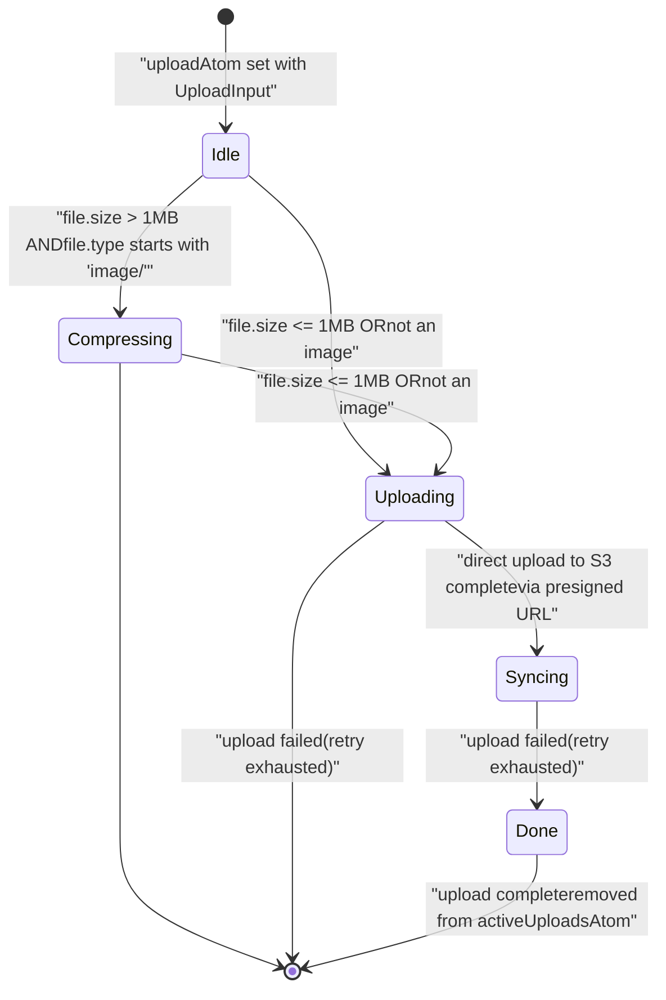
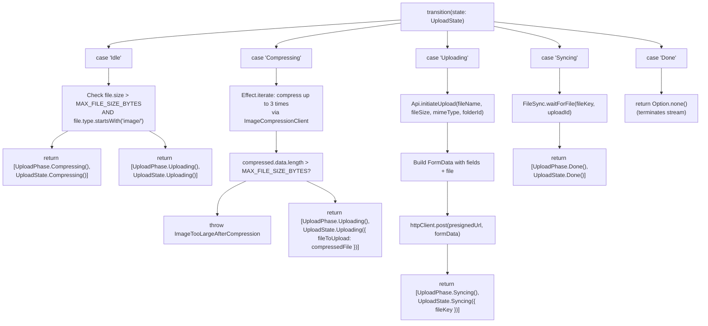
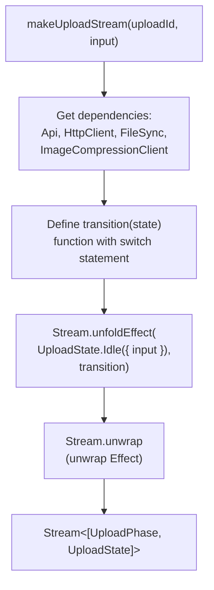
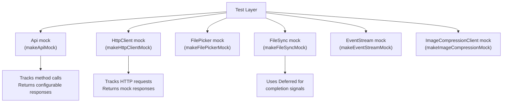
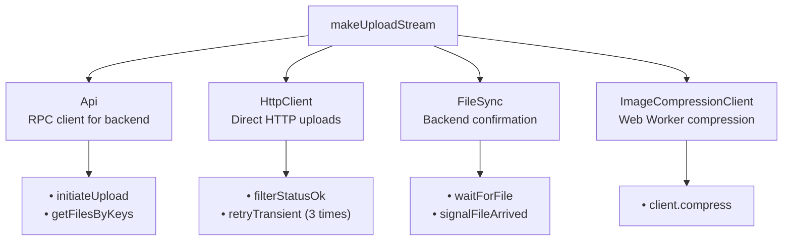

# Upload State Machine

> **Relevant source files**
> * [packages/client/src/routes/files/-files/files-atoms/files-atoms.test.ts](https://github.com/lucas-barake/effect-file-manager/blob/28eedd82/packages/client/src/routes/files/-files/files-atoms/files-atoms.test.ts)
> * [packages/client/src/routes/files/-files/files-atoms/files-atoms.tsx](https://github.com/lucas-barake/effect-file-manager/blob/28eedd82/packages/client/src/routes/files/-files/files-atoms/files-atoms.tsx)

## Purpose and Scope

This document describes the upload state machine, which manages the lifecycle of individual file uploads from initiation through completion. The state machine transitions files through distinct phases: compression (when necessary), uploading to storage, synchronizing with the backend, and completion.

For information about the UI components that display upload progress, see [Upload UI Component](/lucas-barake/effect-file-manager/4.4-upload-ui-component). For details about the image compression system invoked during the Compressing state, see [Image Compression System](/lucas-barake/effect-file-manager/4.2-image-compression-system). For information about the UploadThing integration used during the Uploading state, see [UploadThing Integration](/lucas-barake/effect-file-manager/4.3-uploadthing-integration).

---

## State Machine Architecture

The upload state machine is implemented using Effect Atoms with a stream-based state transition model. Each upload is managed by an independent instance of `uploadAtom`, part of an atom family that creates isolated state machines per upload ID.

### State Machine Diagram



**Sources:** [packages/client/src/routes/files/-files/files-atoms/files-atoms.tsx L121-L128](https://github.com/lucas-barake/effect-file-manager/blob/28eedd82/packages/client/src/routes/files/-files/files-atoms/files-atoms.tsx#L121-L128)

 [packages/client/src/routes/files/-files/files-atoms/files-atoms.tsx L286-L396](https://github.com/lucas-barake/effect-file-manager/blob/28eedd82/packages/client/src/routes/files/-files/files-atoms/files-atoms.tsx#L286-L396)

---

## Core Types and Data Structures

### UploadState Type

The `UploadState` type is a tagged enum that carries state-specific data through each phase:

| State Tag | Payload | Description |
| --- | --- | --- |
| `Idle` | `{ input: UploadInput }` | Initial state with original file and folder destination |
| `Compressing` | `{ input: UploadInput }` | Image compression in progress |
| `Uploading` | `{ input: UploadInput; fileToUpload: File }` | HTTP upload to S3; `fileToUpload` may be compressed |
| `Syncing` | `{ input: UploadInput; fileKey: string }` | Waiting for backend confirmation; `fileKey` is UploadThing key |
| `Done` | `{}` | Terminal state; upload complete |

**Sources:** [packages/client/src/routes/files/-files/files-atoms/files-atoms.tsx L121-L128](https://github.com/lucas-barake/effect-file-manager/blob/28eedd82/packages/client/src/routes/files/-files/files-atoms/files-atoms.tsx#L121-L128)

### UploadPhase Type

`UploadPhase` is a simpler tagged enum used for UI rendering. It omits the `Idle` state and is returned alongside `UploadState` during transitions:

```
type UploadPhase = Data.TaggedEnum<{
  Compressing: {};
  Uploading: {};
  Syncing: {};
  Done: {};
}>;
```

**Sources:** [packages/client/src/routes/files/-files/files-atoms/files-atoms.tsx L100-L106](https://github.com/lucas-barake/effect-file-manager/blob/28eedd82/packages/client/src/routes/files/-files/files-atoms/files-atoms.tsx#L100-L106)

### UploadInput Type

The input to the state machine contains the file and destination folder:

```
type UploadInput = {
  readonly file: File;
  readonly folderId: FolderId | null;
};
```

**Sources:** [packages/client/src/routes/files/-files/files-atoms/files-atoms.tsx L116-L119](https://github.com/lucas-barake/effect-file-manager/blob/28eedd82/packages/client/src/routes/files/-files/files-atoms/files-atoms.tsx#L116-L119)

---

## State Transition Logic

The state machine is implemented as a stream of `[UploadPhase, UploadState]` tuples produced by `Stream.unfoldEffect`. Each state transition is handled by the `transition` function within `makeUploadStream`.

### Transition Function Architecture



**Sources:** [packages/client/src/routes/files/-files/files-atoms/files-atoms.tsx L286-L396](https://github.com/lucas-barake/effect-file-manager/blob/28eedd82/packages/client/src/routes/files/-files/files-atoms/files-atoms.tsx#L286-L396)

---

## Detailed State Transitions

### Idle → Compressing or Uploading

The initial state evaluates file characteristics to determine whether compression is needed:

* **Condition for Compression:** `file.size > MAX_FILE_SIZE_BYTES` (1 MB) AND `file.type.startsWith("image/")`
* **Direct Upload:** Files ≤ 1 MB or non-image files skip compression

**Sources:** [packages/client/src/routes/files/-files/files-atoms/files-atoms.tsx L289-L305](https://github.com/lucas-barake/effect-file-manager/blob/28eedd82/packages/client/src/routes/files/-files/files-atoms/files-atoms.tsx#L289-L305)

### Compressing → Uploading

Image compression uses an iterative approach with up to 3 attempts:

1. Convert file to `Uint8Array` via `arrayBuffer()`
2. Use `Effect.iterate` to compress while `data.length > MAX_FILE_SIZE_BYTES` and `attempt < maxAttempts`
3. Call `ImageCompressionClient.compress()` with `maxSizeMB: 1`
4. If final size still exceeds 1 MB, fail with `ImageTooLargeAfterCompression`
5. Otherwise, create new `File` from compressed data and transition to Uploading

**Sources:** [packages/client/src/routes/files/-files/files-atoms/files-atoms.tsx L307-L351](https://github.com/lucas-barake/effect-file-manager/blob/28eedd82/packages/client/src/routes/files/-files/files-atoms/files-atoms.tsx#L307-L351)

### Uploading → Syncing

The uploading phase orchestrates the presigned URL pattern:

1. Call `Api.initiateUpload()` with file metadata (name, size, MIME type, folder ID)
2. Server returns `{ presignedUrl, fields, fileKey }`
3. Build `FormData` by appending all `fields` entries plus the file
4. Execute `httpClient.post(presignedUrl, { body: HttpBody.formData(formData) })`
5. On success, transition to Syncing with the `fileKey`

The HTTP client is configured with retry logic: 3 attempts with exponential backoff starting at 250ms (factor 1.5).

**Sources:** [packages/client/src/routes/files/-files/files-atoms/files-atoms.tsx L353-L373](https://github.com/lucas-barake/effect-file-manager/blob/28eedd82/packages/client/src/routes/files/-files/files-atoms/files-atoms.tsx#L353-L373)

 [packages/client/src/routes/files/-files/files-atoms/files-atoms.tsx L276-L282](https://github.com/lucas-barake/effect-file-manager/blob/28eedd82/packages/client/src/routes/files/-files/files-atoms/files-atoms.tsx#L276-L282)

### Syncing → Done

The synchronization phase waits for backend confirmation:

1. Call `FileSync.waitForFile(fileKey, uploadId)`
2. `FileSync` creates a `Deferred` and registers it in `completionSignals` map
3. Backend confirmation arrives via one of two mechanisms: * **Event stream:** `filesEventStreamAtom` receives `FilesEvent`, triggers `signalFileArrived()` * **Polling:** 5-second polling loop queries `Api.getFilesByKeys()` for files added >5s ago
4. When confirmed, `Deferred` completes and removes entry from `activeUploadsAtom`
5. Transition to Done

**Sources:** [packages/client/src/routes/files/-files/files-atoms/files-atoms.tsx L375-L380](https://github.com/lucas-barake/effect-file-manager/blob/28eedd82/packages/client/src/routes/files/-files/files-atoms/files-atoms.tsx#L375-L380)

 [packages/client/src/routes/files/-files/files-atoms/files-atoms.tsx L156-L169](https://github.com/lucas-barake/effect-file-manager/blob/28eedd82/packages/client/src/routes/files/-files/files-atoms/files-atoms.tsx#L156-L169)

 [packages/client/src/routes/files/-files/files-atoms/files-atoms.tsx L171-L191](https://github.com/lucas-barake/effect-file-manager/blob/28eedd82/packages/client/src/routes/files/-files/files-atoms/files-atoms.tsx#L171-L191)

### Done (Terminal State)

The Done state returns `Option.none()` from the transition function, which terminates the `Stream.unfoldEffect`. The upload is complete.

**Sources:** [packages/client/src/routes/files/-files/files-atoms/files-atoms.tsx L383-L385](https://github.com/lucas-barake/effect-file-manager/blob/28eedd82/packages/client/src/routes/files/-files/files-atoms/files-atoms.tsx#L383-L385)

---

## Implementation with Effect Atoms

### uploadAtom Family

The `uploadAtom` is an atom family that creates isolated state machines per upload ID:

```javascript
export const uploadAtom = Atom.family((uploadId: string) =>
  runtime.fn((input: UploadInput) => makeUploadStream(uploadId, input))
);
```

Each atom instance:

* Receives an `UploadInput` when set by the registry
* Returns a stream of `[UploadPhase, UploadState]` tuples
* Maintains independent state from other concurrent uploads

**Sources:** [packages/client/src/routes/files/-files/files-atoms/files-atoms.tsx L399-L401](https://github.com/lucas-barake/effect-file-manager/blob/28eedd82/packages/client/src/routes/files/-files/files-atoms/files-atoms.tsx#L399-L401)

### makeUploadStream Function

The core state machine implementation:



The function signature and structure:

```javascript
const makeUploadStream = (uploadId: string, input: UploadInput) =>
  Effect.gen(function* () {
    // 1. Acquire service dependencies
    const api = yield* Api;
    const httpClient = (yield* HttpClient.HttpClient).pipe(
      HttpClient.filterStatusOk,
      HttpClient.retryTransient({ times: 3, schedule: ... })
    );
    const fileSync = yield* FileSync;
    const imageCompression = yield* ImageCompressionClient;

    // 2. Define transition function
    const transition = (state: UploadState) => Effect.gen(function* () {
      switch (state._tag) {
        case "Idle": { /* ... */ }
        case "Compressing": { /* ... */ }
        case "Uploading": { /* ... */ }
        case "Syncing": { /* ... */ }
        case "Done": { return Option.none(); }
      }
    }).pipe(Effect.catchTags({ /* error handling */ }));

    // 3. Create stream
    return Stream.unfoldEffect(UploadState.Idle({ input }), transition);
  }).pipe(Stream.unwrap);
```

**Sources:** [packages/client/src/routes/files/-files/files-atoms/files-atoms.tsx L273-L397](https://github.com/lucas-barake/effect-file-manager/blob/28eedd82/packages/client/src/routes/files/-files/files-atoms/files-atoms.tsx#L273-L397)

---

## Error Handling

### Caught and Transformed Errors

The state machine catches specific error types and rethrows them as defects (dies):

| Error Type | Action | Reason |
| --- | --- | --- |
| `Unauthorized` | `Effect.die(e)` | Authentication failure should crash the upload |
| `RpcClientError` | `Effect.die(e)` | RPC infrastructure failure is unrecoverable |
| `RequestError` | `Effect.die(e)` | Network-level failure (no retry left) |
| `ResponseError` | `Effect.die(e)` | HTTP error after retries exhausted |

**Sources:** [packages/client/src/routes/files/-files/files-atoms/files-atoms.tsx L388-L394](https://github.com/lucas-barake/effect-file-manager/blob/28eedd82/packages/client/src/routes/files/-files/files-atoms/files-atoms.tsx#L388-L394)

### Custom Error Types

The state machine defines one custom error:

**`ImageTooLargeAfterCompression`** - Thrown when iterative compression fails to reduce file size below 1 MB after 3 attempts. Contains:

* `fileName: string`
* `originalSizeBytes: number`
* `compressedSizeBytes: number`

**Sources:** [packages/client/src/routes/files/-files/files-atoms/files-atoms.tsx L92-L98](https://github.com/lucas-barake/effect-file-manager/blob/28eedd82/packages/client/src/routes/files/-files/files-atoms/files-atoms.tsx#L92-L98)

 [packages/client/src/routes/files/-files/files-atoms/files-atoms.tsx L335-L341](https://github.com/lucas-barake/effect-file-manager/blob/28eedd82/packages/client/src/routes/files/-files/files-atoms/files-atoms.tsx#L335-L341)

---

## Cancellation

Uploads can be interrupted via `Atom.Interrupt`. The `cancelUploadAtom` runtime function handles cancellation:

```javascript
export const cancelUploadAtom = runtime.fn(
  Effect.fnUntraced(function* (uploadId: string) {
    const registry = yield* Registry.AtomRegistry;
    
    // Set atom to Interrupt signal
    registry.set(uploadAtom(uploadId), Atom.Interrupt);
    
    // Remove from active uploads UI
    registry.set(
      activeUploadsAtom,
      Arr.filter(registry.get(activeUploadsAtom), (u) => u.id !== uploadId)
    );
  })
);
```

When interrupted:

* The underlying Effect stream is interrupted
* All in-flight operations (compression, HTTP upload, sync waiting) are cancelled
* The atom enters an interrupted state (detectable via `Result.isInterrupted()`)
* The upload is removed from `activeUploadsAtom`

**Sources:** [packages/client/src/routes/files/-files/files-atoms/files-atoms.tsx L442-L452](https://github.com/lucas-barake/effect-file-manager/blob/28eedd82/packages/client/src/routes/files/-files/files-atoms/files-atoms.tsx#L442-L452)

---

## Testing the State Machine

### Test Layer Composition

Tests use Effect mock layers to isolate the state machine from real services:



**Sources:** [packages/client/src/routes/files/-files/files-atoms/files-atoms.test.ts L206-L235](https://github.com/lucas-barake/effect-file-manager/blob/28eedd82/packages/client/src/routes/files/-files/files-atoms/files-atoms.test.ts#L206-L235)

### Example Test: Complete Upload Flow

The test demonstrates a full upload lifecycle:

```javascript
it("completes upload flow for small text files", async () => {
  const file = createTestFile("test.txt", "test content", "text/plain");
  const { testLayer, apiCalls, httpCalls, triggerFileArrival } = makeTestLayer({ file });

  const r = Registry.make({
    initialValues: [Atom.initialValue(runtime.layer, testLayer)]
  });

  const uploadId = "test-upload-1";
  const upload = uploadAtom(uploadId);
  const unmount = r.mount(upload);

  // Start upload
  r.set(upload, { file, folderId: null });
  await vitest.advanceTimersByTimeAsync(0);
  
  // Should be in Uploading or Syncing state
  let result = r.get(upload);
  expect(["Uploading", "Syncing"]).toContain(result.value._tag);

  // Trigger file arrival
  await Effect.runPromise(triggerFileArrival(TEST_FILE_KEY));
  await vitest.advanceTimersByTimeAsync(0);

  // Should be Done
  result = r.get(upload);
  expect(result.value._tag).toBe("Done");

  // Verify API and HTTP calls
  expect(apiCalls.some((c) => c.method === "initiateUpload")).toBe(true);
  expect(httpCalls).toHaveLength(1);

  unmount();
});
```

**Sources:** [packages/client/src/routes/files/-files/files-atoms/files-atoms.test.ts L251-L285](https://github.com/lucas-barake/effect-file-manager/blob/28eedd82/packages/client/src/routes/files/-files/files-atoms/files-atoms.test.ts#L251-L285)

### Concurrent Upload Test

The state machine supports multiple concurrent uploads without interference:

```javascript
it("handles multiple concurrent uploads independently", async () => {
  // Create two separate upload atoms
  const upload1 = uploadAtom("upload-1");
  const upload2 = uploadAtom("upload-2");

  // Start both uploads
  r.set(upload1, { file: file1, folderId: null });
  r.set(upload2, { file: file2, folderId: null });

  // Cancel first upload
  r.set(upload1, Atom.Interrupt);

  // Verify upload1 is interrupted
  expect(Result.isInterrupted(r.get(upload1))).toBe(true);

  // Verify upload2 continues unaffected
  expect(Result.isSuccess(r.get(upload2))).toBe(true);
});
```

**Sources:** [packages/client/src/routes/files/-files/files-atoms/files-atoms.test.ts L314-L357](https://github.com/lucas-barake/effect-file-manager/blob/28eedd82/packages/client/src/routes/files/-files/files-atoms/files-atoms.test.ts#L314-L357)

---

## Active Uploads Tracking

The `activeUploadsAtom` maintains a list of uploads currently in progress for UI rendering:

```typescript
export const activeUploadsAtom = Atom.make<ReadonlyArray<ActiveUpload>>(Arr.empty());

export type ActiveUpload = {
  readonly id: string;
  readonly fileName: string;
  readonly fileSize: number;
  readonly mimeType: string;
  readonly folderId: FolderId | null;
};
```

### Lifecycle Management

| Event | Action |
| --- | --- |
| Upload starts | `startUploadAtom` adds entry to `activeUploadsAtom` |
| Upload completes | `FileSync.waitForFile` removes entry after confirmation |
| Upload cancelled | `cancelUploadAtom` removes entry immediately |

**Sources:** [packages/client/src/routes/files/-files/files-atoms/files-atoms.tsx L267-L268](https://github.com/lucas-barake/effect-file-manager/blob/28eedd82/packages/client/src/routes/files/-files/files-atoms/files-atoms.tsx#L267-L268)

 [packages/client/src/routes/files/-files/files-atoms/files-atoms.tsx L108-L114](https://github.com/lucas-barake/effect-file-manager/blob/28eedd82/packages/client/src/routes/files/-files/files-atoms/files-atoms.tsx#L108-L114)

 [packages/client/src/routes/files/-files/files-atoms/files-atoms.tsx L420-L435](https://github.com/lucas-barake/effect-file-manager/blob/28eedd82/packages/client/src/routes/files/-files/files-atoms/files-atoms.tsx#L420-L435)

 [packages/client/src/routes/files/-files/files-atoms/files-atoms.tsx L165-L169](https://github.com/lucas-barake/effect-file-manager/blob/28eedd82/packages/client/src/routes/files/-files/files-atoms/files-atoms.tsx#L165-L169)

---

## Service Dependencies

The state machine requires five Effect services:



All dependencies are provided via the `runtime` layer, which composes:

* `Api.Default` (with `DomainRpcClient.Default`)
* `FetchHttpClient.layer`
* `FilePicker.Default`
* `EventStream.Default`
* `FileSync.Default`
* `ImageCompressionClient.Default`

**Sources:** [packages/client/src/routes/files/-files/files-atoms/files-atoms.tsx L247-L256](https://github.com/lucas-barake/effect-file-manager/blob/28eedd82/packages/client/src/routes/files/-files/files-atoms/files-atoms.tsx#L247-L256)

 [packages/client/src/routes/files/-files/files-atoms/files-atoms.tsx L274-L284](https://github.com/lucas-barake/effect-file-manager/blob/28eedd82/packages/client/src/routes/files/-files/files-atoms/files-atoms.tsx#L274-L284)