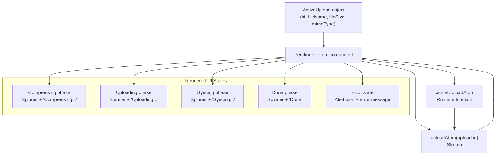
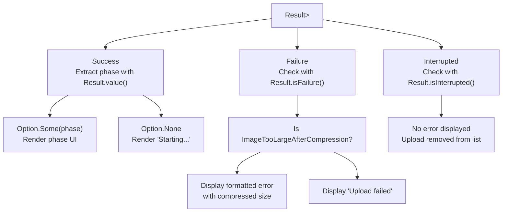
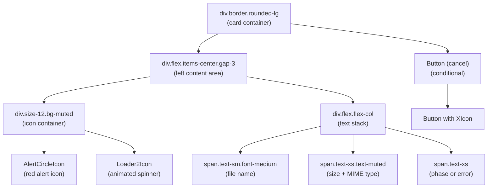
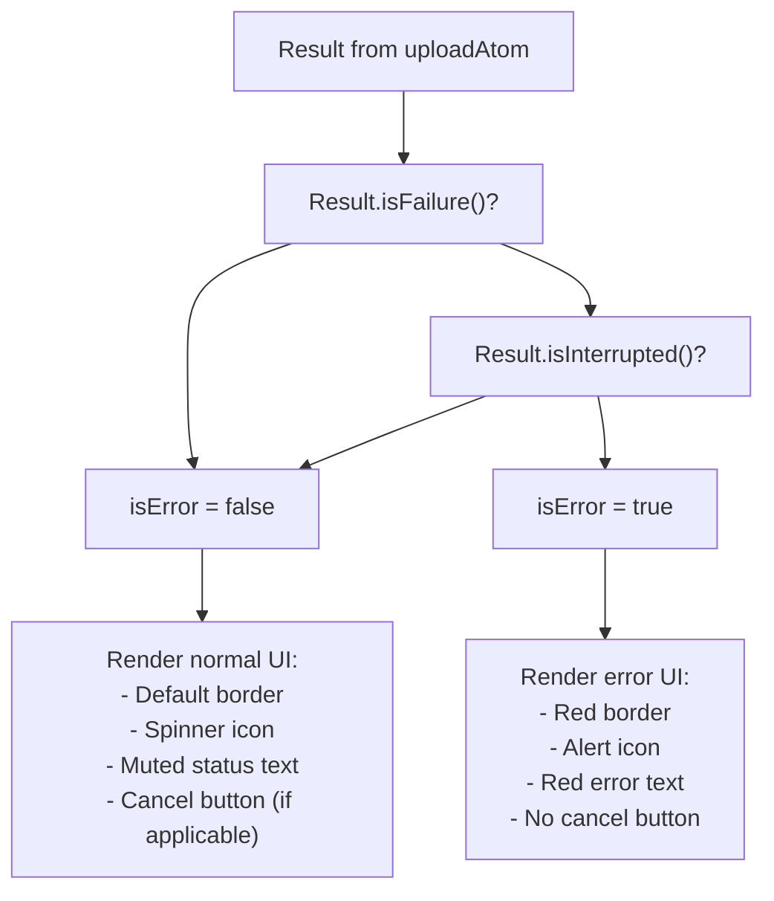
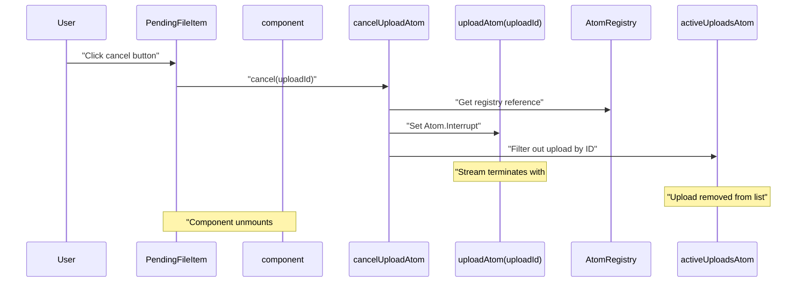
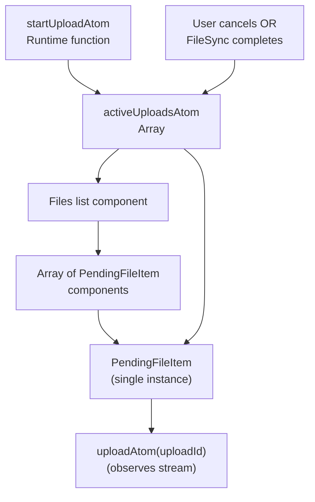

# Upload UI Component

> **Relevant source files**
> * [packages/client/src/routes/files/-files/file-item/pending-file-item.tsx](https://github.com/lucas-barake/effect-file-manager/blob/28eedd82/packages/client/src/routes/files/-files/file-item/pending-file-item.tsx)
> * [packages/client/src/routes/files/-files/files-atoms/files-atoms.tsx](https://github.com/lucas-barake/effect-file-manager/blob/28eedd82/packages/client/src/routes/files/-files/files-atoms/files-atoms.tsx)

## Purpose and Scope

The `PendingFileItem` component provides real-time visual feedback for file uploads in progress. It displays upload status, progress indicators, file metadata, and error messages while allowing users to cancel ongoing uploads. This component renders the UI layer for uploads tracked by the state machine described in [Upload State Machine](/lucas-barake/effect-file-manager/4.1-upload-state-machine).

For information about the underlying upload state transitions, see [Upload State Machine](/lucas-barake/effect-file-manager/4.1-upload-state-machine). For details on how presigned URLs are obtained and files are uploaded to S3, see [UploadThing Integration](/lucas-barake/effect-file-manager/4.3-uploadthing-integration). For the broader state management architecture, see [State Management with Effect Atoms](/lucas-barake/effect-file-manager/5-state-management-with-effect-atoms).

**Sources:** [packages/client/src/routes/files/-files/file-item/pending-file-item.tsx L1-L104](https://github.com/lucas-barake/effect-file-manager/blob/28eedd82/packages/client/src/routes/files/-files/file-item/pending-file-item.tsx#L1-L104)

---

## Component Architecture

The `PendingFileItem` component follows a reactive architecture pattern where UI state is derived from Effect Atoms rather than local React state. The component observes the upload state machine for a specific upload ID and renders appropriate UI elements based on the current phase and any errors.

### Component Data Flow



The component receives an `ActiveUpload` object containing immutable metadata (filename, size, MIME type). It then subscribes to the `uploadAtom` for that upload's unique ID to receive state updates. The atom returns a `Result` type that can represent success (with an `UploadPhase`), failure (with an error), or interruption (from cancellation).

**Sources:** [packages/client/src/routes/files/-files/file-item/pending-file-item.tsx L32-L42](https://github.com/lucas-barake/effect-file-manager/blob/28eedd82/packages/client/src/routes/files/-files/file-item/pending-file-item.tsx#L32-L42)

---

## State Observation Pattern

### Effect Atoms Integration

The component uses two Effect Atoms hooks from `@effect-atom/atom-react`:

| Hook | Purpose | Return Type |
| --- | --- | --- |
| `useAtomValue(uploadAtom(upload.id))` | Subscribe to upload state stream | `Result<Option<UploadPhase>>` |
| `useAtomSet(cancelUploadAtom)` | Get setter function for cancellation | `(uploadId: string) => void` |

The `uploadAtom` is an atom family (see [Core Atoms](/lucas-barake/effect-file-manager/5.1-core-atoms)), meaning it creates isolated state machines per upload ID. Each instance streams `UploadPhase` values as the upload progresses through its lifecycle.

### Result Type Handling



The component extracts the phase using `Option.getOrNull(Result.value(result))` at [packages/client/src/routes/files/-files/file-item/pending-file-item.tsx L40](https://github.com/lucas-barake/effect-file-manager/blob/28eedd82/packages/client/src/routes/files/-files/file-item/pending-file-item.tsx#L40-L40)

 This safely handles all three `Result` states:

* **Success**: Extract the `Option<UploadPhase>` and render the current phase
* **Failure**: Display error UI unless the result is interrupted (cancelled uploads)
* **Interrupted**: The upload was cancelled; `activeUploadsAtom` will remove it from the list

**Sources:** [packages/client/src/routes/files/-files/file-item/pending-file-item.tsx L37-L41](https://github.com/lucas-barake/effect-file-manager/blob/28eedd82/packages/client/src/routes/files/-files/file-item/pending-file-item.tsx#L37-L41)

 [packages/client/src/routes/files/-files/files-atoms/files-atoms.tsx L399-L401](https://github.com/lucas-barake/effect-file-manager/blob/28eedd82/packages/client/src/routes/files/-files/files-atoms/files-atoms.tsx#L399-L401)

---

## Visual States and Rendering Logic

### Phase-Based Status Labels

The component maps upload phases to human-readable status labels using a ternary chain:

| Phase | Status Label | Visual Indicator |
| --- | --- | --- |
| `Compressing` | "Compressing..." | Animated spinner |
| `Uploading` | "Uploading..." | Animated spinner |
| `Syncing` | "Syncing..." | Animated spinner |
| `Done` | "Done" | Animated spinner (transitions out) |
| `null` (starting) | "Starting..." | Animated spinner |
| Error | Error message | Red alert icon |

The status label determination logic is at [packages/client/src/routes/files/-files/file-item/pending-file-item.tsx L51-L62](https://github.com/lucas-barake/effect-file-manager/blob/28eedd82/packages/client/src/routes/files/-files/file-item/pending-file-item.tsx#L51-L62)

:

```
phase?._tag === "Compressing"
  ? "Compressing..."
  : phase?._tag === "Uploading"
    ? "Uploading..."
    : phase?._tag === "Syncing"
      ? "Syncing..."
      : phase?._tag === "Done"
        ? "Done"
        : isError
          ? errorMessage
          : "Starting..."
```

This pattern uses TypeScript's discriminated unions (the `_tag` property) to safely narrow the phase type.

### Component Visual Structure



The container's border color changes to `border-destructive` (red) when an error occurs, providing a visual boundary indicating failure at [packages/client/src/routes/files/-files/file-item/pending-file-item.tsx L65-L70](https://github.com/lucas-barake/effect-file-manager/blob/28eedd82/packages/client/src/routes/files/-files/file-item/pending-file-item.tsx#L65-L70)

**Sources:** [packages/client/src/routes/files/-files/file-item/pending-file-item.tsx L64-L104](https://github.com/lucas-barake/effect-file-manager/blob/28eedd82/packages/client/src/routes/files/-files/file-item/pending-file-item.tsx#L64-L104)

---

## Error Handling and Display

### Error Type Detection

The component distinguishes between two error scenarios:

1. **Specific typed errors**: `ImageTooLargeAfterCompression` from [packages/client/src/routes/files/-files/files-atoms/files-atoms.tsx L92-L98](https://github.com/lucas-barake/effect-file-manager/blob/28eedd82/packages/client/src/routes/files/-files/files-atoms/files-atoms.tsx#L92-L98)
2. **Generic failures**: Any other error during the upload pipeline

The error extraction uses Effect's `Option.pipe` with filtering at [packages/client/src/routes/files/-files/file-item/pending-file-item.tsx L43-L49](https://github.com/lucas-barake/effect-file-manager/blob/28eedd82/packages/client/src/routes/files/-files/file-item/pending-file-item.tsx#L43-L49)

:

```javascript
const errorMessage = Result.error(result).pipe(
  Option.filter((error): error is ImageTooLargeAfterCompression =>
    error instanceof ImageTooLargeAfterCompression,
  ),
  Option.map((error) => `Image too large (${formatFileSize(error.compressedSizeBytes)} after compression)`),
  Option.getOrElse(() => "Upload failed"),
);
```

### Compression Failure Messages

When image compression fails to reduce the file below the 1 MB threshold after 3 attempts, the `ImageTooLargeAfterCompression` error is thrown with:

* `fileName`: Original file name
* `originalSizeBytes`: Size before compression
* `compressedSizeBytes`: Size after maximum compression attempts

The component displays this as: `"Image too large (1.2 MB after compression)"` using the `formatFileSize` utility.

### Error State Determination



The logic at [packages/client/src/routes/files/-files/file-item/pending-file-item.tsx L41](https://github.com/lucas-barake/effect-file-manager/blob/28eedd82/packages/client/src/routes/files/-files/file-item/pending-file-item.tsx#L41-L41)

 ensures cancelled uploads (interrupted results) are not treated as errors: `Result.isFailure(result) && !Result.isInterrupted(result)`.

**Sources:** [packages/client/src/routes/files/-files/file-item/pending-file-item.tsx L43-L49](https://github.com/lucas-barake/effect-file-manager/blob/28eedd82/packages/client/src/routes/files/-files/file-item/pending-file-item.tsx#L43-L49)

 [packages/client/src/routes/files/-files/files-atoms/files-atoms.tsx L92-L98](https://github.com/lucas-barake/effect-file-manager/blob/28eedd82/packages/client/src/routes/files/-files/files-atoms/files-atoms.tsx#L92-L98)

---

## User Interactions

### Upload Cancellation

The cancel button appears conditionally only during the `Compressing` and `Uploading` phases at [packages/client/src/routes/files/-files/file-item/pending-file-item.tsx L97-L101](https://github.com/lucas-barake/effect-file-manager/blob/28eedd82/packages/client/src/routes/files/-files/file-item/pending-file-item.tsx#L97-L101)

:

```javascript
{(phase?._tag === "Compressing" || phase?._tag === "Uploading") && (
  <Button variant="ghost" size="icon" className="size-8" onClick={() => cancel(upload.id)}>
    <XIcon className="size-4" />
  </Button>
)}
```

Once the upload reaches the `Syncing` phase, cancellation is no longer possible because:

1. The file has already been uploaded to S3
2. The server is waiting for confirmation that the file is queryable
3. Cancelling at this point would leave orphaned data

### Cancellation Flow



The `cancelUploadAtom` runtime function at [packages/client/src/routes/files/-files/files-atoms/files-atoms.tsx L442-L452](https://github.com/lucas-barake/effect-file-manager/blob/28eedd82/packages/client/src/routes/files/-files/files-atoms/files-atoms.tsx#L442-L452)

 performs two operations:

1. Sets the upload atom to `Atom.Interrupt`, terminating the stream
2. Removes the upload from `activeUploadsAtom`, causing React to unmount the component

**Sources:** [packages/client/src/routes/files/-files/file-item/pending-file-item.tsx L97-L101](https://github.com/lucas-barake/effect-file-manager/blob/28eedd82/packages/client/src/routes/files/-files/file-item/pending-file-item.tsx#L97-L101)

 [packages/client/src/routes/files/-files/files-atoms/files-atoms.tsx L442-L452](https://github.com/lucas-barake/effect-file-manager/blob/28eedd82/packages/client/src/routes/files/-files/files-atoms/files-atoms.tsx#L442-L452)

---

## File Metadata Display

### File Size Formatting

The `formatFileSize` utility function at [packages/client/src/routes/files/-files/file-item/pending-file-item.tsx L14-L30](https://github.com/lucas-barake/effect-file-manager/blob/28eedd82/packages/client/src/routes/files/-files/file-item/pending-file-item.tsx#L14-L30)

 converts bytes to human-readable format:

| Input Bytes | Output Format | Notes |
| --- | --- | --- |
| 0 | `"0 B"` | Special case |
| 1-1023 | `"123 B"` | Bytes |
| 1024-1048575 | `"12.3 KB"` or `"123 KB"` | Kilobytes (1 decimal if < 10) |
| 1048576-1073741823 | `"1.2 MB"` or `"123 MB"` | Megabytes |
| 1073741824+ | `"1.2 GB"`, `"1.2 TB"`, `"1.2 PB"` | Larger units |

The algorithm:

1. Divides by 1024 repeatedly until the value is less than 1024
2. Uses one decimal place for values < 10, zero decimals for values ≥ 10
3. Appends the appropriate unit suffix

This formatting is used in both:

* The file metadata display: `"2.4 MB • image/jpeg"`
* Error messages: `"Image too large (1.2 MB after compression)"`

### Metadata Rendering

The file metadata line at [packages/client/src/routes/files/-files/file-item/pending-file-item.tsx L83-L85](https://github.com/lucas-barake/effect-file-manager/blob/28eedd82/packages/client/src/routes/files/-files/file-item/pending-file-item.tsx#L83-L85)

 displays:

```
{formatFileSize(upload.fileSize)} • {upload.mimeType}
```

The `ActiveUpload` object provides this immutable metadata that doesn't change during the upload process:

```
type ActiveUpload = {
  readonly id: string;           // UUID for this upload
  readonly fileName: string;      // Original filename
  readonly fileSize: number;      // Original size in bytes
  readonly mimeType: string;      // MIME type (e.g., "image/jpeg")
  readonly folderId: FolderId | null;  // Target folder
};
```

The filename is truncated using `truncate` utility class, while the metadata row uses `text-xs` and `text-muted-foreground` for visual hierarchy.

**Sources:** [packages/client/src/routes/files/-files/file-item/pending-file-item.tsx L14-L30](https://github.com/lucas-barake/effect-file-manager/blob/28eedd82/packages/client/src/routes/files/-files/file-item/pending-file-item.tsx#L14-L30)

 [packages/client/src/routes/files/-files/file-item/pending-file-item.tsx L81-L85](https://github.com/lucas-barake/effect-file-manager/blob/28eedd82/packages/client/src/routes/files/-files/file-item/pending-file-item.tsx#L81-L85)

 [packages/client/src/routes/files/-files/files-atoms/files-atoms.tsx L108-L114](https://github.com/lucas-barake/effect-file-manager/blob/28eedd82/packages/client/src/routes/files/-files/files-atoms/files-atoms.tsx#L108-L114)

---

## Component Lifecycle Integration

### Relationship to Active Uploads Atom



The `PendingFileItem` component exists only as long as the upload is tracked in `activeUploadsAtom`. Two scenarios remove an upload from this atom:

1. **User cancellation**: `cancelUploadAtom` immediately filters the upload out at [packages/client/src/routes/files/-files/files-atoms/files-atoms.tsx L447-L450](https://github.com/lucas-barake/effect-file-manager/blob/28eedd82/packages/client/src/routes/files/-files/files-atoms/files-atoms.tsx#L447-L450)
2. **Successful completion**: `FileSync.waitForFile` removes the upload after the file is confirmed queryable at [packages/client/src/routes/files/-files/files-atoms/files-atoms.tsx L165-L169](https://github.com/lucas-barake/effect-file-manager/blob/28eedd82/packages/client/src/routes/files/-files/files-atoms/files-atoms.tsx#L165-L169)

### Parent Component Integration

The `PendingFileItem` component is rendered by mapping over `activeUploadsAtom` in the files list view. Each upload gets a unique component instance that independently observes its own `uploadAtom(upload.id)` stream. This isolation ensures:

* Concurrent uploads don't interfere with each other
* Each upload's UI updates independently
* Failed uploads don't affect others
* Cancelling one upload doesn't disrupt others

**Sources:** [packages/client/src/routes/files/-files/files-atoms/files-atoms.tsx L267](https://github.com/lucas-barake/effect-file-manager/blob/28eedd82/packages/client/src/routes/files/-files/files-atoms/files-atoms.tsx#L267-L267)

 [packages/client/src/routes/files/-files/files-atoms/files-atoms.tsx L442-L452](https://github.com/lucas-barake/effect-file-manager/blob/28eedd82/packages/client/src/routes/files/-files/files-atoms/files-atoms.tsx#L442-L452)

 [packages/client/src/routes/files/-files/files-atoms/files-atoms.tsx L165-L169](https://github.com/lucas-barake/effect-file-manager/blob/28eedd82/packages/client/src/routes/files/-files/files-atoms/files-atoms.tsx#L165-L169)