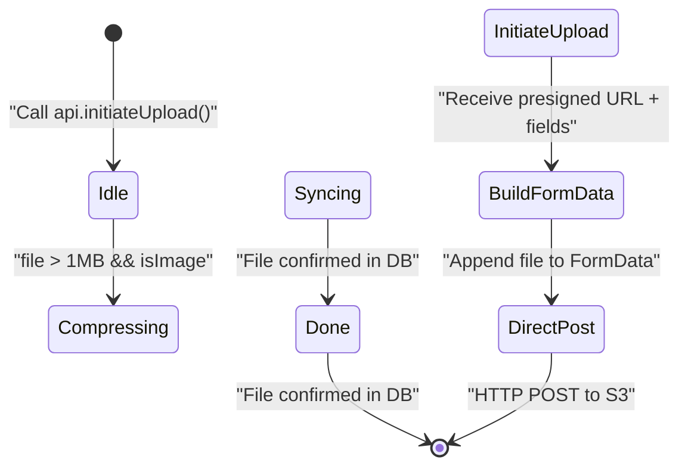

# UploadThing Integration

> **Relevant source files**
> * [.env.example](https://github.com/lucas-barake/effect-file-manager/blob/28eedd82/.env.example)
> * [packages/client/src/routes/files/-files/files-atoms/files-atoms.tsx](https://github.com/lucas-barake/effect-file-manager/blob/28eedd82/packages/client/src/routes/files/-files/files-atoms/files-atoms.tsx)

## Purpose and Scope

This document explains how UploadThing is integrated into the Effect File Manager to enable secure, scalable file uploads. The integration implements a **presigned URL pattern** where the server acts as a security coordinator while file data flows directly from client to S3-compatible storage, bypassing the server entirely.

For information about the complete upload pipeline and state transitions, see [Upload State Machine](/lucas-barake/effect-file-manager/4.1-upload-state-machine). For the broader file upload architecture, see [File Upload System](/lucas-barake/effect-file-manager/4-file-upload-system).

**Sources:** High-level system architecture diagrams, [packages/client/src/routes/files/-files/files-atoms/files-atoms.tsx L1-L781](https://github.com/lucas-barake/effect-file-manager/blob/28eedd82/packages/client/src/routes/files/-files/files-atoms/files-atoms.tsx#L1-L781)

---

## Overview of the Presigned URL Pattern

The Effect File Manager uses UploadThing as a **presigned URL provider** rather than a file proxy. The server never handles file data directly. Instead, the upload flow follows this pattern:

1. Client requests upload credentials from the server
2. Server obtains a presigned URL from UploadThing
3. Server returns presigned URL and form fields to client
4. Client uploads file data directly to S3 using the presigned URL

This architecture provides several benefits:

* **Scalability**: Server bandwidth is not consumed by file transfers
* **Performance**: Direct client-to-S3 upload reduces latency
* **Security**: Presigned URLs are time-limited and scope-limited
* **Cost efficiency**: Server infrastructure scales independently of upload volume

**Sources:** High-level architecture diagram analysis, [packages/client/src/routes/files/-files/files-atoms/files-atoms.tsx L353-L372](https://github.com/lucas-barake/effect-file-manager/blob/28eedd82/packages/client/src/routes/files/-files/files-atoms/files-atoms.tsx#L353-L372)

---

## Upload Flow Architecture

```mermaid
sequenceDiagram
  participant Client
  participant (Upload State Machine)
  participant Api Service
  participant Server RPC Handler
  participant UploadThing API
  participant S3-Compatible Storage

  Client->>Api Service: "initiateUpload(fileName, size, mimeType, folderId)"
  Api Service->>Server RPC Handler: "files_initiateUpload RPC"
  Server RPC Handler->>UploadThing API: "Request presigned URL"
  UploadThing API-->>Server RPC Handler: "{ presignedUrl, fields, fileKey }"
  Server RPC Handler-->>Api Service: "Return credentials"
  Api Service-->>Client: "{ presignedUrl, fields, fileKey }"
  note over Client,(Upload State Machine): "Build FormData with fields + file"
  Client->>S3-Compatible Storage: "HTTP POST to presignedUrl"
  S3-Compatible Storage-->>Client: "Upload complete (200 OK)"
  note over Client,(Upload State Machine): "Transition to Syncing state"
```

**Diagram: Direct Upload Flow with Presigned URLs**

This sequence diagram shows the separation of concerns: the server handles authentication and authorization to obtain presigned URLs, while the client handles the actual file transfer directly to S3.

**Sources:** [packages/client/src/routes/files/-files/files-atoms/files-atoms.tsx L353-L367](https://github.com/lucas-barake/effect-file-manager/blob/28eedd82/packages/client/src/routes/files/-files/files-atoms/files-atoms.tsx#L353-L367)

 High-level sequence diagram 2

---

## The InitiateUpload RPC

The client initiates the upload process by calling the `initiateUpload` method on the `Api` service. This method is defined as an RPC call to the server.

### RPC Interface

The `InitiateUploadRpc` is imported from the shared domain package and defines the contract between client and server:

```

```

The RPC payload includes:

* `fileName`: Original file name
* `fileSize`: File size in bytes (used for quota validation)
* `mimeType`: MIME type of the file
* `folderId`: Target folder ID (nullable for root-level uploads)

The RPC returns:

* `presignedUrl`: The URL to POST the file to
* `fields`: A key-value map of form fields required by the presigned URL
* `fileKey`: A unique identifier for tracking the uploaded file

**Sources:** [packages/client/src/routes/files/-files/files-atoms/files-atoms.tsx L18](https://github.com/lucas-barake/effect-file-manager/blob/28eedd82/packages/client/src/routes/files/-files/files-atoms/files-atoms.tsx#L18-L18)

 [packages/client/src/routes/files/-files/files-atoms/files-atoms.tsx L49-L50](https://github.com/lucas-barake/effect-file-manager/blob/28eedd82/packages/client/src/routes/files/-files/files-atoms/files-atoms.tsx#L49-L50)

 [packages/client/src/routes/files/-files/files-atoms/files-atoms.tsx L354-L359](https://github.com/lucas-barake/effect-file-manager/blob/28eedd82/packages/client/src/routes/files/-files/files-atoms/files-atoms.tsx#L354-L359)

---

## Api Service Integration

The `Api` service wraps the RPC client and provides a typed interface for the upload initiation:

```

```

The `initiateUpload` method at [packages/client/src/routes/files/-files/files-atoms/files-atoms.tsx L49-L50](https://github.com/lucas-barake/effect-file-manager/blob/28eedd82/packages/client/src/routes/files/-files/files-atoms/files-atoms.tsx#L49-L50)

 delegates to the underlying RPC client:

```

```

This service is injected into the upload state machine via Effect's dependency injection system, ensuring testability and separation of concerns.

**Sources:** [packages/client/src/routes/files/-files/files-atoms/files-atoms.tsx L41-L64](https://github.com/lucas-barake/effect-file-manager/blob/28eedd82/packages/client/src/routes/files/-files/files-atoms/files-atoms.tsx#L41-L64)

---

## Direct Upload Implementation

The direct upload to S3 occurs in the "Uploading" state of the upload state machine. The implementation at [packages/client/src/routes/files/-files/files-atoms/files-atoms.tsx L353-L372](https://github.com/lucas-barake/effect-file-manager/blob/28eedd82/packages/client/src/routes/files/-files/files-atoms/files-atoms.tsx#L353-L372)

 follows these steps:

### Step 1: Obtain Presigned Credentials

```

```

The server returns the presigned URL, form fields, and a file key for tracking.

### Step 2: Build FormData

```

```

The `fields` object contains metadata required by the S3 presigned URL, such as:

* Policy documents
* Signatures
* Access keys
* Content type restrictions

The file is appended last, as required by S3 multipart form uploads.

### Step 3: Direct HTTP POST

```

```

The upload is performed using Effect's `HttpClient` service with:

* **Automatic retry**: Transient failures are retried 3 times with exponential backoff (configured at [packages/client/src/routes/files/-files/files-atoms/files-atoms.tsx L277-L281](https://github.com/lucas-barake/effect-file-manager/blob/28eedd82/packages/client/src/routes/files/-files/files-atoms/files-atoms.tsx#L277-L281) )
* **Status validation**: Non-OK responses trigger errors via `filterStatusOk` at [packages/client/src/routes/files/-files/files-atoms/files-atoms.tsx L277](https://github.com/lucas-barake/effect-file-manager/blob/28eedd82/packages/client/src/routes/files/-files/files-atoms/files-atoms.tsx#L277-L277)

**Sources:** [packages/client/src/routes/files/-files/files-atoms/files-atoms.tsx L353-L367](https://github.com/lucas-barake/effect-file-manager/blob/28eedd82/packages/client/src/routes/files/-files/files-atoms/files-atoms.tsx#L353-L367)

 [packages/client/src/routes/files/-files/files-atoms/files-atoms.tsx L275-L282](https://github.com/lucas-barake/effect-file-manager/blob/28eedd82/packages/client/src/routes/files/-files/files-atoms/files-atoms.tsx#L275-L282)

---

## HttpClient Configuration

The `HttpClient` used for direct uploads is configured with retry and error handling policies:

| Configuration | Value | Purpose |
| --- | --- | --- |
| Status Filter | `filterStatusOk` | Ensures only 2xx responses are treated as success |
| Retry Strategy | `retryTransient` | Handles network failures and 5xx errors |
| Retry Times | 3 | Maximum number of retry attempts |
| Retry Schedule | Exponential backoff | Starts at 250ms, multiplies by 1.5 each attempt |

The configuration at [packages/client/src/routes/files/-files/files-atoms/files-atoms.tsx L276-L281](https://github.com/lucas-barake/effect-file-manager/blob/28eedd82/packages/client/src/routes/files/-files/files-atoms/files-atoms.tsx#L276-L281)

 creates a resilient upload client:

```

```

This ensures that temporary failures (network issues, S3 throttling) don't cause upload failures.

**Sources:** [packages/client/src/routes/files/-files/files-atoms/files-atoms.tsx L276-L281](https://github.com/lucas-barake/effect-file-manager/blob/28eedd82/packages/client/src/routes/files/-files/files-atoms/files-atoms.tsx#L276-L281)

---

## Environment Configuration

UploadThing integration requires a secret key for server-side authentication with the UploadThing API.

### Required Environment Variable

| Variable | Example | Location | Purpose |
| --- | --- | --- | --- |
| `UPLOADTHING_SECRET` | `sk_live_xxxxx` | Server | Authenticates with UploadThing API to generate presigned URLs |

The secret is configured on the server side only. The client never has direct access to UploadThing credentials.

### Example Configuration

```

```

The client does not require any UploadThing-specific configuration since all UploadThing interaction is mediated through the server's RPC interface.

**Sources:** [.env.example L10](https://github.com/lucas-barake/effect-file-manager/blob/28eedd82/.env.example#L10-L10)

---

## Integration with Upload State Machine

The UploadThing integration is embedded in the "Uploading" state of the upload state machine at [packages/client/src/routes/files/-files/files-atoms/files-atoms.tsx L353-L372](https://github.com/lucas-barake/effect-file-manager/blob/28eedd82/packages/client/src/routes/files/-files/files-atoms/files-atoms.tsx#L353-L372)

### State Transition Flow



**Diagram: UploadThing Integration within State Machine**

The "Uploading" state encapsulates the entire UploadThing interaction:

1. Requests presigned URL from server
2. Builds multipart form data
3. Posts directly to S3
4. Transitions to "Syncing" to await backend confirmation

**Sources:** [packages/client/src/routes/files/-files/files-atoms/files-atoms.tsx L286-L394](https://github.com/lucas-barake/effect-file-manager/blob/28eedd82/packages/client/src/routes/files/-files/files-atoms/files-atoms.tsx#L286-L394)

---

## Error Handling

The upload implementation handles errors through Effect's typed error system. Specific error tags are caught and converted:

```

```

At [packages/client/src/routes/files/-files/files-atoms/files-atoms.tsx L388-L393](https://github.com/lucas-barake/effect-file-manager/blob/28eedd82/packages/client/src/routes/files/-files/files-atoms/files-atoms.tsx#L388-L393)

 these errors are promoted to defects since they represent unrecoverable failures in the upload pipeline.

### Error Categories

| Error Type | Source | Handling Strategy |
| --- | --- | --- |
| `Unauthorized` | RPC authentication failure | Die (defect) - indicates configuration issue |
| `RpcClientError` | RPC transport failure | Die (defect) - indicates system-level failure |
| `RequestError` | HTTP client request failure | Die (defect) - indicates network-level failure |
| `ResponseError` | Non-OK HTTP status | Die (defect) after retry exhaustion |

All these errors cause the upload atom stream to fail, which the UI can observe and display to the user via the `PendingFileItem` component (see [Upload UI Component](/lucas-barake/effect-file-manager/4.4-upload-ui-component)).

**Sources:** [packages/client/src/routes/files/-files/files-atoms/files-atoms.tsx L388-L393](https://github.com/lucas-barake/effect-file-manager/blob/28eedd82/packages/client/src/routes/files/-files/files-atoms/files-atoms.tsx#L388-L393)

---

## Why Not Proxy Through Server?

The presigned URL pattern is chosen over a traditional server-proxied upload for several architectural reasons:

### Scalability

* **Server bandwidth**: Does not scale linearly with file size or upload volume
* **Horizontal scaling**: Server instances handle only RPC requests, not file data
* **Cost efficiency**: Infrastructure costs grow with computation, not storage transfer

### Performance

* **Reduced latency**: Eliminates server hop for file data
* **CDN integration**: S3-compatible storage often includes CDN functionality
* **Parallel uploads**: Client can upload directly to geographically optimal storage

### Security

* **Time-limited credentials**: Presigned URLs expire after a short period
* **Scope-limited access**: Each URL grants write-only access to a single object
* **No credential exposure**: Server credentials never reach the client

### Architecture Purity

The server's role is pure coordination: it validates the user's permission to upload, obtains the necessary credentials, and returns them. The actual data transfer is a separate concern handled by specialized infrastructure (S3).

**Sources:** High-level architecture diagram analysis

---

## Summary

The UploadThing integration implements a presigned URL pattern with these key characteristics:

| Aspect | Implementation |
| --- | --- |
| **Coordination** | Server RPC call to `files_initiateUpload` |
| **Authentication** | `UPLOADTHING_SECRET` on server side |
| **Data Transfer** | Direct HTTP POST from client to S3 |
| **Error Handling** | Automatic retry with exponential backoff |
| **State Integration** | "Uploading" phase of upload state machine |
| **Security** | Time-limited, scope-limited presigned URLs |

The next phase after successful upload is synchronization, where the system waits for the uploaded file to be confirmed in the database. For details on this phase, see [Real-time Synchronization](/lucas-barake/effect-file-manager/6-real-time-synchronization).

**Sources:** [packages/client/src/routes/files/-files/files-atoms/files-atoms.tsx L353-L367](https://github.com/lucas-barake/effect-file-manager/blob/28eedd82/packages/client/src/routes/files/-files/files-atoms/files-atoms.tsx#L353-L367)

 [.env.example L10](https://github.com/lucas-barake/effect-file-manager/blob/28eedd82/.env.example#L10-L10)